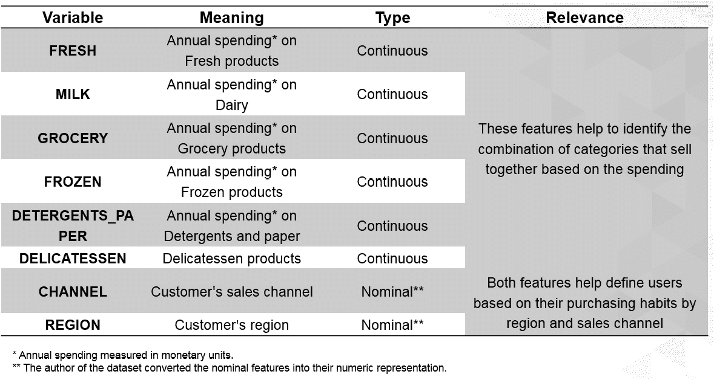

# 2。无监督学习——现实生活中的应用

概观

本章解释了机器学习中聚类的概念。它解释了三种最常见的聚类算法，并提供了解决实际数据问题的实用方法。学完本章后，您应该对如何使用 k-means、mean-shift 和 DBSCAN 算法从数据集创建聚类有了深入的了解，并且能够测量这些聚类的准确性。

# 简介

在前一章中，我们学习了如何以表格格式表示数据，创建特征和目标矩阵，预处理数据，以及如何选择最适合当前问题的算法。我们还了解了 scikit-learn API 如何工作，为什么它易于使用，以及监督学习和非监督学习之间的区别。

这一章集中在无监督学习领域中最重要的任务:聚类。考虑这样一种情况，你是一家商店的老板，想要开展一场有针对性的社交媒体活动，向某些客户推销选定的产品。使用聚类算法，您将能够创建您的客户的子群，允许您对这些子群进行分析，并相应地锁定他们。本章的主要目标是解决一个案例研究，在这里你将实现三种不同的无监督学习解决方案。这些不同的应用用于展示 scikit-learn API 的一致性，以及解释解决机器学习问题所采取的步骤。本章结束时，你将能够理解使用无监督学习来理解数据，以便做出明智的决定。

# 群聚

**聚类**是一种无监督学习技术，其目标是根据在无标签输入数据中发现的模式得出结论。这种技术主要用于将大量数据分成子组，以便做出明智的决策。

例如，从一个城市的大型餐馆列表中，根据食物类型、客户数量和体验风格将数据分成子组(集群)会很有用，以便能够为每个集群提供根据其特定需求配置的服务。

聚类算法将数据点分成 *n* 个簇，使得同一簇中的数据点具有相似的特征，而它们与其他簇中的数据点显著不同。

## 聚类类型

聚类算法可以使用硬**或软**的方法对数据点进行分类。前者将数据点完全指定给一个聚类，而后者计算每个数据点属于每个聚类的概率。例如，对于包含划分为八个子组(分类)的客户过去订单的数据集，当每个客户都位于八个分类之一时，就会发生硬分类。另一方面，软聚类为每个客户分配属于八个聚类中的每一个的概率。****

考虑到聚类是基于数据点之间的相似性而创建的，聚类分析算法可以进一步划分为几个组，这取决于用于度量相似性的规则集。四组最常见的规则解释如下:

*   **基于连通性的模型**:该模型的相似性方法基于数据空间中的邻近性。可以通过将所有数据点分配给单个聚类，然后随着数据点之间距离的增加将数据划分为更小的聚类来创建聚类。同样，该算法也可以从给每个数据点分配一个单独的聚类开始，然后聚集附近的数据点。基于连通性的模型的一个例子是分层聚类。
*   **基于密度的模型**:顾名思义，这些模型通过数据空间中的密度来定义聚类。这意味着具有高密度数据点的区域将成为聚类，这些聚类通常被低密度区域彼此分隔开。这方面的一个例子是 DBSCAN 算法，这将在本章后面讨论。
*   **基于分布的模型**:属于这一类别的模型基于一个聚类中所有数据点遵循相同分布的概率，例如高斯分布。这种模型的一个例子是高斯混合算法，该算法假设所有数据点来自有限数量的高斯分布的混合。
*   **基于质心的模型**:这些模型基于为每个聚类定义质心的算法，通过迭代过程不断更新。数据点被分配到聚类中，在聚类中它们与质心的接近度最小。这种模型的一个例子是 k-means 算法，这将在本章后面讨论。

总之，数据点基于它们彼此的相似性以及它们与其他聚类中的数据点的差异被分配到聚类中。通过确定每个数据点属于每个聚类的概率，这种聚类分类可以是绝对的，也可以是可变分布的。

而且，没有一套固定的规则来确定数据点之间的相似性，这就是为什么不同的聚类算法使用不同的规则。一些最常见的规则集是基于连通性的、基于密度的、基于分布的和基于质心的。

## 聚类的应用

与所有机器学习算法一样，聚类在不同领域有许多应用，其中一些如下:

*   **搜索引擎结果**:聚类可以用来生成包含与用户搜索的关键词相近的关键词的搜索引擎结果，并按照相似度较大的搜索结果排序。以谷歌为例；它使用聚类不仅检索结果，而且建议新的可能的搜索。
*   **推荐程序**:它也可以用于聚集在一起的推荐程序，例如，属于相似档案的人，然后根据每个成员购买的产品进行推荐。以亚马逊为例，它会根据你的购买历史和类似用户的购买情况推荐更多商品。
*   **图像识别**:这是使用聚类对被认为相似的图像进行分组的地方。例如，脸书使用聚类来帮助暗示照片中的人是谁。
*   **市场细分**:聚类也可用于市场细分，将一系列潜在客户或客户划分为子群，以提供定制的体验或产品。例如，Adobe 使用聚类分析对客户进行细分，以便通过识别那些更愿意花钱的人来确定不同的目标客户。

前面的示例说明了聚类分析算法可用于解决不同行业中的不同数据问题，其主要目的是了解大量历史数据，在某些情况下，这些数据可用于对新实例进行分类。

# 探索数据集——批发客户数据集

作为学习聚类算法的行为和应用的过程的一部分，本章的以下部分将集中于使用批发客户数据集解决现实生活中的数据问题，该数据集可在 UC Irvine 机器学习存储库中获得。

注意

存储库中的数据集可能包含原始数据、部分预处理数据或预处理数据。要使用这些数据集，请确保您阅读了可用数据的规范，以了解有效建模数据所需遵循的过程，或者它是否是适合您的目的的数据集。

例如，当前数据集是从一个更大的数据集中提取的，如以下引文所示:

该数据集来源于一个更大的数据库，参见:Abreu，N. (2011)。完善的客户调查分析和推广系统。梅斯特拉多 em 营销，ISCTE-IUL，里斯本。

在下一节中，我们将分析数据集的内容，这些内容将在*活动 2.01* 、*中使用，使用数据可视化来辅助预处理过程*。要从 UC Irvine 机器学习库下载数据集，请执行以下步骤:

1.  进入以下链接:[http://archive.ics.uci.edu/ml/datasets/Wholesale+customers](http://archive.ics.uci.edu/ml/datasets/Wholesale+customers)。
2.  在数据集标题下面，找到下载部分并点击`Data Folder`。
3.  Click on the `Wholesale Customers data.csv` file to trigger the download and save the file in the same path as that of your current Jupyter Notebook.

    注意

    你也可以通过这本书的 GitHub 知识库来访问它:[https://packt.live/3c3hfKp](https://packt.live/3c3hfKp )

## 了解数据集

将对每个步骤进行一般性解释，然后解释其在当前案例研究(批发客户数据集)中的应用:

1.  First of all, it is crucial to understand the way in which data is presented by the person who's responsible for gathering and maintaining it.

    考虑到案例研究的数据集是从一个在线存储库中获得的，因此必须理解其呈现的格式。批发客户数据集由来自批发分销商的客户历史数据片段组成。它总共包含 440 个实例(每行)和八个特性(每列)。

2.  Next, it is important to determine the purpose of the study, which is dependent on the data that's available. Even though this might seem like a redundant statement, many data problems become problematic because the researcher does not have a clear view of the purpose of the study, and hence the pre-processing methodology, the model, and the performance metrics are chosen incorrectly.

    对批发客户数据集使用聚类算法的目的是了解每个客户的行为。这将允许您将具有相似行为的客户分组到一个集群中。客户的行为将由他们在每类产品上的花费以及他们购买产品的渠道和地区来定义。

3.  Subsequently explore all the features that are available. This is mainly done for two reasons: first, to rule out features that are considered to be of low relevance based on the purpose of the study or that are considered to be redundant, and second, to understand the way the values are presented to determine some of the pre-processing techniques that may be needed.

    当前的案例研究有八个特征，每个特征都被认为与研究的目的相关。下表解释了每项功能:

    

图 2.1:解释案例研究特征的表格

在上表中，没有要删除的要素，并且数据集的作者已经处理了名义(分类)要素。

总的来说，在选择数据集或收到数据集时，首先要做的是了解一眼就能看到的特征，这包括识别可用的信息，然后确定项目的目的，最后修改要素以选择那些将成为研究一部分的要素。在此之后，数据可以被可视化，以便在预处理之前可以被理解。

# 数据可视化

一旦修改了数据以确保其可用于预期目的，就应该加载数据集并使用数据可视化来进一步理解它。数据可视化不是开发机器学习项目的必要条件，尤其是在处理具有成百上千个特征的数据集时。然而，它已经成为机器学习的一个组成部分，主要用于可视化以下内容:

*   导致问题的特定特征(例如，包含许多缺失值或异常值的特征)以及如何处理它们。
*   模型的结果，如已创建的分类或每个标签类别的预测实例数。
*   模型的性能，以查看不同迭代中的行为。

数据可视化在上述任务中的流行可以用以下事实来解释，即当信息以图表或图形的形式呈现时，人脑很容易处理信息，这使我们可以对数据有一个大致的了解。它还帮助我们识别需要注意的区域，例如异常值。

## 使用 pandas 加载数据集

存储数据集以便于管理的一种方法是使用 pandas 数据帧。这些作为二维大小可变的矩阵工作，带有标记轴。它们便于使用不同的 pandas 函数来修改数据集，以便进行预处理。

在线存储库中找到的或公司收集的用于数据分析的大多数数据集都在**逗号分隔值** ( **CSV** )文件中。CSV 文件是以表格形式显示数据的文本文件。列用逗号(，)分隔，行在单独的行上:


图 2.2:CSV 文件的屏幕截图

使用 pandas `read_csv()`函数加载一个存储在 CSV 文件中的数据集并将其放入一个数据帧是非常容易的。它接收文件的路径作为参数。

注意

当数据集存储在不同形式的文件中时，比如在 Excel 或 SQL 数据库中，分别使用熊猫`read_xlsx()`或`read_sql()`函数。

以下代码显示了如何使用`pandas`加载数据集:

```
import pandas as pd
file_path = "datasets/test.csv"
data = pd.read_csv(file_path)
print(type(data))
```

首先，熊猫是进口的。接下来，定义文件的路径，以便将其输入到`read_csv()`函数中。最后，打印出`data`变量的类型，以验证熊猫数据帧已经创建。

输出如下所示:

```
<class 'pandas.core.frame.DataFrame'>
```

如前面的代码片段所示，名为`data`的变量属于 pandas 数据帧。

## 可视化工具

有不同的开源可视化库可用，其中 seaborn 和 matplotlib 最为突出。在前一章中，seaborn 用于加载和显示数据；然而，从这一节开始，matplotlib 将作为我们可视化库的选择。这主要是因为 seaborn 构建在 matplotlib 之上，唯一的目的是引入一些绘图类型并改进显示格式。因此，一旦您了解了 matplotlib，您也将能够导入 seaborn 来提高您的地块的视觉质量。

注意

更多关于 seaborn 图书馆的信息，请访问以下链接:[https://seaborn.pydata.org/](https://seaborn.pydata.org/)。

总的来说，matplotlib 是一个易于使用的 Python 库，可以打印 2D 质量数据。对于简单的绘图，库的`pyplot`模型就足够了。

下表解释了一些最常用的绘图类型:


图 2.3:列出常用绘图类型的表格(*)

第三列中的函数可以在导入 matplotlib 及其`pyplot`模型后使用。

注意

访问 matplotlib 关于您希望在[https://matplotlib.org/](https://matplotlib.org/)使用的绘图类型的文档，以便您可以使用不同的参数和函数来编辑您的绘图结果。

## 练习 2.01:绘制圆数据集中一个要素的直方图

在本练习中，我们将绘制圆数据集中一个要素的直方图。执行以下步骤来完成本练习:

注意

在本章的所有练习中使用同一个 Jupyter 笔记本。在[https://packt.live/2xRg3ea](https://packt.live/2xRg3ea)可以获得`circles.csv`文件。

对于本章中的所有练习和活动，您需要在系统上安装 Python 3.7、matplotlib、NumPy、Jupyter 和 pandas。

1.  打开一个 Jupyter 笔记本来实现这个练习。
2.  First, import all of the libraries that you are going to be using by typing the following code:

    ```
    import pandas as pd
    import numpy as np
    import matplotlib.pyplot as plt
    ```

    `pandas`库用于将数据集保存到数据帧中，`matplotlib`用于可视化，NumPy 在本章后面的练习中使用，但由于将使用同一个笔记本，所以在此将其导入。

3.  Load the circles dataset by using Pandas' `read_csv` function. Type in the following code:

    ```
    data = pd.read_csv("circles.csv")
    plt.scatter(data.iloc[:,0], data.iloc[:,1])
    plt.show()
    ```

    创建一个名为`data`的变量来存储 circles 数据集。最后，绘制散点图以显示数据空间中的数据点，其中第一个元素是数据集的第一列，第二个元素是数据集的第二列，从而创建二维图:

    注意

    Matplotlib 的`show()`函数用于触发绘图的显示，考虑到前面的行只创建它。在 Jupyter 笔记本中编程时，不需要使用`show()`功能，但使用它是一个好习惯，因为在其他编程环境中，需要使用该功能才能显示图形。这也将允许代码的灵活性。此外，在 Jupyter 笔记本中，该功能会产生更清晰的输出。

    

    图 2.4:圆形数据集的散点图

    最终输出是包含两个要素和 1，500 个实例的数据集。这里，点代表一个数据点(一个观察值)，其位置由数据集的每个要素的值来标记。

4.  Create a histogram out of one of the two features. Use slicing to select the feature that you wish to plot:

    ```
    plt.hist(data.iloc[:,0])
    plt.show()
    ```

    该图将类似于下图所示:

    

图 2.5:显示使用来自第一个特征的数据获得的直方图的屏幕截图

注意

要访问该特定部分的源代码，请参考[https://packt.live/2xRg3ea](https://packt.live/2xRg3ea)。

你也可以在[https://packt.live/2N0L0Rj](https://packt.live/2N0L0Rj)在线运行这个例子。您必须执行整个笔记本才能获得想要的结果。

您已经使用 matplotlib 成功创建了散点图和直方图。同样，可以使用 matplotlib 创建不同的绘图类型。

总之，可视化工具有助于您更好地理解数据集中可用的数据、模型的结果以及模型的性能。这是因为人脑更容易接受视觉形式，而不是大文件数据。

Matplotlib 已经成为执行数据可视化最常用的库之一。在该库支持的不同绘图类型中，有直方图、条形图和散点图。

## 活动 2.01:使用数据可视化来辅助预处理过程

贵公司的营销团队希望了解客户的不同特征，以便将营销工作的重点放在每个特征的个人需求上。为此，它向您的团队提供了一个包含 440 条以前销售数据的列表。你的首要任务是预处理数据。你将使用数据可视化技术展示你的发现，以帮助你的同事理解你在这个过程中所做的决定。您应该使用 pandas 加载 CSV 数据集，并使用数据可视化工具来帮助预处理过程。以下步骤将指导您如何做到这一点:

1.  导入所有必需的元素来加载数据集并对其进行预处理。
2.  假设数据集存储在一个 CSV 文件中，使用 Pandas 的`read_csv()`函数加载先前下载的数据集。将数据集存储在名为`data`的 pandas 数据帧中。
3.  Check for missing values in your DataFrame. If present, handle the missing values and support your decision with data visualization.

    注意

    使用`data.isnull().sum()`一次性检查整个数据集中缺失的值，正如我们在前一章中所学的。

4.  Check for outliers in your DataFrame. If present, handle the outliers and support your decision with data visualization.

    注意

    将所有偏离平均值三个标准偏差的值标记为异常值。

5.  Rescale the data using the formula for normalization or standardization.

    注意

    标准化倾向于更好地用于集群目的。请注意，你可以在第 216 页找到这个练习的答案。

    预期输出:检查数据帧后，您应该发现数据集中没有缺失值，并且有六个要素存在异常值。

## K 均值算法

k-means 算法用于对没有标记类的数据进行建模。它包括将数据分成 K 个分组。如前所述(参见*聚类类型*部分)，根据相似性将数据点分类到每个组中，对于该算法，相似性通过与聚类中心(质心)的距离来衡量。该算法的最终输出是链接到它所属的聚类和该聚类的质心的每个数据点，其可用于标记相同聚类中的新数据。

每个聚类的质心代表可用于定义属于该聚类的数据点的性质的特征集合。

## 理解算法

k-means 算法通过一个迭代过程工作，包括以下步骤:

1.  根据用户定义的聚类数，通过设置初始估计值或从数据点中随机选择来生成质心。这个步骤被称为*初始化*。
2.  All the data points are assigned to the nearest cluster in the data space by measuring their respective distances from the centroid, known as the assignment step. The objective is to minimize the squared Euclidean distance, which can be defined by the following formula:

    ```
    min dist(c,x)2
    ```

    这里，`c`表示质心，`x`表示数据点，`dist()`是欧氏距离。

3.  通过计算属于一个聚类的所有数据点的平均值来再次计算质心。这个步骤被称为*更新步骤*。

*步骤 2* 和 *3* 在迭代过程中重复，直到满足标准。这一标准可以如下:

*   定义的迭代次数。
*   数据点不会因群集而异。
*   欧几里德距离被最小化。

该算法被设置为总是得到一个结果，即使该结果可能收敛于局部或全局最优。

k-means 算法接收几个参数作为运行模型的输入。要考虑的最重要的是初始化方法(`init`)和集群数量(`K`)。

注意

要查看 scikit-learn 库中 k-means 算法的其他参数，请访问以下链接:[http://sci kit-learn . org/stable/modules/generated/sk learn . cluster . k means . html](http://scikit-learn.org/stable/modules/generated/sklearn.cluster.KMeans.html)。

### 初始化方法

该算法的一个重要输入是用于生成初始质心的初始化方法。scikit-learn 库允许的初始化方法解释如下:

*   `k-means++`:这是默认选项。考虑到质心必须彼此远离，从数据点的集合中随机选择质心。为了实现这一点，该方法将作为质心的较高概率分配给那些离其他质心较远的数据点。
*   `random`:该方法从数据点中随机选择 K 个观测值作为初始质心。

### 选择集群的数量

正如我们之前所讨论的，数据被分成的簇的数量是由用户设置的；因此，适当地选择簇的数量是很重要的。

用于衡量 k-means 算法性能的一个指标是数据点到其所属聚类质心的平均距离。然而，这种措施可能会适得其反，因为聚类的数量越多，数据点与其质心之间的距离越小，这可能导致聚类的数量( *K* )与数据点的数量相匹配，从而损害聚类算法的目的。

为了避免这种情况，您可以绘制数据点和聚类质心之间的平均距离与聚类数的关系。适当的聚类数对应于曲线的转折点，在此处下降率发生剧烈变化。在下图中，虚线圆圈代表理想的集群数量:


图 2.6:演示如何估计断裂点的图表

## 练习 2.02:在数据集上导入和训练 k-means 算法

以下练习将使用上一个练习中的相同数据集进行。考虑到这一点，请使用您在之前的练习中使用的 Jupyter 笔记本。执行以下步骤来完成本练习:

1.  打开您在上一个练习中使用的 Jupyter 笔记本。在这里，您应该已经导入了所有需要的库，并将数据集存储在一个名为`data`的变量中。
2.  从 scikit 中导入 k-means 算法-学习如下:

    ```
    from sklearn.cluster import KMeans
    ```

3.  To choose the value for *K* (that is, the ideal number of clusters), calculate the average distance of data points from their cluster centroid in relation to the number of clusters. Use 20 as the maximum number of clusters for this exercise. The following is a snippet of the code for this:

    ```
    ideal_k = []
    for i in range(1,21):
        est_kmeans = KMeans(n_clusters=i, random_state=0)
        est_kmeans.fit(data)
        ideal_k.append([i,est_kmeans.inertia_])
    ```

    注意

    `random_state`参数用于通过确保算法的随机初始化保持不变来确保结果的可重复性。

    首先，创建将值存储为数组的变量，并将其命名为`ideal_k`。接下来，执行一个`for`循环，从一个集群开始，一直到所需的高度(考虑到集群的最大数量不能超过实例的总数)。

    在前面的示例中，最多只能创建 20 个集群。作为这个限制的结果，`for`循环从 1 到 20 个集群。

    注意

    请记住`range()`是一个上限互斥函数，这意味着该范围将远低于上限一个值。当上限为 21 时，范围将达到 20。

    在`for`循环中，用要创建的集群数量实例化算法，然后将数据拟合到模型中。接下来，将数据对(聚类数、到质心的平均距离)添加到名为`ideal_k`的列表中。

    到质心的平均距离不需要计算，因为模型在`inertia_`属性下输出它，它可以作为`[model_name].inertia_`被调出。

4.  将`ideal_k`列表转换成一个 NumPy 数组，以便可以对其进行绘图。使用下面的代码片段:

    ```
    ideal_k = np.array(ideal_k)
    ```

5.  Plot the relations that you calculated in the preceding steps to find the ideal *K* to input to the final model:

    ```
    plt.plot(ideal_k[:,0],ideal_k[:,1])
    plt.show()
    ```

    输出如下所示:

    

    图 2.7:显示所用绘图函数输出的屏幕截图

    在前面的图中， *x 轴*表示聚类的数量，而 *y 轴*指的是聚类中每个点距离其质心的平均距离。

    剧情的突破点在`5`左右。

6.  Train the model with `K=5`. Use the following code:

    ```
    est_kmeans = KMeans(n_clusters=5, random_state=0)
    est_kmeans.fit(data)
    pred_kmeans = est_kmeans.predict(data)
    ```

    第一行用`5`作为集群的数量来实例化模型。然后，将数据拟合到模型中。最后，该模型用于为每个数据点分配一个聚类。

7.  Plot the results from the clustering of data points into clusters:

    ```
    plt.scatter(data.iloc[:,0], data.iloc[:,1], c=pred_kmeans)
    plt.show()
    ```

    输出如下所示:

    

图 2.8:显示所用绘图函数输出的屏幕截图

由于数据集仅包含两个要素，每个要素都作为输入传递给散点图函数，这意味着每个要素都由一个轴表示。此外，从聚类过程中获得的标签被用作显示数据点的颜色。因此，每个数据点都位于基于两个特征的值的数据空间中，并且颜色表示所形成的聚类。

注意

对于具有两个以上要素的数据集，聚类的可视化表示不像前面的屏幕截图中所示的那样清晰。这主要是因为数据空间中每个数据点(观测值)的位置是基于其所有特征的集合，并且在视觉上，最多只能显示三个特征。

您已经成功导入并训练了 k-means 算法。

注意

要访问本练习的源代码，请参考[https://packt.live/30GXWE1](https://packt.live/30GXWE1)。

你也可以在 https://packt.live/2B6N1c3 在线运行这个例子。您必须执行整个笔记本才能获得想要的结果。

总之，k-means 算法试图将数据分成 *K* 个聚类， *K* 是由用户设置的参数。数据点根据其与聚类质心的接近程度进行分组，聚类质心是通过迭代过程计算的。

初始质心是根据已经定义的初始化方法设置的。然后，使用欧几里德距离作为度量，将所有数据点分配给质心更接近它们在数据空间中的位置的聚类。一旦数据点被分成聚类，每个聚类的质心作为所有数据点的平均值被重新计算。这个过程重复几次，直到满足停止标准。

## 活动 2.02:将 k-means 算法应用于数据集

在继续本活动之前，确保您已经完成了*活动 2.01* 、*使用数据可视化辅助预处理过程*。

继续分析贵公司过去的订单，您现在负责将 k-means 算法应用到数据集。使用先前加载的批发客户数据集，对数据应用 k-means 算法，并将数据分类到聚类中。执行以下步骤来完成本练习:

1.  打开您在之前的活动中使用的 Jupyter 笔记本。在这里，您应该已经导入了所有必需的库，并执行了必要的步骤来预处理数据集。
2.  计算数据点到聚类中心的平均距离与聚类数的关系。基于此距离，选择适当数量的分类来训练模型。
3.  Train the model and assign a cluster to each data point in your dataset. Plot the results.

    注意

    您可以使用 Matplotlib 中的`subplots()`函数一次绘制两个散点图。要了解这个函数的更多信息，请访问 Matplotlib 的文档，链接如下:[https://Matplotlib . org/API/_ as _ gen/Matplotlib . py plot . subplots . html](https://matplotlib.org/api/_as_gen/matplotlib.pyplot.subplots.html)。

    你可以在第 220 页找到这个练习的答案。

    聚类的可视化将根据聚类的数量(k)和要绘制的特征而有所不同。

# 均值漂移算法

**均值漂移算法**的工作原理是根据数据空间中数据点的密度为每个数据点分配一个聚类，也称为分布函数中的模式。与 k-means 算法相反，mean-shift 算法不要求您将聚类数指定为参数。

该算法通过将数据点建模为分布函数来工作，其中高密度区域(数据点的高密度)代表高峰。然后，一般的想法是移动每个数据点，直到它达到其最近的峰值，这就成为一个集群。

## 理解算法

均值漂移算法的第一步是将数据点表示为密度分布。为此，该算法基于**核密度估计** ( **KDE** )的思想，这是一种用于估计一组数据分布的方法:


图 2.9:描述核密度估计背后思想的图像

在上图中，形状底部的点表示用户输入的数据点，而锥形线表示数据点的估计分布。峰值(高密度区域)将是集群。向每个聚类分配数据点的过程如下:

1.  在每个数据点周围绘制一个指定大小(带宽)的窗口。
2.  计算窗口内数据的平均值。
3.  窗口的中心向平均值移动。

*重复步骤 2* 和 *3* 直到数据点达到峰值，这将确定它所属的集群。

带宽值应该与数据集中数据点的分布一致。例如，对于在 0 和 1 之间归一化的数据集，带宽值应该在该范围内，而对于所有值都在 1，000 和 2，000 之间的数据集，带宽在 100 和 500 之间更有意义。

在下图中，估计的分布用线表示，而数据点用点表示。在每个方框中，数据点移动到最近的峰值。某一峰值中的所有数据点都属于该聚类:


图 2.10:一系列图像说明了均值漂移算法的工作原理

一个数据点达到一个峰值所必须移动的次数取决于它的带宽(窗口的大小)和它离峰值的距离。

注意

要探索 scikit-learn 中均值偏移算法的所有参数，请访问[http://sci kit-learn . org/stable/modules/generated/sk learn . cluster . mean shift . html](http://scikit-learn.org/stable/modules/generated/sklearn.cluster.MeanShift.html)。

## 练习 2.03:导入并训练数据集的均值漂移算法

以下练习将使用我们在*练习 2.01* 、*中加载的相同数据集进行，绘制圆数据集*中一个特征的直方图。考虑到这一点，请使用您在之前练习中使用的 Jupyter 笔记本。执行以下步骤来完成本练习:

1.  打开您在上一个练习中使用的 Jupyter 笔记本。
2.  从 scikit 中导入 k-means 算法类-学习如下:

    ```
    from sklearn.cluster import MeanShift
    ```

3.  Train the model with a bandwidth of `0.5`:

    ```
    est_meanshift = MeanShift(0.5)
    est_meanshift.fit(data)
    pred_meanshift = est_meanshift.predict(data)
    ```

    首先，用带宽`0.5`实例化模型。接下来，模型与数据拟合。最后，该模型用于为每个数据点分配一个聚类。

    考虑到数据集包含从 1 到 1 的值，带宽值不应大于 1。`0.5`的值是在尝试了其他值之后选择的，比如 0.1 和 0.9。

    注意

    考虑到带宽是算法的一个参数，并且作为一个参数，它可以被微调以达到最佳性能。这个微调过程将在*第 3 章“监督学习-关键步骤*中介绍。

4.  Plot the results from clustering the data points into clusters:

    ```
    plt.scatter(data.iloc[:,0], data.iloc[:,1], c=pred_meanshift)
    plt.show()
    ```

    输出如下所示:

    

图 2.11:使用前面的代码获得的图

同样，由于数据集只包含两个要素，因此这两个要素都作为输入传递给散点函数，从而成为轴的值。此外，从聚类过程中获得的标签被用作显示数据点的颜色。

已经创建的集群总数为四个。

注意

要访问本练习的源代码，请参考[https://packt.live/37vBOOk](https://packt.live/37vBOOk)。

你也可以在[https://packt.live/3e6uqM2](https://packt.live/3e6uqM2)在线运行这个例子。您必须执行整个笔记本才能获得想要的结果。

您已经成功导入并训练了均值漂移算法。

总之，均值漂移算法从绘制代表数据点集的分布函数开始。这一过程包括在高密度区域产生峰，而在低密度区域留下平面。

在此之后，该算法通过缓慢且迭代地移动每个点来将数据点分类成聚类，直到它达到峰值，该峰值成为它的聚类。

## 活动 2.03:将均值漂移算法应用于数据集

在本活动中，您将对数据集应用均值漂移算法，以查看哪种算法更适合数据。因此，使用先前加载的批发消费者数据集，对数据应用均值漂移算法，并将数据分类到聚类中。执行以下步骤来完成本练习:

1.  Open the Jupyter Notebook that you used for the previous activity.

    注意

    考虑到您使用的是同一个 Jupyter 笔记本，请注意不要覆盖任何之前的变量。

2.  Train the model and assign a cluster to each data point in your dataset. Plot the results.

    聚类的可视化会因带宽和已选择绘制的要素而异。

    注意

    这项活动的解决方案可在第 223 页找到。

# DBSCAN 算法

带有噪声的应用的**基于密度的空间聚类** ( **DBSCAN** )算法将彼此靠近的点(具有许多邻居)组合在一起，并将那些远离且没有近邻的点标记为异常值。

根据这一点，正如其名称所述，该算法根据数据空间中所有数据点的密度对数据点进行分类。

## 理解算法

DBSCAN 算法需要两个主要参数:ε和最小观测值。

`eps`是定义半径的最大距离，算法在该半径内搜索邻居。`min_samples`。然而，后者在 scikit-learn 中是可选的，因为默认值设置为`5`:


图 2.12:DBS can 算法如何将数据分类成簇的图示

在上图中，左边的点被分配给集群`A`，而右上角的点被分配给集群`B`。此外，右下方的点(`C`)被认为是异常值，以及数据空间中的任何其他数据点，因为它们不满足属于高密度区域所需的参数(也就是说，不满足最小样本数，在该示例中，其被设置为`5`)。

注意

与带宽参数类似，ε值应该与数据集中数据点的分布一致，因为它表示每个数据点周围的半径。

据此，每个数据点可以分类如下:

*   `eps`半径。
*   **边界点**:位于核心点 *eps* 半径内的点，但在其半径内没有所需数量的数据点。
*   **A noise point**: All points that do not meet the preceding descriptions.

    注意

    要在 scikit-learn 中探索 DBSCAN 算法的所有参数，请访问[http://sci kit-learn . org/stable/modules/generated/sk learn . cluster . DBS can . html](http://scikit-learn.org/stable/modules/generated/sklearn.cluster.DBSCAN.html)。

## 练习 2.04:在数据集上导入和训练 DBSCAN 算法

本练习讨论如何在数据集上导入和定型 DBSCAN 算法。我们将使用之前练习中的 circles 数据集。执行以下步骤来完成本练习:

1.  打开您在上一个练习中使用的 Jupyter 笔记本。
2.  从 scikit 中导入 DBSCAN 算法类——学习如下:

    ```
    from sklearn.cluster import DBSCAN
    ```

3.  Train the model with epsilon equal to `0.1`:

    ```
    est_dbscan = DBSCAN(eps=0.1)
    pred_dbscan = est_dbscan.fit_predict(data)
    ```

    首先，用`0.1`的`eps`实例化模型。然后，我们使用`fit_predict()`函数来拟合模型和数据，并为每个数据点分配一个聚类。使用这个捆绑的函数，包括`fit`和`predict`方法，因为 scikit-learn 中的 DBSCAN 算法不包含单独的`predict()`方法。

    同样，在尝试了所有其他可能的值之后，选择了`0.1`的值。

4.  Plot the results from the clustering process:

    ```
    plt.scatter(data.iloc[:,0], data.iloc[:,1], c=pred_dbscan)
    plt.show()
    ```

    输出如下所示:

    图 2.13:用前面的代码得到的图

    

和以前一样，这两个特征都作为输入传递给散布函数。此外，从聚类过程中获得的标签被用作显示数据点的颜色。

已创建的集群总数为两个。

如您所见，每个算法创建的集群总数是不同的。这是因为，如前所述，每种算法对相似性的定义不同，因此，每种算法对数据的解释也不同。

因此，对数据测试不同的算法以比较结果并确定哪种算法更能概括数据是至关重要的。下面的主题将探讨一些方法，我们可以使用这些方法来评估性能，以帮助选择算法。

注意

要访问本练习的源代码，请参考[https://packt.live/2Bcanxa](https://packt.live/2Bcanxa)。

你也可以在 https://packt.live/2UKHFdp 的[在线运行这个例子。您必须执行整个笔记本才能获得想要的结果。](https://packt.live/2UKHFdp)

您已经成功导入并训练了 DBSCAN 算法。

总之，DBSCAN 算法将其聚类分类基于数据空间中数据点的密度。这意味着聚类是由具有许多邻居的数据点形成的。这是通过考虑核心点是那些在设定的半径内包含最小数量的相邻点的点，边界点是那些位于核心点的半径内但在它们自己的半径内不具有最小数量的相邻点的点，而噪声点是那些不满足任何规范的点来实现的。

活动 2.04:将 DBSCAN 算法应用于数据集

## 您还将对数据集应用 DBSCAN 算法。这基本上是因为在解决数据问题时测试不同的算法以选择最适合数据的算法是一种很好的做法，考虑到没有一个模型可以很好地处理所有数据问题。使用先前加载的批发消费者数据集，将 DBSCAN 算法应用于数据并将数据分类到聚类中。执行以下步骤:

打开您在之前的活动中使用的 Jupyter 笔记本。

1.  注意
2.  Train the model and assign a cluster to each data point in your dataset. Plot the results.

    这项活动的解决方案可在第 225 页找到。

    聚类的可视化将基于ε和选择绘制的特征而不同。

    评估集群的性能

# 应用聚类算法后，有必要评估该算法的执行情况。当很难直观地评估集群时，这一点尤其重要；例如，当有几个特征时。

通常，对于监督算法，只需将每个实例的预测与其真实值(类)进行比较，就可以轻松评估其性能。另一方面，在处理无监督模型(如聚类算法)时，需要追求其他策略。

在聚类算法的特定情况下，可以通过测量属于同一聚类的数据点的相似性来评估性能。

sci kit-Learn 中的可用指标

## Scikit-learn 允许其用户使用三种不同的分数来评估无监督聚类算法的性能。这些分数背后的主要思想是测量聚类的边缘定义有多好，而不是测量聚类内的离散度。因此，值得一提的是，分数没有考虑每个聚类的大小。

用于测量无监督聚类任务的两个最常用的分数解释如下:

分数的结果是一个介于-1 和 1 之间的值。值越低，算法的性能越差。0 附近的值意味着聚类重叠。同样重要的是要澄清，当使用基于密度的算法(如 DBSCAN)时，该分数并不十分有效。

*   The **Silhouette Coefficient Score** calculates the mean distance between each point and all the other points of a cluster (*a*), as well as the mean distance between each point and all the other points of its nearest clusters (*b*). It relates both of them according to the following equation:

    ```
    s = (b - a) / max(a,b)
    ```

    卡林斯基-哈拉巴斯指数的值越高，聚类的清晰度和分离度就越好。没有可接受的截止值，因此通过比较来评估使用该指数的算法的性能，其中具有最高值的算法是性能最好的算法。与轮廓系数一样，该分数在基于密度的算法(如 DBSCAN)上表现不佳。

*   The **Calinski–Harabasz Index** was created to measure the relationship between the variance of each cluster and the variance of all clusters. More specifically, the variance of each cluster is the mean square error of each point with respect to the centroid of that cluster. On the other hand, the variance of all clusters refers to the overall inter-cluster variance.

    不幸的是，scikit-learn 库不包含有效测量基于密度的聚类算法的性能的其他方法，尽管这里提到的方法在某些情况下可以测量这些算法的性能，但当它们不工作时，除了通过手动评估之外没有其他方法来测量。

然而，值得一提的是，在 scikit-learn 中有额外的性能度量，用于已知基本事实标签的情况，称为监督聚类；例如，当对已经注册了专业或专业领域的新闻专业学生的一组观察结果进行聚类时。如果我们使用他们的人口统计信息以及一些学生记录来将他们归类到代表他们专业选择的聚类中，就有可能将预测的分类与实际的分类进行比较。

其中一些措施如下:

`metrics`模块，它接收地面真实聚类列表和预测聚类列表作为输入，如下:

```
from sklearn.metrics import homogeneity_score score = homogeneity_score(true_labels, predicted_labels)
```

*   注意
*   **Completeness score**: Opposite to the homogeneity score, a clustering task satisfies completeness if all data points that belong to a given class label belong to the same cluster. Again, the output measure is a number between 0 and 1, with 1 being the output for perfect completeness. This score is also part of scikit-learn's metrics modules, and it also receives the ground truth labels and the predicted ones as inputs, as follows:

    ```
    from sklearn.metrics import completeness_score
    score = completeness_score(true_labels, predicted_labels)
    ```

    要了解评估监督聚类任务性能的其他方法，请访问以下 URL 的聚类部分:https://sci kit-learn . org/stable/modules/classes . html # module-sk learn . metrics。

    练习 2.05:评估轮廓系数得分和卡林斯基-哈拉巴斯指数

## 在本练习中，我们将学习如何计算我们在上一节中讨论的 scikit-learn 中提供的两个分数。执行以下步骤来完成本练习:

从 scikit-learn 库导入剪影系数分数和 Calinski-Harabasz 指数:

```
from sklearn.metrics import silhouette_score from sklearn.metrics import calinski_harabasz_score
```

1.  `silhouette_score()`函数的输入参数是数据、模型的预测值(分配给每个数据点的聚类)和距离度量:
2.  Calculate the Silhouette Coefficient score for each of the algorithms we modeled in all of the previous exercises. Use the Euclidean distance as the metric for measuring the distance between points.

    前三行通过输入数据、预测和距离度量，对每个模型(K 均值、均值漂移和 DBSCAN 算法)调用`silhouette_score()`函数。最后一行代码打印出每个模型的分数。

    ```
    kmeans_score = silhouette_score(data, pred_kmeans, \
                                    metric='euclidean')
    meanshift_score = silhouette_score(data, pred_meanshift, \
                                       metric='euclidean')
    dbscan_score = silhouette_score(data, pred_dbscan, \
                                    metric='euclidean')
    print(kmeans_score, meanshift_score, dbscan_score)
    ```

    k-means、mean-shift 和 DBSCAN 算法的得分分别约为`0.359`、`0.3705`和`0.1139`。

    您可以观察到 k-means 和 mean-shift 算法的得分相似，而 DBSCAN 的得分更接近于零。这表明前两种算法的性能要好得多，因此，不应考虑使用 DBSCAN 算法来解决数据问题。

    然而，重要的是要记住，这种类型的分数在评估 DBSCAN 算法时表现不佳。这基本上是因为当一个聚类围绕另一个聚类时，分数可以将其解释为重叠，而实际上，聚类是非常明确的，就像当前数据集的情况一样。

    同样，前三行通过传递数据和预测作为输入，对三个模型应用`calinski_harabasz_score()`函数。最后一行打印出结果。

3.  Calculate the Calinski-Harabasz index for each of the algorithms we modeled in the previous exercises in this chapter. The input parameters of the `calinski_harabasz_score()` function are the data and the predicted values of the model (the clusters assigned to each data point):

    ```
    kmeans_score = calinski_harabasz_score(data, pred_kmeans)
    meanshift_score = calinski_harabasz_score(data, pred_meanshift)
    dbscan_score = calinski_harabasz_score(data, pred_dbscan)
    print(kmeans_score, meanshift_score, dbscan_score)
    ```

    K 均值、均值偏移和 DBSCAN 算法的值分别约为`1379.7`、`1305.14`和`0.0017`。同样，结果类似于我们使用剪影系数得分获得的结果，其中 k-means 和 mean-shift 算法表现相似，而 DBSCAN 算法表现不佳。

    此外，值得一提的是，每种方法的规模(剪影系数得分和 Calinski-Harabasz 指数)差异很大，因此不容易比较。

    注意

    要访问该特定部分的源代码，请参考[https://packt.live/3e3YIif](https://packt.live/3e3YIif)。

    你也可以在 https://packt.live/2MXOQdZ 在线运行这个例子。您必须执行整个笔记本才能获得想要的结果。

    您已经成功测量了三种不同聚类算法的性能。

总之，本主题中提供的分数是评估聚类分析算法性能的一种方式。然而，重要的是要考虑到这些分数的结果不是决定性的，因为它们的性能因算法而异。

活动 2.05:测量和比较算法的性能

## 您可能会发现自己处于一种不确定算法性能的情况，因为无法用图形对其进行评估。因此，您必须使用可用于进行比较的数字度量来衡量算法的性能。对于先前训练的模型，计算轮廓系数分数和 Calinski-Harabasz 指数来测量算法的性能。以下步骤提供了有关如何做到这一点的提示:

打开您在之前的活动中使用的 Jupyter 笔记本。

1.  根据您在之前活动的开发过程中所做的选择以及您在每个算法中初始化某些参数的方式，结果可能会有所不同。然而，对于将数据集划分为六个聚类的 k-means 算法集、带宽等于 0.4 的 mean-shift 算法和ε得分为 0.8 的 DBSCAN 算法，可以预期得到以下结果:
2.  Calculate both the Silhouette Coefficient score and the Calinski-Harabasz index for all of the models that you trained previously.

    注意

    ```
    Silhouette Coefficient
    K-means = 0.3515
    mean-shift = 0.0933
    DBSCAN = 0.1685
    Calinski-Harabasz Index
    K-means = 145.73
    mean-shift = 112.90
    DBSCAN = 42.45
    ```

    这项活动的解决方案可在第 226 页找到。

    总结

# 使用无监督学习模型处理输入数据与标记输出无关的数据问题。这种数据问题的主要目的是通过发现模式来理解数据，在某些情况下，这些模式可以推广到新的实例。

在这种情况下，本章介绍了聚类算法，该算法通过将相似的数据点聚集成簇，同时分离差异显著的数据点来工作。

对数据集应用了三种不同的聚类算法，并比较了它们的性能，以便我们可以选择最适合数据的算法。鉴于无法在一个图中表示所有特征，并由此以图形方式评估算法的性能，还讨论了两种不同的性能评估指标，即轮廓系数指标和 Calinski-Harabasz 指数。但是，重要的是要理解指标评估的结果并不是绝对的，因为某些指标在某些算法上的表现(默认情况下)要优于其他算法。

在下一章中，我们将了解使用监督机器学习算法解决数据问题所涉及的步骤，并学习如何执行错误分析。

In the next chapter, we will understand the steps involved in solving a data problem using supervised machine learning algorithms and learn how to perform error analysis.