<title>Chapter 3: Understanding Data Processing</title>

# 3

# 了解数据处理

一个**机器学习** ( **ML** )模型是一旦数据适合 ML 算法，我们得到的输出。它表示各种特征之间的潜在关系，以及这种关系如何影响目标变量。这种关系完全取决于数据集的内容。尽管使用相同的 ML 算法，但使每个 ML 模型唯一的是用于训练所述模型的数据集。数据可以从各种来源收集，并且可以具有不同的模式和结构，这些模式和结构之间不需要在结构上兼容，但实际上可能彼此相关。这种关系可能是非常有价值的，也可能是好模型和坏模型之间的区别。因此，重要的是转换这些数据以满足 ML 算法的要求，从而最终训练出好的模型。

**数据处理**、数据准备和数据预处理都是 ML 管道中的步骤，这些步骤通过转换数据的结构来最大限度地揭示特征之间的潜在关系。数据处理可能是 ML 管道中最具挑战性的步骤，因为转换过程没有固定的步骤。数据处理完全取决于你希望解决的问题；然而，所有数据集之间有一些相似之处，可以帮助我们定义某些过程，我们可以执行这些过程来优化我们的 ML 管道。

在本章中，我们将了解数据处理中经常使用的一些常用功能，以及 H2O 的内置操作如何帮助我们轻松执行这些功能。我们将理解一些可以重构数据帧结构的 H2O 操作。我们将理解如何处理缺失值和价值估算的重要性。然后，我们将研究如何操作数据帧中的各种特性列，以及如何根据不同的需要分割数据帧。我们还将研究什么是编码以及编码的不同类型。

在本章中，我们将讨论以下主要话题:

*   重构您的数据框架
*   处理数据帧中的缺失值
*   数据帧特征列的操作
*   文本数据的标记化
*   使用目标编码对数据进行编码

# 技术要求

本章中的所有代码示例都在 **Jupyter 笔记本**上运行，以便于理解代码块中每一行的作用。您可以通过 Python 或 R script executor 运行整个代码块并观察输出结果，或者您可以安装 Jupyter Notebook 并观察代码块中每一行的执行结果。

要安装 Jupyter Notebook，请确保您的系统上安装了最新版本的 Python 和`pip`,并执行以下命令:

```
pip install jupyterlab
```

成功安装 JupyterLab 后，您可以在终端中执行以下命令，在本地启动 Jupyter 笔记本:

```
jupyter notebook
```

这将在您的默认浏览器上打开 **Jupyter 笔记本**页面。然后，您可以选择想要使用的语言，并开始逐步执行代码中的行。

本章的所有代码示例都可以在 GitHub 上的[https://GitHub . com/packt publishing/Practical-Automated-Machine-Learning-on-H2O/tree/main/Chapter % 203](https://github.com/PacktPublishing/Practical-Automated-Machine-Learning-on-H2O/tree/main/Chapter%203)找到。

现在，让我们开始处理我们的数据，首先创建一个数据框架并重新构建它，使其符合我们的模型训练要求。

# 重构您的数据框架

从各种来源收集的数据通常被称为原始数据。之所以称之为原始数据，是因为可能有许多不必要的或陈旧的数据，这些数据可能不一定有益于我们的模型训练。收集的数据结构也可能在所有来源之间不一致。因此，首先将来自不同来源的数据重新组织成一致的格式变得非常重要。

您可能已经注意到，一旦我们将数据集导入 H2O，H2O 就会将数据集转换成一个`.hex`文件，也称为 dataframe。您还可以选择导入多个数据集。假设您从各种来源导入多个数据集，每个数据集都有自己的格式和结构，那么您将需要某种功能来帮助您重新构建数据集的内容，并将它们合并成一个数据帧，您可以将它提供给 ML 管道。

H2O 提供了几个功能，您可以用来执行所需的操作。

以下是一些数据框操作功能，可帮助您重新构建数据框:

*   组合来自两个数据的列
*   组合来自两个数据对象的行
*   合并两个数据帧

让我们看看如何在 H2O 组合来自不同数据框架的列。

## 合并两个数据框架中的列

最常见的数据帧操作功能之一是组合来自不同数据帧的不同列。有时，一个数据帧的列可能与另一个数据帧的列相关。这在模型训练中可能证明是有益的。因此，有一个功能可以帮助我们操作这些列并将它们组合在一起以形成用于模型训练的单个数据框架是非常有用的。

H2O 有一个名为`cbind()`的函数，它将一个数据集中的列合并到另一个数据集中。

让我们用 Python 在我们的 Jupyter 笔记本上试试这个函数。依次执行以下步骤:

1.  导入`h2o`库:

    ```
    import h2o
    ```

2.  导入`numpy`库；我们将使用它为我们的研究创建一个样本数据框架:

    ```
    import numpy as np
    ```

3.  初始化`h2o`服务器:

    ```
    h2o.init()
    ```

4.  现在，让我们创建一个名为`important_dataframe_1`的数据帧；这是一个列很重要的数据帧。为了确保在数据集中生成与本例中相同的值，将`numpy`的随机种子值设置为`123`。我们将行数设置为`15`，列数设置为`5`。您可以随意命名这些列:

    ```
    np.random.seed(123) important_dataframe_1 = h2o.H2OFrame.from_python(np.random.randn(15,5).tolist(), column_names=list([" important_column_1" , " important_column_2" , " important_column_3" , " important_column_4" , " important_column_5" ]))
    ```

5.  让我们通过执行下面的代码来检查数据集的内容:

    ```
    important_dataframe_1.describe
    ```

以下屏幕截图显示了数据集的内容:

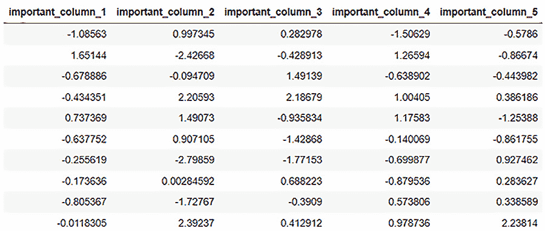

图 3.1-重要数据帧 1 数据内容

1.  让我们创建另一个名为`important_dataframe_2`的数据帧，和以前一样，但是有不同的列名，但是行数相同，并且只有`2`列:

    ```
    important_dataframe_2 = h2o.H2OFrame.from_python(np.random.randn(15,2).tolist(), column_names=list([" important_column_6" , " important_column_7" ]))
    ```

2.  让我们也来看看这个数据框架的内容:

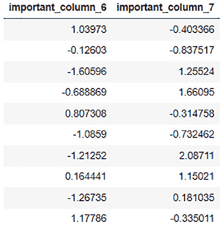

图 3.2–重要数据帧 2 数据内容

1.  现在，让我们合并两个数据帧的列，并使用`cbind()`函数

    ```
    final_dataframe = important_dataframe_1.cbind(important_dataframe_2)
    ```

    将它们存储在另一个名为`final_dataframe`的变量中
2.  现在我们来观察`final_dataframe` :

    ```
    final_dataframe.describe
    ```

您应该看到 **final_dataframe** 的内容如下:

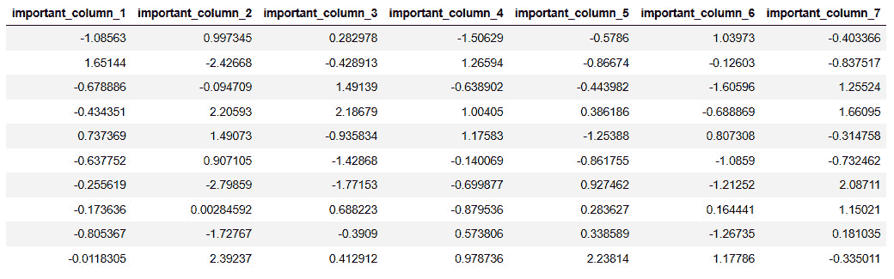

图 3.3–cbind()后的 final_dataframe 数据内容

在这里，您会注意到我们已经成功地将来自`important_dataframe_2`的列与 **important_dataframe_1** 的列组合在一起。

这就是如何使用`cbind()`函数将两个不同的数据集的列组合成一个数据帧。使用`cbind()`函数时要记住的唯一一件事是，有必要确保要合并的两个数据集具有相同的行数。此外，如果数据帧具有相同的列名，那么 H2O 将在数据帧的列前面追加一个 **0** 。

现在我们知道了如何组合不同数据帧的列，让我们看看如何组合具有相同列结构的多个数据帧的列值。

## 合并两个数据帧中的行

大多数大公司经常处理大量的数据。这些数据通常被分割成多个块，以便更快、更有效地存储和读取。然而，在模型训练期间，我们经常需要访问所有这些分区数据集。这些数据集具有相同的结构，但数据内容是分布式的。换句话说，数据帧具有相同的列；但是，数据值或数据行会在它们之间拆分。我们通常需要一个函数将所有这些数据帧组合在一起，这样我们就有了所有可用于模型训练的数据值。

H2O 有一个名为`rbind()`的函数，它将一个数据集中的行组合成另一个数据集。

让我们在下面的例子中试试这个函数:

1.  导入`h2o`库:

    ```
    import h2o
    ```

2.  导入`numpy`库；我们将使用它为我们的研究创建一个随机数据框架:

    ```
    import numpy as np
    ```

3.  初始化`h2o`服务器:

    ```
    h2o.init()
    ```

4.  现在，让我们创建一个名为`important_dataframe_1`的随机数据帧。为了确保在数据集中生成与本例中相同的值，将`numpy`的随机种子值设置为`123`。我们将行数设置为`15`，列数设置为`5`。您可以随意命名这些列:

    ```
    np.random.seed(123) important_dataframe_1 = h2o.H2OFrame.from_python(np.random.randn(15,5).tolist(), column_names=list([" important_column_1" , " important_column_2" ," important_column_3" ," important_column_4" ," important_column_5" ]))
    ```

5.  让我们检查一下数据帧的行数，应该是`15` :

    ```
    important_dataframe_1.nrows
    ```

6.  让我们创建另一个名为`important_dataframe_2`的数据帧，和前一个一样，使用相同的列名和任意数量的行。在这个例子中，我使用了`10`行:

    ```
    important_dataframe_2 = h2o.H2OFrame.from_python(np.random.randn(10,5).tolist(), column_names=list([" important_column_1" , " important_column_2" ," important_column_3" ," important_column_4" ," important_column_5" ]))
    ```

7.  让我们检查一下`important_dataframe_2`的行数，其中应为`10` :

    ```
    important_dataframe_2.nrows
    ```

8.  现在，让我们合并两个数据帧的行，并使用`rbind()`函数

    ```
    final_dataframe = important_dataframe_1.rbind(important_dataframe_2)
    ```

    将存储在另一个名为`final_dataframe`的变量中
9.  现在我们来观察`final_dataframe` :

    ```
    final_dataframe.describe
    ```

您应该看到 **final_dataframe** 的内容如下:

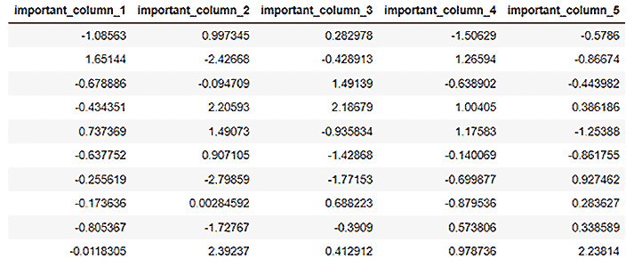

图 3.4–r bind()后的 final_dataframe 数据内容

1.  让我们检查一下 **final_dataframe** :

    ```
    final_dataframe.nrows
    ```

    中的行数

最后一个操作的输出应该显示最终数据集中行数的值。您将看到值是 **25** ，数据帧的内容是前面两个数据集的组合行值。

既然我们已经了解了如何使用`rbind()`函数在 H2O 组合两个数据帧的行，那么让我们看看如何完全组合两个数据集。

## 合并两个数据帧

您可以直接合并两个数据帧，将它们的行和列合并成一个数据帧。H2O 提供了一个`merge()`函数，该函数将共享一个或多个公共列的两个数据集组合在一起。在合并过程中，两个数据集共有的列被用作**合并关键字**。如果它们只有一个共同的列，则该列构成合并的单个主键。如果有多个公共列，那么 H2O 将基于它们的数据值形成所有这些列的复合键，并将其用作合并键。如果两个数据集之间有多个公共列，而您只想合并其中的一个特定子集，那么您需要重命名其他公共列，以删除相应的公共性。

让我们在下面的 Python 示例中尝试一下这个函数:

1.  导入`h2o`库:

    ```
    import h2o
    ```

2.  导入`numpy`库；我们将使用它为我们的研究创建一个随机数据帧:

    ```
    import numpy as np
    ```

3.  初始化`h2o`服务器:

    ```
    h2o.init()
    ```

4.  现在，让我们创建一个名为`dataframe_1`的数据帧。数据框有`3`栏:`words`、`numerical_representation`和`letters`。现在，我们将数据内容填写如下:

    ```
    dataframe_1 = h2o.H2OFrame.from_python({'words':['Hello', 'World', 'Welcome', 'To', 'Machine', 'Learning'], 'numerical_representation': [0,1,2,3,4,5],'letters':['a','b','c','d']})
    ```

5.  让我们来看看数据集的内容:

    ```
    dataframe_1.describe
    ```

6.  您会注意到数据集的内容如下: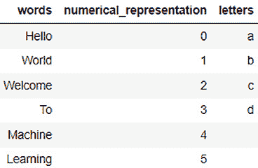

图 3.5–data frame _ 1 数据内容

1.  让我们创建另一个名为`dataframe_2`的数据帧。该数据帧还包含`3`列:`numerical_representation`列、`letters`列(这两个列都与`dataframe_1`相同)和一个不常见的列。姑且称之为`other_words` :

    ```
    dataframe_2 = h2o.H2OFrame.from_python({'other_words':['How', 'Are', 'You', 'Doing', 'Today', 'My', 'Friend', 'Learning', 'H2O', 'Artificial', 'Intelligence'], 'numerical_representation': [0,1,2,3,4,5,6,7,8,9],'letters':['a','b','c','d','e']})
    ```

2.  让我们看看这个数据帧的内容:

    ```
    dataframe_2.head(11)
    ```

执行代码时，您应该在笔记本上看到以下输出:

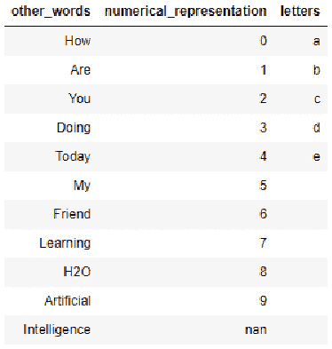

图 3.6–data frame _ 2 数据内容

1.  现在，让我们使用`merge()`操作:

    ```
    final_dataframe = dataframe_2.merge(dataframe_1)
    ```

    将`dataframe_1`合并到`dataframe_2`
2.  现在我们来观察 `final_dataframe` :

    ```
    final_dataframe.describe
    ```

3.  您应该会看到 **final_dataframe** 的内容如下:

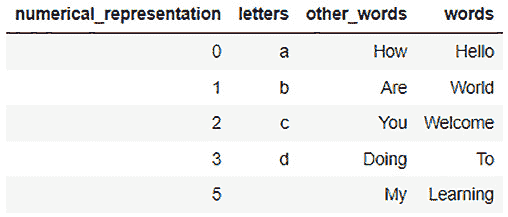

图 3.7–合并后的 final_dataframe 内容()

您会注意到，H2O 使用了`numerical_representation`列的组合和其他列中的适当值。

现在，你可能会奇怪为什么 **4** 没有排。这是因为在合并时，我们有两个公共列:**数字表示**和**字母**。因此，H2O 使用了一个 c 复合合并键，它使用了这两个列: **(0，a)** ， **(1，b)** ， **(2，c)** ，等等。

现在你可能会问的下一个问题是*值为 5 的那一行呢？它在字母列中没有值。*这是因为在 ML 中，即使是空值也被视为唯一值。因此，在合并期间，生成的复合键将 **(5，)**视为有效的合并键。

由于 **dataframe_1** 不再有任何数值表示值，H2O 丢弃所有剩余值。

1.  通过将参数`all_x`设置为`True`，可以强制 H2O 不删除合并键列中的任何值，如下所示:

    ```
    final_dataframe = dataframe_2.merge(dataframe_1, all_x = True)
    ```

2.  现在，让我们观察一下`describe`属性的内容:

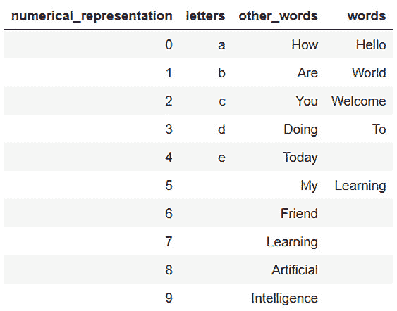

图 3.8–强制合并后的 final_dataframe 数据内容()

您会注意到，我们现在将两个数据帧中的所有值合并到一个数据帧中。我们有上一步中丢失的从 **0 到 9** 的所有数字表示和从 **dataframe_2** 的 **a 到 e** 的所有字母，以及来自 **other_words** 列和 **words** 列的正确值。

概括地说，我们学习了如何组合数据帧的列和行。我们还学习了如何使用`merge()`函数将整个数据帧组合在一起。但是，我们注意到，如果我们强制合并数据帧，尽管它们的键列中没有公共数据值，我们最终会丢失数据帧中的值。

现在，让我们看看使用 H2O 处理缺失值的不同方法。

# 处理数据帧中的缺失值

数据集中的缺失值是现实世界中最常见的问题。通常期望从各种来源收集的大块数据集中至少有几个缺失数据的实例。数据丢失可能有多种原因，从数据源没有生成数据，一直到数据收集器停机。处理缺失数据对于模型训练非常重要，因为许多 ML 算法不支持缺失数据。那些这样做的人可能最终会更重视在丢失的数据中寻找模式，而不是现有的实际数据，这会分散机器的学习注意力。

缺失数据通常被称为**不可用** ( **NA** )或 **nan** 。在我们发送数据帧用于模型训练之前，我们需要首先处理这些类型的值。您可以删除包含任何缺失值的整行，也可以用该数据列的任何默认值(默认值或公共值)来填充它们。如何处理缺少的值完全取决于缺少哪些数据以及这些数据对整个模型定型的重要性。

H2O 提供了一些功能，可用于处理数据帧中的缺失值。这些是其中的一些:

*   `fillna()`功能
*   替换框架中的值
*   归罪

接下来，让我们看看如何使用 H2O 填充数据帧中缺失的值。

## 填充 NA 值

`fillna()`是 H2O 中的一个函数，您可以使用按顺序填充缺失的数据值。如果列中的某些数据值本质上是连续的，例如，时间序列或任何按顺序增减并可以排序的指标，这将非常方便。序列中的值之间的差异越小，该函数就越适用。

`fillna()`功能有以下参数:

*   `method`:既可以是*前进*也可以是*后退*。它指示了 H2O 应该开始在数据帧中填充 NA 值的方向。
*   `axis` : `0`按列填充或`1`按行填充。
*   `maxlen`:要填充的连续 NAs 的最大数量。

让我们看一个 Python 中的例子，看看我们如何使用这个函数来填充缺失值:

1.  导入`h2o`库:

    ```
    import h2o
    ```

2.  导入`numpy`库；我们将使用它为我们的研究创建一个随机数据帧:

    ```
    import numpy as np
    ```

3.  初始化`h2o`服务器:

    ```
    h2o.init()
    ```

4.  用`1000`行、`3`列和一些 NA 值:

    ```
    dataframe = h2o.create_frame(rows=1000, cols=3, integer_fraction=1.0, integer_range=100, missing_fraction=0.2, seed=123)
    ```

    创建一个随机数据帧
5.  让我们观察这个数据帧的内容。执行以下代码，您将看到数据帧中某些缺失的值:

    ```
    dataframe.describe
    ```

您应该会看到数据帧的内容如下:

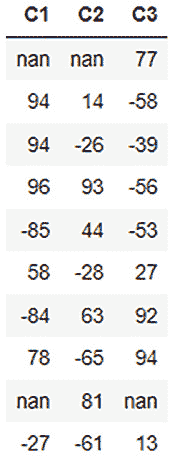

图 3.9–数据帧内容

1.  现在让我们使用`fillna()`函数向前填充NA 值。执行下面的代码:

    ```
    filled_dataframe = dataframe.fillna(method=" forward" , axis=0, maxlen=1)
    ```

2.  让我们观察数据帧的填充内容。执行下面的代码:

    ```
    filled_dataframe.describe
    ```

3.  您应该会看到数据帧的内容如下:

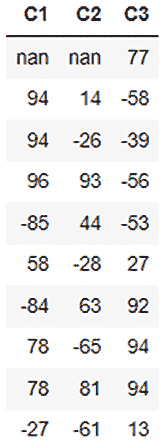

图 3.10–填充的 _ 数据帧内容

`fillna()`函数已经顺序填充了数据帧中的大部分 NA 值。

然而，你会注意到我们还有一些 T21。因为这是第一列，H2O 在记录中没有任何先前的值来填充它，因此它跳过了它。

现在我们已经了解了如何在 H2O 中使用`fillna()`函数顺序填充数据帧中的数据，让我们看看如何替换数据帧中的某些值。

## 替换帧中的值

数据处理经常需要的另一个常见功能是替换数据帧中的某些值。你可能有很多理由想这么做。这对于数字数据尤其常见，其中一些最常见的转换包括舍入值、正常化数值范围或只是更正数据值。在本节中，我们将探索一些在 H2O 中可以用来替换数据帧中的值的函数。

让我们首先创建一个可以用来测试这些函数的数据框架。执行下面的代码，这样我们就有了一个可以操作的数据帧:

```

import h2o

h2o.init()

dataframe = h2o.create_frame(rows=10, cols=3, real_range=100, integer_fraction=1, missing_fraction=0.1, seed=5)

dataframe.describe
```

数据帧应如下所示:

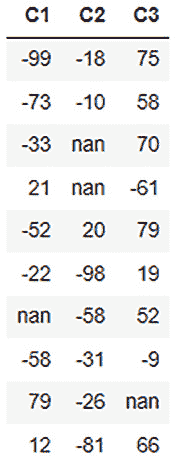

图 3.11–数据框数据内容

因此，我们有一个包含三列的数据框架:**C1**、 **C2** 和 **C3** 。每一列都有一些负数和一些南值。让我们看看如何利用这个数据框架。

先说简单的。让我们更新单个数据值的值，也称为`99`。您可以根据数据帧中的位置更新单个数据值的值，如下所示:

```

dataframe[3,1] = 99
```

注意，数据帧中的列和行都以`0`开始。因此，我们将数据帧中行号为`3`列号为`1`的值设置为`99`。通过执行`dataframe.describe`，您应该可以在数据帧中看到结果，如下所示:

```

dataframe.describe
```

数据帧应如下所示:

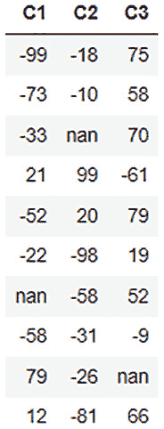

图 3.12-基准更新后的数据框内容

正如您在数据帧中看到的，我们用 **99** 替换了之前位于 **C2** 列第三行的 **nan** 值。

这是对一个数据值的操作。让我们看看如何替换整个列的值。让我们将 **C3** 列中的数据值增加到其原始值的三倍。您可以通过执行以下代码来实现这一点:

```

dataframe[2] = 3*dataframe[2]
```

通过执行`dataframe.describe`，您应该可以在数据帧中看到结果，如下所示:

```

dataframe.describe
```

数据帧应如下所示:

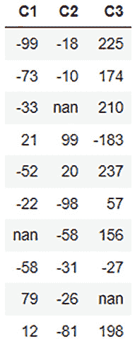

图 3.13–列值更新后的数据帧内容

我们可以在输出中看到， **C3** 列中的值现在已经增加到该列中原始值的三倍。

到目前为止，我们执行的所有这些替换都很简单。让我们在数据帧上尝试一些条件更新。让我们将数据帧中的所有负数四舍五入到`0`。所以，条件是我们只更新负数到`0`，不改变任何正数。您可以按如下方式进行条件更新:

```

dataframe[dataframe['C1'] < 0, " C1" ] = 0

dataframe[dataframe['C2'] < 0, " C2" ] = 0

dataframe[dataframe['C2'] < 0, " C3" ] = 0
```

通过执行`dataframe.describe`，您应该可以在数据帧中看到结果，如下所示:

```

dataframe.describe
```

数据帧应如下所示:

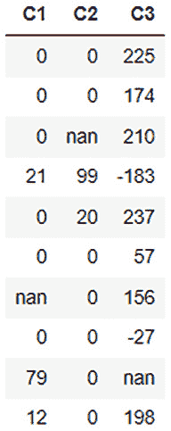

图 3.14–条件更新后的数据帧内容

正如你在数据帧中看到的，所有的负值都被四舍五入/替换为 **0** 。

现在，如果我们不是将负数四舍五入到 0，而是求负数的倒数，会怎么样呢？我们可以通过将条件更新与算术更新相结合来做到这一点。参考下面的例子:

```

dataframe[" C1" ] = (dataframe[" C1" ] < 0).ifelse(-1*dataframe[" C1" ], dataframe[" C1" ])

dataframe[" C2" ] = (dataframe[" C2" ] < 0).ifelse(-1*dataframe[" C2" ], dataframe[" C2" ])

dataframe[" C3" ] = (dataframe[" C3" ] < 0).ifelse(-1*dataframe[" C3" ], dataframe[" C3" ])
```

现在，让我们尝试看看是否可以替换剩余的`fillna()`函数，但是如果 **nan** 值只是一些不属于任何递增或递减模式的缺失值，并且我们只想将其设置为 0，该怎么办？让我们现在做那件事。运行以下代码:

```

dataframe[dataframe[" C1" ].isna(), " C1" ] = 0

dataframe[dataframe[" C2" ].isna(), " C2" ] = 0

dataframe[dataframe[" C3" ].isna(), " C3" ] = 0
```

通过执行`dataframe.describe`，您应该可以在数据框中看到的结果，如下所示:

```

dataframe.describe
```

数据帧应如下所示:

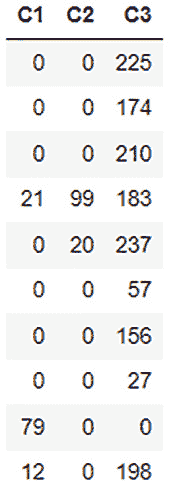

图 3.15–用 0 替换 nan 值后的数据帧内容

`isna()`函数是检查数据中的值是否为 **nan** 并返回**真**或**假**的函数。我们使用这个条件来替换数据帧中的值。

小费

有很多方法可以操作和替换数据帧中的值，H2O 提供了很多功能来简化实现。您可以随意探索和试验如何操作数据框中的值。更多详情可以在这里找到:[https://docs . H2O . ai/H2O/latest-stable/H2O-py/docs/frame . XHTML](https://docs.h2o.ai/h2o/latest-stable/h2o-py/docs/frame.xhtml)。

既然我们已经学习了在数据框架中替换值的各种方法，让我们来看看数据科学家和工程师经常采用的更高级的方法。

## 插补

之前，我们已经看到了如何使用`fillna()`用替换数据集中的 nan 值，从而替换数据帧中的 nan 数据。`fillna()`函数按顺序填充数据；然而，数据本质上不需要总是连续的。例如，考虑购买游戏笔记本电脑的人的数据集。该数据集将主要包含 13-28 岁年龄段人群的数据，但也有一些异常值。在这种情况下，如果在`fillna()`函数中有任何 nan 值来填充 nan 值，因为任何异常值之后的任何 nan 值都会在数据帧中引入偏差。我们需要将 nan 值替换为该产品年龄组的标准分布中常见的值，即介于 13 和 28 之间的值，而不是可能性较小的 59。

插补是用适当的替代值替换数据框架中的某些值的过程，该替代值不会引入任何可能影响模型训练的偏差或异常值。用于计算替代值的方法或公式被称为**插补策略**。插补是最重要的数据处理方法之一，它处理缺失值和 nan 值，并尝试用一个可能将最小偏差引入模型训练过程的值来替换它们。

H2O 有一个名为`impute()`的函数专门提供这个功能。它具有以下参数:

*   `column`:该参数接受将列设置为`impute()`的列号。值`1`估算整个数据帧。
*   `method`:该参数设置使用哪种插补方法。方法可以是`mean`、`median`或`mode`。
*   `combine_method`:当选择的插补方法为`median`时，该参数决定如何组合偶数样本的分位数。组合方式可以是`interpolate`、`average`、`low`或`high`。
*   `group_by_frame`:该参数估算所选预计算分组帧的值。
*   `by`:该参数根据所选列对插补结果进行分组。
*   `values`:该参数接受每列估算的值列表。列表中有`None`值会跳过该列。

让我们看一个 Python 中的例子，看看我们如何使用这个函数来填充缺失的值。

为此，我们将使用**高中生冲刺**数据集。高中生短跑数据集是由高中生的年龄、体重、记录的最大速度以及他们在 100 米短跑中的表现的记录组成的数据集。该数据集用于预测年龄、体重和短跑速度如何影响学生在 100 米短跑比赛中的表现。

数据集如下所示:

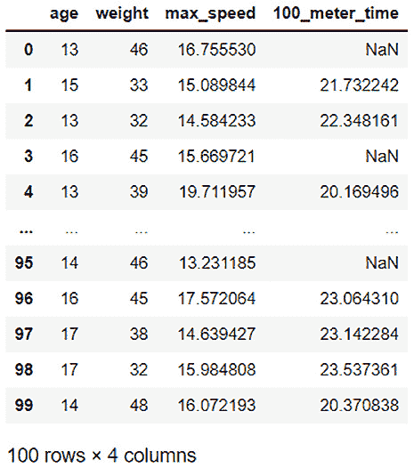

图 3.16-一个高中生短跑数据集

数据集的特征如下:

*   **年龄**:学生的年龄
*   **体重**:学生的体重，单位为千克
*   **max_speed** :学生的最大冲刺速度，单位为千米/小时
*   **100 米时间**:学生以秒为单位完成 100 米冲刺所用的时间

正如您所看到的，在 **100_meter_time** 列中有很多缺失的值。

我们不能简单地使用`fillna()`函数，因为如果丢失的值恰好在最快或最慢的时间之后，这将在数据中引入偏差。我们也不能简单地用一个常数来代替这些值。

真正有意义的是，用一个普通青少年参加 100 米短跑的正常数值来代替这些缺失的数值。我们已经有了大多数学生的值，所以我们可以使用他们的结果来计算一般的平均 100 米冲刺时间，并以此作为基线来替换所有缺失的值，而不会引入任何偏差。

这正是插补的用途。让我们使用插补功能来填充这些缺失值:

1.  导入`h20`模块，启动`h20`服务器:

    ```
    import h2o h2o.init()
    ```

2.  然后我们通过使用`h2o.import_file()` :

    ```
    dataframe = h2o.import_file(" Dataset/high_school_student_sprint.csv" )
    ```

    导入`high school student sprint`数据集
3.  使用`impute()`函数，让我们通过`mean`估算`100_meter_time`列中缺失的值，并显示数据:

    ```
    dataframe.impute(" 100_meter_time" , method = " mean" ) dataframe.describe
    ```

您将看到估算数据帧的输出如下:

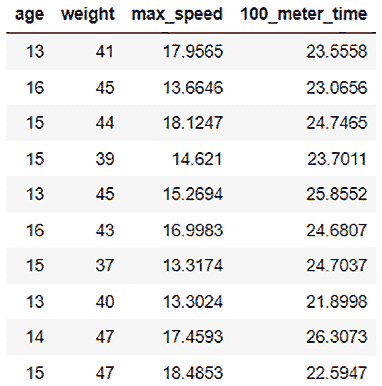

图 3.17–按平均值估算的 100 米时间列

1.  H2O 计算出**100 _ 米 _ 时间**栏中所有值的`mean`值为 **23.5558** ，并用其替换缺失的值。

类似地，代替`mean`，你也可以使用`median`值。但是，请注意，如果一个列有分类值，那么方法必须是`mode`。您可以根据替换缺失值时最有用的数据集来做出决定:

```
dataframe.impute(" 100_meter_time" , method = " median" )
dataframe.impute(" 100_meter_time" , method = " mode" )
```

1.  让我们增加一点复杂性。如果所有学生之间的平均 100 米冲刺时间没有真正的可比性怎么办？如果表演在年龄上更有可比性呢？例如，16 岁的学生比 13 岁的学生跑得快，因为他们身体发育得更好。在这种情况下，在估算一个 16 岁孩子的缺失值时，考虑一个 13 岁孩子的冲刺时间是没有意义的。这里我们可以使用`impute()`函数的`group`参数:

    ```
    dataframe = h2o.import_file(" Dataset/high_school_student_sprint.csv" ) dataframe.impute(" 100_meter_time" , method = " mean" , by=[" age" ]) dataframe.describe
    ```

您将看到如下所示的输出:

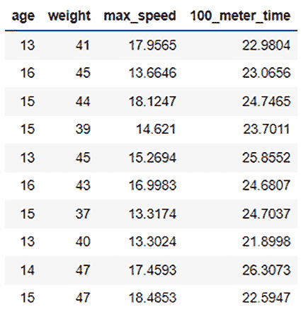

图 3.18–100 米短跑按平均值估算并按年龄分组

你会注意到，现在 H2O 已经按年龄计算了`mean`值，并替换了所有`impute()`函数的`mean`值中相应年龄的缺失值，从而灵活地估算出正确的值。

`impute()`功能非常强大，可以在数据帧中输入正确的值。通过列和框架进行分组的附加参数使其在处理各种缺失值时非常灵活。

在不同的数据集上随意使用和探索所有这些函数。归根结底，所有这些功能都只是数据科学家和工程师用来提高数据质量的工具；真正的技能是理解何时以及如何使用这些工具来充分利用您的数据，这需要实验和实践。

现在我们已经了解了处理缺失数据的不同方法，让我们进入数据处理的下一部分，即如何操作数据帧的特征列。

# 操纵数据帧的特征列

大多数时候，你的数据处理活动将主要涉及操作数据帧的列。最重要的是，列中值的类型和列中值的顺序将在模型定型中发挥主要作用。

H2O 提供了一些功能来帮助你做到这一点。以下是帮助您处理数据框架中缺失值的一些功能:

*   列的排序
*   更改列的类型

让我们首先了解如何使用 H2O 对列进行排序。

## 排序列

理想情况下，您希望数据帧中的数据在传递给模型训练之前被打乱。但是，在某些情况下，您可能希望根据列中的值对数据帧进行重新排序。

H2O 有一个名为`sort()`的功能，可以根据列中的值对数据帧进行排序。它具有以下参数:

*   `by`:排序依据的列。您也可以将多个列名作为一个列表传递。
*   `ascending`:一个`boolean`数组，表示 H2O 应该对列进行排序的方向。如果选择`True`，H2O 将对该列进行升序排序。如果`False`，那么 H2O 将按降序排序。如果两个标志都没有传递，那么 H2O 默认为升序排序。

H2O 对数据帧排序的方式取决于传递给`sort()`函数的是一个列名还是多个列名。如果只传递了一个列名，那么 H2O 将返回一个按该列排序的帧。

但是，如果传递了多个列，那么 H2O 将返回一个数据帧，其排序如下:

*   H2O 将首先对参数中传递的第一列上的数据帧进行排序。
*   然后，H2O 将对参数中传递的下一列上的数据帧进行排序，但只会对那些与第一个排序列中的值相同的行进行排序。如果前面的列中没有重复值，则不会对后面的列进行排序。

让我们看一个 Python 中的例子，看看如何使用这个函数对列进行排序:

1.  导入`h2o`库并初始化:

    ```
    import h2o h2o.init()
    ```

2.  通过执行以下代码创建一个 dataframe，并观察数据集:

    ```
    dataframe = h2o.H2OFrame.from_python({'C1': [3,3,3,0,12,13,1,8,8,14,15,2,3,8,8],'C2':[1,5,3,6,8,6,8,7,6,5,1,2,3,6,6],'C3':[15,14,13,12,11,10,9,8,7,6,5,4,3,2,1]}) dataframe.describe
    ```

数据集的内容应该如下:

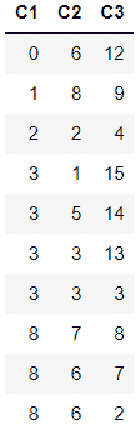

图 3.19–data frame _ 1 数据内容

1.  因此，此时，列`sort()`中的值的作用是通过列`0`将数据帧排序到`by`参数中，指示数据帧的第一列，或者通过传递 **['C1']** ，这是一个包含列名的列表，用于顺序排序数据集:

    ```
    sorted_dataframe_1 = dataframe.sort(0) sorted_dataframe_1.describe
    ```

您应该得到如下代码输出:

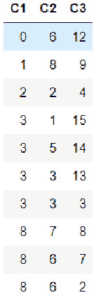

图 3.20–按 C1 列排序的 dataframe_1

您将看到数据帧现在按照 **C1** 列的升序排序。

1.  让我们看看如果我们在`by`参数中传递多列来对多列进行排序，我们会得到什么。运行下面的代码行:

    ```
    sorted_dataframe_2 = dataframe.sort(['C1','C2']) sorted_dataframe_2.describe
    ```

您应该得到如下输出:

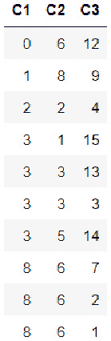

图 3.21–按 C1 和 C2 列排序的 dataframe_1

如您所见，H2O 首先通过`sort`函数对列进行排序。

1.  您也可以通过在`ascending`参数中传递`False`来反转排序顺序。让我们通过运行下面的代码行来测试这一点:

    ```
    sorted_dataframe_3 = dataframe.sort(by=['C1','C2'], ascending=[True,False]) sorted_dataframe_3.describe
    ```

您应该会看到如下输出:

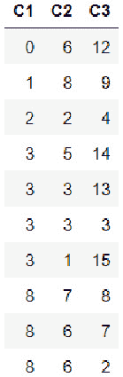

图 3.22–data frame _ 1 按 C1 列升序排序，C2 列降序排序

在这种情况下，H2O 首先按照 C1 列对列进行排序。然后，它按照 **C2** 列对那些在 **C1** 列中具有相同值的行进行排序。但是，这一次它按降序对值进行了排序。

既然您已经学习了如何通过单个列以及多个列对数据帧进行排序，那么让我们继续学习另一个列操作函数，它可以改变列的类型。

## 更改列类型

正如我们在 [*第二章*](B17298_02.xhtml#_idTextAnchor038)*使用 H2O 流(H2O 的 Web UI)* 中看到的，我们将`Heart Disease`列的类型从`numerical`更改为`enum`。我们这样做的原因是，列的类型在模型训练中起着主要作用。在模型训练期间，列的类型决定了 ML 问题是分类问题还是回归问题。尽管这两种情况下的数据本质上都是数字，但是 ML 算法如何处理列完全取决于它的类型。因此，纠正在数据收集的初始阶段可能没有正确设置的列类型变得非常重要。

H2O 有几个函数不仅可以帮助你改变列的类型，还可以对列类型进行初始检查。

一些功能如下:

*   `.isnumeric()`:检查数据框中的列是否为数字类型。相应地返回`True`或`False`
*   `.asnumeric()`:创建一个新框架，将指定列的所有值转换为数字
*   `.isfactor()`:检查 dataframe 中的列是否属于分类类型。相应地返回`True`或`False`
*   `.asfactor()`:创建一个新框架，将所有值转换为指定列的分类类型
*   `.isstring()`:检查数据帧中的列是否为字符串类型。相应地返回`True`或`False`
*   `.ascharacter()`:创建一个新框架，将所有值转换为指定列的字符串类型

让我们看一个 Python 中的例子，看看我们如何使用这些函数来更改列类型:

1.  导入`h2o`库并初始化 H2O:

    ```
    import h2o h2o.init()
    ```

2.  通过执行以下代码行创建一个 dataframe，并观察数据集:

    ```
    dataframe = h2o.H2OFrame.from_python({'C1': [3,3,3,0,12,13,1,8,8,14,15,2,3,8,8],'C2':[1,5,3,6,8,6,8,7,6,5,1,2,3,6,6],'C3':[15,14,13,12,11,10,9,8,7,6,5,4,3,2,1]}) dataframe.describe
    ```

数据集的内容应该如下:

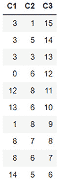

图 3.23-数据框数据内容

1.  使用`isnumeric()`功能确认`numerical`栏是否如下:

    ```
    dataframe['C1'].isnumeric()
    ```

您应该得到一个`True`的输出。

1.  让我们看看，如果我们使用`asfactor()`函数检查`categorical`列，会得到如下结果:

    ```
    dataframe['C1'].isfactor()
    ```

您应该得到一个`False`的输出。

1.  现在让我们使用`asfactor()`函数转换`categorical`列，然后检查`isfactor()`是否返回`True` :

    ```
    dataframe['C1'] = dataframe['C1'].asfactor() dataframe['C1'].isfactor()
    ```

您现在应该会得到`True`的输出。

1.  您可以使用`asnumeric()`函数:

    ```
    dataframe['C1'] = dataframe['C1'].asnumeric() dataframe['C1'].isnumeric()
    ```

    转换`numerical`列

您现在应该得到一个`True`的输出。

既然您已经学习了如何对数据帧的列进行排序和更改列类型，那么让我们继续讨论数据处理中的另一个重要主题，即标记化和编码。

# 文本数据的标记化

并非所有的**机器学习算法** ( **MLAs** )都专注于数学问题解决。**自然语言处理** ( **NLP** )是 ML 的一个分支，专门分析文本数据中的含义，尽管它会尝试推导含义并理解文档或任何文本的内容。训练 NLP 模型可能非常棘手，因为每种语言都有自己的语法规则，对某些单词的解释在很大程度上取决于上下文。然而，NLP 算法经常尽力训练一个模型，该模型可以预测文本文档的含义和情感。

训练 NLP 算法的方法是首先将文本数据块分解成更小的单元，称为**记号**。记号可以是单词、字符，甚至是字母。这取决于 MLA 的要求是什么，以及它如何使用这些令牌来训练模型。

H2O 有一个名为`tokenize()`的函数，它帮助将数据帧中的字符串数据分解成记号，并创建一个包含所有记号的单独的列以供进一步处理。

它有以下参数:`split`:我们在这个参数中传递一个正则表达式，函数将使用这个表达式将文本数据分割成标记。

让我们看一个如何使用这个函数来标记数据帧中的字符串数据的示例:

1.  导入`h2o`库并初始化它:

    ```
    import h2o h2o.init()
    ```

2.  通过执行以下代码行创建一个 dataframe，并观察数据集:

    ```
    dataframe1 = h2o.H2OFrame.from_python({'C1':['Today we learn AI', 'Tomorrow AI learns us', 'Today and Tomorrow are same', 'Us and AI are same']}) dataframe1 = dataframe1.ascharacter() dataframe1.describe
    ```

数据集应该如下所示:

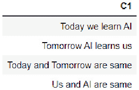

图 3.24-数据框数据内容

这种类型的文本数据通常在生成大量日志文本或对话数据的系统中收集。为了解决这种 NLP 任务，我们需要将句子分解成单独的标记，以便我们最终可以建立这些文本的上下文和含义，这将有助于 ML 算法进行语义预测。然而，在深入 NLP 的复杂性之前，数据科学家和工程师将首先通过标记化来处理这些数据。

1.  让我们使用这个函数对数据帧进行标记，用空格分割文本，并观察标记后的列:

    ```
    tokenized_dataframe = dataframe1.tokenize("  " ) tokenized_dataframe
    ```

您应该会看到如下数据帧:

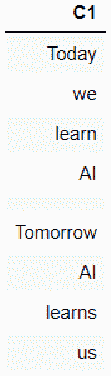

图 3.25–令牌化数据帧数据内容

您会注意到,`tokenize()`函数将文本数据分割成标记，并将标记作为行添加到一列中。您还会注意到，所有标记化的句子都由空行分隔。您可以通过使用`nrows`将数据帧中所有句子的字数，加上句子之间的空格，与标记化数据集中的行数进行比较来交叉检查。

这些是一些最常用的数据处理方法，用于在将数据输入 ML 管道进行培训之前对其进行处理。仍然有很多方法和技术可以用来进一步清理和润色数据框。以至于你可以用一整本书来讨论它们。数据处理恰好是整个 ML 生命周期中最困难的部分。用于训练的数据的质量取决于问题陈述的上下文。它还依赖于数据科学家和工程师在处理数据时的创造力和独创性。数据处理的最终目标是从数据集中提取尽可能多的信息，并从数据中去除噪声和偏差，以便在训练期间更有效地分析数据。

# 使用目标编码对数据进行编码

我们知道，机器只能理解的数字。然而，大量现实世界中的 ML 问题围绕着本质上不一定是数字的对象和信息。一般来说，诸如状态、名称和类之类的东西被表示为类别而不是数字。这种数据称为**分类数据**。分类数据通常会在分析和预测中发挥重要作用。因此，需要将这些分类值转换成数字格式，以便机器能够理解它们。转换的方式也应该是，我们不会失去这些类别的固有含义，也不会在数据中引入新的信息，例如数字的递增性质。

这就是使用编码的地方。**编码**是将分类值转换为数值的过程，换句话说，*编码*。有许多编码方法可以执行这种转换。最常用的一种就是**目标编码**。

目标编码是一种编码过程，通过计算给定类别的目标变量出现的平均概率，将类别值转换为数值。H2O 也有帮助用户对他们的数据进行目标编码的方法。

为了更好地理解这种方法，考虑下面的样本`Mythical creatures`数据集:

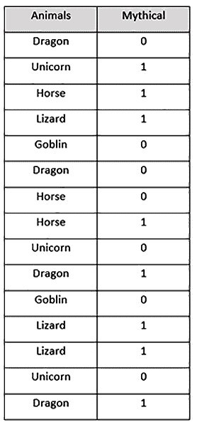

图 3.26–我们的神话生物数据集

该数据集具有以下内容:

*   **动物**:该列包含动物名称的分类值。
*   **神话**:该列包含 **0** 二进制值和 **1** 二进制值。 **1** 表示生物是神话，而 **0** 表示生物不是神话。

现在，让我们使用目标编码对`categorical`列进行编码。目标编码将执行以下步骤:

1.  对分类值进行分组，并记录给定类别的目标值**神话**为 **1** 的次数以及为 **0** 的时间，如下所示:

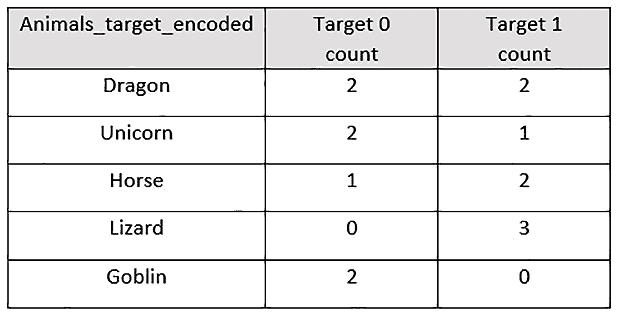

图 3.27–带有目标计数的神话生物数据集

1.  计算 **1** 目标值出现的概率，与每个特定组内的和 **0** 目标值进行比较。这将如下所示:

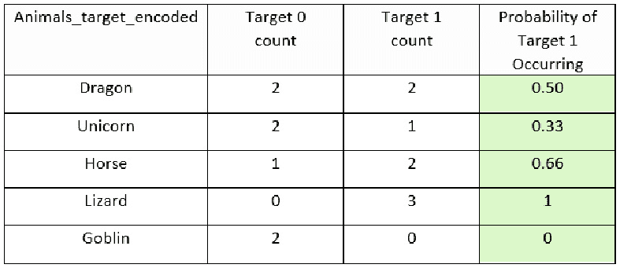

图 3.28–带有目标 1 出现概率栏的神话生物数据集

1.  删除**动物**列，使用【目标 1 出现的 T21 概率】列作为**动物**列的编码表示。新的编码数据集将如下所示:

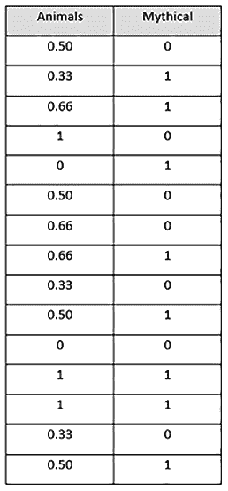

图 3.29–目标编码的神话生物数据集

在编码数据集中，使用目标编码对**动物**特征进行编码，我们有一个本质上完全是数字的数据集。该数据集将易于 ML 算法解释和学习，从而提供高质量的模型。

现在让我们看看如何使用 H2O 来执行目标编码。我们将在本例中使用的数据集是`Automobile price prediction`数据集。你可以在[https://archive.ics.uci.edu/ml/datasets/Automobile](https://archive.ics.uci.edu/ml/datasets/Automobile)(*Dua，d .和 Graff，C. (2019)找到这个数据集的细节。http://archive.ics.uci.edu/ml 机器学习库*。*加州尔湾:加州大学信息与计算机科学学院*)。

数据集相当简单。它包含了关于汽车的各种细节，比如汽车的**品牌**、**发动机尺寸**、**燃油系统**、**压缩比**和**价格**。ML 算法的目的是根据这些特征预测汽车的价格。

对于我们的实验，我们将使用目标编码对`categorical`列**制造**、**燃料类型**和**车身样式**进行编码，其中**价格**列是目标。

让我们按照这个例子来执行目标编码:

1.  导入`h2o`和 H2O 的`H2OTargetEncoderEstimator`，初始化你的 H2O 服务器。执行下面的代码:

    ```
    import h2o from h2o.estimators import H2OTargetEncoderEstimator h2o.init()
    ```

2.  导入`Automobile price prediction`数据集并打印数据集内容。执行下面的代码:

    ```
    automobile_dataframe = h2o.import_file(" Dataset\Automobile_data.csv" ) automobile_dataframe
    ```

让我们观察数据帧的内容；它应该如下所示:

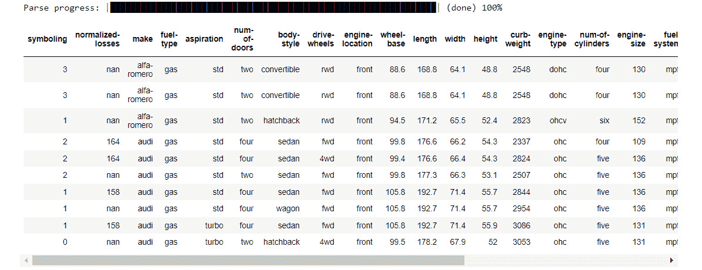

图 3.30-汽车价格预测数据框架

正如您在前面的图中看到的，dataframe 由大量包含汽车详细信息的列组成。为了理解目标编码，让我们过滤掉想要试验的列，而去掉其余的。因为我们计划将用于编码`make`列、`fuel-type`列、和`body-style`列，所以让我们只使用这些列和`price`响应列。执行以下代码:

```
automobile_dataframe = automobile_dataframe[:,[" make" , " fuel-type" , " body-style" , " price" ]]
automobile_dataframe
```

过滤后的数据帧将如下所示:

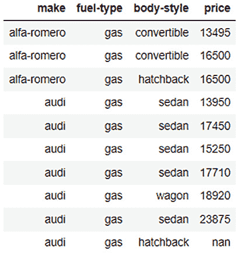

图 3.31-带有过滤列的汽车价格预测数据框架

1.  现在让我们将这个数据帧分成训练和测试数据帧。执行下面的代码:

    ```
    automobile_dataframe_for_training, automobile_dataframe_for_test = automobile_dataframe.split_frame(ratios = [.8], seed = 123)
    ```

2.  现在让我们使用`H2OTargetEncoderEstimator`来训练我们的目标编码器模型。执行下面的代码:

    ```
    automobile_te = H2OTargetEncoderEstimator() automobile_te.train(x= [" make" , " fuel-type" , " body-style" ], y=" price" , training_frame=automobile_dataframe_for_training)
    ```

一旦目标编码器完成其训练，您将看到以下输出:

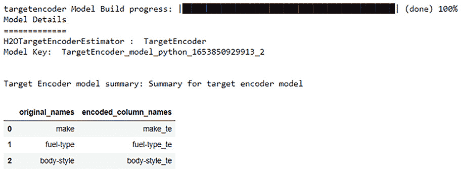

图 3.32–目标编码器训练的结果

从前面的截图中，您可以看到 H2O 目标编码器将为`make`列、`fuel-type`列和`body-style`列生成目标编码值，并将它们分别存储在名为`make_te`、`fuel-type_te`和`body-style_te`的不同列中。这些新列将包含编码值。

1.  现在，让我们使用这个经过训练的目标编码器对训练数据集进行编码，并打印编码后的数据帧:

    ```
    te_automobile_dataframe_for_training = automobile_te.transform(frame=automobile_dataframe_for_training, as_training=True) te_automobile_dataframe_for_training
    ```

编码的训练帧应该如下所示:

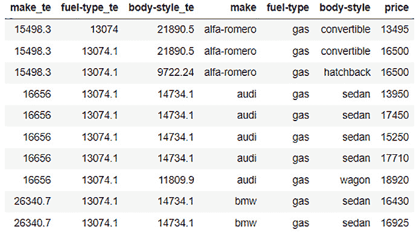

图 3.33-编码的汽车价格预测训练数据框架

如图所示，我们的训练框架现在增加了三个列，`make_te`、`fuel-type_te`和`body-style_te`，并带有数值。这些是`make`列、`fuel-type`列和`body-style`列的目标编码列。

1.  类似地，现在让我们使用经过训练的目标编码器来编码测试数据帧并打印编码的数据帧。执行下面的代码:

    ```
    te_automobile_dataframe_for_test = automobile_te.transform(frame=automobile_dataframe_for_test, noise=0) te_automobile_dataframe_for_test
    ```

编码的测试帧应该如下所示:

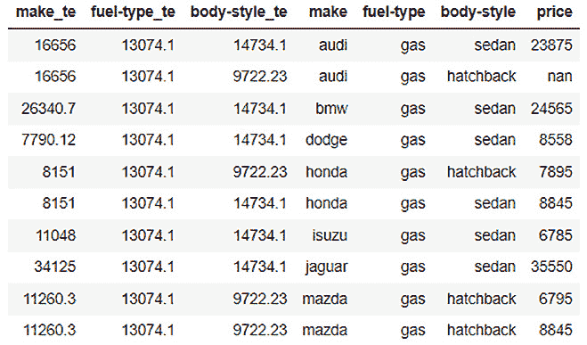

图 3.34-编码汽车价格预测测试数据框架

从图中可以看出，我们的测试帧还有三个额外的列，它们是编码列。现在，您可以使用这些数据框架来训练您的 ML 模型。

根据你下一步的行动，你可以使用你认为合适的编码数据帧。如果您想要使用数据帧来训练 ML 模型，那么您可以从数据帧中删除`categorical`列，并使用相应的编码列作为训练特征来训练您的模型。如果您希望对数据集执行任何进一步的分析，那么您可以保留这两种类型的列并执行任何比较研究。

小费

H2O 的目标编码器有几个参数，您可以设置这些参数来调整编码过程。为数据集的目标编码选择正确的设置可能会变得非常复杂，这取决于您正在处理的数据类型。因此，您可以随意试验该函数，因为您对该功能和目标编码的理解越好，您就可以更好地对数据帧进行编码，并进一步改进您的模型训练。你可以在这里找到更多关于 H2O 目标编码器的详情:[https://docs . H2O . ai/H2O/latest-stable/H2O-docs/data-science/target-encoding . XHTML](https://docs.h2o.ai/h2o/latest-stable/h2o-docs/data-science/target-encoding.xhtml)。

恭喜你！您已经理解了如何使用 H2O 的目标编码器对分类值进行编码。

# 总结

在本章中，我们首先探讨了在将数据帧发送到模型训练之前用于预处理数据帧的各种技术和一些常用函数。我们研究了如何将我们的原始数据帧重新构造成合适的一致格式，以满足模型训练的要求。我们学习了如何通过将数据帧的不同列与不同数据帧的不同列相结合来操作数据帧的列。我们学习了如何组合分区数据帧中的行，以及如何将数据帧直接合并到单个数据帧中。

一旦我们知道如何重构数据框架，我们就知道如何处理新收集的数据中经常出现的缺失值。我们学习了如何填充 NA 值、替换某些不正确的值，以及如何使用不同的插补策略来避免在填充缺失值时添加噪声和偏差。

然后，我们研究了如何通过按列对数据帧进行排序以及更改列的类型来操作特性列。我们还学习了如何标记字符串来处理文本数据，以及如何使用 H2O 的目标编码器对分类值进行编码。

在下一章，我们将打开 AutoML 的黑匣子，探索它的训练，以及在 AutoML 过程中内部发生了什么。这将有助于我们更好地理解 H2O 是如何变魔术的，并有效地自动化模型训练过程。