# 五、了解 AutoML 算法

所有的 ML 算法都有一个**计算统计学**的基础。计算统计学是统计学和计算机科学的结合，计算机被用来计算复杂的数学。这个计算是最大似然算法，我们从中得到的结果是预测。作为在 ML 领域工作的工程师和科学家，我们经常被期望知道 ML 算法的基本逻辑。人工智能领域有大量的最大似然算法。它们都旨在解决不同类型的预测问题。他们也都有自己的一套利弊。因此，工程师和科学家的工作就是寻找最佳的最大似然算法，在要求的约束条件下解决给定的预测问题。然而，随着自动化的发明，这项工作变得容易了。

尽管 AutoML 承担了寻找最佳 ML 算法的巨大责任，但作为工程师和科学家，验证和证明这些算法的选择仍然是我们的工作。要做到这一点，对 ML 算法的基本理解是必须的。

在本章中，我们将探索和理解 H2O 自动化用来训练模型的各种最大似然算法。如前所述，所有的最大似然算法都有很强的统计学基础。统计学本身是数学的一个巨大分支，它太大了，无法在一章中涵盖。因此，为了对最大似然算法如何工作有一个基本的理解，我们将从基本的统计学概念上探索它们的内部工作，而不是深入数学。

小费

如果你有兴趣获取更多统计学领域的知识，那么下面这个链接应该是个不错的起点:[https://online . Stanford . edu/courses/xfds 110-简介-统计学](https://online.stanford.edu/courses/xfds110-introduction-statistics)。

首先，我们将理解不同类型的最大似然算法，然后学习这些算法的工作原理。为此，我们将把它们分解成单个的概念，理解它们，然后构建算法来理解全局。

在这一章中，我们将讨论以下主题:

*   了解不同类型的 ML 算法
*   理解广义线性模型算法
*   了解分布式随机森林算法
*   理解梯度推进机器算法
*   理解什么是深度学习

因此，让我们从理解不同类型的 ML 算法开始我们的旅程。

# 了解不同类型的 ML 算法

最大似然算法旨在解决特定的预测问题。这些预测问题如果预测准确，可以是任何能够提供价值的东西。各种预测问题之间的区别因素是要预测什么值。它是一个简单的是或否值，一个数字范围，还是一个潜在值、概率或文本语义列表中的特定值？ML 的领域非常广阔，足以以各种各样的方式涵盖大多数(如果不是全部)这样的问题。

所以，让我们从了解预测问题的不同类别开始。它们如下:

*   **回归**:回归分析是一个统计过程，旨在发现自变量(也称为特征)和因变量(也称为标签或响应变量)之间的关系，并使用该关系来预测未来值。

回归问题是旨在预测某些连续数值的问题——例如，根据自动化的品牌名称、发动机尺寸、经济性和电子特性预测自动化的价格。在这种情况下，自动化的品牌名称、发动机尺寸、经济性和电子特征是独立变量，因为它们的存在独立于其他值，而自动化价格是因变量，其值取决于其他特征。此外，自动化的价格是一个连续的值，因为它可以在 0 到 1 亿美元或任何其他货币的数字范围内。

*   **分类**:分类是一个统计过程，其目的是根据标签值与特征的关系将标签值分类到特定的类或类别中。

分类问题是旨在预测某一组值的问题——例如，根据一个人的胆固醇水平、体重、运动水平、心率和家族史来预测他是否可能面临心脏病。另一个例子是预测一家餐馆在谷歌评论上的评级，根据位置、食物、氛围和价格从 1-5 颗星不等。

正如您从这些示例中看到的，分类问题可以是一个*是*或*否*、*真*或*假*，或者是 *1* 或 *0* 类型的分类，或者是一组特定的分类值，例如 Google Review 示例中的分类值，其中的值可以是 1、2、3、4 或 5。因此，分类问题可以进一步划分如下:

*   **二元分类**:在这类分类问题中，预测的值是二元的，也就是说它们只有两个值——即*是*或*否*、*真*或*假*、 *1* 或 *0* 。
*   **多类/多项式分类**:在这类分类问题中，预测的值是非二进制的，也称为多项式，本质上意味着它们有两组以上的值。例如，按年龄分类，涉及从 1 到 100 的整数，或按原色分类，原色可以是红色、黄色或蓝色。

*   **聚类**:聚类是一个统计过程，其目的是将某些数据点分组或划分，使得同一组中的数据点具有与其他组中的数据点不同的相似特征。

聚类问题是旨在理解一组值之间的相似性的问题。

例如，给定一组玩视频游戏的人的某些细节，如他们使用的硬件、他们玩的不同游戏以及玩这些视频游戏所花的时间，您可以根据他们最喜欢的游戏类型对他们进行分类。聚类可以进一步划分如下:

*   **硬聚类**:在这种类型的聚类中，所有数据点或者属于一个或者另一个聚类；它们是互斥的。
*   **软聚类**:在这种类型的聚类中，计算一个数据点可能属于某个聚类的概率，而不是而不是将一个数据点分配给一个聚类。这增加了一个数据点可能同时属于多个聚类的可能性。

*   **关联**:关联是一个统计过程，目的是找出如果事件 A 发生的概率，事件 B 发生的可能性有多大？关联问题基于关联规则，关联规则是 if-then 语句，显示不同数据点之间关系的概率。

关联问题最常见的例子是**购物篮分析**。市场购物篮分析是一个预测问题，假设用户从市场上购买了某种产品 A，那么用户购买与产品 A 相关的产品 B 的概率是多少？

*   **优化/控制** : **控制理论**，**最优控制理论**或**优化问题**是数学的一个分支，处理寻找某个组合的值，这些值共同优化一个动态系统。**机器学习控制** ( **MLC** )是 ML 中的一个子领域，旨在使用 ML 解决优化问题。MLC 的一个很好的例子是使用自动自动化实现 ML 来优化道路上的交通。

现在我们已经了解了不同类型的预测问题，让我们深入了解不同类型的 ML 算法。不同类型的 ML 算法分类如下:

*   **监督学习**:监督学习是一种 ML 任务，它基于先前存在的已标记值，映射自变量和因变量之间的关系。标记数据是包含关于哪些特征是从属的以及哪些特征是独立的信息的数据。在监督学习中，我们知道我们想要预测哪个特征，并将该特征标记为标签。ML 算法将使用该信息来映射关系。使用这种映射，我们可以预测新输入值的输出。理解这个问题的另一种方式是先前存在的值监督 ML 算法的学习任务。

监督学习算法通常用于解决回归和分类问题。

监督学习算法的一些例子是**决策树**、**线性回归**和**神经网络**。

*   **无监督学习**:如前所述，监督学习是从未标记的数据中发现模式和行为的 ML 任务。在这种情况下，我们不知道我们想要预测哪个特征，或者我们想要预测的特征甚至可能不是数据集的一部分。无监督学习帮助我们预测潜在的重复模式，并使用这些模式对数据集进行分类。理解这个问题的另一种方式是，没有标记值来监督 ML 算法学习任务；该算法自行学习模式和行为。

无监督学习算法经常被用来解决聚类和关联问题。

无监督学习算法的一些例子是 **K 均值聚类**和**关联规则学习**。

*   **半监督学习**:半监督学习介于监督学习和非监督学习之间。在部分标记的数据集上执行学习是 ML 任务。它用于有一个已标记的小数据集和一个未标记的大数据集的情况。在现实世界的场景中，标记大量数据是一项昂贵的任务，因为它需要大量的实验和手动解释的上下文信息，而未标记的数据相对便宜。在这种情况下，半监督学习通常被证明是有效的，因为它善于从未标记的数据集假设期望的标签值，同时与任何监督学习算法一样有效。

无监督学习算法通常用于解决聚类和分类问题。

半监督学习算法的一些例子是**生成模型**和**拉普拉斯正则化**。

*   **强化学习**:强化学习是一项 ML 任务，旨在确定在给定环境下采取的下一个正确的逻辑行动，以最大化累积回报。在这种类型的学习中，在使用正和/或负强化进行预测之后，计算预测的准确度，该准确度再次被馈送到算法。这种对环境的不断学习最终有助于算法找到最佳的步骤序列，以实现回报最大化，从而做出最准确的决策。

强化学习通常用于解决回归、分类和优化问题的混合。

强化学习算法的一些例子有**蒙特卡罗方法**、 **Q 学习**、**深度 Q 网络**。

尽管 AutoML 技术已经足够成熟，可以在商业上使用，但与 ML 领域的巨大发展相比，它仍处于起步阶段。AutoML 可能能够在最短的时间内使用很少或不使用人工干预来训练最佳预测模型，但其潜力目前仅限于监督学习。下图总结了根据不同的 ML 任务分类的各种类型的 ML 算法:

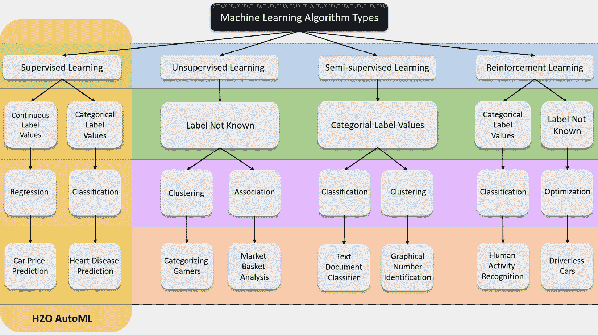

图 5.1–最大似然问题的类型和算法

同样，H2O 的 AutoML 也专注于监督学习，因此，人们通常希望你有可以输入的带标签的数据。

与监督学习算法相比，执行无监督学习的 ML 算法通常非常复杂，因为没有衡量模型性能的基本事实。这违背了 AutoML 的本质，它非常依赖于模型性能测量来自动化训练和超参数调整。

因此，相应地，H2O AutoML 属于监督 ML 算法的领域，它训练几个监督 ML 算法来解决回归和分类问题，并根据它们的性能对它们进行排名。在这一章中，我们将集中讨论这些最大似然算法并理解它们的功能，这样我们就能很好地理解、选择和证明 H2O 自动化为给定预测问题训练的不同模型。

有了这个认识，我们就从第一个 ML 算法开始:广义线性模型。

# 了解广义线性模型算法

**广义线性模型** ( **GLM** )，顾名思义，是广义线性模型的一种灵活的方式。它是由约翰·内尔德和罗伯特·威德伯恩制定的，作为一种将各种回归模型结合成一个单一分析的方法，并考虑到不同的概率分布。你可以找到他们的详细论文(内尔德，J.A .和威德伯恩，R.W .，1972。*广义线性模型。皇家统计学会杂志:A 辑(总论)，135(3)，第 370-384 页*。)在[https://rss.onlinelibrary.wiley.com/doi/abs/10.2307/2344614](https://rss.onlinelibrary.wiley.com/doi/abs/10.2307/2344614)。

现在，你可能想知道什么是线性模型。为什么我们需要概括它们？它提供了什么好处？这些确实是相关的问题，不需要深究数学就很容易理解。一旦我们打破逻辑，你会发现 GLM 的概念非常容易理解。

所以，让我们从了解线性回归的基础开始。

## 线性回归简介

**线性回归**可能是最古老的统计模型之一，可以追溯到 200 年前。这是一种将因变量和自变量之间的关系线性映射到图上的方法。这意味着两个变量之间的关系可以完全用一条直线来解释。

考虑下面的例子:

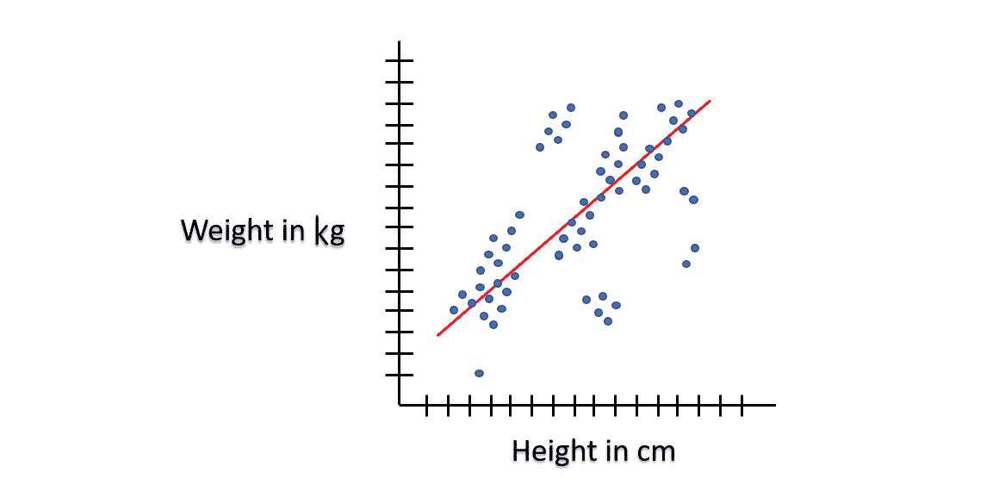

图 5.2–线性回归

这个例子演示了两个变量之间的关系。人的身高 H 是自变量，人的体重 W 是因变量。这两个变量之间的关系很容易用一条红色直线来解释。一个人越高，他或她就越可能重。很容易理解。

统计上，任何直线的一般方程，也称为**线性方程**，如下:

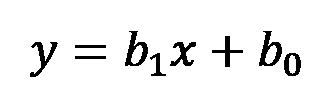

在这里，我们有以下内容:

*   *y* 是 *Y* 轴上的一点，表示因变量。
*   *x* 是 *X* 轴上的一点，表示自变量。
*   *b*1 是直线的斜率，也叫梯度，表示直线有多陡。坡度越大，线就越陡。
*   *b* *0* 是一个常数，表示直线与 *Y* 轴的交点。

在线性回归过程中，机器会将两个变量的所有数据点映射到图上，并在图上随机放置直线。然后，它将通过将图中数据点的 *x* 的值插入线性方程，并将结果与数据点的相应 *y* 值进行比较，来计算 *y* 的值。之后，它将计算其计算的 *y* 值与实际的 *y* 值之间的误差大小。这个差值就是我们所说的**残差**。

下图应该有助于您理解什么是残差:

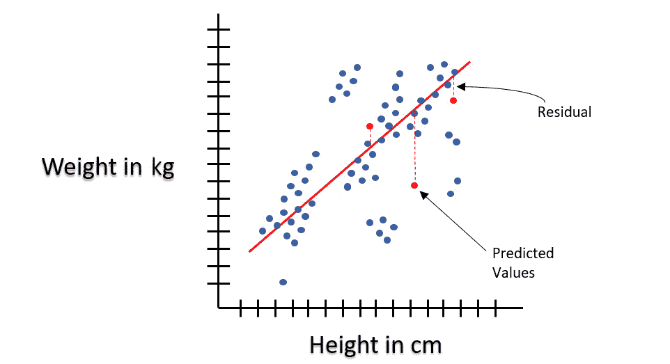

图 5.3–线性回归中的残差

机器将对所有的数据点都这样做，并记录所有的错误。然后，它将尝试通过改变 b1 和 b0 的值来调整该线，这意味着改变该线在图上的角度和位置，并重复该过程。它会一直这样做，直到误差最小。

产生最小误差的 b1 和 b0 值是两个变量之间最精确的线性关系。具有 b1 和 b0 这些值的方程是线性模型。

现在，假设你想预测一个身高 180 厘米的人的体重。然后，您使用带有 b1 和 b0 值的相同线性模型方程，将 *x* 设置为 180，并计算 *y* ，这将是预期的重量。

恭喜你，你刚刚在没有任何计算机的情况下在你的头脑中执行了 ML，并且也做出了预测！实际的 ML 以同样的方式工作，尽管复杂的算法增加了复杂性。线性回归不需要仅限于两个变量——它也可以应用于多个变量，其中有一个以上的独立变量。这种线性回归被称为多元或曲线回归。这种线性回归的方程展开如下:

在这个等式中，附加变量 x1、x2、x3 等分别加上它们自己的系数 b1、b2 和 b3。

如果您对线性回归的内部工作方式感兴趣，请随意探索这些算法及其背后的数学。

## 理解线性回归的假设

当在给定的数据集上训练模型时，线性回归是基于对数据的某些假设。其中一个假设是**误差的正态性**。

在我们理解什么是误差的正态性之前，让我们快速理解**概率密度函数**的概念。这是一个定义离散值概率分布的数学表达式，换句话说，它是一个显示给定样本空间中样本值出现的概率的数学表达式。要理解这一点，请参考下图:

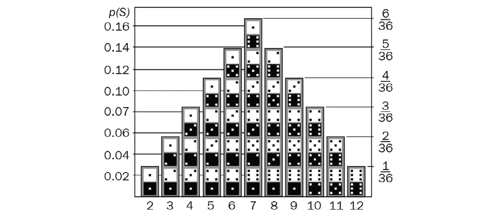

图 5.4-两个骰子数值的概率分布

上图显示了公平独立地掷出一对六面骰子时可能出现的所有值的概率分布。有不同种类的分布。常见分布的一些示例如下:

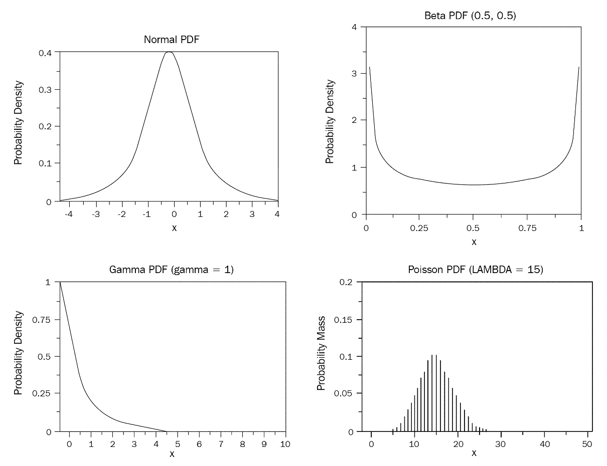

图 5.5–不同类型的分布

误差的正态性表明数据的残差必须是正态分布的。**正态分布**，也称为**高斯分布**，是一种关于平均值对称的概率密度函数，其中最接近平均值的值经常出现，而远离平均值的值很少出现。下图显示了正态分布:

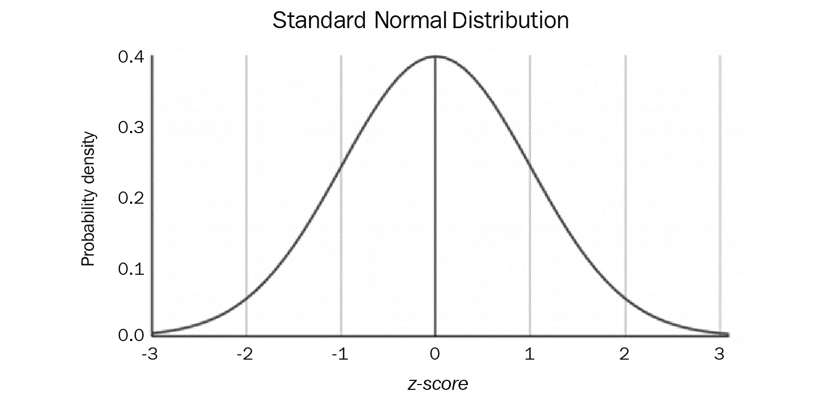

图 5.6-正态分布

线性回归预计计算出的残差属于正态分布。在我们前面的身高预期体重的例子中，对于一个有一定身高的人来说，预测体重和实际体重之间肯定会有一些误差。然而，来自预测的残差或误差将最有可能落在正态分布内，因为不会有太多的人出现预期体重和预测体重之间的极端差异。

考虑一个人们要求健康保险赔偿的场景。下图显示了该数据集的线性回归图示例:

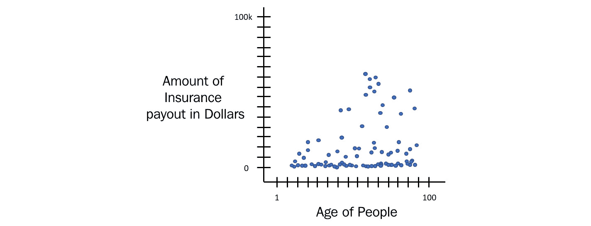

图 5.7-健康保险支出

在上图中，你可以看到不同年龄段的大多数人都没有申请健康保险。他们中的一些人这样做了，索赔的费用相差很大。一些人有小问题，花费很少，而一些人受了重伤，不得不接受昂贵的手术。

如果您绘制一条穿过该数据集的线性回归线，它将如下所示:

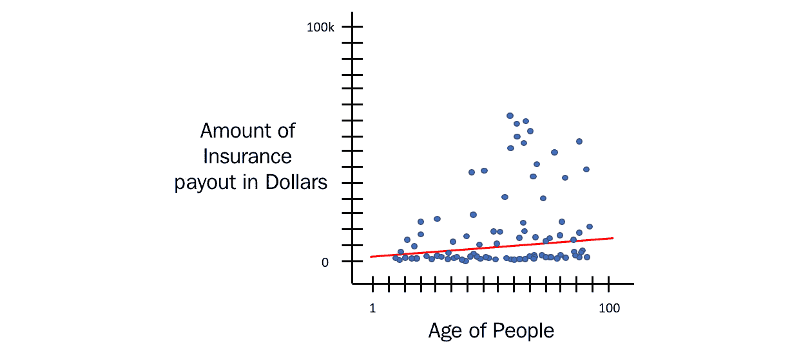

图 5.8-健康保险支出的线性回归

但是现在，如果你从所有数据点的期望值和预测值计算出残差，那么这些残差的概率分布将不会落入正态分布。它将如下所示:

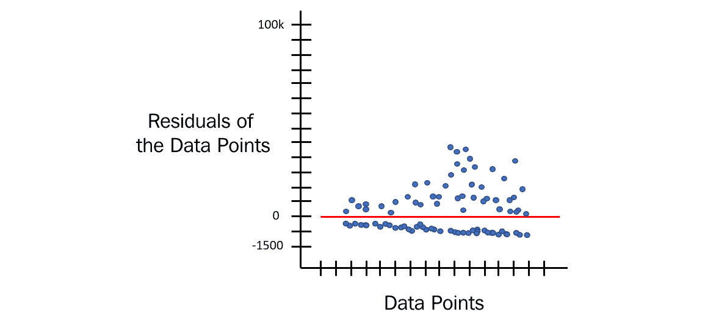

图 5.9-健康保险支出的剩余分布

这是一个不准确的模型，因为预期值和预测值甚至不够接近，无法进行舍入或校正。那么，在数据集的误差正态性假设失效的情况下，你该怎么办呢？如果残差的分布是，比如说，泊松分布而不是正态分布呢？机器将如何纠正这一点？

这个问题的答案是残差的分布取决于数据集本身的分布。如果因变量的值是正态分布的，那么残差的分布也将是正态的。因此，一旦我们确定了哪个概率密度函数符合数据集，我们就可以使用该函数来训练我们的线性模型。

根据该函数，每个概率密度函数都有专门的线性回归方法。如果你的分布是**泊松**，那么你可以用**泊松回归**。如果你的数据分布是负**二项式**，那么你可以用**负二项式回归**。

## 使用广义线性模型

既然我们已经介绍了基础知识，让我们集中精力理解 GLM 是什么。GLM 是一种指向特定于数据概率分布类型的所有回归方法的方式。从技术上讲，所有的回归模型都是 GLM，包括我们普通的简单线性模型。GLM 只是将它们封装在一起，并根据概率分布函数训练适当的回归模型。

GLM 的工作方式是通过使用一种叫做连接函数的东西，结合一个系统组件和随机变量。

这是 GLM 的三个组成部分:

*   **系统成分**:回到多变量线性方程，我们有如下:

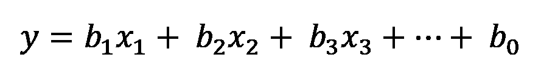

这里 b1x1+ b2x2 + b3x3 + ……。+ b0 是系统元件。这是将我们的数据(也称为预测值)与我们的预测联系起来的函数。

*   **随机分量**:该分量是指响应变量的概率分布。这将是响应变量是正态分布还是二项式分布或任何其他形式的分布。
*   **链接函数**:链接函数是将数据的非线性关系映射为线性关系的函数。换句话说，它弯曲了线性回归的直线，以更准确地表示非线性数据的关系。它是随机成分和系统成分之间的联系。我们可以用一个链接函数在数学上解释方程为*Y = f*n*(b*1*x*1*+b*2*x*2*+b*3*x*3*+……。+ b* 0 *)* ，其中 *f* n 是根据响应变量的分布而变化的链接函数。

不同分布的链接功能不同。下表显示了不同发行版的不同链接功能:

| **分配类型** | **链接功能** | **算法名称** |
| 常态 | 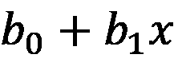 | 线性模型 |
| 二项式 | 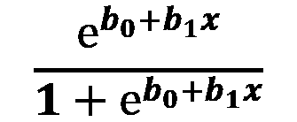 | 逻辑回归 |
| 泊松 | 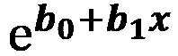 | 泊松回归 |
| 微克 | 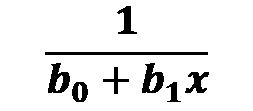 | 伽马回归 |

图 5.10-不同分布类型的链接功能

训练 GLM 模型时，您可以选择族超参数的值。“系列”选项指定响应列的概率分布，GLM 训练算法在训练过程中使用适当的链接函数。

系列超参数的值如下:

*   **高斯**:如果响应是一个实数，您应该选择此选项。
*   **二项式**:如果响应是分类的，有两个类或二进制文件，可以是枚举或整数，您应该选择这个选项。
*   **分数二项式**:如果响应是介于 0 和 1 之间的数字，您应该选择此选项。
*   **顺序**:如果响应是具有三个或更多类别的分类响应，则应选择此选项。
*   **准二项式**:如果答案是数字，您应该选择此选项。
*   **多项式**:如果响应是具有三个或更多枚举类型的类别的分类响应，则应选择此选项。
*   **泊松**:如果响应是数字并且包含非负整数，您应该选择此选项。
*   **gamma** :如果响应是数字且连续的，且包含正实数，则应选择此选项。
*   **tweedie** :如果响应是数字，并且包含连续的实数值和非负值，您应该选择此选项。
*   **negativebinomial** :如果响应为数字且包含非负整数，则应选择此选项。
*   **自动**:自动为用户确定系列。

您可能已经猜到，H2O 的 AutoML 在训练 GLM 车型时选择 AUTO 作为家族类型。AutoML 过程通过了解数据集中响应变量的分布并应用正确的链接函数来训练 GLM 模型，从而处理选择正确分布族的情况。

恭喜你，我们刚刚了解了 GLM 算法是如何工作的！GLM 是一种非常强大和灵活的算法，H2O AutoML 专业地配置其训练，以便它训练最准确和高性能的 GLM 模型。

现在，让我们继续下一个 H2O 训练的 ML 算法:**分布式随机森林** ( **DRF** )。

# 了解分布式随机森林算法

**DRF** ，简称**随机森林**，是一种非常强大的监督学习技术，经常用于分类和回归。DRF 学习技术的基础基于**决策树**，其中大量的决策树被随机创建并用于预测，它们的结果被组合以获得最终输出。这种随机性用于最小化所有个体决策树的偏差和方差。所有的决策树被组合在一起称为一个森林，因此命名为随机森林。

为了从概念上更深入地理解 DRF，我们需要理解 DRF 的基本构建模块——即决策树。

## 决策树简介

简单来说，决策树就是一组*，如果*的条件是根据传递给它的数据返回是或否的答案。下图显示了决策树的一个简单示例:

图 5.11-简单决策树

上图显示了一个基本的决策树。决策树由以下组件组成:

*   **节点**:如果条件根据条件是否满足来分割决策树，那么节点基本上就是*。*
*   **根节点**:决策树顶端的节点称为根节点。
*   **叶节点**:决策树中不再分支的节点称为叶节点，或简称为叶子。在这种情况下，条件是，如果传递给它的数据的值是数字，那么答案是数据是一个数字；如果传递给它的数据不是数值型的，那么答案就是数据不是数值型的。这很容易理解。

如图*图 5.11* 所示，决策树基于一个简单的对或错问题。决策树也可以基于数字数据的数学条件。以下示例显示了基于数字条件的决策树:

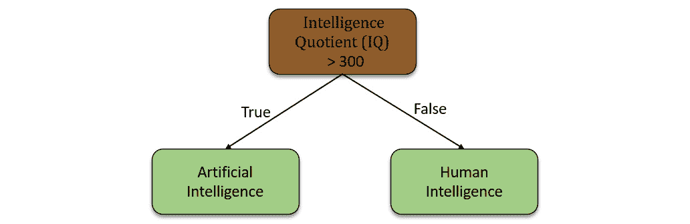

图 5.12–数字决策树

在这个例子中，根节点计算智商值是否大于 300，并决定它是人工智能还是人类智能。

决策树也可以合并。它们可以形成一组复杂的决策条件，这些条件依赖于先前决策的结果。请参考下面的复杂决策树示例:

图 5.13-复杂决策树

在前面的例子中，我们试图计算*你是否可以去外面玩*或者*完成你的 ML 学习*。该决策树结合了数字数据和数据分类。在进行预测时，决策树将从顶部开始，一路向下，决定数据是否满足条件。叶节点是决策树的最终潜在结果。

了解这些知识后，让我们在一个样本数据集上创建一个决策树。有关样本数据集，请参考下表:

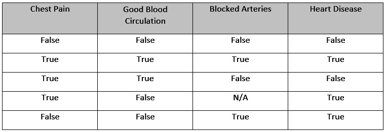

图 5.14–创建决策树的样本数据集

前述数据集的内容如下:

*   **胸痛**:此栏显示患者是否有胸痛。
*   **血液循环良好**:此栏表示患者血液循环是否良好。
*   **动脉阻塞**:此栏显示患者是否有动脉阻塞。
*   **心脏病**:此栏表示患者是否患有心脏病。

对于这个场景，我们希望创建一个决策树，使用胸痛、良好的血液循环和阻塞的动脉特征来预测患者是否患有心脏病。现在，当形成决策树时，我们需要做的第一件事是找到根节点。那么，我们应该将什么特性放在决策树的顶部呢？

我们首先来看看胸痛在预测心脏病时是如何单独表现出来的。我们将遍历数据集中的所有值，并将它们映射到该决策树，同时将胸痛列中的值与心脏病列中的值进行比较。我们将在决策树中跟踪这些关系。以胸痛为根节点的决策树如下所示:

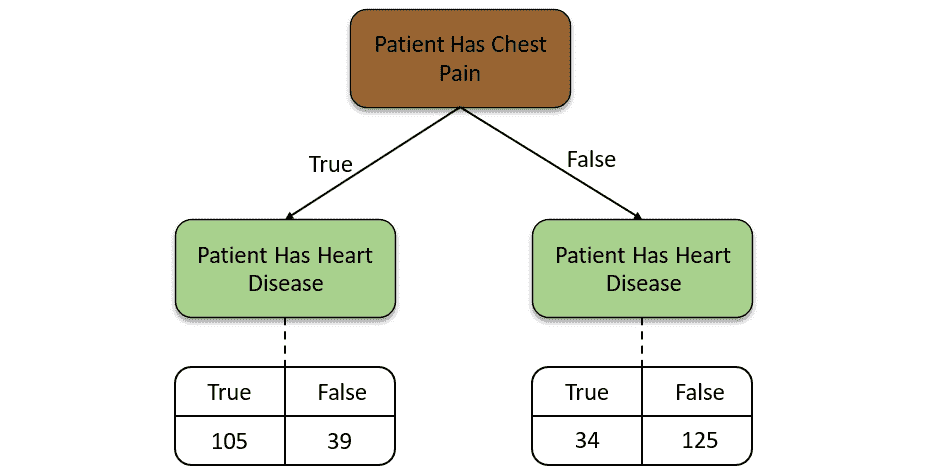

图 5.15–胸痛特征的决策树

现在，我们对数据集中的所有其他特征都这样做。我们为良好的血液循环创建了一个决策树，看看它在预测心脏病时是如何表现的，并跟踪比较结果，对阻塞的动脉状况也重复同样的过程。如果数据集中有任何丢失的值，那么我们跳过它们。理想情况下，您不应该使用缺少值的数据集。我们可以使用我们在第 3 章 、*了解数据处理*中学到的技术，在这里我们估算并处理缺失的数据集值。

参考下图，其中显示了创建的两个决策树——一个用于**患者动脉阻塞**,另一个用于**患者血液循环良好**:

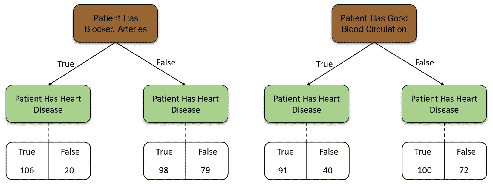

图 5.16–阻塞动脉和良好血液循环特征的决策树

现在我们已经为数据集中的所有特征创建了决策树，我们可以比较它们的结果来找到纯粹的特征。在决策树的上下文中，当一个节点被平均分割时，一个特征被认为是 100%不纯的，当它的所有数据都属于一个类时，被认为是 100%纯的。在我们的场景中，我们没有任何 100%纯净的特性。我们所有的特征在某种程度上都是不纯洁的。所以，我们需要找到一些方法来找到最纯粹的特征。为此，我们需要一个度量标准来衡量决策树的纯度。

数据科学家和工程师有很多方法来衡量纯度。衡量决策树中杂质最常见的指标是**基尼杂质**。基尼系数衡量的是在分类过程中，一个新的随机数据实例被错误分类的可能性。

基尼系数的计算如下:

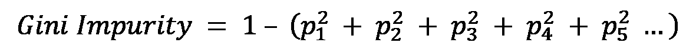

这里，p1，p2，p3，p4 …是心脏病各种分类的概率。在我们的方案中，我们只有两种分类——是或否。因此，在我们的方案中，杂质的度量如下:

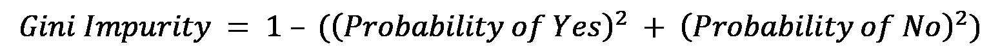

因此，让我们计算一下我们刚刚创建的所有决策树的基尼系数和，这样我们就可以找到最纯粹的特征。具有多个叶节点的决策树的基尼系数是通过计算各个叶节点的基尼系数，然后计算所有系数值的加权平均值，从而得到整个决策树的基尼系数来计算的。因此，让我们从计算胸痛决策树的左叶节点的基尼不纯度开始，并对右叶节点重复这一过程:

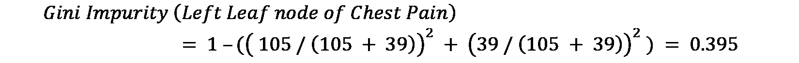

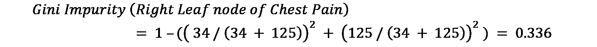

我们之所以计算基尼系数杂质的加权平均值，是因为数据的表示在决策树的两个分支之间不是平均分配的。加权平均值有助于我们抵消数据值的这种不均衡分布。因此，我们可以如下计算整个胸痛决策树的基尼系数:

*基尼系数(胸痛)=叶节点基尼系数的加权平均值*

*基尼不洁(胸痛)=*

*(左叶节点的数据输入总数/总行数)x 左叶节点的 Gini 杂质*

*+*

*(右叶节点的数据输入总数/总行数)x 右叶节点的 Gini 杂质*

*=(144/(144+159))x 0.395+(159/(144+159))x 0.364*

*= 0.364*

胸痛决策树的基尼杂质为 0.364。

我们对所有其他特征决策树也重复这个过程。我们应该得到以下结果:

*   胸痛决策树的基尼不纯度为 0.364
*   良好血液循环树的基尼不纯度为 0.360
*   阻塞动脉树的基尼系数为 0.381

对比这些值，我们可以推断出血液循环良好特征的基尼杂质基尼杂质最低，是数据集中最纯净的特征。所以，我们将把它作为我们决策树的根。

参照*图 5.12* 和*图 5.13* ，当我们利用良好的血液循环特征对患者进行划分时，结果在左右叶节点上的分布不纯。因此，每一个叶节点都有显示有无心脏病的混合结果。现在，我们需要找出一种方法，使用其余的特征(胸痛和动脉阻塞)将混合结果与良好的血液循环特征分开。

因此，正如我们之前所做的那样，我们将使用这些混合结果，并使用其他特征将它们分开，并计算这些特征的基尼不纯度值。我们将选择最纯粹的特征，并在给定的节点替换它，用于进一步的分类。

我们将对右分支重复这一过程。因此，为了简化决策树节点的选择，我们必须执行以下操作:

*   使用混合结果计算该节点所有剩余特征的基尼系数。
*   选择杂质最低的一个，用节点代替。
*   对决策树的其余功能重复相同的过程。
*   只要分类降低了基尼系数，就继续替换节点；否则，将其保留为叶节点。

因此，您最终的决策树将如下所示:

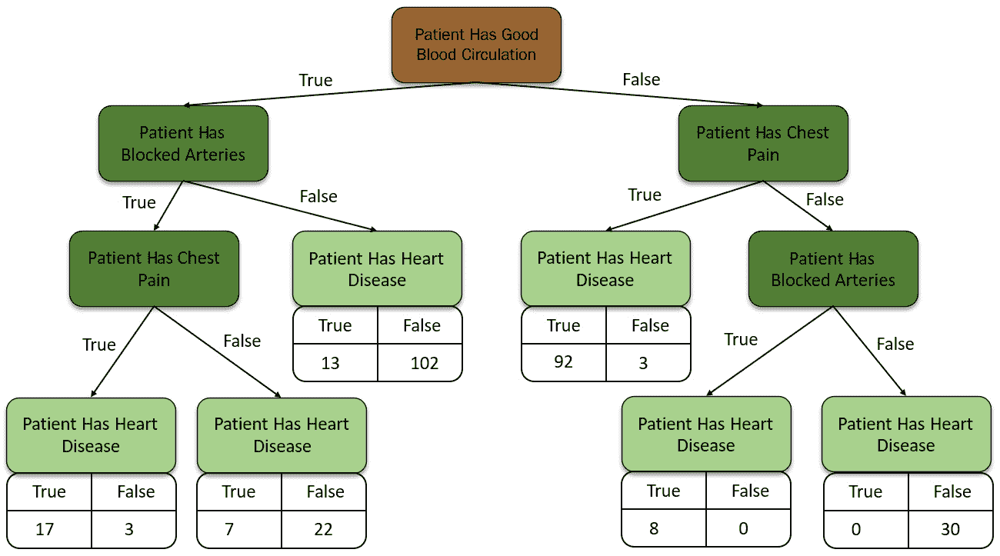

图 5.17–最终的决策树

这种决策树适用于值为真或假的分类。如果你有数字数据呢？

用数字数据创建决策树非常容易，其步骤与我们处理真/假数据的步骤几乎相同。将重量视为一个新特征；**重量**栏的数据如下:

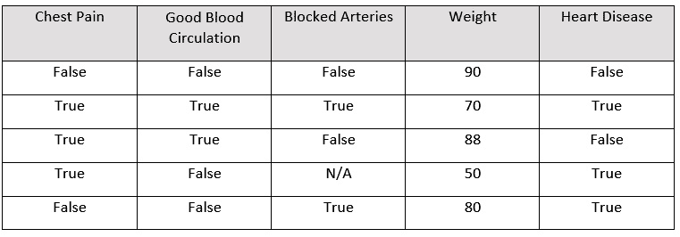

图 5.18–具有新功能的数据集，重量，以千克为单位

对于这个场景，我们必须遵循这些步骤:

1.  按升序对数据进行排序。在我们的场景中，我们将使用 Weight 列从最高到最低对数据集的行进行排序。
2.  计算所有相邻行的平均权重:

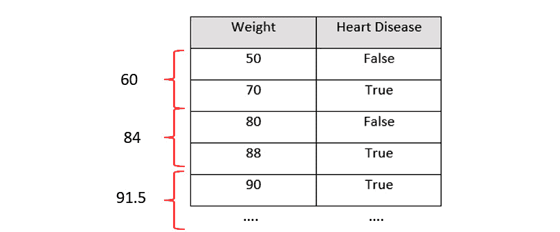

图 5.19–计算后续行值的平均值

1.  计算我们计算的所有平均值的基尼系数:

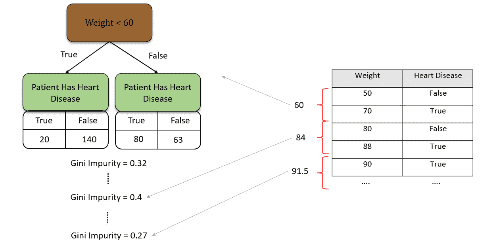

图 5.20-计算所有平均值的基尼系数

1.  确定并选择平均特征值，使我们的基尼系数杂质值最小。
2.  将选定的特征值用作决策树中的决策节点。

使用决策树进行预测非常容易。您将拥有包含胸痛、动脉阻塞、良好循环和体重值的数据,并将其输入决策树模型。该模型将在计算节点条件时沿决策树向下筛选值，并最终使用预测值到达叶节点。

祝贺您——您已经理解了决策树的概念！尽管决策树易于理解和实现，但它们并不擅长解决现实生活中的 ML 问题。

使用决策树有一些缺点:

*   决策树非常不稳定。数据集中的任何微小变化都会极大地改变模型的性能和预测结果。
*   它们不准确。
*   对于包含大量要素的大型数据集，它们可能会变得非常复杂。想象一个有 1000 个特征的数据集，这个数据集的决策树将有一个深度非常大的树，并且它的计算将是非常资源密集型的。

为了减轻所有这些缺点，随机森林算法被开发出来，它建立在决策树之上。有了这些知识，让我们继续下一个概念:随机森林。

## 随机森林简介

**随机森林**，也叫**随机决策森林**，是一种 ML 方法，在学习的过程中建立大量的决策树，并对个体决策树的结果进行分组或集成，进行预测。随机森林用于解决分类和回归问题。对于分类问题，大多数决策树预测的类值就是预测值。对于回归问题，计算单个树的平均值或平均预测，并将其作为预测值返回。

随机森林算法在训练期间遵循以下学习步骤:

1.  从原始数据集创建一个引导数据集。
2.  随机选择数据特征的子集。
3.  使用所选的特征子集开始创建决策树，其中最能分割数据的特征被选为根节点。
4.  选择其他剩余特征的随机子集来进一步分割决策树。

让我们通过创建一个来理解随机森林的概念。

我们将使用与我们在图 5.17 中制作复杂决策树时使用的数据集。这个数据集就是我们用来做决策树的那个。要创建随机森林，我们需要创建数据集的引导版本。

引导数据集是通过从数据集中随机选择行从原始数据集创建的数据集。引导数据集与原始数据集大小相同，并且还可以包含原始数据集中的重复行。有许多用于创建引导数据集的内置函数，您可以使用其中任何一个来创建一个。

考虑以下引导数据集:

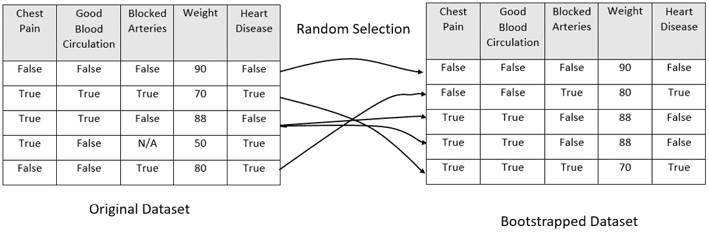

图 5.21–引导数据集

下一步是从引导数据集创建决策树，但在每一步中只使用要素列的子集。因此，选择所有要在决策树中考虑的特征只会让你将良好的血液循环和阻塞的动脉作为决策树的特征。

我们将遵循相同的纯度识别标准来确定节点的根。让我们假设对于我们的实验，良好的血液循环是最纯净的。将它设置为根节点，我们现在将考虑剩余的特性来填充下一层决策节点。就像我们之前做的一样，我们将从剩余的特性中随机选择两个特性，并决定哪个特性应该适合下一个决策节点。我们将照常构建树，同时在每一步考虑剩余变量的随机子集。

这是我们刚刚做的树:

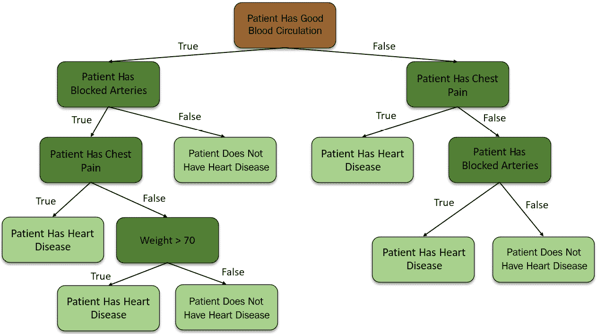

图 5.22-来自引导数据集的第一个决策树

现在，我们重复相同的过程，同时创建多个决策树，引导并从随机树中选择特征。理想的随机森林将创建数百个决策树，如下所示:

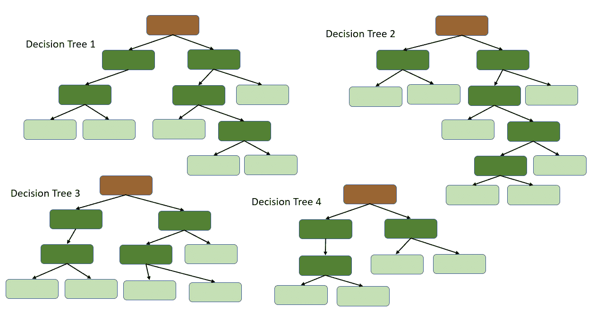

图 5.23–来自不同引导数据集的多个决策树

这种用随机实现创建的大量决策树使得随机森林比单个决策树更有效。

现在我们已经创建了随机森林，让我们看看如何使用它来进行预测。为了进行预测，您将拥有一个包含不同特征的数据值的行，并且您希望预测该人是否患有心脏病。

您将沿着随机林中的单个决策树传递这些数据:

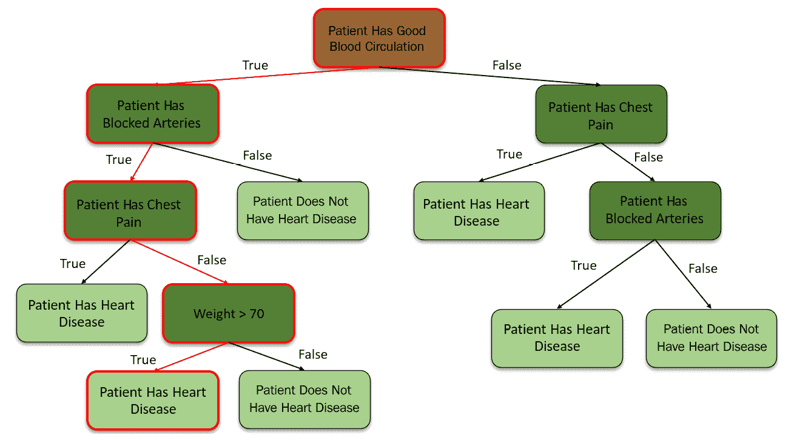

图 5.24–随机森林中第一棵决策树的预测

决策树将根据其结构预测结果。我们将保持该树所做预测的轨迹，并继续将数据传递给其他树，同时记录它们的预测:

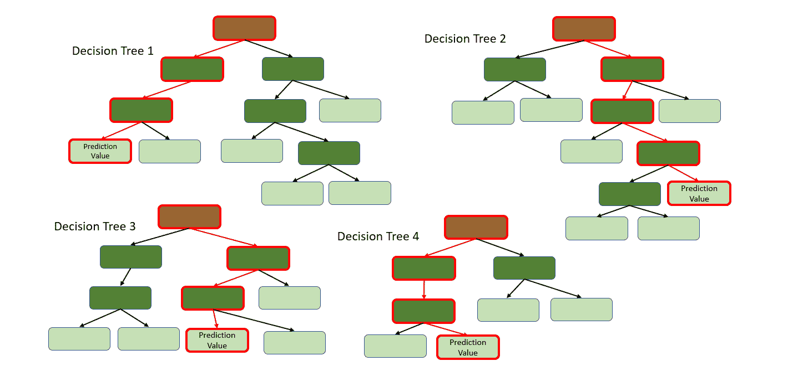

图 5.25-随机森林中其他单棵树的预测

一旦我们从所有的单个树中得到预测，我们就可以找出哪个值从所有的决策树中得到了最多的投票。投票数最多的预测值将结束对随机森林的预测。

对数据集进行自举，聚合所有决策树的预测值来做出决策，称为**装袋**。

恭喜你——你已经理解了随机森林的概念！尽管随机森林是一种具有低偏差和方差的非常好的最大似然算法，但是仍然遭受高计算要求的困扰。因此，H2O 自动化没有训练随机森林，而是训练了随机森林的另一个版本，叫做**极度随机化树** ( **XRT** )。

## 理解极度随机化的树

**XRT** 算法，也称为**树**，就像普通的随机森林算法。然而，随机森林和 XRT 有两个主要区别，如下所示:

*   在随机森林中，我们使用自举数据集来训练个体决策树。在 XRT，我们使用整个数据集来训练单个决策树。
*   在随机森林中，在构建单个决策树时，根据某些选择标准(如杂质度量或错误率)来分割决策节点。在 XRT，这个过程是完全随机的，结果最好的会被选中。

让我们用理解随机森林的同一个例子来理解 XRT。我们有一个数据集，如图*图 5.17* 所示。我们将按原样使用数据集，而不是像在图 5.20 中那样引导数据。

然后，我们开始通过随机选择特征子集来创建我们的决策树。在随机森林中，我们使用纯度标准来决定哪个特征应该被设置为决策树的根节点。然而，对于 XRT，我们将随机设置决策树的根节点和决策节点。类似地，我们将创建多个这样的决策树，所有的特征都是随机选择的。这种增加的随机性允许算法进一步减少模型的方差，代价是偏差略有增加。

恭喜你！我们刚刚研究了 XRT 算法如何使用极度随机化的决策树来进行精确的回归和分类预测。现在，让我们了解 GBM 算法如何训练一个分类模型来对数据进行分类。

# 理解梯度推进机算法

**梯度推进机** ( **GBM** )是一种前向学习集成 ML 算法，既能处理分类也能处理回归。GBM 模型是一个集成模型，就像 DRF 算法一样，从某种意义上说，GBM 模型作为一个整体，是多个弱学习者模型的组合，其结果被聚集并呈现为 GBM 预测。GBM 的工作方式类似于 DRF，因为它由多个决策树组成，这些决策树按顺序构建，以最小化错误。

GBM 可用于预测连续数值，以及对数据进行分类。如果用 GBM 来预测连续的数值，我们说我们是在用 GBM 进行回归。如果我们正在使用 GBM 对数据进行分类，那么我们说我们正在使用 GBM 进行分类。

GBM 算法的基础是决策树，就像 DRF 一样。然而，与 DRF 相比，决策树的构建方式是不同的。

让我们试着理解 GBM 算法是如何进行回归的。

## 建造梯度推进机

我们将使用下面的示例数据集，并在概念上构建模型时理解 GBM 是如何工作的。下表包含数据集的一个示例:

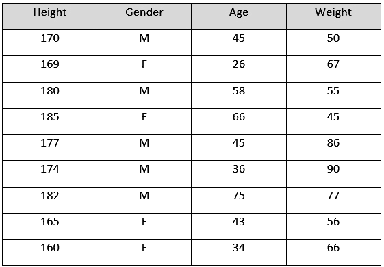

图 5.26–GBM 的样本数据集

这是一个任意的数据集,我们使用它只是为了理解 GBM 将如何构建它的 ML 模型。数据集的内容如下:

*   **身高**:此栏显示人的身高，单位为厘米。
*   **性别**:此栏表示人的性别。
*   **年龄**:此栏表示人的年龄。
*   **体重**:此栏表示人的体重。

与 DRF 不同，GBM 从叶节点而不是根节点开始创建弱学习决策树。它将创建的第一个叶节点将是响应变量的所有值的平均值。因此，相应地，GBM 算法将创建叶节点，如下图所示:

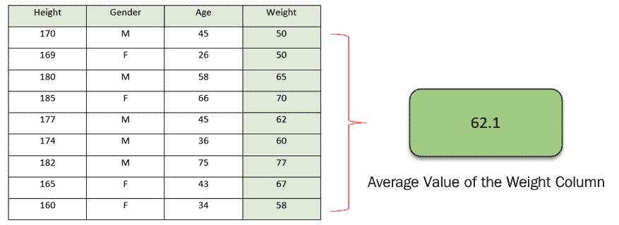

图 5.27–使用列平均值计算叶节点

单独的这个叶节点也可以被认为是一个决策树。它就像一个预测模型，只预测任何类型的输入数据的常数值。在这种情况下，它是我们从响应列中得到的平均值。正如我们所料，这是一种不正确的预测方式，但这只是 GBM 的第一步。

GBM 要做的下一件事是根据它从数据集的初始叶节点预测中观察到的错误创建另一个决策树。正如我们之前所讨论的，误差只不过是观察到的重量和预测的重量之间的差异，也称为残差。然而，这些残差不同于我们将从完整的 GBM 模型中得到的实际残差。我们从 GBM 的弱学习器决策树中得到的残差称为**伪残差**，而 GBM 模型的残差是实际残差。

因此，如前所述，GBM 算法将为数据集中的所有数据值计算第一个叶节点的伪残差，并创建一个特殊的列来跟踪这些伪残差值。

为了更好地理解，请参考下图:

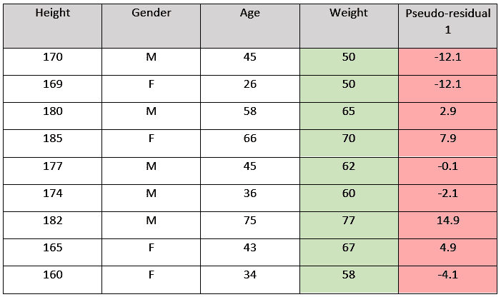

图 5.28–带有伪残差的数据集

使用这些伪残差值，GBM 算法然后使用所有剩余特征(即身高、最喜欢的颜色和性别)构建决策树。决策树将如下所示:

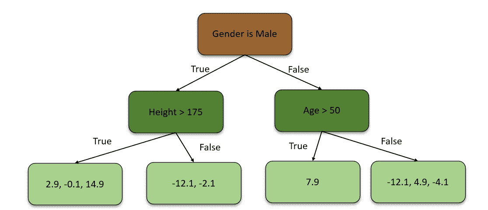

图 5.29-使用伪残值的决策树

如您所见，该决策树只有四个叶节点，而从第一棵树生成的算法中的伪残差值远不止四个。这是因为 GBM 算法限制了它生成的决策树的大小。对于这个场景，我们只使用了四个叶节点。在配置 GBM 算法时，数据科学家可以通过传递正确的超参数来控制树的大小。理想情况下，对于大型数据集，通常使用 8 到 32 个叶节点。

由于决策树中的叶节点的限制，决策树最终在相同的叶节点中具有多个伪残差值。因此，GBM 算法用它们的平均值替换它们，以获得单个叶节点的一个具体数字。因此，在计算平均值后，我们将得到一个如下所示的决策树:

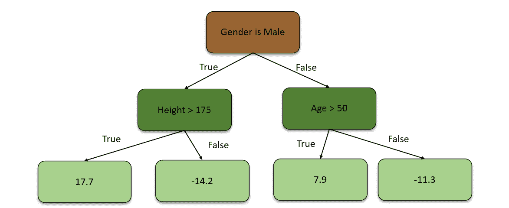

图 5.30–使用平均伪残差值的决策树

现在，该算法将原始叶节点与这个新的决策树结合起来，对其进行预测。因此，现在，我们从初始叶节点预测中得到值 71.2。然后，在沿着决策树运行数据之后，我们得到 16.8。因此，预测的重量是两个预测的总和，即 88。这也是观察到的重量。

这是不正确的，因为这是过度配合的情况。**过度拟合**是一种建模错误，其中模型函数过于精细，无法仅预测数据集中可用的数据值，而无法预测数据集之外的任何其他值。因此，该模型对于预测数据集之外的任何值变得毫无用处。

因此，为了纠正这一点，GBM 算法为它训练的所有弱学习者决策树分配一个学习率。**学习速率**是一个超参数，它调整模型学习新信息的速率，新信息可以覆盖旧信息。学习率的值范围是从 0 到 1。通过将该学习率添加到来自决策树的预测中，该算法控制决策树预测的影响，并逐步缓慢地向最小化误差移动。对于我们的例子，让我们假设学习率是 0.1。因此，相应地，预测重量可以计算如下:

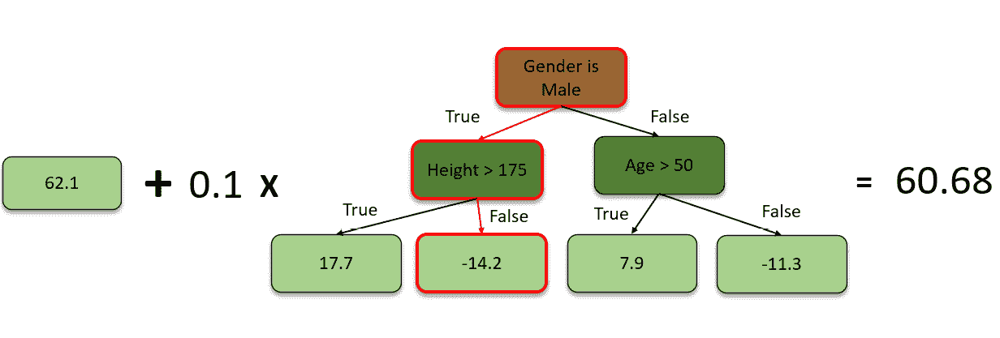

图 5.31–计算预测重量

因此，该算法将插入决策树所做预测的学习率，然后计算预测的权重。现在预测的体重会是 *62.1 + (0.1 x -14.2) = 60.68* 。

60.68 不是一个非常好的预测，但它仍然是比 62.68 更好的预测，62.68 是初始叶节点所预测的。最小化误差的增量步骤是保持预测中低方差的正确方法。学习率的正确平衡也很重要，因为太高的学习率会使校正偏离相反的方向，而太低的学习率会导致长的计算时间，因为算法将采取非常小的校正步骤来达到最小误差。

为了进一步校正预测值并最小化误差，GBM 算法将创建另一个决策树。为此，它将根据用叶节点和第一决策树做出的预测来计算新的伪残差值，并使用这些值来构建第二决策树。

下图显示了如何计算新的伪残值:

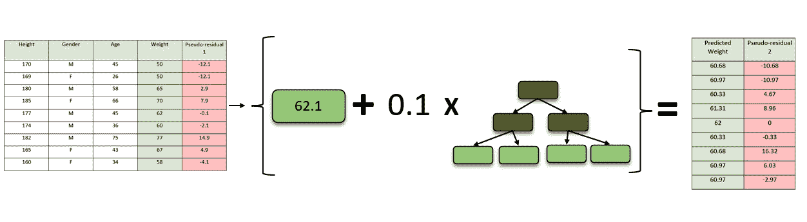

图 5.32–计算新的伪残值

您会注意到，与第一个伪残差值相比，生成的新伪残差值更接近实际值。这表明 GBM 模型正在慢慢地最小化误差并提高其准确性。

继续第二决策树，该算法使用新的伪残差值来创建第二决策树。一旦创建，它就将树连同学习率一起聚集到已经存在的叶节点和第一个决策树。

每次 GBM 算法创建决策树时，决策树可能会有所不同。然而，所有树的学习率都是一样的。因此，现在，预测值将是三个部分的总和——初始叶节点预测值、第一个决策树预测的调整值和第二个决策树预测的调整值。因此，预测值如下:

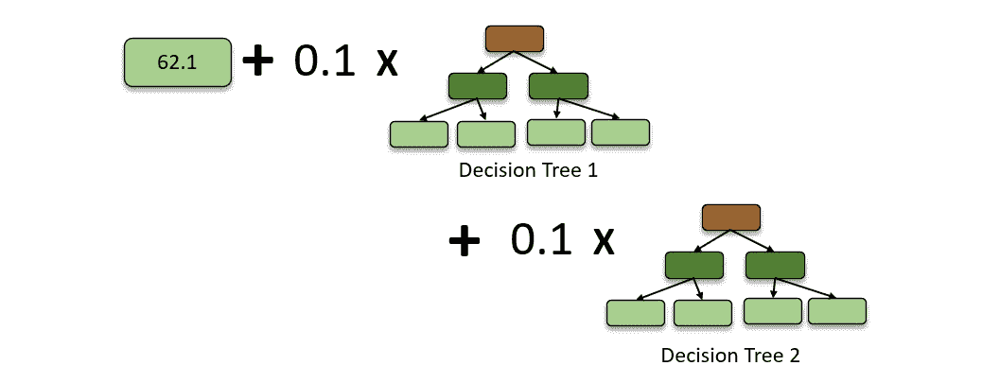

图 5.33–带有第二个提升决策树的 GBM 模型

GBM 算法将重复相同的过程，创建指定数量的决策树，或者直到增加决策树不再改善预测。因此，最终，GBM 模型将如下所示:

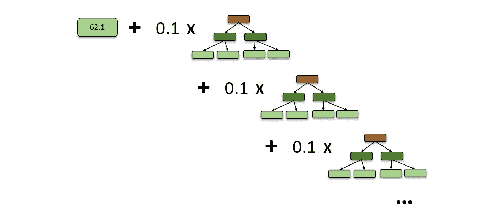

图 5.34-完整的 GBM 模型

恭喜你！我们刚刚探讨了 GBM 算法如何使用弱决策树学习器的集合来进行准确的回归预测。

H2O 自动化使用的另一种算法是 XGBoost 算法，它建立在 GBM 之上。XGBoost 代表极端梯度提升，并实现了一种称为提升的过程，有时有助于训练性能更好的模型。它是 Kaggle 竞赛中使用最广泛的 ML 算法之一，并已被证明是一种惊人的 ML 算法，可用于分类和回归。对于不精通统计学的用户来说，XGBoost 工作原理背后的数学原理可能有点困难。但是，强烈建议您花时间了解更多关于该算法的知识。你可以在[https://docs . H2O . ai/H2O/latest-stable/H2O-docs/data-science/XGBoost . XHTML](https://docs.h2o.ai/h2o/latest-stable/h2o-docs/data-science/xgboost.xhtml)找到更多关于 H2O 如何进行 XGBoost 训练的信息。

小费

集成 ML 是一种结合多个 ML 模型的方法，与单个模型的性能相比，可以获得更好的预测结果——就像决策树的组合如何使用 bagging 创建随机森林算法，以及 GBM 算法如何使用弱学习器的组合来最小化错误。集成模型通过找到预测算法的最佳组合并使用它们的组合性能来训练元学习器来提供改进的性能，从而更进一步。这是通过一个叫做堆叠的过程来完成的。你可以在 https://docs . H2O . ai/H2O/latest-stable/H2O-docs/data-science/stacked-ensembles . XHTML # stacked-ensembles 找到更多关于 H2O 如何训练这些 stacked ensemble 模型的信息。

现在，让我们学习深度学习是如何工作的，并了解神经网络。

# 理解什么是深度学习

**深度学习** ( **DL** )是 ML 的一个分支，利用**人工神经网络** ( **ANNs** )开发预测模型。ann，简称为**神经网络** ( **NNs** )，是基于带有神经元的人脑如何处理信息的松散计算。人工神经网络由神经元组成，神经元是与其他神经元相互连接的节点类型。这些神经元相互传递信息；这通过神经网络得到处理，最终得到一个结果。

DL 是最强大的 ML 技术之一，用于训练高度可配置的模型，并且可以支持对大型复杂数据集的预测。DL 模型可以是监督的、半监督的或无监督的，这取决于它们的配置。

人工神经网络有多种类型:

*   **循环神经网络** ( **RNN** ): RNN 是一种 NN ，其中 NN 的各个神经元之间的连接可以形成一个有向或无向图。这种类型的网络是循环的，因为网络的输出被反馈到网络的起点，并有助于下一个预测周期。下图显示了一个 RNN 的示例:

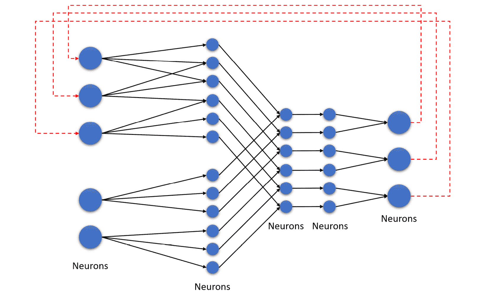

图 5.35–RNN

如您所见，神经网络中最后一个节点的值作为输入被提供给网络的起始节点。

*   **前馈 NN** :前馈神经网络类似于 RNN，唯一的区别是节点网络不形成循环。下图显示了前馈神经网络的一个示例:

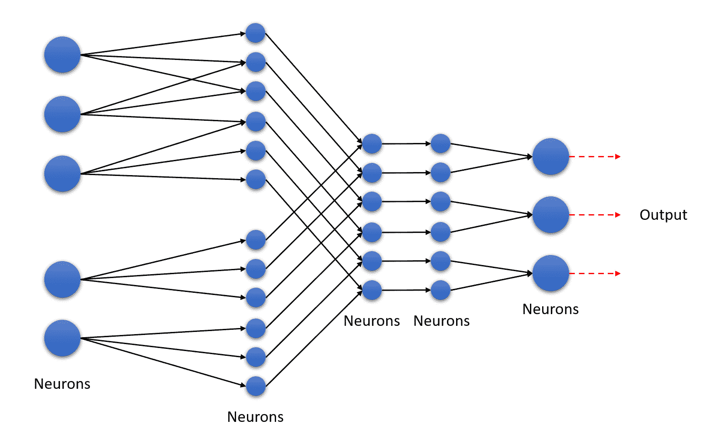

图 5.36-前馈神经网络

如你所见，这种 NN 是单向的。这是最简单的人工神经网络。一个前馈神经网络也叫**深度神经网络** ( **DNN** )。

H2O 的 DL 是基于一个多层的自由前锋安。使用**反向传播**对其进行**随机梯度下降**训练。H2O 可以训练许多不同类型的 dnn。它们如下:

*   **多层感知器** ( **MLP** ):这些类型的 DNNs 最适合表格数据。
*   **卷积神经网络**(**CNN**):这些类型的 dnn最适合图像数据。
*   **循环神经网络** ( **RNNs** ):这些类型的 DNNs 最适合语音数据或时间序列数据等顺序数据。

建议使用 H2O 提供的默认 DNNs，因为配置 DNN 对于非专业人士来说非常困难。H2O 已经预先配置了 DL 的实现，以便在给定的情况下使用最佳类型的 dnn。

记住这些基础知识，让我们更深入地理解 DL 是如何工作的。

## 了解神经网络

**NNs** 形成 DL 的基础。神经网络的工作原理很容易理解:

1.  你把数据输入神经网络的输入层。
2.  神经网络中的节点训练自己从输入数据中识别模式和行为。
3.  然后，神经网络根据它在训练中学习到的模式和行为进行预测。

神经网络的结构如下所示:

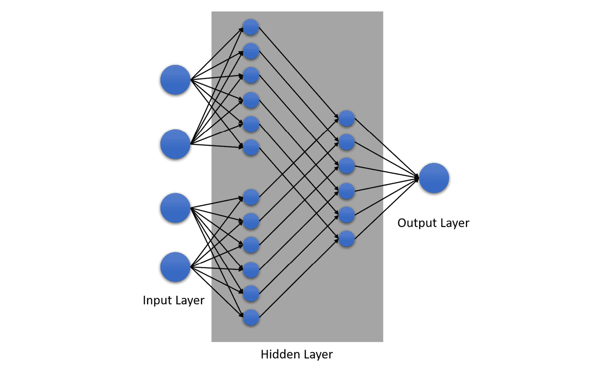

图 5.37-神经网络的结构

NN 有三个基本组成部分:

*   **输入层**:输入层由多组神经元组成。这些神经元连接到位于隐藏层的下一层神经元。
*   **隐藏层**:在隐藏层内部，可以有多层神经元，它们之间都是逐层互连的。
*   **输出层**:输出层是神经网络的最后一层，它进行最后的计算，根据概率计算出最终的预测值。

神经网络的学习过程可以分为两个部分:

*   **前向传播**:顾名思义，前向传播就是信息通过中间层从输入层流向输出层的地方。下图显示了正向传播的作用:

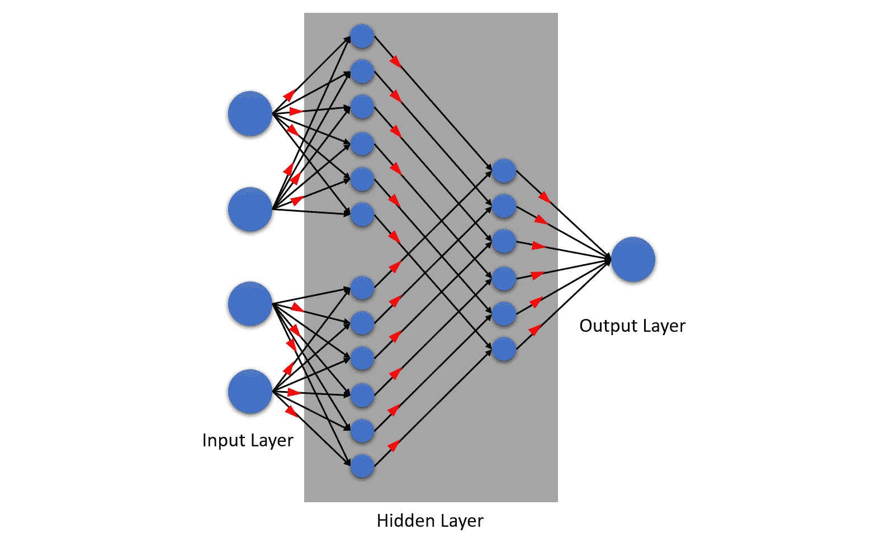

图 5.38-神经网络中的正向传播

中间层的神经元通过**通道**连接。这些通道被赋予称为**权重**的数值。权重决定了就其对整体预测的贡献值而言，神经元的重要性。权重值越高，该节点在进行预测时就越重要。

来自输入层的输入值在通过通道时乘以这些权重，它们的和作为输入发送到隐藏层中的神经元。隐藏层中的每个神经元都与一个称为**偏差**的数值相关联，该数值被添加到输入和的中。

这个加权值然后被传递给一个被称为激活函数的非线性函数。激活函数是根据非线性函数的方程来决定特定神经元是否可以将其计算的权重值传递到该神经元的下一层的函数。偏差是一个标量值，它将激活函数移至图表的左侧或右侧进行校正。

这种信息流继续到隐藏层中的下一层神经元，遵循将通道的权重相乘并将输入传递到节点的下一个激活函数的相同过程。

最后，在输出层，值最高的神经元决定预测值是什么，这是概率的一种形式。

*   **反向传播**:反向传播的工作方式与正向传播相同，除了反向传播。信息以相反的方式通过隐藏层从输出层传递到输入层。下图将让您对此有更好的理解:

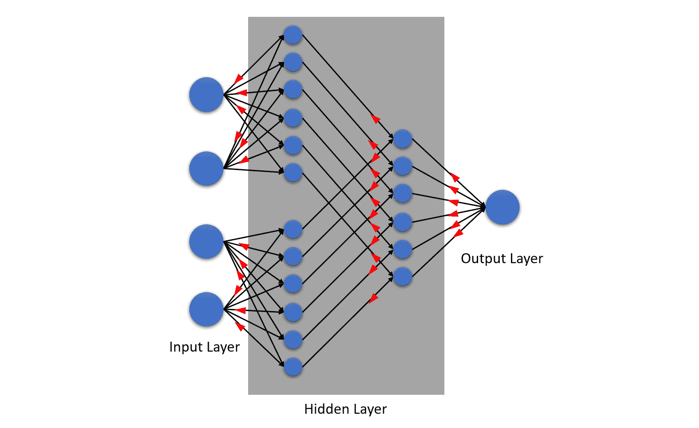

图 5.39–神经网络中的反向传播

理解反向传播如何工作可能是违反直觉的，因为它从输出到输入以相反的方式工作，但这是一个使 DL 对 ML 如此强大的概念。通过反向传播，神经网络可以自我学习。

它的工作方式非常简单。在反向传播学习中，神经网络将计算期望值和预测值之间的误差大小，并通过将其映射到**损失函数**来评估其性能。损失函数是计算预测值和期望值之间偏差的函数。该偏差值是帮助神经网络调整其在隐藏层中的偏差和权重的信息，以提高其性能并做出更好的预测。

祝贺你——我们刚刚对 DL 如何训练 ML 模型有了一个基本的了解！

小费

DL 是 ML 中最复杂的字段之一，AI 整体也是如此。这是 ML 专业化的一个广阔领域，数据科学家花大量时间研究和理解问题陈述和他们正在处理的数据，以便他们可以正确地调整他们的 DL NN。它背后的数学也非常复杂，因此值得专门写一本书。因此，如果你对数学感兴趣，并想在数字逻辑艺术中出类拔萃，请随意深入探索 ML 算法，因为理解它的每一步都会让你成为一名更专业的 ML 工程师。你可以在[https://docs . H2O . ai/H2O/latest-stable/H2O-docs/data-science/deep-learning . XHTML](https://docs.h2o.ai/h2o/latest-stable/h2o-docs/data-science/deep-learning.xhtml)找到更多关于 H2O 如何进行 DL 训练的信息。

# 总结

在本章中，我们了解了不同类型的预测问题以及各种算法如何解决这些问题。然后，我们理解了不同的最大似然算法是如何根据它们从数据中学习的方法被分类为监督的、非监督的、半监督的和强化的。一旦我们对最大似然法的整个问题领域有了了解，我们就知道 H2O 自动最大似然法只训练监督学习的最大似然算法，并且可以专门解决这个领域的预测问题。

然后，我们了解了 H2O 自动化从 GLM 开始训练哪些算法。为了理解 GLM，我们了解了什么是线性回归，它是如何工作的，以及它必须对数据的正态分布做出什么样的假设才是有效的。有了这些基础知识，我们理解了 GLM 是如何被推广为有效的，即使这些线性回归的假设得到满足，这在现实生活中是一个常见的情况。

然后，我们了解了 DRF。为了理解 DRF，我们理解了什么是决策树——也就是 DRF 的基本构件。然后，我们了解到多决策树及其集成学习是比普通决策树更好的 ML 模型——这就是随机森林的工作方式。在此基础上，我们了解了 DRF 如何以 XRT 的形式添加更多的随机化，以使算法在低方差和低偏差的情况下更加有效。

之后，我们了解了 GBM。我们了解了 GBM 与 DRFs 的相似之处，但它的学习方式略有不同。我们了解了 GBM 如何通过学习以前决策树预测集合的残差来顺序构建决策树并缓慢地最小化错误。

最后，我们了解了什么是 DL。我们了解了 nn 是如何构建 DL 的，以及它们的不同类型。我们还了解了神经网络如何从其结果中执行反向传播学习，并通过调整中间层神经元的权重和偏差来自我学习和改进模型。

这一章给了你一个简单的概念性的理解，让你了解 H2O 自动化是如何训练各种各样的最大似然算法的，而不用太深入数学。然而，强烈鼓励想要成为 ML 领域专家并希望解决复杂 ML 问题的 ML 爱好者理解 ML 算法奇妙世界背后的数学。这是像你们这样的科学家和爱好者多年研究和努力的结果，我们今天有能力在机器的帮助下预测未来。

在下一章中，我们将深入理解如何使用不同的统计测量和解释更多关于 ML 模型性能的其他度量来理解 ML 模型是否表现最佳。