<title>Chapter 6: Understanding H2O AutoML Leaderboard and Other Performance Metrics</title>

# 6

# 了解 H2O 汽车排行榜和其他绩效指标

当我们训练 ML 模型时，不同算法的统计细微差别通常使得很难将一个模型与使用不同算法训练的另一个模型进行比较。从专业的角度来看，你最终需要选择正确的模型来解决你的 ML 问题。因此，问题出现了:你如何比较解决同一个 ML 问题的两个不同的模型，并决定哪一个更好？

这就是模型性能度量的用武之地。模型性能度量是某些数字度量，它们给出了模型性能的精确度量。一个模型的性能可以有多种含义，也可以用多种方法来衡量。我们评估一个模型的方式，不管它是分类模型还是回归模型，唯一不同的是我们用于评估的度量标准。通过测量正确和错误预测的数量，可以测量模型对对象分类的准确程度。您可以测量模型预测股票价格的准确程度，并记录预测值和实际值之间的误差大小。您还可以比较模型如何处理数据中的异常值。

H2O 提供了大量的模型性能测量技术。每当模型被训练时，它们中的大多数都被自动计算并存储为模型元数据。H2O 汽车公司还进一步自动化了车型的选择。它会向您展示一个排行榜，比较经过训练的模型的不同性能指标。在本章中，我们将探讨 AutoML 排行榜中使用的不同性能指标，以及一些对用户来说很重要的额外指标。

我们将根据以下部分来探讨这些性能指标:

*   探索 H2O 汽车排行榜绩效指标
*   探索其他重要的性能指标

在本章结束时，你应该了解如何测量一个模型的性能，以及我们如何使用这些指标来了解它的预测行为。

因此，让我们从探索和理解 H2O 汽车排行榜绩效指标开始。

# 探索 H2O 汽车排行榜绩效指标

在 [*第二章*](B17298_02.xhtml#_idTextAnchor038) ，*使用 H2O 流(H2O 的 Web UI)* 工作，一旦我们使用 H2O AutoML 在数据集上训练模型，模型的结果就存储在排行榜中。排行榜是一个表格，包含各型号的型号 id 和某些指标值(*见图 2.33* )。

排行榜根据默认指标对模特进行排名，默认指标最好是表格中的第二列。排名标准取决于模型被训练的预测问题的类型。下表列出了用于各种 ML 问题的排名标准:

*   对于二元分类问题，排名度量是 **AUC** 。
*   对于多分类问题，排名度量是**平均每类误差**。
*   对于回归问题，排名标准是**偏差**。

除了排名指标，排行榜还提供了一些额外的性能指标，以便更好地了解模型质量。

让我们试着理解这些性能指标，从均方误差开始。

## 理解均方误差和均方根误差

**均方误差** ( **MSE** )，也叫**均方差** ( **MSD** )，顾名思义，是衡量预测值相对于实际值的误差平方的平均值的度量。

考虑以下回归场景:

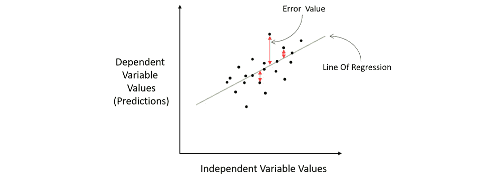

图 6.1-回归场景中的 MSE

这是一个普通的回归场景，其中回归线穿过图表上绘制的数据点。训练好的模型根据这条回归直线进行预测。误差值显示实际值和预测值之间的差异，位于回归线上，如红线所示。这些误差也被称为残差。计算 MSE 时，我们对这些误差求平方，以消除任何负号，因为我们只关心误差的大小，而不是其方向。平方也给予较大误差值更大的权重。一旦计算了所有数据点的所有平方误差，我们就计算平均值，这给出了最终的 MSE 值。

MSE 是一个指标，它告诉你回归线离数据点有多近。因此，回归线相对于数据点的误差值越小，MSE 值就越低。因此，当比较不同模型的均方误差时，具有较低均方误差的模型理想上是更精确的模型。

MSE 的数学公式如下:

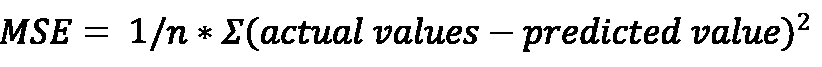

这里， *n* 是数据集中数据点的数量。

**均方根误差** ( **RMSE** )，顾名思义就是 MSE 的根值。因此相应地，其数学公式如下:

MSE 和 RMSE 之间的区别很明显。MSE 是以响应列的平方单位来度量的，而 RMSE 是以与响应列相同的单位来度量的。

例如，如果你有一个用美元预测股票价格的线性回归问题，MSE 用美元的平方来衡量误差，而 RMSE 只用美元来衡量误差值。因此，RMSE 通常用于 MSE 之上，因为从 RMSE 解释模型质量比 MSE 稍微容易一些。

恭喜你——你现在知道了什么是 MSE 和 RMSE 指标，以及如何用它们来衡量回归模型的性能。

让我们转到下一个重要的性能指标，即混淆矩阵。

## 使用混淆矩阵

分类问题是 ML 问题，其中 ML 模型试图将数据输入分类到预先指定的类别中。使分类模型的性能度量不同于回归模型的是，在分类问题中，预测值和实际值之间没有数值大小的误差。预测值要么被正确分类到正确的类别，要么被错误分类。为了衡量分类问题的模型性能，数据科学家依赖于某些性能指标，这些指标来自一种特殊类型的矩阵，称为**混淆矩阵**。

混淆矩阵是总结分类问题预测结果正确性的表格矩阵。该矩阵显示了正确预测值和错误预测值的数量，并按类别对它们进行了细分。这个矩阵称为混淆矩阵，因为它显示了在对值进行分类时模型有多混乱。

考虑我们使用的心脏病预测数据集的例子。这是一个二元分类问题，我们希望预测一个具有特定健康状况的人是否可能患有心脏病。在这种情况下，预测要么是**是**，也称为**阳性分类**，意味着此人很可能患有心脏病，要么是**否**，也称为**阴性分类**，意味着此人不太可能患有心脏病。

这个场景的混淆矩阵如下:

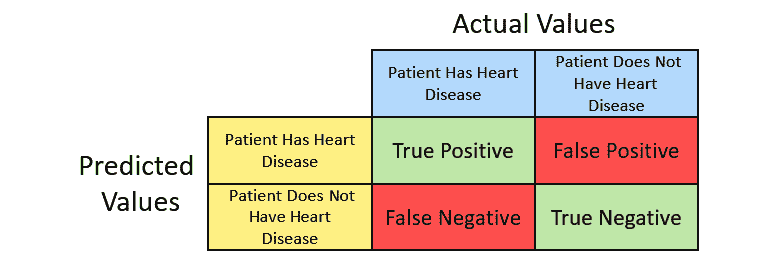

图 6.2–二项式混淆矩阵

混淆矩阵的行对应于模型预测的分类。混淆矩阵的列对应于模型的实际类值。

在矩阵的左上角，我们有**真阳性**——这些是被正确预测为是的**是**实际的数量。在右上角，我们有**误报**——这些是被错误预测为**否**的“是”的实际数量。在左下角，我们有**假阴性**——这些是被错误地预测为 Yes 值的 No 实际值的数量。最后，我们有**真负值**——这些是被正确预测为 No 的 No 实际值的数量。

具有六个可能类别的多项式分类的混淆矩阵如下所示:

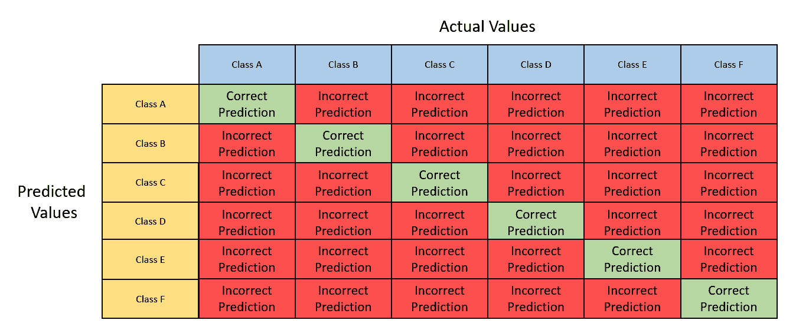

图 6.3-多项式混淆矩阵

使用两个分类模型的混淆矩阵，您可以比较各个算法预测的真阳性和真阴性的数量，并选择正确预测数量较多的一个作为更好的模型。

尽管使用混淆矩阵来解释模型的预测质量非常容易，但是仅仅基于真阳性和真阴性的数量来比较两个或多个模型仍然是困难的。

考虑这样一个场景，您希望对一些医疗记录进行分类，以确定患者是否患有脑瘤。让我们假设一个特定模型的混淆矩阵与其他模型相比有大量的真阳性和真阴性，并且也有大量的假阳性。在这种情况下，模型会错误地将许多正常的医疗记录标记为潜在脑瘤的指示。这可能会导致医院做出不正确的决定，进行根本不需要的高风险手术。在这种情况下，精确度较低但假阳性数量最少的模型是优选的。

因此，在混淆矩阵之上开发了更复杂的度量标准。它们如下:

*   **准确性**:准确性是一个度量标准，用来衡量正确预测的正面和负面预测的数量与做出的预测的总数之比。计算方法如下:

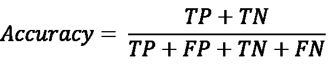

这里，缩写代表以下内容:

*   **TP** 代表真阳性。
*   TN 代表真阴性。
*   **FP** 代表假阳性。
*   **FN** 代表假阴性。

当您想要比较分类模型正确预测的程度时，不管预测值是正还是负，此度量都很有用。

*   **Precision** : Precision 是一个度量标准，用于测量做出的正确肯定预测的数量与做出的肯定预测的总数之比。计算方法如下:

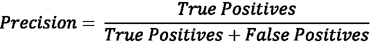

当测量分类模型的性能时，此度量特别有用，该分类模型是根据具有大量负面结果而仅有少量正面结果的数据来训练的。精度不受正负分类值不平衡的影响，因为它只考虑正值。

*   **敏感度或召回率**:敏感度，也称为召回率，是一种概率度量，用于衡量一个模型能够多好地预测真阳性。通过识别在二项式分类中被正确识别为阳性的预测的百分比来测量灵敏度。计算方法如下:

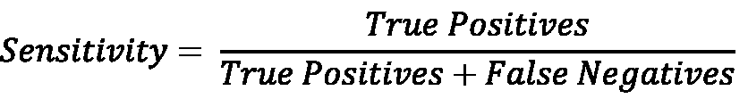

如果你的分类 ML 问题旨在准确识别所有的正面预测，那么模型的灵敏度应该很高。

*   **特异性**:敏感性是模型预测真阳性的概率度量，特异性是通过识别在二项式分类中被正确识别为阴性的预测百分比来度量的。计算方法如下:

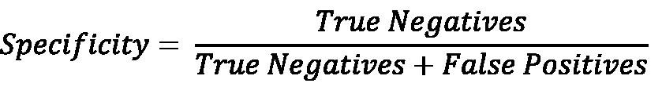

如果你的分类 ML 问题的目的是准确识别所有的负面预测，那么模型的特异性应该很高。

在敏感性和特异性之间总是有一个权衡。具有高灵敏度的模型通常具有非常低的特异性，反之亦然。因此，最大似然问题的背景在决定你是否想要一个高灵敏度或高特异性的模型来解决问题时起着非常重要的作用。

对于多项式分类，需要计算每个类类型的敏感度和特异性。对于敏感度，您的真阳性将保持不变，但假阴性将根据对该类做出的错误预测的数量而变化。同样，就特异性而言，真阴性将保持不变——然而，假阳性将根据对该类别做出的错误预测的数量而变化。

既然您已经了解了如何使用混淆矩阵来测量分类模型，以及如何在此基础上构建灵敏度和特异性，现在让我们继续下一个指标，即接收器工作特性曲线及其曲线下的面积。

## 计算受试者工作特征及其曲线下面积(ROC-AUC)

比较分类模型的另一个好方法是通过它们性能的可视化表示。最广泛使用的视觉评估指标之一是**接收器工作特性**及其曲线 ( **ROC-AUC** )下的**面积。**

ROC-AUC 指标分为两个概念:

*   **ROC 曲线**:这是绘制在图表上的图形曲线，总结了模型在不同阈值下的分类能力。阈值是将数据点分成不同类别的分类值。
*   **AUC** :这是 ROC 曲线下的面积，帮助我们根据谁的 ROC 曲线覆盖面积最大来比较哪种分类算法表现更好。

让我们考虑一个例子来更好地理解 ROC-AUC 如何帮助我们比较分类模型。请参考以下样本数据集:

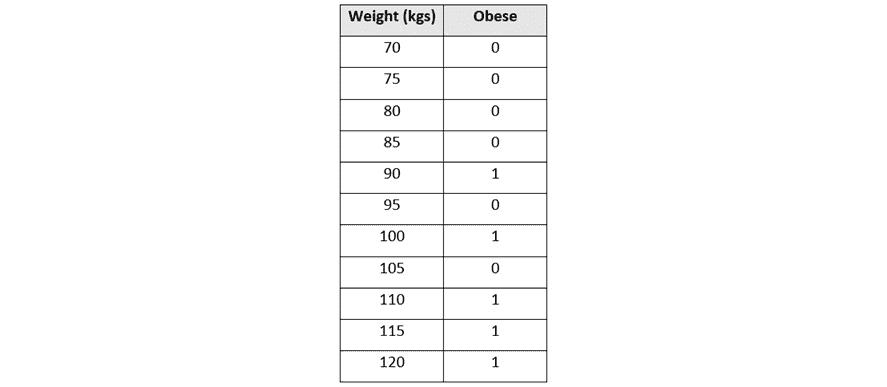

图 6.4–肥胖数据集

该数据集有两列:

*   **体重(千克)**:这是一个数字列，包含一个人的体重，以千克为单位
*   **肥胖**:这是一个分类列，包含 **1** 或 **0** ，其中 **1** 表示此人肥胖， **0** 表示此人不肥胖

让我们将这个数据集绘制到一个图表上，其中作为独立变量的**体重**在 *x* 轴上，作为因变量的**肥胖**在 *y* 轴上。图表上的这个简单数据集如下所示:

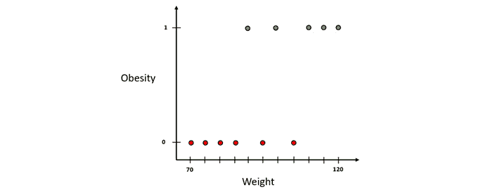

图 6.5–绘制的肥胖数据集

让我们使用一种叫做**逻辑回归**的最简单的分类算法通过该数据拟合一条分类线。逻辑回归是一种算法，它预测给定数据样本属于某个类别的概率。在我们的例子中，该算法将根据体重预测该人是否肥胖的概率。

逻辑回归线将如下所示:

图 6.6–带有分类线的肥胖数据集

请注意，由于逻辑回归预测数据可能属于某个类别的概率，我们已经将 *y* 轴转换为该人肥胖的概率。

在预测过程中，我们将首先在 *x* 轴上绘制该人的样本体重数据。然后，我们将在分类行上找到其各自的 *y* 值。该值是相应人肥胖的概率。

现在，为了对人是否肥胖进行分类，我们将需要来决定区分肥胖和非肥胖的概率**截止线**是多少。这条截止线被称为**阈值**。任何高于阈值的概率值都可以归类为肥胖，任何低于阈值的概率值都可以归类为不肥胖。阈值可以是 0 到 1 之间的任何值:

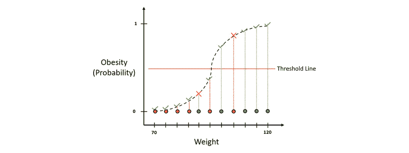

图 6.7–带有阈值线的肥胖数据集分类

如图所示，多个值被错误分类。任何分类问题都必然会出现这种情况。因此，为了跟踪正确和不正确的分类，我们将创建一个混淆矩阵，并计算灵敏度和特异性，以评估模型对于所选阈值的表现。

但是如前所述，可以有许多分类阈值。具有高值的阈值将最大限度地减少假阳性的数量，但是代价是该类的分类将变得更严格，导致更多的假阴性。同样，如果阈值太低，那么我们最终会有更多的误报。

哪个阈值表现最好取决于你的 ML 问题。但是，需要对不同的阈值进行比较研究，以找到合适的值。因为您可以创建任意数量的阈值，所以最终会创建大量的混淆矩阵。这就是 ROC-AUC 指标的用武之地。

ROC-AUC 指标总结了不同阈值下模型的性能，并将其绘制在图表上。在这个图中，*x*-轴是假阳性率，也就是 **1 -特异性**，而*y*-轴是真阳性率，也就是**灵敏度**。

让我们为样本数据集绘制 ROC 图。我们将从使用将所有样本分类为肥胖的阈值开始。图表上的阈值将如下所示:

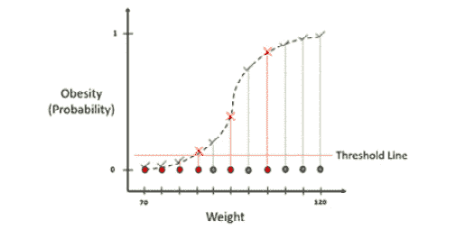

图 6.8–一个非常低阈值的肥胖分类图

我们现在需要计算绘制 ROC 曲线所需的灵敏度(和 1 -特异性)值，因此，我们需要首先创建一个混淆矩阵。该阈值的混淆矩阵如下所示:

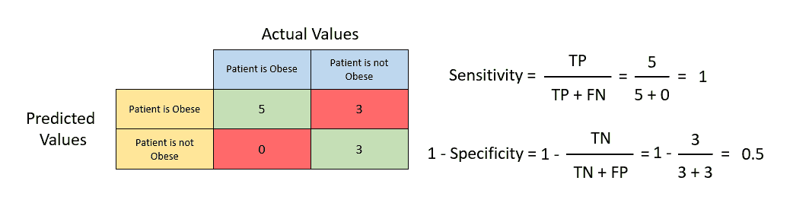

图 6.9-具有敏感性和 1 特异性的混淆矩阵

使用前面提到的公式计算灵敏度和 1 -特异性值，我们得到灵敏度等于 **1** 和 1 -特异性等于 **0.5** 。让我们在 ROC 图中绘制这个值。ROC 图将如下所示:

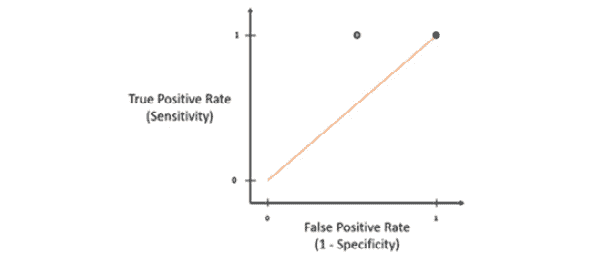

图 6.10–ROC 图

图中的蓝线表示灵敏度等于 1 -特异性，换句话说，真阳性率等于假阳性率。这条线上的任何 ROC 点表明，使用该阈值训练的模型预测正确阳性的可能性与预测不正确阳性的可能性相等。因此，为了找到最佳阈值，我们的目标是找到一个具有尽可能高的灵敏度和尽可能低的 a 1 特异性的 ROC 点。这将表明该模型预测正确的肯定预测的可能性很高，而预测不正确的肯定预测的可能性小得多。

现在让我们提高阈值并重复相同的过程来计算这个新阈值的 ROC 值。让我们假设这个新阈值的灵敏度为 1，1 特异性为 0.25。在 ROC 图中绘制该值，我们得到以下结果:

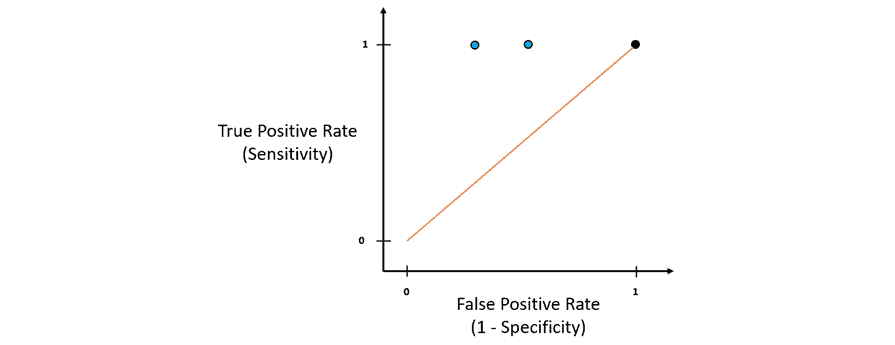

图 6.11–具有新阈值的 ROC 图

新阈值的新 ROC 值位于蓝线的左侧，也是先前 ROC 点的左侧。这表明与之前的阈值相比，它具有更低的假阳性率。因此，新的阈值优于以前的阈值。

将阈值提高得太高会使模型预测所有值都不肥胖。基本上，它会错误地将所有值预测为假，从而增加假阴性的数量。根据灵敏度方程，假阴性的数量越高，灵敏度越低。所以，这最终会降低你的敏感度，降低模型预测真阳性的能力。

我们对不同的阈值重复相同的过程，并将它们的 ROC 值绘制在 ROC 图上。如果我们把所有这些点连接起来，我们就得到 ROC 曲线:

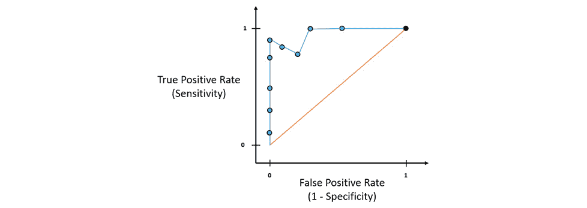

图 6.12–带有 ROC 曲线的 ROC 图

只需查看 ROC 图，您就可以确定哪些阈值优于其他阈值，并且根据您的 ML 问题可以容忍多少假阳性预测，您可以选择具有正确假阳性率的 ROC 点作为您的最终阈值参考。这解释了 ROC 曲线的作用。

现在，假设你有另一个用不同阈值训练的算法，你在这个图上画出它的 ROC 点。假设这些图如下所示:

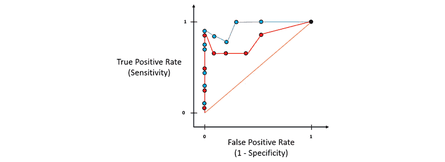

图 6.13–包含多条 ROC 曲线的 ROC 图

你会如何比较哪种算法表现更好？哪个阈值是该算法模型的最佳阈值？

这就是 AUC 帮助我们的地方。AUC 不过是 ROC 曲线下的面积。整个 ROC 图的总面积将为 *1* 。红线将该区域一分为二，因此理想情况下，所有潜在的好算法的 AUC 都应该大于 0.5。AUC 越大，算法越好:

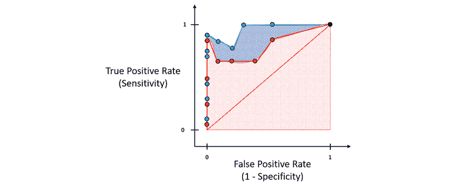

图 6.14-ROC 曲线的 AUC

只要把这个形象化，就能从它的 AUC 看出哪个算法更好。类似地，AUC 值有助于工程师和科学家确定选择哪种算法以及使用哪种阈值作为分类的最佳 ML 模型。

恭喜你，你刚刚理解了 ROC-AUC 指标是如何工作的，以及它如何帮助你比较模型性能。现在让我们转到另一个类似的性能指标，叫做**精确召回曲线** ( **PR 曲线**)。

## 计算精确召回曲线及其曲线下面积(AUC-PR)

对于 ROC-AUC，尽管是比较模型的一个非常好的指标，但是是完全依赖它的一个小缺点。在非常不平衡的数据集中，存在大量真负值，ROC 图的*x*-轴将非常小，因为特异性以真负值作为分母。这迫使 ROC 曲线向图的左侧移动，ROC-AUC 值向 1 上升，这在技术上是不正确的。

这就是 **PR 曲线**证明有益的地方。PR 曲线类似于 ROC 曲线，唯一的区别在于 PR 曲线是一个在 *y* 轴上使用精度并在 *x* 轴上调用的函数。精确度和召回率都没有在计算中使用真正的负数。因此，当在预测期间数据集的类别中存在影响真阴性的不平衡时，或者当您的 ML 问题根本不涉及真阴性时，PR 曲线及其 AUC 度量是合适的。

让我们用一个例子来进一步理解 PR 曲线。我们将使用用于理解 ROC-AUC 曲线的同一肥胖样本数据集。在图上绘制数据集记录和创建混淆矩阵的过程与 ROC-AUC 曲线相同。

现在，我们将计算精确度和召回值，而不是从混淆矩阵中计算敏感度和特异性:

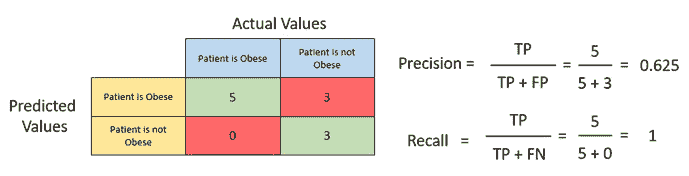

图 6.15–计算精度和召回值

从上图可以看出，我们得到了精度值 **0.625** 和召回值 **1** 。让我们将这些值绘制到 PR 图上，如下图所示:

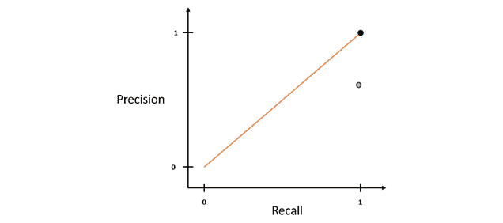

图 6.16–公关图表

类似地，通过移动阈值线并创建新的混淆矩阵，精确度和召回值将基于混淆矩阵中预测的分布而改变。我们对不同的阈值重复相同的过程，计算精度和召回值，然后将它们绘制到 PR 图上:

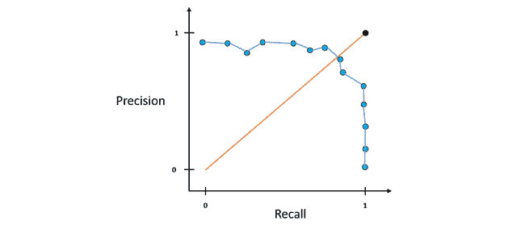

图 6.17-PR 图及其 PR 曲线

连接所有点的蓝线是 PR 曲线。代表最接近黑点的阈值的点是理想的分类器，最接近具有 1 的精度值和 1 的召回值。

比较不同的算法模型时，PR 图中会有多条 PR 曲线:

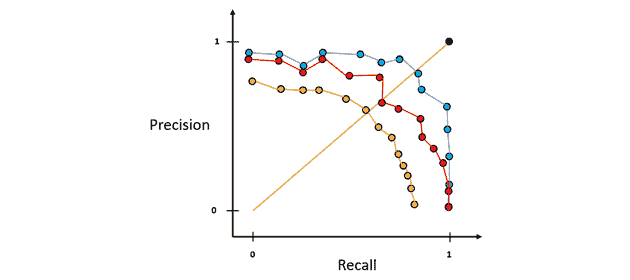

图 6.18–具有多条 PR 曲线的 PR 图

上图显示了可以绘制在同一图表上的多条 PR 曲线，以便更好地比较不同算法的性能。一眼就可以看出，蓝线代表的算法有一个最接近黑点的阈值，理想情况下应该是性能最好的模型。

正如 ROC-AUC 一样，您也可以使用 AUC-PR 来计算 PR 曲线下的面积，以便更好地了解不同算法的性能。基于此，您知道红色 PR 曲线代表的算法优于黄色曲线代表的算法，蓝色 PR 曲线代表的算法优于红色和黄色曲线。

恭喜你！现在，您已经了解了H2O 汽车排行榜中的 AUC-PR 指标，以及它如何成为另一个良好的模型性能指标，可供您在比较 H2O 汽车培训的模型时参考。

现在让我们来看下一个性能指标，它叫做日志丢失。

## 处理原木损耗

**测井损失**是分类模型的另一个重要的模型性能指标。它主要用于衡量二元分类模型的性能。

对数损失是一种测量分类模型性能的方法，该模型以概率值的形式输出分类结果。概率值的范围从 *0* 到 *1* 不等，前者表示数据属于某个正类的概率为零，后者表示数据属于某个正类的概率为 100%。对数损失值的范围可以从 0 到无穷大，所有 ML 模型的目标都是尽可能地最小化对数损失。任何具有尽可能接近 0 的对数损失值的模型都被认为是性能更好的模型。

测井损失计算完全是统计的。然而，重要的是理解数学背后的直觉，以便在比较模型性能时更好地理解其应用。

对数损失是一种度量标准，用于测量预测概率与实际值的偏差。因此，如果预测的概率与实际值相差很小，那么你的对数损失值将是宽容的——但是，如果差异更大，对数损失值将是更加惩罚性的。

我们先来了解一下什么是预测概率。我们将使用与 ROC-AUC 曲线相同的肥胖数据集。假设我们运行了一个分类算法来计算此人肥胖的预测概率，让我们将这些值添加到数据集中的一列，如下面的屏幕截图所示:

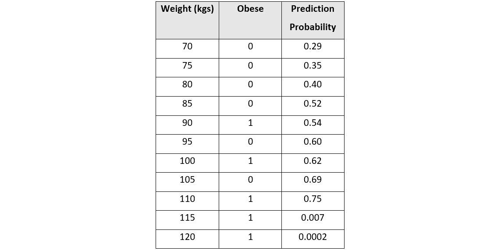

图 6.19–添加了预测概率的肥胖数据集

我们将有一个特定的阈值值，该值决定我们将数据分类为肥胖或非肥胖的预测概率值。让我们假设阈值是 0.5——在这种情况下，预测概率值高于 0.5 被分类为肥胖，低于 0.5 的被分类为不肥胖。

我们现在计算每个数据点的对数损失值。计算每条记录的测井曲线损失的公式如下:

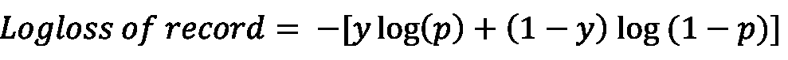

这里，等式可以分解如下:

*   **y** 为实际分类值，即 *0* 或 *1* 。
*   **p** 是预测概率。
*   **log** 是数字的自然对数。

在我们的例子中，由于我们使用肥胖类作为参考，我们将设置 *y* 到 *1* 。使用该等式，我们计算单个数据值的对数损失值，如下所示:

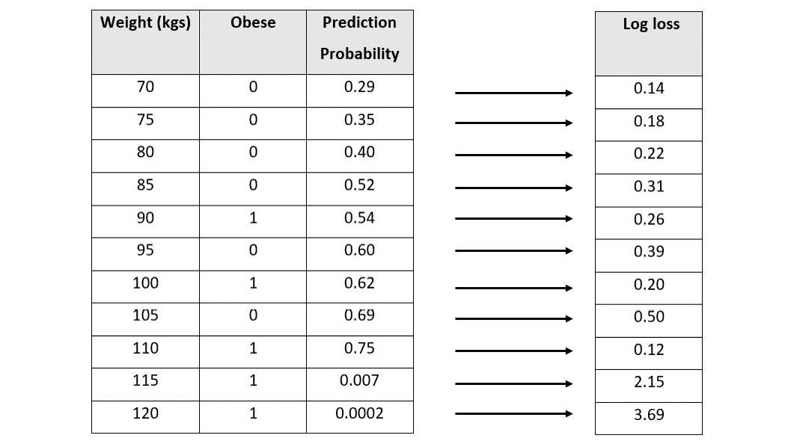

图 6.20–每条记录的对数损失值的肥胖数据集

现在，让我们将这些值绘制成对数损失图，其中我们在 *y* 轴上设置对数损失值，在 *x* 轴上设置预测概率:

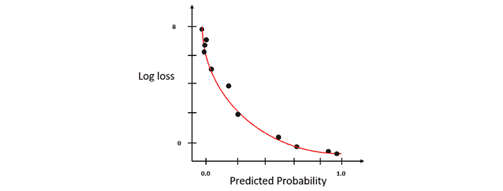

图 6.21-y = 1 时的测井曲线损失图

您会注意到，随着预测概率偏离实际值，对数损失值呈指数上升。偏差越小，对数损失的增加就越少。这使得日志损失成为一个很好的比较指标，因为它不仅比较了哪个模型是好是坏，还比较了它有多好或多坏。

类似地，如果您希望使用非肥胖类作为对数损失的参考，那么您将反转预测概率，计算对数损失值，并绘制图表，或者您可以通过将 *y* 设置为 0 来计算对数损失值，并使用计算的对数损失值绘制对数损失图表。该图将是前一图的镜像(*见图 6.21* ):

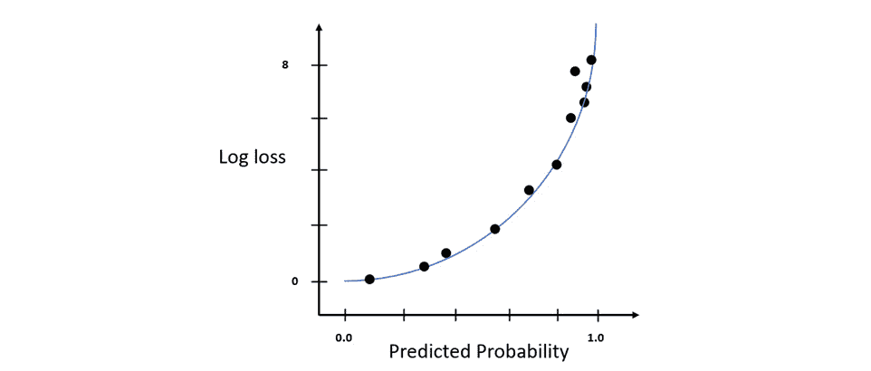

图 6.22-y = 0 时的测井曲线损失图

模型的日志损失值，也称为模型的**技能**，是数据集中所有记录的日志损失值的平均值。因此，模型的对数损失方程如下:

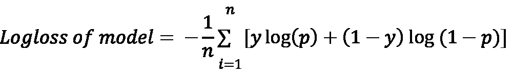

这里，等式可以分解如下:

*   **n** 是数据集中的记录总数。
*   **y** 为实际分类值，即 *0* 或 *1* 。
*   **p** 是预测概率。
*   **log** 是数字的自然对数。

在理想世界中，一个拥有完美评分能力和技巧的模型据说有一个 log loss 等于 *0* 。为了正确地应用对数损失来比较模型，必须使用相同的数据集来训练两个模型。

恭喜你！我们刚刚介绍了如何统计测井曲线损失。在下一节中，我们将探讨一些其他重要指标，这些指标不属于 H2O 汽车排行榜，但对于理解车型性能却很重要。

# 探索其他模型性能指标

H2O 汽车排行榜根据某些常用的重要指标总结了车型表现。然而，在 ML 领域仍然有大量的性能度量来描述 ML 模型的不同技能。这些技能通常是决定什么对你给定的 ML 问题最有效的因素，因此，我们知道如何使用这些不同的度量是很重要的。H2O 还通过在训练结束后计算这些指标值并将其存储为模型的元数据来为我们提供这些指标值。您可以使用内置函数轻松访问它们。

在接下来的小节中，我们将从 F1 开始，探索其他一些重要的模型性能指标。

## 了解 F1 得分绩效指标

尽管精确度和召回率是衡量一个分类模型性能的非常好的指标，但是它们之间有一个平衡。精确度和召回率不能同时具有高值。如果您通过调整分类阈值来提高精确度，那么它会影响您的召回，因为假阴性的数量可能会增加，从而降低您的召回值，反之亦然。

精确度指标用于最小化不正确的预测，而召回指标用于找到最大数量的正确预测。因此，从技术上讲，我们需要在这两个指标之间找到正确的平衡。

这就是 **F1 分数**性能指标的由来。F1 分数是一个指标，它试图同时最大化精确度和召回率，并给出模型性能的总体分数。

F1 分数是精确度和召回值的调和平均值。**调和平均值**只是计算平均值的变量之一。利用调和平均值，我们计算所有观测值的倒数的算术平均值的倒数。我们使用调和平均值来计算 F1 分数的原因是，使用一般算术平均值会导致等式对所有程度的误差给予同等的重视。另一方面，调和平均值通过相应地降低 F1 值来惩罚高误差值。这就是使用调和平均值生成 F1 得分的原因，因为计算出的得分值更好地代表了模型的性能。

F1 值的范围从 0 到 1，其中 1 表示模型具有完美的精度和召回值，而 0 表示精度或召回值为 0。

计算 F1 分数的公式如下:

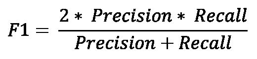

让我们以混淆矩阵为例，如下所示:

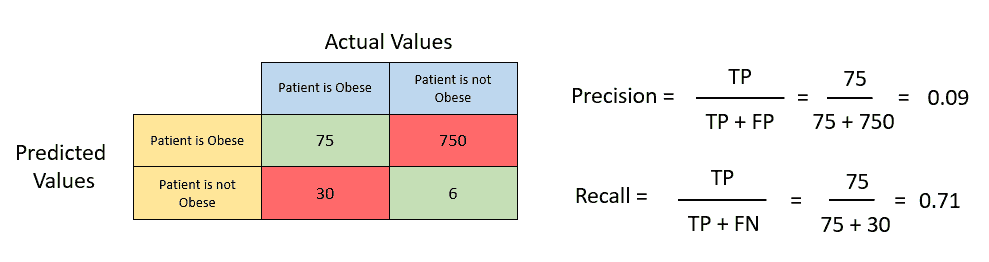

图 6.23-带有精确度和召回值的混淆矩阵示例

让我们计算矩阵的精度值:

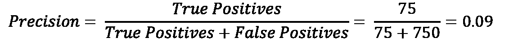

类似地，现在让我们计算矩阵的召回值:

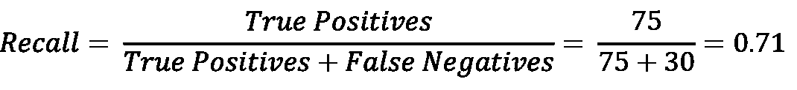

现在，将精度和召回值代入 F1 得分等式，我们得到以下结果:

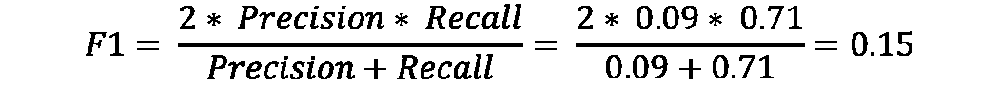

我们得到了 0.15 分的 F1 成绩。现在，您可以通过类似的方式计算 F1 分数，并将其与这个模型进行比较，来比较另一个模型的性能。如果新车型的 F1 分数大于 *0.15* ，则该车型的性能优于该车型。

F1 分数的好处是，在比较分类模型时，您不需要平衡多个模型的精确度和召回值，也不需要根据两个对比指标之间的比较来做出决定。F1 分数总结了精确度和召回率的最佳值，从而更容易识别哪个模型更好。

尽管 F1 是一个很好的指标，但它仍然有一些缺点。首先，F1 分数在计算分数时不考虑真正的负数。第二，F1 分数不能充分捕捉多类分类问题的性能。从技术上讲，您可以使用宏平均来计算多类分类问题的 F1 分数，但是，可以使用更好的指标来代替。

让我们来看一个这样的度量，它克服了 F1 分数的缺点，即绝对马修斯相关系数。

## 计算绝对马修斯相关系数

考虑一个例子，我们试图根据给定水果的大小来预测它是葡萄还是西瓜。我们有 200 个样品，其中 180 个是葡萄，20 个是西瓜。很简单，是的——尺寸越大，越有可能是西瓜，而尺寸越小，表明它是葡萄。假设我们训练了一个分类器，把葡萄作为正类。该分类器能够将水果分类如下:

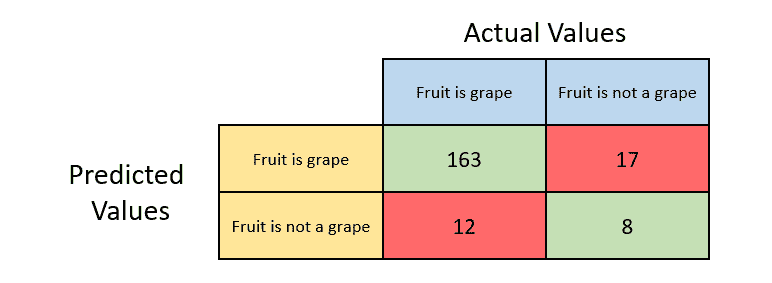

图 6.24-水果分类混淆矩阵，葡萄为阳性类别

让我们快速计算一下我们之前讨论过的标量分类指标。

分类器的精度如下:

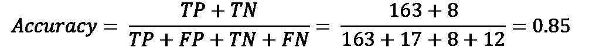

分类器的精度如下:

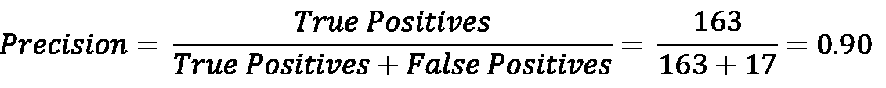

分类器的调用如下:

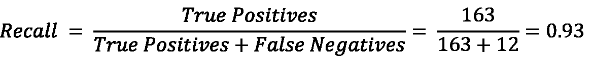

分类器的 F1 分数如下:

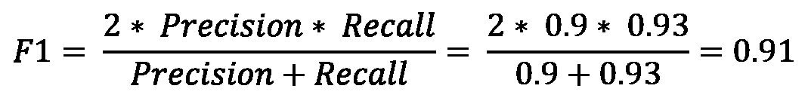

基于这些度量值，看起来我们的分类器在预测葡萄时表现非常好。那么，如果我们想预测西瓜呢？让我们把正课换成西瓜而不是葡萄。该场景的混淆矩阵如下:

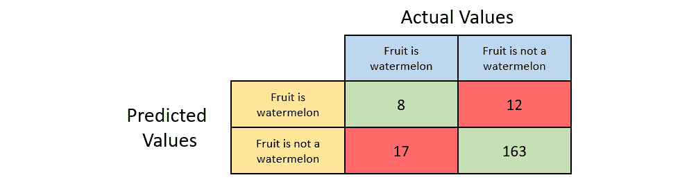

图 6.25-水果分类混淆矩阵，西瓜为阳性类别

我们将快速计算我们之前讨论过的标量分类指标。

分类器的精度如下:

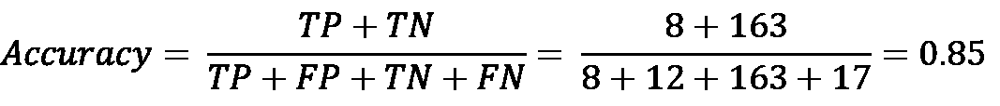

分类器的精度如下:

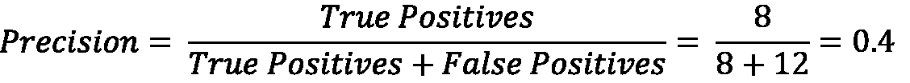

分类器的调用如下:

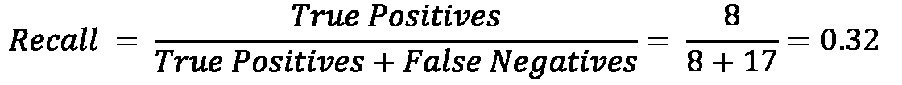

分类器的 F1 分数如下:

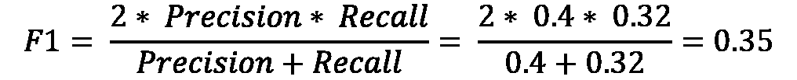

正如我们从指标值中看到的，准确性保持不变，但精确度、召回率和 F1 分数大幅下降。尽管准确度、精确度、召回率和 F1 分数是用于测量分类性能的非常好的度量，但是当数据集中存在类别不平衡时，它们具有一些缺点。在我们的葡萄和西瓜数据集中，我们只有 20 个西瓜样本，但有 180 个葡萄样本。这种数据的不平衡会导致度量计算的不对称，从而产生误导。

理想情况下，作为数据科学家和工程师，通常建议保持数据尽可能对称，以保持这些指标的测量尽可能相关。然而，在具有数百万条记录的真实世界的数据集中，很难保持这种对称性。因此，拥有某种将正面和负面类别同等对待并给出分类模型性能的总体情况的度量将是有益的。

这就是**绝对马修斯相关系数** ( **MCC** )，也称为 **phi 系数**发挥作用的地方。MCC 的方程式如下:

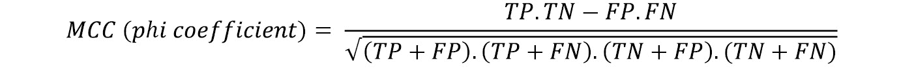

在计算过程中，它将实际类别和预测类别视为两个不同的变量，并确定它们之间的相关系数。相关系数只不过是代表变量之间某种统计关系的数值。这个相关系数值越高，你的分类模型就越好。

MCC 值的范围从-1 到 1。1 表示分类器是完美的，并且将总是正确地对记录进行分类。MCC 为 0 表示类别之间没有相关性，模型的预测完全是随机的。-1 表示分类器将总是错误地对记录进行分类。

MCC 值为-1 的分类器并不意味着该模型在任何意义上都是不好的。它仅表明预测类和实际类之间的相关系数是负的。所以，如果你只是反转分类器的预测，你总是会得到正确的分类预测。此外，MCC 是完全对称的——因此，它平等地对待所有类别，以提供考虑模型整体性能的度量。切换正负等级不会影响 MCC 值。因此，如果只取 MCC 的绝对值，它仍然不会失去值的相关性。为了更容易理解模型的性能，H2O 经常使用 MCC 的绝对值。

让我们以葡萄为阳性类别，计算水果分类混淆矩阵的 MCC 值:

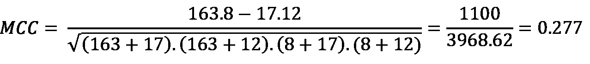

同样，让我们以西瓜为正类，计算水果分类混淆矩阵的 MCC 值:

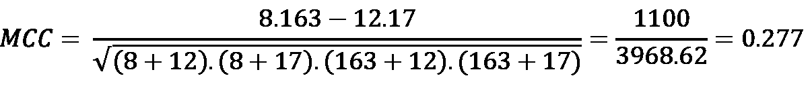

如您所见，MCC 值保持不变，为 *0.277* ，即使我们切换正负等级。此外， *0.277* 的 MCC 指示预测类别和实际类别弱相关，考虑到分类器在分类西瓜方面表现不佳，这是正确的。

恭喜，您现在了解了另一个重要的指标，称为绝对 MCC。

现在我们来看下一个性能指标，即 R2。

## 测量 R2 性能指标

**R2** ，也称为决定系数，是一个回归模型性能指标，旨在解释因变量和自变量之间的关系，即自变量的变化对因变量的影响程度。

R2 的值范围从 0 到 1，其中 0 表示回归线没有正确捕获数据中的趋势，1 表示回归线完全捕获了数据中的趋势。

让我们使用数据集的图形示例来更好地理解这一指标。参考下图的身高体重回归图:

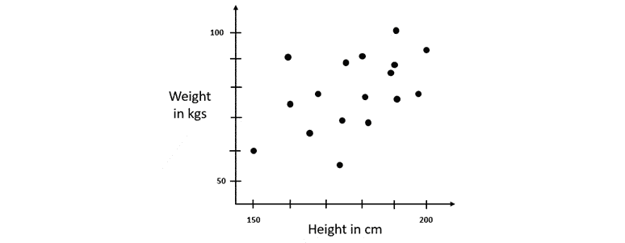

图 6.26-身高体重回归图

数据集有两列:

*   **身高**:这是一个数字列，包含人的身高，单位为厘米
*   **体重**:这是一个数字列，包含一个人的体重，单位为千克

使用这个数据集，我们试图根据一个人的身高预测他的体重。

所以首先我们用所有权重的平均值作为一般回归线来预测权重。从技术上来说，确实有意义，因为大多数人都有一个成年人的平均体重范围——尽管可能会有一些误差，但这仍然是一种预测一个人体重的合理方法。

如果我们在图表上绘制该数据集，用于预测的平均值将如下所示:

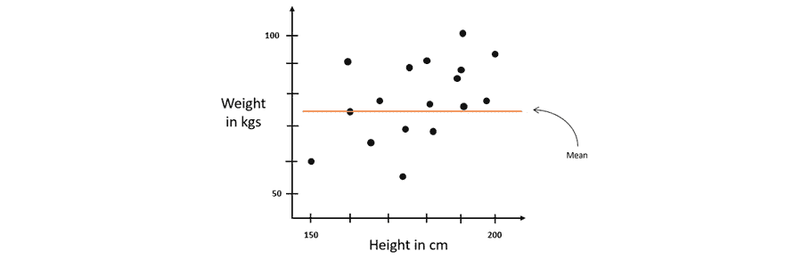

图 6.27-带中线的身高体重回归图

如您所见，重量的预测值和实际值之间肯定存在误差。如前所述，这种误差称为残差。计算残差的平方给出了误差的平方。所有记录的这些平方误差的总和给出了中线附近的变化。

现在，让我们执行线性回归，并通过数据拟合一条线，以便获得另一条回归线。这条回归线应该是比单独使用平均值更好的预测值。图表上的回归线应如下所示:

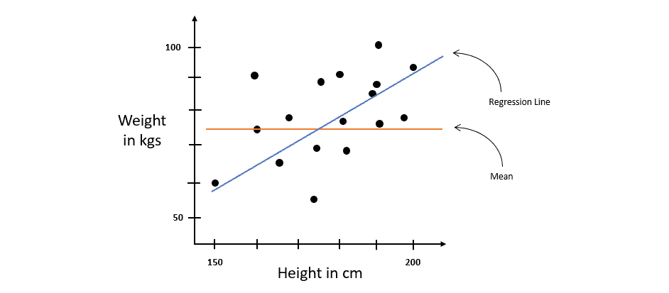

图 6.28–带有回归线的身高体重回归数据集

让我们也计算这条线的误差的残差平方——这给了我们回归线周围的变化。

现在，我们需要找出一种方法来确定哪条线更好，回归还是均值，以及好多少。这就是 R2 可以用来比较两条回归线的地方。计算 R2 的公式如下:

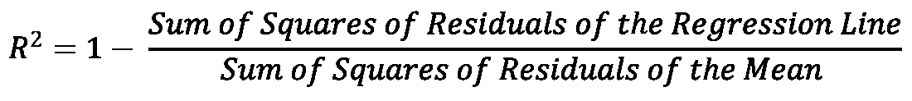

假设回归线周围的残差平方和为 *7* ，中线周围的残差平方和为 *56* 。将这些值代入 R2 方程，我们得到以下值:

值 *0.875* 是一个百分比。该值说明了 *y* 值的总变化的 87.5%由 *x* 值的变化来描述。剩下的 12.5%可能是因为数据集中的一些其他因素，如肌肉质量、脂肪含量或任何其他因素。

从最大似然角度来看，较高的 R2 值表明两个变量之间的关系解释了数据中的变化，因此，线性模型准确地捕捉了数据集的模式。较低的 R2 值表明线性模型没有完全捕获数据集的模式，并且肯定有一些其他因素影响数据集的模式。

这概括了如何使用 R2 指标来衡量线性模型在多大程度上正确捕捉了数据中的趋势。

# 总结

在这一章中，我们着重于理解如何测量 ML 模型的性能，以及如何根据哪个模型性能更好来选择一个模型。我们从探索 H2O AutoML 排行榜指标开始，因为它们是 AutoML 现成提供的最容易获得的指标。我们首先介绍了什么是 MSE 和 RMSE，它们之间的区别是什么，以及它们是如何计算的。然后，我们介绍了什么是混淆矩阵，以及我们如何从混淆矩阵中的值计算准确度、灵敏度、特异性、精确度和召回率。随着我们对灵敏度和特异性的新理解，我们理解了什么是 ROC 曲线及其 AUC，以及它们如何用于直观地测量不同算法的性能，以及在不同阈值上训练的相同算法的不同模型的性能。基于 ROC-AUC 指标，我们探索了 PR 曲线、其 AUC 以及它如何克服 ROC-AUC 指标所面临的缺点。最后，在排行榜中，我们了解了什么是对数损失，以及如何使用它来衡量二元分类模型的性能。

然后，我们探讨了排行榜之外的一些重要指标，从 F1 分数开始。我们知道 F1 分数是如何将召回率和准确率结合到一个指标中的。然后，我们了解了 MCC，以及它如何克服在不平衡数据集上测量时的精确度、召回率和 F1 分数的缺点。最后，我们探讨了 R2 度量，它根据自变量的变化对因变量的影响程度来解释因变量和自变量之间的关系。

有了这些信息，我们现在能够正确地测量和比较模型，找到解决 ML 问题的最佳模型。在下一章，我们将探索更多关于 H2O 提供的各种模型可解释特性，这些特性给出了关于模型及其特性的高级细节。