# 七、使用模型可解释性

模型选择和性能的合理性与模型训练同样重要。你可以让 *N* 个使用不同算法训练的模型，所有这些模型都能够对现实世界的问题做出足够好的预测。那么，您如何选择其中一个用于您的生产服务，以及您如何向您的利益相关者证明您选择的模型比其他模型更好，即使所有其他模型也能够在某种程度上做出准确的预测？一个答案是性能指标，但正如我们在上一章中看到的，有许多性能指标，它们都衡量不同类型的性能。选择正确的性能指标可以归结为您的 ML 问题的背景。我们还可以使用什么来帮助我们选择正确的模型，并进一步帮助我们证明这一选择的合理性？

这个问题的答案是可视化图表。人类是视觉动物，因此，一张图片胜过千言万语。一个好的图表可以比任何度量数字更好地解释一个模型。图形的多样性对于解释模型的行为以及它如何适合作为我们的 ML 问题的解决方案是非常有用的。

H2O 的可解释性界面是一个独特的功能，它涵盖了 H2O 为一个模型或模型列表自动计算的各种可解释性功能和视觉效果，包括 H2O AutoML 对象。

在这一章中，我们将探索 H2O 可解释性接口以及它如何与 H2O AutoML 对象一起工作。我们还将实现一个实际的例子来理解如何在 Python 和 r 中使用 explainability 接口。最后，我们将浏览并理解我们作为输出得到的各种 explainability 特性。

在本章中，我们将讨论以下主要话题:

*   使用模型可解释性接口
*   探索各种可解释的特性

在本章结束时，通过查看模型可解释性接口描述的各种性能指标，您应该对如何解释模型性能有了一个很好的想法。

# 技术要求

对于本章，您将需要以下内容:

*   您首选的 web 浏览器的最新版本。
*   您选择的**集成开发环境** ( **IDE** )或终端。
*   本章进行的所有实验都是在终端上进行的。您可以自由地使用相同的设置进行操作，也可以使用您选择的任何 IDE 来执行相同的实验。

本章的所有代码示例都可以在 GitHub 上的[https://GitHub . com/packt publishing/Practical-Automated-Machine-Learning-on-H2O/tree/main/Chapter % 207](https://github.com/PacktPublishing/Practical-Automated-Machine-Learning-on-H2O/tree/main/Chapter%207)找到。

因此，让我们从理解模型可解释性接口如何工作开始。

# 使用模型可解释性接口

**模型可解释性接口**是一个简单的函数，它包含了关于模型及其工作的各种图表和信息。在 H2O 中，模型可解释性有两个主要功能:

*   `h2o.explain()`函数，其用于解释模型在整个测试数据集上的行为。这也叫做**全局解释**。
*   `h2o.explain_row()`函数，用于解释模型在测试数据集中的单个行上的行为。这也是称为**的地方解释**。

这两个函数既可以作用于单个 H2O 模型对象，也可以作用于一系列 H2O 模型对象或 H2O AutoML 对象。这些函数生成由各种图形图组成的结果列表，如一个**变量重要性图**、**部分依赖图**和一个**排名**(如果用于多个模型)。

对于图形和其他可视结果，`explain`对象依赖于可视化引擎来呈现图形:

*   对于 R 接口，H2O 使用`ggplot2`包进行渲染。
*   对于 Python 接口，H2O 使用`matplotlib`包进行渲染。

考虑到这一点，我们需要确保每当我们使用 explainability 接口来获得可视化图形时，我们都在支持图形渲染的环境中运行它。这个界面在终端和其他非图形命令行界面中不会有太大用处。本章中的例子已经在 **Jupyter 笔记本**上运行过，但是任何支持绘图渲染的环境都应该工作良好。

可解释性函数具有以下参数:

*   `newdata` / `frame`:该参数用于指定计算某些可解释特性(如`newdata`)所需的 H2O 测试数据帧，而在 Python 可解释接口中相同的是`frame`。
*   `columns`:该参数用于指定基于列的解释中要考虑的列，如**个别条件期望图**或**部分依赖图**。
*   `top_n_features`:该参数用于为基于列的解释指定基于特征重要性等级考虑的列数。默认值为`5`。

可解释性函数将考虑`columns`参数或`top_n_features`参数。优先选择`columns`参数，所以如果两个参数都传递了值，那么`top_n_features`将被忽略。

*   `include_explanations`:该参数用于指定您想要从可解释函数的输出中得到的解释。
*   `exclude_explanations`:该参数用于指定你不希望从可解释函数的输出中得到的解释。`include_explanations`和`exclude_explanations`是互斥的参数。这两个参数的可用值如下:
    *   `leaderboard`:该值仅对模型列表或 AutoML 对象有效。
    *   `residual_analysis`:该值仅对回归模型有效。
    *   `confusion_matrix`:该值仅对分类模型有效。
    *   `varimp`:该值代表可变重要性，仅对基础模型有效，对堆叠集合模型无效。
    *   `varimp_heatmap`:该值代表重要性可变的热图。
    *   `model_correlation_heatmap`:该值代表模型关联的热图。
    *   `shap_summary`:该值代表 Shapley 加法解释。
    *   `pdp`:该值代表部分依赖图。
    *   `ice`:该值代表单个条件期望图。
*   `plot_overrides`:该参数用于覆盖各个解释图的值。如果您希望在一个图中考虑前 10 个特性，而在另一个图中考虑特定的列，此参数很有用:

    ```py
    list(pdp = list(top_n_features = 8))
    ```

*   `object`:该参数用于指定 H2O 模型或 H2O AutoML 对象，我们将很快介绍。这个参数是特定于 R explainability 接口的。

现在我们已经知道了 explainability 接口是如何工作的，以及它的各种参数是什么，让我们通过一个实现例子来更好地理解它。

我们将使用 **Fisher 的 Iris flower 数据集**，它是我们在 [*第 1 章*](B17298_01.xhtml#_idTextAnchor017) 、*了解 H2O AutoML 基础知识*中使用的，来训练使用 AutoML 的模型。然后，我们将使用 AutoML 对象上的 explaibility 接口来显示它必须提供的所有 explaibility 特性。

所以，让我们从用 Python 实现它开始。

## 用 Python 实现模型可解释性接口

要在 Python 中实现模型可解释性功能，请遵循以下步骤:

1.  导入`h2o`库并运行本地 H2O 服务器:

    ```py
    library(h2o) h2o.init(max_mem_size = "12g")
    ```

explainability 接口在幕后执行繁重的计算，以计算绘制图表所需的数据。为了加快处理速度，建议使用尽可能多的内存来初始化 H2O 服务器。

1.  使用`h2o.importFile(“Dataset/iris.data”)` :

    ```py
    data = h2o.import_file("Dataset/iris.data")
    ```

    导入数据集
2.  设置哪些列是特征，哪些列是标签:

    ```py
    features = data.columns label = "C5"
    ```

3.  从特性中移除标签:

    ```py
    features.remove(label)
    ```

4.  将数据帧分为训练和测试数据帧:

    ```py
    train_dataframe, test_dataframe = data.split_frame([0.8])
    ```

5.  初始化 H2O AutoML 对象:

    ```py
    aml = h2o.automl.H2OAutoML(max_models=10, seed = 1)
    ```

6.  触发 H2O AutoML 对象，使其开始自动训练模型:

    ```py
    aml.train(x = features, y = label, training_frame = train_dataframe)
    ```

7.  一旦训练完成，我们就可以在现在训练过的`aml`对象上使用 H2O 可解释接口`h2o.explain()`

`explain`函数需要一些时间来完成计算。一旦完成，您应该会看到一个列出所有可解释特性的输出。输出应该如下所示:

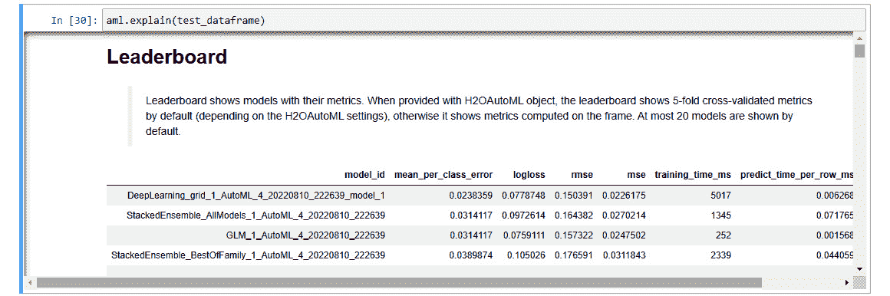

图 7.1–模型可解释性界面输出

1.  您还可以使用`h2o.explain_row()`界面来显示数据集中单行的模型可解释性特征:

    ```py
    aml.explain_row(test_dataframe, row_index=0)
    ```

这样的输出应该会给你一个在数据集的第一行做出预测的模型的排名。

1.  为了从可解释性的角度获得关于模型的附加信息，您可以通过在 leader 模型上使用`explain_row()`函数来进一步扩展可解释性接口，如下:

    ```py
    aml.leader.explain_row(test_dataframe, row_index=0)
    ```

此操作的输出应该根据该行上的预测，为您提供该模型所有适用的图形模型可解释性特性。

既然我们知道了如何在 Python 中使用 model explainability 接口，那么让我们看看如何在 R 语言中使用这个接口。

## 在 R 中实现模型可解释性接口

类似于我们如何在 Python 中实现了可解释性接口，H2O 也规定了在 R 编程语言中使用可解释性接口。

要在 R 中实现模型可解释性功能，请遵循以下步骤:

1.  导入`h2o`库并启动本地 H2O 服务器:

    ```py
    library(h2o) h2o.init(max_mem_size = "12g")
    ```

2.  使用`h2o.importFile(“Dataset/iris.data”)` :

    ```py
    data = h2o.import_file("Dataset/iris.data")
    ```

    导入数据集
3.  将`C5`列设置为标签:

    ```py
    label <- "C5"
    ```

4.  将数据帧分为训练和测试数据帧，并将其分配给适当的变量:

    ```py
    splits <- h2o.splitFrame(data, ratios = 0.8, seed = 7) train_dataframe <- splits[[1]] test_dataframe <- splits[[2]]
    ```

5.  运行 H2O 自动化训练:

    ```py
    aml <- h2o.automl(y = label, training_frame = train_dataframe, max_models = 10)
    ```

6.  在现在训练的`aml`对象上使用 H2O 可解释性接口:

    ```py
    explanability_object <- h2o.explain(aml, test_dataframe)
    ```

一旦 explaibility 对象完成了它的计算，您应该会看到一个列出了所有 explaibility 特性的大输出。

1.  就像 Python 一样，您也可以扩展模型可解释性接口函数，这样它就可以使用`h2o.explain_row()`函数在一行上运行，如下:

    ```py
    h2o.explain_row(aml, test, row_index = 1)
    ```

这将为您提供在数据集的第一行做出预测的模型排名。

1.  类似地，您可以通过使用 leader 模型上的`h2o.explain_row()`函数来扩展这个可解释性接口，以获得关于 leader 模型的更多高级信息:

    ```py
    h2o.explain_row(aml@leader, test, row_index = 1)
    ```

在这些例子中，我们使用 Iris flower 数据集来解决多项式分类问题。类似地，我们可以在训练好的回归模型上使用解释能力接口。一些可解释性特征仅取决于训练模型是回归模型还是分类模型才可用。

现在我们知道了如何用 Python 和 R 实现模型可解释性接口，让我们更深入地看看接口的输出，并尝试理解 H2O 计算的各种可解释性特征。

# 探索各种可解释的特征

可解释性接口的输出是一个`H2OExplanation`对象。对象只不过是一个简单的字典，用可解释特性的名字作为键。您可以通过使用一个特性的键名作为可解释性对象上的`dict`键来检索单个可解释性特性。

如果你向下滚动 H2O AutoML 对象的 explainability 接口的输出，你会注意到有很多带有解释的标题。在这些标题下面，有一个关于可解释特性的简短描述。有些有图解，而其他的可能有表格。

各种可解释特性如下:

*   **排名**:该功能是一个排名，由所有训练过的模型及其基本指标组成，从表现最好到最差排列。仅当可解释性接口在 H2O AutoML 对象或 H2O 模型列表上运行时，才计算此功能。
*   **混淆矩阵**:这个特性是一个性能度量，它生成一个矩阵来跟踪分类模型的正确和不正确的预测。仅可用于分类模型。对于多个模型，混淆矩阵只针对 leader 模型计算。
*   **残差分析**:该特性在可解释性接口中使用的测试数据集上绘制预测值与残差的关系。它只根据排名上的模型排名来分析领导者模型。它仅适用于回归模型。对于多个模型，残差分析在先导模型上进行。
*   **变量重要性**:该特性描绘了变量在数据集中的重要性。它适用于除堆叠模型之外的所有模型。对于多个模型，只在 leader 模型上执行，leader 模型不是堆叠模型。
*   **可变重要性热图**:该功能绘制了所有型号的可变重要性热图。可用于比较除堆叠模型以外的所有模型。
*   **模型相关性热图**:该功能绘制不同模型的预测值之间的相关性。这有助于将具有相似性能的模型组合在一起。它仅适用于多模型解释。
*   **基于顶层树的模型**的 SHAP 摘要:该功能描绘了变量在对复杂的基于树的模型(如随机森林和神经网络)所做的决策中的重要性。此功能为排名中排名靠前的基于树的模型计算此图。
*   **部分依赖多图**:这个特征绘制目标特征和数据集中我们认为重要的某组特征之间的依赖关系。
*   **个体条件期望** ( **ICE** ) **绘制**:该特性绘制目标特性和数据集中某一组特性之间的依赖关系，我们分别认为这些特性对每个实例都很重要。

将它与我们在*使用模型可解释性接口*部分执行的实验中从模型可解释性接口获得的输出进行比较，您会注意到输出中缺少了一些可解释性特性。这是因为这些特征中的一些仅可用于被训练的模型类型。例如，残差分析仅可用于回归模型，而在使用模型可解释性接口部分的*中进行的实验是训练分类模型的分类问题。因此，你不会在模型的可解释性输出中找到残差分析。*

你可以用一个回归问题进行同样的实验；模型可解释性接口将输出支持回归的可解释性特征。

现在我们知道了解释接口中可用的不同可解释特性，让我们一个一个地深入了解它们，深入理解它们的含义。我们将仔细检查用 Python 和 r 实现 explainability 接口得到的输出。

在前面的章节中，我们了解了什么是排名和困惑矩阵。那么，我们从下一个解释特征开始:残差分析。

## 了解残差分析

**残差分析**是对**回归模型**执行。如 [*第五章*](B17298_05.xhtml#_idTextAnchor109) 、*理解 AutoML 算法*所述，在*理解广义线性模型*和*线性回归简介*章节中，**残差**是回归模型预测值与同一行数据实际值之间的差值。分析这些残差值是诊断模型中任何问题的好方法。

残差分析图是一个图表，其中绘制了**残差值**与**预测值**。另一件我们在 [*第五章*](B17298_05.xhtml#_idTextAnchor109) 、*了解 AutoML 算法*，在*了解广义线性模型*和*了解线性回归*的假设章节中了解到的事情是，**线性回归**中的主要假设之一是残差的分布是**正态分布**。

因此，相应地，我们期望我们的剩余图是一个无定形的点的集合。残差值和预测值之间不应有任何模式。

残差分析可以突出训练模型中**异方差**的存在。如果预测值的标准偏差在不同的特征值上发生变化，则称异方差已经发生。

请考虑下图:

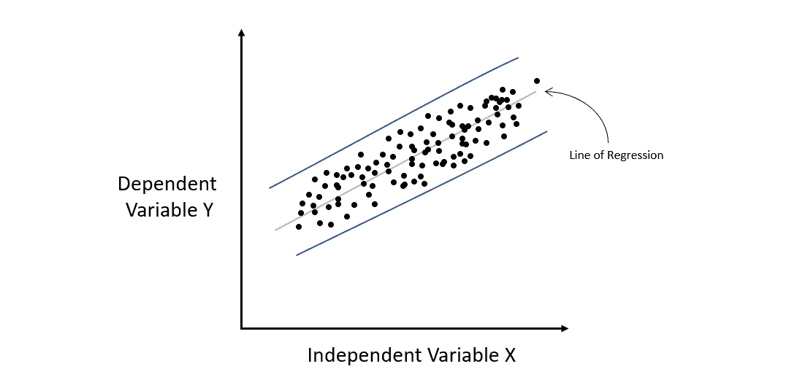

图 7.2-同质数据集的回归图

前面的图显示了一个回归图，其中我们有一些样本数据来映射 *X* 和 *Y* 之间的关系。让我们通过这些数据拟合一条直线，它代表我们的线性模型。如果我们在 *X* 轴上从左到右计算每个点的残差，我们会注意到误差率在 *X* 的所有值中保持相当恒定。这意味着所有的误差值都位于平行的蓝色线之间。误差或残差的分布在整个独立变量中保持不变的情况称为同方差。

与同异方差相对的是**异方差**。这是误差率随 *X* 值的变化而变化的地方。请参考下图:

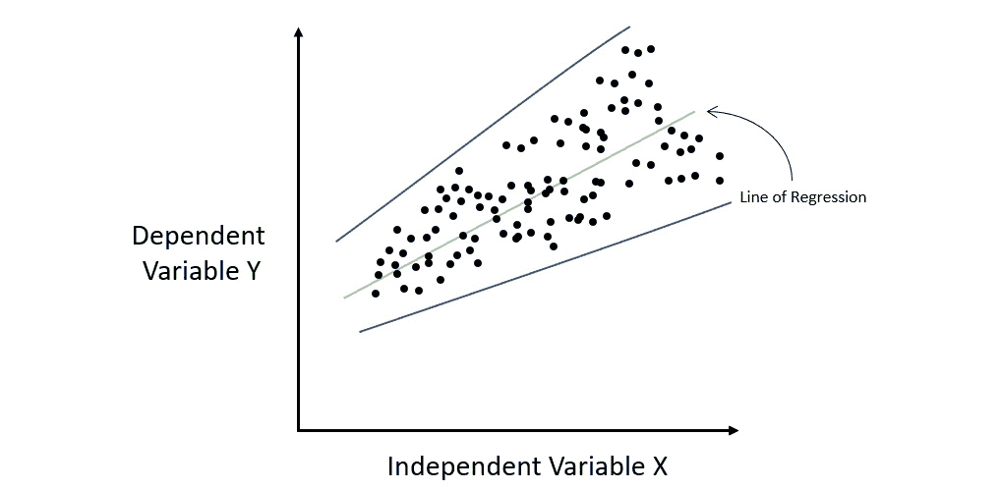

图 7.3-异方差数据集的回归图

如您所见，线性模型产生的误差幅度随着 *X* 的增加而增加。如果你画出包含所有误差的蓝色误差线，你会注意到它们逐渐散开并且不平行。这种误差或残差的分布在整个自变量中不恒定的情况称为异方差。

异方差告诉我们的是,有一些模型无法捕捉和学习的信息。异方差也违反了线性回归的基本假设。因此，它可以帮助您确定您可能需要将缺失的信息添加到数据集中以正确定型您的线性模型，或者您可能需要实现某种非线性回归算法以获得性能更好的模型。

由于残差分析是特定于回归的模型可解释性特征，我们不能使用在*使用模型可解释性接口*部分中执行的 Iris 数据集分类实验。相反，我们需要训练一个回归模型，然后在该模型上使用模型可解释性接口来获得剩余分析输出。因此，让我们来看一个使用红酒质量数据集的回归问题。你可以在[https://archive.ics.uci.edu/ml/datasets/wine+quality](https://archive.ics.uci.edu/ml/datasets/wine+quality)找到这个数据集。

该数据集由以下要素组成:

*   **固定酸度**:这一特征解释了不挥发酸度的数量，这意味着它不会在一段时间内蒸发。
*   **挥发性酸度**:这个特性解释了挥发性酸度的数量，这意味着它将在一段时间内蒸发。
*   **柠檬酸**:这个特征解释了葡萄酒中柠檬酸的含量。
*   **残糖**:这个特征解释了葡萄酒中存在的残糖量。
*   **氯化物**:这个特征解释了葡萄酒中存在的氯化物数量。
*   **游离二氧化硫**:这个特征解释了葡萄酒中游离二氧化硫的含量。
*   **总二氧化硫**:这个特征解释了葡萄酒中总二氧化硫的含量。
*   **密度**:这个特征解释了葡萄酒的密度。
*   **pH** :这个特征说明了葡萄酒的 pH 值，0 为酸性最强，14 为碱性最强。
*   **硫酸盐**:这个特征解释了葡萄酒中硫酸盐的数量。
*   **酒精**:这个特征解释了葡萄酒中的酒精含量。
*   **质量**:这是响应栏，记录了葡萄酒的质量。0 表示酒很差，10 表示酒很好。

我们将运行我们训练模型的基本 H2O AutoML 过程，然后在被训练的 AutoML 对象上使用模型可解释性接口来获得残差分析图。

现在，让我们观察从这个实现中得到的残差分析图，然后看看我们如何从图中检索所需的信息。请参考下图:

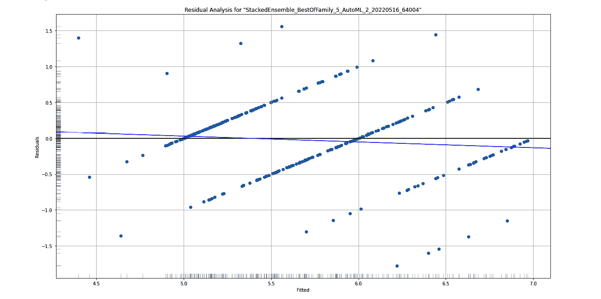

图 7.4-红酒质量数据集的残差分析曲线图

在这里，您可以看到堆叠集合模型的残差分析，它是 AutoML 训练模型的领导者。在 *X* 轴上，您有**拟合**，也称为预测值，而在 *Y* 轴上，您有**残差**。

在 *Y* 轴的左边界和 *X* 轴的下方，您将分别看到一个**灰度**列和行。这有助于您观察这些残差在 *X* 和 *Y* 轴上的分布。

为了确保残差的分布是正态的，并且数据不是异方差的，您需要观察 *Y* 轴上的灰度。理想情况下，正态分布给出的灰度是中间最暗，随着远离而变亮。

既然您已经理解了如何解释残差分析图，那么让我们学习更多关于下一个可解释特性:变量重要性。

## 了解变量重要性

**变量重要性**，也叫**特征重要性**，顾名思义，解释数据集中不同变量/特征在进行预测时的重要性。在任何 ML 问题中，您的数据集通常会有多个变量对您的预测列的特征产生影响。但是，在大多数情况下，您通常会有一些功能比其他功能贡献更大。

这种理解可以帮助科学家和工程师从数据集中移除任何引入噪声的不需要的要素。这可以进一步提高模型的质量。

对于不同类型的算法，H2O 计算变量重要性的方式不同。首先，让我们了解一下**基于树的算法**是如何计算变量重要性的。

基于树的算法中的变量重要性基于两个标准来计算:

*   决策树决策变量的选择
*   由于选择，整个树的平方误差有所改善

每当 H2O 构建决策树作为训练基于树的模型的一部分时，它将使用其中一个特征作为节点来进一步分裂树。正如我们在 [*第 5 章*](B17298_05.xhtml#_idTextAnchor109) 、*了解 AutoML 算法*中所学的，在*了解分布式随机森林算法*一节中，我们知道决策树中的每个节点分裂都旨在减少总体平方误差。这个扣除的值只不过是父节点与子节点的平方误差之差。

H2O 在计算特征重要性时考虑了这种平方误差的减少。基于树的模型中每个节点的平方误差导致该节点响应值的方差降低。基于树的模型中每个节点的平方误差导致该节点响应值的方差降低。

因此，相应地，用于计算树的平方误差的等式如下:


在这里，我们有以下内容:

*   *MSE* 表示均方误差
*   *N* 表示观察的总数
*   *VAR* 表示方差

计算方差的公式如下:


在这里，我们有以下内容:

*   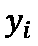表示观察值
*   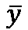表示所有观察值的平均值
*   *N* 表示观察的总数

对于基于树的集成算法，例如**梯度推进算法** ( **GBM** )，决策树被顺序训练。每一棵树都建立在前一棵树的错误之上。因此，特征重要性的计算与我们对单个决策树中的单个节点的计算是一样的。

对于**分布式随机森林** ( **DRF** )，判决树是并行训练的，所以 H2O 只是平均结果来计算特征重要性。

对于 **XGBoost** ，当构建树时，H2O 根据个体特征的损失函数的增益来计算特征重要性。

对于**深度学习**，H2O 使用一种叫做的特殊方法 **Gedeon 方法**计算特征重要性。

对于**广义线性模型** ( **GLMs** )，变量重要性与预测器权重相同，也称为系数幅度。如果在训练期间，您决定对数据进行标准化，则会返回标准化系数。

下图显示了我们在 Iris flower 数据集上的实验中计算的的特征重要性:

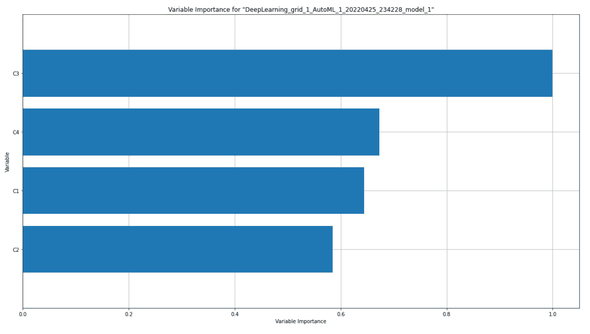

图 7.5–鸢尾花数据集的可变重要性图

上图显示了深度学习模型的变量重要性图。如果您将其与您的排名进行比较，您会看到可变重要性图是为最领先的模型绘制的，而不是堆叠整体模型。

在图的*Y*-轴上，您有特征名称——在我们的例子中，鸢尾花数据集的 **C1** 、 **C2** 、 **C3** 和 **C4** 列。在 *X* 轴上，你有这些变量的重要性。可以获得特征重要性的原始度量值，但是 H2O 通过在 **0** 和 **1** 之间缩小来显示重要性值，其中 **1** 表示最重要的变量，而 **0** 表示最不重要的变量。

由于变量重要性对于分类和回归模型都是可用的，所以你也将得到一个变量重要性图，作为红酒质量回归模型的一个可解释特性。该图应该如下所示:

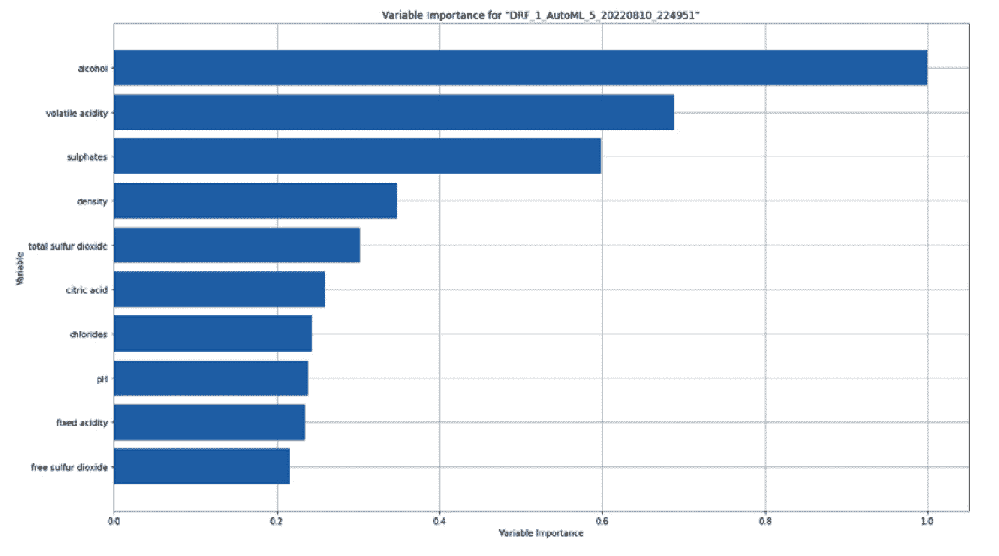

图 7.6-红酒质量数据集的可变重要性图

既然您已经知道了如何解释特性重要性图，那么让我们来理解特性重要性热图。

## 了解功能重要性热图

当显示特定模型的特性重要性时，很容易用柱状图或条形图来表示。然而，我们经常需要比较各种模型的特性重要性，以便我们能够理解哪个模型认为哪个特性是重要的，以及我们如何使用这些信息来比较模型性能。H2O 自动化将固有地用不同的 ML 算法训练多个模型。因此，对模型性能的比较研究是必须的，并且特征重要性的图形表示可以对科学家和工程师有很大的帮助。

为了在单个图形中表示 H2O 自动化训练的所有模型的特征重要性，H2O 生成了特征重要性热图。

热图是一种数据可视化图形，其中图形的颜色受特定值的密度或大小的影响。

一些 H2O 模型计算分类列的编码版本的变量重要性。不同的模型也有不同的分类值编码方式。因此，在所有模型中比较这些分类列的可变重要性可能会很棘手。H2O 通过汇总所有特征的变量重要性进行比较，并返回代表原始分类特征的单个变量重要性值。

以下是鸢尾花数据集实验的特征重要性热图:

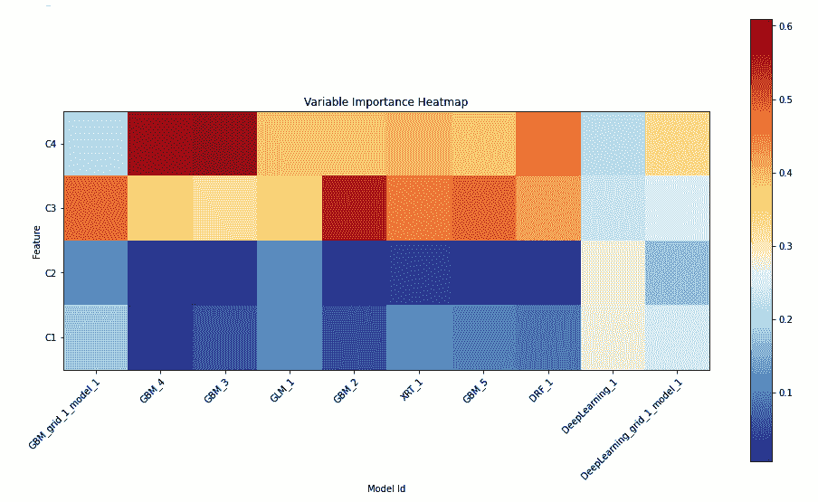

图 7.7–可变重要性热图

在这里，我们可以看到排名上排名前 10 的车型。

热图在 *Y* 轴上有 **C1** 、 **C2** 、 **C3** 和 **C4** 特征，在 *X* 轴上有型号 id。图的颜色表示模型在预测过程中考虑要素的重要性。越重要就意味着越有价值，这反过来会使相应的图变红。重要性越低，特征的重要性值越低；颜色会变冷，变成蓝色。

现在，您已经知道如何解释功能重要性热图，让我们了解一下模型相关性热图。

## 了解模型关联热图

多个模型之间的另一个重要的比较是**模型相关性**。模型相关性可以解释为当您比较它们的预测值时，模型在性能方面有多相似。

如果一个模型做出的预测与另一个模型做出的预测相同或相似，则使用相同或不同的 ML 算法训练的不同模型被称为高度相关。

在模型关联热图中，H2O 比较它训练的所有模型的预测值，并将它们相互比较。

以下是我们在 Iris flower 数据集上进行实验得到的模型相关性热图:

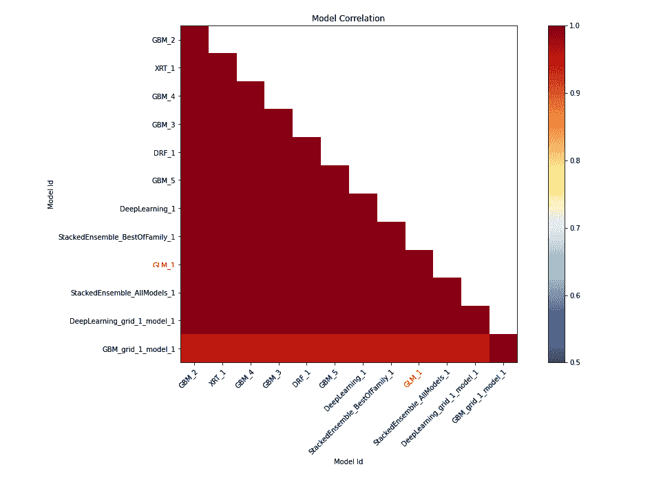

图 7.8–鸢尾花数据集的模型关联热图

小费

为了理解这个可解释特性图，请参考您在代码中执行`explain()`函数后得到的输出中的*模型相关性*部分。

在 *X* 和 *Y* 轴上，我们有型号 id。它们在图上的横截面表示它们之间的相关值。您会注意到图中位于 *X* 和 *Y* 轴内的热点具有相同的型号 ID，始终为 1；所以，剧情永远是红色的。这是正确的，因为从技术上来说，这是同一个模型，当你将一个模型的预测值与其自身进行比较时，会有 100%的相关性。

为了更好地了解不同模型之间的相关性，您可以参考这些热量值。暗红色的点表示高相关性，而具有冷蓝色值的点表示低相关性。用红色突出显示的模型是可解释的模型，如 GLMs。

您可能注意到，由于模型关联热图支持堆叠集成模型，而特性重要性热图不支持，如果您忽略模型关联热图中的堆叠集成模型(*图 7.8* ，其余模型与特性重要性热图中的模型相同(*图 7.7* )。

现在您已经知道了如何解释模型相关性热图，让我们了解更多关于部分依赖图的信息。

## 了解部分依赖图

**部分相关性图** ( **PDP** )是一个图表，向您显示预测值和我们感兴趣的输入特征集之间的相关性，同时忽略我们不感兴趣的特征值。

理解 PDP 的另一种方式是，它表示我们感兴趣的输入要素的函数，该函数将预期的预测值作为输出提供给我们。

PDP 是一个非常有趣的图表，对于向数据科学领域不太熟练的组织成员展示和解释模型训练结果非常有用。

首先，在学习如何计算 DPD 之前，让我们先了解如何解释它。下图显示了我们在使用 Iris flower 数据集进行实验时获得的 PDP:


图 7.9–以 Iris-setosa 为目标的 C 1 列的 PDP

小费

为了理解这个可解释性特征图，请参考您在代码中执行`explain()`函数后得到的输出中的*部分依赖图*部分。

PDP 图是显示特性对响应值的边际影响的图表。在图表的 *X* 轴上，您可以看到所选的特性及其值的范围。在 *Y* 轴上，有目标值的平均响应值。PDP 图旨在告诉查看者，对于所选特性的给定值，模型预测的平均响应值是多少。

在*图 7.9* 中，为目标值的 **C1** 列绘制 PDP 图形，目标值为 **Iris-setosa** 。在 *X* 轴上，我们有 **C1** 列，它代表花的萼片长度，以厘米为单位。这些值的范围从数据集中的最小值到最大值。在 *Y* 轴上，我们有平均响应值。对于这个实验，平均响应值是花是鸢尾的概率，这是该图的选定目标值。图表上的彩色线条表示 H2O 自动化训练的不同模型在 **C1** 值范围内预测的平均响应值。

查看此图，我们可以很好地了解响应值如何依赖于每个单独模型的单一特征 **C1** 。我们可以看到，只要萼片长度在 4.5 到 6.5 厘米之间，大多数模型显示大约有 35%的可能性该花属于鸢尾属。

同样，在下图中，我们绘制了 **C1** 列的 PDP 图，只是这次目标响应列是**鸢尾-杂色**:

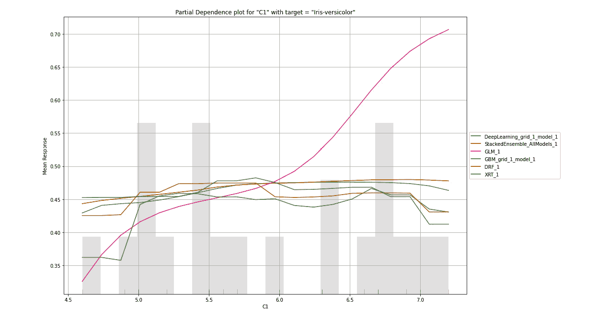

图 7.10–以 Iris-versicolor 为目标的 C1 色谱柱的 PDP

小费

为了理解这个可解释性特征图，请参考您在代码中执行`explain()`函数后得到的输出中的*部分依赖图*部分。

在这里，我们可以看到，只要 **C1** 的值在 4.5 到 6.5 之间，该花大约有 27%到 40%的机会是鸢尾-杂色类的。现在，让我们来看看第三目标值 **Iris-virginica** 的 **C1** 的以下 PDP 图:

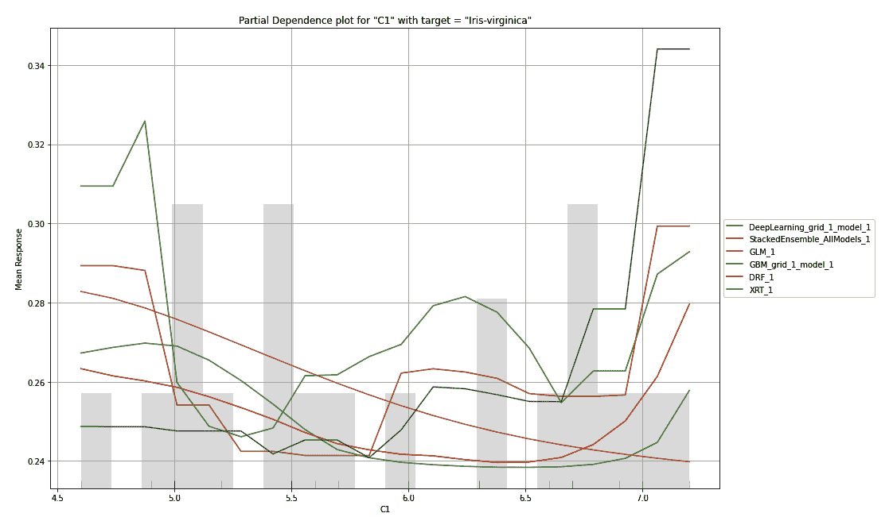

图 7.11–以 Iris-virginica 为目标的 C1 列的 PDP

小费

为了更好地理解这个可解释特性图，请参考您在代码中执行`explain()`函数后得到的输出中的*部分依赖图*部分。

你会注意到，对于 **Iris-virginica** ，所有的模型对 C1**的相同值都有不同的预测。这可能意味着**鸢尾-海滨鸢尾**类并不强烈依赖于花的萼片长度——即 **C1** 值。**

PDP 可能有用的另一种情况是在模型选择中。假设您确定数据集中的某个特定要素将对响应值产生很大影响，并且您对其训练了多个模型。然后，您可以选择最适合这种关系的模型，因为该模型将做出最真实准确的预测。

现在，让我们试着了解 PDP 图是如何生成的，以及 H2O 是如何计算这些图值的。

PDP 绘图数据可以计算如下:

1.  选择一个特征和目标值来绘制依赖关系。
2.  从验证数据集中引导数据集，其中所选要素的值被设置为所有行的验证数据集中的最小值。
3.  将此引导数据集传递给由 H2O AutoML 训练的模型之一，并计算它为所有行获得的预测值的平均值。
4.  在该型号的 PDP 图上绘制该值。
5.  对其余型号重复*步骤 3* 和 *4* 。
6.  重复*步骤 2* ，但这一次，将所选特性的值增加到验证数据集中的下一个值。然后，重复剩余的步骤。

您将对验证数据集中出现的所有特征值执行此操作，并将它们绘制在同一 PDP 图上所有模型的结果上。

完成后，您将对特征和目标响应值的不同组合重复相同的过程。

H2O 将为特性和响应值的所有组合绘制多个 PDP 图。以下是一个 PDP 图，其中选择的特征是 **C2** ，选择的目标值是**光圈-setosa** :

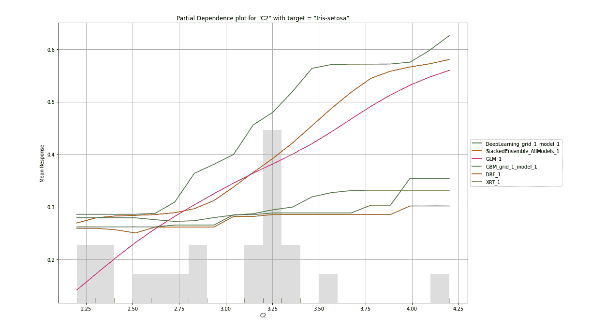

图 7.12–以 Iris-setosa 为目标的 C2 色谱柱的 PDP

小费

为了更好地理解这个可解释特性图，请参考您在代码中执行`explain()`函数后得到的输出中的*部分依赖图*部分。

类似地，它为 **C3** 和 **C4** 特征创建了不同的 PDP 情节组合。下面的是一个 PDP 图，其中选择的特征是 **C3** ，选择的目标值是**虹膜变色**:

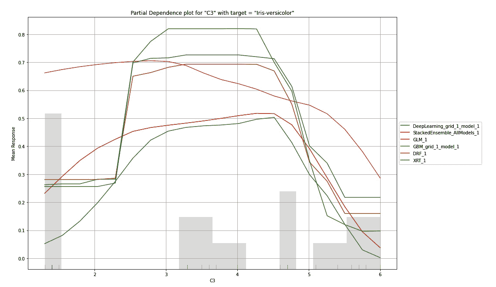

图 7.13–C3 色谱柱的 PDP，以 Iris-versicolor 为目标

小费

为了更好地理解这个可解释特性图，请参考您在代码中执行`explain()`函数后得到的输出中的*部分依赖图*部分。

现在您已经了解了如何解释要素重要性热图，让我们了解一下 SHAP 汇总图。

## 了解 SHAP 的概要情节

对于复杂的问题，基于树的模型可能变得难以理解。复杂的树模型可能非常大，理解起来非常复杂。 **SHAP 汇总图**是基于树的模型的简化图，为您提供模型复杂性及其行为的汇总视图。

**SHAP** 代表**沙普利添加剂说明**。SHAP 是一个模型可解释性特征，它采用博弈论的方法来解释 ML 模型的输出。与 PDP 类似，SHAP 汇总图显示了要素对预测值的贡献。

让我们试着从一个例子中解读一个 SHAP 值。以下是我们从红酒质量数据集中得到的 SHAP 总结:

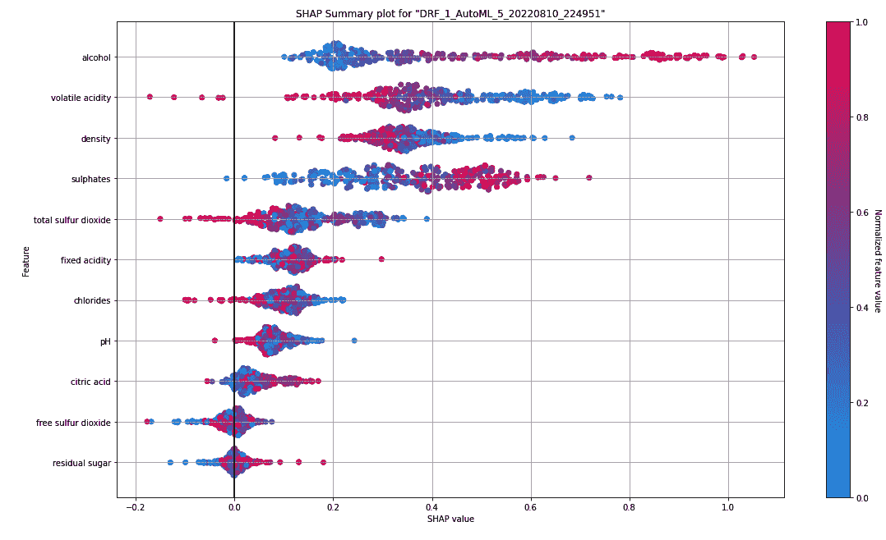

图 7.14-红酒质量数据集的 SHAP 汇总图

小费

为了更好地理解这个可解释特性图，请参考在您的回归模型上执行`explain()`函数后得到的输出中的 *SHAP 总结*部分。

在右手边，你可以看到一个蓝红条。这个条形用颜色表示葡萄酒质量的标准化值。颜色越红，质量越好；颜色越蓝，酒质越差。在二项式问题中，颜色将是红色和蓝色之间的鲜明对比。然而，在回归问题中，就像在我们的例子中，我们可以有一个完整的色谱，表明可能的数值范围。

在 *Y* 轴上，您可以看到数据集中的要素。根据功能的重要性，它们从上到下按降序排列。在我们的例子中，酒精含量是数据集中最重要的特征；它对最终预测值的贡献更大。

在 *X* 轴上，你有 **SHAP 值**。SHAP 值表示特性如何帮助模型达到预期的结果。SHAP 值越大，特征对结果的贡献就越大。

让我们以 SHAP 总结中的酒精为例。基于此，我们可以看到酒精在其余特征中具有最高的 SHAP 值。因此，酒精对模型的预测贡献很大。此外，图表上 SHAP 值最高的酒精点用红色表示。这也表明高酒精含量有助于积极的结果。记住这一点，我们可以从这个图表中提取的是，酒精含量的特征在预测葡萄酒的质量中起着重要的作用，酒精含量越高，葡萄酒的质量越好。

同样，您可以从其他特征中解读相同的知识。这可以帮助您比较和了解哪些特征是重要的，以及它们如何影响模型的最终预测。

关于 SHAP 摘要和 PDP 的一个有趣问题是，它们之间有什么区别？这两者的主要区别在于，PDP 解释了一次仅替换一个要素对输出的影响，而 SHAP 汇总考虑了该要素与数据集中其他要素的整体交互。因此，PDP 的工作假设您的特征是相互独立的，而 SHAP 考虑了不同特征的综合贡献及其对整体预测的综合影响。

计算 **SHAP 值**是一个源自博弈论的复杂过程。如果你对扩展你的博弈论知识和 SHAP 值是如何计算的感兴趣，请按照你自己的进度随意探索。理解 SHAP 的一个很好的起点是遵循 https://shap.readthedocs.io/en/latest/index.xhtml.的解释在撰写本文时，H2O 充当 SHAP 库的包装器，并在内部使用这个库来计算 SHAP 值。

既然我们知道了如何解释 SHAP 摘要情节，让我们来学习可解释性特征，**个体条件期望** ( **ICE** ) 情节。

## 理解单个条件期望图

一个 **ICE** plot 是一个为每个实例显示一条线的图形，一个观察显示当一个特性的值改变时给定观察的预测如何改变。

ICE 图类似于 PDP 图。PDP 侧重于某个特征的变化对预测结果的总体平均影响，而 ICE 图侧重于结果对特征值的单个实例的依赖性。如果你平均冰图值，你应该得到一个 PDP。

计算 ICE 图的方法非常简单，如下图所示:

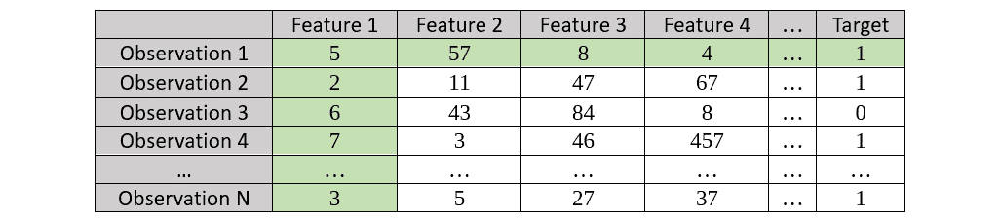

图 7.15–ICE 图表的样本数据集，突出了观察结果 1

一旦您的模型经过训练，您必须执行以下步骤来计算 ICE 图:

1.  考虑第一个观察值——在我们的示例中为**观察值 1**——并绘制**特征 1** 和相应的**目标值**之间的关系。
2.  保持**特征 1** 中的值不变，创建一个引导数据集，同时用原始数据集中的**观察 1** 中的值替换所有其他特征值；将所有其他观察标记为**观察 1** 。
3.  使用您训练好的模型计算观察值的目标值**。**

请参考以下自举数据集的屏幕截图:

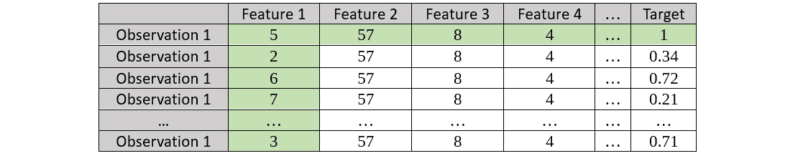

图 7.16–要素 1 的观测值 1 的引导数据集

1.  对下一次观察重复同样的步骤。考虑第二个观察值——在我们的示例中为**观察值 2**——并绘制**特征 1** 和相应的**目标值**之间的关系:

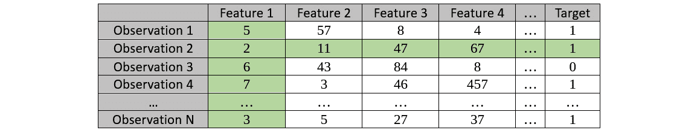

图 7.17–突出观察值 2 的冰图的样本数据集

1.  保持**功能 1** 中的值不变，并创建一个引导数据集；然后，使用训练好的模型计算**目标**值。请参考以下生成的引导数据集:

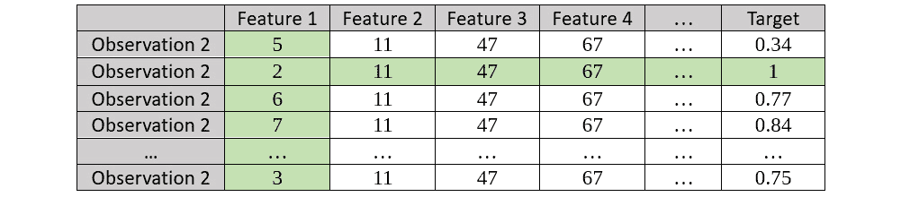

图 7.18–特征 1 的观测值 2 的引导数据集

1.  我们对所有特征的所有观察值重复这个过程。
2.  从这些引导数据集观察到的结果绘制在每个要素的单个 ICE 图上。

让我们看看如何解释 ICE 图，并从图表中提取可观察到的信息。参考下面的屏幕截图，它显示了我们在 AutoML 对象上运行模型可解释性接口后得到的 ICE 图，该对象是在红酒质量数据集上训练的:

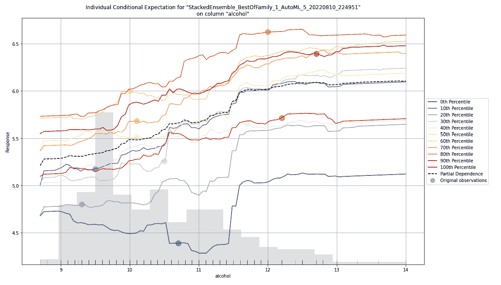

图 7.19-红酒质量数据集的冰图

正如标题所述，这是 H2O 自动化训练的堆叠集合模型数据集的酒精特征列上的冰图。请记住，这个模型是 AutoML 训练的模型列表中的领导者。ICE 图仅针对数据集的前导绘制。您还可以通过使用模型 id 提取模型，然后对其运行`ice_plot()`功能，来观察其他模型的 ICE 图。请参考下面的代码示例:

```py

model = h2o.get_model("XRT_1_AutoML_2_20220516_64004")

model.ice_plot(test_dataframe, "alcohol")
```

在图表的 *X* 轴上，您可以看到酒精特性的数值范围。在 Y 轴上，你有预测结果的数值范围，也就是葡萄酒的质量。

在图表的左侧，您可以看到说明不同类型线条及其百分位数的图例。ICE 图描绘了每个十分位数的影响。所以，从技术上讲，在绘制冰图时，你要为每个观察值计算一条线。但是，在包含数千行(如果不是数百万行的话)数据的数据集中，您最终会在图上看到相同数量的线条。这样会把冰剧情搞得乱七八糟。这就是为什么要更好地观察这些数据，您必须将这些线聚集到最接近的十分位数，并为每个百分位划分绘制一条线。

虚线是所有其他百分位线的平均值，是该特性的 PDP 线。

现在你知道了如何解读冰图，让我们来看看学习曲线图。

## 了解学习曲线图

**学习曲线图**是数据科学家用来观察模型学习率的最常用图之一。**学习曲线**展示了你的模型如何从数据集学习，以及用进行学习的效率。

在处理一个 ML 问题时，经常需要回答的一个重要问题是，*我们需要多少数据来训练最准确的模型？*学习曲线图可以帮助您了解增加数据集如何影响您的整体模型性能。

使用这些信息，您可以决定增加数据集的大小是否可以提高模型性能，或者是否需要对模型进行定型以提高模型的性能。

让我们观察一下学习曲线图，它是我们在由 AutoML 训练的 XRT 模型的红酒质量数据集上的实验中得到的:

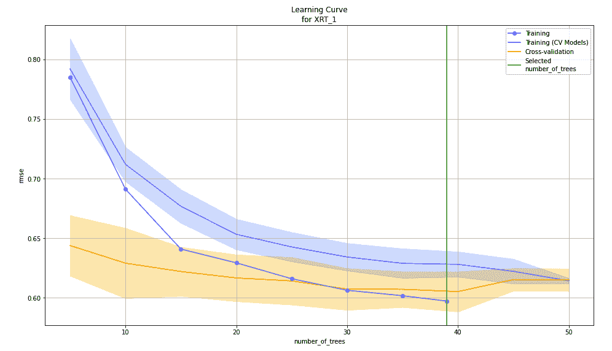

图 7.20-红酒质量数据集上 XRT 模型的学习曲线图

在图的*X*-轴上，你有由 XRT 算法创建的树的数量。如你所见，该算法总共创建了大约 40 到 50 棵树。在 *Y* 轴上，您可以看到性能指标 RMSE，它是在算法创建树的模型训练的每个阶段计算的。

如前面的屏幕截图所示，随着算法创建更多的树，RMSE 度量会降低。最终，在一定数量的树木被创造出来后，RMSE 下降的速度会降低。任何超过这个数量的树都不会对模型性能的整体改善有所贡献。因此，学习率最终随着几棵树的增加而降低。

图表上的线条描绘了算法在训练期间使用的各种数据集，以及在创建树的每个实例期间各自的 RMSE。

在撰写本文时，从 H2O 版本 *3.36.1* 开始，学习曲线绘图不是默认模型可解释性界面的一部分。要绘制学习曲线，必须在相应的模型对象上使用以下函数进行绘制:

```py

model = h2o.get_model("GLM_1_AutoML_2_20220516_64004")

model.learning_curve_plot()
```

不同算法的学习曲线图不同。下面的截图显示了 AutoML 在相同数据集上训练的 GLM 模型的学习图:


图 7.21-红酒质量数据集上 GLM 模型的学习曲线图

如您所见，我们现在有迭代，而不是在 *X* 轴上有多少棵树。树的数量与基于树的算法(如 XRT 和 DRF)有关，但线性模型(如在线性算法上运行的 GLM)对于帮助学习更有意义。在 *Y* 轴上，你有偏差而不是 RMSE，因为偏差更适合于测量线性模型的性能。

学习曲线对于不同类型的算法是不同的，包括堆叠集成模型。随意探索不同算法的学习曲线的不同变化。H2O 已经根据算法选择了合适的性能指标和学习步骤，因此您不必担心是否选择了正确的指标来衡量学习速度。

# 总结

在这一章中，我们重点理解了 H2O 提供的模型可解释性接口。首先，我们理解了 explainability 接口如何提供不同的 explainability 特性，来帮助用户获得关于被训练模型的详细信息。然后，我们学习了如何在由 H2O 的 AutoML 训练的模型上用 Python 和 r 实现这个功能

一旦我们熟悉了它的实现，我们就开始探索和理解由可解释性接口的输出显示的各种可解释性图表，从残差分析开始。我们观察了残差分析如何帮助突出数据集中的异方差性，以及它如何帮助您识别数据集中是否有任何缺失信息。

然后，我们探讨了可变重要性以及它如何帮助您识别数据集中的重要要素。在此基础上，我们了解了特征重要性热图如何帮助您观察 AutoML 训练的所有模型中的特征重要性。

然后，我们发现了如何解释模型关联热图，以及它们如何帮助我们从模型列表中识别具有相似预测行为的模型。

后来，我们学习了 PDP 图，以及它们如何表达整体结果对数据集单个特征的依赖性。了解了这一点后，我们研究了 SHAP 总结和 ICE 图，在那里我们理解了这两个图表，以及每个图表如何关注结果依赖于个体特征的不同方面。

最后，我们探讨了什么是学习图，以及它如何帮助我们理解模型如何在观察、迭代或树的数量上提高性能，也称为学习，这取决于用于训练模型的算法类型。

在下一章中，我们将使用我们在前几章中学到的所有知识，并探索在使用 H2O 的 AutoML 功能时可用的其他高级参数。