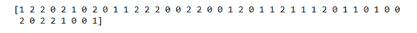
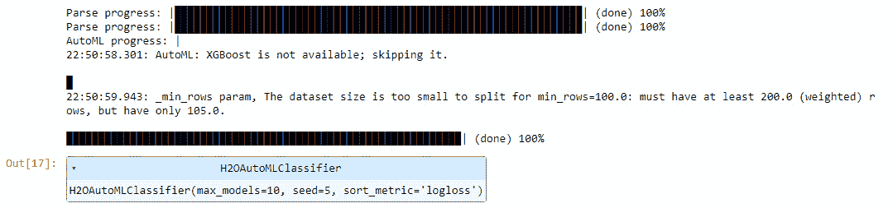
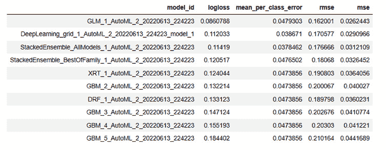
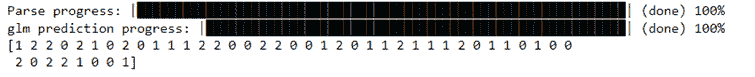
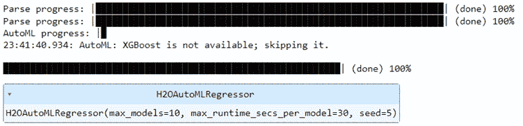
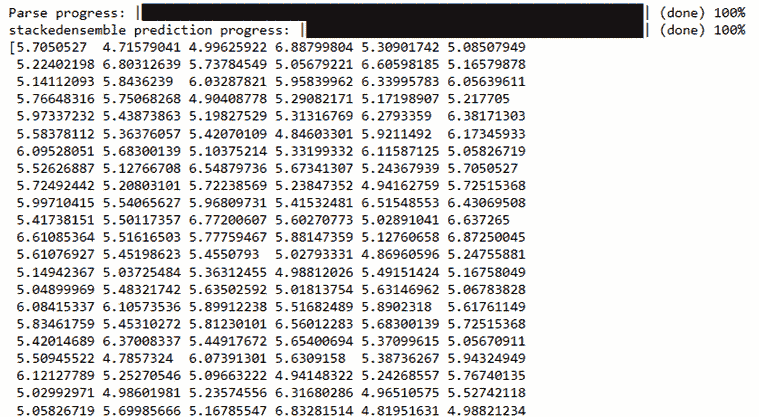
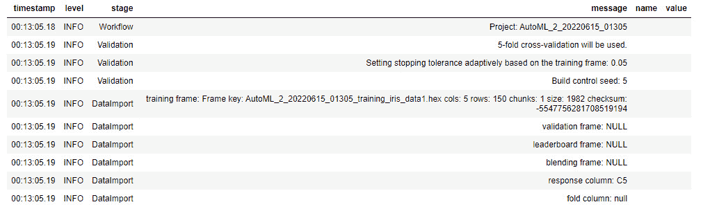
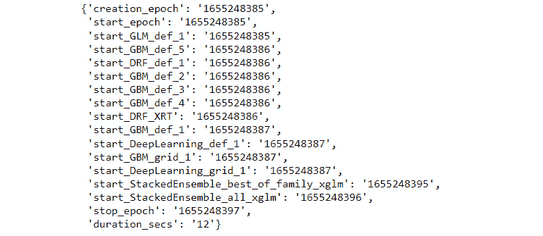

# 9

# 探索 H2O 汽车的各种功能

除了结合许多**机器学习** ( **ML** )算法和各种功能来训练它们，H2O 汽车还具有一些杂项功能，使其成为能够满足各种业务需求的全方位服务。

H2O 汽车公司的优势不仅在于其自动训练多种模型的能力，还在于为其他服务和功能提供支持，这些服务和功能对于生产级系统至关重要。

在这一章中，我们将探讨 H2O 汽车公司的两个独特的特点，这是很好的了解，并可以在需要时非常有用。首先是 H2O AutoML 与 Python 中一个流行的 ML 库 scikit-learn 的兼容性。我们将探讨如何在 scikit-learn 实现中使用 H2O AutoML，以及它如何为大型 scikit-learn 社区提供价值。

第二个特点是 H2O 汽车公司的内置日志系统。这个记录系统在 AutoML 训练过程中记录有价值的信息。如果您计划在生产中使用 H2O AutoML 服务，在这种情况下，监控系统的健康状况是重中之重，那么它会特别有用。

在本章中，我们将讨论以下主题:

*   了解 scikit 中的 H2O 汽车集成-学习
*   了解 H2O 汽车事件记录

记住这一点，让我们探索 H2O 汽车公司的第一个杂项功能与 scikit-learn 的兼容性。

# 技术要求

对于本章，您将需要以下内容:

*   您首选的 web 浏览器的最新版本
*   您选择的**集成开发环境** ( **IDE** )
*   (可选)Jupyter 项目的 Jupyter 笔记本([https://jupyter.org/](https://jupyter.org/))

本章中进行的所有实验都是在 Jupyter 笔记本上进行的，以便为您提供更好的可视化输出示例。您可以自由地使用相同的设置。您还可以在任何 Python 环境中执行相同的实验，因为 Python 代码在这两种环境中的执行是相同的。

本章的所有代码示例都可以在 GitHub 上的[https://GitHub . com/packt publishing/Practical-Automated-Machine-Learning-on-H2O/tree/main/Chapter % 209](https://github.com/PacktPublishing/Practical-Automated-Machine-Learning-on-H2O/tree/main/Chapter%209)找到。

# 了解 scikit 中的 H2O 汽车集成-学习

**Scikit-learn** 是ML 和数据科学领域最常用的开源 ML 库之一。它是 Python 编程语言的库，专注于 ML 工具函数。它包括执行数学和统计分析的模块、通用 ML 算法以及训练、测试和评估 ML 模型的功能。

Scikit-learn 最初是由大卫·库尔纳波开发的，最初被称为**。它是 2007 年作为谷歌代码之夏项目创建的，后来被同年的 Matthieu Brucher 作为论文项目。后来，位于法国 Rocquencourt 的法国计算机科学和自动化研究所的 Fabian Pedregosa、Gael Varoquaux、Alexandre Gramfort 和 Vincent Michel 对其进行了重写和进一步开发。Scikit-learn 的第一个公开发布版本是在 2010 年 2 月 1 日。**

你可以找到更多关于 scikit 的细节——在这里学习:[https://scikit-learn.org/stable/](https://scikit-learn.org/stable/)。

scikit-learn 库建立在以下软件包上:

*   **NumPy** : NumPy 是一个 Python 库，用于专门处理数组。它用于 Python 中的科学计算，并提供了处理多维数组的函数。它还在所述阵列上提供多种快速计算数学运算，使其成为数据分析的理想选择。它可以执行数组形状操作、排序、搜索、离散傅立叶变换操作、线性代数和统计。你可以在这里找到更多关于 NumPy 的细节:https://numpy.org/.
*   **SciPy** : SciPy 是一个科学计算库，构建在 NumPy 的之上。它提供了先进的科学计算功能。它用于执行图像处理、聚类、梯度优化等操作。Python 中的所有数值计算都是由 SciPy 完成的。你可以在这里找到更多关于 SciPy 的细节:[https://scipy.org/](https://scipy.org/)。
*   **Matplotlib**:Matplotlib是一个库，用于从数据创建可视化。这些可视化涉及各种类型的图形和图表，这些图形和图表依赖于可以容易地表达和可视化解释的计算数据。它可以创建适合在科学研究论文中发表的绘图图表，并创建交互式图表，所有这些图表都可以导出为不同类型的格式。你可以在这里找到更多关于 Matplotlib 的细节:[https://matplotlib.org/](https://matplotlib.org/)。

Scikit-learn 经常被数据科学家在进行数据实验时使用。它在进行实验时提供了极大的灵活性，并且由于它的 API 非常易于使用，所以它通常是执行一般 ML 功能的首选库。

H2O AutoML 可以很容易地与 scikit-learn 集成。你可以使用 H2O AutoML 作为 scikit-learn 估计器和与其他 scikit-learn 函数结合使用，以达到两全其美。H2O AutoML 使用H2O . sk learn 模块与 scikit-learn 进行交互。h2o.sklearn 模块公开了两个包装函数来执行 AutoML:

*   **h2oautomlclarger**:此功能用于使用 H2O AutoML 训练分类模型
*   **H2OAutoMLRegressor** :此功能用于使用 H2O 汽车公司的汽车训练回归模型

这些函数接受各种格式的输入数据，比如 H2Oframes、NumPy 数组，甚至 pandas DataFrames。它们还公开了标准的训练和预测 API，类似于它们在 scikit-learn 中的使用方式。这使得 scikit-learn 能够使用 H2O AutoML 以及其他 scikit-learn 组件。

H2O AutoML 估值器还保留了其原有的功能，如排行榜和培训信息等。用户仍然可以在 scikit-learn 中访问这些详细信息，以从 AutoML 培训中提取信息，用于进一步的实验或分析。

现在我们对 scikit-learn 库及其用途有了更好的理解，让我们来学习如何在 H2O 汽车公司使用它。我们将从了解在我们的系统上安装 scikit-learn 的各种方法开始。

## 构建和安装 sci kit-了解

安装 scikit-learn 非常容易。在您的系统上安装 scikit-learn 有三种不同的方法:

*   安装 scikit-learn 的最新官方版本
*   安装 Python 发行版或操作系统提供的 scikit-learn 版本
*   从源代码构建和安装 scikit-learn 包

让我们快速地一个接一个地浏览这些选项，这样我们就有 scikit-learn 可以和 H2O 汽车一起使用了。

### 安装 scikit-learn 的最新官方版本

这个过程可能会有所不同，这取决于您在系统上使用的 Python 包管理器的类型:

*   使用`pip`包管理器，在您的终端中执行以下命令来安装最新版本的 scikit-learn:

    ```
    pip install -U scikit-learn
    ```

    *   以下命令将显示 scikit-learn 的安装位置及其版本:

        ```
        python -m pip show scikit-learn 
        ```

*   使用Anaconda 或 **Miniconda** 包管理器，在您的终端中执行以下命令来安装最新版本的 scikit-learn:

    ```
    conda create -n sklearn-env -c conda-forge scikit-learn conda activate sklearn-env
    ```

以下命令将显示您系统上安装的 scikit-learn 版本:

```
conda list scikit-learn
```

您可以使用以下命令导入已安装的 scikit-learn 模块，以确保它已成功安装，然后显示其版本:

```
python -c "import sklearn; sklearn.show_versions()"
```

现在我们知道了如何使用`pip`、Anaconda 和 Miniconda 安装 scikit-learn，让我们看看另一种使用操作系统附带的 Python 发行版安装它的方法。

### 安装 sci kit-了解如何使用操作系统的 Python 发行版

由于 scikit-learn 被开发人员广泛使用，所以它通常与内置的包管理器一起打包在各种 Python 发行版或操作系统中。这使用户能够直接安装可用的 scikit-learn 软件包，而无需从互联网上下载。

以下是一些操作系统的列表，这些操作系统自带预打包的 scikit-learn 版本以及安装该版本的相应终端命令:

*   `python-scikit-learn`。要安装这个库，请执行以下命令:

    ```
    sudo pacman -S python-scikit-learn
    ```

*   **Debian/Ubuntu**:Debian Ubuntu 发行版将 scikit-learn 包分成三部分:
    *   **python3-sklearn** :这个包包含 scikit-learn 函数的 python 模块
    *   python3-sklearn-lib :这个包包含 scikit-learn 的底层实现和绑定
    *   **python3-sklearn-doc** :这个包包含 scikit-learn 的文档

要安装这个库，执行以下命令:

```
sudo apt-get install python3-sklearn python3-sklearn-lib python3-sklearn-doc
```

*   `python3-scikit-learn`。是`Fedora30` :

    ```
    sudo dnf install python3-scikit-learn
    ```

    中唯一可用的
*   `pkgsrc-wip`从这里:[http://pkgsrc.se/math/py-scikit-learn](http://pkgsrc.se/math/py-scikit-learn)。

这个过程的缺点是，它通常带有一个老版本的 scikit-learn。但是，这可以通过使用相应的软件包管理器将已安装的软件包升级到最新版本来解决。

### 从源代码构建和安装 scikit-learn 包

想要使用最新实验功能的用户或希望为 scikit-learn 做出贡献的用户可以直接构建并安装 scikit-learn 的最新可用版本。

通过执行以下步骤，您可以构建并安装 scikit-learn 源代码:

1.  使用 Git 查看 GitHub 上 scikit-learn 资源库的最新源代码。scikit-learn 知识库可以在这里找到:[https://github.com/scikit-learn/scikit-learn](https://github.com/scikit-learn/scikit-learn)。执行以下命令来克隆最新的 scikit-learn 存储库:

    ```
    git clone git://github.com/scikit-learn/scikit-learn.git
    ```

2.  使用 Python 创建一个虚拟环境，安装 **NumPy** 、 **SciPy** 和 **Cython** ，其中是 scikit-learn:

    ```
    python3 -m venv h2o-sklearn source h2o-sklearn/bin/activate pip install wheel numpy scipy cython
    ```

    的构建依赖项
3.  通过运行以下命令，使用`pip`构建项目:

    ```
    pip install --verbose --no-build-isolation --editable .
    ```

4.  安装完成后，通过运行以下命令检查 scikit-learn 是否安装正确:

    ```
    python -c "import sklearn; sklearn.show_versions()"
    ```

为了避免与其他软件包冲突，强烈建议在虚拟环境或conda 环境中安装 scikit-learn。此外，当安装 SciPy 和 NumPy 时，建议使用**二进制轮**，因为它们不是从源代码重新编译的。

## 使用 scikit-learn 进行实验

既然我们已经成功安装了 scikit-learn，那么让我们快速查看一个用于训练模型的 scikit-learn 的简单实现。以此为参考，我们将探讨如何将 H2O 汽车整合到其中。

我们将在这个实验中使用的数据集将与我们在本书中使用的相同。这个数据集是使用 ML 解决分类问题的一个很好的例子。

因此，让我们从使用纯 scikit-learn 函数实现它开始。

按照以下步骤使用 scikit-learn 在 Python 中训练您的 ML 模型:

1.  导入`sklearn`和`numpy`库:

    ```
    import sklearn import numpy
    ```

2.  Iris flower 数据集很容易在`sklearn`库中获得；它存在于`sklearn`的数据集子模块中。接下来，通过执行以下命令导入该数据集。让我们更仔细地看看数据帧的内容:

    ```
    from sklearn.datasets import load_iris dataframe = load_iris() print(dataframe)
    ```

您应该得到一个以字典形式显示数据帧内容的输出。让我们研究字典中重要的键-值对，以了解我们正在处理的是什么:

*   `data`:这个键以多维数组的形式包含数据集的所有特征——即萼片长度、萼片宽度、花瓣长度和花瓣宽度。
*   `target_names`:此键包含目标或数据集标签的名称，即 Iris-setosa、Iris-versicolour 和 Iris-virginica。这是一个数组，名称的索引是在数据集的实际内容中使用的数字表示。
*   `target`:该键包含数据集的所有目标值，也称为标签值。这也是一个表示目标值的数组，否则该目标值将是表格数据集中的一列。这些值是数字，其中`0`代表鸢尾，`1`代表鸢尾-杂色，`2`代表鸢尾-海滨鸢尾，这取决于它们在`target_names`中的索引值。

1.  记住这个信息，通过执行以下命令将特征和标签提取到单独的变量中:

    ```
    features = dataframe.data label = dataframe.target
    ```

2.  我们需要将数据集分成两部分——一部分用于训练，另一部分用于测试。与 H2O 不同，在 scikit-learn 中，我们将特征和标签视为两个独立的实体。它们应该具有相同的维度长度，以匹配数据内容。要进行这种分割，请执行以下命令:

    ```
    from sklearn.model_selection import train_test_split feature_train, feature_test, label_train, label_test = train_test_split(features, label, test_size=0.30, random_state=5)
    ```

分割功能将要素和标注分割成 70%比 30%的比例，其中 70%的数据用于训练，其余 30%用于测试。因此，我们最终总共得到四个数据帧，如下所示:

*   `feature_train`:这个数据帧包含 70%的特征数据用于训练
*   `label_train`:该数据帧包含 70%用于训练的标签数据
*   `feature_test`:该数据帧包含 30%的用于测试的特征数据
*   `label_test`:该数据帧包含用于测试的 30%的标签数据

1.  一旦训练和测试数据帧准备就绪，声明并初始化用于模型训练的 ML 算法。Scikit-learn 为不同类型的算法提供了单独的库。因为我们正在处理一个分类问题，所以让我们使用**逻辑回归**算法来训练一个分类模型。执行以下命令，初始化逻辑回归函数来训练模型:

    ```
    from sklearn.linear_model import LogisticRegression logReg = LogisticRegression(solver='lbfgs', max_iter=1000)
    ```

2.  现在，让我们使用`feature_train`和`label_train`数据集训练一个模型。执行以下功能:

    ```
    logReg.fit(feature_train, label_train)
    ```

3.  一旦训练完成，我们可以使用相同的逻辑回归对象在`feature_test`数据框架上进行预测。执行以下命令并打印出预测的输出:

    ```
    predictions = logReg.predict(feature_test) print(predictions)
    ```

您应该会得到类似如下的输出:



图 9.1-sci kit-learn 逻辑回归的预测输出

1.  您还可以通过执行以下命令来测量您的预测的准确性:

    ```
    score = logReg.score(feature_test, label_test) print(score)
    ```

你应该得到大约`97.77`的精度。

在这个实验中，我们学习了如何使用 scikit-learn 来导入数据集，执行拆分，然后使用逻辑回归来训练分类模型。但是正如我们在前面的章节中了解到的，有大量的 ML 算法可供选择。每个人都有自己处理差异**和**偏差**的方式。因此，正如所料，最明显的问题仍然没有答案:*我们应该使用哪种 ML 算法？***

正如我们在这个实验中看到的, scikit-learn 可能对不同的算法有大量的支持，但是从编程的角度来看，训练所有这些算法可能会变得复杂。在这里，我们可以集成 H2O AutoML 来执行自动化模型训练，以训练所有的 ML 算法。

既然我们已经对如何使用 scikit-learn 来训练模型有了一个很好的想法，那么让我们看看如何使用 H2O AutoML 和 scikit-learn。

## 在 scikit-learn 中使用 H2O AutoML

首先，我们将学习如何使用 scikit 中的H2O AutoML-学习使用`H2OAutoMLClassifier`子模块执行分类。我们将使用 Iris 数据集使用相同的分类 ML 问题，并看看我们如何使用 H2O AutoML 训练多个模型。

### 使用 H2OAutoMLClassifier 进行试验

按照这些步骤使用 scikit-learn 用 Python 训练你的 H2O 自动分类模型:

1.  实施我们在*sci kit-learn*部分中遵循的*步骤 1* 至 *4* 。
2.  在我们在*sci kit-learn*部分进行的实验中，在*步骤 4* 之后，我们通过从`sklearn.linear_model`导入`LogisticRegression`子模块来初始化逻辑回归算法。在本实验中，我们将从`h2o.sklearn`模块中导入`H2OAutoMLClassifier`子模块，而不是

    ```
    from h2o.sklearn import H2OAutoMLClassifier h2o_aml_classifier = H2OAutoMLClassifier(max_models=10, seed=5, max_runtime_secs_per_model=30, sort_metric='logloss')
    ```

就像我们在前面章节中设置 AutoML 参数一样，我们已经将`max_models`设置为`10`，将 `max_runtime_secs_per_model`设置为`30`秒，将随机`seed`值设置为`5`，将`sort_metric`设置为`logloss`。

1.  一旦`H2OAutoMLClassifier`被初始化，你就可以用它来适应——换句话说，训练——你的模型。执行以下命令触发 AutoML 训练:

    ```
    h2o_aml_classifier.fit(feature_train, label_train)
    ```

首先，程序将检查 H2O 实例是否已经在 localhost:54321 上运行。如果没有，那么 H2O 将启动 H2O 服务器的一个实例；否则，它将重用已经存在的模型来训练 AutoML 模型。一旦训练开始，您应该会得到类似如下的输出:



图 9.2-H2O 自动分类器训练的输出

从输出可以看到，H2O 首先导入并解析了**特征 _ 序列**和**标签 _ 序列**数据帧。然后，它开始自动训练。

1.  要查看 AutoML 训练的结果，您可以通过执行以下命令

    ```
    h2o_aml_classifier.estimator.leaderboard
    ```

    来查看 H2O **排行榜**

您应该会得到类似如下的输出:



图 9.3-H2O 汽车排行榜

1.  使用相同的 H2O 自动分类器，您也可以进行预测，如下:

    ```
    predictions = h2o_aml_classifier.predict(feature_test) print(predictions)
    ```

您应该会得到类似如下的输出:



图 9.4–使用 H2OAutoMLClassifier 的预测输出

默认情况下，分类器将使用排行榜上排名最高的模型进行预测。

至此，您已经学习了如何在 scikit 中实现 H2O AutoML——学习使用`H2OAutoMLClassifier`解决分类问题。

既然我们已经很好地了解了如何使用`H2OAutoMLClassifier`对数据执行分类预测，那么让我们看看如何使用`H2OAutoMLRegressor`子模块执行回归预测。

### 使用 H2OAutoMLRegressor 进行实验

现在，让我们看看我们如何解决一个`H2OAutoMLRegressor`。对于这个实验，我们将使用我们之前在第 7 章 、*使用的红酒质量数据集。*

按照以下步骤，使用 scikit-learn 在 Python 中训练您的 H2O AutoML 回归模型:

1.  实施我们在*sci kit-learn*部分中遵循的*步骤 1* 至 *4* 。
2.  在我们在*实验 h2oautomlclarger*部分执行的实验中，我们初始化了`H2OAutoMLClassifier`。由于我们在这个实验中处理回归问题，我们将使用`H2OAutoMLRegressor`子模块。执行以下命令导入并实例化`H2OAutoMLRegressor`类对象:

    ```
    from h2o.sklearn import H2OAutoMLRegressor h2o_aml_regressor = H2OAutoMLRegressor(max_models=10, max_runtime_secs_per_model=30, seed=5)
    ```

3.  一旦`H2OAutoMLRegressor`被初始化，我们可以触发 AutoML 来训练我们的回归模型。执行以下命令触发 AutoML:

    ```
    h2o_aml_regressor.fit(feature_train, label_train)
    ```

模型训练完成后，您应该会得到类似以下内容的输出:



图 9.5-H2O 汽车回归器培训的输出

1.  与`H2OAutoMLClassifier`类似，您也可以通过执行以下命令在 H2O **排行榜**上查看 AutoML 训练的结果:

    ```
    h2o_aml_regressor.estimator.leaderboard
    ```

2.  做预测也很容易。您使用同一个`H2OAutoMLRegressor`对象并调用它的`predict`方法，同时传递为测试而保留的特性数据集。执行以下命令，使用`H2OAutoMLRegressor`训练的 leader 模型进行预测:

    ```
    predictions = h2o_aml_regressor.predict(feature_test) print(predictions)
    ```

您应该会得到预测的结果，如下所示:



图 9.6–使用 H2OAutoMLRegressor 的预测输出

预测输出是一个包含`feature_test`数据帧的数组。这就是你如何在 scikit 中实现 H2O AutoML——学习使用`H2OAutoMLRegressor`解决回归问题。

现在你已经知道如何在 scikit-learn 中使用 H2O AutoML，让我们继续 H2O AutoML 的下一个杂项特性:事件记录。

# 了解 H2O 汽车事件记录

由于 H2O 汽车公司自动化了大部分的 ML 过程，我们给了机器一些控制权。封装意味着 AutoML 中所有的复杂性都被隐藏起来，我们只知道 H2O AutoML 给我们的输入和输出。如果 H2O 汽车公司有任何问题，它给我们的模型没有意义或不是预期的，那么我们需要更深入地了解汽车公司如何训练模型。因此，我们需要一种方法来跟踪 H2O 汽车内部发生的事情，以及它是否如预期的那样训练模型。

当构建这种旨在用于生产的软件系统时，您总是需要一个日志系统来记录信息。软件的虚拟本质使得用户很难在系统进行处理和其他活动时跟踪正在发生的事情。任何失败或问题都可能导致一连串的潜在问题，开发人员最终发现这些问题时可能已经太晚了。

这就是为什么日志系统总是被实现来为您的系统提供支持。您的系统生成的日志有助于开发人员追踪问题的根源，并迅速缓解问题。H2O AutoML 还可以生成日志，其中包含训练模型时发生的所有底层处理的元信息。当您让 H2O 处理所有的 ML 处理时，您可以使用这些日志来保持某种程度的控制。

AutoML 生成两种类型的日志。它们如下:

*   **事件日志**:这些是事件日志，随着培训的进行，在 AutoML 的后端生成。所有的日志被收集并以 H2O 数据帧的形式呈现。
*   **训练日志**:这些是将训练和预测时间显示为 AutoML 训练模型的日志，采用键值对字典的形式。训练时间在历元中，主要用于模型训练的后分析。

让我们看看如何通过一个实际的实现从 H2O 汽车公司检索这些日志。

按照以下步骤使用 H2O AutoML 训练模型。然后，我们将学习如何提取日志并理解它们的样子:

1.  导入`h2o`模块，初始化 H2O，启动本地 H2O 服务器:

    ```
    import h2o h2o.init()
    ```

2.  通过传递您下载数据集的位置来导入 Iris 数据集:

    ```
    data = h2o.import_file("Dataset/iris.data")
    ```

3.  设置标签和特性:

    ```
    label = "C5" features = data.columns features.remove(label)
    ```

4.  用参数初始化 H2O AutoML 对象，如下:

    ```
    aml = h2o.automl.H2OAutoML(max_models=10, seed = 5)
    ```

5.  通过传入用于训练模型的特征列、标签列和数据帧来触发 AutoML 训练:

    ```
    aml.train(x = features, y = label, training_frame = dataframe)
    ```

6.  一旦训练完成，您就可以通过使用 AutoML 对象的`event_log`属性来查看事件日志。让我们检索日志数据帧，看看它的内容:

    ```
    event_logs = aml.event_log print(event_logs)
    ```

您应该会得到类似如下的输出:



图 9.7-H2O 汽车公司的事件日志输出

类似地，您可以通过执行 R 命令后面的来查看 R 编程语言中的事件日志:

```
event_log <- aml@event_log
```

事件日志包含以下信息:

*   **时间戳**:这个列是特定事件发生的时间。
*   **级别**:在日志系统中，日志通常被划分为某些重要或关键级别。在大多数情况下，根据重要程度等级，级别如下:
    1.  **致命**:此日志级别表示应用程序正面临一个关键问题，需要停止运行并关闭。
    2.  **错误**:此日志级别表示应用程序在执行某些功能时面临问题。但是，问题并没有严重到需要关闭应用程序。
    3.  **警告**:这个日志级别表示应用程序检测到了一些不寻常的东西，这些东西是无害的，不会影响任何功能。
    4.  **信息**:此日志级别表示正常的行为更新，如果需要，可以记录并存储以备将来参考。它们通常信息丰富。
    5.  **DEBUG** :这个日志级别表示开发应用程序时经常需要的更详细的诊断信息，或者在执行诊断操作或调试问题时收集更多信息。
    6.  **跟踪**:这个日志级别类似于**调试**，尽管更详细，尤其是当您在代码库中跟踪信息流时。
*   **阶段**:此栏表示生成日志的 AutoML 训练阶段。
*   **消息**:该列包含一条描述性消息，该消息提供了关于所发生事件的信息。
*   **名称**:该栏包含发生的事件日志的名称(如果设置的话)。
*   **值**:该列包含事件日志的值，如果设置了该值。

1.  现在，让我们检索培训日志并查看它们的内容:

    ```
    info_logs = aml.training_info print(info_logs)
    ```

您应该会得到类似如下的输出:



图 9.8-H2O 汽车公司的事件日志输出

类似地，您可以通过执行以下 R 命令来查看 R 编程语言中的事件日志:

```
info_logs <- aml@training_info
```

培训日志包含以下信息:

*   `creation_epoch`:训练日志字典中的键包含创建 AutoML 作业时的纪元值。
*   `start_epoch`:训练日志字典中的这个键包含 AutoML 构建开始时的纪元值。
*   `start_{model_name}`:训练日志字典中的这种类型的关键字包含特定模型开始训练时的纪元值。
*   `stop_epoch`:训练日志字典中的键包含 AutoML 构建停止时的纪元值。
*   `duration_secs`:训练日志字典中的这个键包含了 AutoML 运行的总时间，单位为秒。

这个实验给了我们一个 H2O 如何生成日志事件的好例子。当使用 H2O AutoML 构建一个 ML 系统时，您可以将这些日志整合到您的日志系统中，以关注 H2O AutoML 的功能。这将有助于您识别任何可能迅速出现的问题，并使您的模型保持最高的生产质量。如果在培训过程中出现任何问题，在您意外地将有缺陷的模型部署到生产中之前，您会收到警报。

# 总结

在这一章中，我们了解了 H2O 汽车公司的一些杂七杂八的特点。我们从理解 scikit-learn 库开始，并对它的实现有所了解。然后，我们看到了如何在 scikit-learn 实现中使用`H2OAutoMLClassifier`库和`H2OAutoMLRegressor`库来训练 AutoML 模型。

然后，我们探索了 H2O 汽车公司的日志系统。之后，我们实现了一个简单的实验，其中我们触发了 AutoML 训练；完成后，我们提取了 Python 和 R 编程语言的事件日志和训练日志。然后，我们了解了这些日志的内容，以及这些信息如何有助于我们密切关注 H2O AutoML 的功能。

在下一章中，我们将进一步关注在生产中使用 H2O，以及我们如何使用 H2O 的模型对象优化来做到这一点。