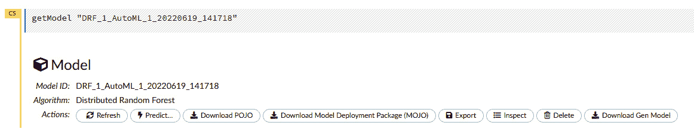

<title>Chapter 10: Working with Plain Old Java Objects (POJOs)</title>

# 10

# 使用普通旧 Java 对象(POJOs)

公司通常使用多种策略来提供符合预期标准的服务。在使用**机器学习** ( **ML** )的服务的情况下，他们需要考虑如何在不影响他们正在进行的服务的情况下，在生产中快速、轻松地构建、提取和部署他们的模型。

因此，训练模型的可移植性非常重要。您如何将通过某种技术构建的培训管道创建的模型对象用于您的预测管道，而预测管道可能是使用不同的技术构建的？理想情况下，模型对象应该是一个自包含且易于分发的对象。

在软件工程领域，众所周知，Java 编程语言是使用最广泛的平台无关编程语言之一。当 Java 编译程序时，它将程序转换成独立于平台的字节码，这些字节码可以被任何安装了 **Java 虚拟机** ( **JVM** )的机器解释。扩展这个特性，你就有了**普通的旧 Java 对象**(**POJO**)。

POJOs 是可以由任何 Java 程序运行的普通对象，与任何框架无关。这使得 POJOs 在部署到不同类型的机器时非常容易移植。H2O 还规定以 POJOs 的形式提取经过训练的模型，然后用于生产部署。

在这一章中，我们将深入理解 POJOs 是什么，以及在成功地用 Python、R 和 H2O 流训练了一个模型之后，如何下载它们。然后，我们将学习如何将 POJO 加载到一个简单的 Java 程序中进行预测。

在本章中，我们将讨论以下主题:

*   POJOs 简介
*   将 H2O 模型提取为 POJOs
*   使用 H2O 模型作为 POJO

本章结束时，您应该能够使用 Python、R 或 H2O 流提取 POJO 形式的训练模型，然后将这些 POJO 模型加载到您的 ML 程序中进行预测。

# 技术要求

对于本章，您将需要以下内容:

*   您首选的 web 浏览器的最新版本。
*   您选择的**集成开发环境** ( **IDE** )。
*   (可选)Jupyter 项目的 Jupyter 笔记本([https://jupyter.org/](https://jupyter.org/))

本章中进行的所有实验都是在 Jupyter 笔记本上进行的，以便为您提供更好的可视化输出示例。您可以自由地使用相同的设置，或者在特定于您正在使用的语言的环境中执行相同的实验。本章的所有代码示例都可以在 GitHub 上找到，网址是[https://GitHub . com/packt publishing/Practical-Automated-Machine-Learning-on-H2O/tree/main/Chapter % 2010](https://github.com/PacktPublishing/Practical-Automated-Machine-Learning-on-H2O/tree/main/Chapter%2010)。

# POJO 简介

POJO 是马丁·福勒、丽贝卡·帕森斯和乔希·麦肯齐在 2000 年 9 月创造的一个术语。它是一个普通的 Java 对象，但是让它变得普通的不是它应该做什么，而是它不应该做什么。

在下列情况下，Java 对象可以是 POJO:

*   Java 对象不从任何类扩展。
*   Java 对象不实现任何接口。
*   Java 对象不使用任何外部注释。

这三个限制导致的结果是，Java 对象不依赖于自身之外的任何其他库或对象，并且是自包含的，足以独立执行其逻辑。由于 POJOs 的可移植性，您可以很容易地将它们嵌入到任何 Java 环境中，并且由于 Java 的平台独立性，它们可以在任何机器上运行。

H2O 可以以 POJOs 的形式出口训练有素的模型。然后可以部署这些 POJO 模型，并用于对入站数据进行预测。使用 POJO 模型的惟一依赖是`h2o-genmodel.jar`文件。这是一个编译和运行 H2O 模型 POJOs 所需的 JAR 文件。这个 JAR 文件是一个包含基类和`GenModel`的库，后者是一个支持 Java 生成的模型的助手类，模型 POJOs 就是从这个类派生出来的。这个库还负责通过使用 POJOs 模型来支持评分。

当在生产中使用模型 POJO 时，您将需要 `h2o-genmodel.jar`文件来编译、部署和运行您的模型 POJO。POJOs 是简单的 Java 代码，不依赖于任何特定版本的 H2O。但是，仍然建议使用最新版本的`h2o-genmodel.jar`，因为它可以加载 POJO 的当前版本以及旧版本。你可以在[https://docs . H2O . ai/H2O/latest-stable/H2O-gen model/javadoc/index . XHTML](https://docs.h2o.ai/h2o/latest-stable/h2o-genmodel/javadoc/index.xhtml)找到关于`h2o-genmodel.jar`的详细文档。

现在我们已经知道了 POJO 是什么以及 H2O 模型 POJO 是如何工作的，让我们通过使用简单的例子来学习如何使用 AutoML 作为 POJO 提取经过训练的 H2O 模型。

# 提取 H2O 模型作为 POJOs

使用 H2O AutoML 训练的模型也可以被提取为 POJOs，这样它们就可以被部署到你的生产系统中。

在下面的小节中，我们将学习如何使用 Python 和 R 编程语言提取模型 POJO，以及如何使用 H2O 流提取模型 POJO。

## 用 Python 下载 H2O 模型作为 POJOs

让我们看看如何使用 Python 中的一个简单例子将 H2O 模型提取为 POJOs。我们将使用到目前为止一直使用的相同的 Iris flower 数据集。这个数据集可以在 https://archive.ics.uci.edu/ml/datasets/iris 找到。

按照以下步骤使用 Python 中的 H2O AutoML 训练模型。完成此操作后，您将提取领导者模型并将其下载为 POJO:

1.  导入`h2o`模块，启动你的 H2O 服务器:

    ```
    import h2o h2o.init()
    ```

2.  通过传递数据集在系统中的位置来导入数据集。执行以下命令:

    ```
    data_frame = h2o.import_file("Dataset/iris.data")
    ```

3.  通过执行以下命令设置特征和标签名称:

    ```
    features = data_frame.columns label = "C5" features.remove(label)
    ```

4.  通过执行以下命令，初始化H2OAutoML 对象，并将`max_model`参数设置为`10`并将`seed`值设置为`5`
5.  通过将定型数据集、特征列和标签列作为参数传递来触发 AutoML，如下所示:

    ```
    aml.train(x = features, y = label, training_frame = data_frame)
    ```

6.  培训结束后，H2O 汽车公司应该已经培训了一些车型，并根据排行榜上的默认排名性能指标对它们进行了排名。排行榜上排名最高的型号称为*领先者*，可以通过使用`aml.leader`命令直接访问。使用这个引用，您可以通过运行以下命令将 leader 模型下载为 POJO:

    ```
    h2o.download_pojo(aml.leader, path="~/Downloads/", jar_name="AutoMLModel")
    ```

这应该将一个名为`AutoMLModel`的模型 POJO 下载到`path`参数中指定的路径，如`jar_name`参数中所指定的。如果没有设置`path`参数，那么 H2O 将在控制台上打印模型 POJO 的详细信息，而不是下载为 JAR 文件。

您还可以通过在任何编辑器中打开文件来查看 POJO 的内容。该文件将包含一个以 leader 模型命名的公共类，并扩展了`GenModel`类，后者是`h2o-genmodel.jar`的一部分。

既然我们知道了如何使用 Python 提取 POJO 模型，让我们看看 R programmi ng 语言中类似的例子。

## 在 R 中下载 H2O 模型作为 POJOs

类似于我们如何用 Python 从 AutoML 排行榜中提取模型，我们可以用 R 编程语言做同样的事情。在这一节中，我们将使用相同的 Iris flower 数据集。按照以下步骤使用 H2O AutoML 训练模型，然后提取 leader 模型并将其下载为 POJO:

1.  导入`h2o`模块并启动您的 H2O 服务器:

    ```
    library(h2o) h2o.init()
    ```

2.  通过传递数据集在系统中的位置来导入数据集。执行以下命令:

    ```
    data_frame <- h2o.importFile("Dataset/iris.data")
    ```

3.  通过执行以下命令设置特征和标签名称:

    ```
    label <- "C5" features <- setdiff(names(data), label)
    ```

4.  通过将定型数据集、要素列和标签列作为参数传递来触发 AutoML。同样，将`max_models`设置为`10`并将`seed`值设置为`5` :

    ```
    aml <- h2o.automl(x = features, y = label, training_frame = data_frame, max_models=10, seed = 5)
    ```

5.  一旦培训结束，你有了排行榜，你就可以使用`aml@leaderboard`进入领导者模式。我们还可以通过执行以下命令将 leader 模型下载为 POJO:

    ```
    h2o.download_pojo(aml@leaderboard, path="~/Downloads/", jar_name="AutoMLModel")
    ```

这将使开始将`AutoMLModel`型号 POJO 下载到您设备的指定路径。

既然我们知道了如何在 R 编程语言中提取 POJO 模型，让我们看看如何在 H2O 流中做到这一点。

## 在 H2O 流程中将 H2O 模型下载为 POJOs

在 H2O 流中下载型号POJO非常容易。H2O 允许只需点击一个按钮就可以下载模型作为 POJOs。在 [*第二章*](B17298_02.xhtml#_idTextAnchor038) 、*使用 H2O 流程(H2O 的 Web UI)* 中，在*使用 H2O 流程中的模型训练功能*部分，您学习了如何访问特定模型的信息。

对于 H2O 流程中每个模型的信息输出，在**动作**子部分，有一个名为**下载 POJO** 的交互按钮，如下图所示:



图 10.1–使用下载 POJO 按钮收集模型信息

您可以简单地点击**下载 POJO** 按钮，将模型下载为 POJO。您可以使用 H2O 流中的这个交互按钮下载 H2O 训练过的所有模型。

既然我们已经探索了如何将模型下载为 Python、R 和 H2O 流中的 POJO，让我们学习如何使用这个 POJO 模型进行预测。

# 使用 H2O 模型作为 POJO

正如前面的小节中提到的，POJO 模型可以在任何安装了 JVM 的平台上使用。唯一的依赖项是`h2o-genmodel.jar`文件，这是一个 JAR 文件，需要编译和运行模型 POJO 来进行预测。

所以，让我们完成一个实验，在这个实验中，我们可以使用模型 POJO 和`h2o-genmodel.jar`文件来理解我们如何在任何有 JVM 的环境中使用模型 POJO。我们将编写一个 Java 程序，导入`h2o-genmodel.jar`文件，并使用它将 POJO 模型加载到程序中。一旦加载了 POJO 模型，我们将使用它对样本数据进行预测。

所以，让我们首先创建一个文件夹，我们可以保存实验所需的 H2O POJO 文件，然后编写一些使用它的代码。请遵循以下步骤:

1.  打开您的终端，通过执行以下命令创建一个空文件夹:

    ```
    mkdir H2O_POJO cd H2O_POJO
    ```

2.  现在，通过执行下面的命令将您的模型 POJO 文件复制到这个文件夹:

    ```
    mv {path_to_download_location}/{name_of_model_POJO} .
    ```

请记住，您可能需要提到您下载的模型的名称，以及您下载模型 POJO 文件的路径。

1.  然后，你需要下载`h2o-genmodel.jar`文件。有两种方法可以做到这一点:

    ```
    curl http://localhost:54321/3/h2o-genmodel.jar > h2o-genmodel.jar
    ```

    1.  您可以通过运行以下命令从您当前运行的本地 H2O 服务器上下载`h2o-genmodel.jar`文件:

请记住，在`localhost:54321`上，您需要一个活跃运行的 H2O 服务器。如果您的服务器运行在不同的端口上，则使用适当的端口号编辑该命令。

1.  `h2o-genmodel.jar`文件也可以作为`pom.xml`文件在其`dependencies`标签中使用，最好是最新版本:

```
<dependency>
<dependency>
        <groupId>ai.h2o</groupId>
        <artifactId>h2o-genmodel</artifactId>
        <version>3.35.0.2</version>
</dependency>

```

这方面的 Maven 知识库可以在这里找到:https://mvnrepository.com/artifact/ai.h2o/h2o-genmodel.

1.  现在，让我们创建一个样本 Java 程序，它使用模型 POJO 和`h2o-genmodel.jar`文件来预测随机数据值。通过在您的终端中执行以下命令创建一个名为`main.java`的 Java 程序:

    ```
    vim main.java
    ```

这将打开`vim`编辑器，您可以在其中编写程序。

1.  让我们开始编写我们的 Java 程序:

    ```
    import hex.genmodel.easy.RowData; import hex.genmodel.easy.EasyPredictModelWrapper; import hex.genmodel.easy.prediction.*;
    ```

    ```
    public class main { }
    ```

    ```
    private static final String modelPOJOClassName = "{name_of_model_POJO}";
    ```

    ```
    public static void main(String[] args) throws Exception { }
    ```

    ```
    hex.genmodel.GenModel rawModel; rawModel = (hex.genmodel.GenModel) Class.forName(modelPOJOClassName).getDeclaredConstructor().newInstance();
    ```

    ```
    EasyPredictModelWrapper model = new EasyPredictModelWrapper(rawModel);
    ```

    ```
    RowData row = new RowData(); row.put("C1", 5.1); row.put("C2", 3.5); row.put("C3", 1.4); row.put("C4", 0.2);
    ```

    ```
    MultinomialModelPrediction predictionResultHandler = model.predictMultinomial(row);
    ```

    1.  首先，导入必要的依赖项，如下所示:
    1.  然后，创建`main`类，如下所示:
    1.  在`main`类中，声明我们的模型 POJO 的类名，如下所示:
    1.  然后，在`main`类中创建一个`main`函数，如下所示:
    1.  在这个`main`函数中，将`rawModel`变量声明为一个`GenModel`对象，并通过传递`modelPOJOClassName`将其创建为模型 POJO 的一个实例来初始化它，如下所示:
    1.  现在，让我们用一个`EasyPredictModelWrapper`类包装这个`rawModel`对象。这个类带有易于使用的函数，使我们可以很容易地进行预测。将以下代码添加到您的文件中:
    1.  现在我们已经将`modelPOJO`对象加载并包装在`EasyPredictModelWrapper`中，让我们创建一些样本数据来进行预测。由于我们使用的是使用 Iris 数据集训练的模型，所以让我们创建一个包含`C1`、`C2`、`C3`和`C4`作为特征和一些适当值的`RowData`。将以下代码添加到您的文件中:
    1.  现在，我们需要创建一个预测处理程序对象来存储预测结果。由于 Iris 数据集用于多项式分类问题，我们将创建一个适当的多项式预测处理程序对象，如下所示:

对于不同类型的问题，您将需要使用适当类型的预测处理程序对象。你可以在 https://docs . H2O . ai/H2O/latest-stable/H2O-gen model/javadoc/index . XHTML 找到更多关于这个的信息。

1.  现在，让我们添加一些`print`语句，这样我们就可以得到一个清晰易懂的输出。添加以下`print`语句:

```
System.out.println("Predicted Class of Iris flower is: " + predictionResultHandler.label);
```

`predictionResultHandler.label`将包含预测的标签值。

1.  让我们也打印出不同的类概率，以便我们知道标签被预测的概率:

```
System.out.println("Class probabilities are: ");
for (int labelClassIndex = 0; labelClassIndex < predictionResultHandler.classProbabilities.length; labelClassIndex++) {
        System.out.println(predictionResultHandler.classProbabilities[labelClassIndex]);
}
```

1.  最后，作为最重要的一步，确保所有的大括号都正确闭合，并保存文件。

1.  一旦你的文件准备好了，只需执行下面的命令来编译文件:

    ```
    javac -cp h2o-genmodel.jar -J-Xmx2g -J-XX:MaxPermSize=128m DRF_1_AutoML_1_20220619_210236.java main.java
    ```

2.  编译成功后，通过在终端中运行以下命令来执行编译后的文件:

    ```
    java -cp .:h2o-genmodel.jar main
    ```

你应该得到如下输出:


图 10.2–H2O 模型 POJO 实施的预测结果

正如您所看到的，使用 POJO 模型非常容易——您只需要创建 POJO，并通过实现`h2o-genmodel.jar`文件在任何常规的 Java 程序中使用它。

小费

如果您计划在生产中使用模型 POJOs，那么强烈建议您详细了解`h2o-genmodel.jar`库。这个库可以为您提供许多特性和功能，使您的部署体验变得简单。你可以在这里了解这个库的更多信息:[https://docs . H2O . ai/H2O/latest-stable/H2O-gen model/javadoc/index . XHTML](https://docs.h2o.ai/h2o/latest-stable/h2o-genmodel/javadoc/index.xhtml)。

恭喜你！本章帮助您理解了如何构建、提取和部署模型 POJO来对入站数据进行预测。你现在离在生产中使用 H2O 更近了一步。

# 总结

在这一章中，我们从理解在生产中使用 ML 服务时的常见问题开始。我们知道软件的可移植性以及 ML 模型在无缝部署中扮演着重要的角色。我们还理解了 Java 的平台独立性如何使其有利于部署，以及 POJOs 如何在其中发挥作用。

然后，我们探索了什么是 POJOs，以及它们是如何在 Java 领域中独立运行的对象。我们还了解到，H2O 规定以 POJOs 的形式提取由 AutoML 训练的模型，我们可以将其用作能够进行预测的自包含 ML 模型。

在此基础上，我们学习了如何在 Python、R 和 H2O 流中将 H2O 的 ML 模型提取为 POJOs。一旦我们理解了如何下载 H2O ML 模型作为 POJOs，我们就学会了如何使用它们进行预测。

首先，我们知道我们需要`h2o-genmodel.jar`库，它负责解释 Java 中的 POJO 模型。然后，我们创建了一个实验，我们下载了 H2O 模型 POJO 和`h2o-genmodel.jar`，并创建了一个简单的 Java 程序，使用这两个文件对一些样本数据进行预测；这给了我们一些使用 POJOs 模型的实际经验。

在下一章，我们将探索 MOJOs，类似于 POJOs 的对象，但是有一些特殊的好处，也可以用在生产中。