# 十三、使用 H2O AutoML 和其他技术

在前几章中，我们一直在探索如何在生产中使用 H2O 自动化。我们看到了如何使用 H2O 模型作为 POJOs 和 MOJOs 作为可以进行预测的可移植对象。然而，在实际的生产环境中，您经常会使用多种技术来满足各种技术需求。这些技术的协作在系统的无缝功能中扮演着重要的角色。

因此，了解我们如何将 H2O 模型与 ML 领域中其他常用的技术结合使用是很重要的。在这一章中，我们将探索和实现一些 H2O 技术，并看看我们如何构建可以协同工作以提供协作优势的系统。

首先，我们将研究如何使用 **Spring Boot** 应用将 H2O 预测服务托管为 web 服务。然后，我们将探索如何使用 H2O 和**阿帕奇风暴**进行实时预测。

在本章中，我们将讨论以下主题:

*   使用 H2O 自动化和 Spring Boot
*   使用 H2O AutoML 和 Apache Storm

学完本章后，你应该能更好地理解如何使用 H2O 自动化使用不同技术训练的模型在不同的情况下进行预测。

# 技术要求

对于本章，您将需要以下内容:

*   您首选的 web 浏览器的最新版本。
*   您选择的一个**集成开发环境** ( **IDE** )。
*   本章中进行的所有实验都是在 Ubuntu Linux 系统上使用 IntelliJ IDE 进行的。您可以自由地使用相同的设置，或者使用您熟悉的 ide 和操作系统来执行相同的实验。

本章的所有代码示例都可以在 GitHub 上找到，网址为[https://GitHub . com/packt publishing/Practical-Automated-Machine-Learning-on-H2O/tree/main/Chapter % 2013](https://github.com/PacktPublishing/Practical-Automated-Machine-Learning-on-H2O/tree/main/Chapter%2013)。

让我们直接进入第一部分，在这里我们将学习如何在使用 Spring Boot 创建的 web 应用上托管使用 H2O AutoML 训练的模型。

# 使用 H2O 自动化和 Spring Boot

在当今时代，大多数软件服务都是托管在互联网上的，所有互联网用户都可以访问它们。所有这些都是使用托管在 web 服务器上的 web 应用来完成的。即使是使用 ML 的预测服务，也可以通过将其托管在 web 应用上向公众开放。

Spring 框架是创建网站和网络应用最常用的开源网络应用框架之一。它基于 Java 平台，因此可以在任何有 JVM 的系统上运行。 **Spring Boot** 是 Spring 框架的一个扩展，它为你的 web 应用提供了开箱即用的预配置设置。这有助于您快速设置 web 应用，而无需实现配置和托管 web 服务所需的底层管道。

因此，让我们通过理解问题陈述来深入研究实现。

## 理解问题陈述

让我们假设你在一家葡萄酒制造公司工作。官员们有一个要求，他们希望自动计算葡萄酒的质量和颜色。该服务应该以 web 服务的形式提供，质量保证主管可以提供一些关于葡萄酒属性的信息，该服务使用这些细节和底层的 ML 模型来预测葡萄酒的质量和颜色。

所以，从技术上来说，我们需要两个模型来做完整的预测。一个是预测葡萄酒质量的回归模型，另一个是预测葡萄酒颜色的分类模型。

我们可以使用红葡萄酒质量和白葡萄酒质量数据集的组合，并在其上运行 H2O AutoML 来训练模型。你可以在 https://archive.ics.uci.edu/ml/datasets/Wine+Quality.找到数据集，合并后的数据集已经存在于[https://github . com/packt publishing/Practical-Automated-Machine-Learning-on-H2O/tree/main/Chapter % 2013/H2O _ spring _ boot/H2O _ spring _ boot](https://github.com/PacktPublishing/Practical-Automated-Machine-Learning-on-H2O/tree/main/Chapter%2013/h2o_spring_boot/h2o_spring_boot)。

以下屏幕截图显示了数据集的一个示例:

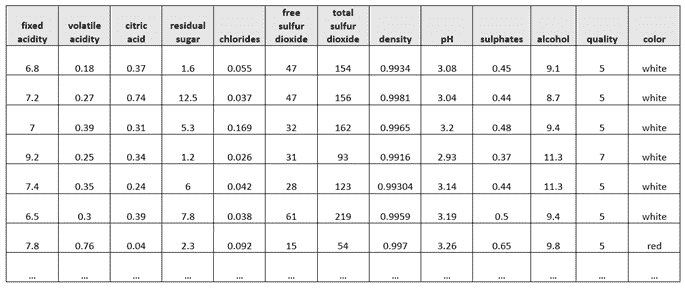

图 13.1-葡萄酒质量和颜色数据集

该数据集由以下要素组成:

*   **固定酸度**:这种特性解释了不挥发的酸度，这意味着它不会在一定时间内蒸发。
*   **挥发性酸度**:这个特性解释了挥发性酸度的数量，这意味着它将在一段时间内蒸发。
*   **柠檬酸**:这个特征解释了葡萄酒中柠檬酸的含量。
*   **残糖**:这个特征解释了葡萄酒中存在的残糖量。
*   **氯化物**:这个特征解释了葡萄酒中存在的氯化物数量。
*   **游离二氧化硫**:这个特征解释了葡萄酒中游离二氧化硫的含量。
*   **总二氧化硫**:这个特征解释了葡萄酒中总二氧化硫的含量。
*   **密度**:这个特征解释了酒的密度。
*   **pH** :此特征说明了葡萄酒的 pH 值，0 为酸性最强，14 为碱性最强。
*   **硫酸盐**:这个特征解释了葡萄酒中硫酸盐的数量。
*   **酒精**:这个特性解释了葡萄酒中的酒精含量。
*   **质量**:这是响应栏，记录了葡萄酒的质量。0 表示酒很差，10 表示酒很好。
*   **颜色**:这个特征代表了葡萄酒的颜色。

既然我们已经理解了问题陈述和我们将使用的数据集，那么让我们设计一个架构来展示这个 web 服务将如何工作。

## 设计架构

在我们深入研究服务的实现之前，让我们看看所有技术应该如何协同工作的整体架构。以下是葡萄酒质量和颜色预测 web 服务的架构图:

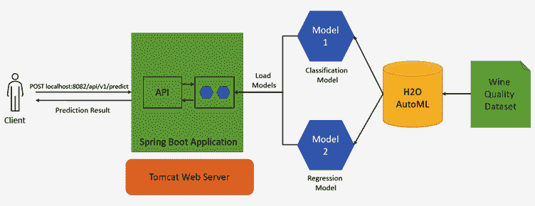

图 13.2-葡萄酒质量和颜色预测网络服务的架构

让我们了解一下该架构的各种组件:

*   **客户**:这是将要使用这个应用的人——或者在这个例子中，是葡萄酒质量保证主管。客户端通过向 web 应用发出 POST 请求，传递葡萄酒的属性，并获得葡萄酒的质量和颜色作为预测响应，从而与 web 应用进行通信。
*   **Spring Boot 应用**:这是运行在 web 服务器上的 web 应用，负责执行计算过程。在我们的场景中，这个应用将接受来自客户端的 POST 请求，将数据提供给模型，获取预测结果，并将结果作为响应发送回客户端。
*   Tomcat Web server:Web server 就是处理互联网上 HTTP 通信的软件和硬件。对于我们的场景，我们将使用 Apache Tomcat web 服务器。Apache Tomcat 是一个用 Java 编写的免费开源 HTTP web 服务器。web 服务器负责将客户端请求转发给 web 应用。
*   `h2o-genmodel`库做出预测。
*   **H2O 服务器**:模式 ls 将使用 H2O 服务器进行训练。正如我们在 [*第 1 章*](B17298_01.xhtml#_idTextAnchor017) 、*了解 H2O AutoML 基础知识*中看到的，我们可以在 H2O 服务器上运行 H2O AutoML。我们将为我们的场景做同样的事情，启动一个 H2O 服务器，使用 H2O AutoML 训练模型，然后将训练好的模型下载为 POJOs，这样我们就可以将它们加载到 Spring Boot 应用中。
*   **数据集**:这是我们用来训练模型的葡萄酒质量数据集。如前所述，这个数据集是红葡萄酒质量和白葡萄酒质量数据集的组合。

现在我们已经很好地理解了如何创建我们的葡萄酒质量和颜色预测 web 服务，让我们继续它的实现。

## 正在实现

这项服务已经建成，可以在 GitHub 上获得。代码库可以在[https://github . com/packt publishing/Practical-Automated-Machine-Learning-on-H2O/tree/main/Chapter % 2013/H2O _ spring _ boot](https://github.com/PacktPublishing/Practical-Automated-Machine-Learning-on-H2O/tree/main/Chapter%2013/h2o_spring_boot)找到。

在我们深入研究代码之前，请确保您的系统满足以下最低要求:

*   Java 版本 8 及以上
*   Maven 的最新版本，最好是 3.8.6 版本
*   Python 版本 3.7 及以上
*   使用 pip3 安装的 H2O Python 库
*   Git 安装在您的系统上

首先，我们将克隆 GitHub 存储库，在我们首选的 IDE 中打开它，并浏览文件以了解整个过程。以下步骤已经在 *Ubuntu 22.04 LTS* 上执行，我们正在使用 **IntelliJ IDEA** *版本 2022.1.4* 作为 IDE。为了获得更好的支持，您可以随意使用任何支持 Maven 和 Spring 框架的 IDE。

因此，克隆GitHub 库并导航到`Chapter 13/h2o_spring_boot/`。然后，启动 IDE 并打开项目。打开项目后，您应该会看到类似于以下内容的目录结构:

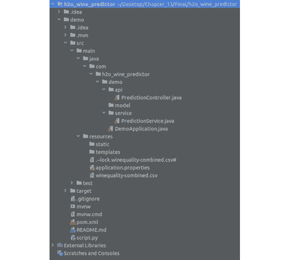

图 13.3–H2O _ wine _ predictor 的目录结构

目录结构由以下重要文件组成:

*   `pom.xml`:一个**项目对象模型** ( **POM** )是 Maven 构建自动化工具的基本单元。它是一个 XML 文件，包含所有需要的依赖项的所有信息，以及正确构建应用所需的配置。
*   `script.py`:这是我们将用来在葡萄酒质量数据集上训练我们的模型的 Python 脚本。该脚本启动一个 H2O 服务器实例，导入数据集，然后运行 AutoML 来训练模型。我们将在后面更详细地研究它。
*   `src/main/java/com.h2o_wine_predictor.demo/api/PredictionController.java`:这是具有请求映射的控制器文件，用于指导 POST 请求执行映射的函数。该函数最终调用实际的业务逻辑，其中使用 ML 模型进行预测，并发回响应。
*   `src/main/java/com.h2o_wine_predictor.demo/service/PredictionService.java`:这是进行预测的业务逻辑所在的实际文件。该函数导入 POJO 模型和 h2o-genmodel 库，并使用它们来预测从控制器接收的数据。
*   `src/main/java/com.h2o_wine_predictor.demo/Demo`:这是 Spring Boot 应用的主要功能。如果您想要启动 Spring Boot 应用，您必须执行这个 main 函数，它将启动托管 web 应用的 Apache Tomcat 服务器。
*   `src/main/resources/winequality-combined.csv`:这是存储实际 CSV 数据集的位置。训练 H2O 模型的 Python 脚本从该路径选取数据集，并开始训练模型。

您可能已经注意到，我们在目录中的任何地方都没有模型 POJO 文件。所以，让我们来建造它们。参考`script.py` Python 文件，让我们一行一行地了解正在做什么。

`script.py`的代码如下:

1.  脚本从导入依赖项开始:

    ```
    import h2o import shutil from h2o.automl import H2OautoML
    ```

2.  导入完成后，脚本初始化 H2O 服务器:

    ```
    h2o.init()
    ```

3.  一旦 H2O 服务器启动并运行，脚本将从`src/main/resources`目录中导入数据集:

    ```
    wine_quality_dataframe = h2o.import_file(path = "sec/main/resources/winequality_combined.csv")
    ```

4.  因为列颜色是分类的，所以脚本将其设置为`factor` :

    ```
    wine_quality_dataframe["color"] = wine_quality_dataframe["color"].asfactor()
    ```

5.  最后，您将需要一个训练和验证数据框架来在训练期间训练和验证您的模型。因此，脚本也将数据帧分割成 70/30 的比例:

    ```
    train, valid = wine_quality_dataframe.split_frame(ratios=[.7])
    ```

6.  现在数据帧已经准备好了，我们可以开始训练第一个模型的训练过程，这是对葡萄酒颜色进行分类的分类模型。所以，脚本设置了标签和特性，如下:

    ```
    label = "color" features = ["fixed acidity", "volatile acidity", "citric acid", "residual sugar", "chlorides", "free sulfur dioxide", "total sulfur dioxide", "density", "pH", "sulphates", "alcohol"]
    ```

7.  既然训练数据已经准备好了，我们就可以创建 H2O AutoML 对象并开始模型训练了。下面的脚本可以做到这一点:

    ```
    aml_for_color_predictor = H2OAutoML(max_models=10, seed=123, exclude_algos=["StackedEnsemble"], max_runtime_secs=300) aml_for_color_predictor.train(x = features, y = label, training_frame=train, validation_frame = valid)
    ```

当初始化`H2OautoML`对象时，我们用`StackedEnsemble`值设置`exclude_algos`参数。这是因为 POJO 不支持堆叠集合模型，正如我们在 [*第 10 章*](B17298_10.xhtml#_idTextAnchor196) 、*使用普通旧 Java 对象(POJO)*中所了解的。

这将启动 AutoML 模型训练过程。一些`print`语句会帮助你观察模型训练过程的进度和结果。

1.  一旦模型训练过程完成，脚本将检索领导者模型，并将其下载为具有正确名称的 POJO，即`WineColorPredictor`，并将其放在`tmp`目录:

    ```
    model = aml_for_color_predictor.leader model.model_id = "WineColorPredictor" print(model) model.download_pojo(path="tmp")
    ```

2.  接下来，该脚本将对下一个模型(即回归模型)进行同样的操作，以预测葡萄酒的质量。它稍微调整了一下标签，并将其设置为`quality`。其余步骤相同:

    ```
    label="quality" aml_for_quality_predictor = H2OAutoML(max_models=10, seed=123, exclude_algos=["StackedEnsemble"], max_runtime_secs=300) aml_for_quality_predictor.train(x = features, y = label, training_frame=train, validation_frame = valid)
    ```

3.  一旦训练完成，脚本将提取领导者模型，将其命名为`WineQualityPredictor`，并将其作为 POJO 下载到`tmp`目录中:

    ```
    model = aml_for_color_predictor.leader model.model_id = "WineQualityPredictor" print(model) model.download_pojo(path="tmp")
    ```

4.  现在我们已经下载了两个模型 POJOs，我们需要将它们移动到`src/main/java/com.h2o_wine_predictor.demo/model/`目录。但是在我们这样做之前，我们还需要将 POJOs 添加到`com.h2o.wine_predictor.demo`包中，以便`PredictionService.java`文件可以导入模型。因此，该脚本通过创建一个新文件，向该文件添加包包含指令行，附加原始 POJO 文件的剩余部分，并将该文件保存在`src/main/java/com.h2o_wine_predictor.demo/model/`目录:

    ```
    with open("tmp/WineColorPredictor.java", "r") as raw_model_POJO:      with open("src/main/java/com.h2o_wine_predictor.demo/model/ WineColorPredictor.java", "w") as model_POJO:            model_POJO.write(f'package com.h2o_wine_predictor.demo;\n' + raw_model_POJO.read())
    ```

    中来实现这一点
5.  对于`WineQualityPredictor`型号:

    ```
    with open("tmp/WineQualityPredictor.java", "r") as raw_model_POJO:      with open("src/main/java/com.h2o_wine_predictor.demo/model/ WineQualityPredictor.java", "w") as model_POJO:            model_POJO.write(f'package com.h2o_wine_predictor.demo;\n' + raw_model_POJO.read())
    ```

    也是如此
6.  最后，它删除了`tmp`目录来清理一切:

    ```
    shutil.rmtree("tmp")
    ```

因此，让我们运行这个脚本并生成我们的模型。您可以通过在终端中执行以下命令来实现这一点:

```
python3 script.py
```

这将在`src/main/java/com.h2o_wine_predictor.demo/model/`目录中生成各自的模型 POJO 文件。

现在，我们来观察一下`src/main/java/com.h2o_wine_predictor.demo/service`目录中的`PredictionService`文件。

`PredictionService`文件中的`PredictionService`类具有以下属性:

*   `wineColorPredictorModel`:这是`EasyPredictModelWrapper`类型的属性。它是 h2o-genmodel 库中的一个类，由`PredictionService`文件导入。我们使用这个属性来加载我们刚刚使用`script.py`生成的`WineColorPredictor`模型。稍后，我们将使用该属性对传入的请求进行预测。
*   `wineQualityPredictorModel`:类似于`wineColorPredictorModel`，这是使用相同`EasyPredictModelWrapper`的酒质等价属性。该属性将用于加载`WineQualityPredictor`模型，并使用它来预测葡萄酒的质量。

现在我们已经了解了这个文件的属性，让我们来看看这些方法，如下所示:

*   `createJsonResponse()`:这个函数非常简单，它从`WineColorPredictor`模型中获取二项式分类预测结果，从`WineQualityPredictor`模型中获取回归预测结果，并将它们组合成一个 JSON 响应，由 web 应用发送回客户端。
*   `predictColor()`:这个函数使用`PredictionService`类的`wineColorPredictorModel`属性对数据进行预测。它将葡萄酒颜色的预测结果作为一个`BinomialModelPrediction`对象输出，这个对象是 h2o-genmodel 库的一部分。
*   `predictQuality()`:这个函数使用`PredictionService`类的`wineQualityPredictorModel`属性对数据进行预测。它将葡萄酒质量的预测结果作为一个`RegressionModelPrediction`对象输出，该对象是 h2o-genmodel 库的一部分。
*   `fillRowDataFromHttpRequest()`:该函数负责将从 POST 请求中接收到的特征值转换成一个`RowData`对象，该对象将被传递给`wineQualityPredictorModel`和`wineColorPredictorModel`进行预测。`RowData`是 h2o-genmodel 库中的一个对象。
*   `getPrediction()`:这是由`PredictionController`调用的，它将特征值作为一个映射来传递，以便进行预测。该函数在内部调用前面提到的所有函数，并协调整个预测过程:

1.  它从 POST 请求中获取特征值作为输入。它将这些值以`Map`对象的形式传递给`fillRowDataFromHttpRequest()`，后者将它们转换成`RowData`类型。
2.  然后，它将这个`RowData`传递给`predictColor()`和`predictQuality()`函数，以获得预测值。
3.  之后，它将这些结果传递给`createJsonResponse()`函数，以使用预测值创建适当的 JSON 响应，并将 JSON 返回给`PredictionController`，在那里控制器将其返回给客户端。

既然我们已经有机会了解了整个项目的重要部分，那么让我们继续运行应用，这样我们就可以让 web 服务在我们的机器上本地运行。然后，我们将使用葡萄酒质量特征值运行一个简单的`cURL`命令，看看我们是否得到预测作为响应。

要启动该应用，您可以执行以下操作:

*   如果您使用的是 IntelliJ IDE，那么您可以直接单击 IDE 右上角的绿色播放按钮。
*   或者，您可以通过在项目目录中执行下面的命令直接从命令行运行它，该目录中的`pom.xml`文件是:

    ```
    mvn spring-boot:run -e
    ```

如果一切正常，那么您应该会得到类似如下的输出:

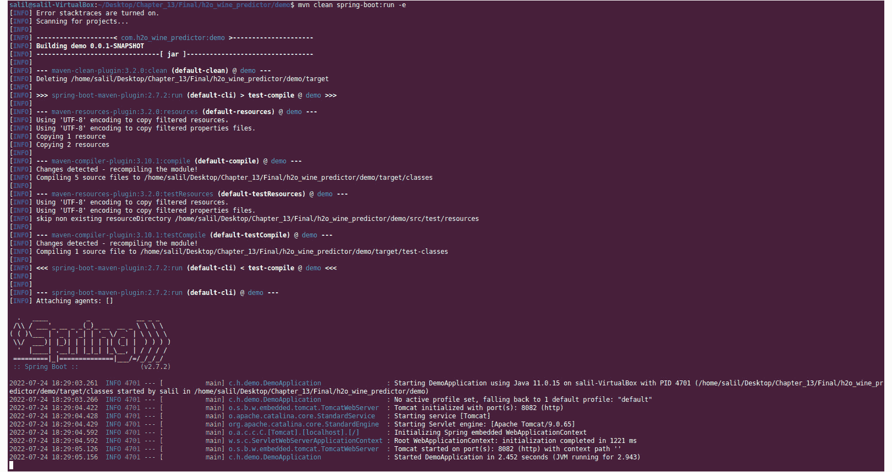

图 13.4-成功的 Spring Boot 应用运行输出

既然Spring Boot 应用正在运行，剩下的唯一事情就是通过对运行在`localhost:8082`上的 web 服务发出 POST 请求来测试它。

打开另一个终端，执行下面的`curl`命令，提出预测请求:

```
curl -X POST localhost:8082/api/v1/predict -H "Content-Type: application/json" -d '{"fixed acidity":6.8,"volatile acidity":0.18,"citric acid":0.37,"residual sugar":1.6,"chlorides":0.055,"free sulfur dioxide":47,"total sulfur dioxide":154,"density":0.9934,"pH":3.08," ,"sulphates":0.45,"alcohol":9.1}'
```

请求应该发送到 web 应用，在那里应用将提取特征值，将它们转换成`RowData`对象类型，将`RowData`传递给预测函数，获取预测结果，将预测结果转换成适当的`JSON`，并将`JSON`作为响应返回。这应该如下所示:


图 13.5-Spring Boot 网络应用的预测结果

从 JSON 响应中可以看到，预测的酒的颜色是`white`，质量是`5.32`。

恭喜你！您刚刚在一个 Spring Boot web 应用上实现了一个 ML 预测服务。您可以通过添加一个前端和一个按钮来进一步扩展这个服务，前端将特征值作为输入，按钮在被单击时创建所有这些值的 POST 主体并将 API 请求发送到后端。请随意试验这个项目，因为对于如何在 web 服务上使用 H2O 模型 POJOs，有很大的空间。

在下一节中，我们将学习如何使用 H2O AutoML 以及另一项名为 Apache Storm 的有趣技术进行实时预测。

# 使用 H2O AutoML 和 Apache Storm

**Apache Storm** 是一个开放的源数据分析和计算工具，用于实时处理大量流数据。在现实世界中，您经常会有大量的系统持续生成大量数据。您可能需要对这些数据进行一些计算或运行一些流程，以提取实时生成的有用信息。

## 什么是阿帕奇风暴？

让我们以一个非常频繁使用的 web 服务中的**日志系统**的为例。假设这个 web 服务每秒接收数百万个请求，它将生成大量日志。您已经有了一个将这些日志存储在数据库中的系统。现在，这些日志数据最终会堆积起来，您的数据库中将存储数 Pb 的日志数据。查询所有这些历史数据来一次性处理这些数据将会非常缓慢和耗时。

您可以做的是在数据生成时对其进行处理。这就是阿帕奇风暴发挥作用的地方。您可以配置 Apache Storm 应用来执行所需的处理，并引导日志数据通过它，然后将其存储在数据库中。这将简化处理过程，使之实时化。

Apache Storm 可以用于多个用例，比如实时分析、**在数据管道中提取-转换-加载** ( **ETL** )数据，甚至 ML。Apache Storm 之所以成为实时处理的首选解决方案，是因为它的速度非常快。Apache Foundation 进行的基准测试发现，Apache Storm 每个节点每秒可以处理大约一百万个元组。Apache Storm 还具有很强的可伸缩性和容错性，这保证了它将处理所有传入的实时数据。

因此，让我们深入研究 Apache Storm 的架构，了解它是如何工作的。

### 了解 Apache Storm 的架构

Apache Storm 使用集群计算，类似于 **Hadoop** 甚至 H2O 的工作方式。考虑以下 Apache Storm 的架构图:

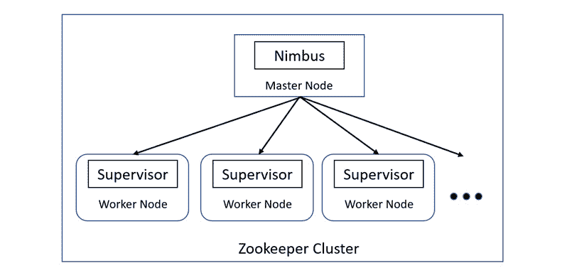

图 13.6-Apache Storm 的架构

Apache Storm 将集群中的节点分为两类——主节点和工作节点。这些节点的功能如下:

*   **主节点**:主节点运行一个名为**光轮**的特殊守护进程。Nimbus 守护进程负责在集群中的所有工作节点之间分发数据。它还会监控故障，并在检测到故障时将数据重新发送到其他节点，从而确保不会遗漏任何数据。
*   **Worker 节点**:Worker 节点运行一个名为 **Supervisor** 的守护进程。管理守护进程是一种服务，它持续监听工作，并根据计算的需要启动或停止底层进程。

使用各自守护进程的主节点和工作节点之间的通信是使用 **Zookeeper 集群**完成的。简而言之，Zookeeper 集群是一个集中式服务，为无状态组维护配置和同步服务。在这个场景中，主节点和工作节点是无状态和快速失败的服务。所有的状态细节都存储在 Zookeeper 集群中。这是有益的，因为保持节点无状态有助于容错，因为节点可以恢复生命，并且它们将开始工作，就像什么也没有发生一样。

小费

如果你有兴趣了解《动物园管理员》的各种概念和技术细节，那么你可以在 https://zookeeper.apache.org/自由探索。

在我们进入 Apache Storm 的实现部分之前，我们需要了解一些对理解 Apache Storm 如何工作很重要的概念。不同的概念如下:

*   **Tuples** : Apache Storm 使用一种叫做 Tuple 的数据模型作为它要处理的数据的主要单元。它是一个命名的值列表，可以是任何类型的对象。Apache Storm 支持所有现成的原始数据类型。但是它也可以支持自定义对象，这些对象可以反序列化为基本类型。
*   **流**:流是无界的元组序列。流表示数据从一个转换流向下一个转换的路径。Apache Storm 为完成这些转换提供的基本原语是喷口和螺栓:
    *   **喷口**:喷口是流的来源。它位于流的开始，从这里它从外部世界读取数据。它从外界获取这些数据，并将其发送给一个螺栓。
    *   **Bolt**:Bolt 是一个进程，它消耗来自单个或多个流的数据，对其进行转换或处理，然后输出结果。可以一个接一个地链接多个螺栓，同时将一个螺栓的输出作为输入提供给下一个螺栓，以执行复杂的处理。Bolts 可以运行函数、过滤数据、执行聚合，甚至将数据存储在数据库中。您可以在 bolt 上执行任何想要的功能。
*   **拓扑**:如何以**有向无环图** ( **DAG** )的形式使用流、喷流和螺栓实时处理数据的完整编排被称为**拓扑**。您需要使用 Apache Storm 的主要功能将这个拓扑提交给 Nimbus 守护进程。拓扑图包含节点和边，就像常规的图结构一样。每个节点包含处理逻辑，每个边缘显示数据如何在两个节点之间传输。Nimbus 和 topology 都是 Apache Thrift 结构，这是一种特殊的类型系统，允许程序员在任何编程语言中使用本地类型。

小费

你可以去 https://thrift.apache.org/docs/types 了解更多关于阿帕奇节俭的知识。

现在，您已经对什么是 Apache Storm 及其实现中涉及的各种概念有了更好的理解，我们可以继续本节的实现部分，从安装 Apache Storm 开始。

小费

阿帕奇风暴是一个非常强大和复杂的系统。除了机器学习之外，它还有很多应用，也有很多特性和支持。如果你想了解更多关于阿帕奇风暴的信息，去 https://storm.apache.org/。

### 安装 Apache Storm

让我们从记下安装 Apache Storm 的基本要求开始。它们如下:

*   高于 Java 8 的 Java 版本
*   Maven 的最新版本，最好是 3.8.6 版本

因此，请确保这些基本要求已经安装在您的系统上。现在，让我们从下载 Apache Storm repo 开始。你可以在 https://github.com/apache/storm 找到回购协议。

因此，执行以下命令将存储库克隆到您的系统中:

```
git clone https://github.com/apache/storm.git
```

下载完成后，您可以打开`storm`文件夹来一窥其内容。您会注意到有大量的文件，所以当您试图找出从哪里开始时，会感到不知所措。不要担心——我们将研究一些非常简单的例子，这些例子足以让你对 Apache Storm 的工作原理有一个基本的了解。然后，您可以从那里扩展开来，更好地理解 Apache Storm 提供了什么。

现在，打开您的终端并导航到克隆的 repo。在实现任何 Apache Storm 特性之前，您需要在本地构建 Apache Storm 本身。您需要这样做，因为本地构建 Apache Storm 会生成重要的 JAR 文件，这些文件会安装在您的`$HOME/.m2/repository`文件夹中。当您构建 Apache Storm 应用时，Maven 将在这个文件夹中获取 JAR 依赖项。

因此，通过在存储库的根目录下执行以下命令，在本地构建 Apache Storm:

```
mvn clean install -DskipTests=true
```

考虑到 Maven 将构建几个 JAR 文件，这些文件是应用的重要依赖项，构建可能需要一些时间。因此，当这发生时，让我们理解我们将要处理的问题陈述。

## 理解问题陈述

让我们假设你在一家医疗公司工作。医疗官员有一个要求，他们希望建立一个系统来预测患者在心力衰竭后是否可能出现任何并发症，或者他们是否可以安全出院。问题是，这种预测服务将被该国所有的医院使用，他们需要即时的预测结果，以便医生可以决定是让病人住院几天以监测他们的健康状况，还是决定让他们出院。

因此，机器学习的问题是，我们的系统将需要对数据流进行即时预测。我们可以建立一个 Apache Storm 应用，将所有数据传输到预测服务中，并部署使用 H2O AutoML 训练的模型 POJOs 来进行预测。

我们可以在心力衰竭临床数据集上训练模型，可以在[https://archive . ics . UCI . edu/ml/datasets/Heart+Failure+Clinical+records](https://archive.ics.uci.edu/ml/datasets/Heart+failure+clinical+records)找到。

下面的截图显示了数据集中的一些样本内容:

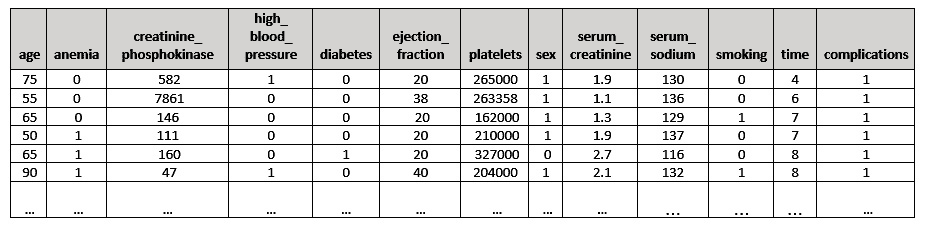

图 13.7–心力衰竭临床数据集

该数据集由以下特征组成:

*   **年龄**:该特征表示患者的年龄，以年为单位
*   `1`表示是，`0`表示否
*   `1`表示是，`0`表示否
*   **肌酸酐磷酸激酶**:该特征表示血液中 CPK 酶的水平，单位为**微克/升** ( **微克/升**)
*   `1`表示是，`0`表示否
*   **射血分数**:该特征表示每次收缩时离开心脏的血液百分比
*   **血小板**:该特征表示血液中的血小板，单位为千血小板每**毫升** ( **毫升**)
*   `1`表示患者是女性，而`0`表示患者是男性
*   **血清肌酐**:该特征表示血液中的血清肌酐水平，单位为**毫克/分升** ( **毫克/分升**
*   **血清钠**:该特征指示血液中的血清钠水平**毫当量每升** ( **mEq/L** )
*   `1`表示是，`0`表示否
*   **时间**:该功能表示跟踪天数
*   `1`表示是，`0`表示否

既然我们已经理解了问题陈述和我们将使用的数据集，让我们设计如何使用 Apache Storm 和 H2O AutoML 来解决这个问题的架构。

## 设计架构

让我们看看所有技术应该如何协同工作的整体架构。参考以下心力衰竭并发症预测服务的架构图:

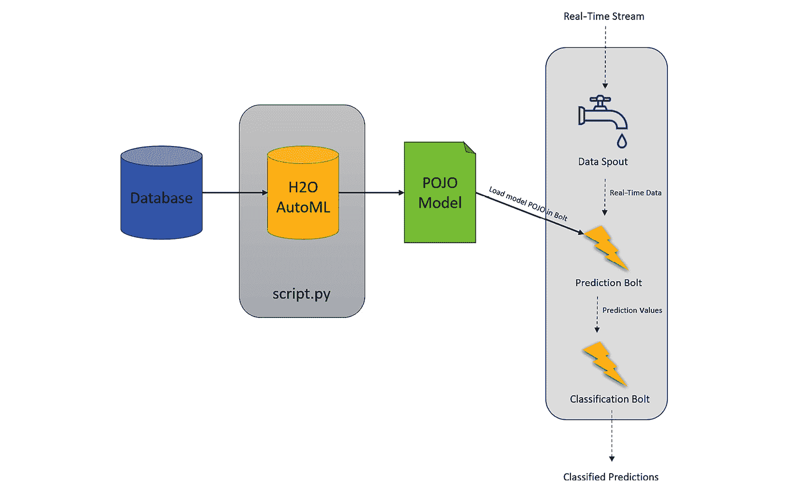

图 13.8-使用 H2O AutoML 和 Apache Storm 的架构图

让我们了解该架构的各种组件:

*   从架构的角度来看，解决方案非常简单。首先，我们使用 H2O AutoML 训练模型，这可以通过使用以下脚本轻松完成，该脚本导入数据集，设置标签和要素，然后运行 AutoML。然后可以将 leader 模型提取为 POJO，稍后我们可以在 Apache Storm 中使用它来进行预测。
*   **数据喷口**:我们将在 Apache Storm 中有一个喷口，不断读取数据，并实时将其传递给**预测螺栓**。
*   **预测 Bolt** :这个 Bolt 包含预测服务，它导入训练好的模型 POJO 并使用它进行预测。
*   **分类螺栓**:预测螺栓的结果传递给该螺栓。该螺栓根据预测螺栓的二元分类结果将结果分类为潜在并发症和无并发症。

既然我们已经设计了一个简单的好的解决方案，让我们继续它的实现。

## 正在实现

这项服务已经可以在 GitHub 上使用了。代码库可以在[https://github . com/packt publishing/Practical-Automated-Machine-Learning-on-H2O/tree/main/Chapter % 2013/H2O _ Apache _ storm/H2O _ storm](https://github.com/PacktPublishing/Practical-Automated-Machine-Learning-on-H2O/tree/main/Chapter%2013/h2o_apache_storm/h2o_storm)找到。

因此，下载回购并导航到`/Chapter 13/h2o_apache_storm/h2o_storm/`。

你会看到我们有两个文件夹。一个是`storm-starter`目录，另一个是`storm-streaming`目录。让我们先关注一下`storm-streaming`目录。启动您的 IDE 并打开`storm-streaming`项目。打开项目后，您应该会看到类似如下的目录结构:

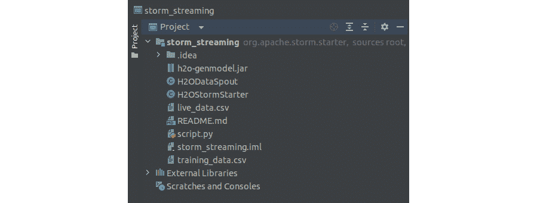

图 13.9–storm _ streaming 目录结构

该目录结构由以下重要文件组成:

*   `scripty.py`:这是我们将用于在心力衰竭并发症数据集上训练我们的模型的 Python 脚本。该脚本启动一个 H2O 服务器实例，导入数据集，然后运行 AutoML 来训练模型。我们将在后面更详细地讨论这个问题。
*   `H2ODataSpout.java`:这是包含 Apache Storm spout 及其功能的 Java 文件。它从`live_data.csv`文件中读取数据，并将单个观察结果一次一个地转发给螺栓，模拟实时数据流。
*   `H2OStormStarter.java`:这是一个 Java 文件，包含带有两个 Bolt 的 Apache Storm 拓扑——预测 Bolt 和分类 Bolt 类。我们将使用这个文件启动我们的 Apache Storm 服务。
*   `training_data.csv`:这是包含一部分心力衰竭并发症数据的数据集，我们将使用这些数据来训练我们的模型。
*   `live_data.csv`:这是包含心力衰竭并发症数据的数据集，我们将使用它来模拟数据实时流入我们的 Apache Storm 应用。

与之前的实验不同，在之前的实验中，我们在单独的应用存储库中进行了更改，而在这次实验中，我们将在 Apache Storm 的存储库中进行更改。

以下步骤已在 *Ubuntu 22.04 LTS* 上执行； *IntelliJ IDEA 版本 2022.1.4* 已被用作 IDE。为了获得更好的支持，您可以随意使用任何支持 Maven 框架的 IDE。

先来了解一下模型训练脚本，`script.py`。`script.py`的代码如下:

1.  首先，脚本导入依赖项:

    ```
    import h2o from h2o.automl import H2OautoML
    ```

2.  导入完成后，H2O 服务器初始化:

    ```
    h2o.init()
    ```

3.  一旦 H2O 服务器启动并运行，脚本就会导入`training_data.csv`文件:

    ```
    wine_quality_dataframe = h2o.import_file(path = "training_data.csv")
    ```

4.  既然数据框架已经导入，我们可以开始使用 AutoML 训练模型的训练过程。所以，脚本设置了标签和特性，如下:

    ```
    label = "complications" features = ["age", "anemia", "creatinine_phosphokinase", "diabetes", "ejection_fraction", "high_blood_pressure", "platelets", "serum_creatinine ", "serum_sodium", "sex", "smoking", "time"]
    ```

5.  现在，我们可以创建 H2O AutoML 对象并开始模型训练:

    ```
    aml_for_complications = H2OAutoML(max_models=10, seed=123, exclude_algos=["StackedEnsemble"], max_runtime_secs=300) aml_for_complications.train(x = features, y = label, training_frame = wine_quality_dataframe )
    ```

由于堆叠系综模型不支持 POJOs，我们用`StackedEnsemble`值设置`exclude_algos`参数。

这将启动 AutoML 模型训练过程。这里有一些`print`陈述，可以帮助你观察模型训练过程的进度和结果。

1.  一旦模型训练过程完成，脚本将检索领导者模型，并将其下载为一个具有正确名称(即`HeartFailureComplications`)的 POJO，并将其放在`tmp`目录中:

    ```
    model = aml_for_color_predictor.leader model.model_id = "HeartFailureComplications" print(model) model.download_pojo(path="tmp")
    ```

因此，让我们运行这个脚本并生成我们的模型。在终端中执行以下命令:

```
python3 script.py
```

这将在`tmp`目录中生成相应的模型 POJO 文件。

现在，让我们研究存储库中的下一个文件:`H2ODataSpout.java`。Java 文件中的`H2ODataSpout`类有一些属性和函数对于构建 Apache Storm 应用很重要。我们不会过多关注它们，但是让我们来看看在应用的业务逻辑中发挥更大作用的功能。它们如下:

*   `nextTuple()`:该函数包含从`live_data.csv`文件中读取数据的逻辑，并将数据逐行发送到预测螺栓。让我们快速看一下代码:

    ```
    Util.sleep(1000)
    ```

    1.  首先，你有睡眠计时器。阿帕奇风暴，我们知道，是一个超快的实时数据处理系统。观察流经系统的实时数据对我们来说会很困难，因此`sleep`功能确保有 1000 毫秒的延迟，以便我们可以轻松观察数据流并看到结果:

1.  该函数然后将`live_data.csv`文件实例化到程序中:

```
File file = new File("live_data.csv")
```

1.  然后代码声明了`observation`变量。这只是将由 spout 读取并存储在该变量中的单个行数据:

```
String[] observation = null;
```

1.  然后，我们有了 spout 程序读取数据中的行的逻辑。读取哪一行由`_cnt`原子整数决定，当 spout 读取并将该行发送到无限循环中的预测螺栓时，该原子整数增加。这个无限循环模拟了连续的数据流，尽管`live_data.csv`只包含有限的数据:

```
try {
      String line="";
      BufferedReader br = new BufferedReader(new FileReader(file));
      while (i++<=_cnt.get()) line = br.readLine(); // stream thru to next line
      observation = line.split(",");
    } catch (Exception e) {
      e.printStackTrace();
      _cnt.set(0);
    }
```

1.  然后，我们有原子序数增量，以便下一次迭代选取数据中的下一行:

```
_cnt.getAndIncrement();
if (_cnt.get() == 1000) _cnt.set(0);
```

1.  最后，我们有`_collector.emit()`函数，它发出行数据，以便将其存储在`_collector`中，然后由预测螺栓使用:

```
_collector.emit(new Values(observation));
```

*   `declareOutputFields()`:在这个方法中，我们声明了数据的头。我们可以使用它的`NAMES`属性:

    ```
    LinkedList<String> fields_list = new LinkedList<String>(Arrays.asList(ComplicationPredictorModel.NAMES)); fields_list.add(0,"complication"); String[] fields = fields_list.toArray(new String[fields_list.size()]); declarer.declare(new Fields(fields));
    ```

    从我们训练好的 AutoML 模型 POJO 中提取并使用头
*   *其他杂项功能*:剩余的`open()`、`close()`、`ack()`、`fail()`和`getComponentConfiguration()`功能是对错误处理和预处理或后处理活动的支持功能，您可能想在 spout 中执行这些活动。为了使这个实验简单，我们不会过多地讨论它们。

继续，让我们研究一下`H2OStormStarter.java`文件。该文件包含执行预测和分类所需的螺栓，以及`h2o_storm()`函数，该函数构建 Apache Storm 拓扑并将其传递给 Apache Storm 集群。让我们深入了解一下的个人属性:

*   `class PredictionBolt`:这是`Bolt`类，负责获取心力衰竭并发症数据集的类概率。它导入 H2O 模型 POJO，并使用它来计算传入行数据的类概率。它有三个功能-`prepare()`、`execute()`和`declareOutputFields()`。我们将只关注`execute`函数，因为它包含了 bolt 的执行逻辑；剩下的都是辅助功能。`execute`功能包含以下代码:

    ```
    HeartFailureComplications h2oModel = new HeartFailureComplications();
    ```

    1.  这个函数做的第一件事就是导入 H2O 模型 POJO:

1.  然后，它从其参数变量中提取输入元组值，并将它们存储在`raw_data`变量中:

```
ArrayList<String> stringData = new ArrayList<String>();
for (Object tuple_value : tuple.getValues()) stringData.add((String) tuple_value);
String[] rawData = stringData.toArray(new String[stringData.size()]);
```

1.  接下来，代码分类映射该行中的所有分类数据:

```
double data[] = new double[rawData.length-1]; 
String[] columnName = tuple.getFields().toList().toArray(new String[tuple.size()]);
for (int I = 1; i < rawData.length; ++i) {
   data[i-1] = h2oModel.getDomainValues(columnName[i]) == null
             ? Double.valueOf(rawData[i])
            : h2oModel.mapEnum(h2oModel.getColIdx(columnName[i]), rawData[i]);
}
```

1.  然后，代码获得预测并输出结果:

```
double[] predictions = new double [h2oModel.nclasses()+1];
h2oModel.score0(data, predictions);
_collector.emit(tuple, new Values(rawData[0], predictions[1]));
```

1.  最后，代码会确认元组，以便通知 spout 它的使用情况，并且不会重新发送元组进行重试:

```
_collector.ack(tuple);
```

*   除了主要的`execute()`功能，类也有一些支持功能。让我们深入了解一下这个函数中发生了什么:
    *   该函数根据`_threshold`值简单计算是否有*可能的并发症*或*无并发症*的可能性，并将结果发送回:

        ```
        _collector.emit(tuple, new Values(expected, complicationProb <= _threshold ? "No Complication" : "Possible Complication")); _collector.ack(tuple);
        ```

*   `h2o_storm()`:这是应用的主要功能，使用`H2ODataSpout`和两个螺栓——预测螺栓和分类螺栓——构建拓扑。让我们更深入地了解一下它的功能。

    ```
    TopologyBuilder builder = new TopologyBuilder();
    ```

    1.  首先，函数实例化`TopologyBuilder()`:

1.  使用此对象，它通过设置管口和螺栓来构建拓扑，如下所示:

```
builder.setSpout("inputDataRow", new H2ODataSpout(), 10);
builder.setBolt("scoreProbabilities", new PredictionBolt(), 3).shuffleGrouping("inputDataRow");
builder.setBolt("classifyResults", new ClassifierBolt(), 3).shuffleGrouping("scoreProbabilities");
```

1.  Apache Storm 还需要一些配置数据来设置它的集群。由于我们正在创建一个简单的示例，我们可以只使用默认配置，如下所示:

```
Config conf = new Config();
```

1.  最后，它创建一个集群，并提交它创建的拓扑以及配置:

```
LocalCluster cluster = new LocalCluster();
cluster.submitTopology("HeartComplicationPredictor", conf, builder.createTopology());
```

1.  之后还有一些函数把整个实验包装在一起。`Util.sleep()`函数用于暂停一个小时，以便 Apache Storm 可以在模拟连续实时数据流的同时无限循环该功能。`cluster.killTopology()`函数终止`HeartComplicationPredictor`拓扑，从而停止集群中的模拟。最后，`cluster.shutdown()`函数关闭 Apache Storm 集群，释放资源:

```
Utils.sleep(1000 * 60 * 60);
cluster.killTopology("HeartComplicationPredictor");
cluster.shutdown();
```

现在，我们对文件的内容以及我们将如何运行我们的服务有了更好的理解，让我们继续来看看`storm-starter`项目的内容。目录结构如下所示:

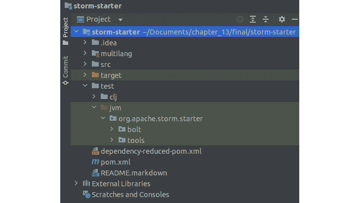

图 13.10–风暴启动器目录结构

`src`目录包含几种不同类型的 Apache Storm 拓扑示例，您可以选择进行试验。我强烈建议您这样做，因为这将有助于您更好地了解 Apache Storm 在配置您的流服务以满足不同需求时是多么的通用。

然而，我们将在`test`目录中执行这个实验，以保持我们的文件与`src`目录中的文件隔离。那么，让我们看看如何进行这个实验。

按照以下步骤构建并运行实验:

1.  在`storm-streaming`目录下，运行`script.py`文件生成 H2O 模型 POJO。该脚本应该运行 H2O AutoML，并生成一个排名。领导者模型将被提取，重命名为`HeartFailureComplications`，并作为 POJO 下载。在您的终端中运行以下命令:

    ```
    python3 script.py
    ```

2.  `HeartFailureComplications` POJO 将被`storm-starter`项目中的其他文件导入，所以为了确保它能被同一个包中的文件正确导入，我们需要将这个 POJO 添加到同一个包中。因此，修改 POJO 文件以添加`storm.starter`包作为第一行。
3.  现在，将`storm-starter`存储库中的`HeartFailureComplications` POJO 文件、`H2ODataSpout.java`文件和`H2OStormStarted.java`文件移动到其`storm-starter/test/jvm/org.apache.storm.starter`目录中。
4.  接下来，我们需要将`h2o-model.jar`文件导入到`storm-starter`项目中。我们可以通过在实验的`pom.xml`文件中添加以下依赖项来实现，如下:

    ```
    <dependency>     <groupId>ai.h2o</groupId>     <artifactId>h2o-genmodel</artifactId>     <version>3.36.1.3</version> </dependency>
    ```

您的目录现在应该如下所示:

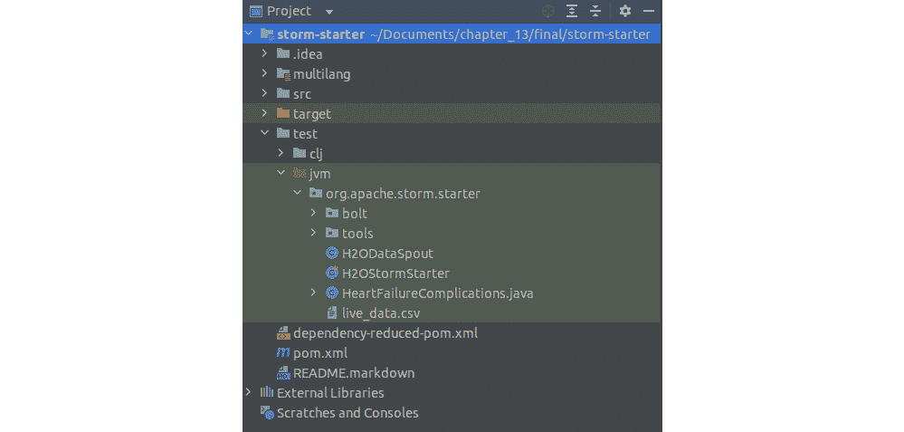

图 13.11–文件传输后的 storm-starter 目录结构

1.  最后，我们将通过右键单击`H2OStormStarter.java`文件并运行它来运行这个项目。您应该得到一个持续的输出流，演示您的壶嘴和螺栓的动作。这可以在下面的截图中看到:

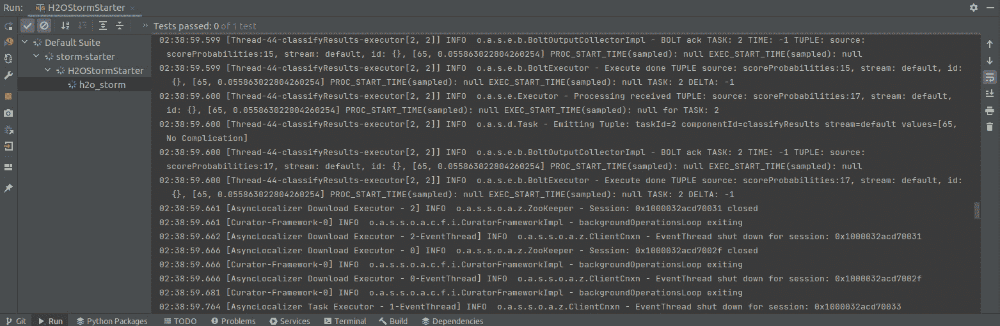

图 13.12-Apache Storm 中的心脏并发症预测输出

如果你仔细观察结果，你会发现日志中有执行者；所有 Apache Storm spouts 和 bolts 都是在集群上运行的内部执行器进程。除了每个元组之外，您还会看到预测概率。这应该如下所示:

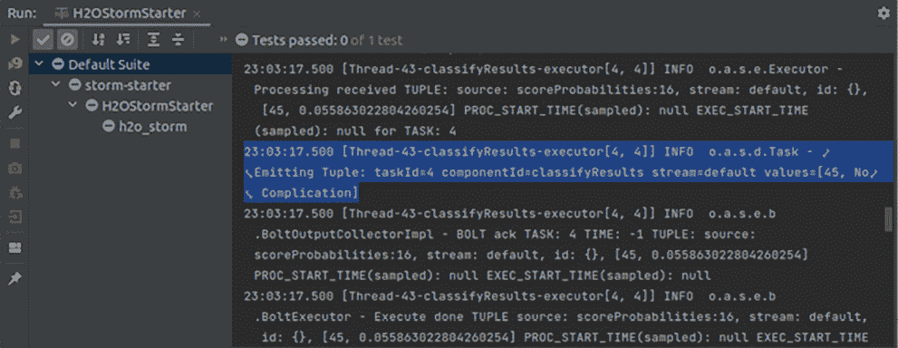

图 13.13–心脏并发症预测结果

恭喜！我们刚刚介绍了另一种设计模式，它向我们展示了如何使用 H2O AutoML 训练的模型，通过 Apache Storm 对流数据进行实时预测。本章的最后一个实验到此结束。

# 总结

在这一章中，我们重点讨论了如何使用不同的技术，在不同的场景中实现使用 H2O AutoML 训练的模型，以对不同类型的数据进行预测。

我们首先在一个场景中实现了一个 AutoML leader 模型，在这个场景中，我们试图通过 web 服务对数据进行预测。我们使用 Spring Boot 和 Apache Tomcat web 服务器创建了一个托管在本地主机上的简单 web 服务。我们使用 AutoML 对模型进行数据训练，将领导者模型提取为 POJO，并将该 POJO 作为一个类加载到 web 应用中。通过这样做，应用能够使用模型对作为 POST 请求接收的数据进行预测，并以预测结果进行响应。

然后，我们研究了另一种设计模式，我们的目标是对实时数据进行预测。我们必须实现一个可以模拟实时数据流的系统。我们用阿帕奇风暴做到了这一点。首先，我们深入了解了什么是 Apache Storm，它的体系结构，以及它是如何使用喷口和螺栓工作的。利用这些知识，我们构建了一个实时数据流应用。我们在预测螺栓中部署了我们的 AutoML 训练模型，其中 Apache Storm 应用能够使用该模型对实时流数据进行预测。

本书的最后一章到此结束。在使用 H2O AutoML 时，我们仍然可以使用无数的特性、概念和设计模式。你对这项技术试验得越多，你就越能更好地实现它。因此，强烈建议您继续试验这种技术，并在自动化您的 ML 工作流程的同时发现解决 ML 问题的新方法。