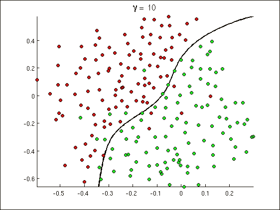
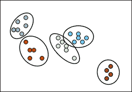
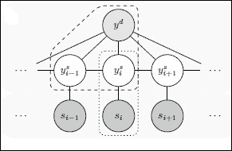
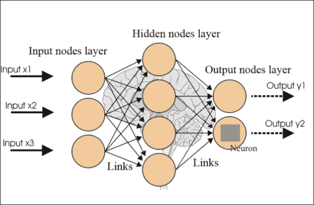
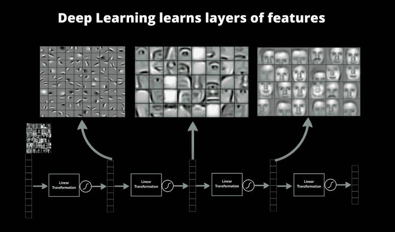

# 第一章。机器学习导论

在这一章中，我们将介绍机器学习和机器学习中的各种主题。在本章中，您将了解以下主题:

*   什么是机器学习？
*   分类概述
*   集群概述
*   模型选择和正则化概述
*   非线性概述
*   监督学习综述
*   无监督学习综述
*   强化学习综述
*   结构化预测概述
*   神经网络综述
*   深度学习概述

# 什么是机器学习？

人类从出生开始就接触到数据。眼睛、耳朵、鼻子、皮肤和舌头不断收集各种形式的数据，大脑将这些数据转化为视觉、听觉、嗅觉、触觉和味觉。大脑然后处理它通过感觉器官接收的各种形式的原始数据，并将其翻译成语音，语音用于表达对接收的原始数据的性质的看法。

在当今世界，连接到机器上的传感器被用于收集数据。数据是通过各种网站和社交网站从互联网上收集的。已经数字化的旧手稿的电子形式也增加了数据集。还通过各种网站和社交网站从互联网上获取数据。也从其他电子形式收集数据，如已经数字化的旧手稿。从多个来源收集的这些丰富形式的数据需要处理，以便能够获得洞察力和理解更有意义的模式。

机器学习算法有助于从各种来源收集数据，转换丰富的数据集，并帮助我们根据提供的结果采取智能行动。机器学习算法被设计为高效和准确，并提供一般的学习来完成以下任务:

*   处理大规模问题
*   做出准确的预测
*   处理各种不同的学习问题
*   可以衍生的学习以及可以学习的条件

机器学习算法的一些应用领域如下:

*   基于销售的价格预测
*   药物的分子反应预测
*   检测汽车保险欺诈
*   分析股票市场回报
*   识别风险禁止贷款
*   风力发电站预测
*   跟踪和监控医疗设备的使用和位置
*   计算能源的有效利用
*   理解智能城市交通发展的趋势
*   采矿业的矿石储量估算

# 分类概述

线性回归模型提供了本质上是定量的响应变量。然而，某些答复是定性的。诸如态度(强烈不同意、不同意、中立、同意和强烈同意)之类的回答本质上是定性的。预测观察的定性响应可以被称为对该观察进行分类，因为它涉及将观察分配到类别或类。分类器是当今许多任务的宝贵工具，例如医学或基因组学预测、垃圾邮件检测、人脸识别和金融。

<title>An overview of clustering</title>

# 聚类的概述

聚类是将数据分成相似对象的组。每个对象(群集)由彼此相似但与其他组的对象不相似的对象组成。聚类的目标是确定一组未标记数据中的内在分组。聚类可用于数据挖掘的各种应用领域(DNA 分析、市场研究、保险研究等等。)、文本挖掘、信息检索、统计计算语言学家和基于语料库的计算词典学。聚类算法必须满足的一些要求如下:

*   可量测性
*   处理各种类型的属性
*   发现任意形状的集群
*   处理噪音和异常值的能力
*   可解释性和可用性

下图显示了聚类的表示形式:

<title>An overview of supervised learning</title>

# 监督学习概述

监督学习需要学习一组输入变量(通常是向量)和输出变量(也称为监督信号)之间的映射，并应用该映射来预测未知数据的输出。监督方法试图发现输入变量和目标变量之间的关系。所发现的关系被表示在被称为模型的结构中。通常模型描述和解释隐藏在数据集中的现象，并可用于在已知输入属性值的情况下预测目标属性值。

监督学习是从监督训练数据(一组训练样本)推断函数的机器学习任务。训练数据由一组训练示例组成。在监督学习中，每个示例都是由输入对象和所需输出值组成的一对。监督学习算法分析训练数据并产生推断函数。

为了解决监督学习问题，必须执行以下步骤:

1.  确定训练示例的类型。
2.  收集训练集。
3.  确定学习函数的输入变量。
4.  确定学习函数的结构和相应的学习算法。
5.  完成设计。
6.  评估所学功能的准确性。

监督方法可以在各种领域中实施，例如营销、金融和制造。

监督学习中需要考虑的一些问题如下:

*   偏差-方差权衡
*   函数复杂度和训练数据量
*   输入空间的维数
*   输出值中的噪声
*   数据的异质性
*   数据中的冗余
*   相互作用和非线性的存在

# 无监督学习概述

无监督学习研究系统如何学习以反映整个输入模式集合的统计结构的方式来表示特定的输入模式。无监督学习很重要，因为它在大脑中可能比有监督学习更常见。例如，眼睛中光感受器的活动是随着视觉世界不断变化的。他们继续提供所有可用的信息，以指示世界上有什么对象，它们是如何呈现的，光照条件是什么，等等。然而，在学习过程中，基本上没有关于场景内容的信息可用。这使得无监督的方法是必不可少的，并允许它们被用作突触适应的计算模型。

在无监督学习中，机器接收输入，但既不获得监督的目标输出，也不从其环境中获得回报。假设机器从环境中得不到任何反馈，那么想象它能学到什么似乎有点神秘。然而，基于机器的目标是构建可用于决策制定、预测未来输入、有效地将输入传达给另一台机器等的输入表示的概念，开发无监督学习的正式框架是可能的。在某种意义上，无监督学习可以被认为是在数据中寻找模式，而不是被认为是噪音的模式。

无监督学习的一些目标如下:

*   在大型数据集中发现有用的结构，而不需要目标期望输出
*   提高输入的学习速度
*   通过给每个可能的数据向量分配分数或概率来建立数据向量的模型

# 强化学习概述

强化学习是让一个主体在世界中行动以最大化其回报的问题。它是关于做什么和如何将情况映射到行动，以最大化数字奖励信号。与大多数形式的机器学习不同，学习者不会被告知要采取哪些行动，而是必须通过尝试来发现哪些行动会产生最大的回报。强化学习的两个最重要的区别特征是试错、搜索和延迟奖励。强化学习的一些例子如下:

*   一个国际象棋棋手走了一步棋，他的选择是通过计划预期可能的回答和反回答得到的。
*   自适应控制器实时调整炼油厂的操作参数。控制器根据指定的边际成本优化产量/成本/质量的平衡，而不严格遵循工程师最初建议的设定点。
*   出生几分钟后，一只小瞪羚挣扎着站起来。半小时后，它以每小时 20 英里的速度运行。
*   教狗一个新把戏——你不能告诉它该做什么，但如果它做对了/做错了，你可以奖励/惩罚它。它必须弄清楚它做了什么使它得到了奖励/惩罚，这就是众所周知的信用分配问题。

强化学习就像试错学习。代理人应该从它的环境经验中发现一个好的政策，同时不损失太多的回报。**探索**是寻找更多关于环境的信息，而**开发**利用已知的信息来获得最大的回报。例如:

*   **餐厅选择**:剥削；去你最喜欢的餐馆。探索；试试一家新餐馆。
*   **石油钻井** : 开采；在最熟悉的位置钻孔。探索；在新位置钻孔。

强化学习的主要组成部分如下:

*   **策略**:这是代理的行为函数。它决定了从感知的环境状态到处于这些状态时要采取的行动的映射。它相当于心理学上所说的一套刺激反应规则或关联。
*   **价值函数**:这是对未来报酬的预测。一个状态的值是从该状态开始，一个代理在未来可以期望积累的奖励总量。奖励决定了环境状态的直接的、内在的可取性，而价值在考虑了可能发生的状态以及这些状态中的奖励之后，表明了状态的长期可取性。
*   **模型**:模型预测环境下一步会做什么。它预测下一个状态和下一个状态的直接奖励。

# 结构化预测概述

结构化预测是各种领域中机器学习问题的重要应用领域。考虑到输入 *x* 和输出 *y* 在诸如时间步长的标记、图像属性的集合、句子的解析或图像到对象的分割等领域，问题是具有挑战性的，因为 *y* 在组成它的输出变量的数量上是指数的。这些在计算上具有挑战性，因为预测需要搜索巨大的空间，还需要考虑统计因素，因为从有限的数据中学习准确的模型需要对不同结构化输出之间的共性进行推理。结构化预测从根本上说是一个表示问题，其中表示必须捕捉到 *x* 和 *y* 之间的区别性相互作用，并且还允许对 *y* 进行有效的组合优化。

结构化预测是根据输入数据预测结构化输出，而不是像分类或回归那样只预测单个数字。例如:

*   **自然语言处理** -自动翻译(输出:句子)或句子解析(输出:解析树)
*   **生物信息学** -二级结构预测(输出:二分图)或酶功能预测(输出:树中的路径)
*   **语音处理** -自动转录(输出:句子)或文本转语音(输出:音频信号)
*   **机器人** -规划(输出:动作序列)

<title>An overview of neural networks</title>

# 神经网络概述

神经网络代表了信息处理的大脑隐喻。这些模型是生物启发的，而不是大脑实际功能的精确复制。由于神经网络具有从数据中学习的能力，在许多预测应用和商业分类应用中，神经网络已经被证明是非常有前途的系统。

人工神经网络通过更新网络结构和连接权重来学习，以便网络可以有效地执行任务。它可以从可用的训练模式中学习，也可以从示例或输入输出关系中自动学习。学习过程由以下内容之一设计:

*   了解可用信息
*   学习范式——从环境中获得一个模型
*   学习规则——弄清楚权重的更新过程
*   学习算法-识别通过学习规则来调整权重的程序

学习规则有四种基本类型:

*   纠错规则
*   玻尔兹曼
*   赫布边
*   竞争学习

<title>An overview of deep learning</title>

# 深度学习概述

深度学习是指一个相当广泛的机器学习技术和架构，其特点是使用许多层非线性信息处理，这些处理本质上是分层的。深度学习架构大致分为三类:

*   用于无监督或生成学习的深度网络
*   监督学习的深度网络
*   混合深度网络

