<title>Chapter 2. Classification</title>

# 第二章。分类

在本章中，我们将介绍以下配方:

*   判别函数分析-来自井的盐水的地质测量
*   多项逻辑回归——理解学生的课程选择
*   Tobit 回归-测量学生的学术能力
*   泊松回归-了解加拉帕戈斯群岛的物种

# 简介

**判别分析**用于区分不同的观察值组，并将新的观察值分配到先前定义的组中。例如，如果要进行一项研究，以调查区别(1)灵长类、(2)鸟类或(3)松鼠所吃水果的变量，研究人员可以收集每个动物群体所吃的这些物种的许多水果特征的数据。大多数水果自然会归入这三类中的一类。判别分析可以用来确定哪些变量是鸟类、灵长类动物或松鼠吃水果的最佳预测因子。判别分析通常用于生物物种分类、肿瘤的医学分类、面部识别技术以及信用卡和保险行业中，用于确定风险。判别分析的主要目标是判别和分类。关于判别分析的假设是多元正态性、组内方差-协方差相等以及变量的低多重共线性。

**多项逻辑回归**用于根据多个自变量预测因变量的分类位置或类别成员的概率。当因变量有两个以上的标称或无序类别时使用，其中自变量的哑编码相当常见。自变量可以是二分的(二元的)或连续的(区间或比例的)。多项逻辑回归使用最大似然估计来评估分类成员的概率。它使用最大似然估计，而不是传统多元回归中使用的最小二乘估计。假设了分布的一般形式。使用估计参数的初始值，并计算样本来自具有这些参数的总体的可能性。迭代地调整估计参数的值，直到获得估计参数的最大似然值。

**Tobit 回归**用于描述非负因变量与自变量之间的关系。它也被称为删失回归模型，旨在估计因变量中存在左删失或右删失时变量之间的线性关系。当值等于或高于某个阈值的病例都采用该阈值的值时，就会进行审查，因此真实值可能等于该阈值，但也可能更高。Tobit 模型已在大量应用中使用，在这些应用中，观察到因变量对于样本中的一些个人是零(汽车支出、医疗支出、工作时间、工资等)。这个模型是针对度量因变量的，它的局限性在于，只有当它高于或低于某个截止水平时，我们才能观察到它。例如:

*   工资可能受到最低工资的限制
*   捐赠给慈善机构的金额
*   顶级编码收入
*   个人使用的时间和休闲活动

**泊松回归**处理因变量为计数的情况。泊松回归与常规多元回归相似，只是因变量(Y)是遵循泊松分布的观察计数。因此，Y 的可能值是非负整数:0、1、2、3 等等。据推测，大数量是罕见的。因此，泊松回归类似于逻辑回归，也有一个离散的响应变量。然而，响应并不像在逻辑回归中那样局限于特定的值。

<title>Discriminant function analysis - geological measurements on brines from wells</title>

# 判别函数分析——对井内卤水的地质测量

让我们假设需要对从矿井中收集的古代文物进行研究。已经从矿井中收集了岩石样本。对采集的岩石样品进行了地球化学测量。对收集的文物进行了类似的研究。为了将样本分离到它们被挖掘的矿井中，DFA 可以用作一个函数。然后可以将该函数应用于伪像，以预测哪个矿是每个伪像的来源。

## 做好准备

为了执行判别函数分析，我们将使用从矿山收集的数据集。

### 步骤 1 -收集和描述数据

应使用名为`BRINE`的地质学数据分析数据集。这可以从 http://www.kgs.ku.edu/Mathgeo/Books/Stat/ASCII/BRINE.TXT 的[中得到。数据集采用标准形式，行对应于样本，列对应于变量。每个样本都被分配到一个地层单位，列在最后一栏。数据集中有 19 个案例和 8 个变量。八个数字测量包括以下内容:](http://www.kgs.ku.edu/Mathgeo/Books/Stat/ASCII/BRINE.TXT)

*   `No`
*   `HCO3`
*   `SO4`
*   `CL`
*   `CA`
*   `MG`
*   `NA`
*   `Group`

## 怎么做...

让我们进入细节。

### 第 2 步-探索数据

第一步是加载以下包:

```
    > library(MASS)

```

### 注

版本信息:此页面的代码在 R 版本 3.2.3 中进行了测试(2015-12-10)

让我们探索数据，了解变量之间的关系。我们将从导入名为`brine.txt`的 txt 数据文件开始。我们将数据保存到`brine`数据框，如下所示:

```
> brine <- read.table("d:/brine.txt", header=TRUE, sep=",", row.names=1)

```

接下来我们将打印`brine`数据帧。`head()`函数返回`brine`数据帧。`brine`数据帧作为输入参数传递。使用以下代码:

```
    > head(brine)

```

结果如下:

```
 HCO3    SO4      Cl      Ca      Mg       Na   GROUP
1   10.4   30.0    967.1    95.9    53.7    857.7     1
2    6.2   29.6   1174.9   111.7    43.9   1054.7     1
3    2.1   11.4   2387.1   348.3   119.3   1932.4     1
4    8.5   22.5   2186.1   339.6    73.6   1803.4     1
5    6.7   32.8   2015.5   287.6    75.1   1691.8     1
6    3.8   18.9   2175.8   340.4    63.8   1793.9     1

```

DFA 假设多元正态性。在进行分析之前，必须检查数据以验证正态性。

为了验证转换的适当性，对数据进行绘图。`pairs` `()`功能用于绘制数据。它产生一个散点图矩阵。交叉图应仅比较第 1-6 列中的测量变量，最后一列(第 7 列)是组的名称。请考虑以下情况:

```
> pairs(brine[ ,1:6])

```

剧情如下截图所示:

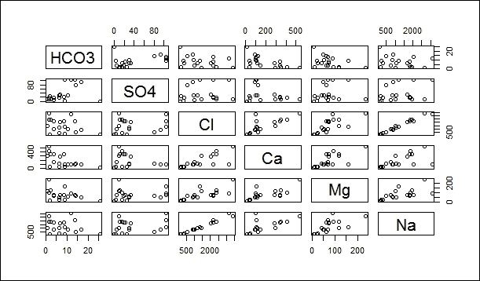

### 步骤 3 -转换数据

可以看出，数据呈彗星状分布。这表明需要对数据进行对数转换，这在地球化学数据中很常见。良好的做法是首先制作整个数据集的副本，然后仅对地球化学测量值应用对数变换。因为数据也包括零；应该对数据集进行`log+1`转换，而不是`log`转换。`brine`数据帧被复制到`brine.log`数据帧。对数据帧进行对数变换。如前所述，执行对数转换。请看下面的代码:

```
 > brine.log <- brine
 > brine.log[ ,1:6] <- log(brine[ ,1:6]+1)
 > pairs(brine.log[ ,1:6])

```

数据转换后，为了使用`pairs()`函数数据框重新评估正态条件，`brine.log`被重新绘制。这种分布似乎更为正常。与之前的图相比，偏斜度有所降低:

```
    > pairs(brine.log[ ,1:6])

```

剧情如下截图所示:

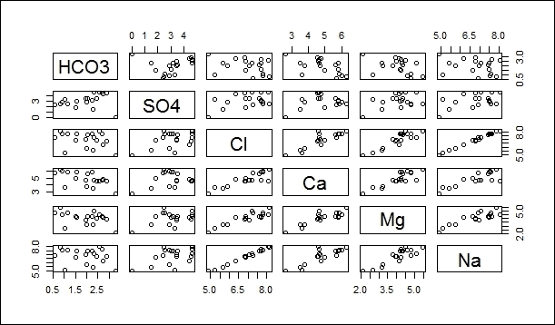

### 步骤 4 -训练模型

下一步是训练模型。这是通过判别函数分析实现的。调用`lda()`函数执行判别函数分析，如下所示:

```
> brine.log.lda <- lda(GROUP ~ HCO3 + SO4 + Cl + Ca + Mg + Na, data=brine.log)

```

这个调用的格式很像线性回归或 ANOVA，因为我们指定了一个公式。这里，应将`GROUP`变量视为因变量，将地球化学测量值视为自变量。在这种情况下，没有对变量之间的交互进行建模，因此变量被添加了`+`而不是`*`。因为没有调用`attach()`，所以数据框的名称必须提供给数据参数。运行 DFA 后，第一步是查看结果，如下所示:

```
    > brine.log.lda

```

结果如下:

```
Call:
lda(GROUP ~ HCO3 + SO4 + Cl + Ca + Mg + Na, data = brine.log)
Prior probabilities of groups:
 1             2             3 
0.3684211     0.3157895     0.3157895 
Group means:
 HCO3        SO4         Cl         Ca         Mg         Na
1   1.759502   3.129009   7.496891   5.500942   4.283490   7.320686
2   2.736481   3.815399   6.829565   4.302573   4.007725   6.765017
3   1.374438   2.378965   6.510211   4.641049   3.923851   6.289692
Coefficients of linear discriminants:
 LD1             LD2
HCO3      -1.67799521      0.64415802
SO4        0.07983656      0.02903096
Cl         22.27520614     -0.31427770
Ca        -1.26859368      2.54458682
Mg        -1.88732009     -2.89413332
Na       -20.86566883      1.29368129
Proportion of trace:
 LD1        LD2 
 0.7435     0.2565

```

*   输出的第一部分显示拟合的公式。
*   第二部分是组的先验概率，它反映了每个组在数据集中的比例。换句话说，如果没有测量值，而测量样本的数量代表了各组的实际相对丰度，则先验概率将描述任何未知样本属于每个组的概率。
*   第三部分显示了组均值，这是每个组的每个变量的平均值表。浏览此表可以帮助您了解这些组在一个或多个变量方面是否有所不同。
*   第四部分报告判别函数的系数(a、b 和 c)。因为有三组，所以有 3-1 个线性判别式(如果只有两组，则只需要 1 [2-1]个线性判别式)。对于每个线性判别式(`LD1`和`LD2`)，有一个系数依次对应于每个变量。
*   最后，第五部分显示了迹线的比例，它给出了由每个判别函数解释的方差。这里，第一个判别式解释了 75%的方差，其余的由第二个判别式解释。

### 步骤 5 -对数据进行分类

`predict()`功能也是`MASS`包的一部分，它使用`lda()`结果将样本分配给各组。换句话说，由于`lda()`导出了一个线性函数，可以对组进行分类，`predict()`允许您将该函数应用于相同的数据，以查看分类函数有多成功。遵循统计惯例，x-hat 是 x 的预测，(hat 被添加到对象名称中，以清楚地表明这些是预测)。请考虑以下情况:

```
    > brine.log.hat <- predict(brine.log.lda)

```

让我们将`brine.log.hat`打印如下:

```
> brine.log.hat

```

结果如下:

```
$class
 [1] 2 1 1 1 1 1 1 2 2 2 2 2 2 3 3 3 3 3 3
Levels: 1 2 3
$posterior
 1                2                3
1    2.312733e-01     7.627845e-01     5.942270e-03
2    9.488842e-01     3.257237e-02     1.854347e-02
3    8.453057e-01     9.482540e-04     1.537461e-01
4    9.990242e-01     8.794725e-04     9.632578e-05
5    9.965920e-01     2.849903e-03     5.581176e-04
6    9.984987e-01     1.845534e-05     1.482872e-03
7    8.676660e-01     7.666611e-06     1.323263e-01
8    4.938019e-03     9.949035e-01     1.584755e-04
9    4.356152e-03     9.956351e-01     8.770078e-06
10   2.545287e-05     9.999439e-01     3.066264e-05
11   2.081510e-02     9.791728e-01     1.210748e-05
12   1.097540e-03     9.989023e-01     1.455693e-07
13   1.440307e-02     9.854613e-01     1.356671e-04
14   4.359641e-01     2.367602e-03     5.616683e-01
15   6.169265e-02     1.540353e-04     9.381533e-01
16   7.500357e-04     4.706701e-09     9.992500e-01
17   1.430433e-03     1.095281e-06     9.985685e-01
18   2.549733e-04     3.225658e-07     9.997447e-01
19   6.433759e-02     8.576694e-03     9.270857e-01
$x
 LD1            LD2
1      -1.1576284     -0.1998499
2     -0.1846803      0.6655823
3       1.0179998      0.6827867
4      -0.3939366      2.6798084
5      -0.3167164      2.0188002
6       1.0061340      2.6434491
7       2.0725443      1.5714400
8      -2.0387449     -0.9731745
9      -2.6054261     -0.2774844
10     -2.5191350     -2.8304663
11     -2.4915044      0.3194247
12     -3.4448401      0.1869864
13     -2.0343204     -0.4674925
14      1.0441237     -0.0991014
15      1.6987023     -0.6036252
16      3.9138884     -0.7211078
17      2.7083649     -1.3896956
18      2.9310268     -1.9243611
19      0.7941483     -1.2819190

```

输出从每个样本的指定分类开始。接下来，它列出了每组每个样本的后验概率，每行(即每个样本)的概率总和为 1.0。这些后验概率衡量每个分类的强度。如果一个样本的这些概率中的一个比所有其他的都大得多，那么这个样本就被分配到一个具有高度确定性的组中。如果两个或更多的概率几乎相等，分配就不那么确定了。如果有许多组，以下命令是一种快速查找每个样本的最大概率的方法:

```
> apply(brine.log.hat$posterior, MARGIN=1, FUN=max)
 1           2             3  4             5         6             7         8 
0.7627845 0.9488842 0.8453057 0.9990242 0.9965920 0.9984987 0.8676660 0.9949035 
 9          10          11        12          13        14          15        16 
0.9956351 0.9999439 0.9791728 0.9989023 0.9854613 0.5616683 0.9381533 0.9992500 
 17          18          19 
0.9985685 0.9997447 0.9270857

```

由于数据集中的大多数概率都很大(> 0.9)，这表明集合中的大多数样本都被分配到一个组中。

如果这些概率中的大多数都很大，则总体分类是成功的。`predict()`输出的最后一部分列出了每个判别函数轴的每个样本的分数。可以绘制这些分数，以图形方式显示各组在判别函数中的分布，就像可以绘制主成分分析的分数一样，如下所示:

```
> plot(brine.log.lda)

```

这三个群体占据明显不同且不重叠的区域。只有一个组 1 接近组 2 的情况，因此可以清楚地声明区分是成功的。

该图如下图所示:

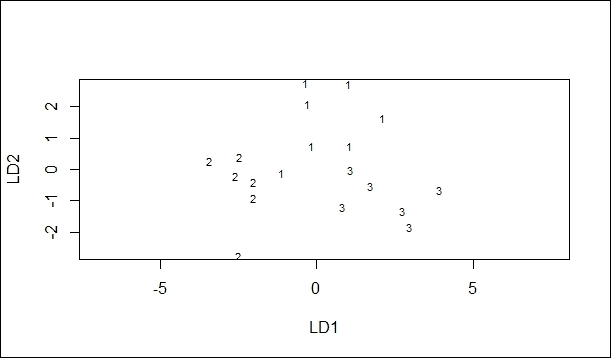

第二种类型的图显示了沿着特定判别函数轴的数据图，如下所示:

```
> plot(brine.log.lda, dimen=1, type="both")

```

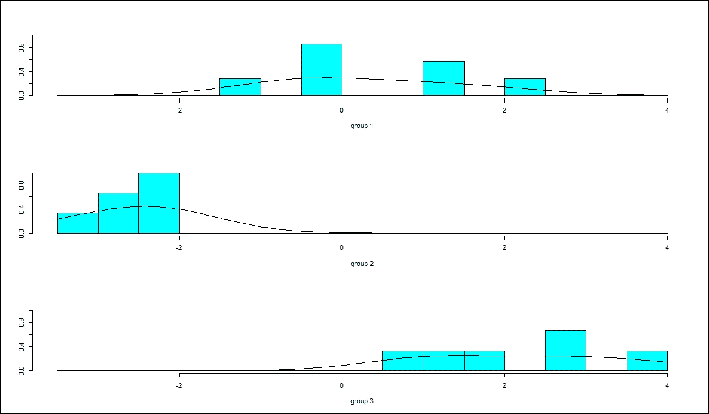

再次，注意沿着判别函数 1 的组的良好分离，并且对于组 2 尤其如此。

### 第 6 步-评估模型

必须评估 DFA 在分组中的有效性，这是通过比较`predict()`所做的分配和实际的分组分配来完成的。`table()`功能对此最有用。按照惯例，调用它时将实际赋值作为第一个参数，将拟合赋值作为第二个参数，如下所示:

```
> tab <- table(brine.log$GROUP, brine.log.hat$class)

```

打印标签的值。

```
 > tab

```

结果如下:

```
 1   2   3
 1   6   1   0
 2   0   6   0
 3   0   0   6

```

输出中的行对应于原始数据中指定的组，列对应于 DFA 进行的分类。在完美的分类中，大值将位于对角线上，零在对角线之外，这将指示属于组 1 的所有样本被 DFA 区分为属于组 1，等等。该表的形式可以让您相当深入地了解哪些组是可靠地被区分的。它还可以显示哪些群体可能会被混淆，以及哪些类型的错误分类比其他类型更常见。以下命令将计算整体预测准确性，即位于对角线上的事例的比例:

```
> sum(tab[row(tab) == col(tab)]) / sum(tab)

```

结果如下:

```
[1] 0.9473684

```

这里的预测准确率几乎达到 95%，相当成功。这种方法测量所谓的再替代误差，即当所有样本都用于开发判别函数时，样本的分类效果如何。

评估 DFA 的第二种方法是留一交叉验证(也称为刀切验证)，它排除了一个观察值。这种评估 DFA 的方法使用被遗漏的数据，即排除一个观察值。我们现在只剩下 n - 1 次观察。这种交叉验证技术是针对数据集中的每个样本自动完成的。为此，将`CV=TRUE`(考虑交叉验证)添加到`lda()`调用中，如下所示:

```
> brine.log.lda <- lda(GROUP ~ HCO3 + SO4 + Cl + Ca + Mg + Na, data=brine.log, CV=TRUE) 

```

区分的成功可以用类似的方法来衡量，如下所示:

```
> tab <- table(brine.log$GROUP, brine.log.lda$class)

```

打印 tab 的值，如下所示:

```
> tab

```

结果如下:

```
 1   2   3
 1  6   1   0
 2   1   4   1
 3   1   0   5
> sum(tab[row(tab) == col(tab)]) / sum(tab)

```

结果如下:

```
[1] 0.7894737

```

在这个数据集中，刀切验证的准确性要低得多(只有 79%的准确性)，反映出重新替换错误总是高估了 DFA 的性能。这种差异在像这样的小数据集上尤其常见，而判别函数分析在大数据集上通常要成功得多。

<title>Multinomial logistic regression - understanding program choices made by students</title>

# 多项逻辑回归——了解学生的项目选择

让我们假设高中生要参加一个项目。学生们有机会选择他们喜欢的课程。学生的选择基于三个选项。这些选择是一般项目，职业项目和学术项目。每个学生的选择是基于每个学生的写作成绩和社会经济地位。

## 准备就绪

为了完成这个食谱，我们将使用一个学生的数据集。第一步是收集数据。

### 第一步——收集数据

名为`hsbdemo`的学生数据集正在被利用。数据集可在[http://voia.yolasite.com/resources/hsbdemo.csv](http://voia.yolasite.com/resources/hsbdemo.csv)以 MS Excel 格式获取。数据集中有 201 个数据行和 13 个变量。八个数字测量值如下:

*   `id`
*   `read`
*   `write`
*   `math`
*   `science`
*   `socst`
*   `awards`
*   `cid`

非数字测量如下:

*   `gender`
*   `ses`
*   `schtyp`
*   `prog`
*   `honors`

## 怎么做...

让我们进入细节。

### 步骤 2 -探索数据

第一步是加载包。如果包不存在，则`library ()`返回错误。使用以下命令:

```
 > library(foreign)
 > library (nnet)
 > library (ggplot2)
 > library (reshape2)

```

### 注

版本信息:此页面的代码在 R 版本 3.2.3 (2015-12-10)中进行了测试。

探索数据有助于了解数据之间的关系。标题为`hsbdemo.csv`的 CSV 文件需要导入到 R 环境中。导入的数据保存在标题为`ml`的数据框中，如下所示:

```
> ml <- read.table("d:/hsbdemo.csv", header=TRUE, sep=",", row.names="id")

```

使用如下`with()`功能探索感兴趣变量的描述性统计数据:

```
> with(ml, table(ses, prog))

```

结果如下:

```
 prog
 ses         academic         general    vocation
 high           42                9           7
 low            19               16          12
 middle         44               20          31

```

让我们获得平均值和标准偏差如下:

```
> with(ml, do.call(rbind, tapply(write, prog, function(x) c(M = mean(x), SD = sd(x)))))

```

结果如下:

```
 M           SD
academic     56.25714     7.943343
general      51.33333     9.397775
vocation     46.76000     9.318754

```

学术的均值最高，一般的标准差最高。

### 第三步-训练模型

为了估计多项逻辑回归，使用`multinom()`函数。`multinom()`功能不需要对数据进行整形。

为结果选择一个参照组很重要。我们可以选择我们希望用作基线的结果水平。这在`relevel ()`功能中指定。然后，我们使用`multinom()`函数运行我们的模型。由于没有对回归系数进行 p 值计算，因此使用 Wald 检验(z 检验)进行 p 值检验。`multinom()`功能中提到的公式是响应~预测值的形式。数据帧`ml`是解释公式中出现的变量的数据帧，如下所示:

```
 > ml$prog2 <- relevel(ml$prog, ref = "academic") 
 > test <- multinom(prog2 ~ ses + write, data = ml)

```

结果如下:

```
# weights:  15 (8 variable)
initial  value          219.722458 
iter     10 value     179.983731
final    value         179.981726 
converged

```

```
 > summary(test)

```

结果如下:

```
 Call:
multinom(formula = prog2 ~ ses + write, data = ml)
Coefficients:
 (Intercept)       seslow   sesmiddle         write
general     1.689478       1.1628411   0.6295638   -0.05793086
vocation    4.235574       0.9827182   1.2740985   -0.11360389

```

```
 Std. Errors:
 (Intercept)       seslow   sesmiddle        write
general     1.226939       0.5142211   0.4650289   0.02141101
vocation    1.204690       0.5955688   0.5111119   0.02222000
Residual Deviance: 359.9635 
AIC: 375.9635 

```

接下来，系数测试汇总除以标准误差测试汇总，如下所示:

```
> z <- summary(test)$coefficients/summary(test)$standard.errors

```

显示`z`的值如下:

```
> z

```

结果如下:

```
 (Intercept)     seslow     sesmiddle       write
general       1.376987   2.261364      1.353816   -2.705658
vocation      3.515904   1.650050      2.492798   -5.112687

```

### 步骤 4 -测试模型的结果

如下进行双尾 z 检验:

```
> p <- (1 - pnorm(abs(z), 0, 1))*2

```

显示 p 值，如下所示:

```
> p

```

结果如下:

```
 (Intercept)       seslow     sesmiddle          write
general    0.1685163893   0.02373673     0.1757949   6.816914e-03
vocation   0.0004382601   0.09893276     0.0126741   3.176088e-07

```

### 第 5 步-模型改进绩效

相对风险被定义为选择一个结果类别和选择基线类别之间的比率。相对风险是线性方程右边的指数。指数回归系数是预测变量单位变化的相对风险比。

从模型中提取系数，并对其执行指数运算，如下所示:

```
> exp(coef(test))

```

结果如下:

```
 (Intercept)   seslow         sesmiddle       write
general         5.416653   3.199009    1.876792   0.9437152
vocation       69.101326   2.671709    3.575477   0.8926115

```

与学术项目相比，一般项目中变量 write 增加一个单位的相对风险比是`.9437`。从`ses = 1`转换到`3`的相对风险比是`.3126`,因为参加的是普通项目而不是学术项目。使用预测的概率来深入了解模型。`fitted()`函数用于计算我们每个结果级别的预测概率，如下所示:

```
> head(pp <- fitted(test))

```

结果如下:

```
 academic     general    vocation
45     .1482721   0.3382509   0.5134769
108   0.1201988   0.1806335   0.6991678
15    0.4186768   0.2368137   0.3445095
67    0.1726839   0.3508433   0.4764728
153   0.1001206   0.1689428   0.7309367
51    0.3533583   0.2378047   0.4088370

```

检查与两个变量`ses`和`write`之一相关的概率变化。创建小型数据集，改变一个变量，同时保持另一个变量不变。首先，将写入变量保持在其平均值，然后检查`ses`变量每个级别的预测概率，如下所示:

```
 > dses <- data.frame(ses = c("low", "middle", "high"),write = mean(ml$write))
 > predict(test, newdata = dses, "probs")

```

结果如下:

```
 academic     general      vocation
1   0.4396813   0.3581915   0.2021272
2   0.4777451   0.2283359   0.2939190
3   0.7009046   0.1784928   0.1206026

```

使用预测概率查看连续预测变量不同值的平均预测概率，如下所示:

```
> dwrite <- data.frame(ses = rep(c("low", "middle", "high"), each = 41), write = rep(c(30:70), 3))

```

存储每个`ses`值的预测概率，并写如下:

```
> pp.write <- cbind(dwrite, predict(test, newdata = dwrite, type = "probs", se = TRUE))

```

计算`ses`每个级别内的平均概率，如下所示:

```
> by(pp.write[, 3:5], pp.write$ses, colMeans)

```

结果如下:

```
pp.write$ses: high
 academic     general      vocation 
 0.6164348   0.1808049   0.2027603 
-------------------------------------------------------------------------- 
pp.write$ses: low
 academic     general      vocation 
 0.3972955   0.3278180   0.2748864 
-------------------------------------------------------------------------- 
pp.write$ses: middle 
 academic     general      vocation 
 0.4256172   0.2010877   0.3732951 

```

有时，几个情节可以传达大量信息。使用我们之前为`pp.write`对象生成的预测，我们可以针对不同级别的结果变量，按照`ses`的级别绘制预测概率与写作分数的关系。`melt()`函数获取宽格式的数据，并将一组列堆叠成一列数据。`lpp`数据帧用于指定如下数据帧:

```
> lpp <- melt(pp.write, id.vars = c("ses", "write"), value.name = "probability")

```

如下所示打印`head`的值:

```
> head(lpp)

```

结果如下:

```
 ses   write   variable     probability
1  low      30   academic    0.09843258
2   low      31   academic    0.10716517
3   low      32   academic    0.11650018
4   low      33   academic    0.12645441
5   low      34   academic    0.13704163
6   low      35   academic    0.14827211

```

接下来，我们绘制按程序类型分面的每一级`ses`的写值的预测概率，如下所示:

```
> ggplot(lpp, aes(x = write, y = probability, colour = ses)) +
+     geom_line() +
+     facet_grid(variable ~ ., scales="free")

```

Tobit 回归——测量学生的学习能力

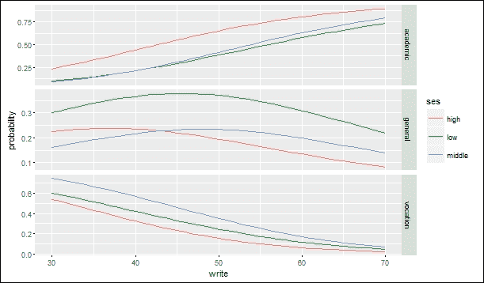

让我们用 200-800 分来衡量一个学生的学术能力。这种测量是基于使用阅读和数学成绩的模型。学生已经注册的项目的性质也要考虑在内。有三种类型的项目:学术类、普通类和职业类。问题是，一些学生可能正确回答了学术能力测试中的所有问题，并获得了 800 分，尽管这些学生的能力很可能并不真正平等。对于所有可能所有问题都答错，得 200 分的同学来说，可能都是这样。

<title>Tobit regression - measuring the students' academic aptitude</title>

# 准备就绪

为了完成这个食谱，我们将使用一个学生的数据集。第一步是收集数据。

## 步骤 1 -收集数据

为了开发 tobit 回归模型，我们将使用名为 Tobit 的学生数据集，该数据集在[http://www.ats.ucla.edu/stat/data/tobit.csv](http://www.ats.ucla.edu/stat/data/tobit.csv)以 MS Excel 格式提供。数据集中有 201 个数据行和 5 个变量。四个数字测量值如下:

### `id`

`read`

*   `math`
*   `apt`
*   非数字测量如下:
*   `prog`

怎么做...

*   让我们进入细节。

## 步骤 2 -探索数据

第一步是加载以下包。`require()`功能设计用于其他功能内部；如果包不存在，它返回`FALSE`并给出警告(而不是默认的`library ()`给出的错误)。使用以下命令:

### 注意

版本信息:此页面的代码在 R 版本 3.2.3 中进行了测试(2015-12-10)

```
    > require(ggplot2)
    > require(GGally)
    > require(VGAM)

```

### 探索数据并理解变量之间的关系。首先导入名为`gala.txt`的 CSV 数据文件。这将把数据保存到`dat`数据框，如下所示:

在这个数据集中，`apt`的最小值是 352。这表明没有学生得到最低分 200。尽管从下方进行审查是可能的，但在本数据集中并不需要。使用以下命令:

结果如下:

```
> dat <- read.table("d:/tobit.csv", header=TRUE, sep=",", row.names="id")

```

步骤 3 -绘制数据

```
> summary(dat)

```

Write 是一个函数，它给出给定平均值和标准偏差的正态分布密度，该密度已在计数指标上进行了缩放。为了生成直方图制定计数为*密度*样本大小*面元*宽度使用以下代码:

```
Id         read         math      prog           apt 
Min.   :  1.0   Min.   :28.0   Min.   :33.0   academic  : 45 Min.   :352
1st Qu.: 50.8   1st Qu.:44.0   1st Qu.:45.0   general   :105 1st Qu.:576
Median :100.5   Median :50.0   Median :52.0   vocational: 50 Median :633
Mean   :100.5   Mean   :52.2   Mean   :52.6      Mean   :640
3rd Qu.:150.2   3rd Qu.:60.0   3rd Qu.:59.0      3rd Qu.:705
Max.   :200.0   Max.   :76.0   Max.   :75.0       Max.   :800

```

### 现在，我们将如下设置基础图:

现在我们将准备一个直方图，在不同程序中按比例着色，正态分布覆盖如下:

```
    > f <- function(x, var, bw = 15) {
    dnorm(x, mean = mean(var), sd(var)) * length(var) * bw
    }

```

绘制的直方图如下图所示:

```
> p <- ggplot(dat, aes(x = apt, fill=prog))

```

Now we shall prepare a histogram, colored by proportion in different programs with a normal distribution overlaid as follows:

```
> p + stat_bin(binwidth=15) +
 stat_function(fun = f, size = 1,
 args = list(var = dat$apt))

```

The histogram plotted is shown in the following figure:

查看前面的直方图，我们可以看到对`apt`值的审查，也就是说，与分布的其他部分相比，得分在 750 到 800 之间的情况比预期的要多得多。

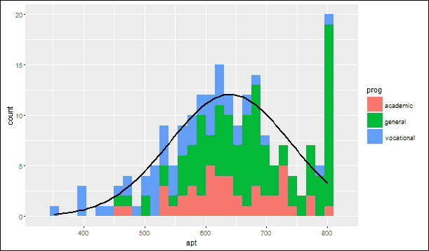

在下面的备选直方图中，突出显示了`apt` =800 的超出情况。在下面的直方图中，断点选项生成一个直方图，其中每个唯一值`apt`都有自己的条形(通过将断点设置为包含从最小值`apt`到最大值 apt 的值的向量)。因为`apt`是连续的，所以`apt`的大多数值在数据集中是唯一的，尽管在接近分布中心的地方有一些 apt 值有两三种情况。

直方图最右侧的尖峰是针对`apt` =800 的情况的条形，该条形相对于所有其他条形的高度清楚地显示了具有该值的情况的超出数量。使用以下命令:

In the following alternative histogram, the excess of cases where `apt`=800 have been highlighted. In the following histogram, the breaks option produces a histogram where each unique value of `apt` has its own bar (by setting breaks equal to a vector containing values from the minimum of `apt` to the maximum of apt). Because `apt` is continuous, most values of `apt` are unique in the dataset, although close to the center of the distribution there are a few values of apt that have two or three cases.

The spike on the far right of the histogram is the bar for cases where `apt`=800, the height of this bar, relative to all the others, clearly shows the excess number of cases with this value. Use the following command:

```
> p + stat_bin(binwidth = 1) + stat_function(fun = f, size = 1, args = list(var = dat$apt, 
 bw = 1))

```

第 4 步-探索关系

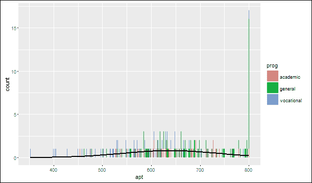

以下命令允许使用来浏览数据集中的二元关系:

### 结果如下:

现在绘制如下矩阵:

```
> cor(dat[, c("read", "math", "apt")])

```

The results are as follows:

```
 read        math             apt
read     1.0000000   0.6622801   0.6451215
math     0.6622801   1.0000000   0.7332702
apt      0.6451215   0.7332702   1.0000000

```

Now plot the matrix as follows:

```
> ggpairs(dat[, c("read", "math", "apt")])

```

在散点图矩阵的第一行中，散点图显示了 read 和 apt 之间的关系。数学和 apt 之间的关系也是成立的。

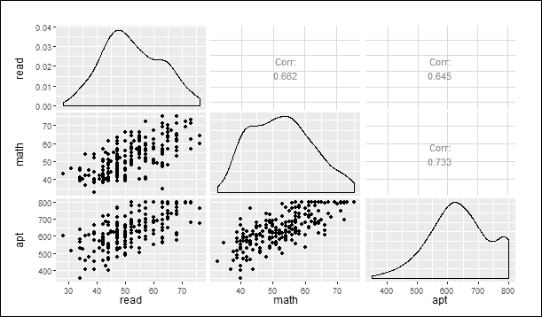

步骤 5 -训练模型

运行 Tobit 模型，使用 VGAM 包的`vglm`函数，命令如下:

### 结果如下:

前面的输出告诉我们指定的选项。

```
    > summary(m <- vglm(apt ~ read + math + prog, tobit(Upper = 800), data = dat))

```

标有系数的表格给出了系数的标准误差和 z 统计量。汇总表中不包含 p 值。

```
Call:
vglm(formula = apt ~ read + math + prog, family = tobit(Upper = 800), 
 data = dat)

```

```
Pearson residuals:
 Min        1Q           Median        3Q       Max
mu           -2.5684    -0.7311        -0.03976    0.7531     2.802
loge(sd)     -0.9689    -0.6359        -0.33365    0.2364     4.845

```

```
Coefficients:
 Estimate Std.       Error     z value     Pr(>|z|) 
(Intercept):1     209.55956     32.54590     6.439     1.20e-10 ***
(Intercept):2       4.18476      0.05235    79.944      < 2e-16 ***
read                2.69796      0.61928     4.357     1.32e-05 ***
math                5.91460      0.70539     8.385      < 2e-16 ***
proggeneral       -12.71458     12.40857    -1.025     0.305523 
progvocational   -46.14327     13.70667    -3.366     0.000761 ***
---
Signif. codes:    0 '***'   0.001 '**'   0.01 '*'   0.05 '.' 0.1 ' ' 1
Number of linear predictors:  2 
Names of linear predictors: mu, loge(sd)
Dispersion Parameter for tobit family:   1
Log-likelihood: -1041.063 on 394 degrees of freedom
Number of iterations: 5 

```

托比特回归系数的解释类似于 OLS 回归系数的解释。线性系数效应是针对未经审查的潜在变量:

read 每增加一个单位，预测值`apt`就会增加`2.6981`个点。

`math`增加一个单位与`apt`预测值增加`5.9146`个单位相关。

*   `prog`的术语有稍微不同的解释。职业项目学生的 apt 预测值比学术项目学生的 apt 预测值低`-46.1419`点。
*   标记为`(Intercept):1`的系数是模型的截距或常数。
*   标记为`(Intercept):2`的系数是一个辅助统计量。该值的指数类似于 OLS 回归中剩余方差的平方根。`65.6773`的值可以与学术能力的标准差相比，后者是`99.21`，这是一个实质性的减少。
*   最终对数可能性`-1041.0629`显示在输出的底部；它可以用于嵌套模型的比较。
*   步骤 6 -测试模型

计算模型中每个系数的 p 值。使用 z 值计算每个系数的 p 值，然后以表格方式显示它们。`read`、`math`和`prog` = 3(职业)的系数在统计上是显著的，如下所示:

### 结果如下:

我们可以通过拟合一个不包含程序的模型并使用如下的似然比检验来测试程序类型的总体显著性:

```
    > ctable <- coef(summary(m))
> pvals <- 2 * pt(abs(ctable[, "z value"]), df.residual(m), lower.tail = FALSE) 
    > cbind(ctable, pvals)

```

结果如下:

```
 Estimate    Std. Error      z value       Pr(>|z|)       pvals
(Intercept):1    209.559557   32.54589921    6.438893   1.203481e-10  3.505839e-10
(Intercept):2      4.184759    0.05234618   79.943922   0.000000e+00 1.299833e-245
read               2.697959    0.61927743    4.356625   1.320835e-05  1.686815e-05
math               5.914596    0.70538721    8.384892   5.077232e-17  9.122434e-16
proggeneral      -12.714581   12.40856959   -1.024661   3.055230e-01  3.061517e-01
progvocational   -46.143271   13.70667208   -3.366482   7.613343e-04  8.361912e-04

```

prog 变量的统计显著性由等于`0.0032`的 p 值表示。我们计算系数的上下 95%置信区间如下:

```
> m2 <- vglm(apt ~ read + math, tobit(Upper = 800), data = dat) 
    > (p <- pchisq(2 * (logLik(m) - logLik(m2)), df = 2, lower.tail = FALSE))

```

结果如下:

```
 [1] 0.003155176

```

通过将残差标绘为 1，我们可以评估绝对以及相对(皮尔逊)值和假设，如正态性和方差齐性。这将有助于检查模型和数据拟合。

```
    > b <- coef(m)
    > se <- sqrt(diag(vcov(m)))
    > cbind(LL = b - qnorm(0.975) * se, UL = b + qnorm(0.975) * se)

```

我们还可能希望检查我们的模型与数据的吻合程度。一种开始的方法是用残差图来评估它们的绝对和相对(皮尔逊)值以及假设，如正态性和方差齐性。使用以下命令:

```
 LL             UL
(Intercept):1      145.770767   273.348348
(Intercept):2        4.082163     4.287356
read                 1.484198     3.911721
math                 4.532062     7.297129
proggeneral        -37.034931    11.605768
progvocational     -73.007854   -19.278687

```

剧情如下截图所示:

We may also wish to examine how well our model fits the data. One way to start is with plots of the residuals to assess their absolute as well as relative (Pearson) values and assumptions such as normality and homogeneity of variance. Use the following commands:

```
    > dat$yhat <- fitted(m)[,1]
    > dat$rr <- resid(m, type = "response")
    > dat$rp <- resid(m, type = "pearson")[,1]
    > par(mfcol = c(2, 3))
    > with(dat, {
 plot(yhat, rr, main = "Fitted vs Residuals")
      qqnorm(rr)
      plot(yhat, rp, main = "Fitted vs Pearson Residuals")
      qqnorm(rp)
      plot(apt, rp, main = "Actual vs Pearson Residuals")
      plot(apt, yhat, main = "Actual vs Fitted")
    })

```

The plot is as shown in the following screenshot:

建立如下关联:

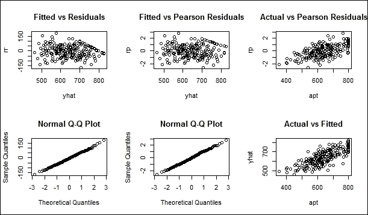

结果如下:

计入的差异计算如下:

```
> (r <- with(dat, cor(yhat, apt)))

```

结果如下:

```
[1] 0.7825

```

`apt`的预测值与观测值的相关性为`0.7825`。如果我们平方这个值，我们得到多重平方相关，这表明预测值与`apt`共享 61.23%的方差。

```
> r^2

```

泊松回归-了解加拉帕戈斯群岛的物种

```
[1] 0.6123

```

加拉帕戈斯群岛位于太平洋，距离厄瓜多尔海岸约 1000 公里。该群岛由 13 个岛屿组成，其中 5 个有人居住。这些岛屿有丰富的动植物。科学家们仍然对这样一个事实感到困惑，即如此多样的物种能够在这样一个小而偏远的群岛上繁衍生息。

<title>Poisson regression - understanding species present in Galapagos Islands</title>

# 准备就绪

为了完成这个食谱，我们将使用物种数据集。第一步是收集数据。

## 步骤 1 -收集和描述数据

我们将利用标题为`gala`的物种数据集的数量，该数据集可从[https://github . com/burakbayramli/kod/blob/master/books/Practical _ Regression _ Anove _ Using _ R _ farage/gala . txt](https://github.com/burakbayramli/kod/blob/master/books/Practical_Regression_Anove_Using_R_Faraway/gala.txt)获得。

### 数据集包括 30 个案例和数据集中的 7 个变量。七种数值测量包括以下内容:

`Species`

`Endemics`

*   `Area`
*   `Elevation`
*   `Nearest`
*   `Scruz`
*   `Adjcacent`
*   怎么做...
*   让我们进入细节。

## 第 2 步-探索数据

探索这些数据将有助于了解这些关系。首先导入名为`gala.txt`的 txt 数据文件。我们将数据保存到 gala 数据框，如下所示:

### `regpois()`给出了从生态学角度来看很重要的变量的泊松回归，如下所示:

接下来提供如下数据摘要:

```
> gala <- read.table("d:/gala.txt")

```

`summary`函数将提供偏差残差、系数、`signif`代码、零偏差、残差偏差、AIC 和费希尔评分迭代次数。结果如下:

```
> regpois <- glm( Species ~ Area + Elevation + Nearest, family=poisson, data=gala)

```

(泊松家族的分散参数取为 1)

```
> summary(regpois)

```

费希尔评分迭代次数:

```
Deviance residuals:
 Min          1Q      Median          3Q         Max
-17.1900     -6.1715     -2.7125      0.7063     21.4237

```

```
Coefficients:
 Estimate      Std. Error     z value      Pr(>|z|) 
(Intercept)    3.548e+00       3.933e-02      90.211       < 2e-16 *** 
Area          -5.529e-05        1.890e-05      -2.925       0.00344 ** 
Elevation      1.588e-03        5.040e-05      31.502        < 2e-16 ***
Nearest        5.921e-03       1.466e-03      4.039          5.38e-05 ***
---

```

```
Signif. codes:
 0 '***' 0.001 '**' 0.01 '*' 0.05 '.' 0.1 ' ' 1

```

剧情如以下截图所示:

```
Null deviance:
3510.7  on 29  degrees of freedom

```

```
Residual deviance:
1797.8  on 26  degrees of freedom

```

```
AIC:
1966.7

```

Number of Fisher Scoring iterations:

```
5
> plot(regpois$fit,gala$Species)

```

The plot is shown in the following screenshot:

步骤 3 -绘制数据和测试经验数据

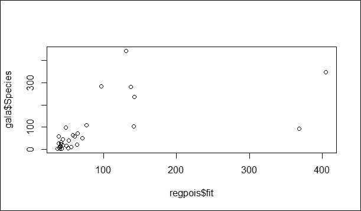

`ppois()`为泊松分布函数，其中参数为`lambda=regpois$fit`，在`gala$Species`中计算如下:

### 这些值本质上应该接近一致。通过绘制如下数值来检查均匀性:

剧情结果如截图所示:

```
> p <- ppois(gala$Species,regpois$fit)

```

The values should be close to uniform in nature. Check the uniformity by plotting the values as follows:

```
> hist(p,breaks=10)

```

The plot result is shown in the screenshot:

这个情节清楚地表明他们没有穿制服。

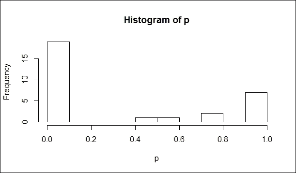

现在进行 Kolmogorov-Smirnov 测试，检验经验数据是否符合给定的分布。

Kolmogorov-Smirnov 检验是一种拟合优度检验，它通常涉及检查来自某个未知分布的随机样本，以检验未知分布函数实际上是一个已知的指定函数的零假设。在方差分析中，我们通常使用 Kolmogorov-Smirnov 检验来检验正态性假设。

Kolmogorov-Smirnov 检验是一种统计假设检验。我们确定一个无效假设，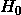，即我们测试的两个样本来自同一个分布。然后我们寻找证据证明这个假设应该被拒绝，并用概率来表达。如果样本来自不同分布的可能性超过置信水平，我们要求拒绝原始假设，而支持假设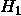，即两个样本来自不同分布。

为了做到这一点，我们设计了一个从样本中计算出来的单一数字，即统计量。诀窍是找到一个统计量，其值的范围不依赖于我们不知道的东西，例如在这种情况下的实际基本分布。

Kolmogorov-Smirnov 检验中的检验统计非常容易；就是两个样本的经验累积分布函数之间的最大垂直距离。样本的经验累积分布是小于或等于给定值的样本值的比例。

一个样本 Kolmogorov-Smirnov 测试如下:

结果如下:

因此，我们可以有把握地得出结论，该模型是不充分的。

```
> ks.test(p,"punif")

```

第 4 步——纠正泊松模型的离散化

```
One-sample Kolmogorov-Smirnov test
data:  p
D = 0.57731, p-value = 4.134e-09
alternative hypothesis: two-sided 

```

现在做一个修正，因为泊松是离散的。变化如下:

### 考虑到如下离散分布，对程序进行了修正:

让我们通过绘制如下数值来检查均匀性:

```
 p = 1/2*(F(Y)+F(Y-1)) 
 ; where Y are the data, 
 ; and F are the distribution functions coming from Poisson

```

绘图结果如下图所示:

```
> p <- 0.5*(ppois(gala$Species,regpois$fit) + ppois(gala$Species-1,regpois$fit))

```

Let us check the uniformity by plotting the values as follows:

```
> hist(p,breaks=10)

```

The plot result is shown in the following figure:

这种修正并没有太大的区别。这个情节清楚地表明他们没有穿制服。

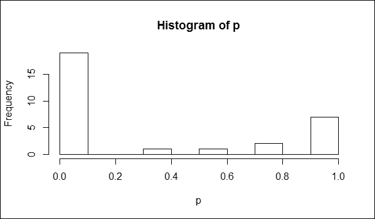

现在让我们再次进行 Kolmogorov-Smirnov 检验，以验证经验数据是否符合如下给定的分布:

结果如下:

步骤 5 -使用链接函数训练和评估模型

```
> ks.test(p,"punif")

```

我们将看到如何使用`glm( )`函数拟合广义线性模型，如下所示:

```
 One-sample Kolmogorov-Smirnov test
data:  p
D = 0.58571, p-value = 2.3e-09
alternative hypothesis: two-sided

```

### 让我们将`regpois2`的结果打印如下:

结果如下:

```
> regpois2 <- glm( Species ~ Area + Elevation + Nearest, family=poisson(link=sqrt), data=gala)

```

第 6 步-使用泊松模型进行重估

```
> summary(regpois2)

```

考虑到如下离散分布，对程序进行了修正:

```
Call:
glm(formula = Species ~ Area + Elevation + Nearest, family = poisson(link = sqrt), 
 data = gala)
Deviance Residuals: 
 Min         1Q       Median         3Q          Max 
-19.108     -5.129     -1.335      1.846       16.918 
Coefficients:
 Estimate   Std. Error   z value     Pr(>|z|) 
(Intercept)    4.1764222    0.1446592    28.871    < 2e-16 ***
Area          -0.0004844    0.0001655    -2.926      0.00343 ** 
Elevation      0.0110143    0.0003372    32.664    < 2e-16 ***
Nearest        0.0083908    0.0065858     1.274      0.20264 
---
Signif. codes:    0 '***' 0.001 '**' 0.01 '*' 0.05 '.' 0.1 ' ' 1
(Dispersion parameter for poisson family taken to be 1)
Null deviance:   3510.7 on 29 degrees of freedom
Residual deviance:   1377.5 on 26 degrees of freedom
AIC: 1546.3
Number of Fisher Scoring iterations: 5

```

### 通过绘制如下数值来检查均匀性:

绘图结果如下图所示:

```
> p2 <- 0.5*(ppois(gala$Species,regpois2$fit) + ppois(gala$Species-1,regpois2$fit)) 

```

Check the uniformity by plotting the values as follows:

```
> hist(p,breaks=10)

```

The plot result is shown in the following figure:

再次进行 Kolmogorov-Smirnov 测试，以验证经验数据是否符合如下给定分布:

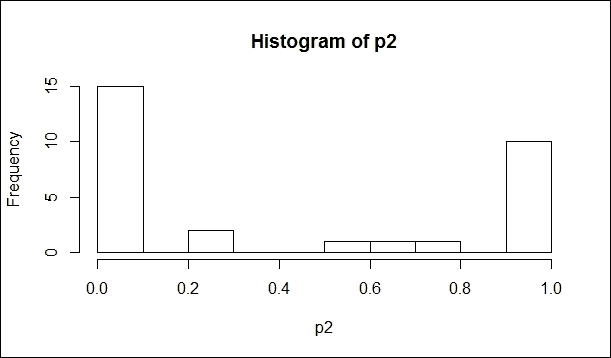

一个样本的 Kolmogorov-Smirnov 测试如下进行:

结果还是没有通过测试。

```
> ks.test(p2,"punif")

```

第 7 步-使用线性模型重新评估

```
data:  p2
D = 0.47262, p-value = 3.023e-06
alternative hypothesis: two-sided

```

应用通常的线性模型:`lm()`函数用于拟合线性模型。可以用来进行回归、方差单层分析、协方差分析(虽然 `[aov](https://stat.ethz.ch/R-manual/R-devel/library/stats/html/aov.html)` 可能为这些提供了更方便的接口)。`reg`数据帧用于存储从`lm()`函数返回的结果，如下所示:

### 现在让我们使用以下命令查看`reg`数据帧的结果:

结果如下:

```
> reg <- lm(Species ~ Area+Elevation+Nearest, data=gala)

```

现在让我们绘制 reg 数据帧，如下所示:

```
> summary(reg)

```

下图显示了**残差与拟合的**图:

```
Call:
lm(formula = Species ~ Area + Elevation + Nearest, data = gala)
Residuals:
 Min         1Q       Median         3Q          Max 
-191.856    -33.111    -18.626      5.673      262.209 
Coefficients:
 Estimate   Std. Error   t value     Pr(>|t|) 
(Intercept)   16.46471     23.38884     0.704      0.48772 
Area           0.01908      0.02676     0.713      0.48216 
Elevation      0.17134      0.05452     3.143      0.00415 **
Nearest        0.07123      1.06481     0.067      0.94718 
---
Signif. codes:    0 '***' 0.001 '**' 0.01 '*' 0.05 '.' 0.1 ' ' 1
Residual standard error:   80.84 on 26 degrees of freedom
Multiple R-squared:      0.5541,  Adjusted R-squared:  0.5027 
F-statistic:       10.77 on 3 and 26 DF,  p-value: 8.817e-05

```

Now let us plot the reg data frame as follows:

```
> plot(reg)

```

The **Residuals vs Fitted** plot is shown in the folllowing figure:

正常 Q-Q 线性模型图如下图所示:

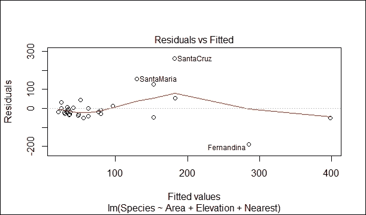

The Normal Q-Q linear model plot is shown in the following screenshot:

**刻度位置**线性模型图如下图所示:

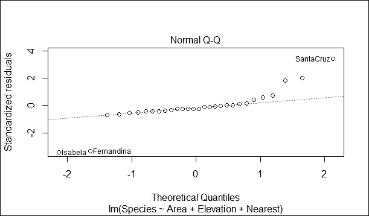

The **Scale-Location** linear model plot is shown in the following figure:

现在让我们通过使用下面的平方根函数来应用一个变换。`reg2`数据帧用于存储`lm`函数返回的结果:

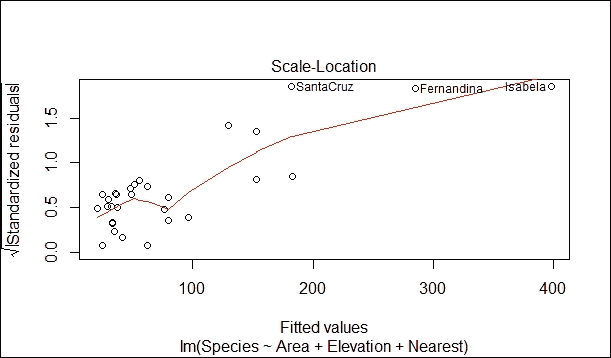

现在让我们来看看`reg`数据帧的结果，如下所示:

结果如下:

```
> reg2 <- lm(sqrt(Species) ~ Area+Elevation+Nearest, data=gala)

```

现在让我们绘制如下`reg2`数据帧:

```
> summary(reg2)

```

**残差与拟合**曲线如下图所示:

```
Call:
lm(formula = sqrt(Species) ~ Area + Elevation + Nearest, data = gala)
Residuals:
 Min          1Q      Median        3Q         Max 
-8.8057   -2.1775   -0.2086    1.3943    8.8730 
Coefficients:
 Estimate   Std. Error   t value     Pr(>|t|) 
(Intercept)    3.744e+00    1.072e+00     3.492     0.001729 ** 
Area          -2.253e-05    1.227e-03    -0.018     0.985485 
Elevation      9.795e-03    2.499e-03     3.920 0\.  000576 ***
Nearest        2.002e-02    4.880e-02     0.410     0.685062 
---
Signif. codes:  0 '***' 0.001 '**' 0.01 '*' 0.05 '.' 0.1 ' ' 1
Residual standard error:   3.705 on 26 degrees of freedom
Multiple R-squared:    0.5799,  Adjusted R-squared:  0.5315 
F-statistic:     11.96 on 3 and 26 DF,  p-value: 4.144e-05

```

Now let us plot the `reg2` data frame as follows:

```
> plot(reg2)

```

The **Residual vs Fitted** plot is shown in the following figure:

**正常 Q-Q** 线性模型图如下图所示:

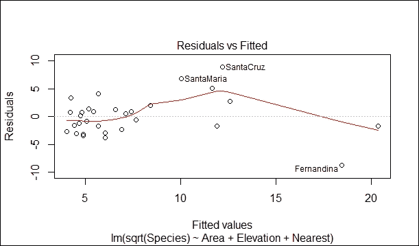

The **Normal Q-Q** linear model plot is shown in the following figure:

泊松回归**比例-位置**线性模型图如以下截图所示:

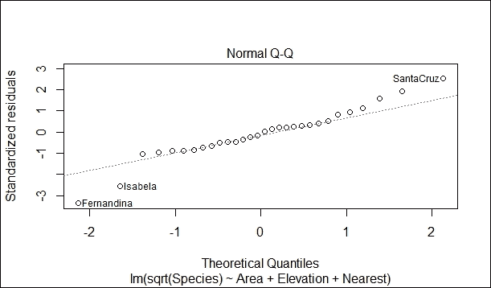

The Poisson regression  **Scale-Location** linear model plot is shown in the following screenshot:

**刻度位置**线性模型图如下图所示:


The **Scale-Location** linear model plot is shown in the following figure:

让我们进行夏皮罗试验。给定一个样本 X1，.。。，n 个实值观测值的 Xn，夏皮罗-维尔克检验(夏皮罗和维尔克，1965 年)是对数据是同分布的复合假设的检验。(**独立同分布**)和正态，即 N(，σ2)对于某未知实数和某σ > 0。使用以下命令:

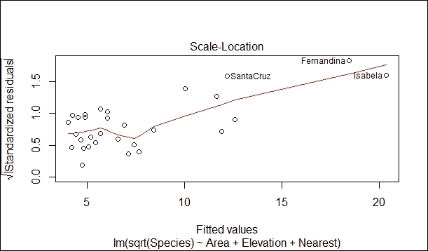

结果如下:

现在让我们通过使用 log 函数来应用一个转换，如下所示。

```
> shapiro.test(reg2$res)

```

`reg3`数据帧用于存储从`lm()`函数返回的结果，如下所示:

```
Shapiro-Wilk normality test
data:  reg2$res
W = 0.9633, p-value = 0.375

```

现在让我们来看看`reg3`数据帧的结果，如下所示:

结果如下:

```
> reg3 <- lm(log(Species) ~ Area+Elevation+Nearest, data=gala)

```

现在让我们绘制如下`reg3`数据帧:

```
> summary(reg3)

```

下图显示了**残差与拟合的**图:

```
Call:
lm(formula = log(Species) ~ Area + Elevation + Nearest, data = gala)
Residuals: 
 Min        1Q      Median        3Q         Max 
-2.0739   -0.5161    0.3307    0.7472    1.6271 
Coefficients:
 Estimate   Std. Error   t value     Pr(>|t|) 
(Intercept)    2.3724325    0.3448586     6.879     2.65e-07 ***
Area          -0.0002687    0.0003946    -0.681    0.50197 
Elevation      0.0029096    0.0008039     3.620      0.00125 ** 
Nearest        0.0133869    0.0157001     0.853      0.40163 
---
Signif. codes:  0 '***' 0.001 '**' 0.01 '*' 0.05 '.' 0.1 ' ' 1
Residual standard error:   1.192 on 26 degrees of freedom
Multiple R-squared:      0.4789,  Adjusted R-squared:  0.4187 
F-statistic:       7.964 on 3 and 26 DF,  p-value: 0.0006281

```

Now let us plot the `reg3` data frame as follows:

```
> plot(reg3)

```

The **Residuals vs Fitted** plot is shown in the following figure:

正常 Q-Q 线性模型图如下图所示:

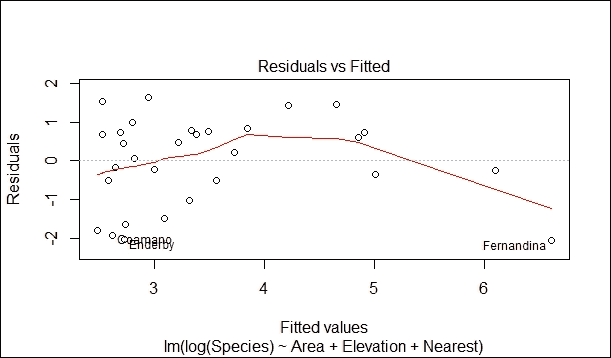

The Normal Q-Q linear model plot is shown in the following figure:

**刻度位置**线性模型图如下图所示:

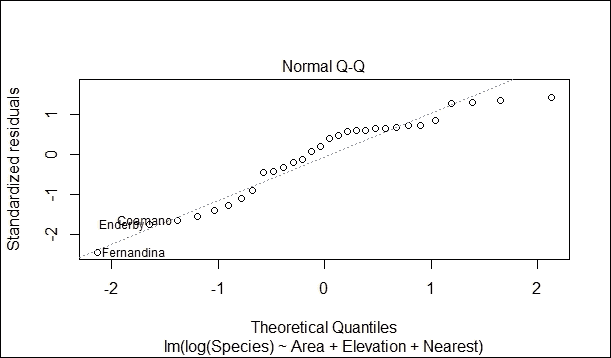

The **Scale-Location** linear model plot is shown in the following figure:

让我们进行如下夏皮罗检验:

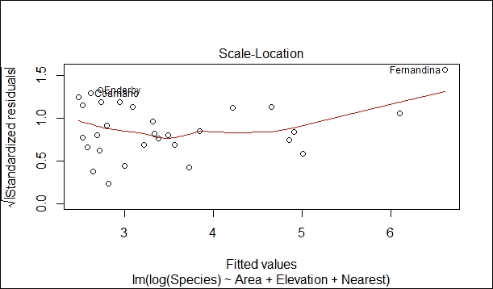

结果是:

Let us carry out a Shapiro test as follows:

```
> shapiro.test(reg3$res)

```

The result is:

```
Shapiro-Wilk normality test
data:  reg3$res
W = 0.91925, p-value = 0.02565

```