<title>Chapter 4. Model Selection and Regularization</title>

# 第四章。模型选择和正则化

在本章中，我们将介绍以下配方:

*   收缩方法-每天消耗的卡路里
*   降维方法-达美航空的机队
*   主成分分析-了解世界美食

# 简介

**子集选择**:使用带标签的例子归纳出一个模型，将对象分类到有限的一组已知类别中，这是机器学习中监督分类的主要挑战之一。数字或标称特征的向量用于描述各种示例。在特征子集选择问题中，学习算法面临的问题是选择一些特征子集来集中注意力，而忽略其余的。

当拟合线性回归模型时，最好地描述数据的变量子集是感兴趣的。当搜索变量集时，应用许多不同的策略，有许多不同的方法可以采用最佳子集。如果有 *m* 个变量，并且最佳回归模型由 *p* 个变量、 *p≤m* 个变量组成，那么挑选最佳子集的更一般的方法可能是尝试所有可能的 *p* 个变量的组合，并选择最符合数据的模型。

不过，还有 *m！p！(m p)！*可能的组合，随着 *m* 值的增加而增加，例如 *m = 20* 和 *p = 4* 给出了 4845 种可能的组合。此外，通过使用更少的特征，我们可以降低获取数据的成本，并提高分类模型的可理解性。

**缩水法:**缩水回归是指在回归情况下进行估计或预测的缩水法；当回归变量之间存在多重共线性时非常有用。在数据集与所研究的协变量相比较小的情况下，收缩技术可能会改善预测。常见的收缩方法如下:

*   线性收缩系数-用相同的系数收缩所有系数
*   岭回归-惩罚最大似然，惩罚因子被添加到似然函数中，使得系数根据每个协变量的方差单独收缩
*   Lasso -通过对标准化协变量系数的绝对值之和设置约束，将一些系数收缩为零

收缩方法保留了预测值的一个子集，而丢弃了其余的。子集选择产生了可解释的模型，并且产生了可能比完整模型更低的预测误差，同时没有减少完整模型的预测误差。收缩方法更加连续，不会受到高可变性的影响。当线性回归模型中有许多相关变量时，它们的系数很难确定，并且表现出很高的方差。

**降维方法:**包括模式识别、数据压缩、机器学习和数据库导航在内的各种信息处理领域的一个重大挑战是流形学习。测量的数据向量是高维的，并且在许多情况下，数据位于低维流形附近。高维数据的主要挑战是它是多重的；它间接测量通常无法直接测量的潜在来源。降维也可以看作是导出一组自由度的过程，这些自由度可用于重现数据集的大部分可变性。

<title>Shrinkage methods - calories burned per day</title>

# 减肥方法-每天消耗的卡路里

为了比较人类的代谢率，**基础代谢率** ( **BMR** )的概念在临床上非常关键，是确定人类甲状腺状态的一种手段。哺乳动物的基础代谢率随体重而变化，异速生长指数与现场代谢率相同，并随许多生理和生化率而变化。Fitbit 作为一种设备，使用基础代谢率和白天进行的活动来估计一整天燃烧的卡路里。

## 做好准备

为了执行收缩方法，我们将使用从 Fitbit 收集的数据集和消耗卡路里的数据集。

### 步骤 1 -收集和描述数据

应使用 CSV 格式的名为`fitbit_export_20160806.csv`的数据集。数据集采用标准格式。有 30 行数据和 10 个变量。数字变量如下:

*   `Calories Burned`
*   `Steps`
*   `Distance`
*   `Floors`
*   `Minutes Sedentary`
*   `Minutes Lightly Active`
*   `Minutes Fairly Active`
*   `ExAng`
*   `Minutes Very Active`
*   `Activity Calories`

非数字变量如下:

*   `Date`

## 怎么做...

让我们进入细节。

### 第二步-探索数据

作为第一步，需要加载以下包:

```
    > install.packages("glmnet")
    > install.packages("dplyr")
    > install.packages("tidyr")
    > install.packages("ggplot2")
    > install.packages("caret")
    > install.packages("boot")
    > install.packages("RColorBrewer")
    > install.packages("Metrics")
    > library(dplyr)
    > library(tidyr)
    > library(ggplot2)
    > library(caret)
    > library(glmnet)
    > library(boot)
    > library(RColorBrewer)
    > library(Metrics)

```

### 注

版本信息:此页面的代码在 R 版本 3.3.0 中进行了测试(2016-05-03)

让我们探索数据，了解变量之间的关系。我们将从导入名为`fitbit_export_20160806.csv`的 csv 数据文件开始。我们将把数据保存到`fitbit_details`帧:

```
> fitbit_details <- read.csv("https://raw.githubusercontent.com/ellisp/ellisp.github.io/source/data/fitbit_export_20160806.csv", 
    + skip = 1, stringsAsFactors = FALSE) %>%
    + mutate(
    + Calories.Burned = as.numeric(gsub(",", "", Calories.Burned)),
    + Steps = as.numeric(gsub(",", "", Steps)),
    + Activity.Calories = as.numeric(gsub(",", "", Activity.Calories)),
    + Date = as.Date(Date, format = "%d/%m/%Y")
    + )

```

将`fitbit_details`数据帧存储到`fitbit`数据帧:

```
> fitbit <- fitbit_details

```

打印数据帧`fitbit`。`head()`函数返回`fitbit`数据帧的第一部分。`fitbit`数据帧作为输入参数传递:

```
 > head(fitbit)

```

结果如下:

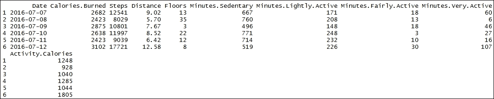

将`Activity.Calories`和`Date`的值设置为空:

```
> fitbit$Activity.Calories <- NULL

```

```
> fitbit$Date <- NULL

```

将系数换算成每千步的卡路里。然后将结果设置到`fitbit$Steps`数据帧:

```
> fitbit$Steps <- fitbit$Steps / 1000

```

打印`fitbit$Steps`数据帧:

```
> fitbit$Steps

```

结果如下:

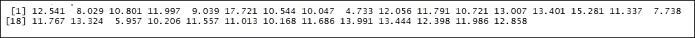

探索所有的候选变量。计算相关系数的函数:

```
    > panel_correlations <- function(x, y, digits = 2, prefix = "", cex.cor, ...){
    # combining multiple plots into one overall graph
    + usr <- par("usr")
    + on.exit(par(usr))
    + par(usr = c(0, 1, 0, 1))
    # computing the absolute value
    + r <- abs(cor(x, y))
# Formatting object 
    + txt <- format(c(r, 0.123456789), digits = digits)[1]
    + txt <- paste0(prefix, txt)
    + if(missing(cex.cor)) cex.cor <- 0.8/strwidth(txt)
    + text(0.5, 0.5, txt, cex = cex.cor * r)
    + }

```

产生散点图矩阵。`pairs()`功能以矩阵形式生成散点图。`fitbit`是散点图的数据集。几乎可以直接从`Steps`精确计算距离:

```
> pairs(fitbit[ , -1], lower.panel = panel_correlations, main = "Pairwise Relationship - Fitbit's Measured Activities")

```

结果如下:

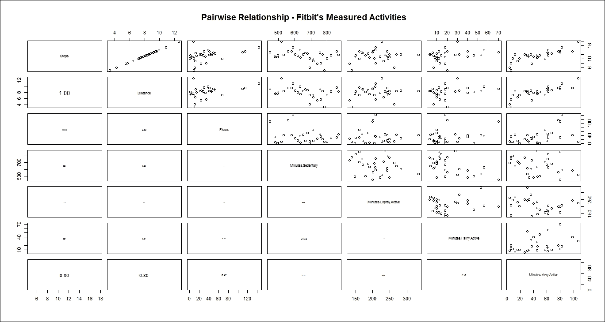

打印`fitbit data frame`:

```
> ggplot(fitbit, aes(x = Distance / Steps)) + geom_rug() + geom_density() +ggtitle("Stride Length Reverse- Engineered from Fitbit Data", subtitle = "Not all strides identical, due to rounding or other jitter")

```

结果如下:

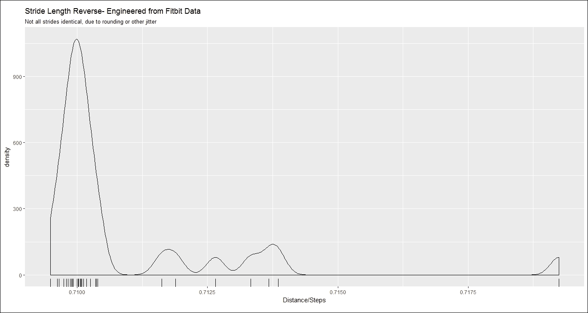

### 第 3 步-建立模型

以步骤为唯一解释变量，以`Calories.Burned`为响应变量，构建普通最小二乘估计。`lm()`作为函数用于拟合线性模型。`Calories.Burned ~ Steps`是公式，`fitbit`是数据框。然后将结果存储在中等数据帧中:

```
> moderate <- lm(Calories.Burned ~ Steps, data = fitbit)

```

打印`moderate`数据帧:

```
> moderate

```

结果如下:

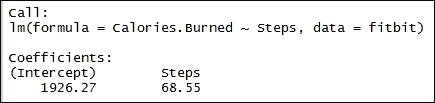

将`moderate`数据帧的值四舍五入:

```
> round(coef(moderate))

```

结果如下:

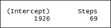

用所用模型的残差绘制预测的卡路里。`plot()`功能是用于绘制 R 对象的通用功能。`moderate`数据帧作为函数值传递。`bty`参数决定绘制的关于图的方框类型:

```
> plot(moderate, which = 1, bty = "l", main = "Predicted Calories compared with Residuals")

```

结果如下:

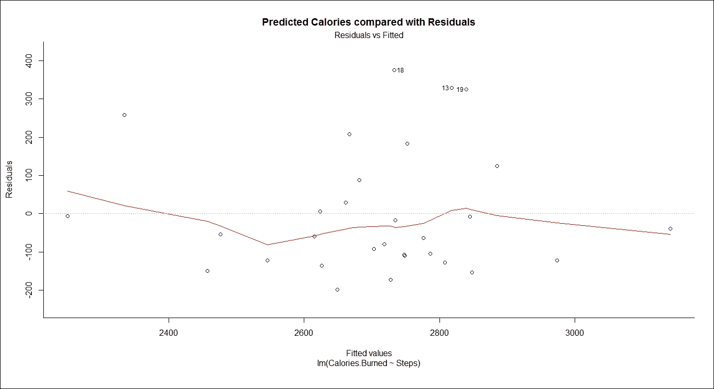

检验残差的偏自相关函数。`pacf()`用于部分自相关。`resid()`作为函数计算因变量的观测数据之间的差异。`moderate`作为数据帧传递给`resid()`函数，计算因变量观测数据之间的差异:

```
> pacf(resid(moderate), main = "Partial Autocorrelation of residuals from single variable regression")

```

`grid()`功能将网格添加到绘制的数据中:

```
> grid()

```

结果如下:

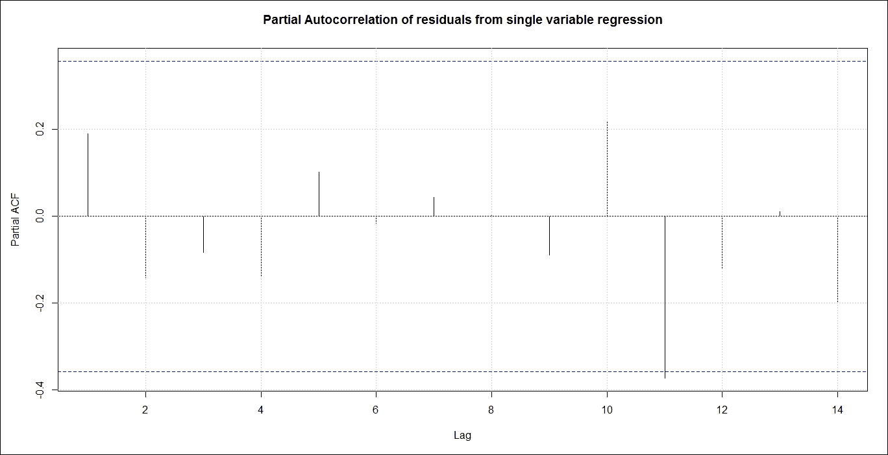

### 第四步——改进模型

基于所有七个解释变量预测每日卡路里。将模型拟合到不同α值的多个样本，使用拟合模型从原始样本中预测不在重新样本中的出袋点。它是关于通过选择适当的α值在岭回归和套索估计的两个极端之间建立平衡。

通过标准化创建矩阵 X。`as.matrix()`函数将`fitbit[ , -1]`即除日期列以外的列转化为矩阵:

```
 > X <- as.matrix(fitbit[ , -1])

```

打印`X`数据框。`head()`函数返回`X`数据帧的第一部分。`X`数据帧作为输入参数传递:

```
> head(X)

```

结果如下:

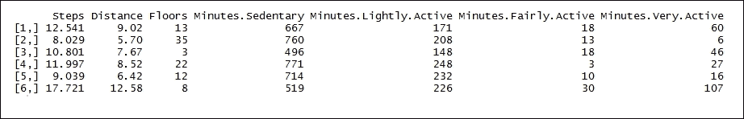

通过标准化创建向量`Y`:

```
> Y <- fitbit$Calories.Burned

```

打印`Y`数据帧:

```
> Y

```

结果如下:

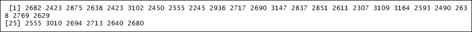

```
> set.seed(123)

```

生成规则序列:

```
 > alphas <- seq(from = 0, to  = 1, length.out = 10)
 > res <- matrix(0, nrow = length(alphas), ncol = 6)

```

为每个 CV 运行创建五个重复:

```
    > for(i in 1:length(alphas)){
    + for(j in 2:6){
    # k-fold cross-validation for glmnet
    + cvmod <- cv.glmnet(X, Y, alpha = alphas[i])
    + res[i, c(1, j)] <- c(alphas[i], sqrt(min(cvmod$cvm)))
    + }
    + }

```

创建要使用的数据集。`data.frame()`函数用于根据一组紧密耦合的变量创建数据框。这些变量共享矩阵的属性:

```
> res <- data.frame(res)

```

打印`res`数据帧:

```
> res

```

结果如下:

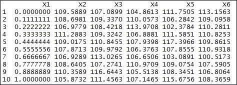

创建一个`average_rmse`的向量:

```
> res$average_rmse <- apply(res[ , 2:6], 1, mean)

```

打印`res$average_rmse`矢量:

```
> res$average_rmse

```

结果如下:

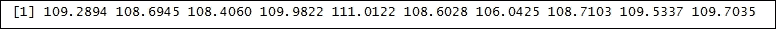

将`res$average_rmse`按升序排列。然后将结果存储在`res`数据帧中:

```
> res <- res[order(res$average_rmse), ]

```

打印`res`数据帧:

```
> res

```

结果如下:

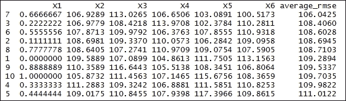

```
    > names(res)[1] <- "alpha"
    > res %>%
    + select(-average_rmse) %>%
    + gather(trial, rmse, -alpha) %>%
    + ggplot(aes(x = alpha, y = rmse)) +
    + geom_point() +
    + geom_smooth(se = FALSE) +
    + labs(y = "Root Mean Square Error") +
    + ggtitle("Cross Validation best RMSE for differing values of alpha")

```

结果如下:

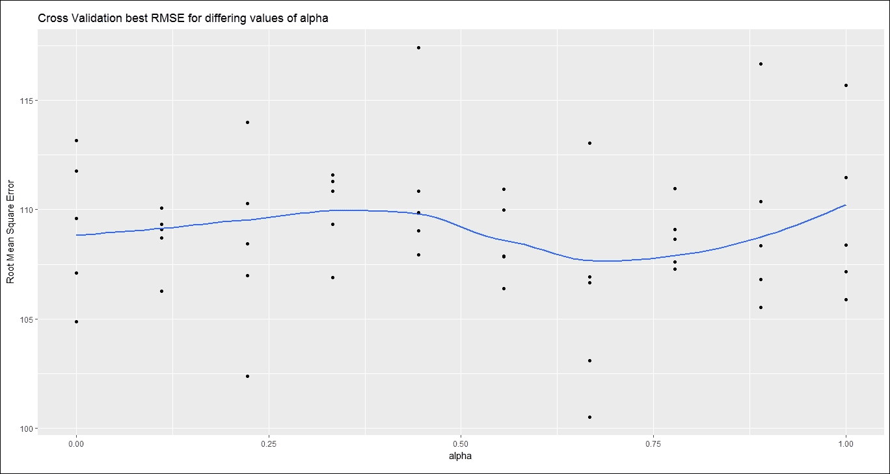

```
> bestalpha <- res[1, 1]

```

打印`bestalpha`数据帧:

```
> bestalpha

```


使用弹性网将普通最小二乘等值与八个系数(七个解释变量加一个截距)的估计值进行比较。

确定最佳α值的λ。通过调用`cv.glmnet()`函数计算`glmnet`的 k 重交叉验证:

```
> crossvalidated <- cv.glmnet(X, Y, alpha = bestalpha)

```

创建模型。`glmnet()`通过惩罚最大似然拟合广义线性模型。在正则化参数λ的网格值处，为 lasso 或`elasticnet`罚值计算正则化路径。`X`是输入矩阵，而`Y`是响应变量。`alpha`为`elasticnet`混合参数，0 ≤ α ≤ 1:

```
> moderate1 <- glmnet(X, Y, alpha = bestalpha)

```

构建普通最小二乘估计，将`fitbit`作为唯一解释变量，将`Calories.Burned`作为响应变量。`lm()`作为函数用于拟合线性模型。`Calories.Burned ~ Steps`是公式，`fitbit`是数据框。然后将结果存储在`OLSmodel`数据帧中:

```
> OLSmodel <- lm(Calories.Burned ~ ., data = fitbit)

```

打印`OLSmodel`数据帧:

```
> OLSmodel

```

结果如下:

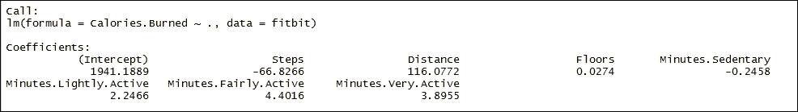

将普通的最小二乘等值与八个系数(七个解释变量加一个截距)的估计值进行比较。然后将结果存储在`coeffs`数据帧中:

```
 > coeffs <- data.frame(original = coef(OLSmodel), 
 + shrunk = as.vector(coef(moderate1, s = crossvalidated$lambda.min)),
 + very.shrunk = as.vector(coef(moderate1, s = crossvalidated$lambda.1se)))

```

打印`coeffs`数据帧:

```
> coeffs

```

结果如下:

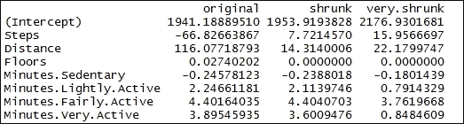

将`moderate`数据帧的值四舍五入到三个有效数字:

```
> round(coeffs, 3)

```

结果如下:

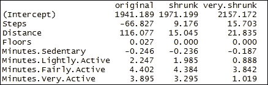

创建模型。`glmnet()`通过惩罚最大似然拟合广义线性模型:

```
> moderate2 <- glmnet(X, Y, lambda = 0)

```

打印`moderate2`数据帧:

```
> moderate2

```

结果如下:

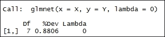

将数值四舍五入至三位有效数字:

```
> round(data.frame("elastic, lambda = 0" = as.vector(coef(moderate2)), "lm" = coef(OLSmodel), check.names = FALSE), 3)

```

结果如下:

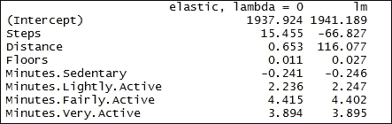

创建模型。`glmnet()`消除距离列后，通过惩罚最大似然拟合广义线性模型:

```
> moderate3 <- glmnet(X[ , -2], Y, lambda = 0)

```

打印`moderate3`数据帧:

```
> moderate3

```

结果如下:

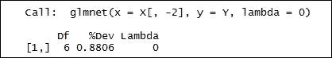

建筑普通最小二乘估计`Y ~ X[ , -2]`是公式。然后将结果存储在`moderate4`数据帧中:

```
> moderate4 <- lm(Y ~ X[ , -2])

```

打印`moderate4`数据帧:

```
> moderate4

```

结果如下:

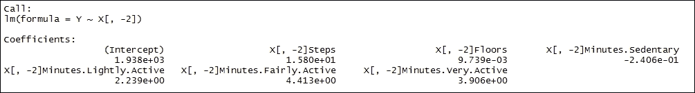

将数值四舍五入至三位有效数字:

```
> round(data.frame("elastic, lambda = 0" = as.vector(coef(moderate3)), "lm" = coef(moderate4), check.names = FALSE), 3)

```

结果如下:

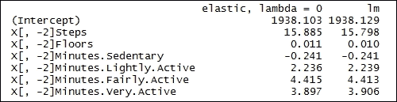

### 第 5 步-比较模型

通过使用 bootstrapping 比较不同模型的预测强度，其中建模方法被应用于 bootstrapping 数据的重新采样。然后使用估计模型来预测完整的原始数据集。

提供给进行弹性建模的 boot 的函数:

```
    > modellingfucn1 <- function(data, i){
    + X <- as.matrix(data[i , -1])
    + Y <- data[i , 1]
    # k-fold cross-validation for glmnet
    + crossvalidated <- cv.glmnet(X, Y, alpha = 1, nfolds = 30)
    # Fitting a generalized linear model via penalized maximum likelihood
    + moderate1 <- glmnet(X, Y, alpha = 1)
    # Computing the root mean squared error
    + rmse(predict(moderate1, newx = as.matrix(data[ , -1]), s =     crossvalidated$lambda.min), data[ , 1])
    + }

```

生成应用于数据的统计的 R 引导副本。`fitbit`是数据集，`statistic = modellingfucn1`是函数，当应用于`fitbit`时，返回包含感兴趣的统计数据的向量。`R = 99`表示引导程序复制的数量:

```
> elastic_boot <- boot(fitbit, statistic = modellingfucn1, R = 99)

```

打印`elastic_boot`数据框:

```
 > elastic_boot

```

结果如下:

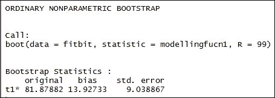

提供给进行 OLS 建模的引导的函数:

```
    > modellingOLS <- function(data, i){
    + mod0 <- lm(Calories.Burned ~ Steps, data = data[i, ])
    + rmse(predict(moderate, newdata = data), data[ , 1])
    + }

```

生成应用于数据的统计的 R 引导副本。`fitbit`是数据集，`statistic = modellingOLS`是函数，当应用于`fitbit`时，返回包含感兴趣的统计数据的向量。`R = 99`表示引导程序复制的数量:

```
> lmOLS_boot <- boot(fitbit, statistic = modellingOLS, R = 99)

```

打印`lmOLS_boot`数据框:

```
> lmOLS_boot

```

结果如下:

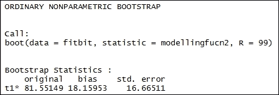

生成应用于数据的统计的 R 引导副本。`fitbit`是数据集，`statistic = modellingfucn2`是函数，当应用于`fitbit`时，返回包含感兴趣的统计数据的向量。`R = 99`表示引导程序复制的数量:

```
> lm_boot <- boot(fitbit, statistic = modellingfucn2, R = 99)

```

打印`lm_boot`数据帧:

```
> lm_boot

```

结果如下:

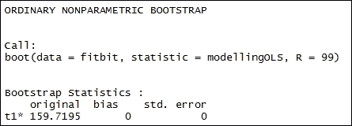

```
 > round(c("elastic modelling" = mean(elastic_boot$t), 
 + "OLS modelling" = mean(lm_boot$t),
 + "OLS modelling, only one explanatory variable" = mean(lmOLS_boot$t)), 1)

```

结果如下:


用标度变量重新调整模型。

创建模型。`glmnet()`通过惩罚最大似然拟合广义线性模型。

```
 > ordering <- c(7,5,6,2,1,3,4)
 > par(mar = c(5.1, 4.1, 6.5, 1), bg = "grey90")
 > model_scaled <- glmnet(scale(X), Y, alpha = bestalpha)
 > the_palette <- brewer.pal(7, "Set1")
 > plot(model_scaled, xvar = "dev", label = TRUE, col = the_pallete, lwd = 2, main = "Increasing contribution of different explanatory variablesnas penalty for including them is relaxed")
 > legend("topleft", legend = colnames(X)[ordering], text.col = the_palette[ordering], lwd = 2, bty = "n", col = the_palette[ordering])

```

结果如下:

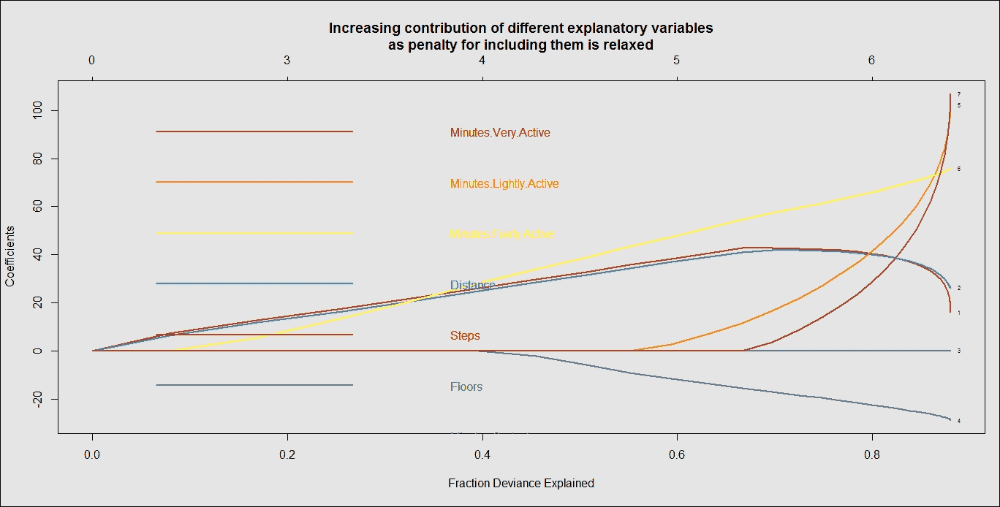<title>Dimension reduction methods - Delta's Aircraft Fleet</title>

# 降维方法-达美航空的机队

机队规划是任何航空公司战略规划过程的一部分。机队是指航空公司运营的飞机总数，以及组成整个机队的具体飞机类型。飞机采购的航空公司选择标准基于技术/性能特征、经济和财务影响、环境法规和限制、市场考虑和政治现实。对于航空公司来说，机队组成是一项关键的长期战略决策。每种类型的飞机都有不同的技术性能特征，例如，在最大飞行距离或范围内运载有效载荷的能力。它影响财务状况、运营成本，尤其是服务特定航线的能力。

## 准备就绪

为了进行降维，我们将使用从达美航空公司机队收集的数据集。

### 步骤 1 -收集和描述数据

应使用名为`delta.csv`的数据集。数据集采用标准格式。有 44 行数据和 34 个变量。

## 怎么做...

让我们进入细节。

### 步骤 2 -探索数据

第一步是加载以下包:

```
    > install.packages("rgl")
    > install.packages("RColorBrewer")
    > install.packages("scales")
    > library(rgl)
    > library(RColorBrewer)
    > library(scales)

```

### 注意

版本信息:此页面的代码在 R 版本 3.3.2 中测试过(2016-10-31)

让我们探索数据，了解变量之间的关系。我们将从导入名为`delta.csv`的 csv 数据文件开始。我们将把数据保存到增量帧:

```
 > delta <- read.csv(file="d:/delta.csv", header=T, sep=",", row.names=1)

```

探索`delta`数据帧的内部结构。`str()`功能显示数据帧的内部结构。细节作为 R 对象传递给`str()`函数:

```
> str(delta)

```

结果如下:

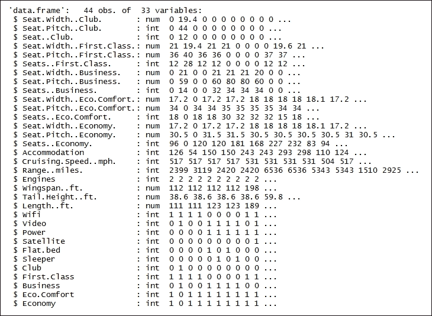

探索与飞机物理特性相关的中间定量变量:容纳量、巡航速度、航程、发动机、翼展、尾翼高度和`Length.Scatter`绘图矩阵。`plot()`功能是用于绘制机器人对象的通用功能。`delta[,16:22]`数据帧作为函数值传递:

```
> plot(delta[,16:22], main = "Aircraft Physical Characteristics", col = "red")

```

结果如下:

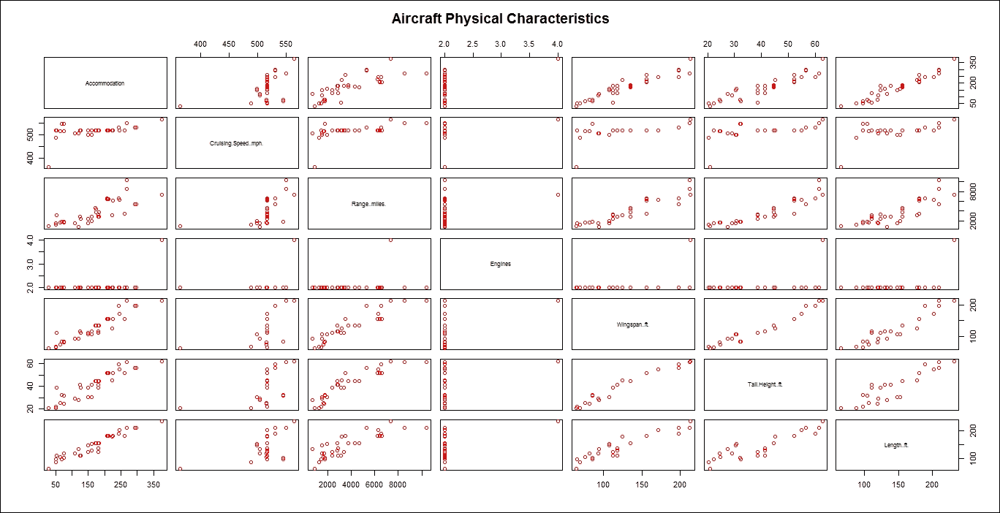

所有这些变量之间存在正相关关系，因为它们都与飞机的总体尺寸有关。

### 步骤 3 -应用主成分分析

可视化高维数据集，如引擎数量。将主成分分析应用于数据。`princomp()`函数对`delta`数据矩阵进行主成分分析。结果是`principal_comp_analysis`，它是类`princomp`的一个对象:

```
> principal_comp_analysis <- princomp(delta)

```

打印`principal_comp_analysis`数据帧:

```
> principal_comp_analysis

```

结果如下:

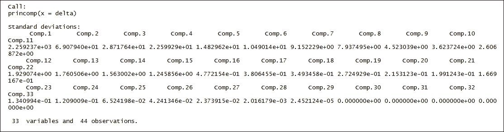

绘制`principal_comp_analysis`数据:

```
> plot(principal_comp_analysis, main ="Principal Components Analysis of Raw Data", col ="blue")

```

结果如下:

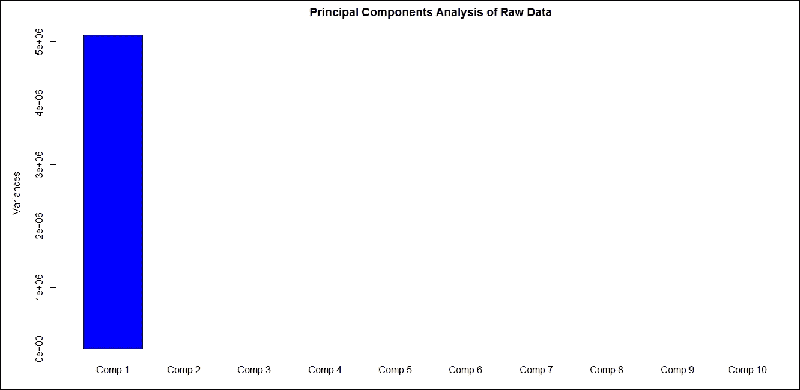

可以证明，第一主成分具有标准差，其占数据中方差的 99.8%以上。

主成分分析的印刷装载量。`loadings()`函数使用`principal_comp_analysis`主成分分析数据对象作为输入:

```
> loadings(principal_comp_analysis)

```

结果如下:

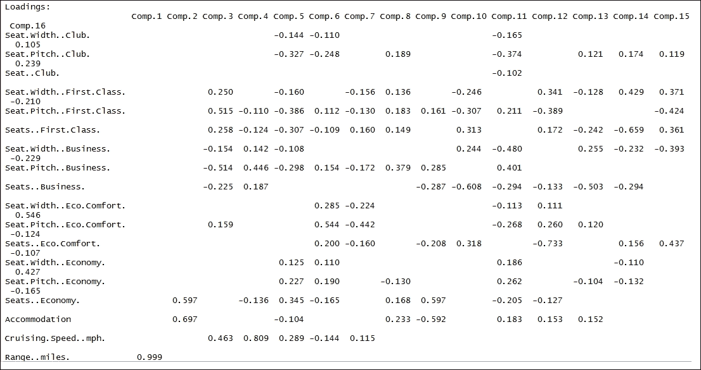

看第一列载荷，很明显，第一主成分只是里程，单位是英里。数据集中每个变量的规模是不同的。

在常规标度上绘制方差。`barplot()`绘制垂直和水平条形图。`sapply()`是一个包装函数，它返回一个长度与`delta.horiz=T`相同的列表，表示一个逻辑值，水平绘制条形，第一个在底部:

```
 > mar <- par()$mar
 > par(mar=mar+c(0,5,0,0))
 > barplot(sapply(delta, var), horiz=T, las=1, cex.names=0.8, main = "Regular Scaling of Variance", col = "Red", xlab = "Variance")

```

结果如下:

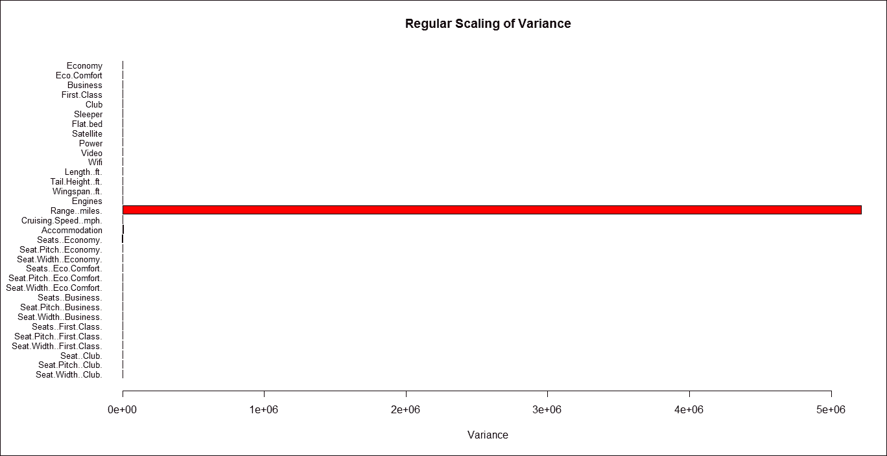

用对数标度绘制方差图。`barplot()`绘制垂直和水平条形图:

```
> barplot(sapply(delta, var), horiz=T, las=1, cex.names=0.8, log='x', main = "Logarithmic  Scaling of Variance", col = "Blue", xlab = "Variance")

```

结果如下:

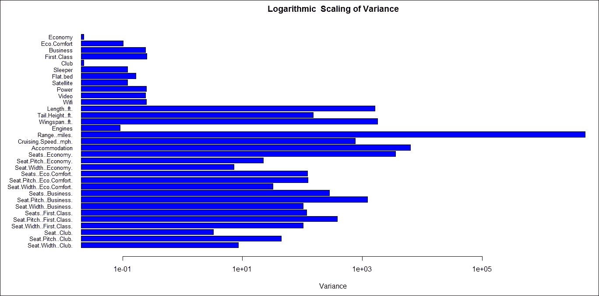

```
> par(mar=mar)

```

### 步骤 4 -缩放数据

在某些情况下，`delta`数据的缩放是有用的，因为变量跨越不同的范围。`scale()`作为函数居中和/或缩放`delta`矩阵的列。然后将结果存储在`delta2`数据帧中:

```
> delta2 <- data.frame(scale(delta))

```

验证方差是否一致:

```
> plot(sapply(delta2, var), main = "Variances Across Different Variables", ylab = "Variances")

```

结果如下:

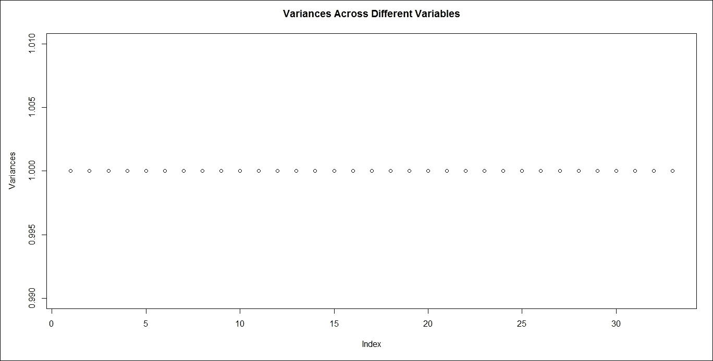

变量之间的方差现在是常数。

将主成分应用于缩放数据`delta2`。`princomp()`函数对`delta2`数据矩阵进行主成分分析。结果是`principal_comp_analysis`，它是类`princomp`的一个对象:

```
> principal_comp_analysis <- princomp(delta2)

```

绘制`principal_comp_analysis`对象:

```
> plot(principal_comp_analysis, main ="Principal Components Analysis of Scaled Data", col ="red")

```

结果如下:

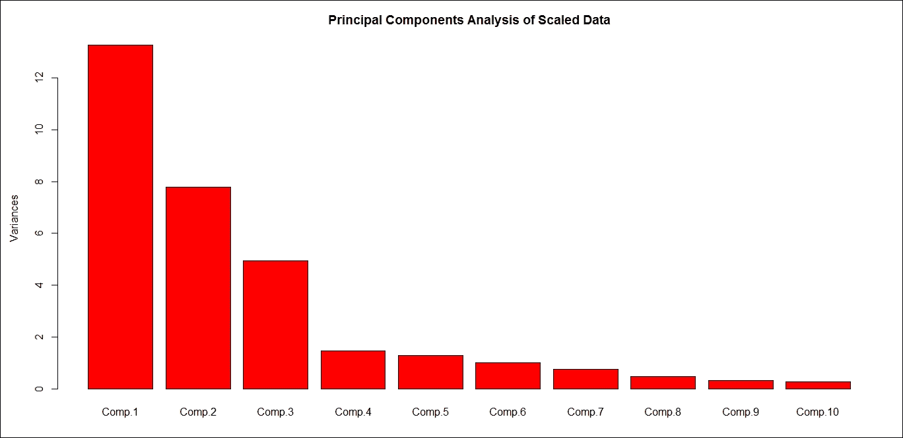

```
> plot(principal_comp_analysis, type='l', main ="Principal Components Analysis of Scaled Data")

```

结果如下:

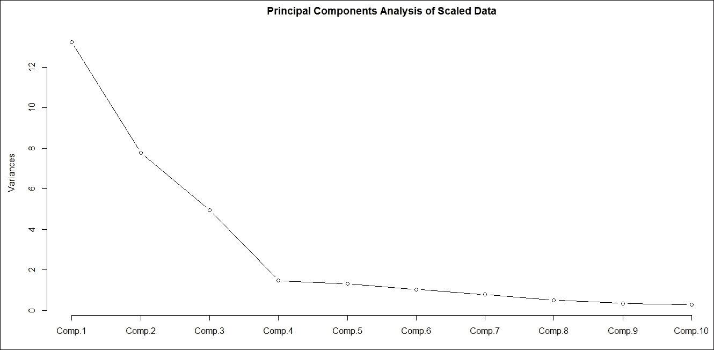

`summary()`函数用于生成各种模型拟合函数的结果汇总:

```
> summary(principal_comp_analysis)

```

结果如下:

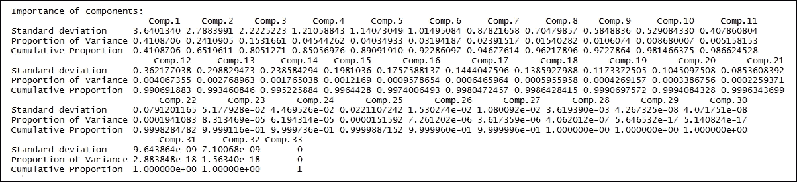

将主成分应用于缩放数据`delta2`。`prcomp()`功能对`delta2`数据矩阵进行主成分分析。结果是`principal_comp_analysis`，它是类`prcomp`的一个对象:

```
> principal_comp_vectors <- prcomp(delta2)

```

创建一个`principal_comp_vectors`的数据帧:

```
> comp <- data.frame(principal_comp_vectors$x[,1:4])

```

用`k = 4`应用 k 手段。`kmeans()`函数对 comp 执行 k-means 聚类。`nstart=25`表示要选择的随机组的数量。`iter.max=1000`是允许的最大迭代次数:

```
> k_means <- kmeans(comp, 4, nstart=25, iter.max=1000)

```

创建九种连续颜色的矢量:

```
> palette(alpha(brewer.pal(9,'Set1'), 0.5))

```

绘图排版:

```
> plot(comp, col=k_means$clust, pch=16)

```

结果如下:

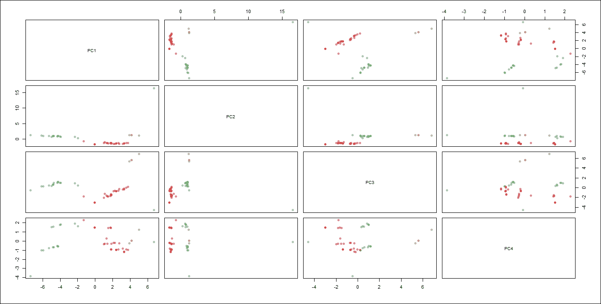

### 步骤 5 -在 3D 绘图中可视化

3D 出图`comp$PC1`、`comp$PC2`、`comp$PC3`:

```
> plot3d(comp$PC1, comp$PC2, comp$PC3, col=k_means$clust) 

```

结果如下:

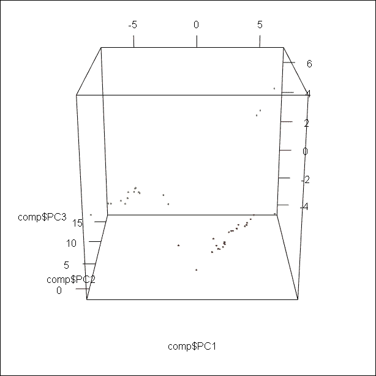

3D 绘图`comp$PC1`、`comp$PC3`、`comp$PC4`:

```
> plot3d(comp$PC1, comp$PC3, comp$PC4, col=k_means$clust)

```

结果如下:

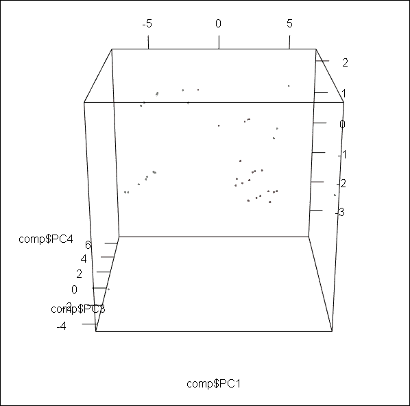

按照大小递增的顺序检查集群:

```
> sort(table(k_means$clust))

```

结果如下:

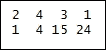

```
> clust <- names(sort(table(k_means$clust)))

```

第一个集群中显示的名称:

```
> row.names(delta[k_means$clust==clust[1],])

```

结果如下:

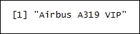

第二个集群中显示的名称:

```
> row.names(delta[k_means$clust==clust[2],])

```

结果如下:

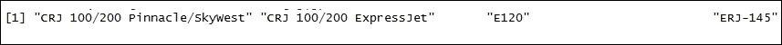

第三组中显示的名称:

```
> row.names(delta[k_means$clust==clust[3],])

```

结果如下:

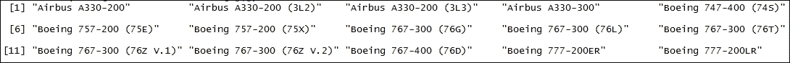

第四组中显示的姓名:

```
> row.names(delta[k_means$clust==clust[4],])

```

结果如下:

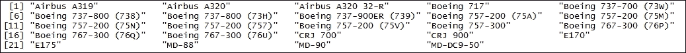<title>Principal component analysis - understanding world cuisine</title>

# 主成分分析-了解世界美食

食物是我们是谁的有力象征。有许多类型的食物标识，如种族、宗教和阶级标识。在有味觉的外国人面前，民族食物偏好成为身份标记，例如当一个人出国时，或者当那些外国人访问本国海岸时。

## 做好准备

为了执行主成分分析，我们将使用在 Epicurious 食谱数据集上收集的数据集。

### 步骤 1 -收集和描述数据

应使用名为`epic_recipes.txt`的数据集。数据集采用标准格式。

## 怎么做...

让我们进入细节。

### 第 2 步-探索数据

第一步是加载以下包:

```
> install.packages("glmnet") 
    > library(ggplot2)
    > library(glmnet)

```

### 注

版本信息:此页面的代码在 R 版本 3.3.2 中测试过(2016-10-31)

让我们探索数据，了解变量之间的关系。我们将从导入名为`epic_recipes.txt`的 TXT 数据文件开始。我们将把数据保存到`datafile`框架中:

```
> datafile <- file.path("d:","epic_recipes.txt")

```

读取表格格式的文件并从中创建数据框。`datafile`是文件名，作为输入传递:

```
> recipes_data <- read.table(datafile, fill=TRUE, col.names=1:max(count.fields(datafile)), na.strings=c("", "NA"), stringsAsFactors = FALSE)

```

### 步骤 3 -准备数据

将数据分成子集。`aggregate()`拆分`recipes_data[,-1]`并计算汇总统计数据。`recipes_data[,-1]`分组元素列表，每个只要数据框中的变量。然后将结果存储在`agg`数据帧中:

```
> agg <- aggregate(recipes_data[,-1], by=list(recipes_data[,1]), paste, collapse=",")

```

创建向量、数组或值列表:

```
> agg$combined <- apply(agg[,2:ncol(agg)], 1, paste, collapse=",")

```

替换所有出现的模式。`gsub()`作为功能在搜索`agg$combined`后用`""`替换每个`,NA`:

```
> agg$combined <- gsub(",NA","",agg$combined)

```

提取所有菜系的名称:

```
> cuisines <- as.data.frame(table(recipes_data[,1]))

```

打印美食数据框:

```
> cuisines

```

结果如下:

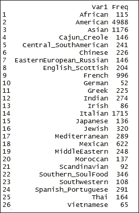

提取成分的频率:

```
 > ingredients_freq <- lapply(lapply(strsplit(a$combined,","), table), as.data.frame) 
 > names(ingredients_freq) <- agg[,1]

```

标准化配料的频率:

```
 > proportion <- lapply(seq_along(ingredients_freq), function(i) {
 + colnames(ingredients_freq[[i]])[2] <- names(ingredients_freq)[i]
 + ingredients_freq[[i]][,2] <- ingredients_freq[[i]][,2]/cuisines[i,2] 
 + ingredients_freq[[i]]}
 + )

```

26 种元素列表，每种菜系一种:

```
    > names(proportion) <- a[,1]
    > final <- Reduce(function(...) merge(..., all=TRUE, by="Var1"), proportion)
    > row.names(final) <- final[,1]
    > final <- final[,-1]
    > final[is.na(final)] <- 0
    > prop_matrix <- t(final)
    > s <- sort(apply(prop_matrix, 2, sd), decreasing=TRUE)

```

`scale()`功能居中和/或缩放`prop_matrix`矩阵的列。然后将结果存储在`final_impdata`框中:

```
 > final_imp <- scale(subset(prop_matrix, select=names(which(s > 0.1))))

```

正在创建热图。`final_imp`是作为输入传递的数据帧。`trace="none"`表示字符串，表示实线`"trace"`是跨行画还是列画，`"both"`还是`"none"`。`key=TRUE`值表示应该显示颜色键:

```
> heatmap.2(final_imp, trace="none", margins = c(6,11), col=topo.colors(7), key=TRUE, key.title=NA, keysize=1.2, density.info="none")

```

结果如下:

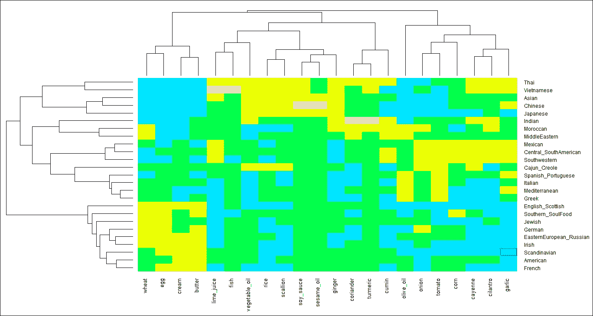

### 步骤 4 -应用主成分分析

将主成分分析应用于数据。`princomp()`对`final_imp`数据矩阵进行主成分分析。结果是`pca_computation`，它是类`princomp`的一个对象:

```
> pca_computation <- princomp(final_imp) 

```

打印`pca_computation`数据框:

```
> pca_computation

```

结果如下:

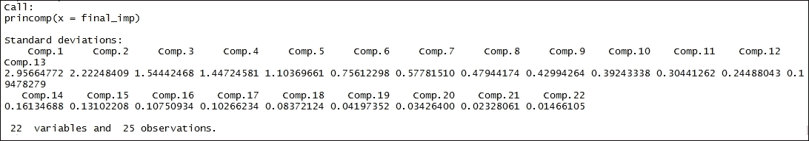

产生双标图。`pca_computation`是类`princomp`的对象。`pc.biplot=TRUE`表示它是一个主成分双标图:

```
> biplot(pca_computation, pc.biplot=TRUE, col=c("black","red"), cex=c(0.9,0.8), xlim=c(-2.5,2.5), xlab="PC1, 39.7%", ylab="PC2, 24.5%")

```

结果如下:

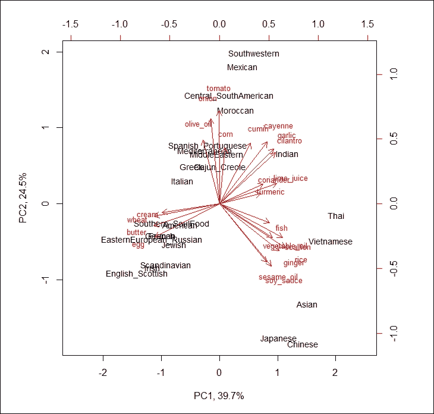