<title>Chapter 6. Supervised Learning</title>

# 第六章。监督学习

在本章中，我们将介绍以下配方:

*   决策树学习——胸痛患者的高级健康指导
*   决策树学习-基于收入的房地产价值分布
*   决策树学习-预测股票运动的方向
*   朴素贝叶斯-预测股票运动的方向
*   随机森林货币交易策略
*   支持向量机-货币交易策略
*   随机梯度下降-成人收入

# 简介

**决策树学习**:决策树是非常流行的分类和预测问题的工具。决策树是一个递归划分实例空间或变量集的分类器。决策树被表示为树结构，其中每个节点可以被分类为叶节点或决策节点。叶节点保存目标属性的值，而决策节点指定要在单个属性值上实现的规则。每个决策节点根据输入属性值的某个离散函数将实例空间分成两个或多个子空间。每个测试只考虑一个属性，因此实例空间根据属性值进行划分。在数值属性的情况下，条件是指一个范围。在决策节点上实现规则后，一个子树就是一个结果。每个叶节点保存概率向量，该概率向量指示目标属性具有某个值的概率。根据路径上的测试结果，通过将实例从树根向下导航到树叶来对实例进行分类。

使用决策树挖掘数据的关键要求如下:

*   **属性值描述**:对象可以表示为一组固定的属性或特性
*   **预定义类别**:样本被分配到的类别必须是监督数据
*   **充分数据**:使用多个训练案例

**朴素贝叶斯** : 朴素贝叶斯是一种监督学习方法。它是一个线性分类器。它基于贝叶斯定理，该定理指出一个类的特定特征的存在与任何其他特征的存在无关。这是一种稳健而有效的算法。贝叶斯分类器可以预测类成员概率，例如给定元组属于特定类的概率。贝叶斯信念网络是联合条件概率分布。它允许在变量子集之间定义类条件独立性。它提供了一个因果关系的图形模型，在此基础上可以进行学习。

**随机森林**:随机森林是决策树的集合，提供对数据结构的预测。它们是一种工具，可以在明智的随机化和集成学习中发挥多决策树的力量，以产生预测模型。它们为每个记录提供可变排名、缺失值、分段和报告，以确保深入理解数据。在构建了每棵树之后，所有的数据都沿着树向下运行。对于每对案例，计算邻域。如果两个案例占据相同的终端节点，则它们的邻域增加 1。在运行结束时，通过除以树的数量来进行归一化。邻近法用于替换缺失数据、定位异常值以及揭示数据的低维理解。训练数据是袋外数据，用于估计分类误差和计算变量的重要性。

随机森林在大型数据库上运行非常高效，产生准确的结果。它们在不删除的情况下处理多个变量，对变量的重要性进行估计，以解决分类问题。随着森林建设的进展，它们生成概化误差的内部无偏估计。随机森林是估计缺失数据的有效方法，并且在大部分数据缺失时保持准确性。

**支持向量机**:机器学习算法使用正确的特征集来解决学习问题。支持向量机利用(非线性)映射函数φ，该函数将输入空间中的数据转换为特征空间中的数据，使得问题可以线性分离。然后，SVM 发现最优分离超平面，然后通过φ-1 将其映射回输入空间。在可能的超平面中，我们选择超平面离最近的数据点的距离(边缘)尽可能大的一个。

<title>Decision tree learning - Advance Health Directive for patients with chest pain</title>

# 决策树学习——胸痛患者提前健康指导

预先健康指示文件规定了关于个人在各种医疗条件下的未来健康护理的方向。它指导个人在紧急情况下或必要时做出正确的决定。该文件帮助个人理解其医疗保健决定的性质和后果，理解指令的性质和效果，自由和自愿地做出这些决定，并以某种方式传达这些决定。

## 做好准备

为了执行决策树分类，我们将使用从心脏病患者数据集收集的数据集。

### 步骤 1 -收集和描述数据

将使用 CSV 格式的名为`Heart.csv`的数据集。数据集采用标准格式。有 303 行数据。有 15 个变量。数字变量如下:

*   `Age`
*   `Sex`
*   `RestBP`
*   `Chol`
*   `Fbs`
*   `RestECG`
*   `MaxHR`
*   `ExAng`
*   `Oldpeak`
*   `Slope`
*   `Ca`

非数字变量如下:

*   `ChestPain`
*   `Thal`
*   `AHD`

## 怎么做...

让我们进入细节。

### 第 2 步-探索数据

作为要执行的第一步，需要加载以下软件包:

```
> install.packages("tree")
> install.packages("caret")
> install.packages("e1071")
> library(tree)
> library(caret)

```

### 注意

版本信息:此页面的代码在 R 版本 3.3.0 中进行了测试(2016-05-03)。

让我们探索数据，了解变量之间的关系。我们将从导入名为`Heart.csv`的 CSV 数据文件开始。我们将把数据保存到`AHD_data`数据框:

```
    > AHD_data <- read.csv("d:/Heart.csv", header = TRUE)

```

探索`AHD_data`数据帧的内部结构。`str()`功能显示数据帧的内部结构。`AHD_data`作为 R 对象传递给`str()`函数:

```
> str(AHD_data) 

```

结果如下:

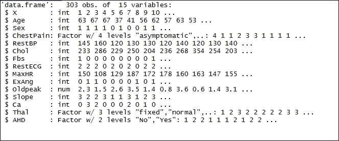

打印`AHD_data`数据框。`head()`函数返回`AHD_data`数据帧的第一部分。`AHD_data`数据帧作为输入参数传递:

```
    > head(AHD_data)

```

结果如下:

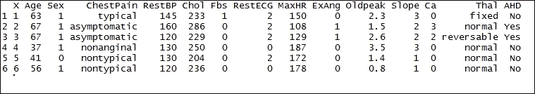

探索`AHD_data`数据框的尺寸。`dim()`函数返回`AHD_data`框架的尺寸。`AHD_data`数据帧作为输入参数传递。结果清楚地表明有 303 行数据和 15 列:

```
    >dim(AHD_data)

```

结果如下:

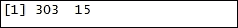

### 步骤 3 -准备数据

需要为执行模型建立和测试准备数据。数据分为两部分——一部分用于构建模型，另一部分用于测试将要准备的模型。

`createDataPartition()`函数用于创建数据分割。`AHD_data`作为参数传递给函数。随机抽样发生。用于训练的数据百分比用`p`表示。这里，`p`的值是`0.5`，这意味着 50%的数据用于训练。`List = 'FALSE'`避免以列表形式返回数据。然后将结果存储在数据帧分割中:

```
    > split <- createDataPartition(y=AHD_data$AHD, p = 0.5, list=FALSE)

```

对数据框`split`的调用显示了用于训练目的的训练集数据:

```
    > split

```

结果如下:

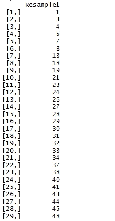

将创建训练数据。`split`数据帧用于创建训练数据。`train`数据帧用于存储训练数据的值:

```
    > train <- AHD_data[split,]

```

打印训练数据框:

```
    > train

```

结果如下:


将创建测试数据。`split`数据框用于创建测试数据。`split`数据帧前的`-`符号表示所有未被考虑用于训练目的的数据行。测试数据帧用于存储测试数据的值:

```
    > test <- AHD_data[-split,]

```

打印测试数据帧:

```
    > test

```

结果如下:

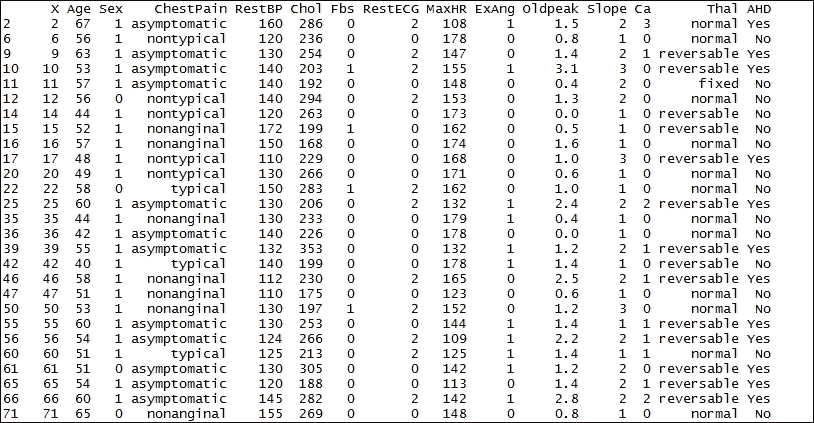

### 第 4 步-训练模型

现在将在训练数据集上准备和训练模型。与调查数字响应及其与一组描述符变量的关系相比，当数据集被分组时，使用决策树。使用`tree()`函数实现 R 中的分类树。

`tree()`函数用于实现分类树。树是通过二进制递归划分生长的。训练数据集上的`AHD`字段用于形成分类树。结果数据帧存储在`trees`数据帧中:

```
    > trees <- tree(AHD ~., train)

```

将显示树木数据框的图形版本。`plot()`功能是绘制 R 对象的通用功能。树数据框作为函数值传递:

```
    > plot(trees)

```

结果如下:

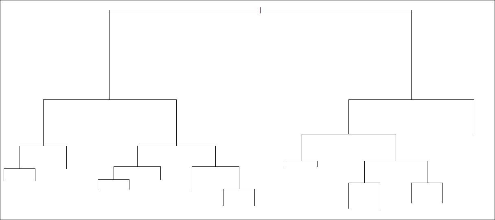

通过交叉验证实验找出偏差或错误分类的数量。将使用`cv.tree()`功能。`trees`数据框对象通过。`FUN=prune.misclass`通过递归截取最不重要的分割，获得所提供数据帧树的嵌套子树序列。结果存储在`cv.trees`数据帧中:

```
    > cv.trees <- cv.tree(trees, FUN=prune.misclass)

```

打印数据框`cv.trees`的结果:

```
    > cv.trees

```

`$dev`字段给出了每个 k 的偏差。

结果如下:

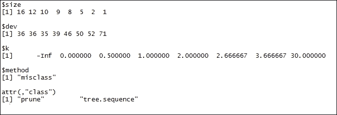

使用`plot()`功能数据框，显示`cv.trees`。`$dev`值在 *y* 轴上(右侧)。`$k`值在最上面。`$size`值在 *x* 轴上。

可以清楚的看到，当`$size = 1`、`$k = 30.000000`、`$dev = 1`时。我们使用以下公式绘制数据框:

```
    > plot(cv.trees)

```

结果如下:

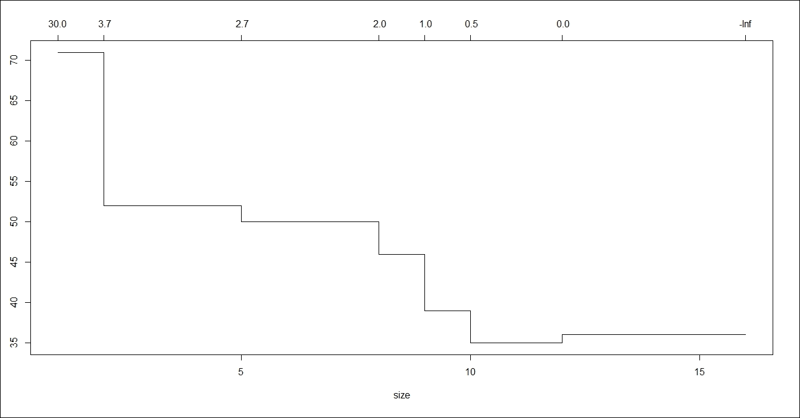

### 第五步——改进模型

让我们通过分裂具有最低偏差的树来改进模型。调用`prune.misclass()`函数来分割树。`prune.misclass`通过递归截取最不重要的分割，获得所提供数据帧树的嵌套子树序列。结果存储在`prune.trees`数据帧中。`best=4`表示要返回的成本复杂度序列中特定子树的大小(例如，终端节点数):

```
    > prune.trees <- prune.misclass(trees, best=4)

```

使用`plot()`功能数据框，显示`prune.trees`:

```
    > plot(prune.trees)

```

结果如下:

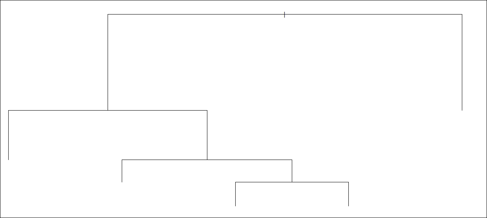

将文本添加到先前修剪的树中:

```
    > text(prune.trees, pretty=0)

```

结果如下:

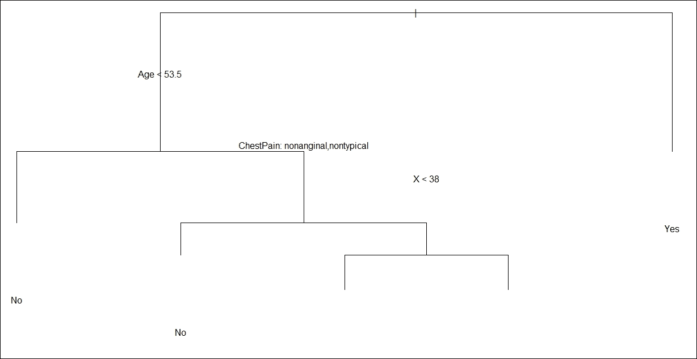

为了预测基于线性模型对象的值，我们将使用`predict()`函数。`prune.trees`作为对象传递。`test`数据对象作为一个对象传递，在其中查找要预测的变量。结果将存储在`tree.pred`数据框中:

```
    > tree.pred <- predict(prune.trees, test, type='class')

```

显示变量`test.pred`的值:

```
    > tree.pred

```

结果如下:

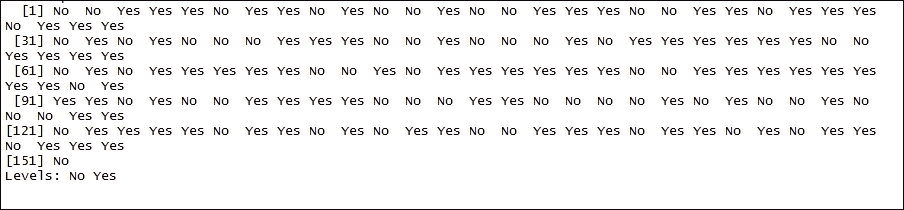

总结模型的结果。`confusionMatrix()`计算观察类和预测类的交叉列表。`tree.pred`是作为预测类的因素传递的:

```
    > confusionMatrix(tree.pred, test$AHD)

```

结果如下:

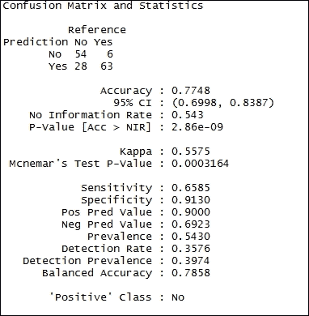<title>Decision tree learning - income-based distribution of real estate values</title>

# 决策树学习-基于收入的房地产价值分布

收入一直是房地产作为一种资产类别提供的有吸引力的长期总回报的重要组成部分。投资房地产产生的年收益回报是股票和滞后债券的 2.5 倍以上，仅高出 50 个基点。基于租户支付的租金，房地产通常提供稳定的收入来源。

## 做好准备

为了执行决策树分类，我们将使用从房地产数据集收集的数据集。

### 步骤 1 -收集和描述数据

将使用名为`RealEstate.txt`的数据集。该数据集以 TXT 格式提供，标题为`RealEstate.txt`。数据集采用标准格式。有 20，640 行数据。9 个数值变量如下:

*   `MedianHouseValue`
*   `MedianIncome`
*   `MedianHouseAge`
*   `TotalRooms`
*   `TotalBedrooms`
*   `Population`
*   `Households`
*   `Latitude`
*   `Longitude`

## 如何去做...

让我们进入细节。

### 第 2 步-探索数据

作为要执行的第一步，需要加载以下软件包:

```
    > install.packages("tree")

```

### 注意

版本信息:此页面的代码在 R 版本 3.3.0 中进行了测试(2016-05-03)。

让我们探索数据，了解变量之间的关系。我们将从导入名为`RealEstate.txt`的 TXT 数据文件开始。我们将把数据保存到`realEstate`数据框:

```
    > realEstate <- read.table("d:/RealEstate.txt", header=TRUE)

```

探索`realEstate`数据框的尺寸。`dim()`函数返回`realEstate`框架的尺寸。`realEstate`数据帧作为输入参数传递。结果清楚地表明有 20，640 行数据和 9 列:

```
    > dim(realEstate)

```

结果如下:

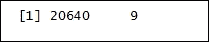

探索`realEstate`数据帧的内部结构。`str()`功能显示数据帧的内部结构。`realEstate`作为 R 对象传递给`str()`函数:

```
    > str(realEstate)

```

结果如下:

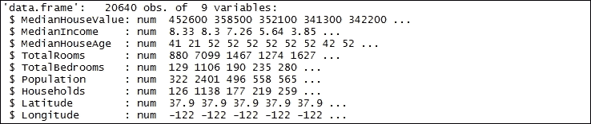

打印`realEstate`数据框。`head()`函数返回`realEstate`数据帧的第一部分。`realEstate`数据帧作为输入参数传递:

```
    > head(realEstate)

```

结果如下:

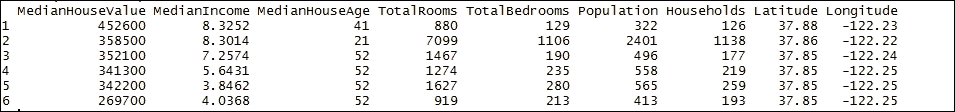

打印`realEstate`数据帧的摘要。`summary()`功能是多功能功能。`summary()`是一个通用函数，提供与单个对象或数据帧相关的数据汇总。`realEstate`数据帧作为 R 对象传递给`summary()`函数:

```
    > summary(realEstate)

```

结果如下:

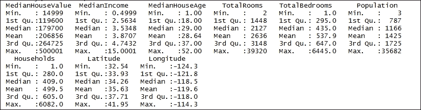

### 第 3 步-训练模型

现在将在数据集上准备模型。决策树是一种分类和预测的工具。它们代表了人类可以理解的规则，并用于知识系统，如数据库。他们通过从树的根开始并穿过它直到到达一个叶节点来分类实例。节点指定对单个属性的测试，叶子指示目标属性的值，而边则分离出一个属性。

`tree()`函数用于实现分类树。树是通过二进制递归划分生长的。这些模型是计算密集型技术，因为它们基于响应变量与一个或多个预测变量的关系递归地将响应变量划分为子集。

公式表达式基于变量`Latitude`和`Longitude`的总和。求和的结果存储在`MedianHouseValue`的对数值中。`data=realEstate`表示优先解释公式、权重和子集的数据框架。

结果数据帧存储在数据帧`treeModel`中:

```
> treeModel <- tree(log(MedianHouseValue) ~ Longitude + Latitude, data=realEstate) 

```

将显示`treeModel`的摘要。该摘要显示所使用的公式，以及树中的终端节点或叶子的数量。还显示了残差的统计分布。

`summary()`功能用于显示`treeModel`的统计汇总。它是一个通用工具，用于生成各种拟合函数的结果汇总。需要汇总的数据帧是作为输入参数传递的`treeModel`。

这里的偏差是指均方误差:

```
    > summary(treeModel)

```

结果如下:

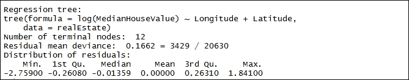

将显示`treeModel`数据框的图形版本。`plot()`功能是用于绘制 R 对象的通用功能。`treeModel`数据帧作为函数值传递:

```
> plot(treeModel) 

```

结果如下:

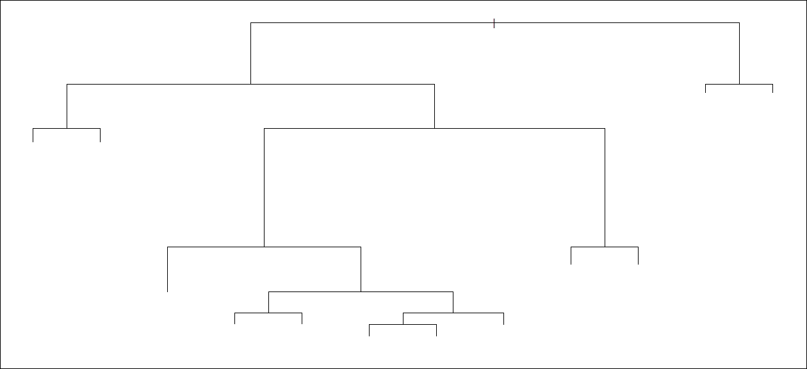

显示`treeModel`数据框的图形版本后，需要插入文本以显示每个节点和叶子的值。`text()`函数用于在给定坐标处插入标签向量中给定的字符串:

```
    > text(treeModel, cex=.75)

```

结果如下:

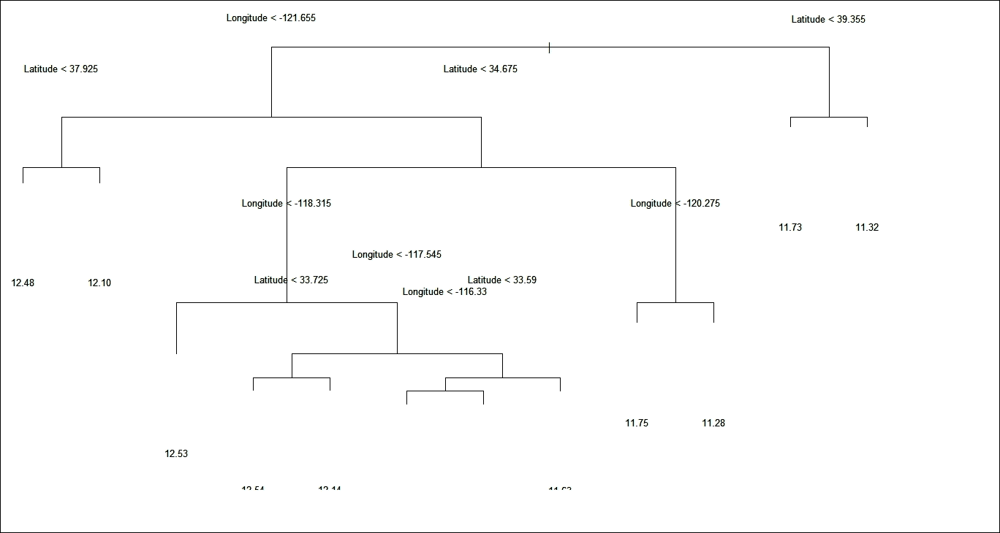

### 第 4 步-比较预测

将预测与反映全球价格趋势的数据集进行比较。我们希望总结`MedianHouseValue`的频率分布，以便于报告或比较。最直接的方法是使用分位数。分位数是分布中与该分布中值的等级顺序相关的点。分位数将划分`MedianHouseValue`分布，使得分位数以下有给定比例的观察值。

`quantile()`函数产生对应于给定概率的样本分位数。`realEstate$MedianHouseValue`是需要其样本分位数的数值向量。`quantile()`函数返回`priceDecilesas`一个长度向量:

```
    > priceDeciles <- quantile(realEstate$MedianHouseValue, 0:10/10)

```

显示`priceDeciles`数据帧的值:

```
    > priceDeciles

```

结果如下:

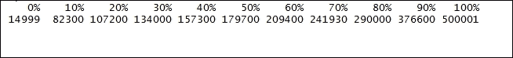

接下来，将显示`priceDeciles`的摘要。`summary()`功能用于显示`priceDeciles`的统计汇总。需要汇总的数据帧是作为输入参数传递的`priceDeciles`:

```
    > summary(priceDeciles)

```

结果如下:

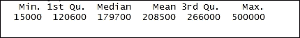

将`priceDeciles`向量分成不同的范围。`cut()`功能根据音程所属的音程来划分音程的范围。`realEstate`数据帧的数值矢量`MedianHouseValue`将通过切割转换成一个因子:

```
    > cutPrices <- cut(realEstate$MedianHouseValue, priceDeciles, include.lowest=TRUE)

```

打印`cutPrices`数据帧。`head()`函数返回`cutPrices`数据帧的第一部分。`cutPrices`数据帧作为输入参数传递:

```
    > head(cutPrices)

```

结果如下:

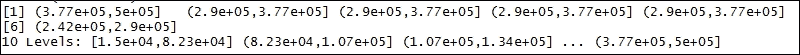

将显示`cutPrices`的摘要。`summary()`功能用于显示`treeModel`的统计汇总。需要汇总的数据帧是`cutPrices`，作为输入参数传递:

```
    > summary(cutPrices)

```

结果如下:

绘制`cutPrices`的值。`plot()`函数是绘制 R 对象的通用函数。`cutPrices`数据帧作为函数值传递。`realEstate`数据集的经度变量代表图中点的 *x* 坐标。`realEstate`数据集的纬度变量代表图中点的 *y* 坐标。`col=grey(10:2/11)`代表地块颜色。`pch=20`表示在绘图点中用作默认值的符号的大小。`xlab="Longitude"`代表 x 轴的标题，而`ylab="Latitude"`代表 *y* 轴的标题:

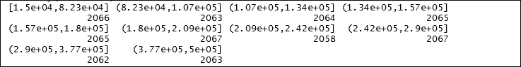

结果如下:

Plotting the value of the `cutPrices`. The `plot()` function is a generic function for the plotting of R objects. The `cutPrices` data frame is passed as a function value. The longitude variable of the `realEstate` dataset represents the *x* coordinates of points in the plot. The latitude variable of the `realEstate` dataset represents the *y* coordinates of points in the plot. `col=grey(10:2/11)` represents the plot color. `pch=20` represents the size of the symbol to be used as the default in plotting points. `xlab="Longitude"` represents the title for the x axis, while `ylab="Latitude"` represents the title for the *y* axis:

```
> plot(realEstate$Longitude, realEstate$Latitude, col=grey(10:2/11)[cutPrices], pch=20, xlab="Longitude",ylab="Latitude") 

```

The result is as follows:

将显示`Longitude`的摘要。`summary()`功能用于显示统计摘要:

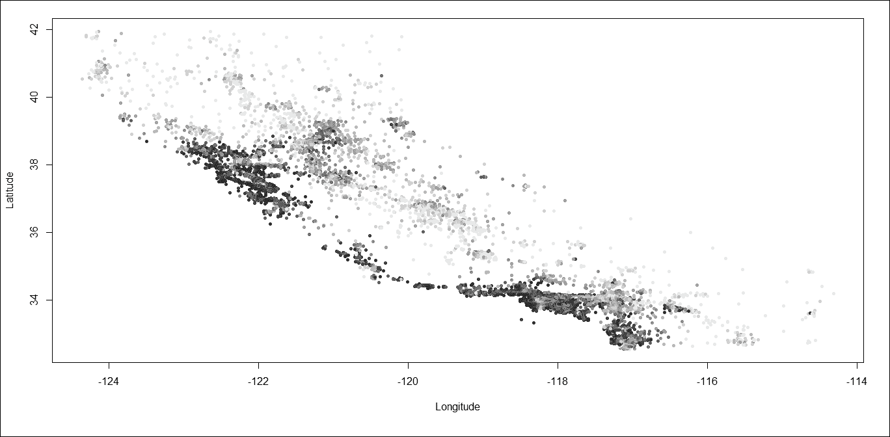

结果如下:

A summary of `Longitude` will be displayed. The `summary()` function is used to display the statistical summary:

```
    > summary(realEstate$Longitude)

```

The result is as follows:

打印`Longitude`数据帧。`head()`函数返回`Longitude`数据帧的第一部分:

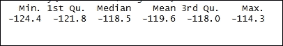

结果如下:

Printing the `Longitude` data frame. The `head()` function returns the first part of the `Longitude` data frame:

```
    > head(realEstate$Longitude)

```

The result is as follows:

将显示`Latitude`的摘要。`summary()`功能用于显示统计摘要:

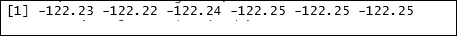

结果如下:

A summary of `Latitude` will be displayed. The `summary()` function is used to display the statistical summary:

```
    > summary(realEstate$Latitude)

```

The result is as follows:

打印`Latitude`数据帧。`head()`函数返回`Latitude`数据帧的第一部分:

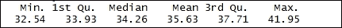

结果如下:

Printing the `Latitude` data frame. The `head()` function returns the first part of the `Latitude` data frame:

```
    > head(realEstate$Latitude)

```

The result is as follows:

`partition.tree()`函数用于划分包含两个或更多变量的树。`treeModel`作为树对象传递。`ordvars=c("Longitude","Latitude")`表示变量用于绘图的顺序。经度代表 *x* 轴，而`Latitude`代表 y 轴。`add=TRUE`表示在现有地块上增加:

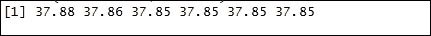

结果如下:

The `partition.tree()` function is used to partition a tree where two or more variables are involved. `treeModel` is passed as a tree object. `ordvars=c("Longitude","Latitude")` indicates the ordering in which the variables are to be used to plot. Longitude represents the *x* axis, while `Latitude` represents the y axis. `add=TRUE` means adding to the existing plot:

```
    > partition.tree(treeModel, ordvars=c("Longitude","Latitude"), add=TRUE)

```

The result is as follows:

第 5 步-改进模型

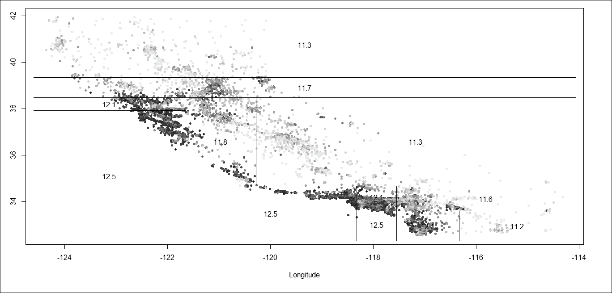

一棵树的叶子数量控制着树的灵活性。叶子的数量表明它们将树分成了多少个单元。每个节点必须包含一定数量的点，增加一个节点必须至少减少一定数量的误差。`min.dev`的默认值为 0.01。

### 接下来，我们将把`min.dev`的值减小到 0.001。

`tree()`函数用于实现分类树。公式表达式基于变量`Latitude`和`Longitude`的总和。求和的结果存储在`MedianHouseValue`的对数值中。`data=realEstate`表示优先解释公式、权重和子集的数据框架。`min.dev`的值表示偏差，对于要分裂的节点，该偏差必须至少是根节点的 0.001 倍。

结果数据帧存储在`treeModel2`数据帧中:

将显示`treeModel2`的摘要。该摘要显示所使用的公式，以及树中的终端节点或叶子的数量。还显示了残差的统计分布。

`summary()`功能用于显示`treeModel2`的统计汇总。需要汇总的数据帧是作为输入参数传递的`treeModel2`。

```
    > treeModel2 <- tree(log(MedianHouseValue) ~ Longitude + Latitude, data=realEstate, mindev=0.001)

```

这里的偏差是指均方误差:

结果如下:

Deviance here means the mean squared error:

```
    > summary(treeModel2)

```

The result is as follows:

与`treeModel`的总结相比，`treeModel2`中的叶子值从 12 增加到 68。`treeModel`和`treeModel2`的偏差值分别从 0.1666 变为 0.1052。

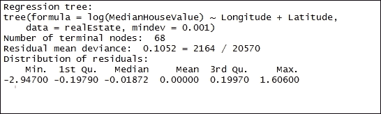

将显示`treeModel2`数据框的图形版本。`plot()`功能是绘制 R 对象的通用功能。`treeModel2`数据帧作为函数值传递:

结果如下:

A graphical version of the `treeModel2` data frame will be displayed. The `plot()` function is a generic function for plotting R objects. The `treeModel2` data frame is passed as a function value:

```
    > plot(treeModel2)

```

The result is as follows:

显示`treeModel2`数据框的图形版本后，需要插入文本以显示每个节点和叶子的值。`text()`函数用于在给定坐标处插入矢量标签中给定的字符串:

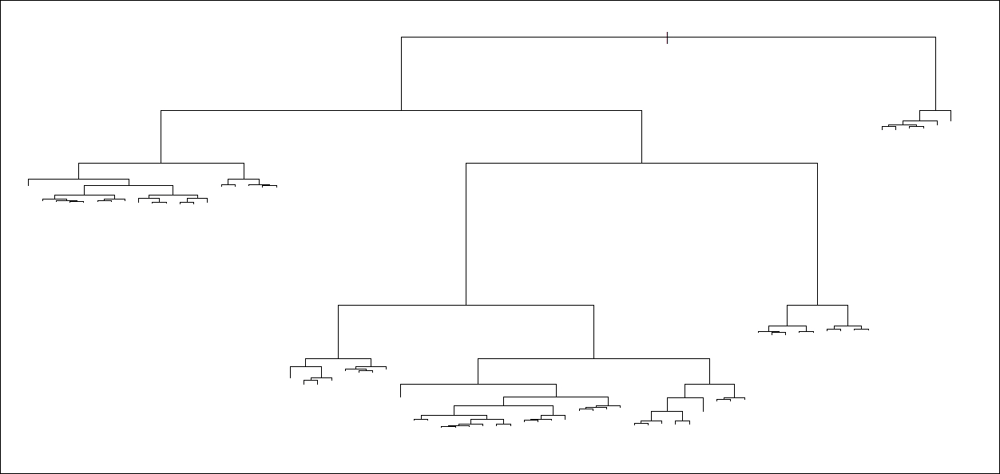

结果如下:

After the graphical version of the `treeModel2` data frame is displayed, text needs to be inserted to display the value at each node and the leaves. The `text()` function is used to insert strings given in the vector labels at the given coordinates:

```
    > text(treeModel2, cex=.65)

```

The result is as follows:

包括公式扩展中的所有变量。

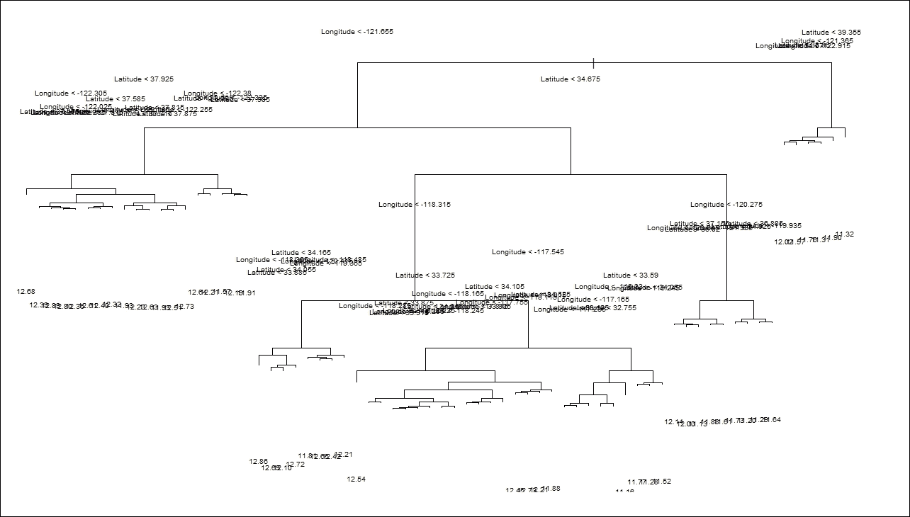

`tree()`函数用于实现分类树。公式表达式基于所有变量。

产生的数据帧存储在`treeModel3`数据帧中:

将显示`treeModel3`的摘要。该摘要显示了所使用的公式以及树中终端节点或叶子的数量。还显示了残差的统计分布。

`summary()`功能用于显示`treeModel3`的统计汇总。需要汇总的数据帧是作为输入参数传递的`treeModel3`。

```
    > treeModel3 <- tree(log(MedianHouseValue) ~ ., data=realEstate)

```

这里的偏差是指均方误差:

结果如下:

Deviance here means the mean squared error:

```
    > summary(treeModel3)

```

The result is as follows:

该公式清楚地说明了`realEstate`数据集的所有变量。

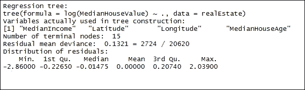

将显示一个图形版本的`treeModel3`数据框。`plot()`功能是用于绘制 R 对象的通用功能。`treeModel3`数据帧作为函数值传递:

结果如下:

A graphical version of `treeModel3` data frame will be displayed. The `plot()` function is a generic function for plotting R objects. The `treeModel3` data frame is passed as a function value:

```
    > plot(treeModel3)

```

The result is as follows:

在显示了图形版本的`treeModel3`数据框之后，需要插入文本来显示每个节点和叶子的值。`text()`函数用于在给定坐标处插入矢量标签中给定的字符串:

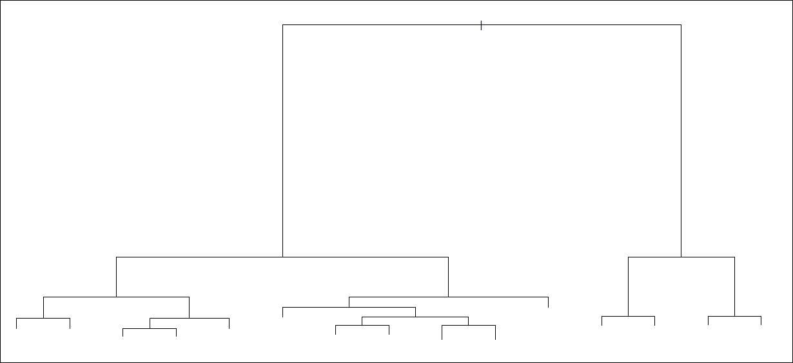

结果如下:

After a graphical version of the `treeModel3` data frame is displayed, text needs to be inserted to display the value at each node and the leaves. The `text()` function is used to insert strings given in the vector labels at the given coordinates:

```
    > text(treeModel3, cex=.75)

```

The result is as follows:

决策树学习-预测股票走势

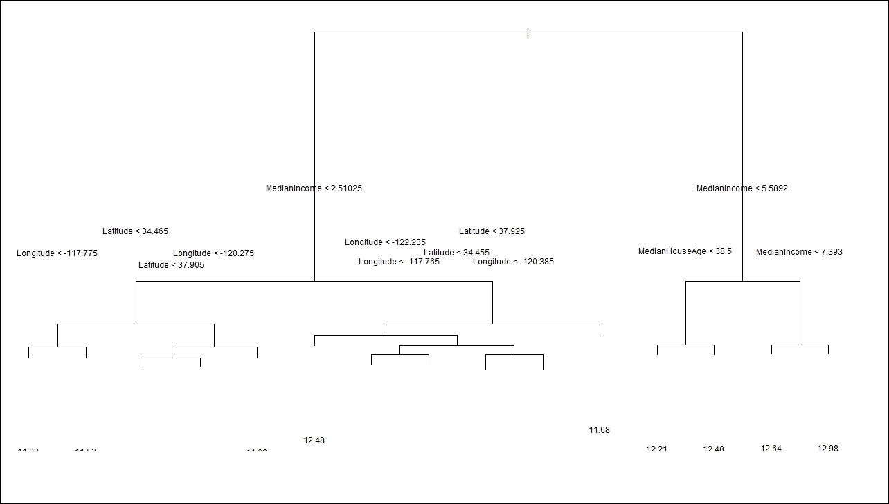

股票交易是统计学家试图解决的最具挑战性的问题之一。有多种技术指标，例如趋势方向、市场中的动量或缺乏动量、潜在利润的波动性以及监控市场中受欢迎程度的成交量指标，等等。这些指标可用于创建高概率交易机会的策略。几天/几周/几个月可以用来发现技术指标之间的关系。可以使用一种高效且耗时较少的工具，例如决策树。决策树的主要优势在于它是一种强大且易于解释的算法，这为我们提供了一个良好的开端。

<title>Decision tree learning - predicting the direction of stock movement</title>

# 做好准备

为了执行决策树分类，我们将使用从股票市场数据集中收集的数据集。

## 步骤 1 -收集和描述数据

要使用的数据集是美国银行在 2012 年 1 月 1 日^(到 2014 年 1 月 1 日^(之间的每日收盘价。这个数据集可以在 https://yahoo.com/上免费获得，我们将从那里下载数据。))

### 怎么做...

让我们进入细节。

## 第 2 步-探索数据

作为要执行的第一步，需要加载以下软件包:

### 注

版本信息:此页面的代码在 R 版本 3.3.0 中进行了测试(2016-05-03)。

```
> install.packages("quantmod")
> install.packages("rpart")
> install.packages("rpart.plot")

```

### 需要安装上述每个库:

让我们下载数据。我们将从标记需要数据的时间段的开始和结束日期开始。

`as.Date()`函数用于转换字符表示和代表日历日期的`Date`类的对象。

```
> library("quantmod")
> library("rpart")
> library("rpart.plot")

```

数据集的开始日期存储在`startDate`中，它代表日历日期的字符向量表示。表示格式为 *YYYY-MM-DD* :

数据集的结束日期存储在`endDate`中，它代表日历日期的字符向量表示。表示格式为 *YYYY-MM-DD* :

使用`getSymbols()`功能加载数据。该函数从本地或远程的多个源加载数据。数据被提取并保存在指定的`env`中。`env`的默认值为`.GlobalEnv`。`BAC`是指定要加载的符号名称的字符向量。`src = yahoo`指定采购方法:

```
    > startDate = as.Date("2012-01-01")

```

步骤 3 -计算指标

```
    > endDate = as.Date("2014-01-01")

```

计算相对强度指数。它是最近价格上升运动与绝对价格运动的比率。`RSI()`功能用于计算相对强度指数。`BAC`符号用作价格系列。`n = 3`代表移动平均线的周期数。然后将结果存储在`relativeStrengthIndex3`数据帧中:

```
    > getSymbols("BAC", env = .GlobalEnv,  src = "yahoo", from = startDate, to = endDate)

```

### 显示`relativeStrengthIndex3`值:

结果如下:

```
> relativeStrengthIndex3 <- RSI(Op(BAC), n= 3) 

```

Displaying the `relativeStrengthIndex3` value:

```
    > relativeStrengthIndex3

```

The result is as follows:

计算移动平均数。**指数移动平均线**用于技术分析，作为技术指标。在**简单移动平均线**中，序列中的每个值具有相同的权重。时间序列之外的值不包括在平均值中。但是，指数移动平均线是一种累积计算，包括所有数据。过去的数据值逐渐减少，而最近的数据值贡献更大。

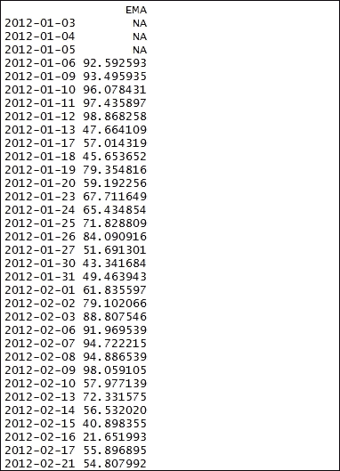

`EMA()`使用`BAC`符号，并用作价格系列。`n = 5`代表平均结束的时间周期。然后将结果存储在`exponentialMovingAverage5`数据帧中:

显示`exponentialMovingAverage5`值:

结果如下:

```
    > exponentialMovingAverage5 <- EMA(Op(BAC),n=5)

```

探索`exponentialMovingAverage5`数据框的维度。`dim()`函数返回`exponentialMovingAverage5`框架的尺寸。`exponentialMovingAverage5`数据帧作为输入参数传递。结果清楚地表明有 502 行数据和 1 列:

```
    > exponentialMovingAverage5

```

结果如下:

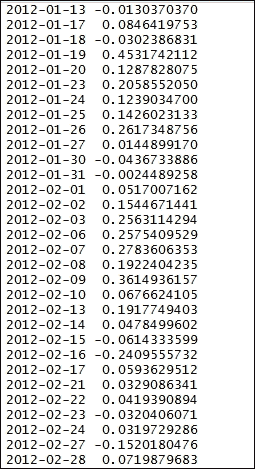

探索`exponentialMovingAverage5`数据框的内部结构。`str()`功能显示数据帧的内部结构。`exponentialMovingAverage5`作为 R 对象传递给`str()`函数:

```
    > dim(exponentialMovingAverage5)

```

结果如下:

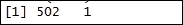

计算价格和我们计算出的`exponentialMovingAverage5`之间的差异，例如，五年指数移动平均值。结果存储在`exponentialMovingAverageDiff`数据帧中:

```
    > str(exponentialMovingAverage5)

```

比较 BAC 系列的快速移动平均线和 BAC 系列的慢速移动平均线。`BAC`作为价格矩阵传递。`fast = 12`代表快速移动平均线的周期，`slow = 26`代表慢速移动平均线的周期，`signal = 9`代表移动平均线的信号:

显示 MACD 值:

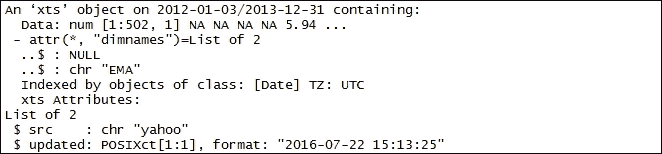

结果如下:

Calculating the difference between the price and our calculated `exponentialMovingAverage5`, for example, the five-year exponential moving average values. The result is stored in the `exponentialMovingAverageDiff` data frame:

```
    > exponentialMovingAverageDiff <- Op(BAC)-exponentialMovingAverage5

```

Comparing the fast-moving average of a BAC series with a slow-moving average of a BAC series. `BAC` is passed as the price matrix. `fast = 12` represents the periods for fast-moving average, `slow = 26` represents the periods for slow-moving average, `signal = 9` represents the signal for moving average:

```
    > MACD <- MACD(Op(BAC),fast = 12, slow = 26, signal = 9)

```

打印 MACD 数据框。`head()`函数返回`MACD`数据帧的第一部分。`MACD`数据帧作为输入参数传递:

```
    > MACD

```

结果如下:

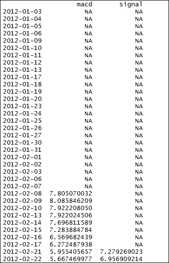

抓住信号线作为指示器。结果存储在`MACDsignal`数据帧中:

```
    > head(MACD)

```

显示`MACDsignal`值:

结果如下:

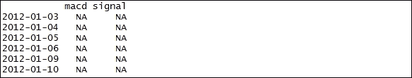

Grabbing the signal line to use as an indicator. The result is stored in the `MACDsignal` data frame:

```
    > MACDsignal <- MACD[,2]

```

确定接近高/低范围的中点。为了确定每天收盘价相对于高/低区间的位置，使用了随机振荡指标。`SMI()`功能用于动量指示器。

```
    > MACDsignal

```

`BAC`是包含高-低-收盘价的矩阵。`n = 13`表示期数。`slow=25`表示双重平滑的周期数。`fast=2`表示初始平滑的周期数。`signal=9`表示信号线的周期数。结果存储在`stochasticOscillator`数据框中:

显示`stochasticOscillator`值:

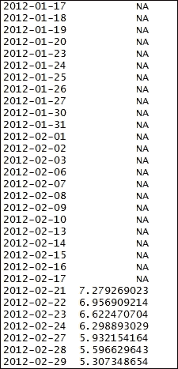

结果如下:

抓住振荡器作为指示器。结果存储在`stochasticOscillatorSignal`数据帧中:

显示`stochasticOscillatorSignal`值:

```
    > stochasticOscillator <- SMI(Op(BAC),n=13,slow=25,fast=2,signal=9)

```

结果如下:

```
    > stochasticOscillator

```

The result is as follows:

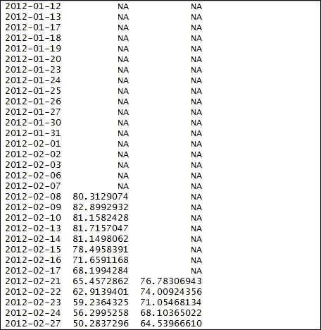

步骤 4 -准备变量以构建数据集

计算收盘价和开盘价之间的差额。`Cl`代表收盘价，`Op`代表开盘价。结果存储在`PriceChange`数据框中:

```
    > stochasticOscillatorSignal <- stochasticOscillator[,1]

```

显示`PriceChange`值:

```
    > stochasticOscillatorSignal

```

结果如下:

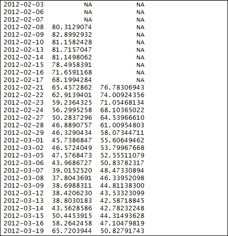

### 创建二元分类变量。`ifelse()`函数使用一个测试表达式来返回值，该值本身是一个向量，并且与测试表达式的长度相同。如果`test`表达式`is TRUE`的对应值，则返回的向量具有来自`x`的元素；如果`test`表达式`is FALSE.`的对应值，则返回来自`y`的元素

这里，`PriceChange>0`是测试函数，要在逻辑模式下测试。`UP`和`DOWN`执行逻辑测试。然后将结果存储在`binaryClassification`数据帧中:

```
    > PriceChange <- Cl(BAC) - Op(BAC)

```

显示`binaryClassification`值:

```
    > PriceChange

```

结果如下:

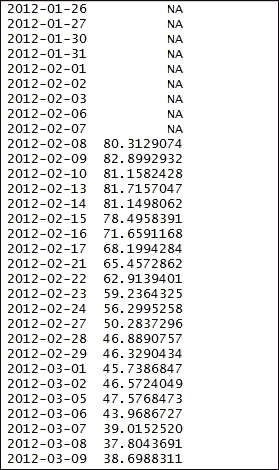

探索`binaryClassification`数据帧的内部结构。`str()`功能显示数据帧的内部结构。`binaryClassification`作为 R 对象传递给`str()`函数:

结果如下:

```
    > binaryClassification <- ifelse(PriceChange>0,"UP","DOWN")

```

Displaying the `binaryClassification` value:

```
    > binaryClassification

```

The result is as follows:

创建要使用的数据集。`data.frame()`函数用于根据一组紧密耦合的变量创建数据框。这些变量共享矩阵的属性。作为参数传递给`data.frame()`的变量有`relativeStrengthIndex3`、`exponentialMovingAverageDiff`、`MACDsignal`、`stochasticOscillator`和`binaryClassification`。

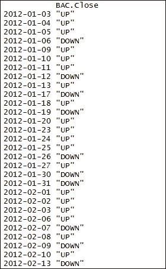

然后将结果存储在`DataSet`数据帧中:

显示`DataSet`值:

```
    > str(binaryClassification)

```

结果如下:

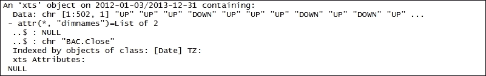

打印`DataSet`数据帧。`head()`函数返回`DataSet`数据帧的第一部分。`DataSet`数据帧作为输入参数传递:

结果如下:

```
> AAPLDataSetNew >-
data.frame(weekDays,exponentialMovingAverageDiffRound,
binaryClassification) 

```

探索`DataSet`数据帧的内部结构。`str()`功能显示数据帧的内部结构。`DataSet`作为 R 对象传递给`str()`函数:

```
    > DataSet

```

结果如下:

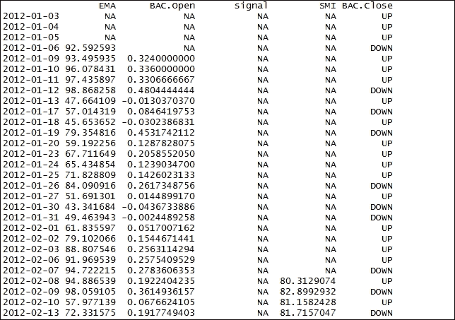

命名列。`c()`函数用于将参数组合成向量。

```
    > head(DataSet)

```

作为参数传递给`c()`的变量有`relativeStrengthIndex3`、`exponentialMovingAverageDiff`、`MACDsignal`、`stochasticOscillator`和`binaryClassification`:

显示`colnames(DataSet)`值:

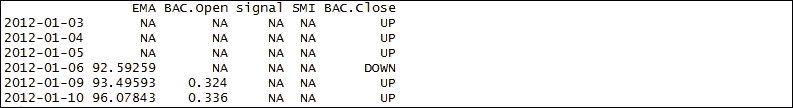

结果如下:

Exploring the internal structure of the `DataSet` data frame. The `str()` function displays the internal structure of the data frame. The `DataSet` is passed as an R object to the `str()` function:

```
    > str(DataSet)

```

The result is as follows:

删除要计算指标的数据:

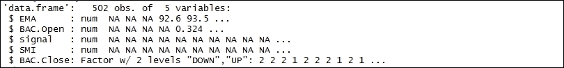

显示`DataSet`值:

结果如下:

The variables passed as parameters to `c()` are `relativeStrengthIndex3`, `exponentialMovingAverageDiff`, `MACDsignal`, `stochasticOscillator`, and `binaryClassification`:

```
    > colnames(DataSet) <- c("relativeStrengthIndex3", "exponentialMovingAverageDiff", "MACDsignal", "stochasticOscillator", "binaryClassification")

```

Displaying the `colnames(DataSet)` value:

```
    > colnames(DataSet)

```

打印`DataSet`数据帧。`head()`函数返回`DataSet`数据帧的第一部分。`DataSet`数据帧作为输入参数传递:

结果如下:


Eliminating the data where the indicators are to be calculated:

```
    > DataSet <- DataSet[-c(1:33),]

```

探索`DataSet`数据帧的内部结构。`str()`功能显示数据帧的内部结构。`DataSet`作为 R 对象传递给`str()`函数:

```
    > DataSet

```

结果如下:


探索`DataSet`数据框的维度。`dim()`函数返回`DataSet`框架的尺寸。`DataSet`数据帧作为输入参数传递。结果清楚地表明有 469 行数据和 5 列:

```
    > head(DataSet)

```

结果如下:


构建训练数据集。`DataSet`数据框中三分之二的元素将用作训练数据集，而`DataSet`数据框中三分之一的元素将用作测试数据集。

```
    > str(DataSet)

```

训练数据集将存储在`TrainingDataSet`中:

显示`TrainingDataSet`值:


结果如下:

Exploring the dimensions of the `DataSet` data frame. The `dim()` function returns the dimensions of the `DataSet` frame. The `DataSet` data frame is passed as an input parameter. The result clearly states that there are 469 rows of data and 5 columns:

```
    > dim(DataSet)

```

The result is as follows:

探索`TrainingDataSet`数据帧的内部结构。`str()`功能显示数据帧的内部结构。`TrainingDataSet`作为 R 对象传递给`str()`函数:


结果如下:

Building a training dataset. Two-thirds of the elements in the `DataSet` data frame will be used as a training dataset, while one-third of the elements in the `DataSet` data frame will be used as a testing dataset.

The training dataset will be stored in `TrainingDataSet`:

```
    > TrainingDataSet <- DataSet[1:312,]

```

训练数据集将存储在`TestDataSet`中:

```
    > TrainingDataSet

```

显示`TestDataSet`值:

结果如下:


Exploring the internal structure of the `TrainingDataSet` data frame. The `str()` function displays the internal structure of the data frame. The `TrainingDataSet` is passed as an R object to the `str()` function:

```
    > str(TrainingDataSet)

```

探索`TestDataSet`数据帧的内部结构。`str()`功能显示数据帧的内部结构。`TestDataSet`作为 R 对象传递给`str()`函数:

结果如下:


The training dataset will be stored in `TestDataSet`:

```
    > TestDataSet <- DataSet[313:469,]

```

第五步-建立模型

```
    > TestDataSet

```

通过指定指标建立树模型。将使用`rpart()`功能。它将符合模型。`binaryClassification`是结果，使用`relativeStrengthIndex3`、`exponentialMovingAverageDiff`、`MACDsignal`和`stochasticOscillator`之和作为预测值。`data=TrainingDataSet`代表数据帧。`cp=.001`代表复杂度参数。该参数的主要作用是通过删除拆分来节省计算时间。然后将结果存储在`DecisionTree`数据帧中:

绘制树模型。`prp()`功能将用于绘制`DecisionTree`数据框。`type=2`垂直移动备用节点:


结果如下:

Exploring the internal structure of the `TestDataSet` data frame. The `str()` function displays the internal structure of the data frame. The `TestDataSet` is passed as an R object to the `str()` function:

```
    > str(TestDataSet)

```

The result is as follows:

显示`DecisionTree`数据框的`cp`表。使用`printcp()`功能。`DecisionTree`作为输入传递:


结果如下:

### Step 5 - building the model

Building the tree model by specifying the indicators. The `rpart()` function will be used. It will fit the model. `binaryClassification` is the outcome, using the sum of `relativeStrengthIndex3`, `exponentialMovingAverageDiff`, `MACDsignal`, and `stochasticOscillator` as the predictors. `data=TrainingDataSet` represents the data frame. `cp=.001` represents the complexity parameter. The main role of the parameter is to save computing time by pruning off splits. The result is then stored in the `DecisionTree` data frame:

```
    > DecisionTree <- rpart(binaryClassification~relativeStrengthIndex3+exponentialMovingAverageDiff+MACDsignal+stochasticOscillator,data=TrainingDataSet, cp=.001)

```

绘制树木的几何平均数。`plotcp()`功能已使用。它提供了`DecisionTree`数据框交叉验证结果的可视化表示:

```
    > prp(DecisionTree,type=2)

```

结果如下:


第 6 步-改进模型

```
    > printcp(DecisionTree)

```

修剪树后改进模型。`prune()`是使用的功能。`DecisionTree`是作为输入传递的数据帧。`cp=0.041428`已被采用，因为这是最低的交叉验证误差值(x 误差):

绘制`tree`模型。`prp()`功能将用于绘制`DecisionTree`数据帧。`type=4`垂直移动备用节点:


结果如下:

Plotting the geometric mean for trees. `plotcp()` function is used. It provides the visual representation of the cross-validation results of the `DecisionTree` data frame:

```
    > plotcp(DecisionTree,upper="splits")

```

The result is as follows:

测试模型:


结果如下:

### Step 6 - improving the model

Improving the model after pruning the tree. `prune()` is the function used. `DecisionTree` is the data frame that is passed as an input. `cp=0.041428` has been taken, since this is the lowest cross-validation error value (x error):

```
    > PrunedDecisionTree <- prune(DecisionTree,cp=0.041428)

```

朴素贝叶斯——预测股票走势的方向

```
    > prp(PrunedDecisionTree, type=4)

```

股票交易是统计学家试图解决的最具挑战性的问题之一。有多种技术指标，例如趋势方向、市场中的动量或缺乏动量、潜在利润的波动性以及监控市场中受欢迎程度的成交量指标，等等。这些指标可用于创建高概率交易机会的策略。几天/几周/几个月可以用来发现技术指标之间的关系。可以使用一种高效且耗时较少的工具，例如决策树。决策树的主要优势在于它是一种强大且易于解释的算法，这为我们提供了一个良好的开端。

准备就绪


为了执行朴素贝叶斯，我们将使用从股票市场数据集中收集的数据集。

步骤 1 -收集和描述数据

```
> table(predict(PrunedDecisionTree,TestDataSet), TestDataSet[,5],dnn=list('predicted','actual')) 

```

要使用的数据集是苹果公司在 2012 年 1 月 1 日到 2014 年 1 月 1 日之间的每日收盘价。这个数据集可以在 https://www.yahoo.com/[网站](https://www.yahoo.com/)上免费获得，我们将从那里下载数据。

怎么做...


让我们进入细节。

<title>Naive Bayes - predicting the direction of stock movement</title>

# 第 2 步-探索数据

作为要执行的第一步，需要加载以下软件包:

## 注意

版本信息:此页面的代码在 R 版本 3.3.0 中进行了测试(2016-05-03)

### 需要安装以下每个库:

让我们下载数据。我们将从标记需要数据的时间段的开始和结束日期开始。

## `as.Date()`函数用于转换代表日历日期的 *Date* 类的字符表示和对象。

数据集的开始日期存储在`startDate`中，它代表日历日期的字符向量表示。表示格式为 *YYYY-MM-DD* :

### 数据集的结束日期存储在`endDate`中，它代表日历日期的字符向量表示。表示格式为 YYYY-MM-DD:

使用`getSymbols()`功能加载数据。该函数从本地或远程的多个源加载数据。数据被提取并保存在指定的`env`中。`env`的默认值为`.GlobalEnv`。`AAPL`是字符向量，指定要加载的符号的名称。`src = yahoo`指定采购方法:

```
    > install.packages("quantmod")
    > install.packages("lubridate")
    > install.packages("e1071")

```

### 探索一周中有数据可用的日子。使用`wday()`功能。该函数以十进制格式返回星期几。`AAPL`代表数据帧。`label = TRUE`将星期几显示为字符串，例如，星期日。然后将结果存储在`weekDays`数据帧中:

打印`weekDays`数据框。`head()`函数返回`weekDays`数据帧的第一部分。`weekDays`数据帧作为输入参数传递:

结果如下:

```
    > library("quantmod")
    > library("lubridate")
    > library("e1071")

```

Let's download the data. We will begin by marking the start and end date for the time period in which the data is desired.

The `as.Date()` function is used to convert the character representation and objects of the *Date* class, which represents the calendar dates.

步骤 3 -准备变量以构建数据集

```
    > startDate = as.Date("2012-01-01")

```

计算收盘价和开盘价之间的差额。`Cl`代表收盘价，`Op`代表开盘价。结果存储在`changeInPrices`数据帧中:

```
    > endDate = as.Date("2014-01-01")

```

打印`changeInPrices`数据帧。`head()`函数返回`changeInPrices`数据帧的第一部分。`changeInPrices`数据帧作为输入参数传递:

```
    > getSymbols("AAPL", env = .GlobalEnv, src = "yahoo", from = startDate,  to = endDate)

```

结果如下:


Exploring the days of the week when data is available. The `wday()` function is used. The function returns the day of the week in decimal format. `AAPL` represents the data frame. `label = TRUE` displays the day of the week as a character string, for example, Sunday. The result is then stored in the `weekDays` data frame:

```
    > weekDays <- wday(AAPL, label=TRUE)

```

探索价格变化的汇总。使用`summary()`功能。该函数提供一系列描述性统计数据，以生成`changeInPrices`数据帧的结果汇总:

```
    > head(weekDays)

```

结果如下:


### 探索`changeInPrices`数据框的尺寸。`dim()`函数返回`changeInPrices`框架的尺寸。`changeInPrices`数据帧作为输入参数传递。结果清楚地表明有 502 行数据和 1 列:

结果如下:

```
    > changeInPrices <- Cl(AAPL) - Op(AAPL)

```

Printing the `changeInPrices` data frame. The `head()` function returns the first part of the `changeInPrices` data frame. The `changeInPrices` data frame is passed as an input parameter:

```
    > head(changeInPrices)

```

The result is as follows:

创建二元分类变量。`ifelse()`函数使用一个测试表达式来返回值，该值本身是一个向量，并且与测试表达式的长度相同。如果测试表达式的对应值是`TRUE`，则返回的向量具有来自`x`的元素，或者如果测试表达式的对应值是`FALSE`，则返回来自`y`的元素。


这里，`changeInPrices>0`是测试逻辑模式的测试功能。`UP`和`DOWN`执行逻辑测试。然后将结果存储在`binaryClassification`数据帧中:

显示`binaryClassification`值:

```
    > summary(changeInPrices)

```

结果如下:

探索价格变化的汇总。使用`summary()`功能。该函数提供了一系列描述性统计数据，以生成`binaryClassification`数据帧的结果汇总:


结果如下:

Exploring the dimensions of the `changeInPrices` data frame. The `dim()` function returns the dimensions of the `changeInPrices` frame. The `changeInPrices` data frame is passed as an input parameter. The result clearly states that there are 502 rows of data and 1 column:

```
    > dim(changeInPrices)

```

The result is as follows:

创建要使用的数据集。`data.frame()`函数用于根据一组紧密耦合的变量创建数据框。这些变量共享矩阵的属性。


作为参数传递给`data.frame()`的变量是`weekDays`和`binaryClassification`。然后将结果存储在`DataSet`数据帧中:

显示`AAPLDataSet`值:

结果如下:

```
    > binaryClassification <- ifelse(changeInPrices>0,"UP","DOWN")

```

Displaying the `binaryClassification` value:

```
    > binaryClassification

```

The result is as follows:

打印`AAPLDataSet`数据帧。`head()`函数返回`AAPLDataSet`数据帧的第一部分。`AAPLDataSet`数据帧作为输入参数传递:


结果如下:

Exploring the summary of change in prices. The `summary()` function is used. The function provides a range of descriptive statistics to produce result summaries of the `binaryClassification` data frame:

```
    > summary(binaryClassification)

```

The result is as follows:

探索`AAPLDataSet`数据框的尺寸。`dim()`函数返回`AAPLDataSet`数据框的尺寸。`AAPLDataSet`数据帧作为输入参数传递。结果清楚地表明有 502 行数据和 2 列:


结果如下:

Creating the dataset to be used. The `data.frame()` function is used to create data frames based on a tightly coupled set of variables. These variables share the properties of matrices.

The variables passed as parameters to `data.frame()` are `weekDays` and  `binaryClassification`. The result is then stored in the `DataSet` data frame:

```
    > AAPLDataSet <- data.frame(weekDays,binaryClassification)

```

第 4 步-建立模型

```
    > AAPLDataSet

```

通过指定指标构建朴素贝叶斯分类器。将使用`naiveBayes()`功能。在给定独立预测变量的情况下，它使用贝叶斯规则来计算一组给定类别变量的后验概率。该函数假设度量预测值为高斯分布。`NaiveBayesclassifier`是函数的结果，其中自变量为`AAPLDataSet[,1]`，因变量为`AAPLDataSet[,2]`:

显示`NaiveBayesclassifier`结果:


结果如下:

Printing the `AAPLDataSet` data frame. The `head()` function returns the first part of the `AAPLDataSet` data frame. The `AAPLDataSet` data frame is passed as an input parameter:

```
    > head(AAPLDataSet)

```

The result is as follows:

结果覆盖整个数据集，并显示价格上涨或下跌的概率。本质上是看跌的。


第 5 步——为新的、改进的模型创建数据

制定一个复杂的策略，展望未来。计算 5 年期间模型的移动平均值。`EMA()`使用 AAPL 符号作为价格序列。`n = 5`代表平均结束的时间周期。然后将结果存储在`exponentialMovingAverage5`数据帧中:

```
    > dim(AAPLDataSet)

```

显示`exponentialMovingAverage5`值:

结果如下:


探索价格变化的汇总。使用`summary()`功能。该函数提供了一系列描述性统计数据，以生成`exponentialMovingAverage5` 数据帧的结果汇总:

### 结果如下:

Building the naives Bayes classifier by specifying the indicators. The `naiveBayes()` function will be used. It uses the Bayes rule to compute posterior probabilities for a given set of class variables given independent predictor variables. The function assumes a Gaussian distribution of metric predictors. `NaiveBayesclassifier` is the outcome of the function, where the independent variable is `AAPLDataSet[,1]` and the dependent variable is `AAPLDataSet[,2]` :

```
    > NaiveBayesclassifier <- naiveBayes(AAPLDataSet[,1], AAPLDataSet[,2])

```

Displaying the `NaiveBayesclassifier` result:

```
    > NaiveBayesclassifier

```

计算模型在 10 年内的移动平均值。

`EMA()`使用 AAPL 符号作为价格序列。`n = 10`代表平均结束的时间周期。结果存储在`exponentialMovingAverage10`数据框中:


显示`exponentialMovingAverage10`值:

结果如下:

### Step 5 - creating data for a new, improved model

Developing a sophisticated strategy, looking ahead more than a day. Calculating moving average to the model for a period of 5 years. `EMA()` uses the AAPL symbol as a price series. `n = 5` represents the time period to average over. The result is then stored in the `exponentialMovingAverage5` data frame:

```
    > exponentialMovingAverage5 <- EMA(Op(AAPL),n = 5)

```

探索价格变化的汇总。使用`summary()`功能。该函数提供了一系列描述性统计数据，以生成`exponentialMovingAverage10`数据帧的结果汇总:

```
    > exponentialMovingAverage5

```

结果如下:


探索`exponentialMovingAverage10`数据框的尺寸。`dim()` 函数返回`exponentialMovingAverage10`框架的尺寸。`exponentialMovingAverage10`数据帧作为输入参数传递。结果清楚地表明有 502 行数据和 1 列:

```
    > summary(exponentialMovingAverage5)

```

结果如下:


计算`exponentialMovingAverage5`和`exponentialMovingAverage10`之间的差值:

显示`exponentialMovingAverageDiff`值:

```
    > exponentialMovingAverage10 <- EMA(Op(AAPL),n = 10)

```

结果如下:

```
    > exponentialMovingAverage10

```

The result is as follows:


探索价格变化的汇总。使用`summary()`功能。该函数提供一系列描述性统计数据，以生成`exponentialMovingAverageDiff`数据帧的结果汇总:

结果如下:

```
    > summary(exponentialMovingAverage10)

```

The result is as follows:


将`exponentialMovingAverageDiff`数据帧四舍五入至两位有效数字:

探索价格变化的汇总。使用`summary()`功能。该函数提供了一系列描述性统计数据，以生成`exponentialMovingAverageDiffRound`数据帧的结果汇总:

```
    > dim(exponentialMovingAverage10)

```

结果如下:


第六步——改进模型

```
    > exponentialMovingAverageDiff <- exponentialMovingAverage5 - exponentialMovingAverage10

```

创建要使用的数据集。`data.frame()`函数用于根据一组紧密耦合的变量创建数据框。这些变量共享矩阵的属性。作为参数传递给`data.frame()`的变量有`weekDays`、`exponentialMovingAverageDiffRound`和`binaryClassification`。然后将结果存储在`AAPLDataSetNew`数据帧中:

```
    > exponentialMovingAverageDiff

```

显示`AAPLDataSetNew` 值:

结果如下:


Exploring the summary of change in prices. The `summary()` function is used. The function provides a range of descriptive statistics to produce result summaries of the `exponentialMovingAverageDiff` data frame:

```
    > summary(exponentialMovingAverageDiff)

```

探索价格变化的汇总。使用`summary()`功能。该函数提供了一系列描述性统计数据，以生成`AAPLDataSetNew`数据框的结果汇总；

结果如下:


Rounding off the `exponentialMovingAverageDiff` data frame to two significant digits:

```
    > exponentialMovingAverageDiffRound <- round(exponentialMovingAverageDiff, 2)

```

结果如下:

```
    > summary(exponentialMovingAverageDiffRound)

```

The result is as follows:


探索价格变化的汇总。使用`summary()`功能。该函数提供了一系列描述性统计数据，以生成`AAPLDataSetNew`数据框的结果汇总；

### 结果如下:

Creating the dataset to be used. The `data.frame()` function is used to create data frames based on a tightly coupled set of variables. These variables share the properties of matrices. The variables passed as parameters to `data.frame()` are `weekDays`, `exponentialMovingAverageDiffRound`, and `binaryClassification`. The result is then stored in the `AAPLDataSetNew` data frame:

```
> AAPLDataSetNew <- data.frame(weekDays,exponentialMovingAverageDiffRound, binaryClassification) 

```

Displaying the `AAPLDataSetNew` value:

```
> AAPLDataSetNew 

```

探索`AAPLDataSetNew`数据帧的尺寸。`dim()`函数返回`AAPLDataSetNew`框架的尺寸。`AAPLDataSetNew`数据帧作为输入参数传递。结果清楚地表明有 492 行数据和 3 列:

结果如下:


Exploring the summary of change in prices. The `summary()` function is used. The function provides a range of descriptive statistics to produce result summaries of the `AAPLDataSetNew` data frame:

```
    > summary(AAPLDataSetNew)

```

构建训练数据集。`AAPLDataSetNew`数据框中三分之二的元素将用作训练数据集，而`AAPLDataSetNew`数据框中三分之一的元素将用作测试数据集。

训练数据集将存储在`trainingDataSet`数据框中:


探索`trainingDataSet`数据框的尺寸。`dim()`函数返回`trainingDataSet`数据框的尺寸。`trainingDataSet`数据帧作为输入参数传递。结果清楚地表明有 328 行数据和 3 列:

```
    > AAPLDataSetNew <- AAPLDataSetNew[-c(1:10),]

```

结果如下:


探索价格变化的汇总。使用`trainingDataSet()`功能。该函数提供一系列描述性统计数据，以生成`trainingDataSet`数据帧的结果汇总:

```
> summary(AAPLDataSetNew) 

```

结果如下:


训练数据集将存储在`TestDataSet`数据框中:

```
    > dim(AAPLDataSetNew)

```

探索`TestDataSet`数据框的尺寸。`dim()`函数返回`TestDataSet` 框架的尺寸。`TestDataSet`数据帧作为输入参数传递。结果清楚地表明有 164 行数据和 3 列:

结果如下:


Building a training dataset. Two-thirds of the elements in the `AAPLDataSetNew` data frame will be used as the training dataset, while one-third of the elements in the `AAPLDataSetNew` data frame will be used as the testing dataset.

结果如下:

```
> trainingDataSet <- AAPLDataSetNew[1:328,] 

```

通过指定指标构建朴素贝叶斯分类器。将使用`naiveBayes()`功能。在给定独立预测变量的情况下，它使用贝叶斯规则来计算一组给定类别变量的后验概率。该函数假设度量预测值为高斯分布。

```
    > dim(trainingDataSet)

```

`exponentialMovingAverageDiffRoundModel`是函数的结果，其中自变量为`trainingDataSet[,1:2]`，因变量为`trainingDataSet[,3]`:

显示`exponentialMovingAverageDiffRoundModel`结果:


结果如下:

Exploring the summary of change in prices. The `trainingDataSet()` function is used. The function provides a range of descriptive statistics to produce result summaries of the `trainingDataSet` data frame:

```
    > summary(trainingDataSet)

```

The result is as follows:

测试结果:


结果如下:

The training dataset will be stored in the `TestDataSet` data frame:

```
    > TestDataSet <- AAPLDataSetNew[329:492,]

```

Exploring the dimensions of the `TestDataSet` data frame. The `dim()` function returns the dimensions of the `TestDataSet` frame. The `TestDataSet` data frame is passed as an input parameter. The result clearly states that there are 164 rows of data and 3 columns:

```
    > dim(TestDataSet)

```

随机森林货币交易策略

在进行技术分析后，可以科学地实现预测外汇市场未来价格趋势的目标。外汇交易员根据多种技术分析制定策略，如市场趋势、交易量、交易区间、支撑位和阻力位、图表模式和指标，以及使用不同的时间框架图表进行多时间框架分析。基于对过去市场行为的统计，例如过去的价格和过去的交易量，技术分析策略被创建用于评估资产。分析的主要目标不是衡量一项资产的潜在价值，而是计算由历史表现表明的市场的未来表现。


准备就绪

```
    > summary(TestDataSet)

```

为了执行随机森林，我们将使用从美元和英镑数据集收集的数据集。

步骤 1 -收集和描述数据


将使用名为`PoundDollar.csv`的数据集。数据集采用标准格式。有 5，257 行数据和 6 个变量。数字变量如下:

`Date`

`Open`

```
> exponentialMovingAverageDiffRoundModel <-
naiveBayes(trainingDataSet[,1:2],trainingDataSet[,3])

```

`High`

```
    > exponentialMovingAverageDiffRoundModel

```

`Low`

`Close`


`Volume`

怎么做...

```
    > table(predict(exponentialMovingAverageDiffRoundModel,TestDataSet),
TestDataSet[,3],dnn=list('Predicted','Actual')) 

```

让我们进入细节。

第 2 步-探索数据


作为要执行的第一步，需要加载以下软件包:

<title>Random forest - currency trading strategy</title>

# 注意

版本信息:此页面的代码在 R 版本 3.3.0 中进行了测试(2016-05-03)。

## 需要安装以下每个库:

让我们探索数据，了解变量之间的关系。我们将从导入名为`PoundDollar.csv`的 CSV 数据文件开始。我们将把数据保存到`PoundDollar`数据框:

### 打印`PoundDollar`数据帧。`head()`函数返回`PoundDollar`数据帧的第一部分。`PoundDollar`数据帧作为输入参数传递:

结果如下:

*   `Date`
*   `Open`
*   打印`PoundDollar`数据框的摘要。`summary()`功能是多功能功能。`summary()`是一个通用函数，提供与单个对象或数据框相关的数据汇总。`PoundDollar`数据帧作为 R 对象传递给`summary()`函数:
*   结果如下:
*   `Close`
*   `Volume`

## 探索`PoundDollar`数据框的尺寸。`dim()`函数返回`PoundDollar`框架的尺寸。`PoundDollar`数据帧作为输入参数传递。结果清楚地表明有 5，257 行数据和 7 列:

结果如下:

### Step 2 - exploring the data

The following packages need to be loaded as the first step to be carried out:

```
> install.packages("quantmod")
> install.packages("randomForest")
> install.packages("Hmisc")

```

### 步骤 3 -准备变量以构建数据集

表示日历日期和时间。`as.POSIXlt()`函数操纵对象来表示日期和时间。`PoundDollar`作为参数传递。`format="%m/%d/%y %H:%M`表示日期时间格式。结果存储在`DateAndTime`数据框中:

捕捉`High`、`Low`和`Close`值:

```
> library("quantmod")
> library("randomForest")
> library("Hmisc")

```

`PoundDollar`数据帧捕获位于第四、第五和第六列的`High`、`Low`和`Close`值。打印`HighLowClose`数据帧。`head()`函数返回`HighLowClose`数据帧的第一部分。`HighLowClose`数据帧作为输入参数传递:

```
    > PoundDollar <- read.csv("d:/PoundDollar.csv")

```

结果如下:

```
    > head(PoundDollar)

```

The result is as follows:


打印`HighLowClose`数据帧的摘要。`summary()`功能是多功能功能。`summary()`是一个通用函数，提供与单个对象或数据帧相关的数据的汇总。`HighLowClose`数据帧作为 R 对象传递给`summary()`函数:

结果如下:

```
    > summary(PoundDollar)

```

探索`HighLowClose`数据帧的内部结构。`str()`功能显示数据帧的内部结构。`HighLowClose`作为 R 对象传递给`str()`函数:

结果如下:


Exploring the dimensions of the `PoundDollar` data frame. The `dim()` function returns the dimensions of the `PoundDollar` frame. The `PoundDollar` data frame is passed as an input parameter. The result clearly states that there are 5,257 rows of data and 7 columns:

```
    > dim(PoundDollar)

```

创建要使用的数据集。`data.frame()`函数用于根据一组紧密耦合的变量创建数据框。这些变量共享矩阵的属性。作为参数传递给`data.frame()`的变量是`HighLowClose`。然后将结果存储在`HighLowClosets`数据帧中。`row.names=DateAndTime`表示指定用作行名的列的单个整数字符串。结果存储在`HighLowClose`数据帧中:

描述数据集。`describe()`功能提供项目分析。`HighLowClosets`作为输入参数传递:


结果如下:

### Step 3 - preparing variables to build datasets

Representing calendar dates and times. The `as.POSIXlt()` function manipulates the objects to represent date and time. `PoundDollar` is passed as an argument. `format="%m/%d/%y %H:%M` represents the date-time format. The results are stored in the `DateAndTime` data frame:

```
    > DateAndTime <- as.POSIXlt(PoundDollar[,2],format="%m/%d/%y %H:%M")

```

创建时序对象。使用`as.xts()`功能。它将任意类的数据对象转换为类`xts`，而不会丢失原始格式的任何属性。`HighLowClosets`作为输入对象传递:

```
    > HighLowClose <- PoundDollar[,4:6]

```

计算布林线。布林线是区间指标，计算移动平均线的标准差。布林线运行的逻辑是，货币对的价格最有可能向其平均价格靠拢，因此，当它偏离太远时，比如偏离两个标准差，它将回撤至其移动平均价格。`BBands()`函数用于计算布林线。`HighLowClosexts`作为对象传递，该对象被更改为包含盘高-盘低-收盘价的矩阵。`n=20`表示移动平均线的周期数。SMA 命名要调用的函数。`sd=2`表示两个标准偏差:

```
    > head(HighLowClose)

```

描述数据集。`describe()`功能提供项目分析。`BollingerBands`作为输入参数传递:

结果如下:


Printing the summary of the `HighLowClose` data frame. The `summary()` function is a multipurpose function. `summary()` is a generic function, which provides a summary of the data related to the individual object or data frame. The `HighLowClose` data frame is passed as an R object to the `summary()` function:

```
    > summary(HighLowClose)

```

构建上层乐队:

打印`Upper`数据框的摘要。`summary()`功能是多功能功能。`summary()`是一个通用函数，提供与单个对象或数据帧相关的数据汇总。`Upper`数据帧作为 R 对象传递给`summary()`函数:


结果如下:

Exploring the internal structure of the `HighLowClose` data frame. The `str()` function displays the internal structure of the data frame. The `HighLowClose` is passed as an R object to the `str()` function:

```
    > str(HighLowClose)

```

The result is as follows:

构建低频带:


打印`Lower`数据帧的摘要。`summary()`功能是一个多功能功能。`summary()`是一个通用函数，它提供了与单个对象或数据框相关的数据摘要。下部数据帧作为 R 对象传递给`summary()`函数:

结果如下:

```
> HighLowClosets <- data.frame(HighLowClose, row.names=DateAndTime) 

```

Describing the dataset. The `describe()` function provides the item analysis. `HighLowClosets` is passed as an input argument:

```
    > describe(HighLowClosets)

```

The result is as follows:

构建中间波段:


打印`Middle`数据框的摘要。`summary()`功能是多功能功能。`summary()`是一个通用函数，提供与单个对象或数据帧相关的数据汇总。`Middle`数据帧作为 R 对象传递给`summary()`函数:

结果如下:

```
    > HighLowClosexts <- as.xts(HighLowClosets)

```

Calculating the Bollinger Bands. Bollinger Bands are range-bound indicators that calculate standard deviation from the moving average. Bollinger Bands operate under the logic that a currency pair's price is most likely to gravitate toward its average, and hence when it strays too far, such as two standard deviations away, it is due to retrace back to its moving average. The `BBands()` function is used to calculate Bollinger Bands. `HighLowClosexts` is passed as an object that is changed to a matrix, which contains high-low-close prices. `n=20` indicates the number of periods for moving average. SMA names the function to be called. `sd=2` indicates two standard deviations:

```
    > BollingerBands <- BBands(HighLowClosexts,n=20,SMA,sd=2)

```

Describing the dataset. The `describe()` function provides item analysis. `BollingerBands` is passed as an input argument:

```
    > describe(BollingerBands)

```

计算百分比变化。`Delt()`函数用于计算给定系列从一个周期到另一个周期的百分比变化。`k=1`表示期间的变化。结果存储在`PercentageChngpctB`数据帧中:

描述数据集。`describe()`功能提供项目分析。`PercentageChngpctB`作为输入参数传递:


结果如下:

Building the upper band:

```
    > Upper <- BollingerBands$up - HighLowClosexts$Close

```

Printing the summary of the `Upper` data frame. The `summary()` function is a multipurpose function. `summary()` is a generic function, which provides a summary of the data related to the individual object or data frame. The `Upper` data frame is passed as an R object to the `summary()` function:

```
    > summary(Upper)

```

计算`Upper`数据帧的百分比变化。`k=1`表示期间的变化:

描述数据集。`describe()`功能提供项目分析。`PercentageChngUp`作为输入参数传递:


结果如下:

Building the lower band:

```
    > Lower <- BollingerBands$dn - HighLowClosexts$Close

```

Printing the summary of the `Lower` data frame. The `summary()` function is a multipurpose function. `summary()` is a generic function, which provides a summary of the data related to the individual object or data frame. The Lower data frame is passed as an R object to the `summary()` function:

```
    > summary(Upper)

```

计算`Lower`数据帧的百分比变化。`k=1`表示期间的变化:

描述数据集。`describe()`功能提供项目分析。`PercentageChngLow`作为输入参数传递:


结果如下:

Building the middle band:

```
    > Middle <- BollingerBands$mavg - HighLowClosexts$Close

```

Printing the summary of the `Middle` data frame. The `summary()` function is a multipurpose function. `summary()` is a generic function which provides a summary of the data related to the individual object or data frame. The `Middle` data frame is passed as an R object to the `summary()` function:

```
    > summary(Middle)

```

计算`Middle`数据帧的百分比变化。`k=1`表示期间的变化:

描述数据集。`describe()`功能提供项目分析。`PercentageChngMid`作为输入参数传递:


结果如下:

Calculating the percentage change. The `Delt()` function is used to calculate the percentage change from one period to another of a given series. `k=1` indicates the change over the periods. The result is stored in the `PercentageChngpctB` data frame:

```
    > PercentageChngpctB <- Delt(BollingerBands$pctB,k=1)

```

Describing the dataset. The `describe()` function provides item analysis. `PercentageChngpctB` is passed as an input argument:

```
    > describe(PercentageChngpctB)

```

计算`HighLowClosexts$Close`变量的百分比变化。`k=1`表示各时期的变化:

第 4 步-建立模型


创建二元分类变量。`ifelse()`函数使用一个测试表达式来返回值，该值本身是一个向量，并且与测试表达式的长度相同。如果测试表达式的对应值是`TRUE`，则返回的向量具有来自`x`的元素，如果测试表达式的对应值是`FALSE`，则返回来自`y`的元素。

这里，`Returns>0`是测试函数，要在逻辑模式下测试。`UP`和`DOWN`执行逻辑测试。然后将结果存储在`binaryClassification`数据帧中:

```
    > PercentageChngUp <- Delt(Upper,k=1)

```

探索价格变化的汇总。使用`summary()`功能。该函数提供一系列描述性统计数据，以生成`binaryClassification`数据帧的结果汇总:

```
    > describe(PercentageChngUp)

```

结果如下:


将班级向后移一位:

```
    > PercentageChngLow <- Delt(Lower, k=1)

```

结合了所有的特点。`data.frame()`函数用于根据一组紧密耦合的变量创建数据框。这些变量共享矩阵的属性。

```
    > describe(PercentageChngLow)

```

作为参数传递给`data.frame()`的变量有`Upper`、`Lower`、`Middle`、`BollingerBands$pctB`、`PercentageChngpctB`、`PercentageChngUp`、`PercentageChngLow`和`PercentageChngMid`。结果存储在`FeaturesCombined`数据框中:

探索价格变化的汇总。使用`summary()`功能。该函数提供一系列描述性统计数据，以生成`FeaturesCombined`数据帧的结果汇总:


结果如下:

Calculating the percentage change of the `Middle` data frame. `k=1` indicates the change over the periods:

```
    > PercentageChngMid <- Delt(Middle,k=1)

```

Describing the dataset. The `describe()` function provides item analysis. `PercentageChngMid` is passed as an input argument:

```
    > describe(PercentageChngMid)

```

匹配类别:

组合`FeaturesShifted`和`ClassShifted`数据帧。作为参数传递给`data.frame()`的变量是`FeaturesShifted`和`ClassShifted`。然后将结果存储在`FeaturesClassData`数据帧中:


探索价格变化的汇总。使用`summary()`功能。该函数提供一系列描述性统计数据，以生成`FeaturesClassData`数据帧的结果汇总:

结果如下:

```
    > Returns <- Delt(HighLowClosexts$Close, k=1)

```

### Step 4 - building the model

Creating a binary classification variable. The `ifelse()` function uses a test expression to return the value, which is itself a vector, and is of the same length as the test expression. The vector returned has an element from `x` if the corresponding value of the test expression is `TRUE`, or from `y` if the corresponding value of the test expression is `FALSE`.

被删除的计算指标:

```
> binaryClassification <- ifelse(Returns>0,"Up","Down") 

```

命名列。`c()`函数用于将参数组合成向量:

```
    > summary(binaryClassification)

```

探索`FinalModelData`数据帧的内部结构。`str()`功能显示数据帧的内部结构。`FinalModelData`作为 R 对象传递给`str()`函数:

结果如下:


Shifting class back one:

```
    > ClassShifted <- binaryClassification[-1]

```

设置初始随机变量:

使用类(第 9 列)评估特征(第 1 至 9 列)，以找到每棵树的最佳特征数量。`FinalModelData[,-9]`表示预测变量的数据框架，`FinalModelData[,9]`表示响应变量的数据框架。`ntreeTry=100`表示在调整步骤中使用的树的数量。`stepFactor=1.5`表示每次迭代；`mtry`因该值而增大(或缩小)，而`improve=0.01`意味着袋外误差的(相对)改善必须达到这个程度，搜索才能继续。`trace=TRUE`表示是否打印搜索的进度。`dobest=FALSE`表示是否使用找到的最优 `mtry`运行森林:

```
    > FeaturesCombined <- data.frame(Upper, Lower, Middle, BollingerBands$pctB, PercentageChngpctB, PercentageChngUp, PercentageChngLow, PercentageChngMid)

```

使用所有特征来预测类别，每个树有两个特征。使用`randomForest()`功能。`data=FinalModelData`表示模型中包含变量的数据框。`mtry=2`表示每次分割时随机抽样作为候选变量的变量数量。`ntree=2000`表示要种植的树木数量。`keep.forest=TRUE`表示森林将保留在输出对象中。`importance=TRUE`表示待评估预测因子的重要性:

```
    > summary(FeaturesCombined)

```

结果如下:


绘制随机森林:

```
    > FeaturesShifted <- FeaturesCombined[-5257,]

```

结果如下:

```
    > FeaturesClassData <- data.frame(FeaturesShifted, ClassShifted)

```

Exploring the summary of change in prices. The `summary()` function is used. The function provides a range of descriptive statistics to produce result summaries of the `FeaturesClassData` data frame:

```
    > summary(FeaturesClassData)

```

The result is as follows:

支持向量机-货币交易策略


外汇市场是一个国际交易市场，每个国家的货币都可以自由买卖。仅由市场参与者决定的一种货币的价格是由供求关系决定的。交易是通过单个合约进行的。标准合约规模(也称为批量)通常为 100，000 个单位。这意味着，对于所获得的每个标准合约，控制权是 100，000 单位的基础货币。对于这个合约规模，每个点(最小价格增量)值 10 美元。根据交易者的交易策略，头寸可以维持很短时间，也可以维持很长时间，甚至几年。有几个工具可以让交易者理解市场并做出决定，这些工具基本上归入基本面或技术面分析。基本面分析考虑到政治和经济信息的不断交流。技术分析基本上是基于价格、时间和交易量——一种货币的最低价和最高价、时间段、交易次数等等。技术分析也假设了市场的重复性，它很可能会像过去一样在未来重复。它分析过去的报价，并根据统计和数学计算预测未来的价格。

准备就绪

```
    > FinalModelData <- FeaturesClassData[-c(1:20),]

```

为了执行支持向量机，我们将使用从美元和英镑数据集收集的数据集。

```
    > colnames(FinalModelData) <- c("pctB","LowDiff","UpDiff","MidDiff","PercentageChngpctB","PercentageChngUp","PercentageChngLow","PercentageChngMid","binaryClassification")

```

步骤 1 -收集和描述数据

```
    > str(FinalModelData)

```

将使用名为`PoundDollar.csv`的数据集。数据集采用标准格式。有 5，257 行数据和 6 个变量。数字变量如下:

`Date`


`Open`

`High`

```
    > set.seed(1)

```

`Low`

```
    > FeatureNumber <- tuneRF(FinalModelData[,-9], FinalModelData[,9], ntreeTry=100, stepFactor=1.5, improve=0.01, trace=TRUE, plot=TRUE, dobest=FALSE)

```

`Close`

```
    > RandomForest <- randomForest(binaryClassification~., data=FinalModelData, mtry=2,  ntree=2000, keep.forest=TRUE, importance=TRUE)

```

`Volume`

怎么做...


让我们进入细节。

第 2 步-探索数据

```
    > varImpPlot(RandomForest, main = 'Random Forest: Measurement of Importance of Each Feature',pch=16,col='blue' )

```

作为要执行的第一步，需要加载以下软件包:

注意


版本信息:此页面的代码在 R 版本 3.3.0 中进行了测试(2016-05-03)。

<title>Support vector machine - currency trading strategy</title>

# 需要安装以下每个库:

让我们探索数据，了解变量之间的关系。我们将从导入名为`PoundDollar.csv`的 CSV 数据文件开始。我们将把数据保存到`PoundDollar`数据框中:

## 打印`PoundDollar`数据帧。`head()`函数返回`PoundDollar`数据帧的第一部分。`PoundDollar`数据帧作为输入参数传递:

结果如下:

### 探索`PoundDollar`数据帧的内部结构。`str()`功能显示数据帧的内部结构。`PoundDollar`作为 R 对象传递给`str()`函数:

结果如下:

*   `Date`
*   `Open`
*   步骤 3 -计算指标
*   计算相对强度指数。它是最近价格上升运动与绝对价格运动的比率。`RSI()`函数用于计算相对强度指数。`PoundDollar`数据框用作价格序列。`n = 3`代表移动平均线的周期数。然后将结果存储在`relativeStrengthIndex3`数据帧中:
*   探索价格变化的汇总。使用`summary()`功能。该函数提供了一系列描述性统计数据，以生成`relativeStrengthIndex3`数据帧的结果汇总:
*   结果如下:

## How to do it...

Let's get into the details.

### 计算`PoundDollar`系列的**移动平均线** ( **MA** )。`SMA`计算过去一组观察值序列的算术平均值。`n=50`表示平均的周期数:

打印`SeriesMeanAvg50`数据帧的摘要。`summary()`功能是多功能功能。`summary()`是一个通用函数，提供与单个对象或数据框相关的数据汇总。`SeriesMeanAvg50`数据帧作为 R 对象传递给`summary()`函数:

```
> install.packages("quantmod")
> install.packages("e1071")
> install.packages("Hmisc")
> install.packages("ggplot2")

```

### 结果如下:

Version info: Code for this page was tested in R version 3.3.0 (2016-05-03).

Each of the following libraries needs to be installed:

```
> library("quantmod")
> library("e1071")
> library("Hmisc")
> install.packages("ggplot2")

```

描述数据集。`describe()`功能提供项目分析。`SeriesMeanAvg50`作为输入参数传递:

```
    > PoundDollar <- read.csv("d:/PoundDollar.csv")

```

结果如下:

```
    > head(PoundDollar)

```

The result is as follows:


衡量趋势。找出开盘价和 50 期简单移动平均线之间的差异:

打印`SeriesMeanAvg50`数据帧的摘要。`Trend`数据帧作为 R 对象传递给`summary()`函数:

```
    > str(PoundDollar)

```

结果如下:


### 计算收盘价和开盘价之间的差价。结果存储在数据帧`PriceDiff`中:

打印`PriceDiff`数据帧的摘要。`Trend`数据帧作为 R 对象传递给`summary()`函数:

```
    > relativeStrengthIndex3 <- RSI(Op(PoundDollar), n= 3)

```

结果如下:

```
    > summary(relativeStrengthIndex3)

```

The result is as follows:


步骤 4 -准备变量以构建数据集

创建二元分类变量。`ifelse()`函数使用一个测试表达式返回值，该值本身是一个向量，与测试表达式的长度相同。如果测试表达式的对应值是`TRUE`，则返回的向量具有来自`x`的元素，如果测试表达式的对应值是`FALSE`，则返回来自`y`的元素。

```
    > SeriesMeanAvg50 <- SMA(Op(PoundDollar), n=50)

```

这里，`PriceChange>0`是测试函数，要在逻辑模式下测试。`UP`和`DOWN`执行逻辑测试。然后将结果存储在`binaryClassification`数据帧中:

```
    > summary(SeriesMeanAvg50)

```

打印`binaryClassification`数据帧的摘要。`Trend`数据帧作为 R 对象传递给`summary()`函数:

结果如下:


Describing the dataset. The `describe()` function provides the item analysis. `SeriesMeanAvg50` is passed as an input argument:

```
    > describe(SeriesMeanAvg50)

```

组合相关的`StrengthIndex3`、`Trend`和`binaryClassification`数据帧。作为参数传递给`data.frame()`的变量有`relativeStrengthIndex3`、`Trend`和`binaryClassification`。然后将结果存储在`DataSet`数据帧中:

打印`DataSet`数据帧的摘要。`Trend`数据帧作为 R 对象传递给`summary()`函数:


结果如下:

Measuring the trend. Finding the difference between opening price and the 50-period simple moving average:

```
    > Trend <- Op(PoundDollar) - SeriesMeanAvg50

```

Printing the summary of the `SeriesMeanAvg50` data frame. The `Trend` data frame is passed as an R object to the `summary()` function:

```
    > summary(Trend)

```

探索`DataSet`数据帧的内部结构。`str()`功能显示数据帧的内部结构。`DataSet`作为 R 对象传递给`str()`函数:

结果如下:


Calculating the price difference between closing and opening prices. The result is stored in the data frame `PriceDiff`:

```
    > PriceDiff <- Cl(PoundDollar) - Op(PoundDollar)

```

计算指标、创建数据集和移除点:

```
    > summary(PriceDiff)

```

探索`DataSet`数据框的尺寸。`dim()`函数返回`DataSet`框架的尺寸。`DataSet`数据帧作为输入参数传递。结果清楚地表明有 5，208 行数据和 3 列:

结果如下:


### Step 4 - preparing variables to build datasets

分离训练数据集:

探索`TrainingDataSet`数据帧的尺寸。`dim()`函数返回`TrainingDataSet`框架的尺寸。`TrainingDataSet`数据帧作为输入参数传递。结果清楚地表明有 4，528 行数据和 3 列:

```
    > binaryClassification <- ifelse(PriceDiff>0,"UP","DOWN")

```

结果如下:

```
    > summary(binaryClassification)

```

The result is as follows:


打印`TrainingDataSet`数据帧的摘要。`TrainingDataSet`数据帧作为 R 对象传递给`summary()`函数:

结果如下:

```
    > DataSet <- data.frame(relativeStrengthIndex3, Trend, binaryClassification)

```

Printing the summary of the `DataSet` data frame. The `Trend` data frame is passed as an R object to the `summary()` function:

```
    > summary(DataSet)

```

The result is as follows:

分离测试数据集:


探索`TestDataSet`数据框的维度。`dim()`函数返回`TestDataSet`帧的尺寸。`TestDataSet`数据帧作为输入参数传递。结果清楚地表明有 1，510 行数据和 3 列:

Exploring the internal structure of the `DataSet` data frame. The `str()` function displays the internal structure of the data frame. The `DataSet` is passed as an R object to the `str()` function:

```
    > str(DataSet)

```

The result is as follows:

打印`TestDataSet`数据帧的摘要。`TestDataSet`数据帧作为 R 对象传递给`summary()`函数:


结果如下:

Calculating the indicators, creating a dataset, and removing the points:

```
    > DataSet <- DataSet[-c(1:49),]

```

Exploring the dimensions of the `DataSet` data frame. The `dim()` function returns the dimensions of the `DataSet` frame. The `DataSet` data frame is passed as an input parameter. The result clearly states that there are 5,208 rows of data and 3 columns:

```
> dim(DataSet) 

```

第 5 步-建立模型

使用`svm()`函数构建支持向量机。`binaryClassification~relativeStrengthIndex3+Trend`用作公式。`data=TrainingDataSet`用作包含模型变量的数据框。`kernel="radial"`表示径向基核函数用于训练和预测。`cost=1`表示违反约束的成本。`gamma=1/2`表示除线性外的所有核函数所需的参数:


打印`SVM`数据帧的摘要。`SVM`数据帧作为 R 对象传递给`summary()`函数:

结果如下:

```
    > TrainingDataSet <- DataSet[1:4528,]

```

Exploring the dimensions of the `TrainingDataSet` data frame. The `dim()` function returns the dimensions of the `TrainingDataSet` frame. The `TrainingDataSet` data frame is passed as an input parameter. The result clearly states that there are 4,528 rows of data and 3 columns:

```
    > dim(TrainingDataSet)

```

The result is as follows:

为了预测基于模型对象的值，我们将使用`predict()`函数。`SVM`作为宾语传递。`TrainingDataSet`数据对象作为一个对象被传递，在其中寻找预测变量:


打印`TrainingPredictions`数据帧的摘要。`SVM`数据帧作为 R 对象传递给`summary()`函数:

结果如下:

```
    > summary(TrainingDataSet)

```

The result is as follows:


描述数据集。`describe()`功能提供项目分析。`TrainingPredictions`作为输入参数传递:

结果如下:

```
    > TestDataSet <- DataSet[4529:6038,]

```

Exploring the dimensions of the `TestDataSet` data frame. The `dim()` function returns the dimensions of the `TestDataSet` frame. The `TestDataSet` data frame is passed as an input parameter. The result clearly states that there are 1,510 rows of data and 3 columns:

```
    > dim(TestDataSet)

```


组合`TrainingDataSet`和`TrainingPredictions`数据帧。作为参数传递给`data.frame()`的变量是`TrainingDataSet`和`TrainingPredictions`。结果存储在`TrainingDatadata`框中:

打印`TrainingData`数据帧的摘要。`TrainingData`数据帧作为 R 对象传递给`summary()`函数:

```
    > summary(TestDataSet)

```

结果如下:


### 打印`TrainingData`:

结果如下:

```
    > SVM <- svm(binaryClassification~relativeStrengthIndex3+Trend, data=TrainingDataSet, kernel="radial", cost=1, gamma=1/2)

```

Printing the summary of the `SVM` data frame. The `SVM` data frame is passed as an R object to the `summary()` function:

```
    > summary(SVM)

```

The result is as follows:

随机梯度下降——成人收入


**随机梯度下降**也称为**增量**梯度下降，是梯度下降优化方法的随机近似，用于最小化目标函数，写为可微函数的和。它试图通过迭代找到最小值或最大值。在随机梯度下降中， *Q(w)* 的真实梯度由单个示例中的梯度近似:

In order to predict the value based on the model object, we will use the `predict()` function. `SVM` is passed as an object. The `TrainingDataSet` data object is passed as an object in which to look for variables with which to predict:

```
    > TrainingPredictions <- predict(SVM, TrainingDataSet, type="class")

```

Printing the summary of the `TrainingPredictions` data frame. The `SVM` data frame is passed as an R object to the `summary()` function:

```
    > summary(TrainingPredictions)

```

当算法扫过训练集时，它对每个训练示例执行上述更新。可以对训练集进行多次遍历，直到算法收敛。如果做到了这一点，就可以在每次传递时打乱数据以防止循环。典型的实现可以使用自适应学习速率，以便算法收敛。

做好准备


为了执行随机梯度下降，我们将使用从人口普查数据中收集的数据集来预测收入。

步骤 1 -收集和描述数据

```
    > describe(TrainingPredictions)

```

将使用名为`adult.txt`的数据集。数据集采用标准格式。有 32，561 行数据和 15 个变量。数字变量如下:

`age`


`fnlwgt`

`education-num`

```
    > TrainingData <- data.frame (TrainingDataSet, TrainingPredictions)

```

`capital-gain`

```
    > summary(TrainingData)

```

`capital-loss`

`hours-per-week`


非数字变量如下:

`workclass`

```
    > ggplot(TrainingData,aes(x=Trend,y=relativeStrengthIndex3))    +stat_density2d(geom="contour",aes(color=TrainingPredictions))    +labs(,x="Open - SMA50",y="RSI3",color="Training Predictions")

```

`education`

`marital-status`


`occupation`

<title>Stochastic gradient descent - adult income</title>

# `relationship`

`race`

`sex`


`native-country`

`incomerange`

## 如何去做...

让我们进入细节。

### 第 2 步-探索数据

需要安装以下每个库:

*   注意
*   版本信息:此页面的代码在 R 版本 3.3.0 中进行了测试(2016-05-03)。
*   让我们探索数据，了解变量之间的关系。我们将从导入名为`adult.txt`的 TXT 数据文件开始。我们将把数据保存到标签数据框:
*   探索`allData`数据帧的内部结构。`str()`功能显示数据帧的内部结构。`allData`作为 R 对象传递给`str()`函数:
*   结果如下:
*   `hours-per-week`

The non-numeric variables are as follows:

*   步骤 3 -准备数据
*   从主文件中抓取标签。`as.factor()`函数用于将`allData[,15]`矢量编码为一个因子。这是为了确保格式兼容性。然后将结果存储在`labels`数据帧中:
*   移除标注后获取数据的所有特征。结果存储在`allFeatures`数据帧中:
*   打印`allFeatures`数据帧。`head()`函数返回`allFeatures`数据帧的第一部分。`allFeatures`数据帧作为输入参数传递:
*   结果如下:
*   `race`
*   `sex`
*   标准化特征。平均值和标度被转换成`z`分数，以便`variance = 1`。`scale()`函数的默认方法将数值矩阵的列居中和/或缩放。`continuousFeatures`是数值矩阵。然后将结果存储在`continuousFeatures`数据帧中:
*   打印`continuousFeatures`数据帧。`head()`函数返回`continuousFeatures`数据帧的第一部分。`continuousFeatures`数据帧作为输入参数传递:

## 结果如下:

Let's get into the details.

### Step 2 - exploring the data

将标签转换成`1`或`-1`。`rep()`功能用于复制数值。然后将结果存储在`labels.n`数据帧中:

```
> library("klar")
> library("caret")
> library ("stringr")

```

### 分离训练数据集。`createDataPartition()`函数创建一组训练数据分区。`y=labels`表示结果的向量。`p=.8`表示 80%的数据用于训练数据集:

探索`trainingData`数据框的尺寸。`dim()`函数返回`trainingData`框架的尺寸。`trainingData`数据帧作为输入参数传递。结果清楚地表明有 26，049 行数据和一个单独的列:

结果如下:

```
    > labels <- read.csv("d:/adult.txt")

```

Exploring the internal structure of the `allData` data frame. The `str()` function displays the internal structure of the data frame. `allData` is passed as an R object to the `str()` function:

```
    > str(allData)

```

The result is as follows:

创建`trainingData`数据框的训练特征和训练标签:


找出剩余 20%的数据进行测试和验证:

### 创建`trainingData`数据帧的测试特征和测试标签。在这 20%的数据中，50%的数据用于测试目的，而剩下的 50%用于验证目的。

`createDataPartition()`函数创建一组训练数据分区。`y= remainingLabels`表示结果的向量。`p=.5`表示 50%的数据用于训练数据集。结果存储在`testingData`数据框中:

```
    > labels <- as.factor(allData[,15])

```

创建`testingData`数据帧的验证特征和测试标签:

```
    > allFeatures <- allData[,-c(15)]

```

定义所需的精度测量:

```
    > head(allFeatures)

```

第 4 步-建立模型

设置初始参数:


合并一组参数。结果存储在`lambda_vals`数据帧中:

探索`lambda_vals`数据帧的内部结构。`str()`功能显示数据帧的内部结构。`lambda_vals`作为 R 对象传递给`str()`函数:

```
    > continuousFeatures <- scale(continuousFeatures)

```

结果如下:

```
    > head(continuousFeatures)

```

The result is as follows:


根据一组给定的值为每个时期创建一个矩阵。使用`matrix()`功能。`nrow = (numStepsPerEpoch/nStepsPerPlot)*numEpochs+1`表示矩阵的行数，而`ncol = length(lambda_vals)`表示矩阵的列数:

根据给定的一组值创建验证集的准确性矩阵。使用`matrix()`功能。`nrow = (numStepsPerEpoch/nStepsPerPlot)*numEpochs+1`表示矩阵的行数，而`ncol = length(lambda_vals)`表示矩阵的列数:

```
    > labels.n = rep(0,length(labels))     
> labels.n[labels==" <=50K"] = -1     
> labels.n[labels==" >50K"] = 1     
> labels = labels.n     
> rm(labels.n)

```

设置分类器模型:

```
    > trainingData <- createDataPartition(y=labels, p=.8, list=FALSE)

```

`#createDataPartition()`函数创建一组训练数据分区。`y= trainingLabels`表示结果的向量。`p = (1 - evalidationSetSize/length(trainingLabels))` %的数据用于训练数据集。然后将结果存储在`etrainingData`数据帧中:

```
    > dim(trainingData)

```

记录准确性。`getAccuracy()`被称为:

计算模型的精确度。如前所述，使用`getAccuracy()`:


第 5 步-绘制模型

在训练期间绘制模型的精确度。`c()`函数用于将参数组合成向量:

```
    > trainingFeatures <- continuousFeatures[trainingData,]     
> trainingLabels <- labels[trainingData]

```

设置图表中要使用的向量:

```
    > remainingLabels <- labels[-trainingData]     
> remainingFeatures <- continuousFeatures[-trainingData,]

```

创建一个通用向量。调用`list()`，它连接`accMat`和`accMatv`数据帧:

绘制图表:

```
    > testingData <- createDataPartition(y=remainingLabels, p=.5, list=FALSE)     
> testingLabels <- remainingLabels[testingData]     
> testingFeatures <- remainingFeatures[testingData,]

```

`# plot()`功能是用于绘制 R 对象的通用功能。`stepValues`数据帧作为函数值传递:

```
    > validationLabels <- remainingLabels[-testingData]
    > validationFeatures <- remainingFeatures[-testingData,]

```

生成的图形如下所示:

```
> getAccuracy >- function(a,b,features,labels){
+ estFxn = features %*% a + b;
+ predictedLabels = rep(0,length(labels));
+ predictedLabels [estFxn < 0] = -1 ;
+ predictedLabels [estFxn >= 0] = 1 ;
+ return(sum(predictedLabels == labels) / length(labels))
+ }

```

### Step 4 - building the model

Setting up the initial parameters:

```
> numEpochs = 100
> numStepsPerEpoch = 500
> nStepsPerPlot = 30
> evalidationSetSize = 50
> c1 = 0.01
> c2 = 50

```

Combining a set of arguments. The result is stored in the `lambda_vals` data frame:

```
    > lambda_vals = c(0.001, 0.01, 0.1, 1)     
> bestAccuracy = 0

```

Exploring the internal structure of the `lambda_vals` data frame. The `str()` function displays the internal structure of the data frame. The `lambda_vals` is passed as an R object to the `str()` function:

```
    > str(lambda_vals)

```

The result is as follows:


Creating a matrix for each epoch from a given set of values. The `matrix()` function is used. `nrow = (numStepsPerEpoch/nStepsPerPlot)*numEpochs+1` denotes the number of rows of the matrix, and `ncol = length(lambda_vals)` denotes the number of columns of the matrix:

```
    > accMat <- matrix(NA, nrow = (numStepsPerEpoch/nStepsPerPlot)*numEpochs+1, ncol = length(lambda_vals))

```

Creating a matrix for accuracy on a validation set from a given set of values. The `matrix()` function is used. `nrow = (numStepsPerEpoch/nStepsPerPlot)*numEpochs+1` denotes the number of rows of the matrix, and `ncol = length(lambda_vals)` denotes the number of columns of the matrix:

```
    > accMatv <- matrix(NA, nrow = (numStepsPerEpoch/nStepsPerPlot)*numEpochs+1, ncol = length(lambda_vals))

```

Setting up the classifier model:

```
for(i in 1:4){ 
lambda = lambda_vals[i] 
accMatRow = 1 
accMatCol = i 
a = rep(0,ncol(continuousFeatures)) 
b = 0 
stepIndex = 0 
       for (e in 1:numEpochs){

```

The `#createDataPartition()` function creates a set of training data partitions. `y= trainingLabels` indicates the vector for outcomes. `p = (1 - evalidationSetSize/length(trainingLabels))` % of data is used for training datasets. The result is then stored in the `etrainingData` data frame:

```
etrainingData <- createDataPartition(y=trainingLabels, p=(1 -   evalidationSetSize/length(trainingLabels)), list=FALSE) 
 etrainingFeatures <- trainingFeatures[etrainingData,] 
 etrainingLabels <- trainingLabels[etrainingData] 
 evalidationFeatures <- trainingFeatures[-etrainingData,] 
 evalidationLabels <- trainingLabels[-etrainingData] 
 steplength = 1 / (e*c1 + c2) 
 for (step in 1:numStepsPerEpoch){ 
 stepIndex = stepIndex+1 
 index = sample.int(nrow(etrainingFeatures),1) 
 xk = etrainingFeatures[index,] 
 yk = etrainingLabels[index] 
 costfxn = yk * (a %*% xk + b) 
 if(costfxn >= 1){ 
 a_dir = lambda * a 
 a = a - steplength * a_dir 
 } else { 
 a_dir = (lambda * a) - (yk * xk) 
 a = a - steplength * a_dir 
 b_dir = -yk 
 b = b - (steplength * b_dir) 
 } 

```

Logging in the accuracy. `getAccuracy()` is called:

```
if (stepIndex %% nStepsPerPlot == 1){#30){ 
accMat[accMatRow,accMatCol] = getAccuracy(a,b,evalidationFeatures,evalidationLabels) 
accMatv[accMatRow,accMatCol] = getAccuracy(a,b,validationFeatures,validationLabels) 
accMatRow = accMatRow + 1 
} 
} 
} 
tempAccuracy = getAccuracy(a,b,validationFeatures,validationLabels) 
print(str_c("tempAcc = ", tempAccuracy," and bestAcc = ", bestAccuracy) ) 
if(tempAccuracy > bestAccuracy){ 
bestAccuracy = tempAccuracy 
best_a = a 
best_b = b 
best_lambdaIndex = i 
} 
   }

```

Calculating the accuracy of the model. `getAccuracy()`, as defined previously, is used:

```
   > getAccuracy(best_a,best_b, testingFeatures, testingLabels)

```

### Step 5 - plotting the model

Plotting the accuracy of the model during training. The `c()` function is used to combine the arguments into vectors:

```
    > colors = c("red","blue","green","black")

```

Setting the vectors to be used in the graph:

```
> xaxislabel = "Step"
> yaxislabels = c("Accuracy on Randomized Epoch Validation
Set","Accuracy on Validation Set")
>
> ylims=c(0,1)
> stepValues = seq(1,15000,length=500)

```

Creating a generic vector. `list()` is called, which concatenates the `accMat` and `accMatv` data frames:

```
    > mats =  list(accMat,accMatv)

```

Plotting the graph:

```
> for(j in 1:length(mats)){
mat = mats[[j]]
for(i in 1:4){
if(i == 1){

```

The `# plot()` function is a generic function for plotting R objects. The `stepValues` data frame is passed as a function value:

```
 plot(stepValues, mat[1:500,i], type = "l",xlim=c(0, 15000), ylim=ylims, 
 col=colors[i],xlab=xaxislabel,ylab=yaxislabels[j],main=title) 
 } else{ 
 lines(stepValues, mat[1:500,i], type = "l",xlim=c(0, 15000), ylim=ylims, 
 col=colors[i],xlab=xaxislabel,ylab=yaxislabels[j],main=title) 
 } 
 Sys.sleep(1) 
 } 
 legend(x=10000,y=.5,legend=c("lambda=.001","lambda=.01","lambda=.1","lambda=1"),fill=colors) 
 } 

```

The resulting graph will look like the following:

