# 七、无监督学习

在本章中，我们将介绍以下配方:

*   **自组织地图** -可视化热图
*   **矢量量化** -图像聚类

# 简介

**自组织映射(SOM)** :自组织映射属于一类基于竞争学习的无监督学习，其中输出神经元相互竞争被激活，结果是在任何时候只有一个神经元被激活。这个被激活的神经元被称为获胜神经元。这种竞争可以通过神经元之间的横向抑制连接(负反馈路径)来诱导/实现，导致神经元自我组织。SOM 可以想象成一个片状的神经网络，节点排列成规则的，通常是二维的网格。SOM 的主要目标是将输入的任意维信号转换成一维或二维离散映射，并以拓扑有序的方式自适应地执行这种转换。在竞争学习的过程中，神经元被选择性地调谐到各种输入模式(刺激)或输入模式的类别。如此调整的神经元(获胜神经元)的位置变得有序，并且在网格上为输入特征创建了有意义的坐标系。SOM 因此形成输入模式所需的地形图。

**矢量量化**:量化是用有限的一组标量或矢量来映射无限的一组标量或矢量的过程。量化在信号处理、语音处理和图像处理领域有应用。矢量量化对数据块进行量化，而不是对单个标量值进行量化。量化输出是索引值，该索引值指示来自称为码本的有限向量集的另一个数据块(向量)。所选向量通常是输入数据块的近似值。再现向量被称为编码器和解码器。编码器获取一个输入向量，该向量确定最佳表示再现向量，并传输该向量的索引。解码器获取该索引并形成再现向量。


# 热图的自组织地图可视化

在过去的十年中，信息呈指数级增长。如果手动完成，从这样的数据库获得新知识是困难的、昂贵的和耗时的。当数据超过一定的大小和复杂性限制时，这甚至是不可能的。因此，在过去几年中，大规模多维数据集的自动化分析和可视化已经成为许多科学研究的焦点。这种分析和可视化的主要目的是发现数据中的规律和关系，从而获得隐藏的和潜在有用的知识。自组织映射(SOM)是一种无监督的神经网络算法，它将高维数据投影到二维映射上。投影保留了数据的拓扑结构，因此相似的数据项将被映射到地图上的附近位置。

## 怎么做...

让我们进入细节。

### 步骤 1 -探索数据

首先需要加载以下软件包:

```py
> install.packages("kohonen")
> library(kohonen)

```

### 注意

版本信息:此页面的代码在 R 版本 3.3.2 中测试过(2016-10-31)

创建样本数据集:

```py
    > training_frame <- data[, c(2,4,5,8)]

```

将带有训练数据的数据框更改为矩阵:`scale()`作为一个函数对`training_frame`矩阵的列进行居中和缩放。`as.matrix()`函数根据`scale(training_frame)`的结果创建一个矩阵。

```py
    > training_matrix <- as.matrix(scale(training_frame))

```

印刷`training_matrix`:

```py
    > training_matrix

```

结果如下:

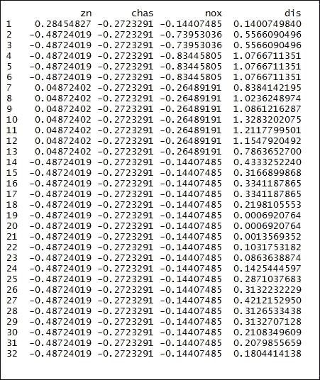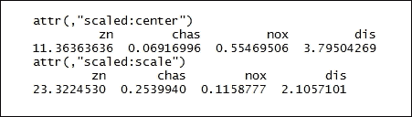

### 步骤 2 -训练模型

创建 SOM 网格:`somgrid()`描绘了自组织地图网格的功能。`xdim = 20`和`ydim=20`是网格的尺寸，而`topo="hexagonal"`代表网格的拓扑结构:

```py
    > som_grid <- somgrid(xdim = 20, ydim=20, topo="hexagonal")

```

训练自组织映射:`som()`是自组织映射的功能，用于将高维光谱或模式映射到 2D。使用欧几里德距离度量。`training_matrix`是数据矩阵，`rlen=1000`是将完整数据集呈现给网络进行训练的次数，α是学习率。`keep.data = TRUE`表示数据需要保存在返回对象中，`n.hood="circular"`表示邻域的形状:

```py
> som_model <- som(training_matrix,
+ grid=som_grid,
+ rlen=1000,
+ alpha=c(0.05,0.01),
+ keep.data = TRUE,
+ n.hood="circular")

```

### 步骤 3 -绘制模型

绘制`som_model`对象:

```py
    > plot(som_model, main ="Training Progress", type="changes", col = "red")

```

结果如下:

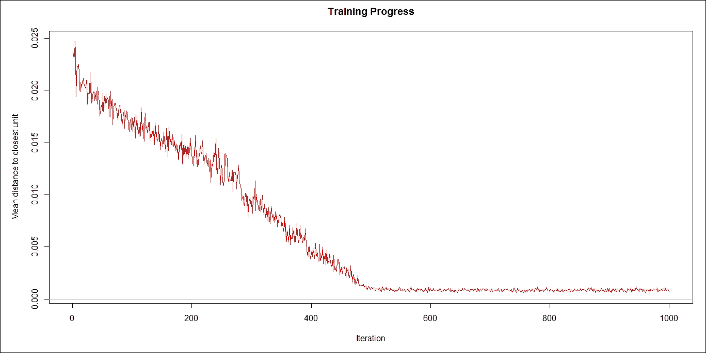

基于节点计数绘制模型:

```py
    > plot(som_model, main ="Node Count", type="count")

```

结果如下:

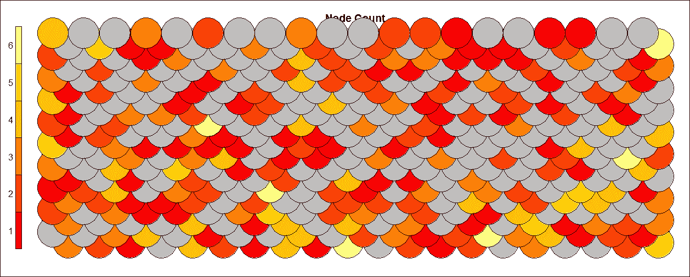

基于邻域距离绘制模型。

```py
    > plot(som_model, main ="Neighbour Distances", type="dist.neighbours")

```

结果如下:

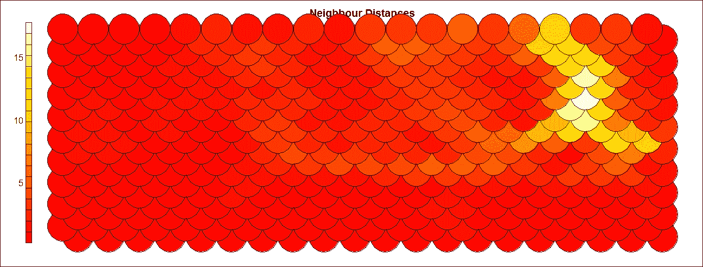

以下代码基于`type = "codes"`绘制模型。

```py
    > plot(som_model, type="codes")

```

结果如下:

以下代码基于属性图绘制模型。

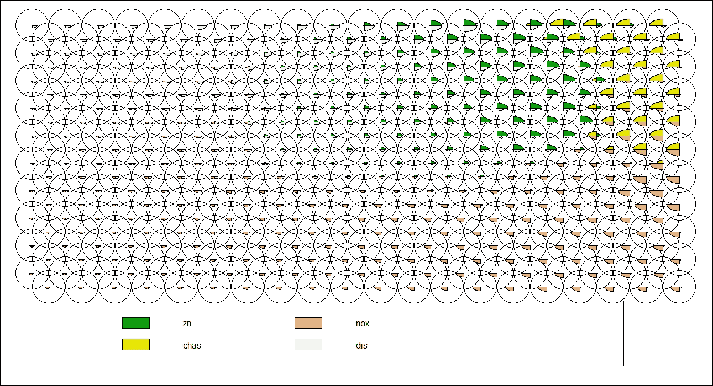

结果如下:

The following code plots the model based on property plot.

```py
    > plot(som_model, type = "property", property = som_model$codes[,4], main=names(som_model$data)[4])

```

The result is as follows:

矢量量化-图像聚类

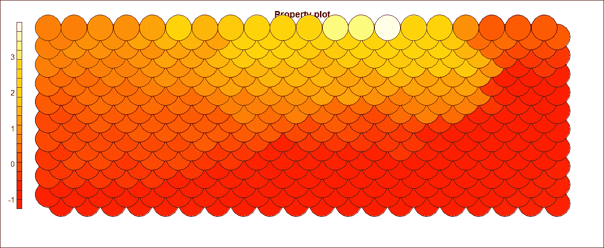

数字媒体领域的技术发展产生了大量图像形式的非文本信息。如果程序能够理解这些图像的意义并理解它们的含义，这将导致大量不同的应用。一个这样的应用可以是使用机器人从医院病人提取恶性组织，使用身体扫描图像来解释组织的位置。图像被认为是传达信息的最重要的媒介之一。信息检索的潜力是巨大的，以至于用户可能会被检索到的信息量所淹没。图像的非结构化格式挑战分类和聚类技术。机器学习算法用于提取信息以理解图像。理解图像的第一步是分割图像并识别图像中的不同物体。为此，可以使用直方图和频域变换等功能。


# 准备就绪

让我们开始吧。

## 步骤 1 -收集和描述数据

使用 JPEG 文件。

### 怎么做...

让我们进入细节。

## 第 2 步-探索数据

首先需要加载以下软件包:

### 注意

版本信息:这个页面的代码在 R 版本 3.3.2 中测试过

```py
> install.packages("jpeg")
> install.packages("ggplot2")
> library(jpeg)
> library(ggplot2)

```

### `readJPEG()`函数用于读取 JPEG 文件格式的图像，并将其转换为光栅数组:。

步骤 3 -数据清理

探索`img`的尺寸:`dim()`函数返回`img`帧的尺寸。`img`数据帧作为输入参数传递:

```py
    > img <- readJPEG("d:/Image.jpg")

```

### 现在让我们打印出`img_Dim`:

结果如下:

```py
    > img_Dim <- dim(img)

```

Now let's print the `img_Dim`:

```py
    > img_Dim

```

The result is as follows:

现在，我们将 RGB(红色、绿色和蓝色- RGB 通道大致遵循人眼的颜色受体)通道分配给数据帧。然后将结果存储在`img_RGB_channels`数据帧中:

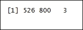

步骤 4 -可视化清理后的数据

让我们绘制原始图像:

```py
> img_RGB_channels <- data.frame(
+ x = rep(1:img_Dim[2], each = img_Dim[1]),
+ y = rep(img_Dim[1]:1, img_Dim[2]),
+ R = as.vector(img[,,1]),
+ G = as.vector(img[,,2]),
+ B = as.vector(img[,,3])
+ )

```

### 结果如下:

Let's plot the original image:

```py
> plotTheme <- function() {
theme(
panel.background = element_rect(
size = 3,
colour = "black",
fill = "white"),
axis.ticks = element_line(
size = 2),
panel.grid.major = element_line(
colour = "gray80",
linetype = "dotted"),
panel.grid.minor = element_line(
colour = "gray90",
linetype = "dashed"),
axis.title.x = element_text(
size = rel(1.2),
face = "bold"),
axis.title.y = element_text(
size = rel(1.2),
face = "bold"),
plot.title = element_text(
size = 20,
face = "bold",
Unsupervised Learning
[ 327 ]
vjust = 1.5)
)
}
> ggplot(data = img_RGB_channels, aes(x = x, y = y)) +
+ geom_point(colour = rgb(img_RGB_channels[c("R", "G", "B")])) +
+ labs(title = "Original Image: Colorful Bird") +
+ xlab("x") +
+ ylab("y") +
+ plotTheme()

```

The result is as follows:

步骤 5 -建立模型并可视化

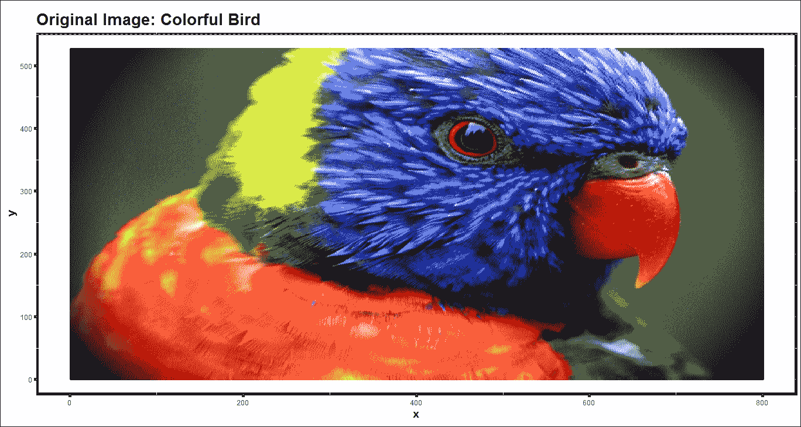

分配聚类颜色:

### 进行 k-means 聚类:`kmeans()`作为函数对数据矩阵`img_RGB_channels`进行聚类。`centers = kClusters`表示初始聚类的数量:

产生对应于红、绿和蓝基色的给定强度的颜色。

```py
    > kClusters <- 3

```

用三个集群绘制图像:

```py
    > kMeans_clst <- kmeans(img_RGB_channels[, c("R", "G", "B")], centers = kClusters)

```

结果如下:

```py
    > kColours <- rgb(kMeans_clst$centers[kMeans_clst$cluster,])

```

Plotting the image with three clusters:

```py
> ggplot(data = img_RGB_channels, aes(x = x, y = y)) +
+ geom_point(colour = kColours) +
+ labs(title = paste("k-Means Clustering of", kClusters, "Colours"))
+
+ xlab("x") +
+ ylab("y") +
+ plotTheme()

```

The result is as follows:

分配聚类颜色:

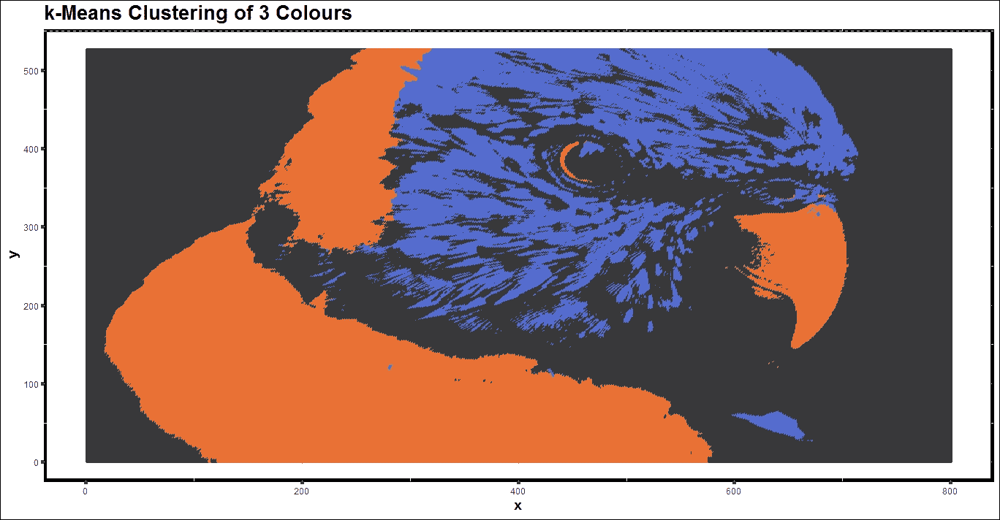

执行 K 均值聚类:

产生对应于红、绿和蓝基色的给定强度的颜色。

```py
    > kClusters <- 5

```

用五个集群绘制图像:

```py
    > kMeans_clst <- kmeans(img_RGB_channels[, c("R", "G", "B")], centers = kClusters)

```

结果如下:

```py
    > kColours <- rgb(kMeans_clst$centers[kMeans_clst$cluster,])

```

Plotting the image with five clusters:

```py
> ggplot(data = img_RGB_channels, aes(x = x, y = y)) +
+ geom_point(colour = kColours) +
+ labs(title = paste("k-Means Clustering of", kClusters, "Colours"))
+
+ xlab("x") +
+ ylab("y") +
+ plotTheme()

```

The result is as follows:

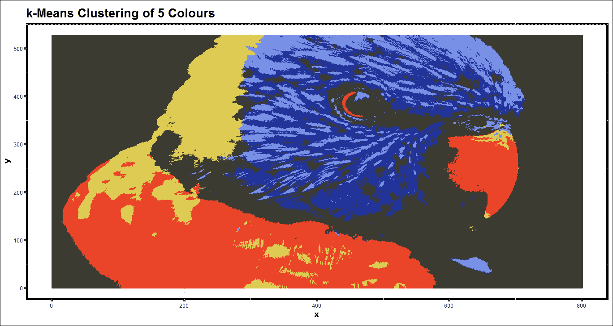