# 第八章。强化学习

在本章中，我们将介绍以下配方:

*   马尔可夫链——股票状态转换模型
*   马尔可夫链——多渠道归因模型
*   马尔可夫链-汽车租赁代理服务
*   连续马氏链-加油站的车辆服务
*   蒙特卡洛模拟-校准船体和白色短速率

# 简介

**马尔可夫链**:如果每个实验的结果是一组离散状态中的一个，并且该实验的结果仅依赖于当前状态而不依赖于任何过去的状态，则该实验的试验序列是马尔可夫链。从一种状态变化到另一种状态的概率表示为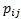。它被称为转移概率。转移概率矩阵是一个 n × n 矩阵，使得矩阵的每个元素都是非负的，并且矩阵的每一行总和为 1。

**连续时间马尔可夫链**:连续时间马尔可夫链可以被标记为增加了具有离散状态的比率的转移系统。状态具有连续的时间步长，延迟是指数分布的。连续时间马尔可夫链适合于对可靠性模型、控制系统、生物途径、化学反应等进行建模。

**蒙特卡洛模拟**:蒙特卡洛模拟是对系统行为的随机模拟。模拟使用在模型上执行的采样实验，然后使用计算机进行数值实验，以获得对系统行为的统计理解。蒙特卡罗模拟用于构建复杂系统的观察行为的理论，预测系统的未来行为，并基于系统内的输入和参数变化研究对最终结果的影响。随机模拟是一种对系统进行实验的方法，以找到改进或更好地理解系统行为的方法。它使用均匀分布在区间[0，1]上的随机数。这些均匀分布的随机数用于从各种概率分布中产生随机变量。然后生成与系统行为建模相关联的采样实验。


# 马尔可夫链-股票状态转换模型

在过去的几十年里，人们对波动性的分析和预测进行了大量的研究。波动性是交易价格序列随时间变化的程度，用收益的标准差来衡量。股票收益模型假设收益遵循几何布朗运动。这意味着在任何离散的时间间隔内，股票的收益都是对数正态分布的，并且在非重叠的时间间隔内的收益是独立的。研究发现，该模型未能捕捉到极端的价格变动和波动率参数的随机可变性。随机波动率取离散值，在这些值之间随机切换。这是**状态切换对数正态过程** ( **RSLN** )的基础。

## 做好准备

为了执行马尔可夫链状态转换模型，我们将使用从股票数据集中收集的数据。

### 步骤 1 -收集和描述数据

应使用名为`StocksRegimeSwitching.csv`的数据集。该数据集以 csv 格式提供，称为`StocksRegimeSwitching.csv`。数据集采用标准格式。有 66 行数据。有七个变量。数字变量如下:

*   `LRY`
*   `LRV`
*   `INT`
*   `LRC`
*   `LVS`
*   `LGS`

非数字变量如下:

*   `DATE`

## 怎么做...

让我们进入细节。

### 第二步-探索数据

第一步是加载以下包:

```
 >install.packages("MSwM")
 >library(MSwM)

```

### 注

版本信息:此页面的代码已在 R 版本 3.2.2 中测试过(2015-08-14)。

让我们探索数据，了解变量之间的关系。我们将从导入名为`StocksRegimeSwitching.csv`的 CSV 数据文件开始。我们将把数据保存到`MarkovSwitchData`数据框中:

```
> MarkovSwitchData <- read.csv("d:/StocksRegimeSwitching.csv", header = TRUE)

```

附加数据集。`attach()`函数将数据集附加到搜索路径。评估变量时会搜索数据集。`MarkovSwitchData`作为参数传递:

```
> attach(MarkovSwitchData)

```

打印`MarkovSwitchData`数据帧。`head()`函数返回`MarkovSwitchData`数据帧的第一部分。`MarkovSwitchData`数据帧作为输入参数传递:

```
> head(MarkovSwitchData)

```

结果如下:

探索`MarkovSwitchData`数据框的维度。`dim()`函数返回`MarkovSwitchData`框架的尺寸。`MarkovSwitchData`数据帧作为输入参数传递。结果清楚地表明有 66 行数据和 7 个单列:

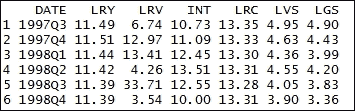

结果如下:

Exploring the dimension of the `MarkovSwitchData` data frame. The `dim()`function returns the dimension of the `MarkovSwitchData` frame. The `MarkovSwitchData` data frame is passed as an input parameter. The result clearly states that there are 66 rows of data and seven single columns:

```
> dim(MarkovSwitchData)

```

The result is as follows:

打印`MarkovSwitchData`数据框的摘要。`summary()`功能是多功能功能。`summary()`函数是一个通用函数，提供与单个对象或数据框相关的数据汇总。`MarkovSwitchData`数据帧作为 R 对象传递给`summary()`函数:


结果如下:

Printing the summary of the `MarkovSwitchData` data frame. The `summary()` function is a multipurpose function. The `summary()` function is a generic function that provides a summary of the data related to the individual object or data frame. The `MarkovSwitchData` data frame is passed as an R object to the `summary()` function:

```
> summary(MarkovSwitchData)

```

The result is as follows:

步骤 3 -准备回归模型

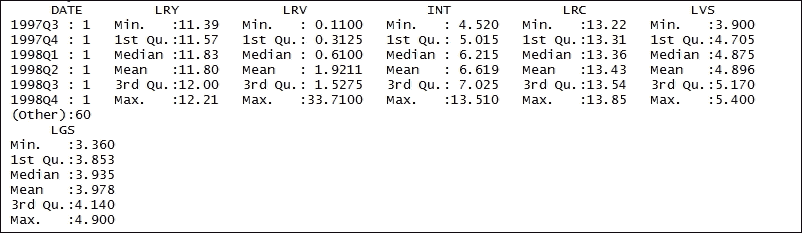

将在数据集上准备回归模型。当两个或多个变量被认为通过线性关系系统地联系在一起时，就使用回归分析。回归模型用于从一个变量预测另一个变量。它们根据信息提供对过去、现在和未来事件的预测。

### 定义因变量。`cbind()`功能用于定义因变量。该函数接收`LVS`数据帧。结果数据帧存储在`yLogValueStocks`数据帧中:

打印`yLogValueStocks`帧。`head()`函数返回`yLogValueStocks`帧的第一部分。`yLogValueStocks`帧作为输入参数传递:

结果如下:

```
 > yLogValueStocks <- cbind(LVS)

```

Printing the `yLogValueStocks` frame. The `head()` function returns the first part of the `yLogValueStocks` frame. The `yLogValueStocks` frame is passed as an input parameter:

```
 > head(yLogValueStocks)

```

The result is as follows:

`cbind ()`函数接收`LGS`数据帧。结果数据帧存储在`yLogGrowthStocks`数据帧中。

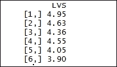

打印`yLogGrowthStocks`画面。`head()`函数返回`yLogGrowthStocks`数据帧的第一部分。`yLogGrowthStocks`帧作为输入参数传递:

结果如下:

Printing the `yLogGrowthStocks` frame. The `head()` function returns the first part of the `yLogGrowthStocks` data frame. The `yLogGrowthStocks` frame is passed as an input parameter:

```
> head(yLogGrowthStocks)

```

The result is as follows:

定义自变量`cbind()`函数用于定义因变量。该函数接收`LRY`、`LRC`、`INT`、`LRV`数据帧。结果数据帧存储在`x`数据帧中:

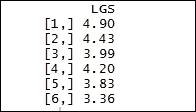

创建一个**普通最小二乘** ( **OLS** )回归方程。`lm()`功能用于拟合线性模型。待拟合的模型象征性地由`yLogValueStocks~x`表示。结果存储在`olsLogValueStocks`数据框中:

打印`olsLogValueStocks`数据帧的摘要。`summary()`功能用于提供与单个对象或数据框相关的数据摘要。`olsLogValueStocks`数据帧作为 R 对象传递给`summary()`函数:

```
> x <- cbind(LRY, LRC, INT, LRV)

```

结果如下:

```
> olsLogValueStocks <- lm(yLogValueStocks~x)

```

Printing the summary of the `olsLogValueStocks` data frame. The `summary()` function is used to provide a summary of the data related to the individual object or data frame. The `olsLogValueStocks` data frame is passed as an R object to the `summary()` function:

```
> summary(olsLogValueStocks)

```

The result is as follows:

创建普通最小二乘回归方程。待拟合的模型象征性地由`yLogGrowthStocks~x`表示。然后将结果存储在`olsLogGrowthStocks`数据帧中:

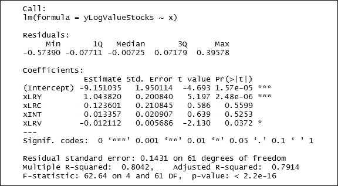

打印`olsLogGrowthStocks`数据帧的摘要。`olsLogGrowthStocks`数据帧作为 R 对象传递给`summary()`函数:

结果如下:

```
> olsLogGrowthStocks <- lm(yLogGrowthStocks~x)

```

Printing the summary of the `olsLogGrowthStocks` data frame. The `olsLogGrowthStocks` data frame is passed as an R object to the `summary()` function:

```
> summary(olsLogGrowthStocks)

```

The result is as follows:

步骤 4 -准备马尔可夫转换模型

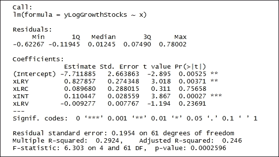

马尔可夫转换模型包括多个方程，这些方程可以描述不同状态下的时间序列行为。该模型能够通过在结构之间切换来捕捉复杂的动态模式。状态变量的当前值取决于刚刚过去的值，该值由马尔可夫特性控制。

### 为股票价值创建马尔可夫转换模型。`msmFit()`函数使用 EM 算法实现马尔可夫切换模型，如下所示。`olsLogValueStocks`属于`lm`类型的对象类。`k = 2`代表估计的政权数量。结果存储在`MarkovSwtchLogValueStocks`数据帧中:

如下打印`MarkovSwtchLogValueStocks`数据帧的摘要。`MarkovSwtchLogValueStocks`数据帧作为 R 对象传递给`summary()`函数:

结果如下:

```
> MarkovSwtchLogValueStocks <- msmFit(olsLogValueStocks, k = 2, sw = rep(TRUE, 6))

```

Printing the summary of the `MarkovSwtchLogValueStocks` data frame as follows. The `MarkovSwtchLogValueStocks` data frame is passed as an R object to the `summary()` function:

```
> summary(MarkovSwtchLogValueStocks)

```

The result is as follows:

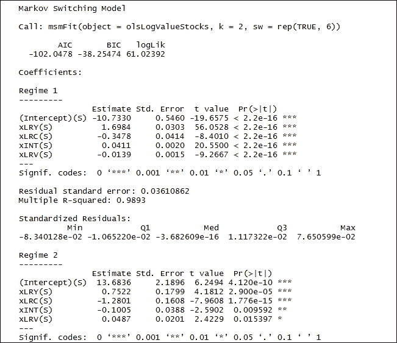

为成长型股票创建马尔可夫转换模型。`msmFit()`函数使用 EM 算法实现马尔可夫切换模型。`olsLogGrowthStocks`是`lm`类型的对象类。`k = 2`代表估计的政权数量。结果存储在`MarkoSwtchLogGrowthStocks`数据帧中:

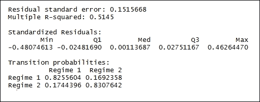

打印`MarkoSwtchLogGrowthStocksdata`帧的摘要。`MarkoSwtchLogGrowthStocks`数据帧作为 R 对象传递给`summary()`函数:

结果如下:

```
> MarkoSwtchLogGrowthStocks<- msmFit(olsLogGrowthStocks, k = 2, sw = rep(TRUE, 6))

```

Printing the summary of the `MarkoSwtchLogGrowthStocksdata` frame. The `MarkoSwtchLogGrowthStocks` data frame is passed as an R object to the `summary()` function:

```
> summary(MarkoSwtchLogGrowthStocks)

```

The result is as follows:


第 5 步——绘制制度概率图

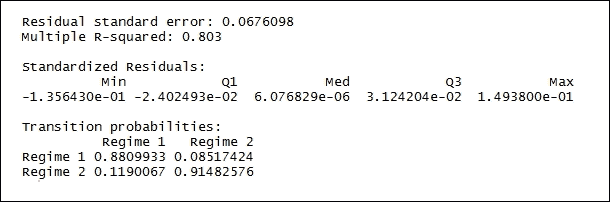

接下来我们将绘制已经计算过的状态概率。

### 绘制股票价值的制度概率。`par()`功能用于查询如下图形参数:

`plotProb()`功能为每个政权创建每个地块。该图包含平滑和过滤的概率。`MarkovSwtchLogValueStocks`作为类型`MSM.lm`的对象被传递。`which = 1`值代表所需的绘图子集。使用以下命令:

结果如下:

```
> par(mar=c(3,3,3,3))

```

The `plotProb()` function creates each plot for each regime. The plot contains smoothed and filtered probabilities. `MarkovSwtchLogValueStocks` is passed as an object of type `MSM.lm`. The `which = 1` value represents the subset of the plots that is required. Use the following command:

```
> plotProb(MarkovSwtchLogValueStocks, which=1)

```

The result is as follows:

`plotProb()`功能为每个状态创建每个图。该图包含平滑和过滤的概率。`MarkovSwtchLogValueStocks`作为`MSM.lm` 类型的对象被传递。`which = 2`值代表响应变量与平滑概率的状态图。使用以下命令:

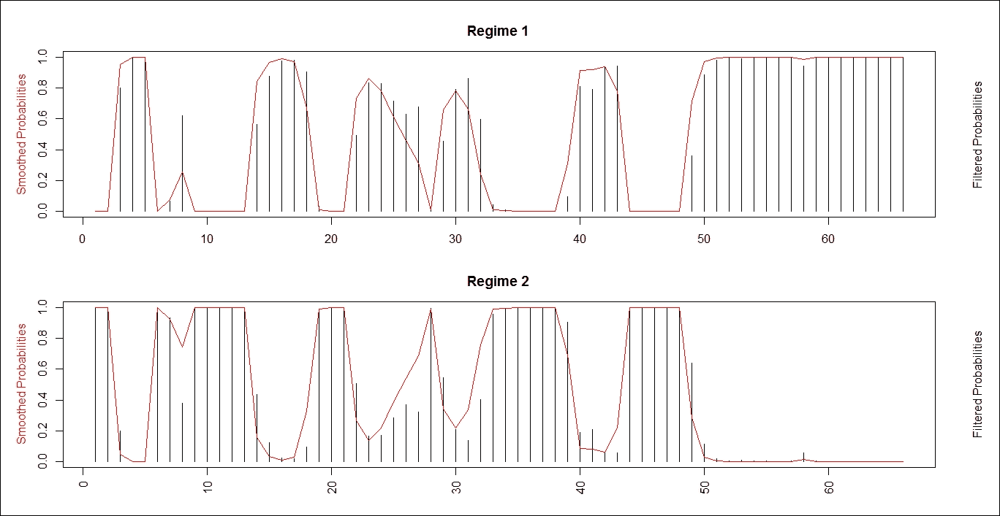

结果如下:

The `plotProb()` function creates each plot for each regime. The plot contains smoothed and filtered probabilities. `MarkovSwtchLogValueStocks` is passed as an object of the `MSM.lm` type. The `which = 2` value represents the plot of the regime with the response variable against the smoothed probabilities. Use the following command:

```
> plotProb(MarkovSwtchLogValueStocks, which=2)

```

The result is as follows:

`plotProb()`功能为每个状态创建每个图。`MarkoSwtchLogGrowthStocks`作为`MSM.lm`类型的对象传递。`which = 1`值代表所需的绘图子集:

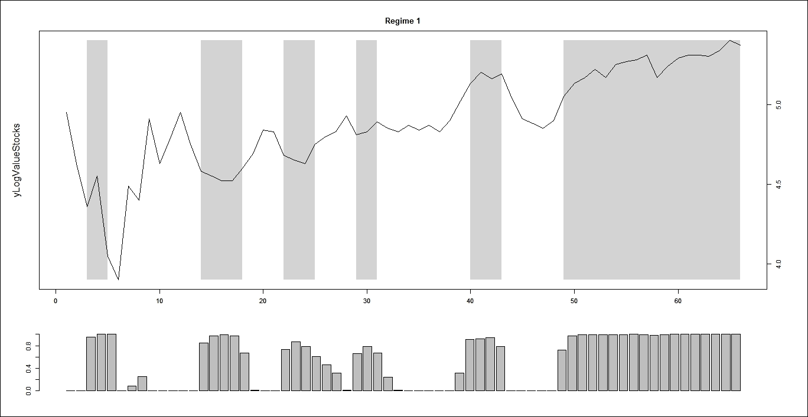

结果如下:

The `plotProb()` function creates each plot for each regime. `MarkoSwtchLogGrowthStocks` is passed as an object of the `MSM.lm` type. The `which = 1` value represents the subset of the plots that is required:

```
> plotProb(MarkoSwtchLogGrowthStocks, which=1)

```

The result is as follows:

`plotProb()`功能为每个状态创建每个图。`MarkoSwtchLogGrowthStocks`作为`MSM.lm`类型的对象传递。`which = 2`值代表响应变量与平滑概率的状态图。使用以下命令:

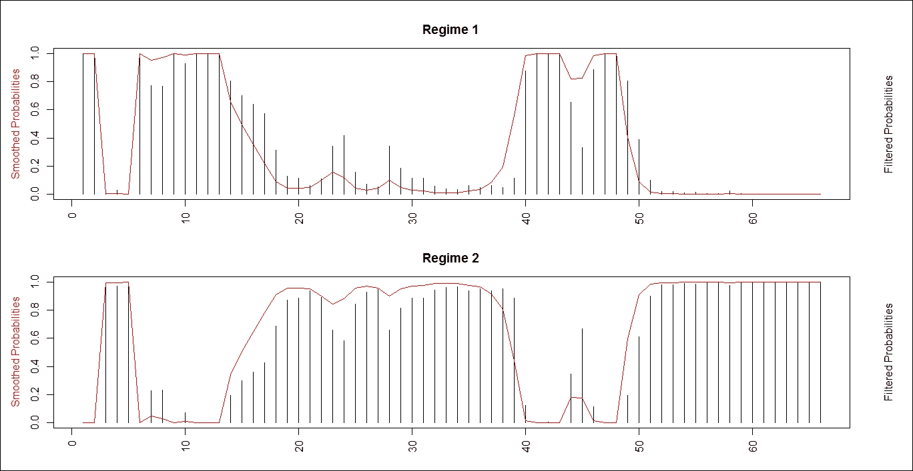

结果如下:

The `plotProb()` function creates each plot for each regime. `MarkoSwtchLogGrowthStocks` is passed as an object of the `MSM.lm` type. The `which = 2` value represents the plot of the regime with the response variable against the smoothed probabilities. Use the following command:

```
> plotProb(MarkoSwtchLogGrowthStocks, which=2)

```

The result is as follows:

步骤 6 -测试马尔可夫转换模型

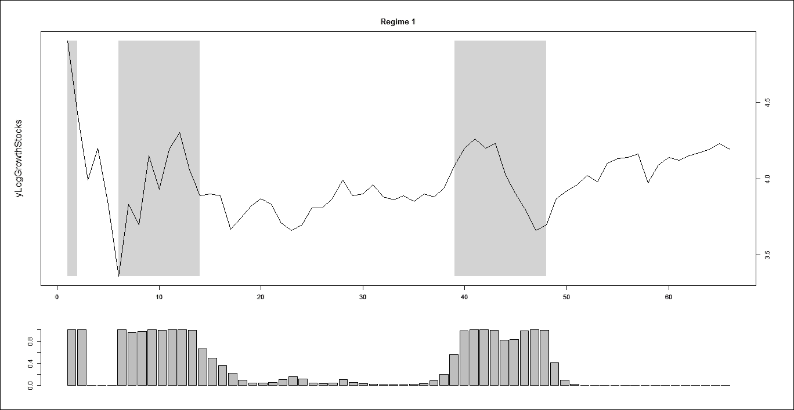

接下来，我们将对马尔可夫转换模型进行一系列诊断测试。

### 绘制股票价值的制度概率。`par()`功能用于查询图形参数:

创建残差分析图。`plotDiag()`函数绘制拟合值的残差。`MarkovSwtchLogValueStocks`作为一个`MSM.lm`类型的对象被传递。`which = 1`值代表所需的绘图子集。`which=1`值代表残差与拟合值的关系图:

结果如下:

```
> par(mar=c(3,3,3,3))

```

Creating the plots for the residual analysis. The `plotDiag()` function plots the residuals against the fitted values. `MarkovSwtchLogValueStocks` is passed as an object of the `MSM.lm` type. The `which = 1` value represents the subset of the plots is that required. The `which=1` value represents the plot of residuals against fitted values:

```
> plotDiag(MarkovSwtchLogValueStocks, regime=1, which=1)

```

The result is as follows:

`plotDiag()`函数绘制残差与拟合值的关系。`MarkovSwtchLogValueStocks`作为`MSM.lm`类型的对象被传递。`which = 2`代表所需的绘图子集。`which=2`代表正常 Q-Q 图:

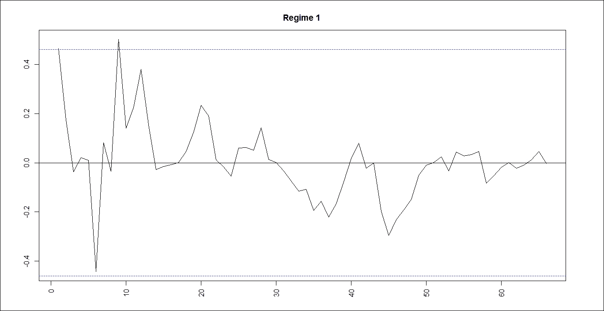

结果如下:

The `plotDiag()` function plots the residuals against the fitted values. `MarkovSwtchLogValueStocks` is passed as an object of the `MSM.lm` type. `which = 2` represents the subset of the plots that is required. `which=2` represents the Normal Q-Q plot:

```
> plotDiag(MarkovSwtchLogValueStocks, regime=1, which=2)

```

The result is as follows:

`plotDiag()`函数绘制拟合值的残差。`MarkoSwtchLogGrowthStocks`作为`MSM.lm`类型的对象传递。`which = 3`代表所需的绘图子集。`which=3`表示残差的 ACF/PACF 和残差平方的 ACF/PACF:

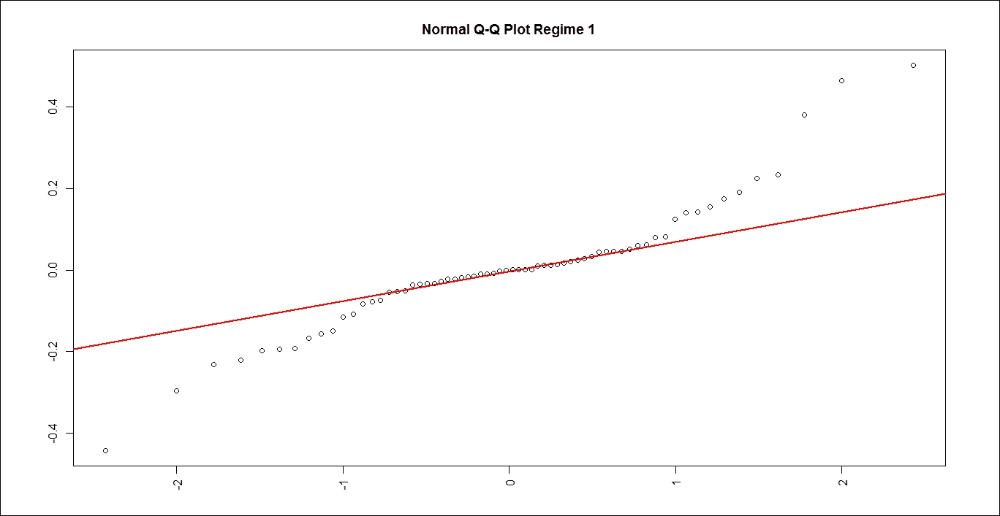

结果如下:

The `plotDiag()` function plots the residuals against the fitted values. `MarkoSwtchLogGrowthStocks` is passed as an object of the `MSM.lm` type. `which = 3` represents the subset of the plots that is required. `which=3` represents the ACF/PACF of residuals and the ACF/PACF of square residuals:

```
> plotDiag(MarkoSwtchLogGrowthStocks, regime=1, which=3)

```

The result is as follows:

`plotDiag()`功能根据拟合值绘制残差。`MarkoSwtchLogGrowthStocks`作为`MSM.lm`类型的对象传递。`which = 1`代表所需的绘图子集。`which = 1`代表残差与拟合值的关系图:

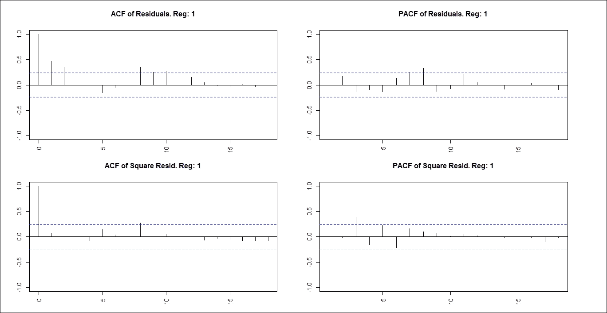

结果如下:

The `plotDiag()` function plots the residuals against the fitted values. `MarkoSwtchLogGrowthStocks` is passed as an object of the `MSM.lm` type. `which = 1` represents the subset of the plots that is required. `which = 1` represents the plot of residuals against fitted values:

```
> plotDiag(MarkoSwtchLogGrowthStocks, regime=1, which=1)

```

The result is as follows:

`plotDiag()`功能根据拟合值绘制残差。`MarkoSwtchLogGrowthStocks`是作为`MSM.lm`类型的对象传递的。`which = 2`代表所需的绘图子集。`which=2`代表正常 Q-Q 图:

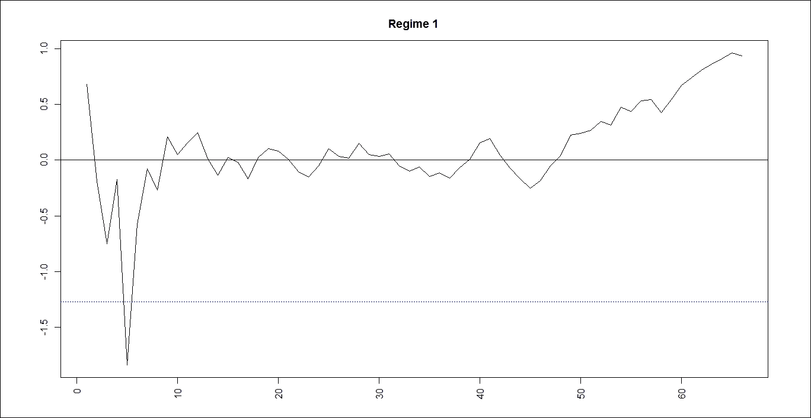

结果如下:

The `plotDiag()` function plots the residuals against the fitted values. `MarkoSwtchLogGrowthStocks` is passed as an object of the `MSM.lm` type. `which = 2` represents the subset of the plots that is required. `which=2` represents the Normal Q-Q plot:

```
> plotDiag(MarkoSwtchLogGrowthStocks, regime=1, which=2)

```

The result is as follows:

`plotDiag()`功能根据拟合值绘制残差。`MarkoSwtchLogGrowthStocks`作为`MSM.lm`类型的对象传递。`which = 3`代表所需的绘图子集。`which=3`表示残差的 ACF/PACF 和残差平方的 ACF/PACF:

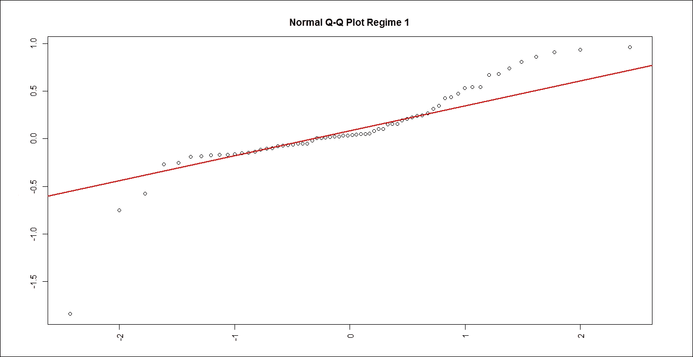

结果如下:

The `plotDiag()` function plots the residuals against the fitted values. `MarkoSwtchLogGrowthStocks` is passed as an object of the `MSM.lm` type. `which = 3` represents the subset of the plots that is required. `which=3` represents the ACF/PACF of residuals and the ACF/PACF of square residuals:

```
> plotDiag(MarkoSwtchLogGrowthStocks, regime=1, which=3)

```

The result is as follows:

马尔可夫链-多渠道归因模型

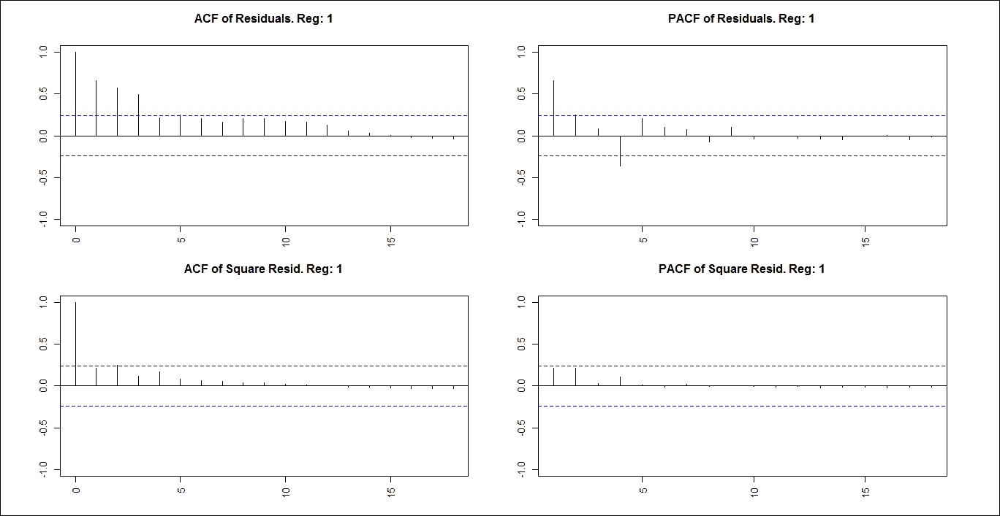

在电子商务网站上购买之前，客户的旅程经历了不同渠道的路径。多渠道归因为旅程中的每一步赋予一个价值。问题是，如何识别人们在你的网站上采取的导致转化的行动的价值。通常，企业使用“最后一次点击”归因，这意味着将所有转化价值分配给旅程的最后一步或“第一次点击”归因。开发多渠道归因分析的第一步是了解客户的旅程——从认知到购买再到售后支持。最终目标是发展忠诚的顾客，他们会花大量的钱购买，向他人推荐这个品牌，这个品牌有可能成为一个品牌。


# 准备就绪

为了执行马尔可夫链多渠道归因模型，我们将模拟包含三个独特渠道的客户旅程。

## 怎么做...

让我们进入细节。

## 步骤 1 -准备数据集

首先加载以下软件包:

### 注意

版本信息:此页面的代码已在 R 版本 3.2.2 中测试过(2015-08-14)。

```
    > install.packages("dplyr")
    > install.packages("reshape2")
    > install.packages("ggplot2")
    > install.packages("ChannelAttribution")
    > install.packages("markovchain")
    > library(dplyr)
    > library(reshape2)
    > library(ggplot2)
    > library(ChannelAttribution)
    > library(markovchain)

```

### 创建数据样本:`c()`函数将参数组合成一个向量。传递给函数的所有参数被组合成一个公共类型，即返回值的类型。`data.frame()`函数创建了一个紧密耦合的数据框架，它是共享矩阵和列表的许多属性的变量的集合。我们将数据保存到`datafrm1`数据框，如下所示:

如下打印`datafrm1`数据帧:

结果如下:

```
> datafrm1 <- data.frame(path = c('c1 > c2 > c3', 'c1', 'c2 > c3'), conv = c(1, 0, 0), conv_null = c(0, 1, 1))

```

Print the `datafrm1` data frame as follows:

```
> datafrm1

```

The result is as follows:

步骤 2 -准备模型

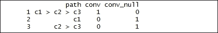

准备马尔可夫模型。`markov_model()`函数从客户旅程数据中估计 k 阶马尔可夫模型。`datafrm1`是包含定义的客户旅程的数据帧。`var_path`变量具有包含旅程路径的列的名称。`var_conv`变量表示包含总转换的列的名称。`var_null`变量表示包含不导致转换的总路径的列。`out_more = TRUE`返回通道和移除效果之间的转换概率。

### 估计的 k 阶马尔可夫模型的结果存储在`model1`数据帧中，如下所示:

打印`model1`数据帧:

结果如下:

```
> model1 <- markov_model(datafrm1, var_path = 'path', var_conv = 'conv', var_null = 'conv_null', out_more = TRUE)

```

Printing the `model1` data frame:

```
> model1

```

The result is as follows:

从`model1data`帧中提取结果属性如下。然后将结果存储在`datafrmresult1`数据帧中:

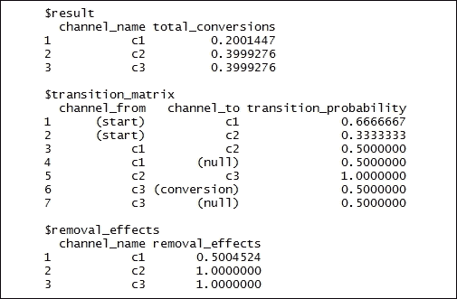

如下从`model1data`帧中提取`transition_matrix`属性。结果存储在`datafrmtransmatrix1`数据框中:

重塑数据框。整形数据帧的结果存储在`datafrmtransmatrix`中:

```
> datafr{BS}l1$result

```

打印`datafrmtransmatrix`数据框:

```
> datafrmtransmatrix1 <- model1$transition_matrix

```

结果如下:

```
> datafrmtransmatrix <- dcast(datafrmtransmatrix1, channel_from ~ channel_to, value.var = 'transition_probability')

```

Printing the `datafrmtransmatrix` data frame:

```
> datafrmtransmatrix

```

The result is as follows:

第三步——绘制马尔可夫图

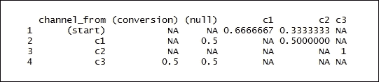

从`model1`数据帧中提取`transition_matrix`属性。然后将结果存储在`datafrmtransmatrix`数据帧中:

### 打印`datafrmtransmatrix`数据帧，如下所示:

结果如下:

```
> datafrmtransmatrix <- model1$transition_matrix

```

Print the `datafrmtransmatrix` data frame as follows:

```
> datafrmtransmatrix

```

The result is as follows:

创建`datafrmdummy`数据样本。`c()`函数将参数组合成一个向量。传递给函数的所有参数被组合成一个公共类型，即返回值的类型。`data.frame()`函数创建了一个紧密耦合的数据框架，它是共享矩阵和列表的许多属性的变量的集合。我们将数据保存到`datafrmdummy`数据框，如下所示:

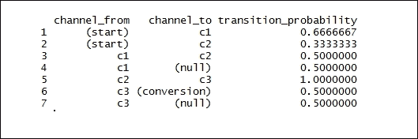

打印`datafrmtransmatrix`数据帧:

结果如下:

```
> datafrmdummy <- data.frame(channel_from = c('(start)', '(conversion)', '(null)'), channel_to = c('(start)', '(conversion)', '(null)'), transition_probability = c(0, 1, 1))

```

Printing the `datafrmtransmatrix` data frame:

```
> datafrmtransmatrix

```

The result is as follows:

如下组合各列*。* `rbind()`获取一系列数据帧并将其组合。`datafrmtransmatrix`和`df_dummy`作为输入参数传递。结果是`datafrmtransmatrix`数据帧:

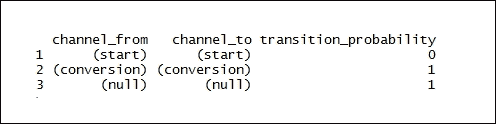

打印`datafrmtransmatrix`数据帧:

结果如下:

```
> datafrmtransmatrix <- rbind(datafrmtransmatrix, datafrmdummy)

```

Printing the `datafrmtransmatrix` data frame:

```
> datafrmtransmatrix

```

The result is as follows:

按如下方式对频道进行排序。`factor()` as 函数用于编码一个矢量作为因子。`datafrmtransmatrix$channel_from`是作为向量传递的数据。`levels = c('(start)', '(conversion)', '(null)', 'c1', 'c2', 'c3')`代表可选向量的值:

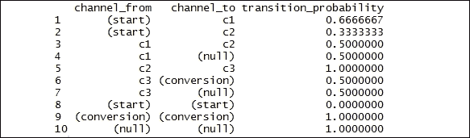

打印`datafrmtransmatrix$channel_from`数据帧如下:

结果如下:

```
> datafrmtransmatrix$channel_from <- factor(datafrmtransmatrix$channel_from, levels = c('(start)', '(conversion)', '(null)', 'c1', 'c2', 'c3'))

```

Printing the `datafrmtransmatrix$channel_from` data frame as follows:

```
> datafrmtransmatrix$channel_from

```

The result is as follows:

如下对通道进行排序。`datafrmtransmatrix$channel_to`作为向量传递的数据:

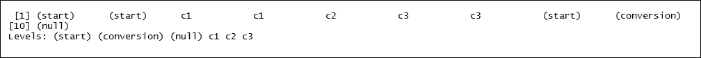

打印`datafrmtransmatrix$channel_to`数据帧:

结果如下:

```
> datafrmtransmatrix$channel_to <- factor(datafrmtransmatrix$channel_to, levels = c('(start)', '(conversion)', '(null)', 'c1', 'c2', 'c3'))

```

Print `datafrmtransmatrix$channel_to` the data frame:

```
> datafrmtransmatrix$channel_to

```

The result is as follows:

重塑数据框。整形数据帧的结果存储在`datafrmtransmatrix`中:

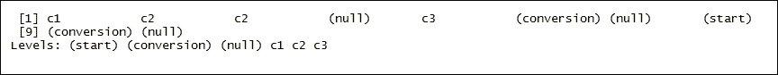

打印`datafrmtransmatrix`数据帧:

结果如下:

```
> datafrmtransmatrix <- dcast(datafrmtransmatrix, channel_from ~ channel_to, value.var = 'transition_probability')

```

Printing the `datafrmtransmatrix` data frame:

```
> datafrmtransmatrix

```

The result is as follows:

创建马尔可夫链对象。`matrix()` as 函数根据一组给定的值创建一个矩阵:

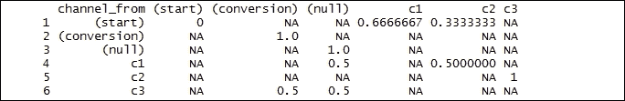

打印`transitionmatrix`数据帧:

结果如下:

```
> transitionmatrix <- matrix(data = as.matrix(datafrmtransmatrix[, -1]), nrow = nrow(datafrmtransmatrix[, -1]), ncol = ncol(datafrmtransmatrix[, -1]), dimnames = list
(c(as.character(datafrmtransmatrix[, 1])), c(colnames(datafrmtransmatrix[, -1]))))

```

Printing the `transitionmatrix` data frame:

```
> transitionmatrix

```

The result is as follows:

创建马尔可夫链对象。`transitionMatrix`将是一个转移矩阵，也就是说，所有条目都是概率，所有行或所有列的总和为 1:

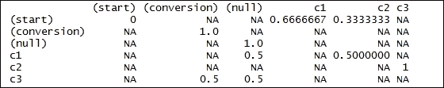

打印`transitionmatrix1`数据框:

```
> transitionmatrix[is.na(transitionmatrix)] <- 0

```

结果如下:

```
> transitionmatrix1 <- new("markovchain", transitionMatrix = transitionmatrix)

```

Printing the `transitionmatrix1` data frame:

```
> transitionmatrix1

```

The result is as follows:

绘制图表:

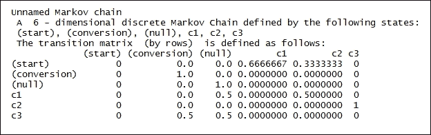

结果如下:

Plotting the graph:

```
> plot(transitionmatrix1, edge.arrow.size = 0.5, main = "Markov Graph Transition Matrix - transitionmatrix1")

```

The result is as follows:

第 4 步-模拟顾客旅程的数据集

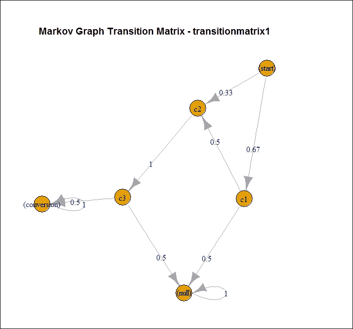

`data.frame()`函数创建了一个紧密耦合的数据框架，它是共享矩阵和列表的许多属性的变量的集合。我们将数据保存到`datafrm2`数据框，如下所示:

### 打印`datafrm2`帧。`head()`函数返回`datafrm2`帧的第一部分。`datafrm2`帧作为输入参数传递:

结果如下:

```
    > set.seed(354)
    > datafrm2 <- data.frame(client_id = sample(c(1:1000), 5000, replace = TRUE), date = sample(c(1:32), 5000, replace = TRUE), channel = sample(c(0:9), 5000, replace = TRUE, prob = c(0.1, 0.15, 0.05, 0.07, 0.11, 0.07, 0.13, 0.1, 0.06, 0.16)))

```

Printing the `datafrm2` frame. The `head()` function returns the first part of the `datafrm2` frame. The `datafrm2` frame is passed as an input parameter:

```
> head(datafrm2)

```

The result is as follows:

将字符对象转换为日期对象。`datafrm2$date`表示要转换的对象。`origin = "2016-01-01"`代表`Date`对象:

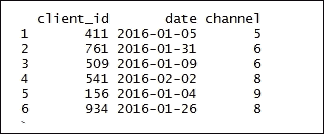

在转换成字符后连接向量。将`channel_`对象添加到通道中。`datafrm2$channel`代表数据帧:

打印`datafrm2`帧。`head()`函数返回`datafrm2`帧的第一部分。`datafrm2`帧作为输入参数传递:

```
> datafrm2$date <- as.Date(datafrm2$date, origin = "2016-01-01")

```

结果如下:

```
> datafrm2$channel <- paste0('channel_', datafrm2$channel)

```

Printing the `datafrm2` frame. The `head()` function returns the first part of the `datafrm2` frame. The `datafrm2` frame is passed as an input parameter:

```
> head(datafrm2)

```

The result is as follows:

将渠道聚合到每个客户的路径:

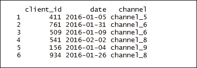

打印`datafrm2`数据帧:

结果如下:

```
> datafrm2 <- datafrm2 %>% group_by(client_id) %>% summarise(path = paste(channel, collapse = ' > '), conv = 1, conv_null = 0) %>% ungroup()

```

Printing the `datafrm2` data frame:

```
> datafrm2

```

The result is as follows:

准备马尔可夫模型。`markov_model()`函数根据客户旅程数据估计 k 阶马尔可夫模型。`datafrm2`是包含定义的客户旅程的数据帧。`var_path`具有包含旅程路径的列的名称。`var_conv`表示包含总转换的列的名称。`var_null`表示包含不导致转换的总路径的列。`out_more = TRUE`返回通道和移除效果之间的转换概率。

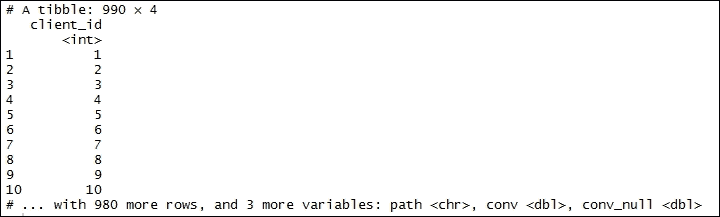

估计的 k 阶马尔可夫模型的结果存储在`model2`数据帧中，如下所示:

打印`datafrmheuristic`数据帧:

结果如下:

```
> model2 <- markov_model(datafrm2, var_path = 'path', var_conv = 'conv', var_null = 'conv_null', out_more = TRUE)

```

```
> datafrmheuristic <- datafrm2 %>% mutate(channel_name_ft = sub('>.*', '', path), channel_name_ft = sub(' ', '', channel_name_ft), channel_name_lt = sub('.*>', '', path), channel_name_lt = sub(' ', '', channel_name_lt))

```

Printing the `datafrmheuristic` data frame:

```
> datafrmheuristic

```

The result is as follows:

打印`datafrmfirsttouch`数据帧:

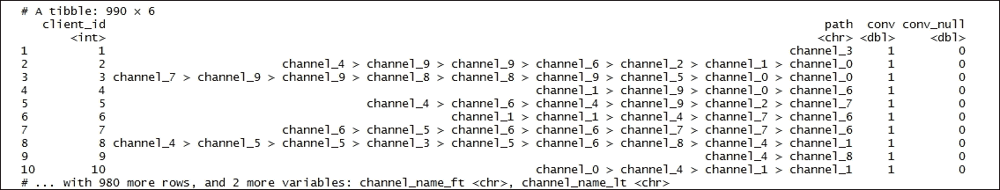

结果如下:

```
> datafrmfirsttouch <- datafrmheuristic %>% group_by(channel_name_ft) %>% summarise(first_touch_conversions = sum(conv)) %>% ungroup()

```

打印`datafrmfirsttouch`数据帧:

```
> datafrmfirsttouch

```

结果如下:

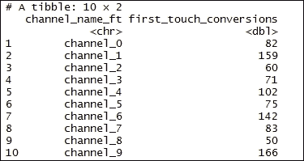

```
> datafrmlasttouch <- datafrmheuristic %>% group_by(channel_name_lt) %>% summarise(last_touch_conversions = sum(conv)) %>% ungroup()

```

通过公共列合并两个数据框。结果存储在`heuristicmodel2`数据帧中:

```
> datafrmfirsttouch

```

打印`heuristicmodel2`数据框:

结果如下:

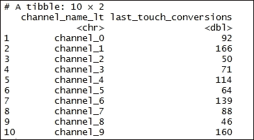

Merging the two data frames by common columns. The result is stored in the `heuristicmodel2` data frame:

```
> heuristicmodel2 <- merge(datafrmfirsttouch, datafrmlasttouch, by.x = 'channel_name_ft', by.y = 'channel_name_lt')

```

合并所有模型:

```
> heuristicmodel2

```

打印`allmodels`数据帧:

结果如下:

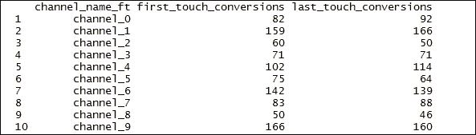

Merging all the models:

```
> allmodels <- merge(heuristicmodel2, model2$result, by.x = 'channel_name_ft', by.y = 'channel_name')

```

步骤 5 -为真实数据准备转换矩阵热图

```
> allmodels

```

绘制热图。

返回`datafrmplottransition$transition_probability`数据框中所有参数的最大值:

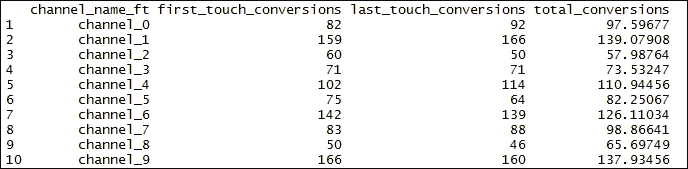

打印`t`的值:

### 结果如下:

Plotting the heatmap.

```
    > colnames(allmodels)[c(1, 4)] <- c('channel_name', 'attrib_model_conversions')
    > datafrmplottransition <- model2$transition_matrix
    > cols <- c("#e7f0fa", "#c9e2f6", "#95cbee", "#0099dc", "#4ab04a", "#ffd73e", "#eec73a", "#e29421", "#e29421", "#f05336", "#ce472e")

```

Return the maximum value of all the arguments present in the `datafrmplottransition$transition_probability` data frame:

```
> t <- max(datafrmplottransition$transition_probability)

```

结果如下:

```
> t

```

The result is as follows:

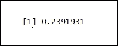

马尔可夫链-汽车租赁代理服务

```
> ggplot(datafrmplottransition, aes(y = channel_from, x = channel_to, fill = transition_probability)) + theme_minimal() + geom_tile(colour = "white", width = .9, height = .9) + scale_fill_gradientn(colours = cols, limits = c(0, t), breaks = seq(0, t, by = t/4), labels = c("0", round(t/4*1, 2), round(t/4*2, 2), round(t/4*3, 2), round(t/4*4, 2)), guide = guide_colourbar(ticks = T, nbin = 50, barheight = .5, label = T, barwidth = 10)) + geom_text(aes(label = round(transition_probability, 2)), fontface = "bold", size = 4) + theme(legend.position = 'bottom', legend.direction = "horizontal", panel.grid.major = element_blank(), panel.grid.minor = element_blank(), plot.title = element_text(size = 20, face = "bold", vjust = 2, color = 'black', lineheight = 0.8), axis.title.x = element_text(size = 24, face = "bold"), axis.title.y = element_text(size = 24, face = "bold"), axis.text.y = element_text(size = 8, face = "bold", color = 'black'), axis.text.x = element_text(size = 8, angle = 90, hjust = 0.5, vjust = 0.5, face = "plain")) + ggtitle("Heatmap - Transition Matrix ")

```

假设一家汽车租赁公司在渥太华有三个位置:市中心位置(标记为 A)、东区位置(标记为 B)和西区位置(标记为 C)。该机构有一组送货司机为所有三个地点提供服务。该机构的统计员已确定如下:

在对`Downtown`位置的呼叫中，30%在市中心地区发送，30%在`East`端发送，40%在`West`端发送

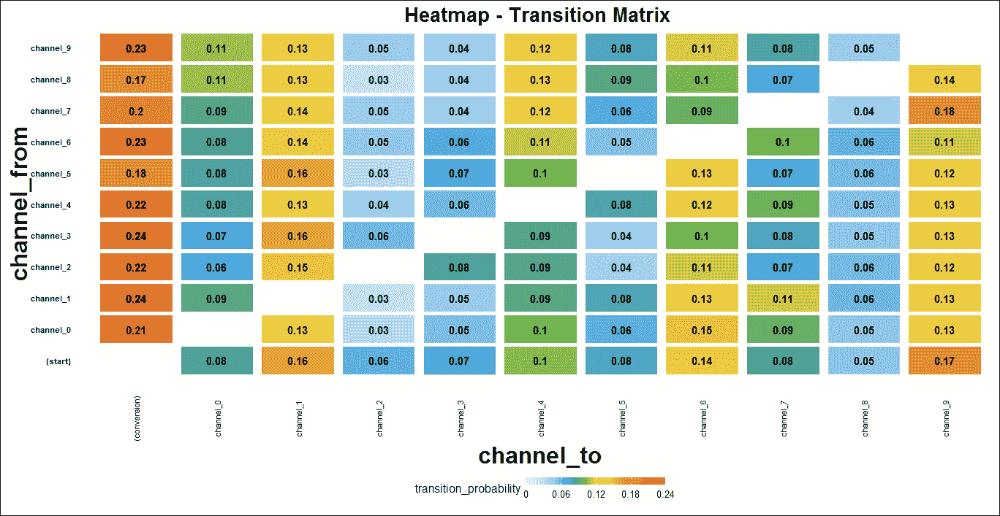

到`East`端位置的呼叫中，40%在市中心地区发送，40%在`East`端发送，20%在`West`端发送


# 到`West`端位置的呼叫中，50%在闹市区，30%在`East`端，20%在`West`端

送货后，司机会去最近的地方进行下一次送货。这样，特定驾驶员的位置仅由他们先前的位置来确定。

*   如何做到这一点...
*   让我们进入细节。
*   步骤 1 -准备数据集

加载以下包:

## 注

版本信息:此页面的代码已在 R 版本 3.2.2 中测试过(2015-08-14)。

### 创建数据样本。`c()`函数将参数组合成一个向量。传递给函数的所有参数被组合成一个公共类型，即返回值的类型。我们将把数据保存到`RentalStates`数据框:

打印`RentalStates`的值:

```
    > install.packages("markovchain")
    > library(markovchain)

```

### 结果如下:

创建矩阵。`matrix()`函数从给定的一组值中创建一个矩阵。`byrow = T`矩阵由行填充。`nrow = 3`代表所需的行数。`c()`函数将参数组合成一个向量。传递给函数的所有参数被组合成一个公共类型，即返回值的类型:

打印`RentalTransitionMatrix`的值:

```
> RentalStates <- c("Downtown", "East", "West")

```

结果如下:

```
> RentalStates

```

The result is as follows:

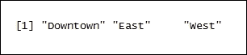

步骤 2 -准备模型

创建马尔可夫链对象。`new()`函数创建类型为`markovchain`的对象。States 代表先前定义的`RentalStates`。`byrow = T matrix`由行填充。然后将结果存储在数据帧`mcRental`中:

```
> RentalTransitionMatrix <- matrix(c(0.3, 0.3, 0.4, 
 0.4, 0.4, 0.2, 
 0.5, 0.3, 0.2),
 byrow = T, nrow = 3, dimnames = list(RentalStates, RentalStates))

```

打印`mcRental`数据帧:

```
> RentalTransitionMatrix

```

结果如下:

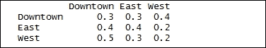

### 通过调用`mcRental`对象访问转移矩阵，如下所示:

结果如下:

```
> mcRental <- new("markovchain", states = RentalStates, byrow = T, transitionMatrix = RentalTransitionMatrix, name = "Rental Cars")

```

Printing the `mcRental` data frame:

```
> mcRental

```

The result is as follows:

绘制`mcRental`对象。`plot()`是绘制 R 对象的通用函数:

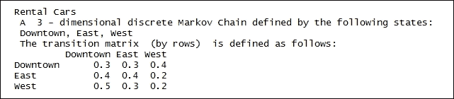

结果如下:

Accessing the transition matrix by calling the `mcRental` object as follows:

```
> mcRental[2]

```

The result is as follows:

计算转移概率。`transitionProbability` `()`提供对转移概率的直接访问。

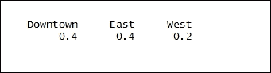

结果如下:

Ploting the `mcRental` object. `plot()` is a generic function to plot R objects:

```
> plot(mcRental)

```

The result is as follows:

第三步-改进模型

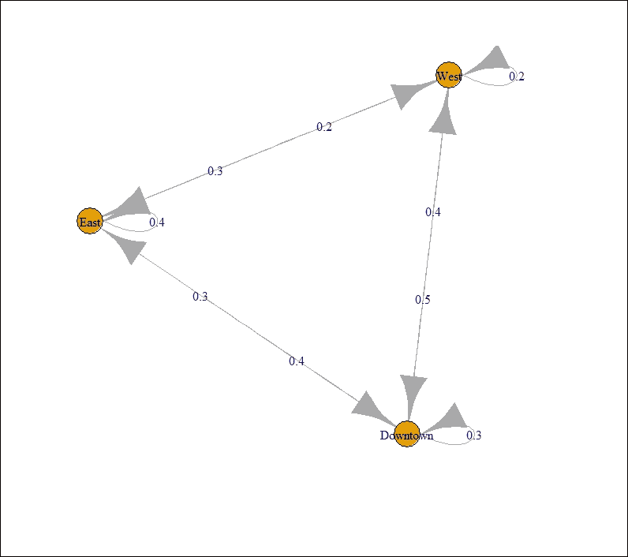

计算两次出行中位于市中心的概率；市区到市区:

计算从东部位置去市区的概率；东至市中心:

```
> transitionProbability(mcRental, "East", "West")

```

计算从西边位置去市区的概率；从西部到市中心:

结果如下:

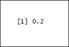

### Step 3 - improving the model

对`mcRental`矩阵求平方以计算概率，我们将分两次前往市中心:

```
> x <- 0.3 * 0.3

```

结果如下:

```
> y <- 0.3 * 0.4

```

Calculating the probability of going Downtown from the West location; West to Downtown:

```
    > z <- 0.4 * 0.5
    > x + y + z

```

The result is as follows:

使用`mcRental`矩阵概率计算检查我们将在 20 次旅行中到达市中心的概率，如下所示:

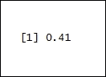

结果如下:

Squaring the `mcRental` matrix to calculate the probability, we will be downtown in two trips:

```
> mcRental ^ 2

```

The result is as follows:

使用`mcRental`矩阵概率计算检查我们在三次旅行中到达市中心的概率，如下所示:

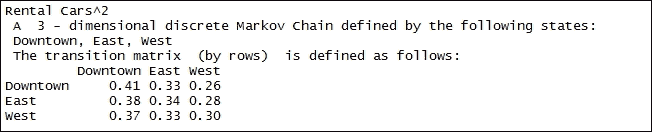

结果如下:

Checking the probability that we will be downtown in 20 trips using the `mcRental` matrix probability calculation as follows:

```
> mcRental ^ 20

```

The result is as follows:

此方法以 markovchain 对象的矩阵形式返回固定向量:


结果如下:

Checking the probability that we will be downtown in three trips using the `mcRental` matrix probability calculation as follows:

```
> mcRental ^ 30

```

The result is as follows:

打印`mcRental`的摘要:


结果如下:

This method returns the stationary vector in matrix form of a markovchain object:

```
> 70 * steadyStates(mcRental)

```

The result is as follows:

给定当前状态，提取后续状态的条件分布。`mcRental`是通过的马尔可夫链对象，而`"Downtown"`是下一个状态:


结果如下:

Printing the summary of `mcRental`:

```
> summary(mcRental)

```

The result is as follows:

结果如下:


Extracting the conditional distribution of the subsequent state, given the current state. `mcRental` is the markov chain object that is passed while `"Downtown"` is the next state:

```
> conditionalDistribution(mcRental, "Downtown")

```

结果如下:

连续马尔可夫链——加油站的车辆服务


加油站只有一个油泵。没有车辆等待的空间。如果车辆到达加油站，并且车辆离开时没有一个地方不在加油站加油。车辆以每分钟 3/20 辆的速度遵循泊松过程到达加油站。在到达泵的车辆中，75%是汽车，25%是摩托车。加油时间可以用指数随机变量来建模，汽车的平均值为 8 分钟，摩托车的平均值为 3 分钟。

```
> conditionalDistribution(mcRental, "West")

```

准备就绪

为了在加油站执行车辆服务的连续马尔可夫链，我们将模拟数据。


怎么做...

```
> conditionalDistribution(mcRental, "East")

```

让我们进入细节。

步骤 1 -准备数据集


加载以下包:


# 注意

版本信息:此页面的代码已在 R 版本 3.2.2 中测试过(2015-08-14)

## 初始化车辆到达率:

打印`ArrivalRate`数据帧:

## 结果如下:

Let's get into the details.

### Step 1 - preparing the dataset

初始化车辆的服务率并创建数据样本。`c()`函数将参数组合成一个向量。传递给函数的所有参数被组合成一个公共类型，即返回值的类型。我们将把数据保存到`ServiceRate`数据框中:

```
    > install.packages("simmer")
    > install.packages("ggplot2")
    > library(simmer)
    > library(ggplot2)

```

### 打印`ServiceRate`数据帧:

结果如下:

Initializing the vehicle arrival rate:

```
> ArrivalRate <- 3/20

```

Printing the `ArrivalRate` data frame:

```
> ArrivalRate

```

初始化汽车到达的概率:

创建转换矩阵。`matrix()`作为一个函数从一组给定的值中创建一个矩阵。结果存储在`TransitionMatrix`数据帧中:


打印`TransitionMatrix`数据帧:

结果如下:

```
> ServiceRate <- c(1/8, 1/3)

```

Printing the `ServiceRate` data frame:

```
> ServiceRate

```

The result is as follows:

初始化向量:


步骤 2 -计算理论分辨率

解线性方程组。`solve()`用于计算线性方程。`t(A)`表示转移矩阵，而`B`是向量。然后将结果存储在`P`中:

```
> p <- 0.75

```

打印`P`数据帧:

```
> TransitionMatrix <- matrix(c(1,   ServiceRate[1],     0,
 1,   -ArrivalRate,       (1-p)*ArrivalRate,
 1,   ServiceRate[2],     -ServiceRate[2]), byrow=T, ncol=3)

```

结果如下:

```
> TransitionMatrix

```

The result is as follows:


计算理论分辨率。`sum()`计算总和。然后将结果存储在`Resolution`中:

打印`Resolution`数据帧:

```
> B <- c(1, 0, 0)

```

### 结果如下:

Solving the linear system of equations. `solve()` is used to compute the linear equation. `t(A)` represents the transition matrix while `B` is the vector. The result is then stored in `P`:

```
> P <- solve(t(A), B)

```

Printing the `P` data frame:

```
> P

```

步骤 3 -验证理论解的收敛性

模拟系统并验证其收敛于理论解:


定义`option.1`功能。一个`create_trajectory()`函数创建汽车和摩托车类型的轨迹对象。这些对象包含一系列要附加到生成器对象的活动。执行按名称获取泵对象的活动。`amount=1`指需要扣押的物品的数量。`timeout()`功能根据用户定义插入延迟。`timeout()`函数也接受`rexp()`函数，该函数随机生成指数分布，其比率定义为`car`对象的`ServiceRate[1] = 1/8`和`motorcycle`对象的`ServiceRate[1] = 1/3`。

然后如下创建模拟器对象。该方法初始化模拟环境。`car`和`motorcycle`对象以指数分布创建，比率定义为`p*ArrivalRate`，其中`ArrivalRate = 0.15`。然后，在模拟环境中创建新的到达生成器:

```
> Resolution <- sum(P * c(1, 0, 1)) 

```

定义`option.2`功能。为所有类型的车辆定义单个生成器和单个轨迹。为了区分汽车和摩托车，在抢占资源后定义一个分支来选择合适的服务时间。

```
> Resolution

```

一个`create_trajectory()`功能创建一个`vehicle`类型的轨迹对象。该对象包含一系列附加到生成器对象的活动。执行按名称获取泵对象的活动。`amount=1`指需要扣押的物品数量。然后`create_trajectory()`函数调用`timeout()`函数，根据用户定义插入延迟。`timeout()`函数也接受`rexp()`函数，该函数随机生成指数分布，比率定义为汽车对象的`ServiceRate[1] = 1/8`和`motorcycle`对象的`ServiceRate[1] = 1/3`。

然后如下创建模拟器对象。该方法初始化模拟环境。`car`和`motorcycle`对象是以指数分布创建的，其速率定义为`p*ArrivalRate. ArrivalRate = 0.15`。然后`run()`功能继续运行，直到用户定义的超时，如`until=t`中所述:


定义`option.3`功能。`option.2`增加了不必要的开销。进行额外的调用来选择分支，因此性能下降。在`timeout()`功能中直接选择服务时间:

### 调用如下创建的选项:

第 4 步-绘制结果

```
> set.seed(1234)

```

绘制结果。`plot_resource_usage()`用于绘制模拟时间范围内的资源使用情况。`gas.station`代表单煨环境。`"pump"`代表资源的名称。`items="system"`指要绘制的资源的组成部分。然后将结果存储在`ggplot2`类型图形的对象中:

结果如下:

```
> option.1 <- function(t) {
 car <- create_trajectory() %>%
 seize("pump", amount=1) %>%
 timeout(function() rexp(1, ServiceRate[1])) %>%
 release("pump", amount=1)

```

```
 motorcycle <- create_trajectory() %>%
 seize("pump", amount=1) %>%
 timeout(function() rexp(1, ServiceRate[2])) %>%
 release("pump", amount=1)

```

```
 simmer() %>%
 add_resource("pump", capacity=1, queue_size=0) %>%
 add_generator("car", car, function() rexp(1, p*ArrivalRate)) %>%
 add_generator("motorcycle", motorcycle, function() rexp(1, (1-p)*ArrivalRate)) %>%
 run(until=t)
 }

```

Defining the `option.2` function. Define a single generator for all kinds of vehicles and a single trajectory. In order to distinguish between cars and motorcycles, define a branch after seizing the resource to select the proper service time.

A `create_trajectory()` function creates the trajectory object of the `vehicle` type. This object comprises a chain of activities that is to be attached to a generator object. Activities for seizing the pump object by name are carried out. `amount=1` means the number of objects that are required to be seized. The `create_trajectory()` function then calls the `timeout()` function that inserts the delays based on the user definition. The `timeout()` function, also takes in the `rexp()` function which randomly generates the exponential distribution with the rate defined as `ServiceRate[1] = 1/8` for a car object and `ServiceRate[1] = 1/3` for a `motorcycle` object.

蒙特卡洛模拟-校准船体和白色短装率

```
> option.2 <- function(t) {
 vehicle <- create_trajectory() %>%
 seize("pump", amount=1) %>%
 branch(function() sample(c(1, 2), 1, prob=c(p, 1-p)), merge=c(T, T),
 create_trajectory("car") %>%
 timeout(function() rexp(1, ServiceRate[1])),
 create_trajectory("motorcycle") %>%
 timeout(function() rexp(1, ServiceRate[2]))) %>%
 release("pump", amount=1)
 simmer() %>%
 add_resource("pump", capacity=1, queue_size=0) %>%
 add_generator("vehicle", vehicle, function() rexp(1, ArrivalRate)) %>%
 run(until=t)
 }

```

蒙特卡罗模拟是对系统行为的随机模拟。模拟使用在模型上执行的采样实验，然后使用计算机进行数值实验，以获得对系统行为的统计理解。

```
    > option.3 <- function(t) {
       vehicle <- create_trajectory() %>%
       seize("pump", amount=1) %>%
       timeout(function() {
if (runif(1) < p) rexp(1, ServiceRate[1]) 
else rexp(1, ServiceRate[2]) 
       }) %>%
    release("pump", amount=1)
    simmer() %>%
    add_resource("pump", capacity=1, queue_size=0) %>%
    add_generator("vehicle", vehicle, function() rexp(1, ArrivalRate)) %>%
    run(until=t)
    }

```

做好准备

```
> gas.station <- option.3(5000)

```

### 为了对校准的 hull 和 white 短期利率进行蒙特卡罗模拟，数据取自于随`QuantLib` 0.3.10 一起提供的样本代码，市场数据用于构建利率期限结构和对应到期日和期限的掉期期权波动率矩阵。

步骤 1 -安装软件包和库

```
    > graph <- plot_resource_usage(gas.station, "pump", items="system")
    > graph + geom_hline(yintercept = Resolution)

```

加载以下包:

注


版本信息:此页面的代码已在 R 版本 3.2.2 中测试过(2015-08-14)


# 为了使 R 环境可以访问部分`Quantlib`包，使用了`RQuantLib`。`Quantlib`软件包为量化金融提供了一个全面的软件框架。`RQuantLib`的目标是为本地或远程的建模、交易、源提供源库。GSPC 是资产。

`type="binary"`表示要下载和安装的软件包类型。这意味着要安装的包的性质不是源包。

## 怎么做...

让我们进入细节。

### 步骤 2 -初始化数据和变量

初始化变量:

```
    >install.packages("RQuantLib", type="binary")
    >install.packages("ESGtoolkit")
    >library(RQuantLib)
    >library(ESGtoolkit)

```

### 打印`delta_t`的值:

结果如下:

In order to make part of the `Quantlib` package accessible to the R environment `RQuantLib` is used. The `Quantlib` package provides a comprehensive software framework for quantitative finance. The goal of the `RQuantLib` is to provide source libraries for modeling, trading, sources, either local or remote sources. GSPC is assets.

`type="binary"` indicates the type of package to be downloaded and installed. This means that the nature of the package to be installed is not a source package.

## 从集成了`QuantLib` 0.3.10 的示例代码中初始化变量。指定`tradeDate`(月/日/年)、`settleDate`、远期汇率时间跨度`dt`和两个曲线构建选项的列表:`interpWhat`(可能值为贴现、远期和零)和`interpHow`(可能值为线性、对数线性和样条)。这里的样条是指`interpWhat`值的三次样条插值。

然后将结果存储在`params`数据帧中:

### 初始化市场数据。期限结构是为利率、存款和互换而构建的。然后将结果存储在`TermQuotes`中:

正在初始化`Swaptionmaturities`:

```
    > freq <- "monthly"
    > delta_t <- 1/12

```

打印`SwaptionMaturities`的值:

```
> delta_t

```

结果如下:


正在初始化交换凸榫:

打印`SwapTenors`的值:

```
> params <- list(tradeDate=as.Date('2002-2-15'),
 settleDate=as.Date('2002-2-19'),
 payFixed=TRUE,
 dt=delta_t,
 strike=.06,
 method="HWAnalytic",
 interpWhat="zero",
 interpHow= "spline")

```

结果如下:

```
> TermQuotes  <- list(d1w =0.0382, # 1-week deposit rate
 d1m =0.0372,# 1-month deposit rate
 d3m = 0.0363,# 3-month deposit rate
 d6m = 0.0353,# 6-month deposit rate
 d9m = 0.0348,# 9-month deposit rate
 d1y = 0.0345,# 1-year deposit rate
 s2y = 0.037125,# 2-year swap rate
 s3y =0.0398,# 3-year swap rate
 s5y =0.0443,# 5-year swap rate
 s10y =0.05165,# 10-year swap rate
 s15y =0.055175)# 15-year swap rate

```

Initializing the `Swaptionmaturities`:

```
> SwaptionMaturities <- c(1,2,3,4,5)

```

Printing the value of `SwaptionMaturities`:

```
> SwaptionMaturities

```

初始化波动矩阵。`matrix()`函数根据给定的一组值创建一个矩阵。`ncol=5`表示所需的列数。`byrow=TRUE`表示矩阵按行填充。然后将结果存储在`VolatilityMatrix`中:

步骤 3 -百慕大互换期权定价


百慕大互换期权定价如下。`BermudanSwaption`是`Quantlib`包的一部分。这可以通过使用`RQuantLib`访问 R 环境。`BermudanSwaption`在将选定的短期利率模型校准到输入互换期权波动率矩阵后，为具有指定执行期和到期日(以年为单位)的百慕大互换期权定价。互换期权的到期日和互换期限都是以年为单位的。假设百慕大互换期权可在基础互换的每个重置日执行。传递`params`、`TermQuotes`、`SwaptionMaturities`、`SwapTenors`和`VolatilityMatrix`作为输入用于计算百慕大交换选项。结果存储在`BermudanSwaption`中:

显示`BermudanSwaption`估价。结果如下:

```
> SwapTenors <- c(1,2,3,4,5)

```

Printing the value of `SwapTenors`:

```
> SwapTenors

```

The result is as follows:

打印`BermudanSwaption`的摘要:


结果如下:

Initializing the volatility matrix. The `matrix()` function creates a matrix from the given set of values. `ncol=5` denotes the number of desired of columns. `byrow=TRUE` means the matrix is filled by rows. The result is then stored in `VolatilityMatrix`:

```
> VolatilityMatrix <- matrix(
 c(0.1490, 0.1340, 0.1228, 0.1189, 0.1148,
 0.1290, 0.1201, 0.1146, 0.1108, 0.1040,
 0.1149, 0.1112, 0.1070, 0.1010, 0.0957,
 0.1047, 0.1021, 0.0980, 0.0951, 0.1270,
 0.1000, 0.0950, 0.0900, 0.1230, 0.1160),
 ncol=5, byrow=TRUE)

```

### Step 3 - pricing the Bermudan swaptions

打印`BermudanSwaption`的估价:

```
> BermudanSwaption <- RQuantLib::BermudanSwaption(params, TermQuotes, SwaptionMaturities, SwapTenors, VolatilityMatrix)

```

结果如下:

步骤 4 -构建即期利率期限结构


初始化返回折扣因子、远期汇率和零汇率的时间向量。规定时间，使得最大时间加上`delta_t`不超过用于校准的仪器的最长到期时间(无外推法):

`DiscountCurve`根据包括结算日、存款利率和掉期利率在内的输入市场数据，构建即期利率期限结构。它返回指定为输入的时间向量的相应折扣因子、零利率和远期利率。params 表示一个列表，它指定了`tradeDate`(月/日/年)、`settleDate`、远期汇率时间跨度和两个曲线构造选项:`interpWhat`(可能值为贴现、远期和零)和`interpHow`(可能值为`linear`、`loglinear`和`spline`)。这里的样条是指`interpWhat`值的三次样条插值。`TermQuotes`代表市场报价，用于构建即期利率期限结构。使用以下命令:

```
> summary(BermudanSwaption)

```

探索`DiscountCurve`数据帧的内部结构。`str()`功能显示数据帧的内部结构。`DiscountCurve`作为 R 对象传递给`str()`函数:

结果如下:


Printing the valuations of `BermudanSwaption`:

```
> BermudanSwaption

```

寻找返回贴现因子、远期利率和零利率的到期时间:

打印到期值:


结果如下:

### Step 4 - constructing the spot term structure of interest rates

Initializing the vector of times at which to return the discount factors, forward rates, and zero rates. Times are specified such that the largest time plus `delta_t` does not exceed the longest maturity of the instruments used for calibration (no extrapolation):

```
> times <- seq(from = delta_t, to = 5, by = delta_t)

```

寻找零息票利率:

```
> DiscountCurve <- RQuantLib::DiscountCurve(params, TermQuotes, times)

```

打印零息票利率的值:

```
> str(DiscountCurve)

```

结果如下:


寻找折扣系数:

```
> maturities <- DiscountCurve$times

```

打印折扣系数:

```
> maturities

```

结果如下:


步骤 5 -模拟船壳白短费率

```
> MarketZeroRates <- DiscountCurve$zerorates

```

设定时间范围:

```
> MarketZeroRates

```

设置模拟的数量:

打印`a`的值:


Finding discount factors:

```
> MarketPrices <- DiscountCurve$discounts

```

打印`sigma`的值:

```
> MarketPrices

```

The result is as follows:


模拟高斯冲击。`simshocks()`为风险因素创建相关或相依高斯冲击的模拟版本。`n = NoSimulations`表示模拟次数。`horizon = 5`表示时间范围。`frequency = monthly`。结果存储在`GaussianShocks`数据框中:

### `simdiff()`模拟扩散过程。`n = NoSimulations`代表独立观察的次数。`frequency = freq`是月刊。`model = "OU"`代表奥恩斯坦-乌伦贝克方法。`x0 = 0`是流程的起始值。`eps = GaussianShocks`代表高斯冲击:

计算远期汇率。`ts()`创建时间序列对象。`replicate(nb.sims, DiscountCurve$forwards)`创建时间序列值的向量。`start = start(x)`代表第一次观察的时间。`deltat = deltat(x)`代表连续观察之间的采样周期的分数。然后将结果存储在`ForwardRates`数据帧中:

```
> horizon <- 5

```

生成规则序列。`from = 0`、`to = horizon`表示序列的起始值和结束值。`by = delta_t`依次表示增量:

```
    > NoSimulations <- 10000
    > a <- BermudanSwaption$a

```

生成短期利率:

```
> a

```

计算随机折扣值。`r = ShortRates`表示短期利率，`X = 1`表示资产价格:


计算随机折扣值的平均值:

```
> sigma <- BermudanSwaption$sigma

```

打印`MonteCarloPrices`的值:

```
> sigma

```

结果如下:


Simulating Gaussian shocks. `simshocks()` create a simulated version of correlated or dependent Gaussian shocks for risk factors. `n = NoSimulations` denotes number of simulations. `horizon = 5` means the time horizons. `frequency = monthly`. The result is then stored in the `GaussianShocks` data frame:

```
> GaussianShocks <- ESGtoolkit::simshocks(n = NoSimulations, horizon = horizon, frequency = freq)

```

计算随机折扣值的零利率:

```
> x <- ESGtoolkit::simdiff(n = NoSimulations, horizon = horizon, frequency = freq, model = "OU", x0 = 0, theta1 = 0, theta2 = a, theta3 = sigma, eps = GaussianShocks)

```

打印`MonteCarloZeroRates`的值:

```
> ForwardRates <- ts(replicate(nb.sims, DiscountCurve$forwards), start = start(x), deltat = deltat(x))

```

结果如下:

```
    > t.out <- seq(from = 0, to = horizon, by = delta_t)
    > param.alpha <- ts(replicate(NoSimulations, 0.5*(sigma^2)*(1 - exp(-a*t.out))^2/(a^2)), start = start(x), deltat = deltat(x))
    > alpha <- ForwardRates + param.alpha

```

Generating the short-term rates:

```
> ShortRates <- x + alpha

```

Calculating stochastic discount values. `r = ShortRates` denotes the short term rates, `X = 1` denotes the asset's price:

```
> StochasticDiscount <- ESGtoolkit::esgdiscountfactor(r = ShortRates, X = 1)

```

对随机折扣条款和市场价格之间的差异进行 student t 检验。`t.test(x)`执行 t 检验。`conf.int`均值为均值的置信区间适当:

```
> MonteCarloPrices <- rowMeans(StochasticDiscount)

```

`head()`函数返回`ConfidenceInterval`帧的第一部分。`ConfidenceInterval`帧作为输入参数传递如下:

```
> MonteCarloPrices

```

The result is as follows:


按如下方式设置图形参数:

`esgplotbands()`绘制色带置信区间如下。`ShortRates`代表置信区间:

```
> MonteCarloZeroRates <- -log(MonteCarloPrices)/maturities

```

Printing the values of `MonteCarloZeroRates`:

```
> MonteCarloZeroRates

```

The result is as follows:

绘制**蒙特卡洛 v/s 市场 n 零利率**如下。到期日，`MonteCarloZeroRates`代表时间序列:


Performing the student t test on the difference between stochastic discount terms and market prices. `t.test(x)` performs the t test. `conf.int` means confidence interval for the mean appropriate:

```
> ConfidenceInterval <- t(apply((StochasticDiscount - MarketPrices)[-1, ], 1, function(x) t.test(x)$conf.int))

```

在到期日之间的图的指定坐标处添加一系列点，`MonteCarloZeroRates`:

```
> head(ConfidenceInterval)

```


绘制蒙特卡洛 v/s 市场价格如下。到期日，`MonteCarloPrices`代表时间序列:

```
> par(mfrow = c(2, 2))

```

在到期日之间的图的指定坐标处添加一系列点，`MonteCarloPrices`:

```
> ESGtoolkit::esgplotbands(ShortRates, xlab = "maturities", ylab = "short-rate quantiles", main = "Short Rate Quantiles")

```


Plotting the **Monte Carlo v/s Market n Zero Rates** as follows. maturities, `MonteCarloZeroRates` represents the time series:

```
> plot(maturities, MonteCarloZeroRates, type='l', col = 'blue', lwd = 1, main = "Monte Carlo v/s Market n Zero Rates")

```


Adding a sequence of points at the specified coordinates of the plot between maturities, `MonteCarloZeroRates`:

```
> points(maturities, MonteCarloZeroRates, col = 'red')

```


Plotting the Monte Carlo v/s Market Prices as follows. maturities, `MonteCarloPrices` represents the time series:

```
> plot(maturities, MonteCarloPrices, type='l', col = 'blue', lwd = 1, main = "Monte Carlo v/s Market Prices")

```


Adding a sequence of points at the specified coordinates of the plot between maturities, `MonteCarloPrices`:

```
> points(maturities, MonteCarloPrices, col = 'red')

```


```
> matplot(maturities[-1], conf.int, type = 'l', main = "Confidence Interval for the price difference")

```