# 十、神经网络

在本章中，我们将介绍以下配方:

*   建模标准普尔 500
*   衡量失业率

# 简介

**神经网络**:神经网络是一个有序的三元组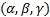，其中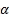是一个神经元的集合，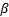是一个集合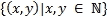，其元素称为神经元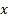和神经元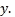之间的连接，函数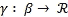定义了权重，其中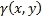是神经元和神经元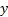之间的连接的权重。数据通过连接在神经元之间传递，连接权重要么是兴奋性的，要么是抑制性的。


# 造型 SP 500

在纽约证券交易所或纳斯达克综合指数上市的市值最大的 500 家公司的股票价值用标准普尔 500 来衡量。标准普尔以股票价格为基础，提供股票市场和经济运动的快速观察。标准普尔 500 指数是金融媒体和专业人士最常用的指标。标准普尔 500 指数的计算方法是将所有标准普尔 500 股票的调整后市值总和除以标准普尔开发的指数除数。当有可能影响指数价值的股票分割、特别股息或分拆时，会调整除数。除数确保这些非经济因素不会影响指数。

## 准备就绪

为了使用神经网络对标准普尔 500 指数建模，我们将使用从`GSPC`数据集收集的数据集。

### 步骤 1 -收集和描述数据

要使用的数据集是 2009 年 1 月 1 日到 2014 年 1 月 1 日之间的`GSPC`每日收盘股票值。这个数据集可以在 https://www.yahoo.com/的[上免费获得，我们将从那里下载数据。](https://www.yahoo.com/)

## 怎么做...

让我们进入细节。

### 第 2 步-探索数据

首先，需要加载以下包:

```
 > install.packages("quantmod")
 > install.packages("neuralnet")
 > library(quantmod)
 > library(neuralnet)

```

让我们下载数据。我们将从标记所需时间段的开始和结束日期开始。

`as.Date()`函数用于转换代表日历日期的`Date`类的字符表示和对象。

数据集的开始日期存储在`startDate`中，它代表日历日期的字符向量表示。这种表示的格式是 YYYY-MM-DD:

```
> startDate = as.Date("2009-01-01")

```

数据集的结束日期存储在`endDate`中，它代表日历日期的字符向量表示。这种表示的格式是 YYYY-MM-DD:

```
> endDate = as.Date("2014-01-01")

```

使用`getSymbols()`函数加载数据:该函数从本地或远程的多个数据源加载数据。`GSPC`是指定要加载的符号名称的字符向量。`src = yahoo`指定采购方式:

```
> getSymbols("^GSPC", src="img/yahoo", from=startDate, to=endDate)

```

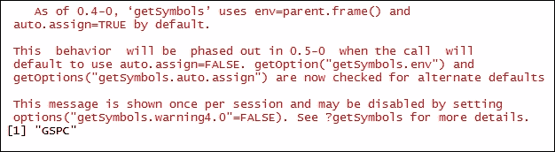

### 步骤 3 -计算指标

计算相对强弱指数:这是最近价格上升趋势和绝对价格变动之间的比率。`RSI()`函数用于计算**相对强度指数**。`GSPC`数据框用作价格系列。`n = 3`代表移动平均线的周期数。然后将结果存储在`relativeStrengthIndex3`数据帧中:

```
> relativeStrengthIndex3 <- RSI(Op(GSPC),n=3)

```

探索价格变化的摘要:`summary()`函数用于此。该函数提供一系列描述性统计数据，以生成`relativeStrengthIndex3`数据帧的结果汇总:

```
> summary(relativeStrengthIndex3)

```

结果如下:

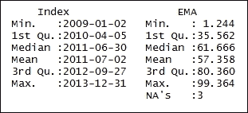

`EMA()`函数使用`GSPC`符号作为价格序列。`n = 5`表示要平均的时间段。然后将结果存储在`exponentialMovingAverage5`数据帧中:

```
> exponentialMovingAverage5 <- EMA(Op(GSPC),n=5)

```

打印`exponentialMovingAverage5`数据帧:`head()`函数返回`exponentialMovingAverage5`数据帧的第一部分。`exponentialMovingAverage5`数据帧作为输入参数传递:

```
> head(exponentialMovingAverage5)

```

结果如下:

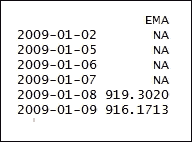

探究价格变化的概要。为此，使用`summary()`功能。该功能提供一系列描述性统计数据，以生成`exponentialMovingAverage5`数据框的结果汇总。

```
> summary(exponentialMovingAverage5)

```

结果如下:

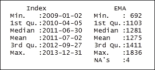

计算`GSPC`和`exponentialMovingAverage5`的指数开盘价之差:

```
> exponentialMovingAverageDiff <- Op(GSPC) - exponentialMovingAverage5

```

现在让我们打印`exponentialMovingAverageDiff`数据帧。`head()`函数返回`exponentialMovingAverageDiff`数据帧的第一部分。`exponentialMovingAverageDiff`数据帧作为输入参数传递:

```
> head(exponentialMovingAverageDiff)

```

结果如下:

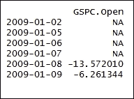

探索价格变化的汇总:为此，使用了`summary()`函数。该功能提供一系列描述性统计数据，以生成`exponentialMovingAverageDiff`数据帧的结果汇总。

```
> summary(exponentialMovingAverageDiff)

```

结果如下:

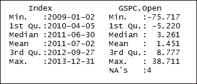

我们现在将比较`GSPC`系列的快速移动平均线和`GSPC`系列的慢速移动平均线。为此，`GSPC`被作为价格矩阵传递。`fast = 12`代表快速移动平均线的周期，`slow = 26`代表慢速移动平均线的周期，`signal = 9`代表移动平均线的信号:

```
> MACD <- MACD(Op(GSPC),fast = 12, slow = 26, signal = 9)

```

打印`MACD`数据帧:`tail()`函数返回`MACD`数据帧的最后一部分。`MACD`数据帧作为输入参数传递:

```
> tail(MACD)

```

结果如下:

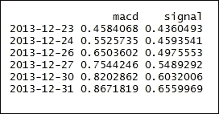

使用`summary()`功能浏览价格变化汇总:

```
> summary(MACD)

```

结果如下:

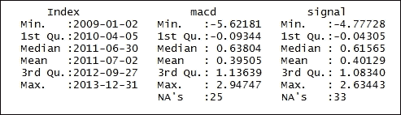

接下来，我们将抓住信号线作为一个指标。结果存储在`MACDsignal`数据帧中:

```
> MACDsignal <- MACD[,2]

```

计算**布林线**:它们是区间指标，计算均线的标准差。布林线运行的逻辑是，货币对的价格最有可能向其平均值靠拢；因此，当它偏离得太远时，比如说偏离两个标准差，它就会回落到均线。`BBands()`函数用于计算布林线。`GSPC`作为对象传递，`n=20`表示移动平均线的周期数。`sd=2`表示两个标准差:

```
> BollingerBands <- BBands(Op(GSPC),n=20,sd=2)

```

现在让我们打印`BollingerBands`数据帧:

```
> tail(BollingerBands)

```

结果如下:

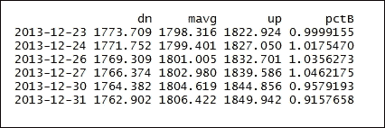

探索价格变化的摘要:

```
> summary(BollingerBands)

```

结果如下:

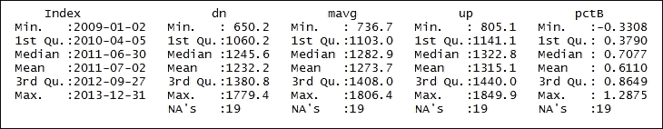

现在让我们抓住`BollingerBands`的信号线作为指示器:

```
> PercentageChngpctB <- BollingerBands[,4]

```

打印`PercentageChngpctB`数据帧:

```
> tail(PercentageChngpctB)

```

结果如下:

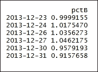

在`PercentageChngpctB`中探索这一变化的总结:

```
> summary(PercentageChngpctB)

```

结果如下:

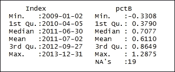

找出收盘价和开盘价之间的差异:

```
> Price <- Cl(GSPC)-Op(GSPC)

```

打印`price`数据帧:

```
> tail(Price)

```

结果如下:

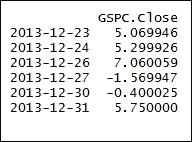

组合`relativeStrengthIndex3`、`expMvAvg5Cross`、`MACDsignal`和`PercentageChngpctB`、`Price`数据帧；结果存储在`DataSet`数据帧中；

```
> DataSet <- data.frame(relativeStrengthIndex3, expMvAvg5Cross, MACDsignal, PercentageChngpctB, Price)

```

探索`DataSet`数据帧的内部结构:`str()`函数显示数据帧的内部结构。`DataSet`作为 R 对象传递给`str()`函数:

```
> str(DataSet)

```

结果如下:

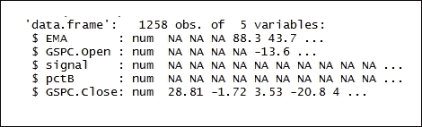

计算指标、创建数据集和移除点:

```
> DataSet <- DataSet[-c(1:33),]

```

探索`DataSet`数据帧的尺寸:`dim()`函数返回`DataSet`帧的尺寸。`DataSet`数据帧作为输入参数传递。结果清楚地表明有 1，176 行数据和 5 列:

```
> dim(DataSet)

```

结果如下:


命名列:`c()`函数用于将参数组合成向量；

```
> colnames(DataSet) <- c("RSI3","EMAcross","MACDsignal","BollingerB","Price")

```

探索`DataSet`数据框的尺寸:

```
> str(DataSet)

```

结果如下:

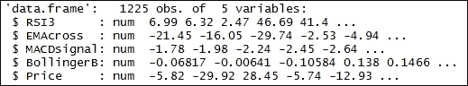

### 步骤 4 -为模型构建准备数据

将数据集规范化为绑定在 0 和 1 之间:

```
> Normalized <- function(x) {(x-min(x))/(max(x)-min(x))}

```

调用函数来规范化数据集:

```
> NormalizedData <- as.data.frame(lapply(DataSet,Normalized))

```

打印`NormalizedData`数据帧:

```
> tail(NormalizedData)

```

结果如下:

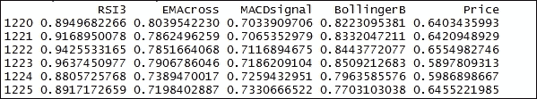

建立训练数据集:来自`NormalizedData`数据框中`1:816`的数据元素将被用作训练数据集。训练数据集应存储在`TrainingSet`中:

```
> TrainingSet <- NormalizedData[1:816,]

```

探索`TrainingSet`数据框的维度:

```
> dim(TrainingSet)

```

结果如下:

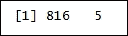

探索`TrainingSet`中的变化总结:

```
> summary(TrainingSet)

```

结果如下:

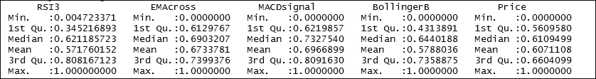

构建测试数据集:来自`NormalizedData`数据框中`817:1225`的数据元素将被用作训练数据集。该测试数据集应存储在`TestSet`中:

```
> TestSet <- NormalizedData[817:1225 ,]

```

探索`TrainingSet`数据框的尺寸:

```
> dim(TestSet)

```

结果如下:

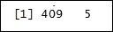

探索`TestSet`中的变化总结:

```
> summary(TestSet)

```

结果如下:

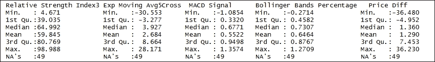

### 第五步-建立模型

构建神经网络:`neuralnet()`函数使用没有权重回溯的反向传播算法训练神经网络。`Price~RSI3+EMAcross+MACDsignal+BollingerB`是待拟合模型的描述。`data=TrainingSet`是包含公式中指定变量的数据框。`hidden=c(3,3)`指定每层中隐藏神经元(顶点)的数量。`learningrate=.001`表示反向传播算法使用的学习率。`algorithm="backprop"`指反向传播算法:

```
> nn1 <- neuralnet(Price~RSI3+EMAcross+MACDsignal+BollingerB,data=TrainingSet, hidden=c(3,3), learningrate=.001,algorithm="backprop")

```

绘制神经网络:

```
> plot(nn1)

```

结果如下:

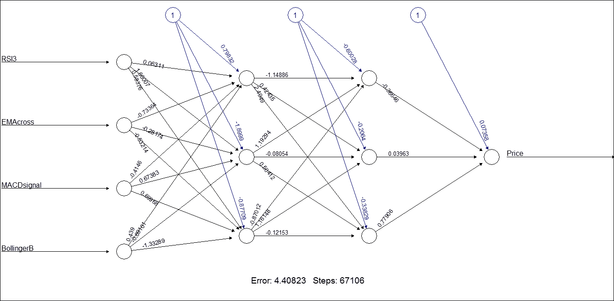<title>Measuring the unemployment rate</title>

# 测量失业率

失业率被定义为失业但积极寻找工作并愿意工作的总劳动力的百分比。根据国际劳工组织的定义，失业者是指那些积极寻找工作却没有工作的人。失业率是对既失业又在找工作的人数的衡量。

## 做好准备

为了使用神经网络对失业率进行测量，我们将使用在威斯康星州收集的失业率数据集。

### 步骤 1 -收集和描述数据

为此，我们将使用名为`FRED-WIUR.csv`的 CSV 数据集。有 448 行数据。有如下两个数值变量:

*   `Date`
*   `Value`

该数据集显示了 1976 年 1 月 1 日至 2013 年 4 月 1 日期间威斯康星州的失业率。

## 怎么做...

让我们进入细节。

### 步骤 2 -探索数据

首先，需要加载以下包:

```
 > install.packages("forecast ")
 > install.packages("lmtest") 
 > install.packages("caret ")
 > library(forecast)
 > library(lmtest)
 > library(caret)

```

### 注

版本信息:这个页面的代码在 R 版本 3.3.0 中测试过

让我们探索数据，了解变量之间的关系。我们将从导入名为`FRED-WIUR.csv`的 CSV 数据文件开始。我们将把数据保存到`ud`数据框中:

```
> ud <- read.csv("d:/FRED-WIUR.csv", colClasses=c('Date'='Date'))

```

打印`ud`数据帧:`tail()`函数返回`ud`数据帧的最后一部分。`ud`数据帧作为输入参数传递:

```
> tail(ud)

```

结果如下:

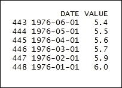

命名列:`c()`函数用于将参数组合成向量；

```
> colnames(ud) <- c('date', 'rate')

```

`as.Date()`函数用于转换代表日历日期的`Date`类的字符表示和对象:

```
> ud$date <- as.Date(ud$date)

```

探索失业数据的汇总:为此，使用了`summary()`函数。该函数提供了一系列描述性统计数据，以生成`ud`数据帧的结果汇总:

```
> summary (ud)

```

结果如下:

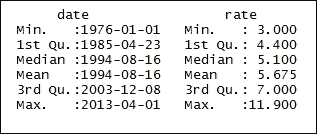

现在让我们从第 1 行到第 436 行创建基本数据:

```
> ud.b <- ud[1:436,]

```

探索基本失业数据的汇总。为此，使用了`summary()`功能。该函数提供了一系列描述性统计数据，以生成`ud.b`数据帧的结果汇总:

```
> summary(ud.b)

```

结果如下:

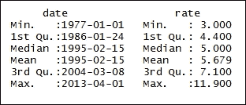

现在让我们从第 437 行到第 448 行创建测试数据:

```
> ud.p <- ud[437:448,]

```

探索测试失业数据的摘要:

```
> summary(ud.p)

```

结果如下:

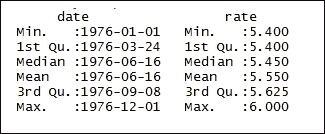

创建 1976 年以来的基本时间序列数据:`ts()`作为一个函数创建时间序列对象。`ud.b$rate`代表观测时间序列值的向量:

```
> ud.ts <- ts(ud.b$rate, start=c(1976, 1), frequency=12)

```

打印`ud.ts`数据帧的值:

```
> ud.ts

```

结果如下:

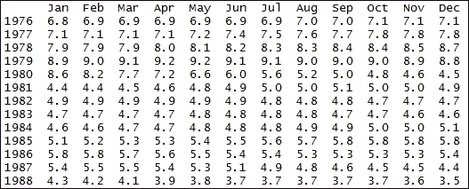

创建测试时间序列数据:`ts()`函数创建时间序列对象。`ud.b$rate`代表观测时间序列值的向量:

```
> ud.p.ts <- ts(ud.p$rate, start=c(2012, 5), frequency=12)

```

打印`ud.ts`数据帧的值:

```
> ud.ts

```

结果如下:

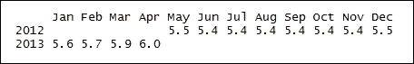

绘制基本时间序列数据:

```
> plot.ts(ud.ts)

```

结果如下:

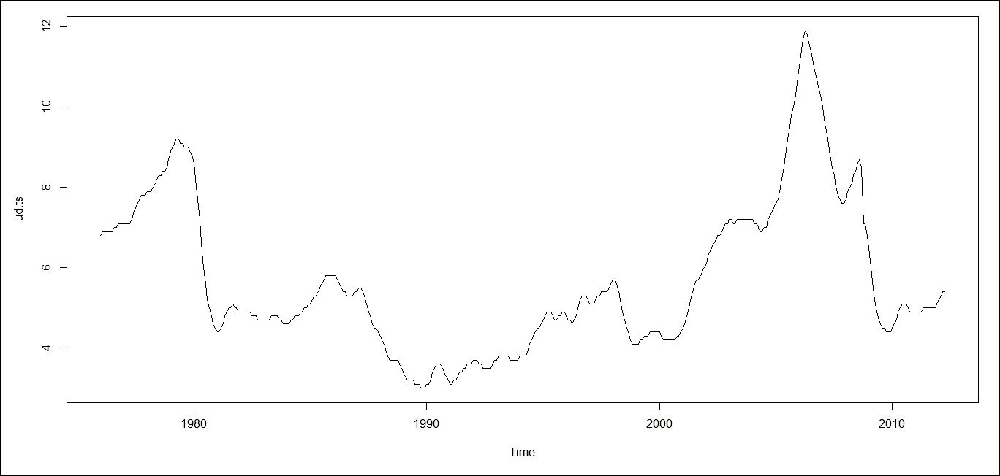

绘制测试时间序列数据:

```
> plot.ts(ud.p.ts)

```

结果如下:

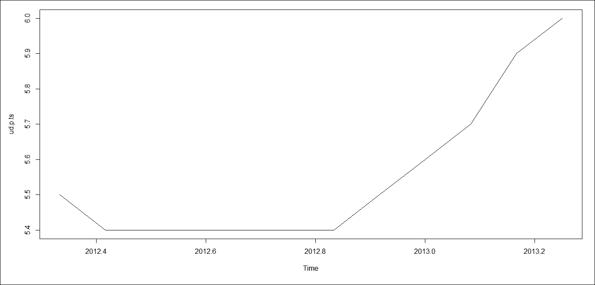

### 步骤 3 -准备和验证模型

计算基本时间序列数据集的平均值。`meanf()`函数返回应用于`ud.ts`数据集的 **i.i.d** 模型的预测和预测区间。`12`表示预测的期间:

```
> mean <- meanf(ud.ts, 12)

```

用漂移基时间序列预测随机行走的时间间隔。`rwf()`函数预测并返回对时间序列`ud.ts`执行的随机行走。参数`12`表示预测的周期:

```
> forecast_randomwalk <- rwf(ud.ts, 12)

```

从 ARIMA(0，0，0)(0，1，0)m 基本时间序列预测和预测随机行走的间隔:`snaive()`函数预测并返回对时间序列`ud.ts`执行的 ARIMA(0，0，0)(0，1，0)m 的结果。参数`12`表示预测的周期:

```
> forecast_arima <- snaive(ud.ts, 12)

```

预测和预测基本时间序列的漂移。`rwf()`函数预测并返回对时间序列`ud.ts`执行的随机行走。参数`12`表示预测的周期。`drift=T`是符合漂移模型的随机游走的逻辑标志:

```
> drift <- rwf(ud.ts, 12, drift=T)

```

接下来，我们将为趋势的基本时间序列数据准备线性拟合模型。`tslm()`函数将线性模型拟合到`ud.ts`时间序列。`ud.ts~trend`是表示必须考虑趋势成分的公式:

```
> m1 <- tslm(ud.ts~trend)

```

为趋势和季节性的基本时间序列数据准备线性拟合模型:`tslm()`函数将线性模型拟合到`ud.ts`时间序列。`ud.ts~trend+season`是表示必须考虑趋势和季节性因素的公式:

```
> m2 <- tslm(ud.ts~trend+season)

```

`residuals()`是一个通用函数，在拟合基本时间序列数据的趋势模型后，从返回的对象`m1`中提取模型残差。

```
> residual_1 <- residuals(m1)

```

绘制残差模型:

```
> plot(residual_1, ylab="Residuals",xlab="Year", title("Residual - Trends"), col = "red")

```

结果如下:

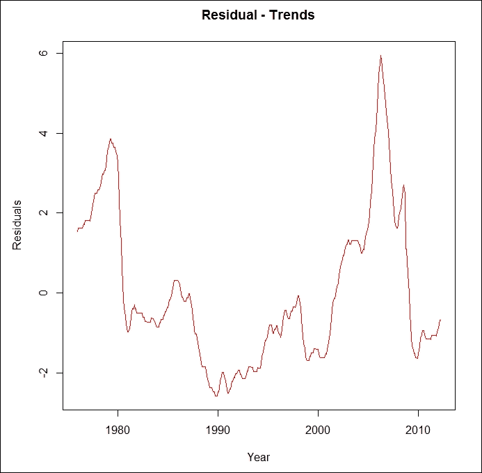

现在我们来看看如何估计`autocovariance`函数。`residual_1`是一元数值时间序列对象:

```
> acf(residual_1, main="ACF of residuals")

```

结果如下:

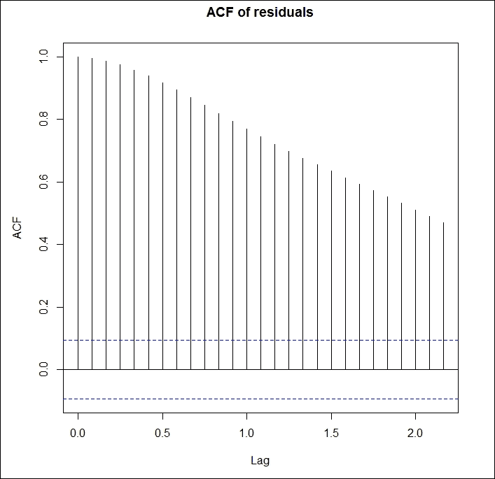

`residuals()`是一个通用函数，在拟合基本时间序列数据的模型以获得趋势后，从返回的对象`m2`中提取模型残差。

```
> residual_2 <- residuals(m2)

```

绘制剩余模型:

```
> plot(residual_2, ylab="Residuals",xlab="Year",title("Residual - Trends + Seasonality"), col = "red")

```

结果如下:

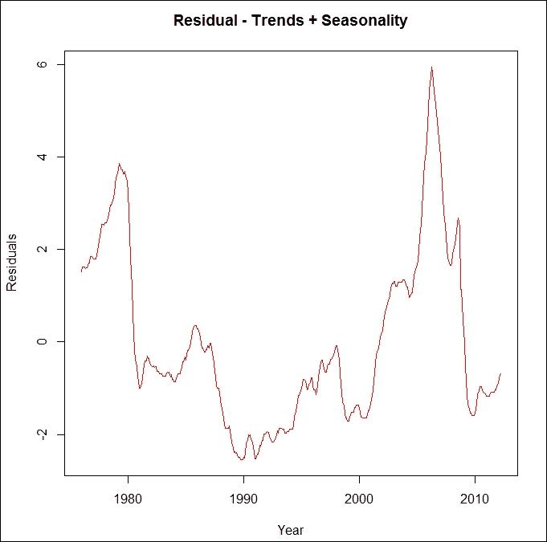

```
> acf(residual_2, main="ACF of residuals")

```

结果如下:

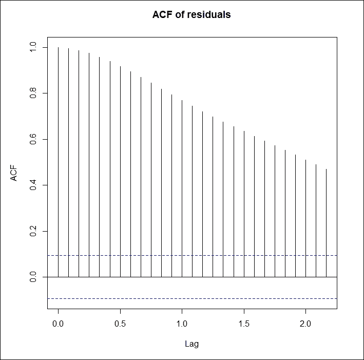

Durbin-Watson 检验用于确定线性回归或多重回归的残差是否独立。杜宾-沃森检验中通常考虑的假设如下:

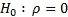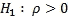

测试统计数据如下所示:

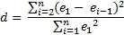

在这个方程中，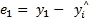、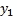是个体的观测值，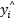是个体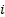的预测值。

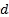的值随着串行相关性的增加而减小。针对 -解释变量数量和的不同值，列出了上下临界值和:

如果拒绝

如果不拒绝

如果测试没有结果。

对趋势的基本时间序列数据的线性拟合模型执行 Durbin-Watson 测试:

```
> dwtest(m1, alt="two.sided")

```

结果如下:


对趋势和季节性的基本时间序列数据的线性拟合模型执行 Durbin-Watson 测试:

```
 > dwtest(m2, alt="two.sided")

```

结果如下:


使用黄土将基本数据时间序列分解为周期、季节、趋势和不规则成分:

```
> m3 <- stl(ud.ts, s.window='periodic')

```

绘制分解的基础数据时间序列:

```
> plot(m3)

```

结果如下:


对基本数据时间序列执行指数平滑状态空间模型。`ets()`函数返回`ud.ts`时间序列的`ets`模型。`ZZZ - "Z"`表示自动选择。第一个字母表示错误类型，第二个字母表示趋势类型，第三个字母表示季节类型:

```
> m4 <- ets(ud.ts, model='ZZZ')

```

绘制基本数据时间序列的指数平滑状态空间模型:

```
> plot(m4)

```

结果如下:


返回基本数据时间序列的单变量 ARIMA 的顺序:

```
> m5 <- auto.arima(ud.ts)

```

绘制基础数据时间序列的单变量 ARIMA:

```
> plot(forecast(m5, h=12))

```

结果如下:


构建前馈神经网络模型:`nnetar()`函数构建单隐层、滞后输入的前馈神经网络，用于预测基础数据单变量时间序列；

```
> m6 <- nnetar(ud.ts)

```

打印前馈神经网络模型的值:

```
> m6

```

结果如下:


绘制前馈神经网络模型:

```
> plot(forecast(m6, h=12))

```

结果如下:


### 步骤 4 -预测和测试所建模型的准确性

用测试数据时间序列检验基础数据时间序列平均值的准确性。`accuracy()`函数返回预测准确度的汇总测量范围。`ud.p.ts`是测试数据时间序列:

```
> a1 <- accuracy(mean, ud.p.ts)

```

测试预测的和预测的具有漂移的基础数据时间序列的准确性:

```
> a2 <- accuracy(forecast_randomwalk, ud.p.ts)

```

用 ARIMA(0，0，0)(0，1，0)m 检验预测的和预测的基础数据时间序列的精度:

```
> a3 <- accuracy(forecast_arima, ud.p.ts)

```

测试基本数据时间序列漂移的准确性:

```
> a4 <- accuracy(drift, ud.p.ts)

```

将结果合并到一个表格中:

```
> a.table <- rbind(a1, a2, a3, a4)

```

打印结果:

```
> a.table

```

结果如下:


预测趋势基本时间序列数据的线性拟合模型。`h=12`表示预测的时间段:

```
> f1 <- forecast(m1, h=12)

```

预测趋势和季节性的基本时间序列数据的线性拟合模型:

```
> f2 <- forecast(m2, h=12)

```

使用黄土预测分解为周期、季节、趋势和不规则成分的基础数据时间序列:

```
> f3 <- forecast(m3, h=12)

```

预测基本数据时间序列的指数平滑状态空间模型:

```
> f4 <- forecast(m4, h=12)

```

预测基本数据时间序列的有序单变量 ARIMA:

```
> f5 <- forecast(m5, h=12)

```

单隐层前馈神经网络模型的预测；

```
> f6 <- forecast(m6, h=12)

```

测试趋势基本时间序列数据的预测线性拟合模型的准确性:

```
> a5 <- accuracy(f1, ud.p.ts)

```

测试趋势和季节性的基本时间序列数据的预测线性拟合模型的准确性:

```
> a6 <- accuracy(f2, ud.p.ts)

```

使用黄土测试将预测的基础数据时间序列分解为周期、季节、趋势和不规则成分的准确性:

```
> a7 <- accuracy(f3, ud.p.ts)

```

测试基本数据时间序列的预测指数平滑状态空间模型的准确性:

```
> a8 <- accuracy(f4, ud.p.ts)

```

测试基础数据时间序列的预测有序单变量 ARIMA 的准确性:

```
> a9 <- accuracy(f5, ud.p.ts)

```

测试具有单个隐藏层的预测前馈神经网络模型的准确性:

```
> a10 <- accuracy(f6, ud.p.ts)

```

将结果合并到一个表格中:

```
> a.table.1 <- rbind(a5, a6, a7, a8, a9, a10)

```

打印结果:

```
> a.table.1

```

结果如下:

