# 第十四章。案例分析-用电量预测

# 简介

电力是唯一同时生产和消费的商品；因此，必须始终保持电力市场中供应和消费之间的完美平衡。由于电力是一种重要的能源，预测电力消费对任何国家来说都是国家利益所在。对能源消耗、生产和分配的可靠预测符合稳定和长期的政策。规模经济的存在、对环境问题的关注、法规要求和良好的公众形象，加上通货膨胀、快速上涨的能源价格、替代燃料和技术的出现、生活方式的改变等等，产生了使用建模技术的需求，这些建模技术捕捉诸如价格、收入、人口、技术以及其他经济、人口统计、政策和技术变量的影响。

低估可能导致容量利用不足，从而导致服务质量下降，包括局部限电，甚至停电。而另一方面，过高的估计可能导致批准一个可能几年都不需要的工厂。要求是确保投资的最佳阶段、长期考虑、合理化定价结构和设计需求方管理方案，以满足短期或中期需求的性质。该预测进一步推动了投资、建设和保护方面的各种计划和决策。

## 准备就绪

为了进行用电量预测，我们将使用智能电表数据收集的数据集，该数据集包含四个行业的时间序列。

### 步骤 1 -收集和描述数据

应使用名为`DT_4_ind`的数据集。数值变量如下:

*   `value`

非数字变量如下:

*   `date_time`
*   `week`
*   `date`
*   `type`

## 怎么做...

让我们进入细节。

### 第 2 步-探索数据

作为要执行的第一步，需要加载以下软件包:

```

> install.packages("feather")
> install.packages("data.table")
> install.packages("ggplot2")
> install.packages("plotly")
> install.packages("animation")
> library(feather)
> library(data.table)
> library(ggplot2)
> library(plotly)
> library(animation)

```

### 注意

版本信息:这个页面的代码在 R 版本 3.2.2 中测试过

让我们探索数据，了解变量之间的关系。

检查对象是否为`as.data.table()`:使用`feather`对数据帧进行二进制列序列化。为了轻松地跨数据分析语言共享、读取和写入数据，使用了`feather`。`read_feather()`功能用于读取羽毛文件。

我们将从导入`DT_4_ind`数据集开始。我们将把数据保存到`AggData`数据框中:

```
> AggData <- as.data.table(read_feather("d:/DT_4_ind"))

```

探索`AggData`数据帧的内部结构:`str()`函数显示数据帧的内部结构。`AggData`作为 R 对象传递给`str()`函数:

```
> str(AggData)

```

结果如下:

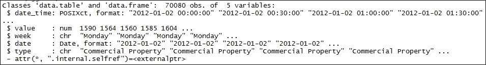

打印`AggData`帧。`head()`函数返回基本数据帧的第一部分。`AggData`数据帧作为输入参数传递:

```
> head(AggData)

```

结果如下:

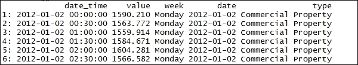

绘制按行业划分的电力消费总时间序列数据。

`ggplot()`函数声明图形的输入数据框，并指定整个图形的图形美学设置。`data = AggData`是用于绘图的数据集，而`aes()`描述数据中的变量如何映射到可视属性。`geom_line()`生成试图连接所有观察值的单线:

```
    > ggplot(data = AggData, aes(x = date, y = value)) +
+ geom_line() + 
    + facet_grid(type ~ ., scales = "free_y") +
    + theme(panel.border = element_blank(),
    + panel.background = element_blank(),
    + panel.grid.minor = element_line(colour = "grey90"),
    + panel.grid.major = element_line(colour = "green"),
    + panel.grid.major.x = element_line(colour = "red"),
    + axis.text = element_text(size = 10),
    + axis.title = element_text(size = 12, face = "bold"),
    + strip.text = element_text(size = 9, face = "bold")) +
    + labs(title = "Electricity Consumption - Industry", x = "Date", y = "Load (kW)")

```

结果如下:

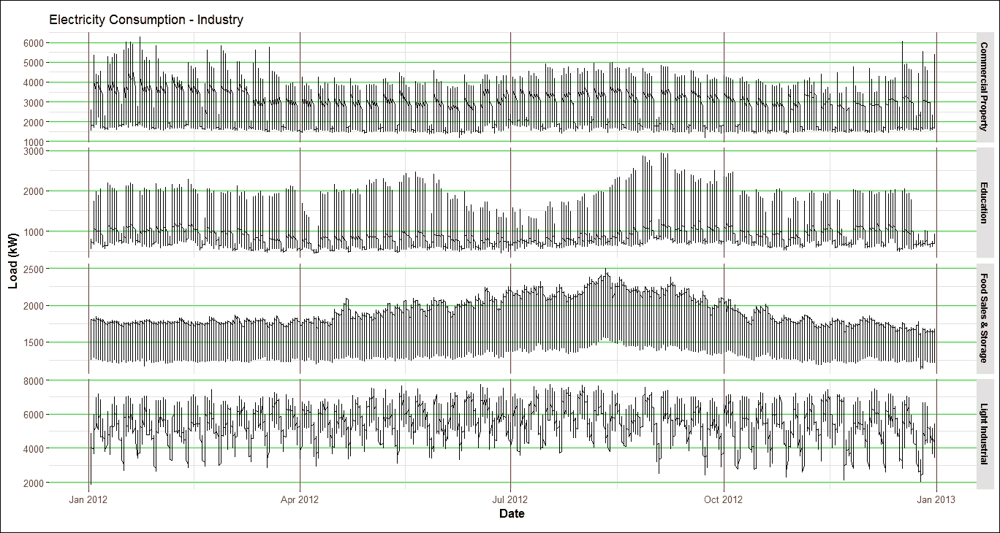

### 注

值得注意的是，与其他行业相比，食品销售和储存行业的消费量在节假日期间变化不大。

### 第三步-时间序列-回归分析

回归模型的公式如下:

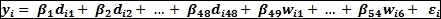

变量(输入)有两种季节性虚拟变量——每日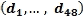和每周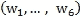。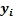为 *i* 时刻的用电量，其中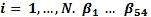为待估计的回归系数。

打印`AggData`数据框的内容:

```
> AggData

```

结果如下:

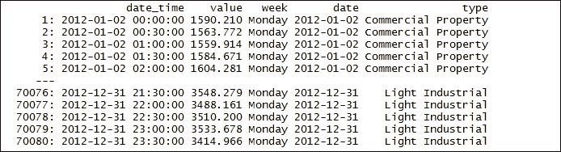

将工作日的字符转换为整数:`as.factor()`函数用于将一个向量编码为一个因子。`as.integer()`函数创建整数类型的`AggData[, week]`对象:

```
> AggData[, week_num := as.integer(as.factor(AggData[, week]))]

```

打印变更后`AggData`数据框的内容:

```
> AggData

```

结果如下:

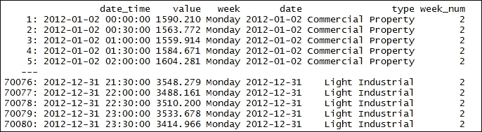

使用以下方法从`AggData`数据框中提取唯一的行业类型:

```
 > n_type <- unique(AggData[, type]) 

```

打印更改后数据框`n_type`的内容:

```
 > n_type 

```

结果如下:

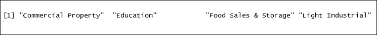

使用以下方法从`AggData`数据帧中提取唯一日期:

```
 > n_date <- unique(AggData[, date]) 

```

使用以下方法从`AggData`数据帧中提取唯一的工作日:

```
 > n_weekdays <- unique(AggData[, week]) 

```

使用以下方法设置`period`值:

```
 > period <- 48 

```

对样本数据集执行回归分析。

我们在两周内提取了教育(学校)建筑。结果存储在`data_reg`数据框中。`n_type[2]`代表教育建筑，`n_date[57:70]`代表两周时间:

```
 > data_reg <- AggData[(type == n_type[2] & date %in% n_date[57:70])] 

```

打印更改后的`data_reg`数据帧的内容:

```
 > data_reg 

```

结果如下:

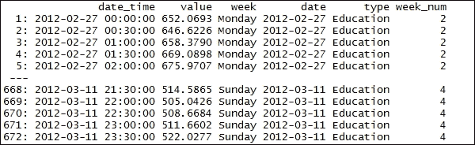

绘制两周内(2 月 27 日至 3 月 12 日)的教育样本数据集(学校建筑)

`ggplot()`函数声明图形的输入数据框，并指定旨在贯穿始终的一组图形美学。`data_reg`是用于绘图的数据集，而`aes()`描述了数据中的变量如何映射到可视属性。`geom_line()`产生试图连接所有观察值的单线:

```
    > ggplot(data_reg, aes(date_time, value)) +
    + geom_line() +
    + theme(panel.border = element_blank(),
    + panel.background = element_blank(),
    + panel.grid.minor = element_line(colour = "grey90"),
    + panel.grid.major = element_line(colour = "green"),
    + panel.grid.major.x = element_line(colour = "red"),
    + axis.text = element_text(size = 10),
+ axis.title = element_text(size = 12, face = "bold")) 
    + labs(title = "Regression Analysis - Education Buildings", x = "Date", y = "Load (kW)")

```

结果如下:


从`data_reg`数据帧中提取行数:

```
 > N <- nrow(data_reg) 

```

计算训练集中的天数:

```
 > trainset_window <- N / period 

```

创建独立的季节性虚拟变量-每日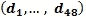和每周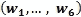。每日季节值提取自 *1，.....句号，1，.......周期*为每日变量的 48 个向量。从`week_num`中提取周值。然后将结果存储在一个向量中，`matrix_train`:

```
 > matrix_train <- data.table(Load = data_reg[, value], Daily = as.factor(rep(1:period, trainset_window)), Weekly = as.factor(data_reg[, week_num])) 

```

打印变更后`matrix_train`数据框的内容:

```
 > matrix_train 

```

结果如下:

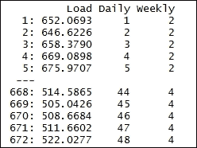

创建线性模型。`lm()`函数适合线性模型:`Load ~ 0 + .`是公式。由于`lm()`自动添加到线性模型截距，我们现在将其定义为`0`。`data = matrix_train`定义包含数据的数据帧:

```
 > linear_model_1 <- lm(Load ~ 0 + ., data = matrix_train) 

```

打印变更后`linear_model_1`数据框的内容:

```
 > linear_model_1 

```

结果如下:

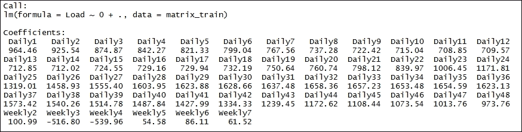

制作模型`linear_model_1`的结果汇总:

```
> summary_1 <- summary(linear_model_1)

```

打印更改后的`summary_1`数据框的内容:

```
 > summary_1 

```

结果如下:

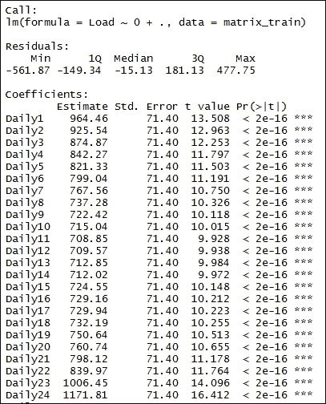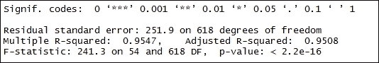

使用`r.squared`属性从`summary_1`数据帧中提取确定系数:

```
> paste("R-squared: ", round(summary_1$r.squared, 3), ", p-value of F test: ", 1-pf(summary_1$fstatistic[1], summary_1$fstatistic[2], summary_1$fstatistic[3]))

```

从`data_reg`和`linear_model_1`的列表中创建一个`data.table`:

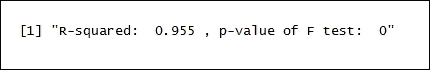

打印更改后的`datas`数据帧的内容:

结果如下:

```
 > datas <- rbindlist(list(data_reg[, .(value, date_time)], data.table(value = linear_model_1$fitted.values, data_time = data_reg[, date_time]))) 

```

Printing the contents of the `datas` data frame after the change:

```
 > datas 

```

The result is as follows:

绘制`linear_model_1`的拟合值。

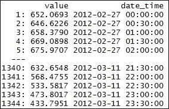

`data = datas`是用于绘图的数据集，而`aes()`描述了数据中的变量如何映射到可视属性。`geom_line()`生成试图连接所有观察值的单线:

结果如下:

`data = datas` is the dataset to be used for plotting while `aes()` describes how variables in the data are mapped to visual properties. `geom_line()` produces the single line that tries to connect all the observations:

```
 > ggplot(data = datas, aes(date_time, value, group = type, colour = type)) + geom_line(size = 0.8) + theme_bw() + 
 + labs(x = "Time", y = "Load (kW)", title = "Fit from Multiple Linear Regression") 

```

The result is as follows:

绘制拟合值对残值。

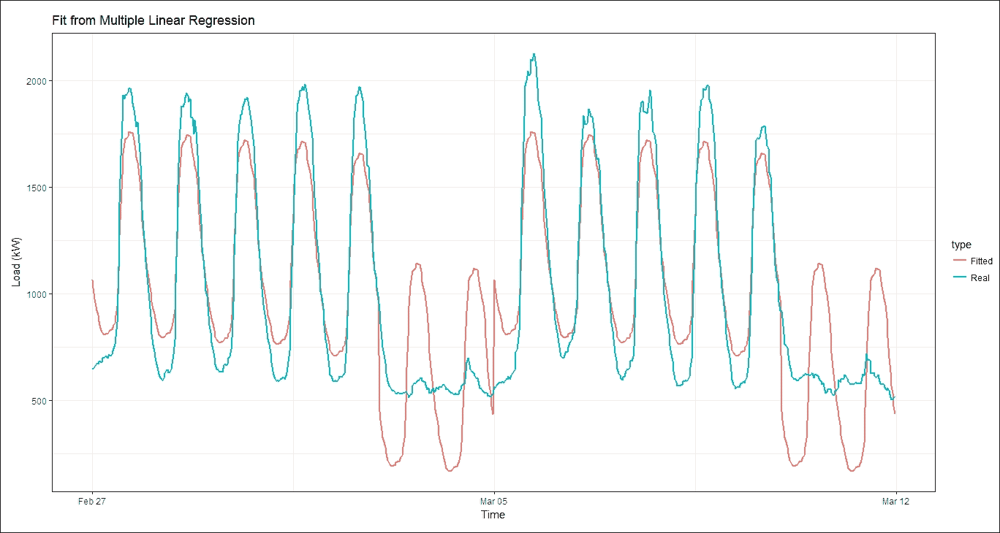

`data`是用于绘图的数据集，而`aes()`描述了数据中的变量如何映射到可视属性:

结果如下:

`data` is the dataset to be used for plotting while `aes()` describes how variables in the data are mapped to visual properties:

```
> ggplot(data = data.table(Fitted_values =
linear_model_2$fitted.values, Residuals = linear_model_2$residuals),
aes(Fitted_values, Residuals)) + geom_point(size = 1.7)
+ geom_hline(yintercept = 0, color = "red", size = 1) +
+ labs(title = "Fitted values vs Residuals")

```

The result is as follows:

该函数首先给出线性模型的标准化残差。然后计算`1Q`和`4Q`行。然后，分位数分布由正态分布生成。然后计算斜率和截距，并绘制成图:

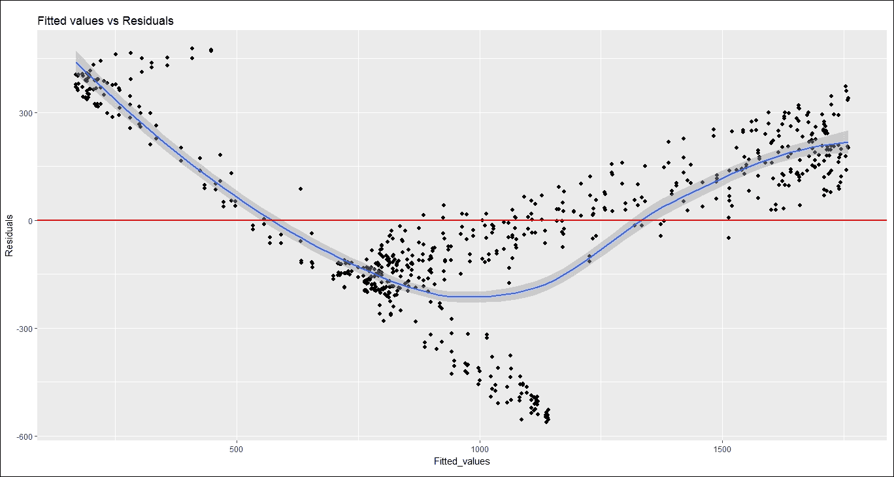

我们可以使用以下命令绘制 Q-Q:

结果如下:

```
    > ggQQ <- function(lm) {
    # extracting residuals from the fit
    + d <- data.frame(std.resid = rstandard(lm))
    # calculate 1Q, 4Q line
    + y <- quantile(d$std.resid[!is.na(d$std.resid)], c(0.25, 0.75))
    # calculate 1Q, 4Q line
    + x <- qnorm(c(0.25, 0.75))
    + slope <- diff(y)/diff(x)
    + int <- y[1L] - slope * x[1L]
+ 
    + p <- ggplot(data = d, aes(sample = std.resid)) +
+ stat_qq(shape = 1, size = 3) + 
+ labs(title = "Normal Q-Q", 
+ x = "Theoretical Quantiles", 
+ y = "Standardized Residuals") + 
    + geom_abline(slope = slope, intercept = int, linetype = "dashed",
+ size = 1, col = "firebrick1") 
    + return(p)
    + }

```

We can plot Q-Q with the following command:

```
 > ggQQ(linear_model_1) 

```

The result is as follows:

可以清楚地看到，这些点不正常，因为它们远离红线。一天中的测量值不断地被周变量的估计系数移动，但是一天中的行为没有被捕获。我们需要捕捉这种行为，因为尤其是周末，行为完全不同。

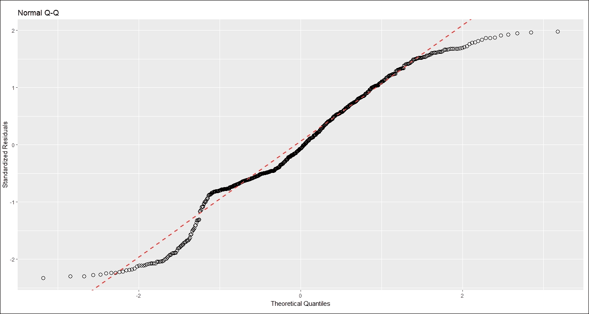

步骤 4 -时间序列-改进回归分析

创建线性模型:`lm()`函数适合线性模型。`Load ~ 0 + Daily + Weekly + Daily:Weekly`是新的公式。由于`lm()`自动添加到线性模型截距，我们现在将其定义为`0`。`data = matrix_train`定义包含数据的数据帧:

### 打印变更后`linear_model_2`数据框的内容:

结果如下:

```
> linear_model_2 <- lm(Load ~ 0 + Daily + Weekly + Daily:Weekly, data = matrix_train)

```

Printing the contents of the `linear_model_2` data frame after the change:

```
 > linear_model_2 

```

The result is as follows:

比较`linear_model_1`和`linear_model_2`模型汇总的 R 平方值:

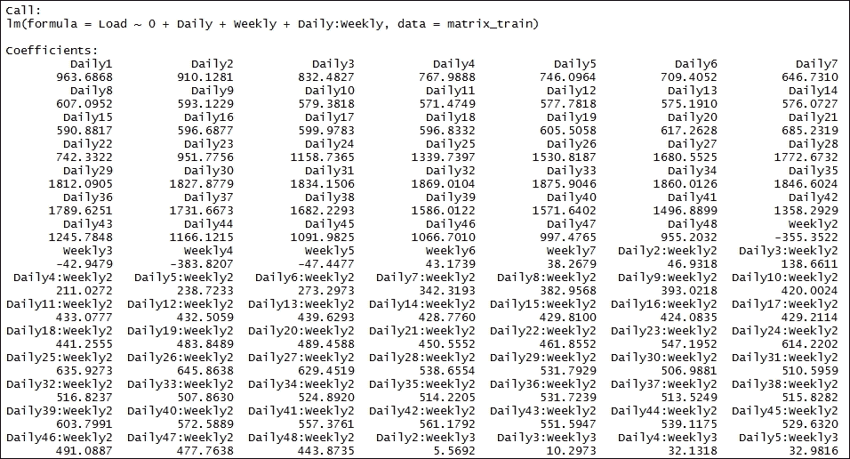

结果如下:

Comparing R-squared values from the summaries of the `linear_model_1` and `linear_model_2` models:

```
> c(Previous = summary(linear_model_1)$r.squared, New = summary(linear_model_2)$r.squared)

```

The result is as follows:

第二个模型的 R 平方值有显著提高。

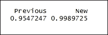

以图形方式比较`linear_model_1`和`linear_model_2`模型的残差:

结果如下:

Comparing the residuals of the `linear_model_1` and `linear_model_2` models graphically:

```
 > ggplot(data.table(Residuals = c(linear_model_1$residuals, linear_model_2$residuals), Type = c(rep("Multiple Linear Reg - simple", nrow(data_reg)), rep("Multiple Linear Reg with interactions", nrow(data_reg)))), aes(Type, Residuals, fill = Type)) + geom_boxplot()
 > ggplotly()

```

The result is as follows:

`linear_model_1`的残差详情。

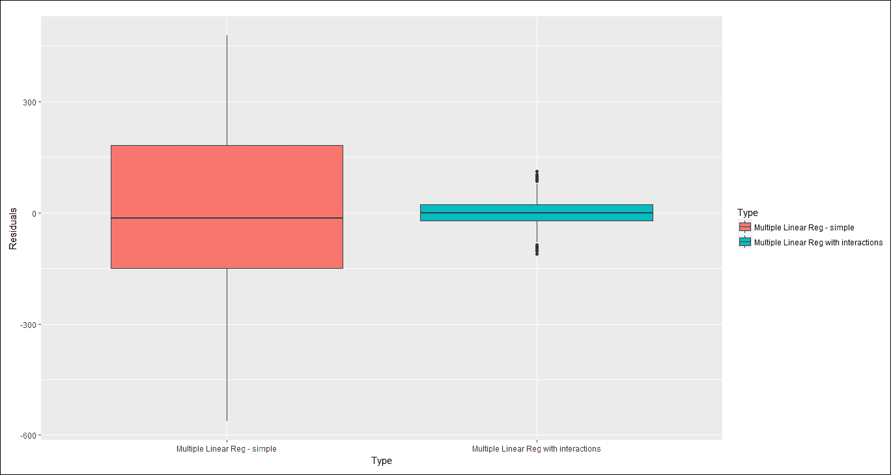

结果如下:

Details of residuals of `linear_model_1`.

The result is as follows:

`linear_model_2`残差详情。

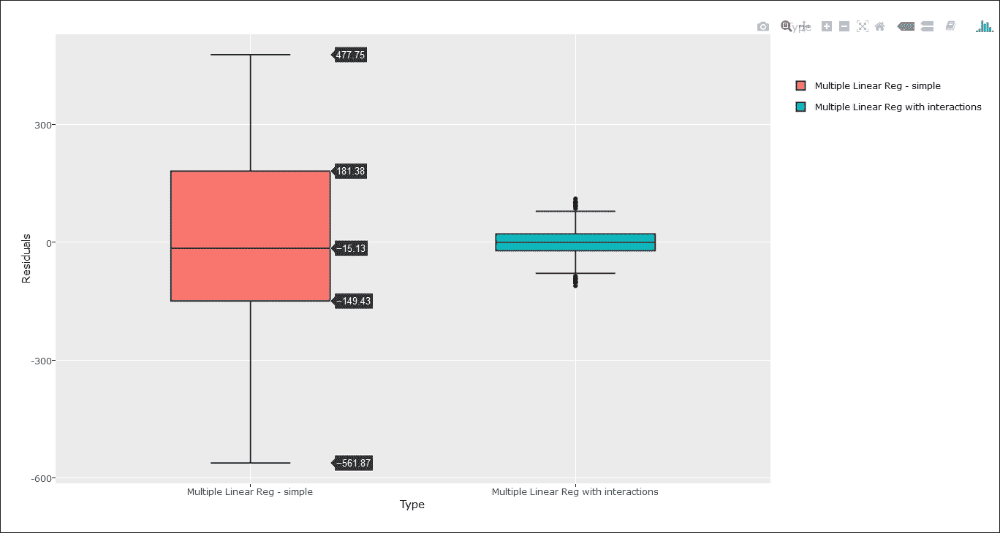

结果如下:

从`data_reg`和`linear_model_2`的列表中创建一个`data.table`:

打印更改后的`datas`数据帧的内容:

结果如下:

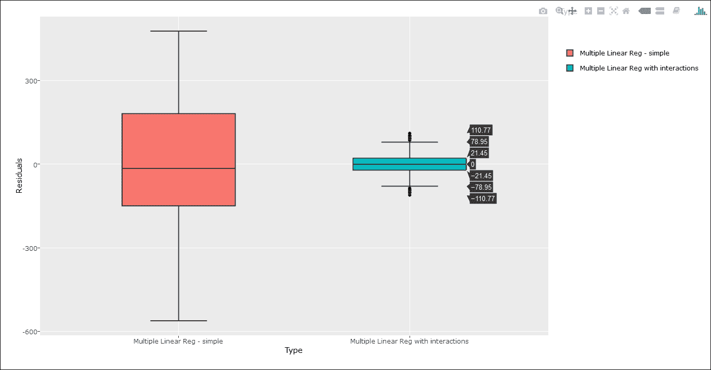

Creating one `data.table` from a list of `data_reg` and `linear_model_2` :

```
 > datas <- rbindlist(list(data_reg[, .(value, date_time)], data.table(value = linear_model_2$fitted.values, data_time = data_reg[, date_time]))) 

```

将`Real`和`Fitted`列添加到`datas`:

```
 > datas 

```

打印更改后的`datas`数据帧的内容:

结果如下:

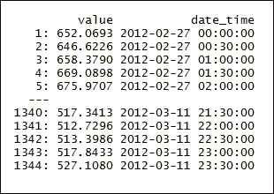

Adding `Real` and `Fitted` columns to `datas`:

```
 > datas[, type := rep(c("Real", "Fitted"), each = nrow(data_reg))] 

```

绘制`linear_model_2`的拟合值。

```
 > datas 

```

`data = datas`是用于绘图的数据集，而`aes()`描述了数据中的变量如何映射到可视属性。`geom_line()`生成试图连接所有观察值的单线:

结果如下:

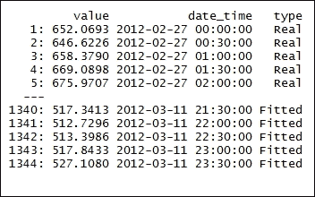

Plotting fitted values for `linear_model_2` .

与之前的图`linear_model_1`相比，拟合值和真实值非常匹配。

```
 > ggplot(data = datas, aes(date_time, value, group = type, colour =
type)) + geom_line(size = 0.8) + theme_bw() +
+ labs(x = "Time", y = "Load (kW)", title = "Fit from Multiple Linear
Regression")

```

绘制拟合值对残值。`Data`是用于绘图的数据集，而`aes()`描述数据中的变量如何映射到可视属性:

结果如下:

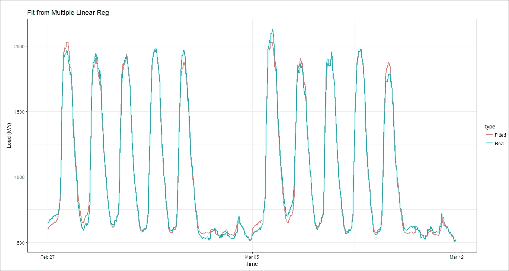

The fitted and real values closely match compared to the earlier plot of `linear_model_1`.

与之前的图`linear_model_1`相比，这些图似乎更接近剩余线。

```
 > ggplot(data = data.table(Fitted_values = linear_model_2$fitted.values, Residuals = linear_model_2$residuals), aes(Fitted_values, Residuals)) + geom_point(size = 1.7) 
 + geom_hline(yintercept = 0, color = "red", size = 1) + 
 + labs(title = "Fitted values vs Residuals") 

```

我们可以使用以下公式绘制 Q-Q 曲线:

结果如下:

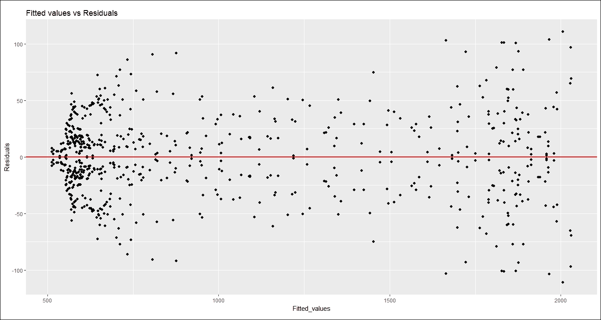

The plots appear to be closer to the residual line compared to the earlier plot of `linear_model_1`.

步骤 5 -建立预测模型

```
 > ggQQ(linear_model_2) 

```

我们可以定义一个函数来返回一周前的预测。输入参数为`data`和`set_of_date`:

定义用于评估预测的平均绝对百分比误差:

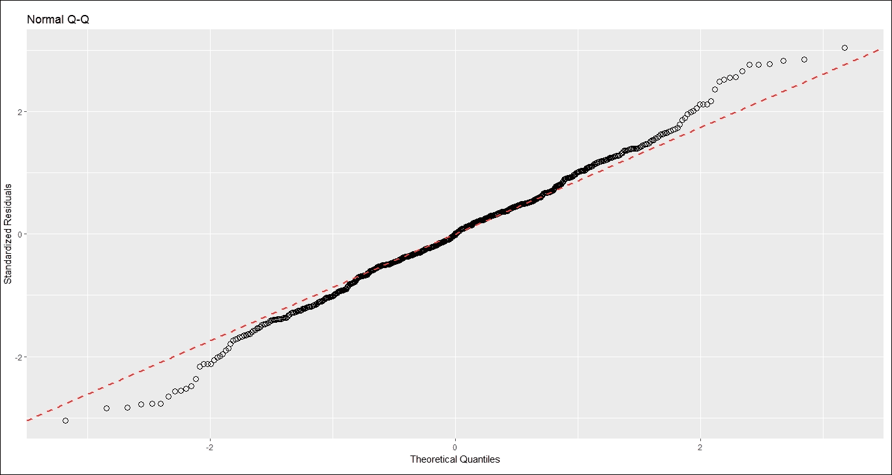

设置长度为 2 周的训练集，因此扣除 2。将制作 50 周的预报。使用滑动窗口方法进行训练预测适用于各种类型的行业:

### 打印周数:

结果如下:

```
    > predWeekReg <- function(data, set_of_date){
    + #creating the dataset by dates
+ data_train <- data[date %in% set_of_date] 
    + N <- nrow(data_train)
    +
    + # number of days in the train set
    + window <- N / period # number of days in the train set
    +
    + #1, ..., period, 1, ..., period - daily season periods
    + #feature "week_num"- weekly season
    + matrix_train <- data.table(Load = data_train[, value],
    + Daily = as.factor(rep(1:period, window)),
    + Weekly = as.factor(data_train[, week_num]))
    +
    + #creating linear model.
    + # formula - Load ~ 0 + Daily + Weekly + Daily:Weekly
    + # dataset - data = matrix_train
    + lm_m <- lm(Load ~ 0 + Daily + Weekly + Daily:Weekly, data = matrix_train)
+ 
    + #forecast of one week ahead
    + pred_week <- predict(lm_m, matrix_train[1:(7*period), -1, with = FALSE])
    + return(as.vector(pred_week))
    + }

```

Defining the mean absolute percentage error for evaluating the forecast:

```
 > mape <- function(real, pred){
 + return(100 * mean(abs((real - pred)/real)))
 + }

```

Setting the training set of the length for 2 weeks, therefore deducting 2\. A forecast for 50 weeks will be produced. Using a sliding window approach for training forecasting is done for every type of industry:

```
> n_weeks <- floor(length(n_date)/7) - 2

```

计算未来 1 周各行业类型的预测。

```
> n_weeks

```

调用函数以返回对`AggData`商业地产和数据集的 1 周预测:

调用该函数返回对`AggData` -教育和日期设置的 1 周预测:

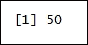

调用该函数以返回对`AggData`食品和销售以及日期集的 1 周预测:

调用此函数返回`AggData`照明行业和日期集的 1 周预测:

计算每种行业的平均绝对百分比误差，以评估预测。调用函数返回平均绝对百分比。计算用于评估`AggData`照明行业预测的误差，并设定日期:

```
 > lm_pred_weeks_1 <- sapply(0:(n_weeks-1), function(i)
 + predWeekReg(AggData[type == n_type[1]], n_date[((i*7)+1):((i*7)+7*2)]))

```

打印`lm_err_mape_1`数据帧:

```
 > lm_pred_weeks_2 <- sapply(0:(n_weeks-1), function(i)
 + predWeekReg(AggData[type == n_type[2]], n_date[((i*7)+1):((i*7)+7*2)]))

```

结果如下:

```
 > lm_pred_weeks_3 <- sapply(0:(n_weeks-1), function(i)
 + predWeekReg(AggData[type == n_type[3]], n_date[((i*7)+1):((i*7)+7*2)]))

```

Calling the function to return the forecast for a 1 week ahead prediction for the `AggData` lighting industry and date set:

```
 > lm_pred_weeks_4 <- sapply(0:(n_weeks-1), function(i)
 + predWeekReg(AggData[type == n_type[4]], n_date[((i*7)+1):((i*7)+7*2)]))

```

Calculate the mean absolute percentage error for each type of industry for evaluating the forecasts. Call the function to return the mean absolute percentage. Calculate the error for evaluating the forecast for the `AggData` lighting industry and date set:

```
 > lm_err_mape_1 <- sapply(0:(n_weeks-1), function(i)
 + mape(AggData[(type == n_type[1] & date %in% n_date[(15+(i*7)):(21+(i*7))]), value],
 + lm_pred_weeks_1[, i+1]))

```

调用此函数返回平均绝对百分比误差，用于评估`AggData`教育和日期集的预测:

```
> lm_err_mape_1

```

打印`lm_err_mape_2`数据帧:

结果如下:

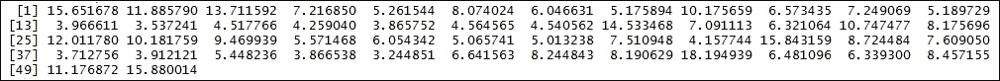

Calling the function to return the mean absolute percentage error for evaluating the forecast for the `AggData` education and date set:

```
 > lm_err_mape_2 <- sapply(0:(n_weeks-1), function(i)
 + mape(AggData[(type == n_type[2] & date %in% n_date[(15+(i*7)):(21+(i*7))]), value],
 + lm_pred_weeks_2[, i+1]))

```

调用此函数返回平均绝对百分比误差，用于评估`AggData`食品和销售以及日期集的预测:

```
> lm_err_mape_2

```

打印`lm_err_mape_3`数据帧:

结果如下:

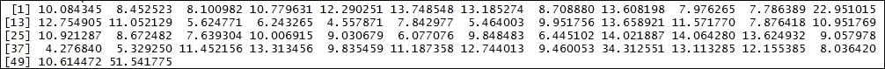

Calling the function to return the mean absolute percentage error for evaluating the forecast for the `AggData` food and sales and date set:

```
 > lm_err_mape_3 <- sapply(0:(n_weeks-1), function(i)
 + mape(AggData[(type == n_type[3] & date %in% n_date[(15+(i*7)):(21+(i*7))]), value],
 + lm_pred_weeks_3[, i+1]))

```

调用此函数返回平均绝对百分比误差，用于评估`AggData`照明行业和日期集的预测:

```
> lm_err_mape_3

```

打印`lm_err_mape_4data`帧:

结果如下:

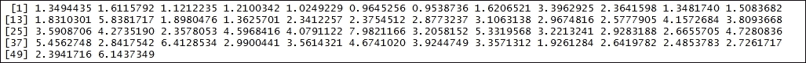

Calling the function to return the mean absolute percentage error for evaluating the forecast for the `AggData` lighting industry and date set:

```
 > lm_err_mape_4 <- sapply(0:(n_weeks-1), function(i)
 + mape(AggData[(type == n_type[4] & date %in% n_date[(15+(i*7)):(21+(i*7))]), value],
 + lm_pred_weeks_4[, i+1]))

```

第 6 步-绘制一年的预测图

```
> lm_err_mape_4

```

绘制结果:

注意

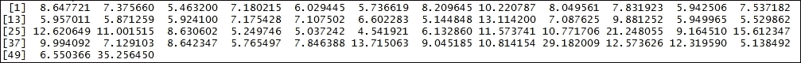

您需要安装 ImageMagick-7.0.4-Q16 才能使`saveGIF`工作。

### 结果如下:

Plotting the results:

### Note

****

```
    > datas <- data.table(value = c(as.vector(lm_pred_weeks_1),
 AggData[(type == n_type[1]) & (date %in% n_date[-c(1:14,365)]), value]),
    date_time = c(rep(AggData[-c(1:(14*48), (17473:nrow(AggData))), date_time], 2)),
    type = c(rep("MLR", nrow(lm_pred_weeks_1)*ncol(lm_pred_weeks_1)),
    rep("Real", nrow(lm_pred_weeks_1)*ncol(lm_pred_weeks_1))),
    week = c(rep(1:50, each = 336), rep(1:50, each = 336)))

    > saveGIF({
    oopt = ani.options(interval = 0.9, nmax = 50)
    for(i in 1:ani.options("nmax")){
    print(ggplot(data = datas[week == i], aes(date_time, value, group = type, colour = type)) +
    geom_line(size = 0.8) +
scale_y_continuous(limits = c(min(datas[, value]), max(datas[, value]))) + 
    theme(panel.border = element_blank(), panel.background = element_blank(),
    panel.grid.minor = element_line(colour = "grey90"),
    panel.grid.major = element_line(colour = "grey90"),
    panel.grid.major.x = element_line(colour = "grey90"),
    title = element_text(size = 15),
    axis.text = element_text(size = 10),
    axis.title = element_text(size = 12, face = "bold")) +
    labs(x = "Time", y = "Load (kW)",
    title = paste("Forecast of MLR (", n_type[1], "); ", "week: ", i, "; MAPE: ",
    round(lm_err_mape_1[i], 2), "%", sep = "")))
    ani.pause()
    }
    }, movie.name = "industry_1.gif", ani.height = 450, ani.width = 750)

```

The result is as follows:

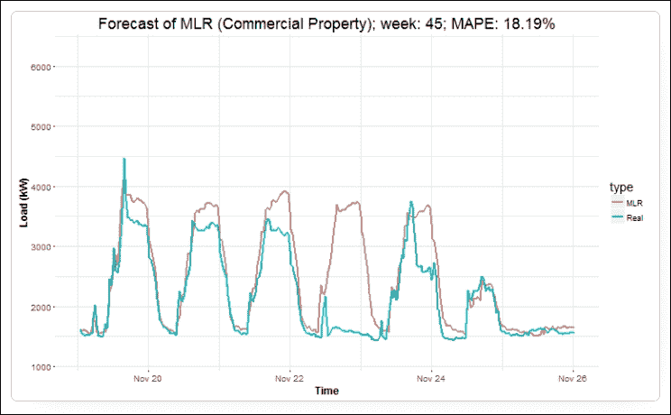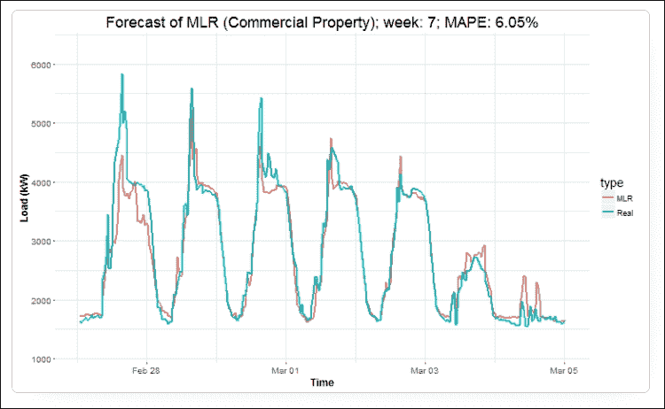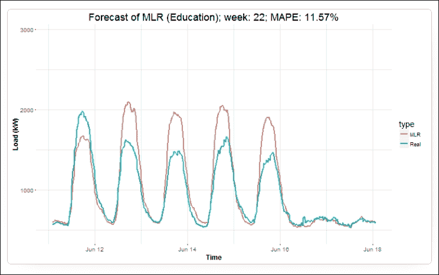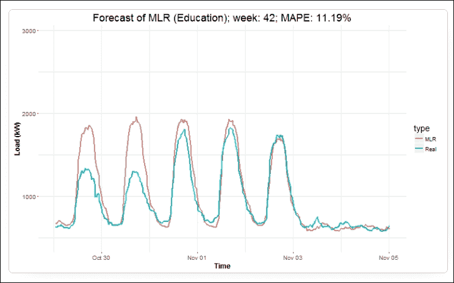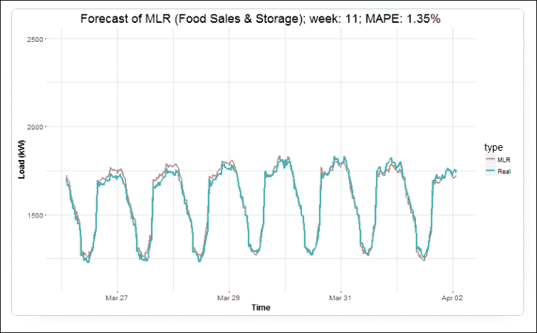

上述结果证明，电力模式的消耗取决于外部因素，如节假日、天气、财产性质等。消费模式在本质上是非常随机的。

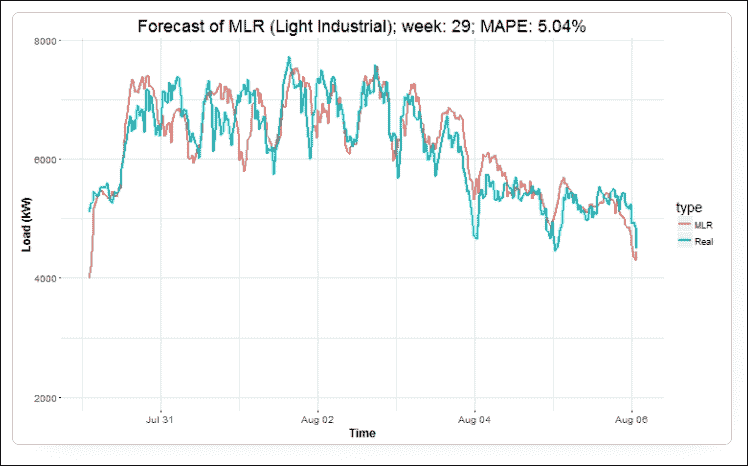

注意

目的是向读者介绍多元线性回归在预测双季节时间序列中的应用。包含自变量的相互作用以确保模型的有效性是非常有效的。

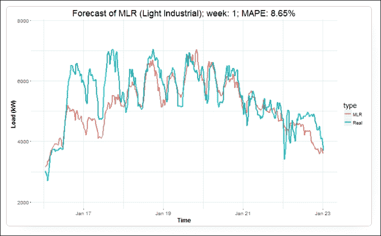

The preceding results prove that the consumption of the electricity pattern is based on external factors such as holidays, weather, nature of property, and so on. The consumption pattern is very stochastic in nature.

### Note

The aim is to introduce to the reader the application of multiple linear regressions for forecasting double seasonal time series. It is very effective to include interactions of independent variables to ensure the effectiveness of the model.