<title>Chapter 1. Introduction to Machine learning</title>

# 第一章。机器学习导论

本章的目标是带你了解机器学习的前景，并为后面的章节奠定基础概念。更重要的是，重点是帮助你探索各种学习策略，深入研究机器学习的不同子领域。每个子领域下的技术和算法，以及形成任何机器学习项目实现的核心的整体架构，都被深入地覆盖。

有许多关于机器学习的出版物，并且过去在该领域已经做了许多工作。除了机器学习的概念之外，重点将主要放在通过真实世界的例子的具体实际实现方面。重要的是你已经在基本编程技术和算法范例方面有了相对较高程度的知识；尽管对于每一个编程部分，所需的基础知识都已准备就绪。

本章深入介绍了下列主题:

*   机器学习导论
*   基本定义和使用环境
*   机器学习与数据挖掘、**人工智能、** ( **AI** )、统计学、数据科学的异同
*   与大数据的关系
*   术语和机制:模型、准确性、数据、特性、复杂性和评估方法
*   机器学习子领域:监督学习、非监督学习、半监督学习、强化学习和深度学习。特定的机器学习技术和算法也包含在每个机器学习子领域中
*   机器学习问题类别:分类、回归、预测和优化
*   机器学习架构、流程生命周期和实际问题
*   机器学习技术、工具和框架

# 机器学习

机器学习已经存在很多年了，所有的社交媒体用户在某个时候都是机器学习技术的消费者。一个常见的例子是人脸识别软件，这是一种识别数字照片是否包含特定人的能力。如今，脸书的用户可以在上传的数码照片中看到自动标记他们朋友的建议。一些相机和软件如 iPhoto 也有这种功能。本章后面将详细讨论许多示例和用例。

下面的概念图代表了机器学习的关键方面和语义，这将贯穿本章:

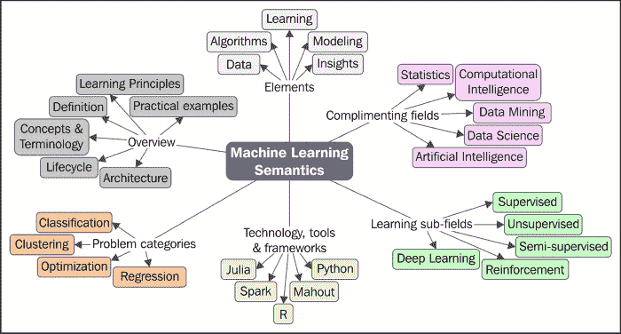

## 定义

让我们从定义什么是机器学习开始。机器学习有许多技术和功能定义，其中一些如下:

|   | *“如果由 P 测量的计算机程序在 T 中的任务上的性能随着经验 E 而提高，则称该计算机程序从关于某类任务 T 和性能测量 P 的经验 E 中学习。”* |   |
|   | - *汤姆·米切尔* |

|   | *“机器学习是从数据中训练一个模型，该模型根据性能测量来概括决策。”* |   |
|   | - *杰森·布朗利* |

|   | *“人工智能的一个分支，在这一分支中，计算机生成规则，这些规则基于或基于输入其中的原始数据。”* |   |
|   | ——*Dictionary.com* |

|   | “机器学习是一门科学学科，它涉及算法的设计和开发，这些算法允许计算机基于经验数据(如来自传感器数据或数据库的数据)进化行为。” |   |
|   | ——*维基百科* |

前面的定义既有趣又贴切。他们要么有算法，统计，或数学的观点。

除了这些定义，机器学习的单个术语或定义是促进问题解决平台定义的关键。基本上，它是*一种模式搜索*和将智能构建到机器中以便能够学习的机制，暗示它将能够根据自己的经验在未来做得更好。

再深入探究一下典型的模式，模式搜索或模式识别本质上是研究机器如何感知环境，学会区分感兴趣的行为，并能够做出合理的行为分类决定。这通常由人类来执行。目标是提高准确性和速度，并避免不恰当使用系统的可能性。

以这种方式构建的机器学习算法处理建筑智能。从本质上讲，机器理解数据的方式与人类非常相似。

机器学习实现的主要目标是开发一个通用的算法来解决一个实际的和集中的问题。在此过程中需要考虑的一些重要方面包括数据、时间和空间需求。最重要的是，由于能够应用于广泛的学习问题，学习算法的目标是产生一个尽可能准确的规则结果。

另一个重要方面是大数据环境；也就是说，已知机器学习方法即使在需要从庞大、多样且快速变化的数据集中发现见解的情况下也是有效的。关于机器学习的大规模数据方面的更多内容将在[第二章](ch02.html "Chapter 2. Machine learning and Large-scale datasets")、*机器学习和大规模数据集*中介绍。

## 核心概念和术语

机器学习的核心是正确地了解和使用数据。这包括收集*右*数据，清理数据，并使用学习算法迭代地处理数据，以使用数据的某些关键特征建立模型，并基于来自这些模型的假设，做出预测。

在本节中，我们将涵盖机器学习中使用的标准命名法或术语，从如何描述数据、学习、建模、算法和特定的机器学习任务开始。

## 什么是学习？

现在，让我们看看机器学习环境中“学习”的定义。简而言之，历史数据或观察结果用于预测或得出可操作的任务。很明显，智能系统的一个要求是它的学习能力。以下是定义学习问题的一些注意事项:

*   提供学习者应该学习什么和学习需求的定义。
*   定义数据需求和数据来源。
*   定义学习者是应该对整个数据集进行操作，还是应该对子集进行操作。

在我们在下面的章节中深入理解每种学习类型的内部原理之前，您需要理解解决学习问题所遵循的简单过程，包括构建和验证以最大准确度解决问题的模型。

### 提示

模型只不过是将算法应用于数据集的输出，它通常是数据的表示。我们将在后面的章节中详细介绍模型。

一般来说，为了执行机器学习，主要需要两种类型的数据集。第一个数据集通常是手动准备的，其中输入数据和预期的输出数据是可用的和准备好的。每条输入数据都有一个可用的预期输出数据点，这一点很重要，因为这将在监督下用于构建规则。第二个数据集是我们拥有输入数据的地方，我们对预测预期输出感兴趣。

作为第一步，给定的数据被分成三个数据集:训练、验证和测试。对于多少百分比的数据应该是训练、验证和测试数据集，没有一个硬性规定。它可以是 70-10-20、60-30-10、50-25-25 或任何其他值。

例如，训练数据集指的是用于学习或构建分类器的数据示例。验证数据集是指根据构建的分类器进行验证的数据示例，可以帮助调整输出的准确性。测试数据集指的是帮助评估分类器性能的数据示例。

执行机器学习通常有三个阶段:

*   **阶段 1—训练阶段**:这是通过将给定输入与预期输出配对，使用训练数据训练模型的阶段。这个阶段的输出是学习模型本身。
*   **阶段 2——验证和测试阶段**:该阶段用于衡量已经训练好的学习模型有多好，并估计模型属性，如错误度量、召回率、精确度等。这个阶段使用验证数据集，输出是复杂的学习模型。
*   **第三阶段——应用阶段**:在这个阶段，模型以需要导出结果的真实世界数据为准。

下图描述了如何应用学习来预测行为:

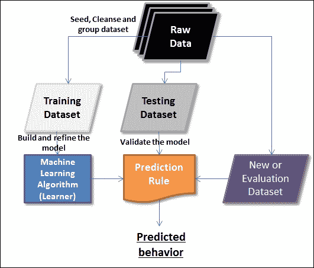

### 数据

数据是机器学习的主要学习来源。这里引用的数据可以是任何格式，可以以任何频率接收，也可以是任何大小。当谈到在机器学习环境中处理大型数据集时，有一些新技术已经发展并正在试验中。还有更多大数据方面，包括并行处理、分布式存储、执行。更多关于大规模数据的内容将在下一章讨论，包括一些独特的优势。

当我们想到数据时，我们会想到维度。首先，对于结构化和非结构化数据，我们有行和列。这本书将涵盖在机器学习环境中处理结构化和非结构化数据。在本节中，我们将介绍机器学习环境中与数据相关的术语。

| 

学期

 | 

机器学习环境中的目的或意义

 |
| --- | --- |
| 特征、属性、字段或变量 | 这是学习算法引用的单列数据。一些特征可以输入到学习算法，一些可以是输出。 |
| 情况 | 这是数据集中的一个单行数据。 |
| 特征向量或元组 | 这是功能列表。 |
| 尺寸 | 这是用于描述数据属性的属性子集。例如，日期维度由三个属性组成:日、月和年。 |
| 资料组 | 行或实例的集合称为数据集。在机器学习的背景下，有不同类型的数据集用于不同的目的。在不同阶段的不同数据集上运行算法，以测量模型的准确性。有三种类型的数据集:训练、测试和评估数据集。任何给定的综合数据集都分为三类数据集，通常按以下比例:60%训练，30%测试，10%评估。 |
| a.训练数据集 | 定型数据集是一个数据集，它是构建或定型模型所依据的基础数据集。 |
| b.测试数据集 | 测试数据集是用于验证所建模型的数据集。该数据集也称为验证数据集。 |
| c.评估数据集 | 评估数据集是用于模型的最终验证的数据集(并且可以更多地被视为用户验收测试)。 |
| 数据类型 | 属性或特征可以有不同的数据类型。下面列出了一些数据类型:

*   分类(例如:年轻、年老)。
*   序数(例如:0，1)。
*   数字(例如:1.3、2.1、3.2 等等)。

 |
| 新闻报道 | 对其进行预测或覆盖模型的数据集的百分比。这决定了预测模型的可信度。 |

### 有标签和无标签的数据

机器学习环境中的数据可以标记也可以不标记。在我们深入研究机器学习基础知识之前，你需要理解这种分类，以及什么时候使用什么数据，因为这一术语将贯穿本书。

未标记的数据通常是数据的原始形式。它由自然或人造物品的样本组成。这类数据很容易大量获得。例如视频流、音频、照片和推文等等。这种形式的数据通常没有附加含义的解释。

一旦赋予了意义，未标记的数据就变成了标记的数据。在这里，我们讨论的是附加一个“标签”或“标记”，这是必需的，也是强制性的，以解释和定义相关性。例如，照片的标签可以是它所包含的内容的细节，如动物、树、大学等等，或者在音频文件的上下文中，可以是政治会议、告别聚会等等。更常见的是，标签是由人类绘制或定义的，并且获得标签比获得未标记的原始数据要昂贵得多。

学习模型可以应用于标记和未标记的数据。我们可以使用标记和未标记数据集的组合来导出更精确的模型。下图表示有标签和无标签的数据。三角形和较大的圆圈代表标记的数据，小圆圈代表未标记的数据。

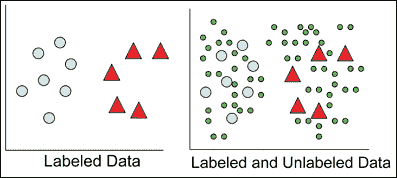

在以下章节中更详细地讨论了带标签的和不带标签的数据的应用。你会看到有监督的学习采用有标签的数据，无监督的学习采用无标签的数据。半监督学习和深度学习技术以各种方式应用标记和未标记数据的组合来建立精确的模型。

### 任务

任务是机器学习算法要解决的问题。我们衡量一项任务的绩效是很重要的。这个上下文中的术语“性能”只不过是解决问题的程度或信心。不同的算法在不同的数据集上运行时会产生不同的模型。重要的是，不比较由此生成的模型，而是测量不同数据集和不同模型的结果的一致性。

### 算法

在对手头的机器学习问题有了一个清晰的认识之后，重点是什么数据和算法是相关的或者适用的。有几种算法可用。这些算法或者按学习子领域(如监督、非监督、强化、半监督或深度)分组，或者按问题类别(如分类、回归、聚类或优化)分组。这些算法迭代地应用于不同的数据集，并捕获随新数据发展的输出模型。

### 车型

模型是任何机器学习实现的核心。模型描述了在系统中观察到的数据。模型是应用于数据集的算法的输出。在许多情况下，这些模型被应用于新的数据集，帮助模型学习新的行为并预测它们。有大量的机器学习算法可以应用于给定的问题。在很高的层面上，模型分为以下几类:

*   逻辑模型
*   几何模型
*   概率模型

#### 逻辑模型

逻辑模型本质上更多的是算法，通过迭代运行算法来帮助我们获得一组规则。决策树就是这样一个例子:

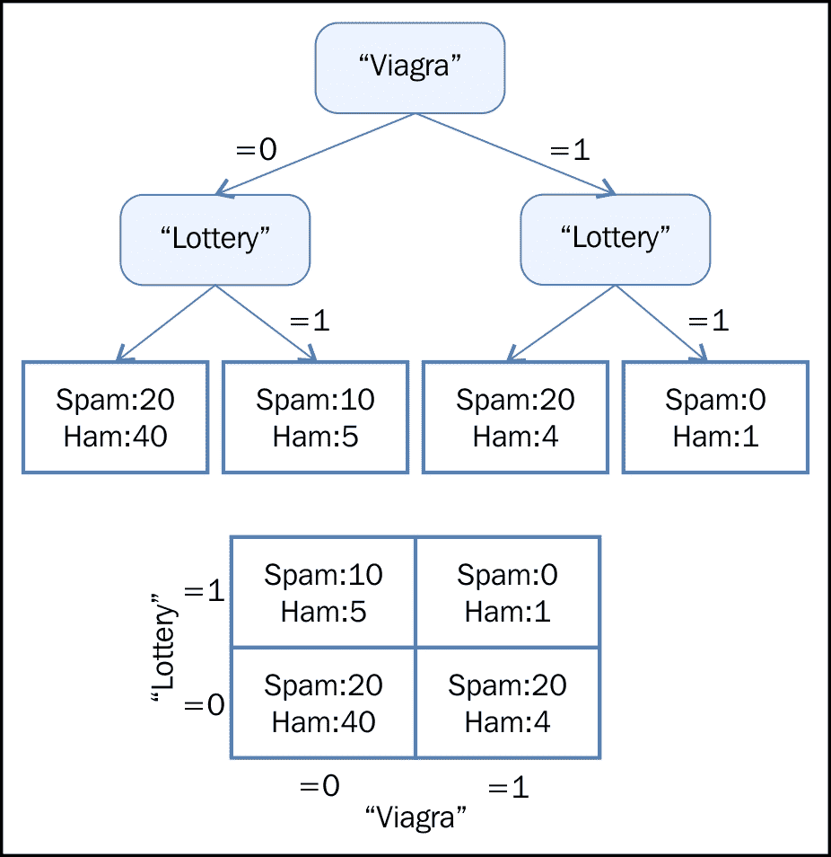

#### 几何模型

几何模型使用几何概念，如直线、平面和距离。这些模型通常或能够在大量数据上运行。通常，线性变换有助于比较不同的机器学习方法:

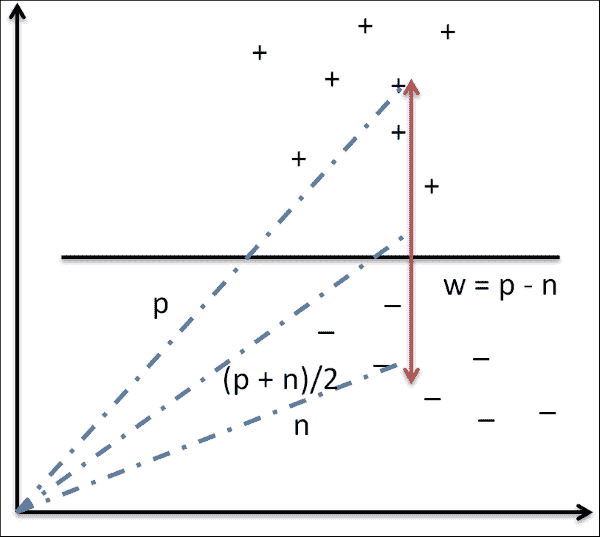

#### 概率模型

概率模型是采用统计技术的统计模型。这些模型基于定义两个变量之间关系的策略。这种关系可以被确定地导出，因为这涉及使用随机背景过程。在大多数情况下，可以考虑处理全部数据的子集:

| 

伟哥

 | 

彩票

 | 

P(Y=垃圾邮件(伟哥、彩票))

 | 

P(Y=火腿(伟哥，彩票))

 |
| --- | --- | --- | --- |
| 0 | 0 | 0.31 | 0.69 |
| 0 | 一 | 0.65 | 0.35 |
| 一 | 0 | 0.80 | 0.20 |
| 一 | 一 | 0.40 | 0.60 |

## 机器学习中的数据和不一致性

本节详细介绍了在实施机器学习项目时可能遇到的所有可能的数据不一致，例如:

*   装配不足
*   过度拟合
*   数据不稳定性
*   不可预知的未来

幸运的是，现在已经有一些既定的流程来解决这些不一致的问题。以下部分涵盖了这些不一致之处。

### 欠装配

当一个模型没有考虑足够的信息来准确地模拟实际数据时，它被称为欠拟合。例如，如果仅映射了指数曲线上的两个点，这可能变成线性表示，但是可能存在模式不存在的情况。在这种情况下，我们会看到越来越多的错误，并随之产生一个不准确的模型。此外，在分类器过于严格或不够复杂的情况下，拟合不足不仅是由于缺乏数据造成的，也可能是不正确建模的结果。例如，如果两个类形成同心圆，并且我们试图拟合一个线性模型，假设它们是线性可分的，这可能会导致拟合不足。

模型的准确性是由统计世界中称为“功效”的一种度量来决定的。如果数据集太小，我们永远无法找到最佳解决方案。

### 过度拟合

这种情况正好与之前解释的欠拟合情况相反。虽然样本过小不适合定义最佳解决方案，但大型数据集也存在模型过度拟合数据的风险。当统计模型描述噪声而不是描述关系时，通常会发生过拟合。在这种情况下详述前面的例子，假设我们有 500，000 个数据点。如果模型最终要容纳所有 500，000 个数据点，这就变得过度合适了。这实际上意味着模型正在记忆数据。只要数据集没有曲线外的点，该模型就能很好地工作。过度拟合的模型表现不佳，因为数据中的微小波动往往会被夸大。过度拟合的主要原因也可能是用于训练模型的标准不同于用于判断模型功效的标准。简单来说，如果模型记忆训练数据而不是学习，这种情况会更经常发生。

现在，在减轻数据拟合不足问题的过程中，通过给它更多的数据，这本身就是一种风险，最终会过度拟合。考虑到更多的数据可能意味着更多的复杂性和噪音，我们可能最终得到的解决方案模型只适合手头的当前数据，而不适合其他数据，这使得它无法使用。在下图中，随着模型复杂性和误差的增加，指出了过拟合和欠拟合的条件:

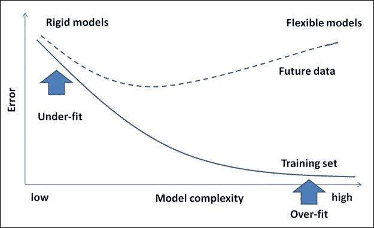

### 数据不稳定

机器学习算法通常对数据中的噪声具有鲁棒性。如果异常值是由于相关数据的人工错误或错误解释造成的，就会出现问题。这将导致数据的偏差，最终导致不正确的模型。

因此，非常需要一个过程来纠正或处理可能导致构建错误模型的人为错误。

### 不可预测的数据格式

机器学习是,意在处理不断进入系统的新数据，并从这些数据中学习。当进入系统的新数据以机器学习系统不支持的格式出现时，复杂性将逐渐增加。鉴于我们接收数据的格式不稳定，现在很难说我们的模型是否能很好地处理新数据，除非有一种机制来处理这种情况。

## 实用的机器学习例子

在这一部分，我们来探索一些真实世界的机器学习应用。在本章的介绍部分，我们介绍了各种例子，现在我们将介绍一些特定领域的例子，并简要描述每个问题。

对于在线和离线应用程序，下面的一些例子很容易猜到。在接下来的章节中，将挑选这些示例的子集来演示使用合适的机器学习算法的实际实现方面。

| 

问题/问题领域

 | 

描述

 |
| --- | --- |
| 垃圾邮件检测 | 这里的问题语句是识别哪些邮件是“垃圾邮件”。机器学习算法可以根据它使用电子邮件数据的一些关键特征建立的一些规则，将电子邮件分类为垃圾邮件。一旦电子邮件被标记为垃圾邮件，该电子邮件将被移动到垃圾邮件文件夹中，其余的则留在收件箱中。 |
| 信用卡欺诈检测 | 这是信用卡公司最近需要解决的问题之一。基于消费者对信用卡的使用模式和顾客的购买行为，需要识别任何不是顾客潜在进行的交易，并将其标记为欺诈性的，以便采取必要的行动。 |
| 数字识别 | 这是一个非常简单的用例，需要能够根据邮政编码对文章进行分组。这包括需要准确地解释手写数字，并根据邮政编码存储邮件，以加快处理速度。 |
| 语音识别 | 自动呼叫中心需要这种能力，用户在电话上的请求被解释并映射到要执行的任务之一。当用户请求被映射到一个任务时，它的执行就可以自动化了。这个问题的一个模型将允许一个程序理解并尝试满足这个请求。带 Siri 的 iPhone 就有这个能力。 |
| 人脸检测 | 这是当今社交媒体网站提供的关键功能之一。该功能提供了在多张数码照片中标记一个人的能力。这赋予了一个群体以资质，或者由一个人对照片进行分类。一些相机和软件(如 iPhoto)具有此功能。 |
| 产品推荐或客户细分 | 这种功能在当今几乎所有的顶级在线购物网站上都可以找到。给定客户的购买历史和大量的产品库存，这个想法是确定客户最有可能有兴趣购买的产品，从而刺激更多的产品购买。有许多在线购物和社交网站支持这一功能(例如:亚马逊、脸书、Google+和许多其他网站)。还有其他一些情况，比如预测试用版客户是否选择付费版产品的能力。 |
| 股票交易 | 这意味着根据当前过去的股票走势预测股票表现。这项任务对金融分析师至关重要，有助于在买卖股票时提供决策支持。 |
| 情感分析 | 很多时候，我们发现顾客会根据他人的意见做出决定。例如，我们购买一个产品是因为它从大多数用户那里得到了积极的反馈。不仅仅是在前面详述的商业领域，政治战略家也在使用情感分析来衡量公众对政策声明或竞选信息的看法。 |

## 学习问题类型

本节重点阐述不同的学习问题类别。机器学习算法也归类在这些学习问题下。下图描述了各种类型的学习问题:

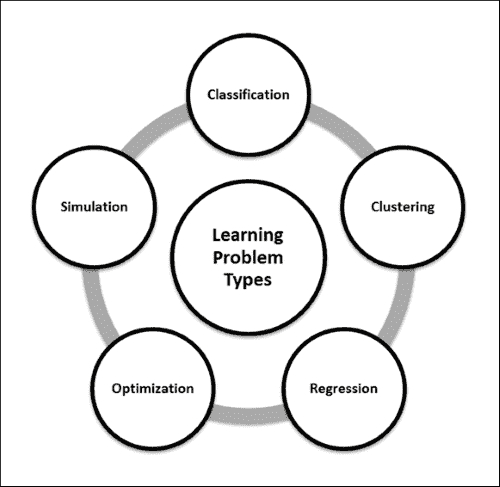

### 分类

分类是一种识别给定数据集分组技术的方法，根据目标或输出属性的值，整个数据集可以被限定为属于一个类。这项技术有助于识别数据行为模式。简而言之，这是一种歧视机制。

例如，销售经理需要帮助识别潜在客户，并希望确定是否值得花费客户要求的精力和时间。经理的关键输入是客户的数据，这种情况通常被称为 **总生命周期价值** ( **TLV** )。

我们获取数据，并开始在图表上盲目绘制(如下图所示)，其中 *x* 轴代表购买的商品总数，而 *y* 轴代表花费的总金额(以数百美元的倍数为单位)。现在我们定义标准来确定，例如，一个客户是好是坏。在下图中，所有单次购物花费超过 800 美元的客户都被归类为好客户(注意，这是一个假设的例子或分析)。

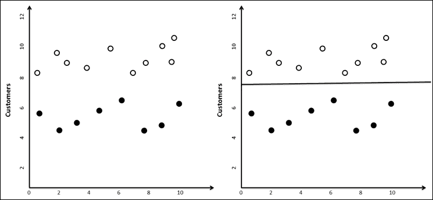

现在，当新的客户数据进来时，销售经理可以在这张图上画出新客户，并根据他们属于哪一方，预测客户可能是好客户还是坏客户。

### 提示

注意，分类不必总是二元的(是或否、男性或女性、好或坏等等)，并且可以基于问题定义来定义任意数量的分类(差、低于平均、平均、高于平均、好)。

### 聚类

在许多情况下，数据分析师只是得到一些数据，并被期望挖掘出可能有助于获得情报的有趣模式。这个任务和分类任务的主要区别在于，在分类问题中，业务用户指定他/她正在寻找什么(好客户或坏客户，成功或失败，等等)。

现在让我们详细讨论分类部分中考虑的同一个例子。在这里，对客户进行分类的模式是在没有任何目标或任何先前分类的情况下确定的，并且与运行分类不同，结果可能总是不相同(例如，取决于初始质心是如何选取的)。聚类的一个示例建模方法是 k 均值聚类。关于 k 均值聚类的更多细节将在下一节中介绍，并在后续章节中详细介绍。

简而言之，聚类是一种分类分析，不从头脑中的特定目标开始(好/坏，会买/不会买)。

### 预测、预报或回归

与分类类似，预测或预报也是关于确定未来事情发生的方式。这种信息来源于过去的经验或知识。在某些情况下，数据不够，需要通过回归来定义未来。预测和预报结果总是与不确定性或概率的程度一起呈现。这种问题类型的分类也被称为**规则提取**。

让我们举一个例子，一位农业科学家正在研究她开发的一种新作物。作为试验，将这种种子种植在不同的海拔高度，并计算产量。这里的要求是在给定海拔细节(和一些更多相关数据点)的情况下预测作物的产量。通过绘制参数之间的图表来确定获得的产量和高度之间的关系。注意到一个方程适合大多数数据点，在数据不符合曲线的情况下，我们可以去掉数据。这种技术被称为回归。

### 模拟

除了我们到目前为止定义的所有技术之外，还可能存在上下文中的数据本身具有许多不确定性的情况。例如，外包经理被赋予一项任务，他可以凭经验估计，这项任务可以由一个具有某些技能的团队在 2-4 小时内完成。

假设投入材料的成本可能在 100-120 美元之间变化，并且在任何给定的一天来工作的员工数量可能在 6 到 9 之间。然后，分析人员估计项目可能需要多长时间。解决这样的问题需要模拟大量的选择。

典型地，在预测、分类和无监督学习中，我们被给予数据，但我们确实不知道这些数据是如何相互联系的。没有等式可以将一个变量描述为其他变量的函数。

本质上，数据科学家结合一种或多种前述技术来解决挑战性问题，这些技术包括:

*   网络搜索和信息提取
*   药物设计
*   预测资本市场行为
*   理解客户行为
*   设计机器人

### 优化

简而言之，优化是一种机制，它使事情变得更好，或者为使事情变得最好的解决方案定义一个环境。

考虑一个生产场景，让我们假设有两台机器生产所需产品，但是一台机器需要更多的能源来实现高速生产和较低的原材料，而另一台机器需要更高的原材料和更少的能源来在相同的时间内生产相同的产品。根据输入的变化理解输出的模式是很重要的；产生最高利润的组合可能是生产经理想要知道的。作为一名分析师，你需要确定在机器之间分配生产的最佳方式，以获得最高利润。

下图显示了为两台机器之间的各种分配选项绘制图表时的最高利润点。识别这一点是这项技术的目标。

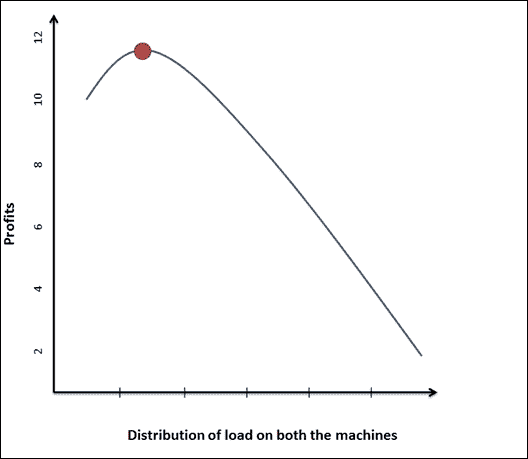

与输入数据存在不确定性的模拟情况不同，在优化过程中，我们不仅可以访问数据，还可以了解数据属性之间的相关性和关系。

机器学习中的一个关键概念是一个叫做**归纳**的过程。以下学习子字段使用归纳过程来建立模型。归纳学习是一个推理过程，它使用一个实验的结果来运行下一组实验，并从特定的信息中迭代地进化出一个模型。

下图描绘了机器学习的各个子领域。这些子字段是机器学习算法分类的方式之一。

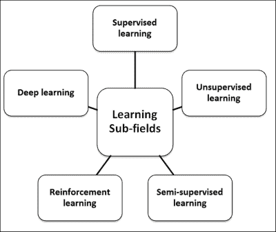

### 监督学习

监督学习就是根据已知的期望进行操作，在这种情况下，需要从定义的数据中分析什么。在这种情况下，输入数据集也称为“带标签的”数据集。归入这一类别的算法着重于在输入和输出属性之间建立一种关系，并推测性地使用这种关系为新的输入数据点生成一个输出。在前面的部分中，为分类问题定义的例子也是监督学习的例子。标记数据有助于建立可靠的模型，但通常昂贵且有限。

当数据的输入和输出属性已知时，监督学习的关键是输入到输出之间的映射。这些映射的例子有很多，但是链接输入和输出属性的复杂函数还不知道。监督学习算法负责处理这种关联，给定输入/输出对的大型数据集，这些函数有助于预测任何新输入值的输出。

### 无监督学习

在一些学习问题中，我们头脑中没有任何具体的目标去解决。在前面的部分中，我们讨论了聚类，聚类是一种分类分析，在这种分析中，我们不从特定的目标开始(好/坏，会购买/不会购买)，因此被称为无监督分析或学习。这种情况下的目标是根据数据的输入和输出属性之间的构建映射来解密数据中的结构，事实上，输出属性没有定义。由于这个原因，这些学习算法在“未标记的”数据集上操作。

### 半监督学习

半监督学习是关于使用标记和未标记的数据来更好地学习模型。对未标记的数据有适当的假设是很重要的，任何不适当的假设都会使模型无效。半监督学习的动机来自人类的学习方式。

### 强化学习

强化学习是专注于从结果中获得最大回报的学习。例如，在教初学走路的孩子新习惯的时候，每次他们按照指示做的时候奖励他们非常有效。事实上，他们知道什么样的行为有助于他们获得回报。这就是强化学习，也叫信用评估学习。

最重要的是，在强化学习中，模型还负责做出决策，并因此获得定期奖励。与监督学习不同，这种情况下的结果不是即时的，可能需要执行一系列步骤才能看到最终结果。理想情况下，该算法将生成一系列有助于实现最高回报或效用的决策。

这个学习技巧的目标是通过探索和利用数据来有效地衡量取舍。例如，当一个人必须从 A 点旅行到 B 点时，将有许多方式，包括乘飞机、水路、公路或步行，通过衡量这些选项中每一个的权衡来考虑这些数据具有重要的价值。另一个重要的方面是延迟回报的意义。这会如何影响学习？例如，在像国际象棋这样的游戏中，奖励识别的任何延迟都可能改变结果。

### 深度学习

深度学习是机器学习的一个领域，专注于将机器学习与人工智能统一起来。就与人工神经网络的关系而言，该领域更多地是对人工神经网络的发展，人工神经网络对大量常见数据进行处理，以获得实用的见解。它致力于构建更复杂的神经网络来解决半监督学习下的分类问题，并对几乎没有标记数据的数据集进行操作。一些深度学习技术列举如下:

*   卷积网络
*   **受限玻尔兹曼** **机器** ( **RBM** )
*   **深深的信念** **人脉** ( **DBN** )
*   堆叠式自动编码器

<title>Performance measures</title>

# 绩效评估

性能测量用于评估学习算法，并形成机器学习的一个重要方面。在某些情况下，这些措施也被用作建立学习模型的启发。

现在让我们来探讨一下**的概念可能近似正确的** ( **PAC** )理论。当我们描述假设的准确性时，我们通常根据PAC 理论谈论两种类型的不确定性:

*   **近似值**:这衡量的是一个假设的误差被接受的程度
*   **概率**:这个度量是假设正确的百分比确定性

下图显示了样本数如何随着误差、概率和假设而增长:

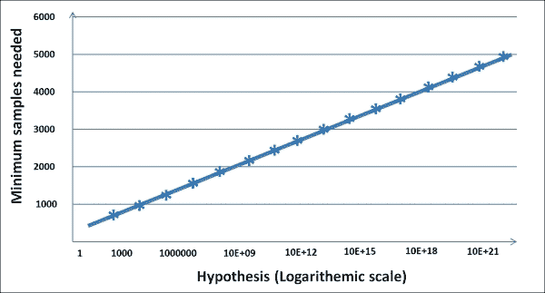

## 解决方案好吗？

分类和预测问题的误差度量是不同的。在这一节中，我们将讨论这些错误措施中的一些,以及如何解决它们。

在一个分类问题中，你可以有两种不同类型的错误，它们可以用“混淆矩阵”优雅地表示出来。假设在我们的目标营销问题中，我们处理 10，000 条客户记录，以预测哪些客户可能会对我们的营销工作做出响应。

分析完活动后，您可以构建下表，其中列是您的预测，行是真实的观察结果:

| 

行动

 | 

预测(会有购买)

 | 

预测(不会有购买)

 |
| --- | --- | --- |
| 实际购买 | TP: 500 | 新生力量:400 人 |
| 实际上没有购买 | FP: 100 | 总氮:9000 |

在主对角线上，我们有买家和非买家，他们的预测与现实相符。这些都是正确的预测。它们分别被称为真正和真负。在右上角，我们有那些我们预测为非买家，但实际上是买家的人。这是一种被称为假阴性误差的误差。在左下角，我们有那些我们预测为买家，但不是买家的人。这是另一个被称为假阳性的错误。

对于客户来说，这两种错误的代价是一样的吗？其实没有！如果我们预测某人是买家，而他们却不是买家，公司最多会损失一封邮件或一个电话的费用。然而，如果我们预测有人不会购买，而他们实际上是购买者，公司就不会根据这一预测给他们打电话，从而失去一个客户。所以，在这种情况下，假阴性比假阳性的代价要大得多。

机器学习社区对分类问题使用三种不同的误差度量:

*   **Measure 1: Accuracy** is the percent of predictions that were correct.

    示例:10，000 分中的“准确度”为(9，000+500)= 95%

*   **Measure 2: Recall** is the percent of positives cases that you were able to catch. If false positives are low, recall will be high.

    示例:600 次“召回”中有 500 次= 83.33%

*   **Measure 3: Precision** is the percent of positive predictions that were correct. If false negatives are low, precision is high.

    例如:“精确度”是 900 分之 500 = 55.55%

在预测中，你预测的是一个连续变量。因此，这里的误差度量相当不同。通常，通过将模型的预测与目标变量的真实值进行比较并计算平均误差来获得误差度量。以下是一些衡量标准。

### 均方误差

为了计算 MSE，我们首先取每条记录的实际值和预测值之间的差的平方。然后我们取这些平方误差的平均值。如果第 *i ^(th)* 记录的预测值为 *Pi* ，实际值为 *Ai* ，则 MSE 为:

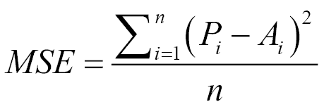

也常用这个量的平方根称为**均方根误差** ( **RMSE** )。

### 平均绝对误差(MAE)

为了计算 MAE，我们取每条记录的预测值和实际值之间的绝对差值。然后我们取这些绝对差值的平均值。性能指标的选择取决于应用。对于许多应用来说，MSE 是一个很好的性能指标，因为它有更多的方差统计基础。另一方面，MAE 更直观，对异常值不太敏感。观察梅和 RMSE 给了我们关于误差分布的额外信息。在回归中，如果 RMSE 接近平均汇率，模型会产生许多相对较小的误差。如果 RMSE 接近 MAE2，模型会产生一些很大的误差。

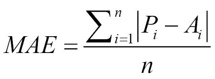

### 归一化的均方误差和平均误差(NMSE 和 NMAE)

MSE 和 MAE 都不表示误差有多大，因为它们是数值，取决于目标变量的标度。与一个基准指数进行比较提供了更好的洞察力。通常的做法是取我们正在预测的主要属性的平均值，并假设我们的预测模型只是平均值。然后，我们根据简单模型和原始模型计算 MSE。该比率提供了我们的模型与原始模型相比的好坏程度。

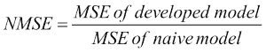

类似的定义也可以用于 MAE。

### 解决误差:偏差和方差

这种构建高度定制的高阶模型的陷阱被称为过度拟合，这是一个关键的概念。由此产生的误差被称为模型的**方差**。本质上，如果我们采用不同的训练集，我们将获得一个非常不同的模型。方差是模型对训练集的依赖性的度量。顺便说一下，你在最右边看到的模型(线性拟合)被称为欠拟合，由欠拟合引起的误差被称为偏差。在拟合不足或偏差较大的情况下，模型无法解释数据之间的关系。本质上，我们试图符合一个过于简单的假设，例如，线性的，我们应该寻找一个更高阶的多项式。

为了避免过度拟合和欠拟合的陷阱，数据科学家在训练集上建立模型，然后在测试集上找到错误。他们改进模型，直到测试集中的错误减少。随着模型开始根据训练数据进行定制，测试集上的错误开始增加。从那以后，他们停止了模型的改进。

让我们在本章中多分析一下偏差和方差，并学习一些处理它们的实用方法。任何模型中的误差都可以表示为偏差、方差和随机误差的组合。用*Err(x)= bias 2+方差+不可约误差*在不太复杂的模型中，偏倚项高，在复杂度较高的模型中，方差项高，如下图所示:

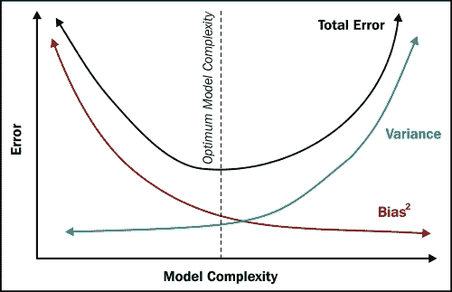

为了减少偏差或方差，我们先来问这个问题。如果一个模型有很高的偏差，那么它的误差作为数据量的函数是如何变化的？

在非常低的数据规模下，任何模型都可以很好地拟合数据(任何模型都可以拟合单点，任何线性模型都可以拟合两点，二次模型可以拟合三点，以此类推)。因此，高偏差模型在训练集上的误差开始很小，随着数据点的增加而增加。但是，在测试集上，由于模型是根据训练集高度定制的，因此最初的误差仍然很高。随着模型变得越来越精细，误差减小并且变得与训练集的误差相等。

下图清楚地描述了这种情况:

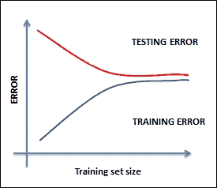

这种情况的补救方法可以是以下方法之一:

*   最有可能的是，您使用的功能非常少，因此您必须找到更多的功能
*   通过增加多项式和深度来增加模型的复杂性
*   如果模型偏差较大，增加数据大小不会有太大帮助

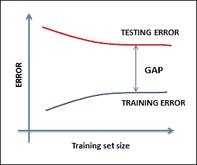

当你面对这种情况时，你可以尝试下面的补救方法(与前面的相反):

*   最有可能的是，您正在使用太多的功能，因此，您必须减少功能
*   降低模型的复杂性
*   增加数据大小会有所帮助

<title>Some complementing fields of Machine learning</title>

# 机器学习的一些补充领域

机器学习与许多相关领域有着密切的关系，包括人工智能、数据挖掘、统计学、数据科学以及其他一些领域。事实上，机器学习是一个多学科领域，在某些方面与所有这些领域都有联系。

在这一节中，我们将定义其中的一些领域，将它们与机器学习联系起来，并理解相似性和不同性(如果有的话)。总的来说，我们将从核心的机器学习定义开始，作为一个科学领域，包括开发自学习算法。我们现在要讨论的大多数领域要么使用机器学习技术，要么使用机器学习技术的超集或子集。

## 数据挖掘

数据挖掘是一个分析数据并通过应用商业规则从(大)数据集中获得洞察力的过程。这里的重点是数据和数据的域。在识别哪些规则相关、哪些不相关的过程中，采用了机器学习技术。

| 

机器学习与数据挖掘

 |
| --- |
| **与机器学习的相似之处** | **与机器学习的不同点** | **与机器学习的关系** |
| 机器学习和数据挖掘都以从中提取价值为目标来看待数据。大多数用于机器学习和数据挖掘的工具都很常见。例如，R 和 Weka 等等。 | 虽然机器学习侧重于使用已知的知识或经验，但数据挖掘侧重于发现未知的知识，如数据中特定结构的存在，这将有助于分析数据。与目标消费者是人类的数据挖掘相比，机器学习中的智能衍生意味着由机器消费。 | 机器学习和数据挖掘领域相互交织，在基本原则和方法上有很大的重叠。 |

## 人工智能

人工智能专注于构建能够模仿人类行为的系统。它已经存在了一段时间，现代人工智能一直在不断发展，现在包括专门的数据需求。在许多其他能力中，人工智能应该展示以下内容:

*   知识存储和表示，用于保存所有接受询问和调查的数据
*   **自然语言处理** ( **NLP** )能够处理文本的能力
*   能够回答问题并得出结论的推理能力
*   计划、安排和自动化的能力
*   机器学习能够建立自我学习算法
*   机器人及更多

机器学习是人工智能的一个子领域。

| 

机器学习对人工智能

 |
| --- |
| **与机器学习的相似之处** | **与机器学习的不同点** | **与机器学习的关系** |
| 机器学习和人工智能都采用学习算法，并在推理或决策时专注于自动化。 | 虽然机器学习被认为是人工智能的兴趣范围，但机器学习的主要焦点是提高机器的任务性能，并且建立的经验不一定总是人类行为。在人工智能的情况下，采用人类启发的算法。 | 机器学习通常被认为是人工智能的一个子领域。 |

## 统计学习

在统计学习中，预测函数主要是从数据样本中得出的。在这个过程中，如何收集、清理和管理数据是非常重要的。统计学非常接近数学，因为它是关于量化数据和数字运算的。

| 

机器学习与统计学习

 |
| --- |
| **与机器学习的相似之处** | **与机器学习的不同点** | **与机器学习的关系** |
| 就像机器学习一样，统计学习也是关于建立从数据中进行推断的能力，这些数据在某些情况下代表经验。 | 统计学习专注于得出有效的结论，而机器学习是关于预测的。与机器学习相比，统计学习工作于并允许假设。机器学习和统计学是由不同的小组实践的。与统计学相比，机器学习是一个相对较新的领域。 | 机器学习技术实现统计技术。 |

## 数据科学

数据科学就是将数据转化为产品。正是分析和机器学习付诸行动，从数据中得出推论和见解。数据科学被认为是传统数据分析和知识系统的第一步，如**数据仓库** ( **DW** )和**商业智能**(**BI**)考虑了大数据的所有方面。

数据科学生命周期包括从数据可用性/加载到导出和交流数据洞察到操作流程的步骤，机器学习通常构成该流程的一个子集。

| 

机器学习与数据科学

 |
| --- |
| **与机器学习的相似之处** | **与机器学习的不同点** | **与机器学习的关系** |
| 鉴于问题的背景，机器学习和数据科学将预测作为一种常见的绑定结果。 | 机器学习和数据科学的一个重要区别是对领域专业知识的需求。数据科学专注于解决特定领域的问题，而机器学习则专注于构建一般适合问题背景的模型。 | 数据科学是机器学习、数据挖掘和相关学科的超集。它广泛涵盖了从数据加载到生产的整个过程。 |

<title>Machine learning process lifecycle and solution architecture</title>

# 机器学习流程生命周期和解决方案架构

在本节中，我们将讨论机器学习的实施流程和解决方案架构:

1.  定义解决方案架构的第一步是定义问题陈述，包括定义目标、过程和假设。
2.  确定此问题属于哪种问题类型？不管是分类，回归，还是优化问题？
3.  选择一个用于衡量模型准确性的指标。
4.  为了确保模型能够很好地处理未知数据:

    1.  使用训练数据构建模型。
    2.  使用测试数据调整模型。
    3.  声明基于最终版本的精度。

下图中的解释了底层系统的流程和架构:

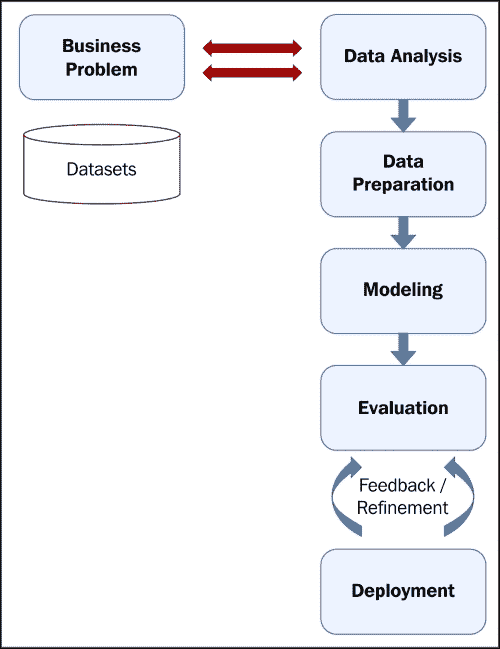<title>Machine learning algorithms</title>

# 机器学习算法

现在，让我们看看重要的机器学习算法和关于它们每一个的一些简要细节。每种算法的深入实现将在后面的章节中讨论。这些算法或者按照问题类型分类，或者按照学习类型分类。给出的算法有一个简单的分类，但它是直观的，不一定是详尽的。

对机器学习算法进行分类或分组有许多方式，在本书中我们将使用基于学习模型的分组。在每一章中，从第 5 章、*基于决策树的学习*开始，我们将涵盖一个或多个学习模型和相关算法。以下概念模型描述了一系列学习模型:

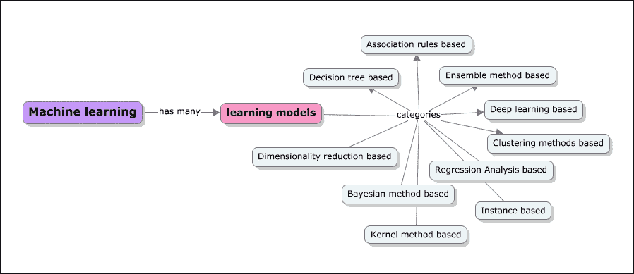

## 基于决策树的算法

基于决策树的算法定义了基于所提供的数据迭代或递归构建的模型。基于决策树的算法的目标是在给定一组输入变量的情况下预测目标变量的值。决策树使用基于树的方法帮助解决分类和回归问题。决策在树结构中分叉，直到对给定记录做出预测决策。中的一些算法为如下:

*   随机森林
*   **分类和** **回归树** ( **大车**)
*   C4.5 和 C5.0
*   卡方检验
*   **坡度** **助推机械** ( **GBM** )
*   **卡方自动** **交互** **检测** ( **CHAID** )
*   决定树桩
*   **多元自适应** **回归样条** ( **火星**)

## 基于贝叶斯方法的算法

贝叶斯方法是那些明确应用贝叶斯推理定理并再次解决分类和回归问题的。贝叶斯方法促进了建模中的主观概率。以下是一些基于贝叶斯的算法:

*   天真的贝叶斯
*   **平均一元依赖** **估计量** ( **AODE** )
*   **贝叶斯信念** **网络** ( **BBN** )

## 基于核方法的算法

当我们听到内核方法时，脑海中首先想到的是**支持向量机** ( **SVM** )。这些方法本身通常是一组方法。内核方法与模式分析有关,正如前面章节所解释的，模式分析的关键包括各种映射技术。这里，映射数据集包括向量空间。基于核心方法的学习算法的一些示例如下所列:

*   SVM
*   **线性判别分析** ( **LDA** )

## 聚类方法

聚类和回归一样，描述了一类问题和一类方法。聚类方法通常由建模方法组织，例如基于质心和分层。这些方法通过评估输入数据结构的相似性来将数据组织成组:

*   k 均值
*   **期望** **最大化** ( **EM** )和**高斯** **混合模型** ( **GMM** )

## 人工神经网络

与内核方法类似，人工神经网络也是一类模式匹配技术，但这些模型是受生物神经网络结构的启发。这些方法再次用于解决分类和回归问题。它们与深度学习建模相关，并有许多算法子领域，有助于解决上下文中的特定问题。

此类别中的一些方法包括:

*   **学习** **矢量** **量化** ( **LVQ**
*   **自组织** **贴图** ( **SOM** )
*   霍普菲尔德网络
*   感知器
*   反向传播

## 降维

像聚类方法一样，降维方法以一种无监督的方式对数据结构进行迭代工作。给定数据集和维度，更多的维度将意味着机器学习实现中更多的工作。这个想法是迭代地减少维度，并带来更多相关的维度。这种技术通常用于简化高维数据，然后应用监督学习技术。一些降维方法示例如下:

*   **多维** **缩放** ( **MDS** )
*   **主成分** **分析** ( **PCA** )
*   **投射** **追击** ( **PP** )
*   **偏最小** **平方** ( **PLS** )回归
*   Sammon 映射

## 集成方法

顾名思义，集合方法包含多个独立构建的模型，这些模型的结果被组合起来，负责整体预测。确定要合并或包含哪些独立的模型，需要如何合并结果，以及以何种方式实现所需的结果是至关重要的。组合的模型子集有时被称为较弱的模型，因为这些模型的结果不需要完全满足孤立的预期结果。这是一种非常强大且被广泛采用的技术。以下是一些集成方法算法:

*   随机森林
*   制袋材料
*   adaboost 算法
*   自举聚合(Boosting)
*   堆叠一般化(混合)
*   **坡度** **增压机** ( **GBM** )

## 基于实例的学习算法

实例只不过是数据集的子集，基于实例的学习模型在对问题至关重要的已识别实例或实例组上工作。比较跨实例的结果，这也可以包括新数据的实例。这种比较使用特定的相似性度量来寻找最佳匹配和预测。基于实例的方法也被称为基于案例或基于记忆的学习。这里的重点是实例的表示和用于实例之间比较的相似性度量。下面列出了一些基于实例的学习算法:

*   **k-最近的**邻居 ( **k-NN** )
*   自组织
*   **学习** **矢量** **量化** ( **LVQ** )
*   **自组织** **地图** ( **SOM** )

## 基于回归分析的算法

回归是根据模型产生的误差反复改进模型的过程。回归也用于定义机器学习问题类型。回归中的一些示例算法如下:

*   普通最小二乘线性回归
*   逻辑回归
*   **多元自适应回归样条** ( **MARS** )
*   逐步回归

## 基于关联规则的学习算法

给定变量，基于关联规则的学习算法提取并定义可应用于数据集的规则，并演示基于经验的学习，从而进行预测。当在多维数据环境中关联这些规则时，它们在商业环境中也是有用的。下面给出了一些基于关联规则的算法的例子:

*   Apriori 算法
*   Eclat 算法

<title>Machine learning tools and frameworks</title>

# 机器学习工具和框架

在技术和商业组织中，机器学习的采用正在迅速增加。每个组织都在积极制定战略，如何利用他们的数据并使用它来增强客户的体验和建立新的业务。当谈到机器学习的工具或框架时，市场上有许多开源和商业选项。新时代的工具都是为了支持大数据、分布式存储和并行处理而构建的。在下一章，我们将讨论在机器学习环境下处理大规模数据的一些方面。

在非常高的层面上，有三代机器学习工具。

第一代机器学习工具专注于提供丰富的机器学习算法和支持深度分析。这些工具并不是专门为处理大规模数据或支持分布式存储和并行处理而构建的。它们中的一些仍然处理卷，因为它们支持垂直可伸缩性。属于这一类别的一些工具有 SAS、SPSS、Weka、R 等等。话虽如此，这些工具中的大多数现在也正在升级以支持大数据需求。

第二代工具专注于支持大数据需求，其中大多数在 Hadoop 平台上工作，并提供在 MapReduce 范式中运行机器学习算法的能力。这里分类的一些工具是 Mahout、RapidMiner、Pentaho 和 MADlib。这些工具中的一些并不支持所有的机器学习算法。

第三代工具是路上的聪明孩子，打破了传统的批量模式操作的规范，支持实时分析，为大数据的高级数据类型提供支持，同时支持更深层次的分析。这类工具包括 Spark、HaLoop 和 Pregel。

在[第 4 章](ch04.html "Chapter 4. Machine Learning Tools, Libraries, and Frameworks")、*机器学习工具、库和框架*中，我们将涵盖一些关键的机器学习工具，并演示如何基于问题的上下文来使用它们。R、Julia、Python、Mahout 和 Spark 等工具的实现细节将会深入讨论。将提供所需的技术入门和安装或设置相关的指导。

<title>Summary</title>

# 总结

这一章是本书其余章节的基础，我们讲述了机器学习的基础知识和机器学习语义学的前景。我们首先用简单的术语定义机器学习，并介绍机器学习术语或常用术语。

机器学习有许多竞争和互补的领域。我们已经彻底解释了机器学习与人工智能、数据挖掘、数据科学和统计等领域的相似性、不同性和关系。总的来说，所有这些领域都非常相似，并且有重叠的目标。在大多数情况下，这些领域的从业者是不同的。即使就所使用的工具而言，也有许多共同点。

我们还研究了一些可以在机器学习中使用的最新、最好的工具。这些工具中的一些将在章节中用实际例子来演示。

在下一章中，我们将介绍机器学习的一个独特方面，它极大地改变了人们看待机器学习实现的方式。我们将探索机器学习的大数据或大数据集方面如何影响工具和实施方法的选择。