<title>Chapter 3. An Introduction to Hadoop's Architecture and Ecosystem</title>

# 第三章。Hadoop 架构和生态系统简介

从本章开始，我们从机器学习的实现方面开始。让我们开始了解选择的平台—一个可以扩展到高级企业数据需求(特别是机器学习的大数据需求)的平台—Hadoop。

在本章中，我们将介绍 Hadoop 平台及其在应对机器学习的大规模加载、存储和处理挑战方面的能力。除了对 Hadoop 架构、其核心框架和其他支持生态系统组件的概述之外，本文还包括详细的安装流程和示例部署方法。虽然有许多 Hadoop 的商业发行版，但我们在这一章的重点是涵盖 Hadoop 的开源 Apache 发行版(最新版本 2.x)。

本章深入讨论了以下主题:

*   介绍 Apache Hadoop、其发展历史、核心概念以及构成 Hadoop 的生态系统框架
*   Hadoop 发行版和特定产品
*   Hadoop 环境的安装和设置
*   Hadoop 2.0—HDFS 和 MapReduce(还有 **YARN** ( **还有另一个资源谈判者**))架构，带有示例实现场景，使用架构的不同组件
*   理解核心生态系统组件的用途，使用示例设置并学习构建和运行程序
*   探索机器学习特定的生态系统扩展，如 Mahout 和 R 连接器([第 4 章](ch04.html "Chapter 4. Machine Learning Tools, Libraries, and Frameworks")，*机器学习工具、库和框架*，涵盖实现细节)

# Apache Hadoop 简介

Apache Hadoop 是 Apache Software Foundation 的一个基于 Java 的开源项目。该软件的核心目的是为大数据的分布式存储和处理提供一个可伸缩、可扩展和容错的平台。请参考[第 2 章](ch02.html "Chapter 2. Machine learning and Large-scale datasets")、*机器学习和大规模数据集*了解更多关于哪些数据符合大数据的信息。下图是 Hadoop 的标准 logo:


在它的核心，它利用了可以作为商用服务器的节点集群，并促进了并行处理。Hadoop 这个名字是由它的创造者 Doug Cutting 起的，以他孩子的黄色毛绒玩具大象命名。直到今天，雅虎！一直是 Hadoop 的最大贡献者和广泛用户。关于 Hadoop 的更多细节、它的架构和下载链接可以在[http://hadoop.apache.org/](http://hadoop.apache.org/)获得。

Hadoop 是大数据的行业标准平台，它对市场上所有流行的机器学习工具都提供了广泛的支持。这个平台现在被几家大公司使用，如微软、谷歌、雅虎。，还有 IBM。它还用于解决特定的机器学习需求，如情感分析、搜索引擎等。

以下部分涵盖了 Hadoop 平台的一些关键特征，这些特征使其成为提高大规模数据存储和处理能力效率的理想选择。

## Hadoop(首选平台)的发展

下面的图(来源 Cloudera Inc .)解释了 Hadoop 平台的演变。Doug Cutting 和 Mike Cafarella 从 2002 年开始构建一个高度可扩展的搜索引擎，它是开源的，因此可以扩展并运行在一堆机器上。这一发展阶段的一些重要里程碑是谷歌在 2003 年 10 月发布了**谷歌文件系统** ( **GFS** ) ，随后在 2004 年 12 月发布了 MapReduce 框架，分别形成了核心框架 HDFS 和 MapReduce/YARN。

另一个重要的里程碑是雅虎在 2008 年 2 月左右的贡献和采用，当时雅虎实现了一个生产版本，在 10，000 多个 Hadoop 集群节点上实现了搜索索引。下表描述了 Hadoop 的发展历程:


## Hadoop 及其核心元素

下面的概念图描绘了Hadoop 平台的核心元素和方面:

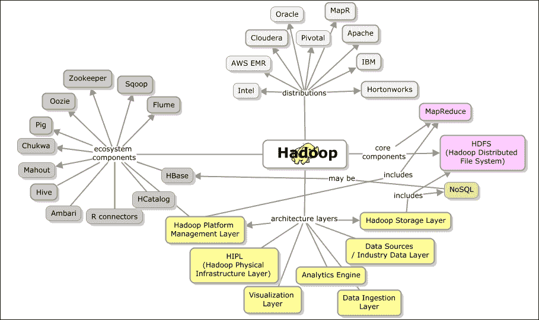<title>Machine learning solution architecture for big data (employing Hadoop)</title>

# 面向大数据的机器学习解决方案架构(采用 Hadoop)

在本节中，让我们来看一下考虑到大数据需求，实施机器学习解决方案的基本架构组件。

提议的解决方案架构应该以高效且经济的方式支持各种数据源的使用。下图总结了可能成为机器学习解决方案技术堆栈一部分的核心架构组件。框架的选择既可以是开源的，也可以是打包的许可选项。在本书的上下文中，我们考虑了 Hadoop 及其生态系统组件的最新版本的开源(Apache)发行版。

### 注意

特定于供应商的框架和扩展超出了本章的范围。

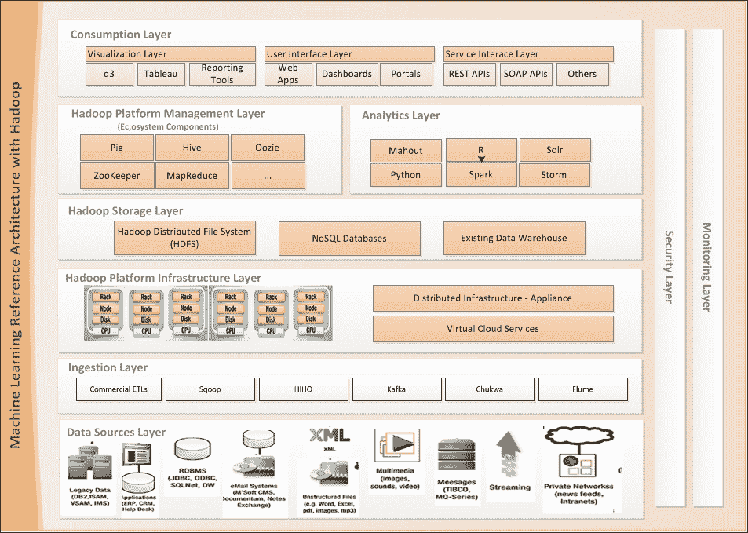

在接下来的章节中，我们将详细讨论这些参考架构的每一层以及每一层中所需的框架。

## 数据源层

数据源层构成了机器学习参考架构的关键部分。有许多内部和外部的数据输入，形成了解决机器学习问题的输入。这些提要实际上可以是结构化的、非结构化的或半结构化的。此外，在实时、批处理或接近实时的模式下，它们需要针对分析引擎和可视化工具进行无缝集成和整合。

在将这些数据输入系统进行进一步处理之前，必须去除数据中的无关信息或噪声。可以应用一些独特的技术来清理和过滤数据。

这些整合的数据集在大数据和数据聚合环境中也称为数据湖。Hadoop 是数据湖的存储选择之一。

下图显示了构成主要输入源的各种数据源。

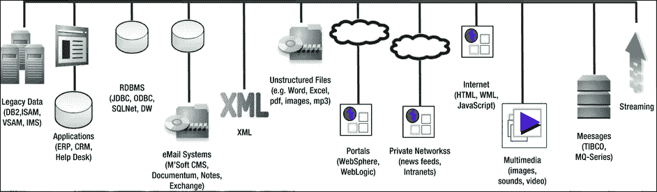

数据架构总是被设计成支持一些协议，比如 JMS、HTTP、XML 等等。然而，现在，大数据领域的最新进展带来了重大变化。所以现在，新时代的数据源包括来自社交网站的数据流、GPS 数据、机器生成的数据(如用户访问日志)和其他专有数据格式。

## 摄食层

数据摄取层负责将来自多个数据源的数据引入系统，主要职责是确保数据质量。这一层具有过滤、转换、集成和验证数据的能力。实现这一层的技术选择应该能够支持大量数据和其他数据特征，这一点很重要。以下元模型显示了摄取层功能的组成和流程。摄取层可能是架构中(**提取、转换和加载**)功能的简称 **ETL** 。

下面列出了摄取层的一组基本要求:

*   以任何方式高速转换来自任何源系统的数据
*   在最短的时间内处理大量记录
*   以语义丰富的格式生成输出，以便任何目标系统都可以查询 **智能数据**

摄取层的架构框架需要提供以下能力:即将推出的模型描绘了各种层和组成:

*   适配器框架——任何产品组或应用程序都应该能够使用适配器框架来快速、可靠地以编程方式开发不同数据源(文件、CSV 格式和 DB)的连接器
*   高速并行转换执行引擎
*   作业执行框架
*   语义化输出生成器框架

摄取层将相关的数据加载到存储层，在我们当前的上下文中，存储层是 Hadoop 存储层，主要是基于文件的存储层。

下面的概念图列出了摄取核心模式(这些模式解决了机器学习架构的性能和可伸缩性需求):

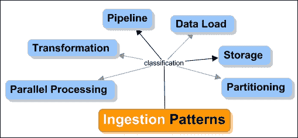

*   **并行处理和分区模式**:处理大容量摄取需求的的基本架构是并行执行。对不同的输入数据并行运行转换，并将单个大容量输入划分为较小的批处理以进行并行处理，有助于实现并行化。
*   **管道设计模式**:当为摄取作业设计工作流时，有一些特定的问题需要解决，比如避免支持并行处理的大型顺序管道。同样，从数据可靠性的角度来看，创建适当的审计和执行日志对于管理整个摄取执行非常重要。
*   **变换模式**:变换有不同的类别。转换设计的一个主要方面是处理依赖性。第一类中提到的模式(并行化)也处理依赖性需求。其他问题涉及对过去和历史数据的依赖性，这在处理额外负载时尤其重要。
*   **存储设计**:当将数据加载到目标数据存储时，会出现一些问题，例如从失败的转换中恢复或者为特定的提要重新加载数据(例如，当应该有固定的转换规则时)。
*   **数据加载模式**:数据接收中最大的性能瓶颈之一是将数据加载到目标数据集市的速度。特别是当目标是一个 RDBMS 时，并行化策略会在加载数据时导致并发问题，从而限制了可能的接收吞吐量。这些模式展示了在加载数据时如何实现数据加载并解决性能和并发性问题的某些技术。

## Hadoop 存储层

Machine learning 架构有一个分布式存储层，支持对大数据运行分析或繁重计算的并行处理。使用分布式存储和并行处理大量数据是企业处理大数据方式的根本变化。

典型的分布式存储通过并行处理算法来促进高性能，这些算法在具有容错、可靠性和并行处理能力的 Pb 级数据上运行。

在当前的 Hadoop 架构背景下， **Hadoop 分布式文件系统** ( **HDFS** )是核心存储机制。在本节中，让我们简要了解一下 HDFS 和 NoSQL(不仅仅是 SQL)存储选项。下面几节将更详细地介绍 HDFS 及其建筑。

HDFS 是核心组件之一，充当 Hadoop 的数据库。它是一个分布式文件系统，跨节点集群存储大规模数据。它带有一个框架来确保数据的可靠性和容错性。应用程序可以根据文件的大小存储文件的一部分或全部，这有助于一次写入多次读取。

由于 HDFS 是一个文件系统，访问数据进行消费或操作并不简单，需要一些复杂的文件操作程序。另一种简化数据管理的方法是使用称为 NoSQL 存储的非关系存储。

以下模型代表各种 NoSQL 数据存储类别，每个类别都有示例。每个数据存储类别都满足特定的业务需求，了解 NoSQL 存储中每个类别的用途以针对给定的需求做出正确的选择非常重要。每个 NoSQL 商店都在不同程度上满足 CAP 定理(代表一致性、可用性和分区容差)属性，从而支持优化的存储系统，这些存储系统有望为这些属性的组合而工作。实际上，这些 NoSQL 存储可能必须与关系存储共存，因为它们需要一个记录系统来根据需要进行同步，或者更好的情况是我们需要使用关系和非关系数据的组合。

下图描述了 NoSQL 数据库的类型以及市场上的一些产品:

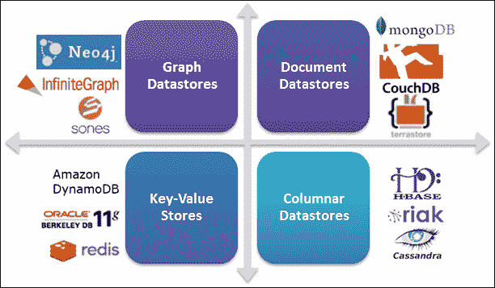

Hadoop 最初是用于批处理的，其中数据以批处理或预定的方式加载到 HDFS。通常，存储层有批量加载的数据。有助于数据加载或摄取到 HDFS 的一些核心和生态系统组件是 Sqoop、**【Hadoop-in Hadoop-out】MapReduce 函数和 ETL 函数等。**

## **Hadoop(物理)基础设施层-支持设备**

**传统架构和大数据(用于机器学习)架构之间的差异在于底层基础设施的重要性。性能、可伸缩性、可靠性、容错性、高可用性和灾难恢复是该体系结构需要支持的一些重要的质量属性。平台的底层基础设施处理这些需求。**

**Hadoop 基础架构是一种分布式架构或模型，其中数据不是存储在一个地方，而是分布在多个节点或一个节点群集中。数据分发策略可以是智能的(如 Greenplum 的情况)，也可以是简单的数学策略(如 Hadoop 的情况)。分布式文件系统节点通过网络链接。这被称为 **无共享架构** ( **SNA** )，大数据解决方案在此参考架构上工作。随着数据跨多个节点分布，流程在数据节点本地运行。**

**这是第一次被引用在 http://db.cs.berkeley.edu/papers/hpts85-nothing.pdf 的迈克尔·斯通布雷克的论文中。**

**存储了数据的节点被称为数据节点，处理发生的节点被称为计算节点。数据和计算节点可以并置或分离。下图显示了数据和计算节点并置的 SNA 上下文:**

**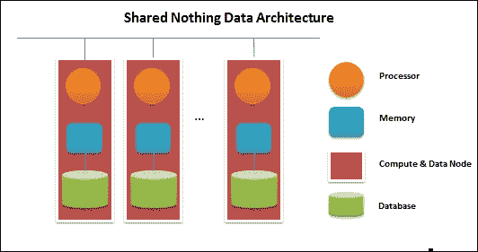**

**共享 nothing 数据架构支持并行处理。冗余是默认的期望，因为它处理来自不同来源的各种数据。**

**Hadoop 和 HDFS 通过网格基础设施连接，通过快速千兆网络或虚拟云基础设施，形成支持大规模机器学习架构的基础设施层。**

**下图说明了使用商用服务器的大数据基础架构设置:**

**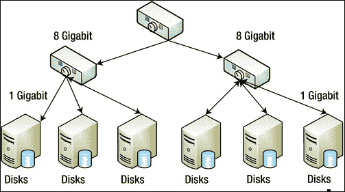**

## **Hadoop 平台/处理层**

**Hadoop 的平台或处理层是机器学习架构工具的核心数据处理层。这一层便于查询或访问存储在 Hadoop 存储层(通常使用 HDFS 存储文件系统的 NoSQL 数据库)中的数据，位于 Hadoop 基础架构层的顶部。**

**正如在[第 2 章](ch02.html "Chapter 2. Machine learning and Large-scale datasets")、*机器学习和大规模数据集*中了解到的，计算领域的技术进步现在有助于处理大量的分布式计算和并行处理。**

**Hadoop 的 MapReduce 框架有助于高效、经济地存储和分析大量数据。**

**接下来列出了 Hadoop 平台或处理层的关键组件；这些组件是生态系统的一部分，将在本章接下来的章节中详细讨论:**

*   **MapReduce : MapReduce 是一种编程范式，用于在大量数据上高效地执行一个函数，通常是在批处理模式下。 *map* 函数负责在多个系统之间分配任务，平均分配负载，并并行管理处理。后期处理； *reduce* 函数吸收并组合元素以提供结果。在 Hadoop 的原生 MapReduce 架构、MapReduce v2 和 YARN 上的逐步实现在 *Hadoop 生态系统组件*一节中介绍。**
*   ****Hive** : Hive 是 Hadoop 的数据仓库框架，负责用类似 SQL 的函数聚合大量数据。Hive 提供了一种高效的存储数据的方式，可以最大限度地利用资源。Hive 的配置和实现方面将在 *Hadoop 生态系统组件*一节中介绍。**
*   ****Pig** : Pig 是一种简单的脚本语言，便于查询和操作 HDFS 上保存的数据。它在内部以 MapReduce 范式运行函数，通常被认为是简化了 MapReduce 函数的构建。在 *Hadoop 生态系统组件*一节中，详细介绍了配置、学习语法和构建基本功能的分步指南。**
*   ****Sqoop** : Sqoop 是一个用于 Hadoop 的数据导入工具，它内置了将数据从特定的表、列或完整的数据库导入到文件系统的功能。后处理，Sqoop 支持从几个关系数据库和 NoSQL 数据存储中提取数据。**
*   **HBase : HBase 是一个符合 Hadoop 的 NoSQL 数据存储(一个柱状 NoSQL 数据存储)，它使用 HDFS 作为底层文件系统。它支持分布式存储和自动线性扩展。**
*   **ZooKeeper : ZooKeeper 是一个监控和协调服务，帮助检查 Hadoop 实例和节点。它负责保持基础设施的同步，保护分布式系统免受部分故障的影响，并确保数据的一致性。ZooKeeper 框架可以独立工作，也可以在 Hadoop 之外工作。**

**这些生态系统组件的更多内容将在以下章节中深入讨论。**

## **分析层**

**更多的时候，企业拥有一些真正的**商业智能** ( **BI** ) 工具，这些工具负责运行一些分析查询并生成一些 MIS 报告或仪表板。需要现代机器学习或分析工具和框架与之共存。现在需要在数据仓库或大数据存储上以传统方式运行分析，以便处理结构化、半结构化和非结构化数据。**

**在这种情况下，我们可以预期传统数据存储和使用 Sqoop 等工具的大数据存储之间的数据流。**

**NoSQL 商店以低延迟著称；它们有助于实时分析。许多开源分析框架简化了构建模型，并使用简单的现成功能运行复杂的统计和数学算法。现在所需要的是理解每种算法的相关性，以及在给定特定问题的情况下选择合适的算法或方法的能力。**

**让我们在接下来的章节里看看下面列出的开源分析和机器学习框架。**

*   **稀有**
*   **阿帕奇看象人**
*   **Python (scikit-learn 发行版)**
*   **朱莉娅**
*   **阿帕奇火花**

**对即将到来的 Spring 项目之一的介绍被称为 **Spring XD** ，因为它看起来像一个可以在 Hadoop 上运行的全面的机器学习解决方案。**

## **消费层**

**从分析层生成的洞察或数据处理的结果被最终客户以多种方式消费。这些数据可用于消费的一些方式有:**

*   **服务 API(例如，Web 服务接口(基于 SOAP 或 REST))**
*   **网络应用**
*   **报告引擎和数据集市**
*   **仪表板和可视化工具**

**在所有选项中，**可视化** 是核心，不仅是分发或交流机器学习结果的重要方式，也是以有助于决策的方式表示数据的好方法。非常明显，数据可视化正在大数据和分析领域获得牵引力。最能代表数据和潜在模式和关系的可视化是决策的关键。**

****

**有两种类型的可视化；一个是解释数据的，第二个是探索数据和底层模式的。可视化现在被视为一种新的交流语言。**

### **用可视化来解释和探索数据**

**用于解释和探索数据的可视化是独特的，并且用于不同的目的。**

**解释的形象化是我们在营销和销售演示中看到的典型形象。这是手上的数据最大程度干净的情况。数据的意义很明确，沟通是由最终决策者来完成的。**

**另一方面，用于探索的可视化有助于纠正数据并链接数据的相关和有用属性，以便理解数据本身。探索的可视化有时可能不准确。探索通常以迭代的方式进行，在从手头的数据中获得某种意义之前，可能需要对可视化进行几轮细化。需要去除数据中的一些无关属性，甚至是数据本身(被识别为*噪声*的那个)。使用可视化进行数据探索的这一步骤有时会取代运行复杂的算法，并且通常需要统计敏锐度。**

**市场上一些流行的可视化工具(开源的和商业的)是 Highcharts JS、D3、Tableau 等等。尽管我们使用了其中的一些框架来演示如何描述和交流见解，但是我们并没有明确地深入讨论任何可视化选项。**

**另一个重要的方面是，这些可视化工具通常需要利用传统的数据仓库工具和大数据分析工具。下图描述了建议的机器学习架构如何支持现有数据仓库或 BI 工具与大数据分析工具共存。正如在[第 1 章](ch01.html "Chapter 1. Introduction to Machine learning")、*机器学习简介*中所解释的，聚合数据和数据湖成为运行机器学习工具的任何大数据分析工具的核心输入。新时代的数据存储口号是语义数据结构。关于语义数据架构的更多信息，请参见第 14 章、*机器学习的新一代数据架构*中的新兴数据架构部分。下图描述了数据湖和数据仓库环境中可视化的高级视图:**

**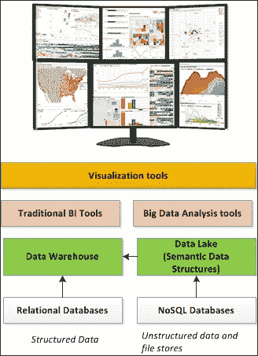**

### **安全与监控层**

**当跨各种来源处理和整合大量数据时，安全性变得至关重要，对于敏感数据，保护数据隐私的需求至关重要，有时也是关键的合规性要求。所需的认证和授权检查需要作为执行机器学习算法的一部分来实现。在机器学习架构中，这更多的是一个先决条件，而不是事后的想法。**

**鉴于控制数据访问的重要性，数据接收和处理功能是需要严格安全实现的主要领域。**

**由于分布式架构的优势，大数据应用天生容易出现安全漏洞；有必要注意安全实现，并且它不会影响性能、可伸缩性或这些应用程序易于执行和维护的功能。**

**机器学习架构本身应支持以下基本安全需求:**

*   **支持 Kerberos 等标准协议，对群集中的每个节点进行身份验证**
*   **因为它是一个文件系统，所以需要最低限度的加密支持**
*   **与节点的通信应该总是使用 **SSL** ( **安全套接字层**)、TLS 或其他包含 NameNode 的协议**
*   **安全密钥和令牌以及标准密钥管理系统的使用**
*   **实现分布式日志跟踪，以便轻松跟踪跨层的任何问题**

**下一个重要需求是监控。分布式数据体系结构带有强大的监控和支持工具，可以处理以联合模型连接的大型节点集群。**

**应用程序的停机时间总是有 SLA，恢复机制在确保应用程序可用性的同时遵守这些 SLA 是很重要的。**

**这些节点和集群以独立于机器的方式与监控系统通信是很重要的，使用类似 XML 的格式是关键。监控系统的数据存储需求不应影响应用程序的整体性能。**

**通常，每个大数据堆栈都带有内置的监控框架或工具。此外，还有 Ganglia 和 Nagios 等开源工具，可以集成并用于监控大数据应用程序。**

### **Hadoop 核心组件框架**

**Apache Hadoop 有两个核心组件:**

*   **Hadoop 分布式文件系统也称为 HDFS**
*   **MapReduce(在 Hadoop 的 2.x 版本中，这被称为 YARN)**

**Hadoop 的其余组件在机器学习解决方案架构中有所体现。使用 Hadoop，我们围绕这两个核心组件开展工作，并形成 Hadoop 的生态系统组件。**

**本章的重点是 Apache Hadoop 2.x 发行版。在这个版本中，HDFS 和 MapReduce 的架构有一些变化。我们首先介绍核心架构，然后介绍作为 2.x 架构一部分的变化。**

#### **Hadoop 分布式文件系统(HDFS)**

****HDFS** 是受 **GFS** ( **谷歌文件系统**)启发而打造。它是一个可弹性伸缩的分布式文件系统，支持负载平衡和容错以确保高可用性。它内置了数据冗余，以证明数据的可靠性和一致性。**

****

**HDFS 实现了主从架构。这里，主节点称为 NameNode，从节点称为 DataNodes。NameNode 是所有客户端应用程序的入口点，数据通过 NameNode 在 DataNodes 之间分发。实际数据不通过 NameNode 服务器传递，以确保 NameNode 不会成为任何数据分发的瓶颈。只有元数据与客户端通信，实际的数据移动直接在客户端和 DataNodes 之间进行。**

**在 Hadoop 架构中，NameNode 和 DataNode 都被称为守护进程。NameNode 需要一台高端计算机，并且应该只运行 NameNode 守护进程。以下几点证明了 NameNode 需要高端机器的理由:**

*   **整个集群的元数据保存在内存中以便更快地访问，并且需要更多的内存**
*   **NameNode 是 Hadoop 集群的单一入口点和故障点**
*   **NameNode 与数百或数千个 DataNodes 协调，并管理批处理作业**

**HDFS 是建立在传统的层次文件系统之上的，其中创建新目录、添加新文件、删除目录或子目录、删除文件、重命名以及移动或更新文件是常见的任务。每个 DataNodes 中创建和存储的目录、文件、数据节点和数据块的详细信息作为元数据存储在 NameNode 中。**

**在这个体系结构中，Namenode 与之通信的还有另一个节点，称为辅助 NameNode。辅助 NameNode 不是 Namenode 的备份，因此不会故障切换到辅助 Namenode。相反，它用于存储来自 NameNode 的元数据和日志文件的副本。NameNode 将数据块的元数据和相关的分布细节保存在一个名为`fsimage`的文件中。该映像文件不是针对文件系统中的每个数据操作而更新的，而是通过将它们记录在单独的日志文件中来定期跟踪。这确保了更快的 I/O，从而提高了数据导入或导出操作的效率。**

**二级 Namenode 在这方面有特定的功能。它定期下载映像和日志文件，并通过将日志文件中的当前操作附加到 fsimage 来创建新映像，然后将新映像文件上载回 NameNode。这消除了 NameNode 上的任何开销。NameNode 上的任何重启都非常快，并且系统的效率得到了保证。下图描述了客户端应用程序和 HDFS 之间的通信工作流:**

**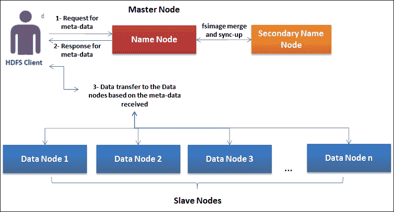**

**HDFS 是为在数据节点之间读写大量数据而构建的。这些大文件被分割成较小文件的块，通常具有固定的大小，如 64 MB 或 128 MB，这些块分布在多个数据节点上。对于这些块中的每一个，总共存储三个副本，以确保冗余并支持容错。可以改变份数，这是系统的配置。关于 HDFS 架构和具体功能的更多信息将在下一节介绍。**

##### **辅助 Namenode 和检查点流程**

**在定义辅助 NameNode 的目的和功能时，我们已经了解了一个重要的功能，它负责更新或准备存储在名为`fsimage`的文件中的 Namenode 的元数据。这个通过合并现有的 fsimage 和日志文件生成新的 fsimage 的过程称为 **检查点**。下图描述了检查点流程:**

**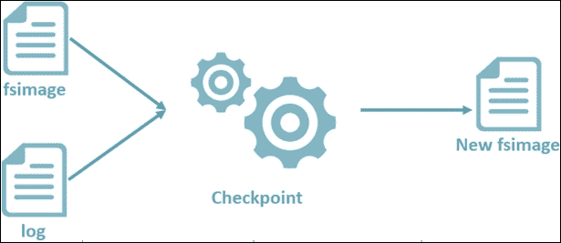**

**一些配置更改将在与检查点流程相关的`cross-site.XML`文件中完成。**

| 

财产

 | 

目的

 |
| --- | --- |
| `dfs.namenode.checkpoint.dir` | 这是保存临时 fsimage 文件以运行合并过程的目录路径。 |
| `dfs.namenode.checkpoint.edits.dir` | 这是保存临时编辑以运行合并过程的目录路径。该参数的默认值与`dfs.namenode.checkpoint.dir`相同 |
| `dfs.namenode.checkpoint.period` | 两次检查点运行之间的时间间隔(秒)。 |
| `dfs.namenode.checkpoint.txns` | 不管时间间隔配置如何，该属性定义了在多少个事务之后需要触发检查点进程。 |
| `dfs.namenode.checkpoint.check.period` | 此属性定义轮询 NameNode 以检查未设置检查点的事务的频率(秒)。 |
| `dfs.namenode.checkpoint.max-retries` | 在失败的情况下，辅助 Namenode 重试是检查点操作。此属性定义了辅助 Namenode 在放弃之前重试检查点操作的次数。 |
| `dfs.namenode.num.checkpoints.retained` | 此属性表示由 Namenode 和辅助 NameNode 保留的检查点文件的数量。 |

**检查点流程可以由 Namenode 和二级 NameNode 触发。辅助 Namenode 还负责定期备份`fsimage`文件，这将进一步帮助恢复。**

##### **拆分大型数据文件**

**HDFS 在分布于集群中的数据节点上存储大文件的较小块。在存储文件之前，HDFS 在内部将整个文件内容拆分为多个固定大小(默认为 64 MB)的数据块。这个大小是可配置的。没有遵循特定的业务逻辑来拆分文件和构建数据块；这完全是由文件大小决定的。然后，这些数据块存储在 DataNodes 上，以便并行进行数据读取和写入。每个数据块本身也是本地文件系统中的一个文件。**

**下图描述了如何将一个大文件拆分成较小的块或固定大小的块:**

**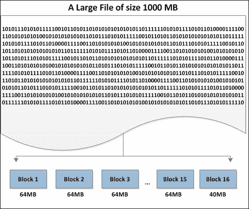**

**每个块的大小可以通过`hdfs-site.xml`中的以下配置参数来控制。集群范围的块大小由`hdfs-site.XML`中的`dfs.blocksize configuration`属性控制，在 Hadoop 1.0 中的默认值是 64 MB，在 Hadoop 2.x 中是 128 MB。数据块大小由基础架构的效率决定，随着传输速度的提高和新一代驱动器的使用，数据块大小会变得更大:**

| 

财产

 | 

目的

 |
| --- | --- |
| `dfs.blocksize` | 值是 134217728。以字节为单位的前一个值表示 128 MB，或者可以定义以 measure 为后缀的任何值。比如 512m，1g，128k 等等。 |

**对块大小中的值的任何更新都不会应用于现有块；只有新块是合格的。**

##### **块加载到集群和复制**

**文件拆分后，数据块由固定的数据块大小组成，并针对环境进行配置。**

**由于分布式体系结构，非常需要存储数据块的副本来处理数据可靠性。默认情况下，每个数据块存储三份副本。副本配置属性的数量称为复制因子。下表列出了与数据加载和复制相关的所有配置:**

| 

财产

 | 

目的

 |
| --- | --- |
| `dfs.replication` | 该值为 3。这定义了需要存储在每个块中的副本数量。 |
| `dfs.replication.max` | 最大块复制。 |
| `dfs.namenode.replication.min` | 最小块复制。 |

**NameNode 负责确保按照配置完成数据块放置和复制。将这些数据块放到 DataNode 上后，集群中的每个 DataNode 都会定期向 NameNode 发送数据块状态。NameNode 接收到来自 DataNode 的信号这一事实意味着 DataNode 是活动的并且运行正常。**

**HDFS 使用**默认块放置策略** ，旨在实现可用节点间的负载平衡。以下是本政策的范围:**

*   **首先，拷贝或副本被写入正在创建文件的 DataNode 这有助于更高的写入性能**
*   **第二，拷贝或副本从同一机架写入另一个 DataNode 这最大限度地减少了网络流量**
*   **第三，将副本写入不同机架中的 DataNode 这样，即使交换机出现故障，仍有一份数据块拷贝可用**

**应用默认的块放置策略，该策略使用机架上的所有节点，而不会影响性能、数据可靠性和可用性。下图描述了如何使用两个额外副本的复制策略将三个数据块放置在四个节点上。其中一些节点位于机架中，以实现最佳容错。**

**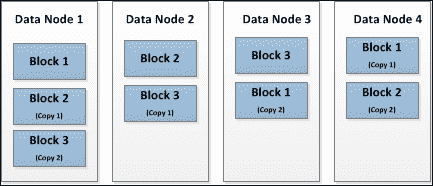**

**总的来说，加载数据到 HDFS 的流程如下图所示:**

**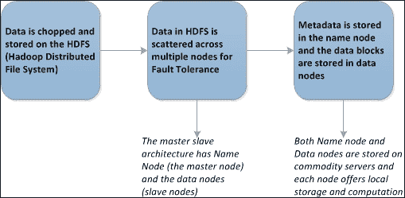**

### **给 HDFS 写信和从他那里阅读**

**在将文件写入 HDFS 时，客户端首先联系 NameNode，然后将需要写入 HDFS 的文件的详细信息传递给。NameNode 提供了有关复制配置的详细信息，以及指定数据块放置位置的其他元数据详细信息。下图解释了这个流程:**

**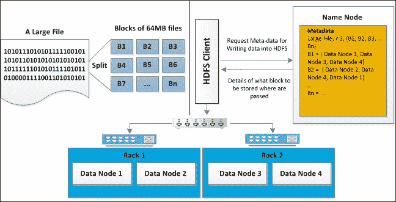**

### **处理故障**

**当 Hadoop 集群启动时，NameNode 进入安全模式状态，并从所有数据节点接收心跳信号。NameNode 收到来自 DataNodes 的阻塞报告这一事实表明 DataNodes 已启动并正常工作。**

**现在假设**数据节点 4** 下降；这意味着**名称节点**没有从**数据节点 4** 接收到任何心跳信号。**名称节点**登记**名称节点**的不可用性，因此，无论**数据节点 4** 做什么，都被负载平衡到具有副本的其他节点。然后由**名称节点**在元数据寄存器中更新该数据。下图说明了同样的情况:**

**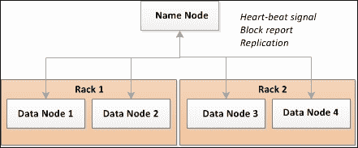**

### **HDFS 命令行**

**HDFS 有一个命令行接口叫做 **FS Shell** 。这有助于使用 shell 命令来管理 HDFS。以下截图显示了`Hadoop fs`命令及其用法/语法:**

**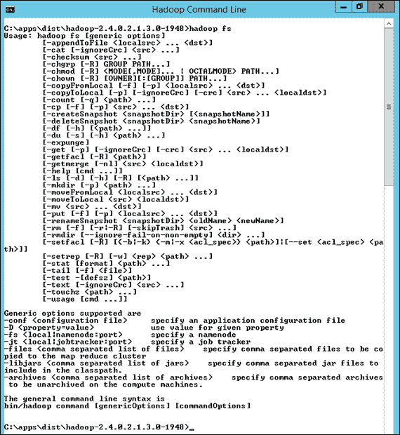**

### **宁静的 HDFS**

**让外部的应用程序，尤其是 web 应用程序或类似的应用程序，能够通过 HTTP 轻松访问 HDFS 中的数据。HDFS 支持一个名为 WebHDFS 的附加协议，该协议基于 RESTful 标准，便于通过 HTTP 访问 HDFS 数据，不需要任何 Java 绑定或完整的 Hadoop 环境。客户端可以使用 curl/wget 等常用工具来访问 HDFS。在提供对存储在 HDFS 的数据的基于 web 服务的访问的同时，WebHDFS(该平台的内置安全性和并行处理能力)得到了很好的保留。**

**要启用 WebHDFS，请在`hdfs-site.xml`中进行以下配置更改:**

```
<property>
          <name>dfs.webhdfs.enabled</name>
          <value>true</value>
</property>
```

**关于 WebHDFS REST API 的更多细节可以在[http://Hadoop . Apache . org/docs/current/Hadoop-project-dist/Hadoop-HDFS/web HDFS . html](http://hadoop.apache.org/docs/current/hadoop-project-dist/hadoop-hdfs/WebHDFS.html)找到。**

## **MapReduce**

**MapReduce 类似于 HDFS。Hadoop MapReduce 框架是受 Google 的 MapReduce 框架启发而构建的。它是一个分布式计算框架，有助于跨集群并行处理大量数据，并具有内置的容错机制。它致力于操作和处理本地数据范例，其中处理逻辑被移动到数据，而不是数据被移动到处理逻辑。**

****

### **MapReduce 架构**

**MapReduce 框架也是基于主从架构的。主作业称为 JobTracker，从作业称为 TaskTrackers。与 NameNode 和 datanode 不同，它们不是物理节点，而是负责跨 datanode 运行处理逻辑的守护进程处理器:**

*   ****job tracker**:job tracker调度由多个任务组成的作业的执行。它负责运行任务跟踪器上的任务或作业，同时监控处理状态。在任何失败的情况下，它负责在任务跟踪器上重新运行失败的任务。**
*   ****TaskTracker**:TaskTracker执行 JobTracker 安排的任务，并不断与 JobTracker 通信，协同工作。**

**现在，让我们将 HDFS 和 MapReduce 上的主从架构进行类比。NameNode 运行 JobTracker，DataNodes 运行 TaskTrackers。**

**在典型的多节点群集中，NameNode 和 DataNode 是独立的物理节点，但是在单节点群集中，NameNode 和 DataNode 在基础结构方面是相同的，JobTracker 和 TaskTracker 功能在同一个节点上运行。开发环境中使用单节点集群。**

**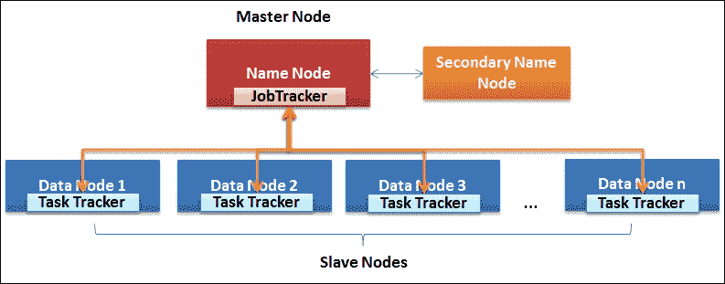**

**在一个 MapReduce 进程中有两个函数——`Map`和`Reduce`。**

*   ****Mapper** : Mapper 作业将文件并行拆分成多个块，并运行一些基本功能，如排序、过滤，以及其他任何需要的特定业务或分析功能。映射器函数的输出被输入到缩减器函数。**
*   ****Reducer** : Reducer 作业用于合并跨映射器的结果，另外还用于根据需要执行任何业务或分析功能。映射器和缩减器作业的中间输出作为键值对存储在文件系统中。map 和 reduce 作业的输入和输出都存储在 HDFS。总的来说，MapReduce 框架负责调度任务、监控状态和处理故障(如果有的话)。下图描述了`Map`和`Reduce`函数如何对保存在 HDFS 的数据进行操作: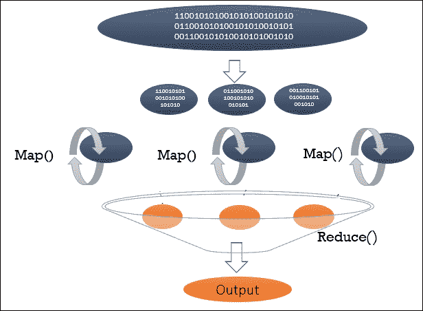**

### **是什么让 MapReduce 迎合了大数据集的需求？**

**MapReduce 编程框架的一些优点列举如下:**

*   ****并行执行**:默认情况下，MapReduce 程序可以在一个集群节点上并行执行。开发团队不需要关注分布式计算的内部，可以直接使用框架。**
*   ****容错** : MapReduce 框架工作在主从架构上，在任何节点出现故障的情况下，框架都会自动采取纠正措施。**
*   ****可伸缩性** : MapReduce 框架，具有分布式工作的能力和向外扩展的能力(水平可伸缩性)，随着容量的增加，新节点可以在任何需要的时候添加到集群中。**
*   ****数据局部性**:MapReduce 框架的核心前提之一是将程序带到数据中，这与将数据带到代码中的传统方式相反。所以准确地说，MapReduce 总是有本地数据，这是性能的最重要的原因之一。**

### **MapReduce 执行流程和组件**

**在这一节中，我们将深入探究 MapReduce 的执行流程以及每个组件是如何工作的:**

1.  **客户机向 JobTracker(一个 MapReduce 作业)提交一个新作业，同时提交的还有输入和输出文件路径以及所需的配置。作业排队等待执行，并由作业调度程序挑选。**
2.  **JobTracker 在上下文中所需数据所在的位置获取数据，并创建一个执行计划来触发 TaskTrackers 执行。**
3.  **JobTracker 将作业提交给已识别的 TaskTrackers。**
4.  **TaskTrackers 使用本地数据执行任务。如果数据在本地数据节点上不可用，它将与其他数据节点通信。**
5.  **TaskTrackers 通过心跳信号向 JobTracker 报告状态。JobTracker 能够固有地处理任何故障情况。**
6.  **最后，JobTracker 在作业完成时向作业客户机报告输出。**

**下图描述了刚才描述的步骤。该流程有两个部分:分别带有节点和跟踪器的 HDFS 和 MapReduce。**

**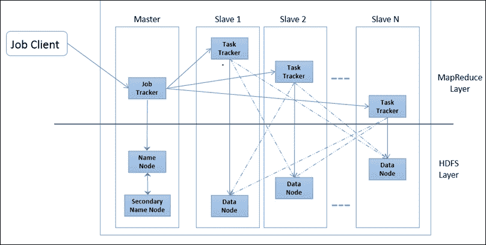**

**让我们关注 MapReduce 程序的一些核心组件，并学习如何编写代码。下面的流程图详细说明了流程如何从输入数据开始到输出数据，以及 MapReduce 框架的每个组件或功能如何开始执行。红色虚线框中的块是组件，蓝色方框表示正在流程中转换的数据。**

**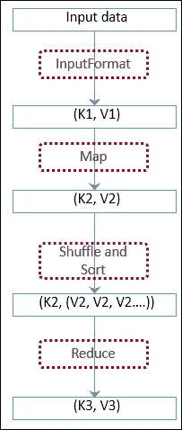**

### **开发 MapReduce 组件**

**Hadoop 的 MapReduce 框架由一组 Java APIs 组成，需要扩展或实现这些 API，以整合旨在通过 Hadoop 集群并行执行的特定功能。下面是一些需要完成的 API 实现:**

*   **输入和输出数据格式接口**
*   **映射器实现**
*   **减速器实施**
*   **瓜分者ˌ分割者**
*   **组合器**
*   **驾驶员**
*   **语境**

#### **输入格式**

**`InputFormat`类负责从文件中读取数据，并将其作为`map`函数的输入。这个过程执行两个核心功能:一个是将输入数据拆分成称为 InputSplits 的逻辑片段，第二个是将这些拆分作为键值对读取，以提供给`map`函数。有两种不同的界面来执行这两种功能:**

*   **输入拆分**
*   **记录阅读器**

**输入文件的分割不是一个必要的功能。如果我们需要考虑一个完整的文件进行处理，我们将需要覆盖`isSplittable()`函数并将标志设置为`false`。**

#### **输出格式**

**`OutputFormat` API 负责验证 Hadoop 具有符合作业输出规范的输出数据格式。RecordWriter 实现负责将最终的输出键值对写入文件系统。每个 InputFormat API 都有一个对应的 OutputFormat API。下表列出了 MapReduce 框架的一些输入和输出格式 API:**

| 

输入格式 API

 | 

相应的输出格式 API

 |
| --- | --- |
| `TextInputFormat` | `TextOutputFormat` |
| `SequenceFileInputFormat` | `SequenceFileOutputFormat` |
| `DBInputFormat` | `DBOutputFormat` |

#### **映射器实现**

**所有的映射器实现都需要扩展`Mapper<KeyIn, ValueIn, KeyOut, ValueOut>`基类，重要的是覆盖`map()`方法来实现特定的业务功能。Mapper 实现类将键值对作为输入，并返回一组键值对作为输出。任何其他中间输出随后由混洗和排序功能获取。**

**对于给定的 MapReduce 作业，由 InputFormat 生成的每个 InputSplit 都有一个 Mapper 实例。**

**总的来说，映射器实现类需要从基类扩展四个方法。下面简要介绍了这些方法，以及每种方法的用途:**

| 

方法名称和语法

 | 

目的

 |
| --- | --- |
| `setup(Context)` | 这是启动映射器执行时回调的第一个方法。除非需要完成任何特定的初始化或者需要完成任何特定的配置设置，否则不强制重写此方法。 |
| `map(Object, Object, Context)` | 覆盖此方法是映射器实现的关键，因为此方法将作为执行映射器逻辑的一部分被调用。它接受键值对作为输入，响应可以是键值对的集合 |
| `clean (Context)` | 此方法在生命周期中映射器函数执行结束时调用，有助于清除映射器使用的任何资源。 |
| `run (Context)` | 重写此方法提供了运行多线程映射器的附加功能。 |

**让我们从一个给定的文件中取一个例子；我们想知道一个单词重复了多少次。在这种情况下，使用`TextInputFormat`。事实上，这是默认的 InputFormat。下图显示了 InputSplit 函数的作用。它拆分每一行并构建一个键值对。**

**该图显示了文本如何存储在 DataNode 上的多个块中。`TextInputFormat`然后读取这些块和多个 input split(我们可以看到有两个 input split，因此有两个 mappers)。每个映射器选择一个 InputSplit，然后为后面跟数字 1 的单词的每次出现生成一个键值对。**

**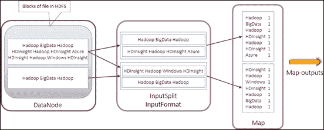**

**mapper 函数的输出在处理结束时被写入磁盘，并且没有任何中间结果被写入文件系统。它们被保存在记忆中。这有助于优化性能。这是可能的，因为键空间是分区的，每个映射器只获得整个数据集的一部分。现在，就应该为此目的分配多少内存而言，默认情况下分配 100 MB，对于该值的任何更改，都必须设置`io.sort.mb`属性。通常会设置一个阈值来限制这个值，如果超过这个值，就会有一个后台进程开始向磁盘写入数据。下面的程序片段演示了如何实现一个映射器类。**

```
public static class VowelMapper extends Mapper<Object, Text, Text, IntWritable>
{
private final static IntWritable one = new IntWritable(1);
private Text word = new Text();
public void map(Object key, Text value, Context context) throws IOException, InterruptedException
{
StringTokenizer itr = new StringTokenizer(value.toString());
while (itr.hasMoreTokens())
{
word.set(itr.nextToken());
context.write(word, one);
}
}
}
```

**<title>Hadoop 2.x</title>

# Hadoop 2.x

在 Hadoop 2.x 之前，所有的发行版都专注于解决 Hadoop 1.x 中的限制，但没有偏离核心架构。Hadoop 2.x 真正改变了底层架构假设，结果是真正的突破；最重要的是，纱线的引入。YARN 是一个用于管理 Hadoop 集群的新框架，除了批处理之外，它还引入了处理实时处理需求的能力。讨论的一些重要问题如下:

*   单名称节点问题
*   集群中的节点数量急剧增加
*   Hadoop 可以成功解决的任务数量的扩展

下图描述了 Hadoop 1.x 和 2.x 架构之间的差异，以及 YARN 如何连接 MapReduce 和 HDFS:

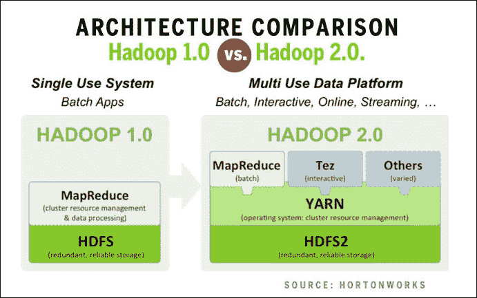

## Hadoop 生态系统组件

Hadoop 已经衍生了一堆辅助和支持框架。下图描述了开源开发团队提供的所有支持框架:

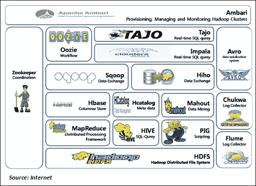

下表列出了所有的框架以及每个框架的用途。这些框架与 Hadoop 的 Apache 发行版一起工作。供应商构建了许多框架，这些框架都是商业定位的，不在本书的讨论范围之内:

| 

结构

 | 

统一资源定位器

 | 

目的(简述)

 |
| --- | --- | --- |
| **HDFS** ( **Hadoop 分布式文件系统**) | [http://Hadoop . Apache . org/docs/current/Hadoop-project-dist/Hadoop-HDFS/HDFS user guide . html](http://hadoop.apache.org/docs/current/hadoop-project-dist/hadoop-hdfs/HdfsUserGuide.html) | Hadoop 文件存储系统是 Hadoop 的核心组件，它具有内置的容错功能(有关架构和实施细节的更多详细信息，请参考 HDFS 部分)。 |
| MapReduce | [http://Hadoop . Apache . org/docs/current/Hadoop-MapReduce-client/Hadoop-MapReduce-client-core/MapReduce tutorial . html](http://hadoop.apache.org/docs/current/hadoop-mapreduce-client/hadoop-mapreduce-client-core/MapReduceTutorial.html) | MapReduce 是一种编程模型和框架，用于在分布式平台(如 Hadoop)上处理大量数据。最新版本的 Apache MapReduce 扩展了另一个框架 Apache YARN。**纱** : MapReduce 在 Hadoop 2.0 中经历了一次彻底的检修，现在被称为 MapReduce 2。但是 MapReduce 编程模型并没有改变。YARN 提供了一个新的资源管理和作业调度模型，以及执行 MapReduce 作业的实现。在大多数情况下，您现有的 MapReduce 作业无需任何更改即可运行。在某些情况下，可能需要少量的更新和重新编译。 |
| 猪 | [https://pig.apache.org/](https://pig.apache.org/) | Pig 是一个以并行方式执行数据流的框架。它带有一种脚本语言，Pig Latin，有助于开发数据流。Pig Latin 附带了一堆数据内部操作，比如连接、拆分、排序等等。Pig 在 Hadoop 上运行，同时利用 HDFS 和 MapReduce。编译后的 Pig Latin 脚本在内部并行运行它们的功能。 |
| 储备 | [https://hive.apache.org/](https://hive.apache.org/) | Hive 是一个用于 Hadoop 的数据仓库框架。它支持查询和处理分布式存储中的大数据集。可以使用一种称为 HiveQL 的类似 SQL 的查询语言，它允许插入映射器和缩减器程序。 |
| 水道 | [http://flume.apache.org/](http://flume.apache.org/) | Flume 框架更像是一个高效的传输框架，有助于聚集、分析、处理和移动大量的日志数据。它带有一个可扩展的数据模型，并支持在线分析。 |
| 丘克瓦 | [https://chukwa.apache.org/](https://chukwa.apache.org/) | Chukwa 框架带有一个 API，可以帮助轻松地收集、分析和监控重要的数据集合。Chukwa 运行在 HDFS 和 MapReduce 框架的顶端，因此继承了 Hadoop 的伸缩能力。 |
| HBase | http://hbase.apache.org/ | h base的灵感来自谷歌 BigTable。它是一个 NoSQL，柱状数据存储，旨在补充 Hadoop 平台，并支持对数据的实时操作。HBase 是一个 Hadoop 数据库，负责支持 MapReduce 作业输出。 |
| HCatalog | [https://cwiki.apache.org/confluence/display/Hive/HCatalog](https://cwiki.apache.org/confluence/display/Hive/HCatalog) | HCatalog 类似于 HDFS 数据的关系视图。底层数据存储在哪里、以何种方式或何种格式存储都无关紧要。它目前是 Hive 的一部分，目前的发行版没有单独的发行版。 |
| Avro | [http://avro.apache.org/](http://avro.apache.org/) | Apache Avro 框架更多的是一个数据接口。它支持建模、序列化、进行 **远程过程调用** ( **RPC** )。Avro 中的每个模式表示(也称为元数据定义)都位于数据附近的同一个文件中，因此文件是自描述的。 |
| HIHO | [https://github.com/sonalgoyal/hiho/wiki/About-HIHO](https://github.com/sonalgoyal/hiho/wiki/About-HIHO) | HIHO 代表 Hadoop-in Hadoop-out。这个框架有助于将多个数据存储与 Hadoop 系统连接起来，并促进互操作性。HIHO 支持多种 RDBMS 和文件系统，提供了在 RDBMS 和 HDFS 之间并行加载和卸载数据的内部功能。 |
| Sqoop | [http://sqoop.apache.org/](http://sqoop.apache.org/) | Sqoop 是一个被广泛采用的框架，用于 HDFS 和 RDBMS 之间的批量数据传输。它与 Flume 非常相似，但使用 RDBMS 操作。Sqoop 是 Hadoop 的 **ETL** ( **提取-转换-加载**)工具之一。 |
| 塔霍河 | [http://tajo.apache.org/](http://tajo.apache.org/) | Tajo 是 Apache Hadoop 的分布式数据仓库系统，本质上是关系型的。Tajo 支持特定的查询和在线集成，以及对存储在 HDFS 或其他数据存储中的大型数据集的提取-转换-加载功能。 |
| 驭象者 | 【http://oozie.apache.org/  | Oozie 是一个促进工作流管理的框架。它使用 **DAG** ( **直接无环图**)作为 MapReduce 作业的调度系统。Oozie 在调度和执行作业时既可以是数据感知的，也可以是时间感知的。 |
| 动物园管理员 | [http://zookeeper.apache.org/](http://zookeeper.apache.org/) | 顾名思义，Zookeeper 更像是为 Hadoop 提供的编排和协调服务。它为分布式应用程序提供了构建、管理和高可用性的工具。 |
| 安巴里 | [http://ambari.apache.org/](http://ambari.apache.org/) | Ambari 是一个直观的 web UI，用于使用 RESTful APIs 的 Hadoop 管理。阿帕奇安巴里是 Hortonworks 的一个贡献。它充当生态系统中许多其他 Hadoop 框架的接口。 |
| 象夫 | [http://mahout.apache.org/](http://mahout.apache.org/) | Apache Mahout 是一个开放的机器学习算法的源代码库。Mahout 的设计重点是为分布在多个系统上的大型数据集提供一个可伸缩的库。Apache Mahout 是一个从原始数据中获取有用信息的工具。 |

## Hadoop 的安装和设置

有三种不同的方式来设置 Hadoop:

*   **独立操作**:在这个操作中，Hadoop 以非分布式模式运行。所有的守护进程都在一个 Java 进程中运行，有助于简化调试。这种设置也称为单节点安装。
*   **伪分布式操作**:在这个操作中，Hadoop 被配置为在单个节点上运行，但是以伪分布式模式运行，可以在不同的 JVM 上运行不同的守护进程。
*   **全分布式操作**:在这个操作中，Hadoop 被配置为全分布式运行在多个节点上，主节点上的 NameNode、Secondary Namenode、JobTracker 等所有 Hadoop 守护进程；以及从节点中的 DataNode 和 TaskTracker(简而言之，运行在节点集群上)。

基于 Ubuntu 的 Hadoop 安装先决条件如下:

*   Java v1.7 版
*   创建专用 Hadoop 用户
*   配置 SSH 访问
*   禁用 IPv6

### 安装 Jdk 1.7

1.  使用此命令下载Java:

    ```
     wget https://edelivery.oracle.com/otn-pub/java/jdk/7u45-b18/jdk-7u45-linux-x64.tar.gz 
    ```

    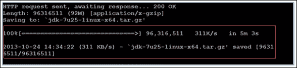
2.  使用以下代码解压二进制文件:

    ```
     sudo tar xvzf jdk-7u45-linux-x64.tar.gz 
    ```

3.  借助下面的命令创建一个安装 Java 的目录:

    ```
     mkdir -P /usr/local/Java cd /usr/local/Java 
    ```

4.  将二进制文件复制到新创建的目录:

    ```
     sudo cp -r jdk-1.7.0_45 /usr/local/java 
    ```

5.  Configure the PATH parameters:

    ```
    sudo nano /etc/profile

    ```

    否则，使用以下命令:

    ```
    sudo gedit /etc/profile

    ```

6.  在文件的最后包含以下内容:

    ```
     JAVA_HOME=/usr/local/Java/jdk1.7.0_45 PATH=$PATH:$HOME/bin:$JAVA_HOME/bin export JAVA_HOME export PATH 
    ```

7.  在 Ubuntu 中，为 Java 配置路径:

    ```
     sudo update-alternatives --install "/usr/bin/javac" "javac" "/usr/local/java/jdk1.7.0_45/bin/javac" 1 sudo update-alternatives --set javac /usr/local/Java/jdk1.7.0_45/bin/javac 
    ```

8.  检查安装完成:

    ```
     java -version 
    ```

    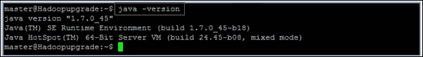

### 为 Hadoop 创建系统用户(专用)

1.  创建/添加一个新组:

    ```
     sudo addgroup hadoop 
    ```

2.  创建/添加一个新用户并将其附加到该组:

    ```
     sudo adduser –ingroup hadoop hduser 
    ```

    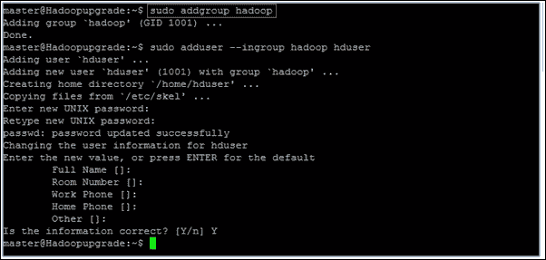
3.  创建/配置SSH 密钥访问:

    ```
     ssh-keygen -t rsa -P "" cat $HOME/.ssh/id_rsa.pub >> $HOME/.ssh/authorized_keys 
    ```

4.  验证 SSH 设置:

    ```
     ssh hduser@localhost 
    ```

### 禁用 IPv6

使用以下命令打开`sysctl.conf`:

```
sudo gedit /etc/sysctl.conf

```

### 提示

**下载示例代码**

您可以从您在[http://www.packtpub.com](http://www.packtpub.com)的账户下载您购买的所有 Packt 书籍的示例代码文件。如果你在别处购买了这本书，你可以访问 http://www.packtpub.com/support 并注册，文件会直接通过电子邮件发送给你。

在文件末尾添加以下行。重新启动机器以正确更新配置:

```
#disable ipv6
net.ipv6.conf.all.disable_ipv6 = 1
net.ipv6.conf.default.disable_ipv6 = 1
net.ipv6.conf.lo.disable_ipv6 = 1

```

### 安装 Hadoop 2.6.0 的步骤

1.  用这个下载Hadoop 2 . 6 . 0:

    ```
     wget  http://apache.claz.org/hadoop/common/hadoop-2.6.0/hadoop-2.6.0.tar.gz 
    ```

2.  使用以下命令解压压缩的 Hadoop 文件:

    ```
     tar –xvzf hadoop-2.6.0.tar.gz 
    ```

3.  移动 hadoop-2.6.0 目录(新目录):

    ```
     mv hadoop-2.6.0 hadoop 
    ```

4.  使用以下命令将 Hadoop 移动到本地文件夹(为了方便):

    ```
     sudo mv hadoop /usr/local/ 
    ```

5.  改变文件夹的所有者:

    ```
     sudo chown -R hduser:hadoop Hadoop 
    ```

6.  Next, update the configuration files.

    有三个特定于站点的配置文件和一个环境设置配置文件用于与主节点(NameNode)和从节点(DataNodes)通信:

    *   `core-site.xml`
    *   `hdfs-site.xml`
    *   `mapred-site.xml`
    *   `yarn-site.xml`

    导航到包含配置文件的路径:

    ```
    cd /usr/local/Hadoop/etc/Hadoop

    ```

    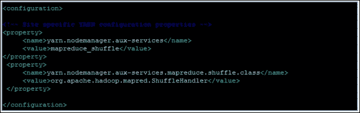

    yarn-site.xml

第`core-site.XML`个文件包含主节点 IP 或主机名、Hadoop 临时目录路径等详细信息。


核心网站. xml

`hdfs-site.xml`文件包含以下详细信息:

*   NameNode 存储命名空间和事务日志的本地文件系统路径
*   存储块的本地文件系统路径列表
*   块大小
*   复制次数

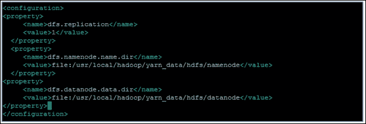

hdfs-site.xml

`mapred-site.xml`文件中有以下的详细信息:

*   JobTracker 运行的主机或 IP 和端口
*   Map/Reduce 存储文件的 HDFS 路径
*   本地文件系统上存储中间 MapReduce 数据的路径列表
*   每个任务跟踪器的映射/减少任务的最大限制
*   需要包含或排除的 DataNodes 列表
*   需要包含或排除的 TaskTrackers 列表

    mapred-site . XML

编辑`.bashrc`文件，如下图所示:

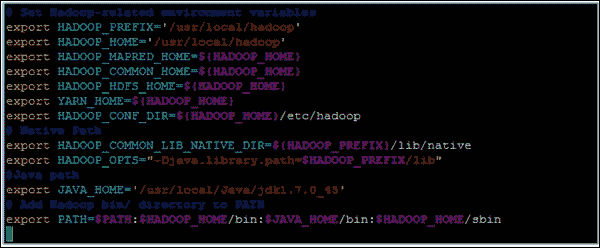

### 启动 Hadoop

*   要启动 NameNode:

    ```
     $ Hadoop-daemon.sh start namenode $ jps 
    ```

*   启动 DataNode:

    ```
     $ Hadoop-daemon.sh start datanode $ jps 
    ```

*   要启动 ResourceManager，使用以下命令:

    ```
     $ yarn-daemon.sh start resourcemanager $ jps 
    ```

    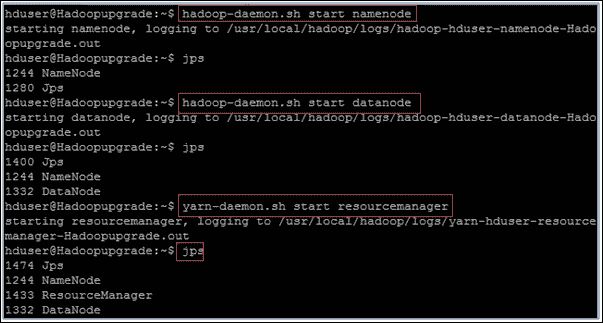
*   启动节点管理器:

    ```
     $ yarn-daemon.sh start nodemanager 
    ```

*   Check Hadoop Web interfaces:

    命名节点:`http://localhost:50070`

    辅助 Namenode: `http://localhost:50090`

*   要停止 Hadoop，使用这个:

    ```
     stop-dfs.sh stop-yarn.sh 
    ```

## Hadoop 发行版和供应商

随着面向 Hadoop 的 Apache 发行版成为大数据社区正在采用的开源核心版本，一些供应商也推出了他们的 Apache Hadoop 开源发行版。其中一些纯粹是添加支持，而另一些则包装和扩展了 Apache Hadoop 及其生态系统组件的功能。在许多情况下，他们在核心框架上构建了自己的框架或库，以向底层核心组件添加新的功能或特性。

在这一节中，让我们介绍一些 Apache Hadoop 的发行版和一些不同的数据事实，这些数据事实有助于开发团队或组织决定最适合他们需求的发行版。

现在让我们考虑以下供应商:

*   Cloudera
*   霍顿工厂
*   MapR
*   Pivotal / EMC
*   IBM

    | 

    Category

     | 

    Function/Framework

     | 

    Cloudera

     | 

    Hortonworks

     | 

    MapR

     | 

    Pivotal

     | 

    IBM

     |
    | --- | --- | --- | --- | --- | --- | --- |
    | Performance and Scalability | Data Ingestion | Batch | Batch | Batch and Streaming | Batch and Streaming | Batch and Streaming |
    |   | Metadata architecture | Centralized | Centralized | Distributed | Centralized | Centralized |
    |   | HBase performance | Spikes in latency | Spikes in latency | Low latency | Low latency | Spikes in latency |
    |   | NoSQL Support | Mainly batch applications | Mainly batch applications | Batch and online systems | Batch and online systems | Batch and online systems |
    | Reliability | High Availability | Single failure recovery | Single failure recovery | Self-healing across multiple failures | Self-healing across multiple failures | Single failure recovery |
    |   | Disaster Recovery | File copy | N/A | Mirroring | Mirroring | File copy |
    |   | Replication | Data | Data | Data and metadata | Data and metadata | Data |
    |   | Snapshots | Consistent with closed files | Consistent with closed files | Point in time consistency | Consistent with closed files | Consistent with closed files |
    |   | Upgrading | Rolling upgrades | Planned | Rolling upgrades | Planned | Planned |
    | **Manageability** | Volume Support | No | No | Yes | Yes | Yes |
    |   | Management Tools | Cloudera Manager | Ambari | MapR Control system | Proprietary console | Proprietary console |
    |   | Integration with REST API | Yes | Yes | Yes | Yes | Yes |
    |   | Job replacement control | No | No | Yes | Yes | No |
    | **Data Access & Processing** | File System | HDFS, Read-only NFS | HDFS, read-only NFS | HDFS, read/write NFS and POSIX | HDFS, read/write NFS | HDFS, read-only NFS |
    |   | File I/O | Append-only | Append-only | Read/write | Append-only | Append-only |
    |   | Security ACLs | Yes | Yes | Yes | Yes | Yes |
    |   | Authentication | Kerberos | Kerberos | Kerberos and Native | Kerberos and Native | Kerberos and Native |

<title>Summary</title>

# 总结

在这一章中，我们讨论了 Hadoop 的所有内容，从核心框架到生态系统组件。在本章结束时，读者应该能够设置 Hadoop 并运行一些 MapReduce 函数。用户应该能够运行和管理 Hadoop 环境，并理解使用一个或多个生态系统组件的命令行用法。

下一章，我们的重点是 Mahout、Python、R、Spark、Julia 等关键的机器学习框架；这些要么在 Hadoop 平台上具有固有的支持，要么需要与 Hadoop 平台直接集成以支持大型数据集。**