# 第四章。机器学习工具、库和框架

在前一章中，我们介绍了机器学习解决方案架构和技术平台 Hadoop 的实现方面。在这一章中，我们将看看一些被广泛采用的和即将出现的机器学习工具、库和框架。本章是后续章节的入门，因为它涵盖了如何使用已识别的机器学习框架的现成功能来实现特定的机器学习算法。

我们将首先介绍市场上可用的开源和商业机器学习库或工具的情况，并挑选出五大开源选项。对于每个确定的选项，从安装步骤开始，学习语法，实现复杂的机器学习算法，到绘制图表，我们将涵盖所有内容。按照出现的顺序，本章对读者来说是强制性的，因为它是后面章节中所有示例实现的基础。

每个确定的框架都可以作为独立的库运行，也可以在 Hadoop 上运行。除了学习如何编程和实现机器学习算法之外，我们还将介绍每个已确定的框架如何在 Hadoop 上集成和运行；这就是这些教程与网上主流教程的不同之处。

本章将深入介绍此处列出的主题:

*   商业和开源机器学习库的简要列表。
*   涵盖的顶级库或框架有 R、Mahout、Julia、Python(特别是机器学习库)和 Spark。
*   Apache Mahout 是一个用于运行基于 Hadoop 构建的机器学习算法的框架，是一个基于 Java 的开源机器学习选项。这个框架也可以独立工作。它以对大量数据运行机器学习算法而闻名。这个框架是 Hadoop 生态系统组件的一部分，有它的分布。
*   r 是一个开源的机器学习和数据挖掘工具，在机器学习社区中被广泛采用。这个框架库既可以独立工作，也可以使用 Hadoop runtime R 扩展在 Hadoop 上运行。
*   Julia 是一种开源的高性能编程语言，支持以分布式和并行的方式运行数值和统计计算功能。
*   Python 是一种解释的高级编程语言，旨在尝试不同的东西，它不属于传统的瀑布式开发方式。我们将探索基本的 Python 库— **NumPy** 和 **SciPy** ，并使用 scikit-learn 来执行我们的第一个机器学习程序。此外，我们将探索如何用 Python 编写 Hadoop MapReduce 程序。
*   Apache Spark 及其机器学习核心库:Spark 是一个集群计算系统，具有用于 Java、Python 和 Scala 的 API。我们将探索用于机器学习的 **MLlib API** ，并为 Apache Hadoop 使用一个版本。重点将是探索 Spark Java APIs。
*   Spring XD 及相关机器学习库简介。
*   对于每个已确定的机器学习框架，与 Hadoop 的集成将是主要关注点。

# 机器学习工具——一个景观

在过去的几十年里，市场上有几个开源和商业机器学习框架和工具在发展。虽然机器学习领域本身正在为不同领域的不同需求构建强大的算法，但我们现在看到大规模机器学习的开源选项激增，这些选项已经达到了相当高的成熟度，并被数据科学和机器学习社区广泛采用。

该模型在最近几年发生了重大变化，研究人员被鼓励在开源模型下发布他们的软件。由于作者在发布他们使用算法实现进行机器学习的工作时会面临一些问题，因此任何通过数据科学社区的使用进行审查和即兴创作的工作都被认为更有价值。

下图显示了市场上一些重要的商业和开源机器学习框架和工具的概念模型。本章将深入介绍突出显示的内容。

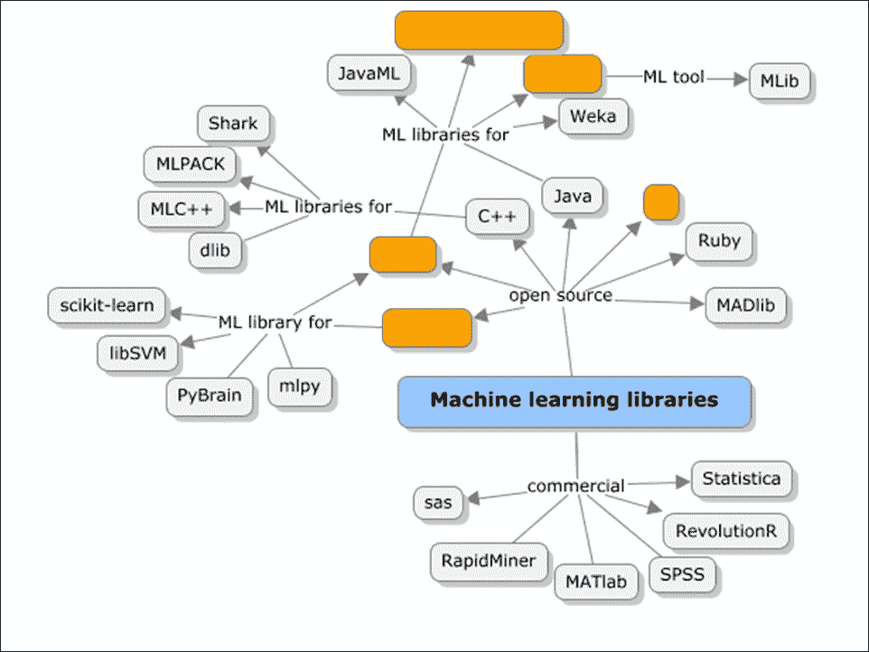

其中一些库围绕特定的编程语言，如 Java、Python、C++、Scala 等等。其中一些库，如 Julia、Spark 和 Mahout，已经支持分布式和并行处理，其他库如 R 和 Python 可以在 Hadoop 上作为 MapReduce 函数运行。

在以下章节中，对于每个突出显示的机器学习库，将涵盖以下内容:

*   库或工具的概述，以及支持的开箱即用机器学习功能的详细信息
*   安装、设置和配置指南
*   介绍语法和基本数据处理功能，然后介绍高级机器学习功能的示例实现
*   可视化和绘图样本(如适用)
*   Hadoop 平台上的集成和执行


# 阿帕奇看象人

Apache Mahout 是一个机器学习库，与 Apache Hadoop 打包在一起，是 Hadoop 生态系统的重要组成部分。

Mahout 于 2008 年作为 Apache Lucene(一个开源搜索引擎)的子项目出现。Lucene 是一个 API，它实现了搜索、文本挖掘和信息检索技术。这些搜索和文本分析中的大多数都在内部应用了机器学习技术。为搜索引擎构建的推荐引擎开始于一个叫做 Mahout 的新的子项目。Mahout 的意思是大象的*骑手，表示机器学习算法在 Hadoop 上的运行。这是一个可扩展的机器学习实现，也可以在独立模式下运行(不与 Hadoop 紧密集成)。*


Mahout 是一组基本的机器学习 Java 库，用于分类、聚类、模式挖掘等等。尽管 Mahout 今天提供了对机器学习算法子集的支持，但它仍然是最受欢迎的框架之一，因为它固有地支持对数亿行的大型数据集进行分析，这些数据集本质上也可以是非结构化的。

## 看象人是如何工作的？

Mahout 实现了 Hadoop MapReduce，最重要的方面是它工作在 Hadoop 之上，应用了分布式计算范式。

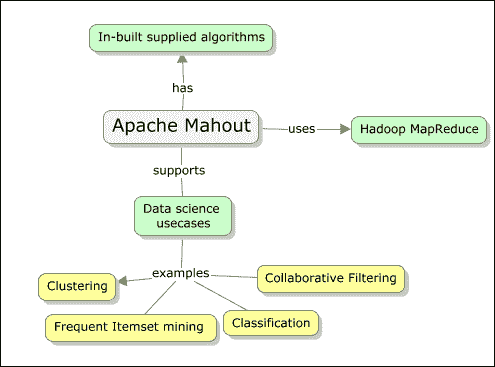

下面是 Mahout 目前实现的一些具体的机器学习任务:

*   **协同过滤/推荐**:这个接受用户输入并找到用户可能喜欢的项目
*   **集群**:它将一组文档作为输入，并根据它们引用/所属的主题对它们进行分组
*   **分类**:这需要一堆文档，基于现有的文档分类，了解给定文档可能属于哪个类别，并将文档映射到那个类别
*   **频繁项目集挖掘**:这将一堆项目作为输入，并基于对真实事件的学习，识别哪些项目出现或一起出现

有一些特定的算法，例如逻辑回归和 SVM(关于这些算法的更多内容将在后面的章节中介绍)，它们不能并行化，也不能在独立模式下运行。

## 安装和设置 Apache Mahout

在这一章中，我们将看看如何在独立模式和 Hadoop 上运行 Mahout。虽然在撰写本书时，Apache Mahout 已经有了新的 1.0 版本，但是在所有的例子中，我们将使用 0.9 版本(最新的稳定版本)。使用的操作系统是 Ubuntu 12.04 桌面 32 位版本。

以下是安装 Apache Mahout 的依赖项和关键要求:

*   JDK (1.6 或以上；在本书中，我们将使用 1.7 u9 版本作为示例)
*   Maven (2.2 或以上；我们将在本书中使用 3.0.4 作为例子)
*   Apache Hadoop(2.0；不是强制性的，因为 Mahout 可以在本地运行)
*   Apache Mahout (0.9 发行版)
*   开发环境—Eclipse IDE (Luna)

在[第 3 章](ch03.html "Chapter 3. An Introduction to Hadoop's Architecture and Ecosystem")、*Hadoop 架构和生态系统介绍*中，我们已经了解了 Apache Hadoop 2.0 单节点安装是如何完成的，以及所需的先决条件，如 Java。

在这一章中，我们将介绍为开发环境设置 Maven 和 Eclipse，以及配置 Apache Mahout 在 Hadoop 上和 Hadoop 下运行。由于考虑的平台和相关框架都是开源的，我们将使用 Windows 7 专业版托管的 VirtualBox 机器仿真器。

您可能还记得，Hadoop 不能作为根用户运行，因此我们为此创建了一个用户— `practical-ml`来安装和运行一切。

### 设置 Maven

建议使用 Maven 来获得所需的 Mahout jars，使用 Mahout 可以很容易地切换到任何新版本。如果没有 Maven，下载依赖项会变得更加复杂。有关 Maven 的具体特性及其在应用开发中的效用的更多详细信息，请参考[https://www . packtpub . com/application-development/Apache-Maven-3-cookbook](https://www.packtpub.com/application-development/apache-maven-3-cookbook)。

maven 3 . 0 . 4 版可以从 Apache 网站的镜像之一下载。以下命令可用于此目的:

```
wget http://it.apache.contactlab.it/maven/maven-3/3.0.4/binaries/apachemaven-3.0.4-bin.tar.gz

```

要手动安装 Maven，请执行以下说明:

1.  将发行版归档文件(即`apache-maven-3.0.4-bin.tar.gz`)解压到您希望安装 Maven 3.0.4 的目录中。
2.  有了这些指令，将选择`/usr/local/apache-maven`路径。将从归档文件中创建一个`apache-maven-3.0.4`子目录。
3.  以下几行需要追加到`.bashrc`文件中:

    ```
    export M2_HOME=/usr/local/apache-maven-3.0.4 export M2=$M2_HOME/bin export PATH=$M2:$PATH export JAVA_HOME=$HOME/programs/jdk
    ```

`JAVA_HOME`应指向安装 JDK 的位置。例如，导出`JAVA_HOME=/usr/java/jdk1.7\. $JAVA_HOME/bin`在您的`PATH`环境变量中。`PATH`变量是在 Java 安装期间设置的。这个要验证一下。

我们现在可以通过运行以下命令来检查 Maven 是否成功安装:

```
mvn –version

```

如果有任何代理设置，我们将不得不显式更新`settings.xml`文件中的代理设置，该文件位于 Maven 安装的`conf`文件夹中。

### 使用 Eclipse IDE 设置 Apache Mahout

接下来详细介绍的过程涵盖了设置 Mahout 环境、代码库、访问示例、运行、调试以及使用 Eclipse IDE 测试它们的步骤。这是推荐的设置方式，也是为开发团队设置 Apache Mahout 的最简单的方式。

执行以下步骤来获取 Apache Mahout tar，解压缩它并导航到安装。

1.  Set up Eclipse IDE.

    Eclipse 的最新版本可以从以下链接下载:

    [https://www.eclipse.org/downloads/](https://www.eclipse.org/downloads/)

2.  使用下面的命令从直接链接下载 Mahout 发行版:

    ```
     $ wget -c http://archive.apache.org/dist/mahout/0.9/mahout-distribution-0.9.tar.gz 
    ```

3.  使用以下命令从其中提取归档文件:

    ```
     $ tar zxf mahout-distribution-0.9.tar.gz 
    ```

4.  Convert the project into an Eclipse project:

    ```
    $ cd mahout-distribution-0.9
    $ mvn eclipse: eclipse

    ```

    前面的命令构建了 Eclipse 项目。

5.  将`M2_REPO` classpath 变量设置为指向本地存储库路径。以下命令将所有 Maven jars 添加到 Eclipse 类路径:

    ```
     mvn -Declipse.workspace= eclipse:add-maven-repo 
    ```

6.  Now, let's import the Eclipse Mahout projects.

    从菜单中导航，**文件** | **导入** | **常规** | **现有项目**到**工作区**。

    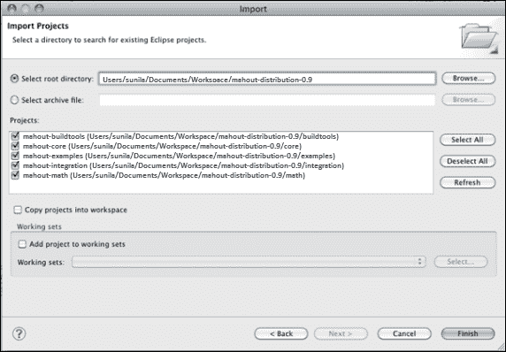

### 在没有 Eclipse 的情况下设置 Apache Mahout

1.  使用下面的命令从直接链接下载 Mahout 发行版:

    ```
     $ wget -c http://archive.apache.org/dist/mahout/0.9/mahout-distribution-0.9.tar.gz 
    ```

2.  将 Mahout 分发解压到`/usr/local`文件夹:

    ```
     $ cd /usr/local $ sudo tar xzf mahout-distribution-0.9.tar.gz $ sudo mv mahout-distribution-0.9.tar.gz mahout $ sudo chown –R practical-ml:hadoop mahout 
    ```

3.  Set the Java, Maven, and Mahout paths in the `.bashrc` file.

    使用下面的命令打开`.bashrc`文件:

    ```
    gedit ~/.bashrc

    ```

    将以下内容添加到文件中:

    ```
    export MAHOUT_HOME = /usr/local/mahout
    path=$path:$MAHOUT_HOME/bin
    export M2_HOME=/usr/local/maven
    export PATH=$M2:$PATH
    export M2=$M2_HOME/bin
    PATH=$PATH:$JAVA_HOME/bin;$M2_HOME/bin
    ```

4.  To run Mahout in the local mode (this means in the standalone mode where there is no need for Hadoop, and the algorithms will not run in parallel or MapReduce mode).

    使用以下命令将本地模式设置为 true:

    ```
    $MAHOUT_LOCAL=true

    ```

    这将迫使 Mahout 不去寻找`$HADOOP_CONF_DIR`中的 Hadoop 配置。

    `MAHOUT_LOCAL`已设置，所以我们不将`HADOOP_CONF_DIR`添加到类路径中。

有一种方法可以在 Hadoop 上运行 Mahout。首先，确保 Hadoop 2.x 安装和配置成功。然后，按照以下说明操作:

1.  Set `$HADOOP_HOME`, `$HADOOP_CONF_DIR` are set and added to `$PATH`.

    ```
    export HADOOP_CONF_DIR=$HADOOP_HOME/conf

    ```

    上面设置了 Hadoop 运行的模式(例如在`core-site.xml`、`hdfs-site.xml`、`mapred-site.xml`等等)。)

2.  现在，使用下面的命令启动 Hadoop 实例:

    ```
     $HADOOP_HOME/bin/start-all.sh 
    ```

3.  检查`http://localhost:50030`和`http://localhost:50070`URL 以确认 Hadoop 是否启动并运行。
4.  通过从 Mahout 目录运行以下 Maven 命令，使用 Maven 构建 Apache Mahout:

    ```
     /usr/local/mahout$ mvn install 
    ```

成功安装后会看到以下输出:

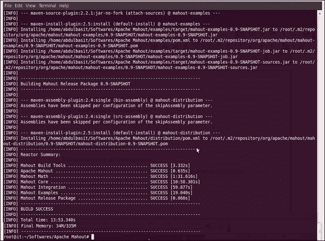

## 看象人包

下图描述了 Mahout 中的不同的包，它们为几种机器学习算法提供了一些现成的支持。核心模块是实用程序、数学向量、集合、Hadoop 和 MapReduce，用于并行处理，文件系统用于分布式存储。

此外，核心模块之上是机器学习包，如下所示:

*   分类
*   使聚集
*   进化算法
*   推荐人
*   回归
*   设备功率监察器(Facility Power Monitor)
*   维度缩减

更多的细节在前面的包中有详细的介绍，在接下来的章节中会有使用每个包来解决问题的示例实现。

## 在 Mahout 中实现矢量

正如我们所理解的，为了在 Mahout 中演示大多数机器学习算法的实现，我们需要经典 Mahout 数据集格式的数据。核心部分的代码主要是使用一些 Mahout 现成的脚本，并对设置做一些小的修改。下面给出了标准流程:

1.  Create sequence files from the raw text files.

    **序列文件** 主要是数据的键/值对表示的二进制编码。接下来给出的属性是表示元数据详细信息的关键头元素:

    *   版本
    *   键名
    *   值名
    *   压缩

2.  从序列文件生成向量。更多关于生成序列文件的实际命令将在后面的章节中介绍，同时演示每个已识别的机器学习算法的实现。
3.  在这些工作向量上运行函数

Mahout 中有不同类型的 vector 实现，这些定义通常也适用。

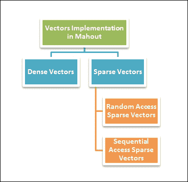

*   **密集向量**:这些向量通常是一个 doubles 的数组，这个向量的大小与数据集中的特征数量相同。由于所有条目都是预先分配的，与零值无关，因此这些向量被称为密集向量。
*   **稀疏向量**:这些向量是向量数组，仅用非零值或空值表示。对于稀疏向量，有两个子类别:随机访问和顺序访问稀疏向量。

    *   **随机访问稀疏向量**:随机访问稀疏向量是 HashMap 表示，其中键是一个整数值，值是一个 double 值。在任何给定的时间点，都可以通过传入给定的键来访问值。
    *   **顺序访问稀疏向量**:这些向量只不过是一组两个数组，其中第一个数组是键数组(整数)，第二个数组是值数组(双精度)。与随机访问稀疏向量不同，这些向量针对线性读取进行了优化。同样，只对非零值进行存储。

    ### 注

    有关使用 Apache Mahout 的详细理解，请参考 Apache Mahout 的 Packt 出版物，标题为 *Apache Mahout 食谱*。

    

虽然本节涵盖了一个为与 Hadoop 一起工作而构建的框架，但只做了很小的配置更改，在下一节中，我们将介绍市场上广泛采用的强大选项—R。Hadoop 提供了显式适配器，使 R 程序能够在 MapReduce 模型中工作，这将在下一节中介绍。


# R

r 是一种用于数据分析的语言，被用作机器学习、统计计算和数据挖掘领域的主要驱动程序，并为基本和高级可视化或图形提供了一个全面的平台。如今，R 是几乎所有数据科学家或潜在数据科学家都拥有或*必须*学习的一项基本技能。

r 主要是一个 GNU 项目，众所周知它类似于 S 语言，S 语言最初是由约翰·钱伯斯和他的团队在贝尔实验室(以前叫美国电话电报公司，现在叫朗讯科技)开发的。S 最初的目标是支持所有的统计功能，并被核心统计人员广泛使用。

R 附带了大量的开放源码包，可以免费下载和配置，并根据需要安装或加载到 R 环境中。这些包为各种各样的统计技术提供现成的支持，包括线性和非线性建模、时间序列分析、分类、聚类等等。

除此之外，还提供了高度可扩展的图形功能。对这些高级图形功能的支持是 R 的主要优势，因为其输出以出版质量图著称。除此之外，R 还支持许多开源的图形库和可视化工具，它们本质上都是开源的和商业化的。

尽管在核心上，R 并不意味着在分布式环境中工作或以并行模式运行算法，但有几个可用的扩展(开源和商业的)使 R 更具可伸缩性并支持大型数据集。在这一章中，我们将介绍 R 如何与 Apache Hadoop 集成，从而运行和利用 MapReduce 功能。

最重要的是，R 是被广泛采用的自由软件，有许多提交者和支持团体一直致力于保持它在数据科学领域的高度相关性。

下面列出了 R 目前支持的一些关键功能:

*   有效管理和存储模型所操作的数据的能力
*   为数组、向量和矩阵等的计算提供一些核心函数套件
*   几个现成的机器学习功能，可以按需加载，有助于轻松实现数据科学项目
*   高级和复杂的图形功能，可以轻松使用，并有助于为企业所有者生成有价值的仪表板
*   一个由采纳者和提交者组成的广泛而活跃的社区，通过大量软件包的扩展而迅速发展
*   r 被认为是一个支持新开发的交互式数据分析方法的平台

## 安装和设置 R

对于本书中的所有例子，我们将使用 R 的稳定版本 2.15.1 和所有最新 R 包的 CRAN 参考。

参考[https://cran.r-project.org/bin/windows/base/old/2.15.1/](https://cran.r-project.org/bin/windows/base/old/2.15.1/)链接下载 R for Windows。

详细的安装过程见[https://cran.r-project.org/doc/manuals/R-admin.html#Top](https://cran.r-project.org/doc/manuals/R-admin.html#Top)。

我们可以在 R GUI 或 IDE RStudio 中使用 R。下面是 R 界面的截图，用户可以在成功安装 R GUI 和 R IDE 以及 RStudio 后看到。

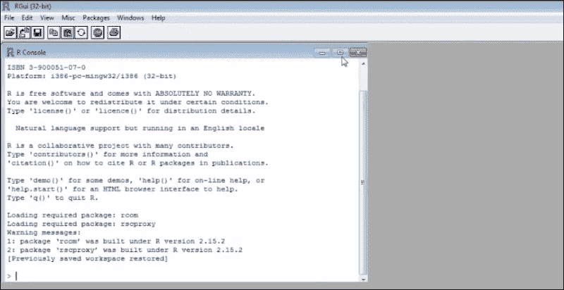

我们需要通过菜单路径**包** | **设置起重机镜像**来设置起重机镜像路径，以便能够访问和加载所需的 R 包

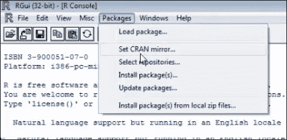

下面的截图显示了一个镜像站点列表，开发者可以从中选择最合适的一个:

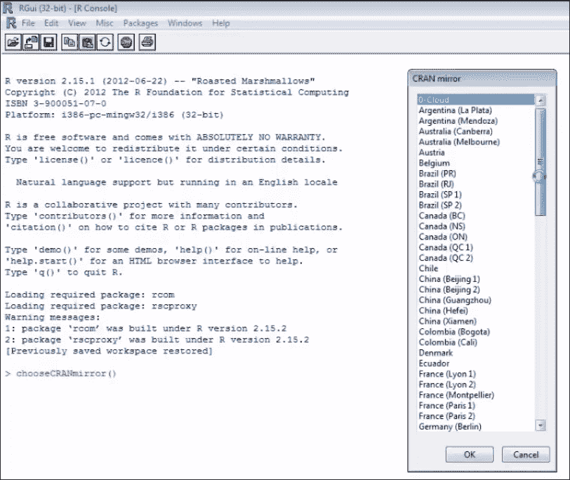

R 编辑器可用于编写任何高级操作，结果可在控制台上看到，如下所示:

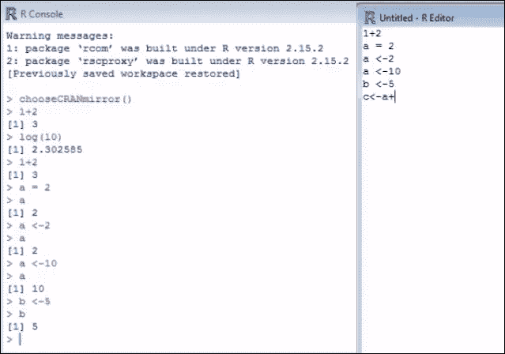

以下是图形绘图的屏幕截图:

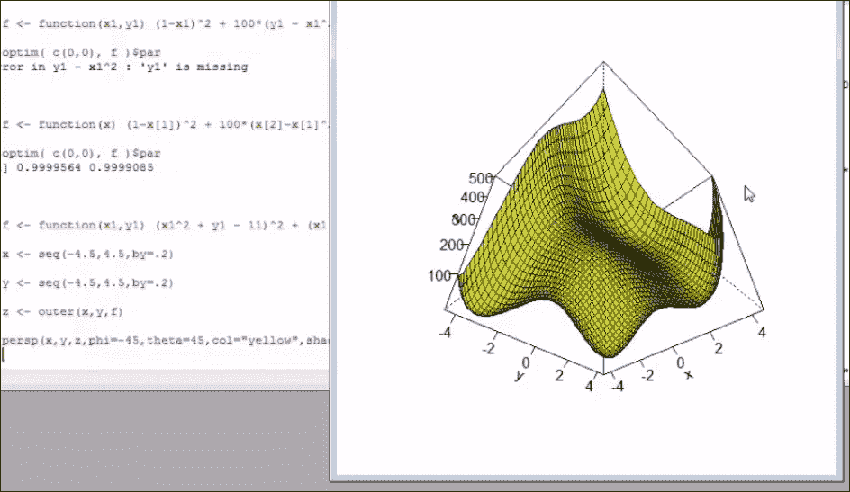

## 将 R 与 Apache Hadoop 集成

到目前为止，我们已经看到了 Apache Hadoop 及其核心组件，HDFS 和 YARN (MapReduce 2.0)，以及 R。我们可以通过三种不同的方式来看待 R 与 Hadoop 的集成，从而支持大规模机器学习。

### 方法 1——在 Hadoop 中使用 R 和流式 API

为了将 R 函数与 Hadoop 集成并在 MapReduce 模式下运行，Hadoop 支持 R 的流 API。这些流 API 主要帮助运行任何可以在 MapReduce 模式下访问和操作标准 I/O 的脚本。因此，在 R 的情况下，不会有任何使用 R 的显式客户端集成。以下是 R 和流的示例:

```
$ ${HADOOP_HOME}/bin/Hadoop jar
${HADOOP_HOME}/contrib/streaming/*.jar \
-inputformat
org.apache.hadoop.mapred.TextInputFormat \
-input input_data.txt \
-output \
-mapper /home/tst/src/map.R \
-reducer /home/tst/src/reduce.R \
-file /home/tst/src/map.R \
-file /home/tst/src/reduce.R
```

### 方法 2——使用 R

在 R 中有一个名为 Rhipe 的包，允许在 R 中运行 MapReduce 作业。有一些先决条件:

*   r 需要安装在 Hadoop 集群中的每个 DataNode 上
*   将在每个 DataNode 上安装并提供协议缓冲器(有关协议缓冲器的更多信息请参考[http://wiki.apache.org/hadoop/ProtocolBuffers](http://wiki.apache.org/hadoop/ProtocolBuffers))
*   Rhipe 应该在每个数据节点上都可用

以下是使用 R 中的`Rhipe`库实现 MapReduce 的示例格式:

```
library(Rhipe)
rhinit(TRUE, TRUE);
map<-expression ( {lapply (map.values, function(mapper)…)})
reduce<-expression(
pre = {…},
reduce = {…},
post = {…},
)
x <- rhmr(map=map, reduce=reduce,
 ifolder=inputPath,
 ofolder=outputPath,
 inout=c('text', 'text'),
 jobname='test name'))
rhex(x)
```

### 方法 3——使用 RHadoop

RHadoop 与 Rhipe 非常相似，它有助于在 MapReduce 模式下运行 R 函数。这是一个由 Revolution Analytics 构建的开源库。以下是一些软件包，它们是 RHadoop 库的一部分:

*   **plyrmr** :这是一个包，为运行在 Hadoop 上的大型数据集的常见数据操作需求提供函数
*   rmr :这是一个包，它有一个集成了 R 和 Hadoop 的函数集合
*   rdfs :这是一个包，有帮助接口 R 和 HDFS 的功能
*   **rhbase** :这是一个包，有帮助接口 R 和 hbase 的功能

下面是一个使用 rmr 包的例子，演示了使用这个包中的函数集成 R 和 Hadoop 的步骤:

```
library(rmr)
maplogic<-function(k,v) { …}
reducelogic<-function(k,vv) { …}
mapreduce( input ="data.txt",
output="output",
textinputformat =rawtextinputformat,
map = maplogic,
reduce=reducelogic
)
```

### R/Hadoop 集成方法概述

总之，前面的三种方法都产生了结果并促进了 R 和 Hadoop 的集成。他们帮助 scale R 对大规模数据进行操作，这将有助于 HDFS。这些方法各有利弊。以下是总结的结论:

*   Hadoop Streaming API 是所有方法中最简单的，因为在安装和设置要求方面没有复杂性
*   Rhipe 和 RHadoop 都需要在 Hadoop 集群上设置 R 和相关的包
*   关于实现方法，Streaming API 更像是一个命令行映射，reduce 函数是函数的输入，而 Rhipe 和 RHadoop 都允许开发人员在 R
*   对于 Hadoop Streaming API，不需要客户端集成，而 Rhipe 和 RHadoop 都需要客户端集成
*   扩展机器学习的替代方案是 Apache Mahout、Apache Hive 以及 Revolution Analytics、Segue framework 等公司的一些商业版 R

### 在 R 中实现(使用示例)

在这一节中，我们将简要介绍 R 的一些实现方面，并重点学习语法和理解一些核心函数及其用法。

#### R 表情

r 可以作为简单的数学计算器；以下是使用它的一些基本方法。以下是在 R 控制台上看到的内容:

```
> 1+1
[1] 2
> "Welcome to R!"
[1] "Welcome to R!"
> 6*7
[1] 42
> 10<22
[1] TRUE
> 2+7==5
[1] FALSE
```

##### 作业

用于给变量赋值，并对该变量进行一些操作:

案例 1:分配数值:

```
> x<-24
> x/2
[1] 12
```

案例 2:分配字符串文字:

```
> x <- "Try R!"
[1] "Try R!"
> x
[1] " Try R!"
```

案例 3:分配逻辑值:

```
> x <- TRUE
[1] TRUE
```

##### 职能

有许多现成的函数，要调用 R 中的函数，我们应该提供函数名并传递所需的参数。下面是一些函数和结果的例子，如在 R 控制台中看到的:

```
> sum(4,3,5,7)
[1] 19
> rep("Fun!", times=3)
[1] " Fun!" "Fun!" "Fun!"
> sqrt(81)
[1] 9
```

下面是获取 R 中某个函数的帮助的命令:

```
> help(sum)
sum package: base R Documentation

Sum of Vector Elements

Description:

     'sum' returns the sum of all the values present in its arguments.

Usage:

     sum(..., na.rm = FALSE)
```

#### R 载体

根据定义，vector 是一个简单的值列表，它构成了 R 数据类型的核心。许多机器学习功能利用了这些。

以下是一些关键功能及其使用环境:

| 

函数/语法

 | 

目的

 | 

例子

 | 

R 控制台上的输出

 |
| --- | --- | --- | --- |
| `m:n` | 从`m`到`n`输出数字，增量为 1 | `> 5:9` | `[1] 5 6 7 8 9` |
| `seq(m,n)` | 从`m`到`n`的输出数字增加 1 | `> seq(5,9)` | `[1] 5 6 7 8 9` |
| `seq(m,n, i)` | 从`m`到`n`输出数字，增量为`i` | `> seq(1,3,0.5)` | `[1] 1 1.5 2 2.5 3` |

##### 分配、访问和操纵向量

下面的表格包含了在 R 中创建、访问和操作矩阵的示例:

| 

目的

 | 

例子

 |
| --- | --- |
| 创建文字向量 | `> sentence <- c('practical', 'machine', 'learning')` |
| 访问向量的第三值 | `> sentence[3]``[1] "learning."` |
| 更新向量中的值 | `> sentence[1] <- "implementing"` |
| 向向量添加新值 | `> sentence[4] <- "algorithms"` |
| 获取给定索引的值 | `> sentence[c(1,3)]``[1] "implementing" "learning"` |
| 获取索引范围的值 | `> sentence[2:4]``[1] "machine" "learning" "algorithms"` |
| 添加一系列新值 | `> sentence[5:7] <- c('for','large','datasets')` |
| 将矢量值增加 1 | `> a <- c(1, 2, 3)``> a + 1``[1] 2 3 4` |
| 将向量中的每个值除以一个值 | `> a / 2``[1] 0.5 1.0 1.5` |
| 将向量的每个值乘以一个值 | `> a*2``[1] 2 4 6` |
| 添加两个向量 | `> b <- c(4, 5, 6)``> a + b``[1] 5 7 9` |
| 比较两个向量 | `> a == c(1, 99, 3)``[1] TRUE FALSE TRUE` |
| 对向量的每个值应用函数 | `> sqrt(a)``[1] 1.000000 1.414214 1.732051` |

#### R 矩阵

矩阵是有行和列的二维向量。下表提供了在 R 中创建、访问和操作矩阵的示例:

| 

目的

 | 

例子

 |
| --- | --- |
| 创建一个默认值为零的 3 X 4 矩阵 | `> matrix(0, 3, 4)``[,1] [,2] [,3] [,4]``[1,] 0 0 0 0``[2,] 0 0 0 0``[3,] 0 0 0 0` |
| 用一系列值初始化矩阵 | `> a <- 1:12``> m <- matrix(a, 3, 4)``[,1] [,2] [,3] [,4]``[1,] 1 4 7 10``[2,] 2 5 8 11``[3,] 3 6 9 12` |
| 从矩阵中访问值 | `> m[2, 3]``[1] 8` |
| 为矩阵中选择的位置赋值 | `> m[1, 4] <- 0` |
| 检索选择的整行或一列的数组 | `> m[2,]``[1] 2 5 8 11``> m[3,]``[1] 7 8 9` |
| 检索更大矩阵的子集 | `> m[, 2:4]``[,1] [,2] [,3]``[1,] 4 7 10``[2,] 5 8 11` |

#### R 因子

在数据分析和机器学习中，对数据进行分组或分类是很常见的。例如，好客户或坏客户。r 的`factor`数据类型用于跟踪分类数据。所有需要做的就是定义一个类别向量，并将其作为参数传递给`factor`函数。

以下示例演示了使用`factors`创建和分配类别:

```
> ornaments <- c('ring', 'chain', 'bangle', 'anklet', 'nosepin', 'earring', 'ring', 'anklet')
> ornamenttypes <- factor(ornaments)
> print(ornamenttypes)
[1] ring chain bangle anklet nosepin earring
Levels: anklet bangle chain earring nosepin ring
```

每个定义的类别通常都有一个与文字相关联的整数值。将`factor`传递给函数`as.integer`将给出整数等效值，如下所示:

```
> as.integer(ornamenttypes)
[1] 6 3 2 1 5 4 6 1
```

#### R 数据帧

数据帧与数据库表的概念相关。这种数据类型在 R 中非常强大，它有助于将数据集的不同相关属性联系在一起。例如，购买的商品数量与总账单价值和总体适用折扣有关系。应该有一种方法来链接这些属性，而数据框有助于做到这一点:

| 

目的

 | 

例子

 |
| --- | --- |
| 创建数据框并检查值 | `> purchase <- data.frame(totalbill, noitems, discount``> print(purchase)``totalbill noitems discount``1 300 5 10``2 200 3 7.5``3 100 1 5``)` |
| 使用索引或标签访问数据帧的数据 | `> purchase[[2]]``[1] 5 3 1``> purchase[["totalbill"]]``[1] 300 200 100``> purchase$discount``[1] 10 7.5 5` |
| 用 CSV 文件中的数据加载数据帧 | `> list.files()``[1] "monthlypurchases.csv"``> read.csv("monthlypurchases.csv")``Amount Items Discount``1 2500 35 15``2 5464 42 25``3 1245 8 6` |

#### R 统计框架

r 支持一系列现成的统计函数，帮助统计人员解释数据。下表显示了一些带有示例的函数:

| 

功能

 | 

例子

 |
| --- | --- |
| 平均 | `limbs <- c(4, 3, 4, 3, 2, 4, 4, 4)``names(limbs) <- c('One-Eye', 'Peg-Leg', 'Smitty', 'Hook', 'Scooter', 'Dan', 'Mikey', 'Blackbeard')``> mean(limbs)``[1] 3.5` |
| 中位数 | `> median(limbs)``[1] 4` |
| 标准偏差 | `> pounds <- c(45000, 50000, 35000, 40000, 35000, 45000, 10000, 15000)``> deviation <- sd(pounds)` |

包含的每段 R 代码都保存在扩展名为`.R`的文件中用于运行。

在这一节中，我们已经看到了如何设置 R 以及如何使用一些基本的函数和数据类型。我们将在接下来的章节中探索许多机器学习的特定包。

### 注意

有关使用 R 进行机器学习的详细理解，请参考 Packt 针对 R 的出版物，标题为*使用 R 进行机器学习*。


# 朱莉娅

最近，Julia 作为 Python 的高性能替代品，在机器学习和数据科学领域获得了广泛的欢迎和采用。Julia 是一种动态编程语言，旨在支持分布式和并行计算，因此方便快捷。

Julia 中的性能是 JIT 编译器和类型接口特性的结果。此外，与其他数字编程语言不同，Julia 不强制执行值的矢量化。与 R、MATLAB 和 Python 类似，Julia 为高级数值计算提供了便利和表现力。

以下是朱莉娅的一些主要特征:

*   核心的 API 和数学原语操作都是用 Julia 写的
*   它由丰富类型组成，用于构造和描述对象
*   Julia 支持多重分派，这使得可以在多种参数组合中使用函数
*   它有助于为不同的参数类型自动生成专门的代码
*   成熟的性能与 C 等静态编译语言不相上下
*   它是一种免费的开源编程语言(麻省理工学院许可)
*   用户定义的类型和内置类型一样快速紧凑
*   它不强制或要求矢量化代码来提高性能
*   它是为分布式并行计算而设计的
*   Julia 附带了协同例程和轻量级线程
*   Julia 支持直接调用 C 函数的能力
*   用于管理流程的类似外壳的功能
*   它提供了类似 Lisp 的宏

## 安装和设置朱莉娅

我们将使用茱莉亚的最新版本,这是在写这本书的时候可用的——v 0 . 3 . 4。

Julia 程序可以通过以下方式构建和执行:

*   使用 Julia 命令行
*   使用 Juno——Julia 的 IDE
*   在[https://juliabox.org/](https://juliabox.org/)使用现成可用的环境，在那里可以使用浏览器访问 Julia 环境

### 下载和使用 Julia 的命令行版本

使用链接[http://julialang.org/downloads/](http://julialang.org/downloads/)下载所需的茱莉亚版本。

1.  下载适当的可执行文件并运行。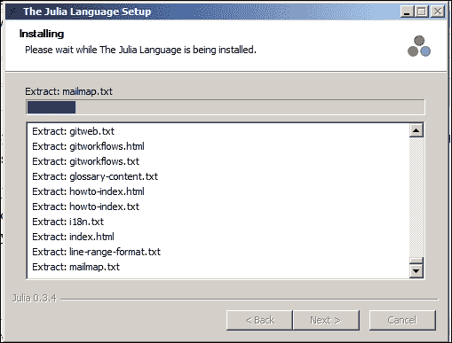
2.  安装成功后，打开 Julia 控制台，Julia 就可以使用了。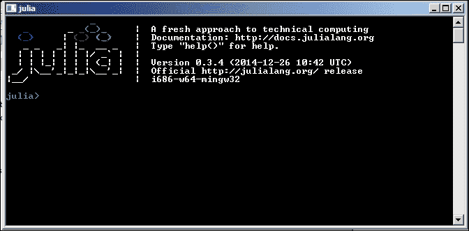

### 使用 Juno IDE 运行 Julia

Juno IDE 让开发 Julia 代码变得简单。从 http://junolab.org/docs/install.html[下载最新的 Juno IDE](http://junolab.org/docs/install.html) 版本。

Juno 拥有 Julia 的核心 API 和功能，有助于简化开发过程。下面是如何使用 Juno 的屏幕截图:

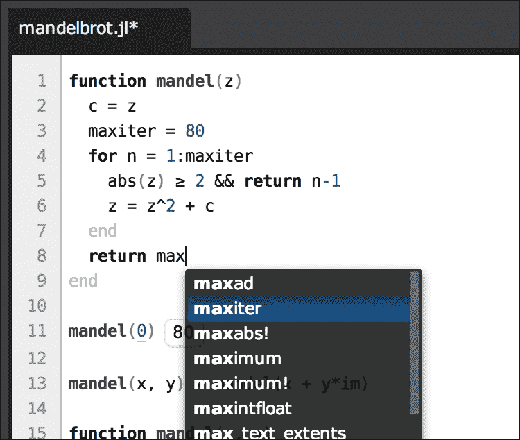

### 通过浏览器使用 Julia

使用这个选项不需要安装任何 Julia。按照以下步骤在线访问 Julia 环境:

1.  从浏览器访问[https://juliabox.org/](https://juliabox.org/)
2.  使用 Google 帐户登录。这将为登录用户创建一个唯一的 Julia 实例。这将提供对 Julia 控制台和 IJulia 实例的访问。

使用我们之前看到的三种方法中的一种，我们可以访问 Julia 控制台，从那里可以执行 Julia 代码。包含的每段 Julia 代码都构建在一个扩展名为`.jl`的文件中。

## 从命令行运行 Julia 代码

Julia 在运行时编译代码，并使用**实时** ( **JIT** ) 编译器将每个方法翻译成机器码。在内部，它利用 **低级虚拟机** ( **LLVM** )进行优化和代码生成。LLVM 是一个成熟的项目，是标准编译器技术的集合。这是作为 iOS 的一部分使用的。

从选择的 shell 中，运行以下命令:

```
<</path/to/Julia>>/myjuliascript.jl
```

或者，从 Julia 命令行安装中打开 Julia 控制台，并运行以下命令:

```
julia> include("<<path/to/juliascript>>/myjuliascript.jl")
```

## 在 Julia 中实现(带示例)

在这一节中，我们将讨论编码 Julia 和理解语法中的一些基本主题。在本节结束时，读者应该能够轻松地编写 Julia 脚本并运行。关于语法，Julia 编程语言与 MATLAB 非常相似。

## 使用变量和赋值

Julia 中的变量，像任何其他的编程语言一样，用于存储和操作数据。以下是定义、分配和操作变量和值的示例:

```
# Assign a numeric value to a variable
julia> x = 10
10

# Perform a simple mathematical manipulation of variables
julia> x + 1
11

# Assigning or reassigning values to variables.
julia> x = 1 + 1
2

# Assigning a string literal to a variable
julia> x = "Hello World!"
"Hello, World!"
```

作为一种数学编程语言，Julia 提供了几个基本常数。下面是一个可以直接在代码中使用的示例。此外，我们可以定义常量并重新赋值:

```
julia> pi
π = 3.1415926535897...
```

### 数字原语

对于任何支持基于数字的计算的数学编程语言来说，整数和浮点值构成了基本的构建模块，被称为数字原语。

Julia 提供了对大量数字原语的支持，这些原语是广泛的、非常完善的数学函数。

### 数据结构

除了所有的原始数据类型，如向量、矩阵、元组、字典、集合等等，Julia 还支持几种数据结构。以下是一些表示用法的示例:

```
# Vector
b = [4, 5, 6]
b[1] # => 4
b[end] # => 6

# Matrix
matrix = [1 2; 3 4]

# Tuple
tup = (1, 2, 3)
tup[1] # => 1
tup[1] = 3 # => ERROR #since tuples are immutable, assigning a value results in an error

# Dictionary
dict = ["one"=> 1, "two"=> 2, "three"=> 3]
dict["one"] # => 1

# Set
filled_set = Set(1,2,2,3,4)
```

### 使用字符串和字符串操作

下面是一些在 Julia 中用字符串操作的例子:

```
split("I love learning Julia ! ")
# => 5-element Array{SubString{ASCIIString},1}:
"I"
"love."
"learning."
"Julia"
"!"

join(["It seems to be interesting", "to see",
"how it works"], ", ")
# => "It seems interesting, to see, how it works."
```

### 套餐

Julia 附带了几个包，这些包具有内置的功能，并且支持许多开箱即用的功能来实现机器学习算法。以下是列表:

*   `Images.jl`
*   `Graphs.jl`
*   `DataFrames.jl`
*   `DimensionalityReduction.jl`
*   `Distributions.jl`
*   `NLOpt.jl`
*   `ArgParse.jl`
*   `Logging.jl`
*   `FactCheck.jl`
*   `METADATA.jl`

更多关于茱莉亚包的细节可以在[https://github.com/JuliaLang/](https://github.com/JuliaLang/)获得。

### 互操作性

下一节将介绍 Julia 与其他各种编程语言的集成。

#### 与 C 集成

Julia 是灵活的，没有任何包装器，支持直接调用 C 函数。下面的示例演示了这是如何实现的:

```
julia> ccall(:clock, Int32, ())
2292761
julia> ccall(:getenv, Ptr{Uint8int8}, (Ptr{Uint8},), "SHELL")
Ptr{Uint8} @0x00007fff5fbffc45
julia> bytestring(ans)
"/bin/bash"
```

#### 与 Python 集成

类似于 C 函数调用，Julia 支持直接调用 Python 函数。重要的是我们已经安装了`PyCall`包来实现这个功能。`PyCall.jl`提供 Julia 和 Python 之间的自动类型转换。例如，Julia 数组被转换为 NumPy 数组。

以下示例演示了如何从 Julia 代码中调用 Python 函数:

```
julia> using PyCall # Installed with Pkg.add("PyCall")
julia> @pyimport math
julia> math.sin(math.pi / 4) - sin(pi / 4)
0.0
julia> @pyimport pylab
julia> x = linspace(0,2*pi,1000); y = sin(3*x + 4*cos(2*x));
julia> pylab.plot(x, y; color="red", linewidth=2.0, linestyle="--")
julia> pylab.show()
```

#### 与 MATLAB 集成

以下示例演示了集成 Julia 以调用 MATLAB 函数:

```
using MATLAB

function sampleFunction(bmap::BitMatrix)
@mput bmap
@matlab bmapthin = bwmorph(bmap, "thin", inf)
convert(BitArray, @mget bmapthin)
end
```

### 图形和标图

朱莉娅有几个帮助制作图表的软件包。这里列出了其中的一些:

*   `Gadfly.jl`:这非常类似于 ggplot2
*   `Winston.jl`:这非常类似于 Matplotlib
*   `Gaston.jl`:这与 gnuplot 接口

这里的例子演示了如何使用`PyPlot`:

```
using PyPlot
x = linspace(-2pi, 2pi)
y = sin(x)
plot(x, y, "--b")
```

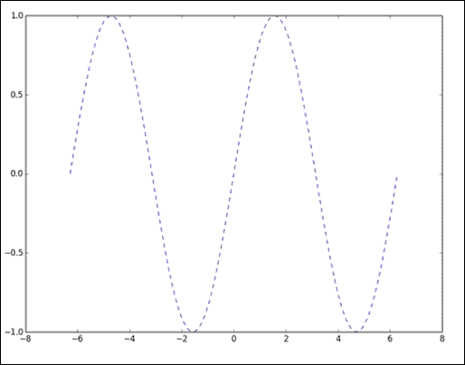

## 收养朱莉娅的好处

以下是在机器学习实现中采用 Julia 的一些直接好处:

*   Julia 在不影响性能的情况下促进了快速原型开发
*   它本质上支持代码的并行化
*   它提供了一种更简单的方法来表达具有特殊 Julia 类型的算法
*   Julia 可以轻松调用或集成 C、Python、MATLAB 和 C++
*   热情、友好和支持的社区为 Julia 提供了便利
*   它与 Hadoop 一起工作，并利用基于配置单元的查询

## 集成 Julia 和 Hadoop

将任何编程语言与 Hadoop 集成通常意味着存储在 Hadoop 中的数据应该是可访问的，并且程序应该能够对数据执行特定的逻辑。这可以通过从 Hadoop 中检索数据并使其更接近程序来实现，也可以通过将程序移动到数据并在 MapReduce 或并行处理模式下执行来实现。显然，在第一种情况下，从 Hadoop 中获取数据并提交给执行逻辑的代码，需要足够的 RAM 来保存和处理内存中的数据，这可能会限制在真正大的卷上运行的能力。在第二种情况下，将代码用于跨数据节点分布的数据，逻辑应该是可并行化的，并且应该构建 Map 和 Reduce 逻辑。

Julia 与 Hadoop 平台的集成还处于初级阶段，目前详细介绍的方法是之前描述的第一种方法，其中使用标准 ODBC 连接从 Julia 代码建立到 Hadoop/HDFS 的连接。数据被提取到 RAM 中供进一步处理。现在，这段代码可以直接在 DataNode 上运行，并可以更新 HDFS 数据。

我们将使用通过以下链接从 GitHub 获得的:

[https://github.com/quinnj/ODBC.jl](https://github.com/quinnj/ODBC.jl)

这是 Julia 的一个简单的底层 ODBC 接口。它可以通过 Julia 包管理器使用以下命令进行安装:

以下命令创建一个 Julia 包存储库(对所有包只运行一次)

```
julia> Pkg.init()

```

以下命令创建`ODBC repo`文件夹并下载`ODBC`包和依赖项(如果需要)

```
julia> Pkg.add("ODBC")

```

下面的命令加载了要使用的 ODBC 模块(需要与每个新的 Julia 实例一起运行)

```
julia> using ODBC

```

以下是一些可用于 Hadoop/HDFS 的重要函数:

*   要使用 ODBC 数据源进行连接，用户和密码使用— `co = ODBC.connect("mydatasource",usr="johndoe",pwd="12345")`。
*   使用`disconnect(connection::Connection=conn)`断开连接。
*   使用连接字符串连接时，使用`advancedconnect(conn_string::String)`。
*   为了进行查询并获取数据源上的数据子集，这个查询字符串是一个将在 HDFS 上运行的 Hive 查询— `query(connecti on Connection=conn, querystring; fi le=: DataFrame,delim='\t')`。

这里给出了一个示例实现:

使用以下命令加载 ODBC 模块:

```
using ODBC

```

要通过配置单元连接到 Hadoop 集群，请使用以下命令:

```
hiveconn = ODBC.connect("servername"; usr="your-user-name", pwd="your-password-here")

```

要编写配置单元查询并将其存储为 Julia 字符串，请使用以下命令:

```
hive_query_string = "select …;"

```

要运行查询，请使用以下命令将结果直接保存到文件:

```
query(hive_query_string, hiveconn;output="C:\\sample.csv",delim=',')

```

Julia 程序现在可以访问这个文件中的数据来执行机器学习算法。


# Python

Python 是机器学习和数据科学领域中被广泛采用的编程或脚本语言之一。Python 总是以其易于学习、实现和维护而闻名。Python 具有高度的可移植性，可以在基于 Unix、Windows 和 Mac 平台上运行。随着 Pydoop 和 SciPy 等库的出现，它在大数据分析领域的相关性大大增加了。
Some 把 Python 在解决机器学习问题上受欢迎的关键原因列举如下:

*   众所周知，Python 非常适合数据分析
*   它是一种多功能的脚本语言，可用于编写一些基本的快速而复杂的脚本来测试一些基本的功能，也可用于利用其全功能工具包的实时应用
*   Python 自带完整的机器学习包(参考【http://mloss.org/software/】T2)，可以即插即用

## Python 中的工具包选项

在我们深入了解 Python 中有哪些工具箱选项之前，让我们先了解一下在选择工具箱选项之前应该考虑的权衡。

对于合适的工具包，我们应该评估的一些问题如下:

*   我的表现优先级是什么？我需要离线或实时处理实现吗？
*   工具包有多透明？我可以自己定制库吗？
*   社区地位如何？bug 修复的速度有多快，社区支持和专家交流的可用性如何？

Python 中有三个选项:

*   使用 Python 外部绑定。这些是市场上流行的软件包的接口，比如 Matlab、R、Octave 等等。如果我们在前面提到的框架中已经有了一些实现，并且正在考虑无缝迁移到 Python 中，那么这个选项将会很好地工作。
*   使用基于 Python 的工具包。有一些用 Python 编写的工具包附带了一堆算法。下一节将介绍一些 Python 工具包。
*   写你的逻辑/工具包。

## Python 的实现(使用示例)

Python 有两个核心工具包，其中更多的是构建模块，这里列出的几乎所有专业工具包都使用这些核心工具包。这些措施如下:

*   NumPy : NumPy 是关于用 Python 构建的快速高效的数组
*   这是 NumPy 内置的一系列标准运算的算法

有很多基于 C/C++的实现，比如 LIBLINEAR、LIBSVM、OpenCV 等等

现在让我们看看一些流行的 Python 工具包，以及在撰写本书的一年时间内更新的工具包:

*   **NLTK** :这代表自然语言工具包。这里重点介绍一下 **自然语言处理** ( **NLP** )。
*   **mlpy** :这是机器学习算法工具包，支持一些关键的机器学习算法，如分类、回归和聚类等。
*   **PyML** :这个工具包重点是 **支持向量机** ( **SVM** )。我们将在接下来的章节中详细介绍这一点。
*   **PyBrain** :这个工具包专注于神经网络和相关功能。
*   **mdp-toolkit** :这个工具包的重点是数据处理，它支持调度和并行处理。
*   **scikit-learn** :这是最流行的工具包之一，最近被数据科学家广泛采用。它支持有监督的和无监督的学习，对特征选择和可视化有一些特殊的支持。有一个大型团队正在积极地构建这个工具包，并以其出色的文档而闻名。
*   **Pydoop** :这个是 Python 与 Hadoop 平台的集成。

**Pydoop** 和 **SciPy** 和在大数据分析领域有大量部署。

在本章中，我们将探索 scikit-learn 工具包，并在接下来的章节中使用该工具包演示我们的所有示例。

对于 Python 程序员来说，使用 scikit-learn 可以非常容易地将机器学习引入生产系统。

### 安装 Python 并设置 scikit-learn

以下是安装 Python 和 scikit-learn 的核心 Python 工具包版本和依赖关系:

*   Python (>= 2.6 或> = 3.3)
*   NumPy (>= 1.6.1)
*   SciPy (>= 0.9)。
*   一个有效的 C++编译器

我们将使用轮子包(`.whl`文件)用于 scikit——从 PyPI 学习，并使用 pip 实用程序安装它。

要在您的主目录中安装，请使用以下命令:

```
python setup.py install --home

```

要直接从 GitHub 使用 git repo 在本地磁盘上安装 scikit-learn，请使用以下命令:

```
% git clone git://github.com/scikit-learn/scikit-learn/
% cd scikit-learn

```

#### 加载数据

Scikit-learn 附带了一些标准数据集，例如，`iris`和`digits`数据集可用于构建和运行机器学习算法。

以下是加载 scikit-learn 附带的标准数据集的一些步骤:

```
>>> from sklearn import datasets
>>> iris = datasets.load_iris()
>>> digits = datasets.load_digits()
>>> print digits.data
[[ 0\. 0\. 5\. ..., 0\. 0\. 0.]
[ 0\. 0\. 0\. ..., 10\. 0\. 0.]
[ 0\. 0\. 0\. ..., 16\. 9\. 0.]
...,
[ 0\. 0\. 1\. ..., 6\. 0\. 0.]
[ 0\. 0\. 2\. ..., 12\. 0\. 0.]
[ 0\. 0\. 10\. ..., 12\. 1\. 0.]]
>>> digits.target
array([0, 1, 2, ..., 8, 9, 8])
```


# 阿帕奇火花

Apache Spark 是一个用于快速、大数据或大规模处理的开源框架，支持流、SQL、机器学习和图形处理。这个框架是用 Scala 实现的，支持 Java、Scala、Python 等编程语言。性能是传统 Hadoop 栈的 10 到 20 倍。Spark 是一个通用框架，它允许交互式编程以及对流的支持。Spark 可以在独立模式下与支持 Hadoop 格式(如 SequenceFiles 或 InputFormats)的 Hadoop 一起工作。它包括本地文件系统、Hive、HBase、Cassandra 和亚马逊 S3 等。

我们将在本书的所有例子中使用 Spark 1.2.0。

下图描述了 Apache Spark 的核心模块:

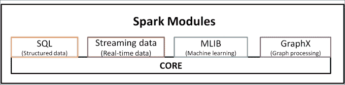

Spark 框架的一些基本功能包括任务调度、与存储系统的交互、容错和内存管理。Spark 遵循一种被称为 **的编程范式，即弹性分布式数据集** ( **RDD** )。这主要与管理分布式数据存储和并行计算有关。

*   **Spark SQL** 是 Spark 的包，用于查询和处理结构化和非结构化数据。这个包的核心功能是:

    *   以便于从各种结构化源(如 Hive、JSON 等)加载数据
    *   以便提供 SQL 和常规 Python 或 Java 或 Scala 代码之间的集成，并提供构建自定义函数的能力，这些函数可以在分布式数据上并行执行
    *   以支持通过标准数据库连接(JDBC/ODBC)从外部工具进行基于 SQL 的查询，包括 **Tableau**

*   **Spark Streaming** 模块用于处理实时、大规模的数据流。这个 API 不同于 Hadoop 的流 I/O API。
*   **MLib** 模块提供开箱即用的机器学习算法功能，可扩展并可在集群上运行。
*   **GraphX** 模块提供图形操作功能。

在本章中，我们将学习如何结合 Scala 编程语言使用 Spark。现在让我们快速了解一下 Scala，并学习如何用 Scala 编码。

## Scala

Scala 是一种强类型编程语言，需要 **JVM** ( **Java 虚拟机**)才能运行。它是一个独立的平台，可以利用 Java APIs。我们将使用解释提示来运行 Scala 和 Spark。这里的命令提示符显示了如何使用解释提示符运行 Scala 和 Spark。

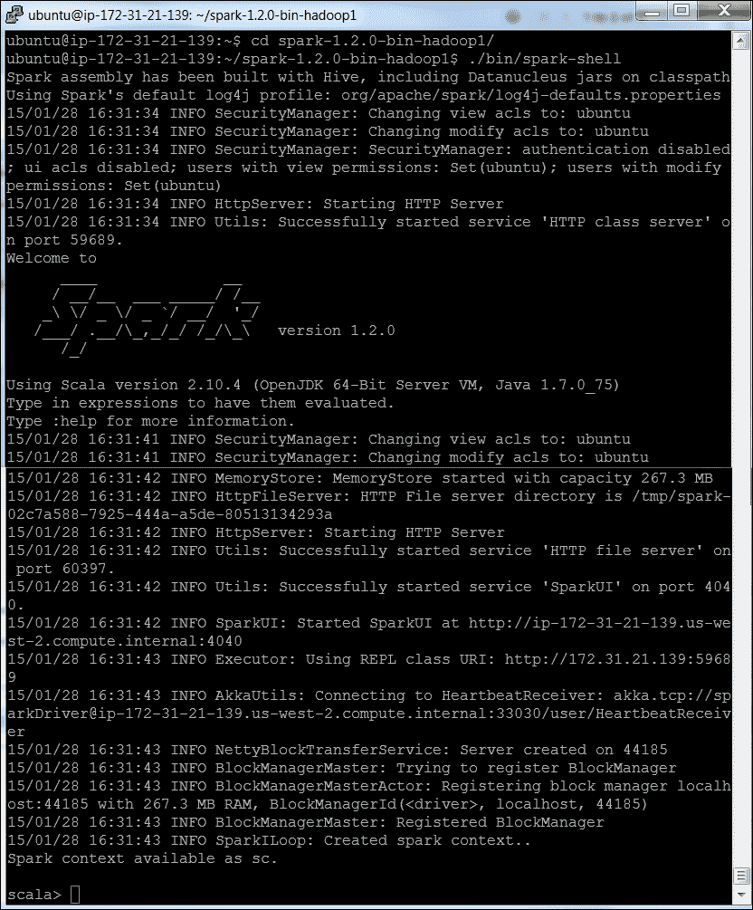

让我们来看一些 Scala 的例子。

以下代码可以直接粘贴到命令提示符中:

```
//Default variables are assigned to any expressions
scala>8 * 5 + 2
Res0: Int = 42
Scala>0.5 * res0
Res1= Double = 21.0
//All simple data types are objects
scala>"Hello, " + res0
Res2: java.lang.String = Hello, 42
scala>10.toString()
Res2: String = 10
scala>a.+(b)
Res1: Int = 200            //So you can consider , the operator as a method
A method b as a shorthand for a.method(b)
scala>val myVal: String = "Foo"
keyword "val" this means that a variable cannot change value  (immutable variable)
scala>var myVar:String = "Foo"
the keyword var means that it is a variable that can be changed (mutable variable)
scala> def cube(a: Int): Int = a * a * a
cube: (a: Int)Int
scala> myNumbers.map(x => cube(x))
res8: List[Int] = List(1, 8, 27, 64, 125, 64, 27)
scala> myNumbers.map(x => x * x * x)
res9: List[Int] = List(1, 8, 27, 64, 125, 64, 27)
scala> val myNumbers = List(1,2,3,4,5,4,3)
myNumbers: List[Int] = List(1, 2, 3, 4, 5, 4, 3)
scala> def factorial(n:Int):Int = if (n==0) 1 else n * factorial(n-1)
factorial: (n: Int)Int
scala> myNumbers.map(factorial)
res18: List[Int] = List(1, 2, 6, 24, 120, 24, 6)
scala> myNumbers.map(factorial).sum
res19: Int = 183
scala> var factor = 3
factor: Int = 3
scala> val multiplier = (i:Int) => i * factor
multiplier: Int => Int = <function1>
scala> val l1 = List(1,2,3,4,5) map multiplier
l1: List[Int] = List(3, 6, 9, 12, 15)
scala> factor = 5
factor: Int = 5
```

## 使用弹性分布式数据集编程(RDD)

rdd 是 Spark 处理数据的核心抽象。它们是不可变的分布式元素集合。Spark 中的所有功能都只能在 rdd 上运行。

Spark 自动将 rdd 中包含的数据作为分区分布在集群中的节点上，并支持在这些节点上执行并行处理。rdd 可以通过从外部数据集导入或在驱动程序中分发集合来创建。以下命令演示了此功能:

```
scala> val c = file.filter(line => line.contains("and"))
```

`collect()`方法将把输出写到控制台:

```
scala>c.collect()
```

结果的输出通常保存到外部存储系统。`count()`函数给出输出行数。下面将打印出这些行:

```
scala>println("input had " + c.count() + " lines")
```

`take()`函数将从结果中获取 *n* 条记录:

```
scala>c.take(10).foreach(println)
```

Spark 以惰性的方式处理 RDDs，以提高处理大型数据集的效率。

要在多个动作中重用 RDD，可以使用`RDD.persist()`让 Spark 持久化它。

我们可以要求 Spark 将我们的数据保存在不同的地方。在第一次计算之后，Spark 会将 RDD 内容存储在内存中(跨集群中的机器进行分区),并在将来的操作中重用它们。

因此，以下是处理 rdd 的基本步骤:

1.  从外部数据创建输入 rdd。
2.  使用转换来转换它们以定义新的 rdd，例如`filter()`。
3.  使用`persist()`存储中间 rdd 以备再次使用。
4.  调用任何需要的函数(如`count()`)启动并行计算过程。

下面是一个RDD 在 Scala 中使用 Pi 估算的例子:

```
scala>var NUM_SAMPLES=5
scala> val count = sc.parallelize(1 to NUM_SAMPLES).map{i =>
     | val x = Math.random()
     | val y = Math.random()
     |  if (x*x + y*y < 1) 1 else 0
     | }.reduce(_ + _)
scala>println("Pi is roughly " + 4.0 * count / NUM_SAMPLES)
```


# 春 XD

虽然这本书不包括演示机器学习算法的 Spring XD 框架，但这里给出了一个小的介绍，因为这是在机器学习世界中迅速出现的。

XD 代表极端数据。这个开源框架由 Pivotal 团队(前身为 SpringSource)构建，作为开发和部署大数据应用的一站式商店。

Spring XD 是一个分布式、可扩展的框架，它统一了实时、批量的数据接收和分析功能，并支持数据导出。Spring XD 建立在 Spring Integration 和 Spring Batch 框架之上。

以下是一些关键特性:

*   Spring XD 是批处理和流工作负载的统一平台。它是一个开放的、可扩展的运行时。
*   它是一个可扩展的高性能分布式数据接收框架，可以从包括 HDFS、NOSQL 或 Splunk 在内的各种来源接收数据。
*   它支持在摄取时进行实时分析，例如收集指标和计算值。
*   它通过批处理作业进行工作流管理，包括与标准 RDBMS 和 Hadoop 系统的交互。
*   这是一种可扩展的高性能数据导出，例如，从 HDFS 到 RDBMS 或 NoSQL 数据库。

众所周知，Spring XD 实现了 Lambda 架构，该架构在理论上被定义为支持批处理和实时处理。关于 Lambda 架构等进化架构的更多信息，请参见[第 14 章](ch14.html "Chapter 14. New generation data architectures for Machine learning")、*机器学习的新一代数据架构*。

Spring XD 架构主要有三个架构层来帮助促进前面的特性:

1.  **速度层**:这是关于实时访问和处理数据的。这一过程使系统保持最新。
2.  **批处理层**:批处理层可以访问完整的主数据集，也称为数据湖，意思是*真实的来源*。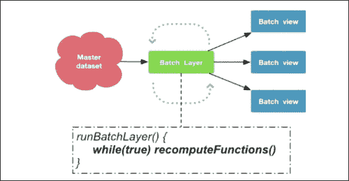
3.  **服务层**:服务层更像是一个查询层，负责向未订阅的消费者公开数据后处理。这一层使得批量数据可查询，并且通常以高吞吐量驱动的响应而闻名。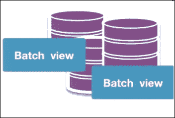

这里显示了 Spring XD 运行时架构(source Pivotal):

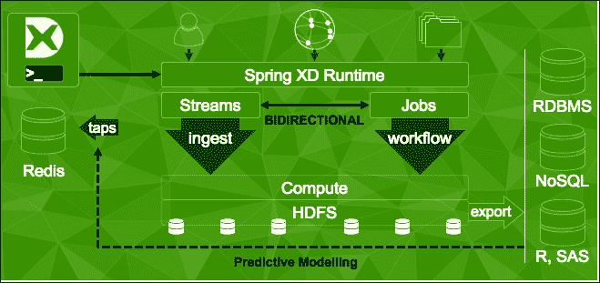<title>Summary</title>

# 总结

在本章中，我们了解了实现机器学习的开源选项，并涵盖了库、工具和框架(如 Apache Mahout、Python、R、Julia 和 Apache Spark 的 MLib)的安装、实现和执行。重要的是，我们讨论了这些框架与大数据平台(Apache Hadoop)的集成。本章更多的是为后面的章节打下基础，在后面的章节中我们将学习如何使用这些框架来实现特定的机器学习算法。