# 第六章。基于实例和核方法的学习

在前一章中，我们已经介绍了解决分类和回归问题的决策树模型。在这一章中，我们将介绍监督和非监督学习技术的两个重要模型，即最近邻方法，它使用基于实例的学习模型，以及 **支持向量机** ( **SVM** )模型，它使用基于核方法的学习模型。对于这两种方法，我们将学习技术的基础，并了解如何在 Apache Mahout、R、Julia、Apache Spark 和 Python 中实现它。下图描述了本书中涵盖的不同学习模型，本章将讨论重点介绍的技术。

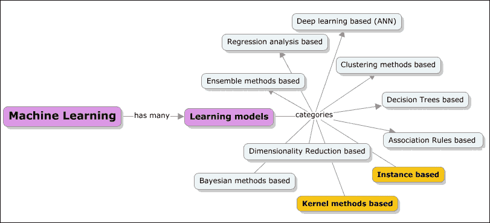

本章深入介绍了以下主题:

*   基于实例的学习模型
*   基于实例的学习简介
*   懒而好学
*   简要介绍基于实例的学习技术的不同算法/方法最近邻法、基于案例的推理、局部加权回归和径向基函数
*   通过一个真实的用例示例深入研究 KNN(k-最近邻)算法；加速 KNN 的机制
*   Apache Mahout，R，Apache Spark，Julia 和 Python (scikit-learn)库和模块的示例实现
*   基于内核的学习模型

    *   基于内核的学习简介
    *   简要介绍基于内核的学习技术的不同算法/方法、支持向量机(SVM)、线性判别分析(LDA)以及更多内容
    *   通过真实的用例示例

    深入探讨 SVM 算法

# 基于实例的学习(IBL)

IBL 技术通过简单地存储所提供的训练数据并将其用作预测/确定新查询行为的参考来进行学习。正如在[第一章](ch01.html "Chapter 1. Introduction to Machine learning")、*机器学习介绍*中所了解到的，实例只不过是数据集的子集。基于实例的学习模型在对问题至关重要的已识别实例或实例组上工作。跨实例的结果被比较，并且还可以包括新数据的实例。这种比较使用特定的相似性度量来寻找最佳匹配和预测。由于它使用存储在内存中的历史数据，这种学习技术也被称为基于记忆或基于案例的学习。这里，重点是实例的表示和用于它们之间比较的相似性度量。

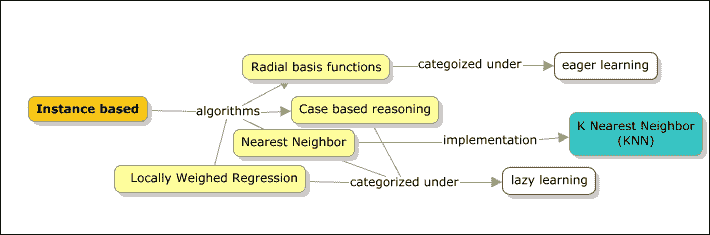

每次接收到新的查询实例进行处理时，都会从内存中检索一组相似的相关实例，然后使用这些数据对新的查询实例进行分类。

基于实例的学习者也被称为懒惰学习者。总的来说，整个数据库用于预测行为。被称为**邻居** 的一组数据点被识别，具有与目标属性一致的历史。一旦形成数据点的邻域，邻居的偏好被组合以产生活动目标属性的预测或 **top-K 推荐** 。

这些方法适用于复杂的目标函数，这些函数可以用不太复杂的局部近似来表示。不幸的是，使用这些方法，对新实例进行分类的成本总是很高，并且在存在维数灾难的情况下，这些方法最终可能会占用更大的空间，因为所有实例的所有属性都要考虑。分类器和回归是我们将在本章和接下来的章节中讨论的内容。通过分类器，我们试图预测一个类别，通过回归，我们预测一个实数。我们首先来看看最近邻算法，它既可以用于分类问题，也可以用于回归问题。

机械学习器是基于实例的分类器之一，专注于记忆整个训练数据。仅当目标属性值与训练示例中的属性值完全匹配时，才主要进行分类。另一个分类器是最近邻分类器，它基于最近邻进行分类。在下一节中，让我们深入研究最近邻算法。

## 最近邻居

在我们开始了解最近邻算法是怎么回事之前，先来举个例子；下图显示了数据点 *X* 和 *Y* 的绘图，它们有两类:星形和三角形。让我们不要担心确切的数据表示或数据点是什么。如果我们必须直观地解决这个问题，找到那个特定的红色方块数据点是什么，那么答案显然是一个绿色三角形。这是一种直觉，在没有真正理解或分析数据点的情况下，我们可以得出这个结论。但这里实际发生的是，我们已经看到了上下文中数据点的邻居的特征，并预测了新数据点可能属于的类别。总的来说，学习算法的基础实际上是附近或邻近点的行为。

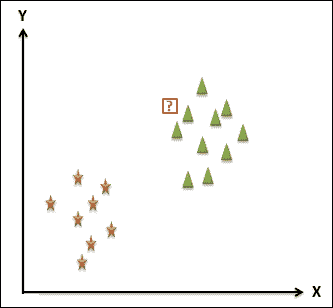

最近邻是一种算法，使用这种直觉的基本技术。该算法使用一些距离测量技术来寻找最近的邻居，这些技术将在下面的部分中讨论。现在让我们将其扩展到另一个示例数据集；同样，带问号的新数据点(？)进行分类。

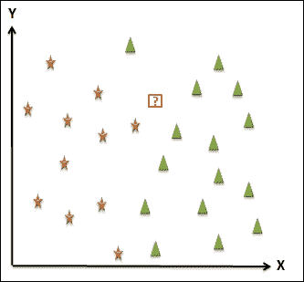

现在让我们假设新的数据点所属的类是黄星。距离测量的一个重要方面是，最近邻绝不仅仅是一个点，而通常是一个区域。下图显示了一个区域，该区域中的所有数据点都属于黄色星形。这个区域被称为 **Voronoi 单元**。如果使用的距离度量是 **欧几里德**距离度量，则该区域通常是具有直线的多边形。

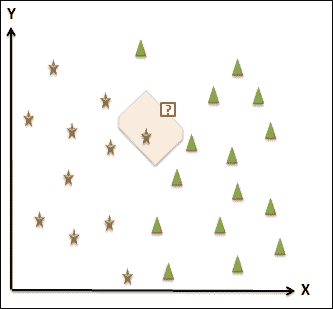

对于每个训练示例，如果 Voronoi 单元被计算，我们可以看到 Voronoi 镶嵌，如下所示。这种镶嵌表示将空间分割成非重叠区域，通常每个区域都有一个示例。

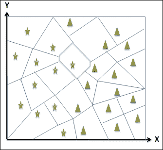

单元格的大小由可用示例的数量决定。例子越多，区域越小。Voronoi 镶嵌的另一个有趣的方面是可以雕刻边界，形成类的分离，如下图所示。粗线右边属于三角形类，左边属于星形类。

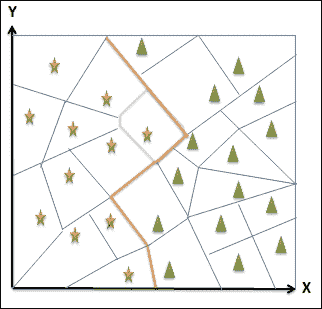

最近邻方法的主要复杂性之一是其对异常值的不敏感性，从而真正混淆了边界，解决这个问题的一种方法是考虑多个邻居，这将使模型更加稳定和平滑。因此，考虑 k 近邻意味着 k 近邻算法。

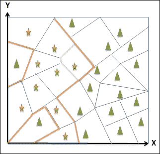

现在让我们看看 KNN 分类算法是如何工作的:

给定 *{x [i] ，y [i] }* 训练示例，其中 *x* [i] 表示属性值， *y* [i] 表示类别标签，并且有一个新的测试点 *X* 需要分类，在 KNN 分类算法中执行以下步骤:

1.  对于*x*I 的每个给定值，计算 *x* 和*x*I 之间的距离。
2.  选择 k 个最近邻 *xi1，… xik* 和各自的类标签 *yi1，… yik* 。
3.  返回标签列表 *yi1，… yik* 中最频繁出现的一个 *y* 。

现在让我们来看看 KNN 回归算法在这些重要差异中的不同之处。我们不是输出一个类，而是输出像收视率或年龄等实数。算法是相同的，但唯一的变化是返回值，步骤 3，而不是最频繁的值，我们取的是 *y 的*的平均值。

### KNN k 值

*k* 的值对 KNN 性能有巨大的影响。如果 *k* 的值太大，KNN 算法会使用之前的值，因此可能会导致不准确。在 *k* 值太小的情况下，模型会变得对异常值过于敏感，正如我们在上一节中看到的。因此，准确的 *k* 值通常位于最小和最大值的中间。方法是在此范围内选择一个值，测量训练数据的误差，并选择一个给出最佳泛化性能的 *k* 。

下图描绘了点 *x* 的 1、2 和 3 个最近邻:

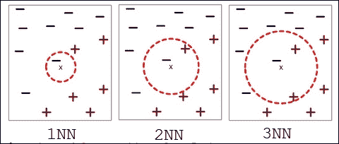

点 *x* 的 k-最近邻居是与 *x* 距离最小的所有数据点。

### KNN 的距离度量

这是最近邻算法的属性之一，也可能是唯一可以实验或尝试替代方法的领域。有许多距离测量选项，在本节中，我们将讨论一些常用的测量方法。距离度量的主要目的是识别相似或不相似的示例。类似于 k 值，距离度量决定了 KNN 的性能。

#### 欧几里德距离

欧几里德距离是数字属性的默认选项。这里给出了距离测量公式:

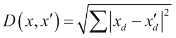

欧几里得距离度量是对称的和球形的，并且平等地对待所有维度。这种方法的一个缺点是它对单个属性中的极值非常敏感。这类似于均方误差。

#### 海明距离

如果我们需要处理分类属性，那么汉明距离度量是一个默认选项。汉明距离度量的主要功能是检查这两个属性是否相等。当它们相等时，距离为 0，否则为 1；实际上，我们检查两个实例之间的属性数量。汉明距离度量的公式如下所示:

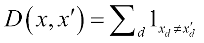

不同的属性以不同的尺度衡量，需要对属性进行规范化。

#### 闵可夫斯基距离

我们现在将看一下*p*-范数距离度量族，它是欧几里德距离度量的推广。这些措施相对来说相当灵活。

闵可夫斯基距离公式看起来与欧几里得相似，如下所示:

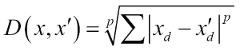

如果 *p=0* ，距离测量就是汉明测量。

如果 *p=1* ，则距离度量为曼哈顿度量。

如果 *p=2* ，则距离测度为欧几里德测度。

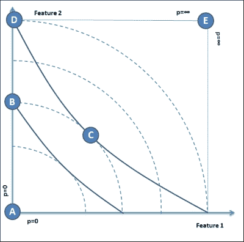

### 基于案例的推理

CBR 是一种高级的基于实例的学习方法，用于更复杂的实例对象。除了有一个过去案例的固定数据库之外，CBR 还积累和存储分类的新数据。与所有其他基于实例的学习方法一样，CBR 通过匹配新案例来找到相似的过去案例。在这种情况下，应用基于语义网的距离度量来匹配数据。这是一种图形匹配方法，不同于其他方法，如欧几里德距离测量。

类似于其他基于实例的学习方法，CBR 是一个懒惰的学习者，其动力来自于案例的组织和内容。

重用过去的案例是人类解决问题和推理工作的关键因素之一。由于 CBR 是以人类解决问题为模型的，所以对人类来说更容易理解。这意味着 CBR 的工作方式可以由专家或专家咨询来改变。

由于 CBR 能够处理非常复杂的情况，因此它经常被用于医学诊断，以检测心脏病、听力缺陷和其他相对复杂的情况。下图描绘了一个典型的 CBR 学习流程，被称为著名的 R4 模型。

机器学习中的懒惰学习就是将超出训练数据的泛化过程延迟到查询时。好处是我们现在可以执行并行处理，而坏处是更高的内存需求。下图显示了 CBR 功能的流程:

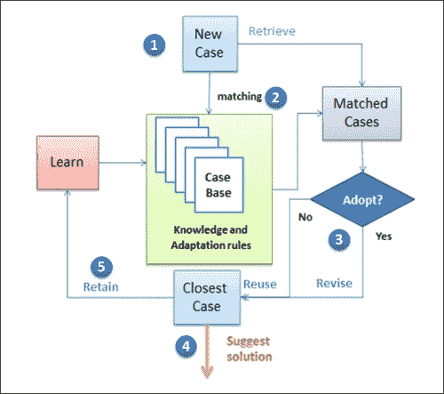

1.  首先，接收一个新的案例。
2.  然后，触发匹配过程，将接收到的案例与具有现有案例和已分类案例的案例库进行匹配。这是检索过程。
3.  检查匹配的案例是否完全符合新案例。
4.  如果是，重用它，否则修改它。
5.  输出最终推荐的解决方案。
6.  在稍后的时间点，根据事实，如果建议是一致的，保留学习内容并添加到案例库中。学习阶段也可能向知识库中添加最终事实所建议的规则。

### 局部加权回归(LWR)

LWR 是线性回归的一个特殊案例，由于噪声，数据集不再是线性的，并且线性回归会对训练数据进行欠拟合。通过向最近的邻居分配权重来解决非线性问题。对于更接近需要预测的数据的数据点，分配的权重通常更大。

## 实现 KNN

参考本章提供的用于实现 k-最近邻算法的源代码(该技术的每个文件夹下的源代码路径 `.../chapter6/...`)。

### 使用 Mahout

参见文件夹`.../mahout/chapter6/knnexample/`。

### 使用 R

参见文件夹`.../r/chapter6/knnexample/`。

### 使用火花

参考到文件夹`.../spark/chapter6/knnexample/.`

### 使用 Python (scikit-learn)

参见文件夹`.../python scikit learn/ chapter6/knnexample/`。

### 利用朱丽亚

参见文件夹`.../julia/chapter6/knnexample/`。

# 基于核方法的学习

我们刚刚看到了什么是基于实例的学习方法，我们已经深入研究了最近邻算法，并涵盖了具体的实现方面。在这一节中，我们将研究内核和基于内核的机器学习算法。

简而言之，核是输入到机器学习算法中的相似性函数。它接受两个输入，并表明它们有多相似。例如，如果我们有一个分类图像的任务，输入数据是一个键值对(图像，标签)。因此，就流程而言，获取图像数据，计算特征，并将特征向量输入机器学习算法。但是，在相似性函数的情况下，我们可以定义一个内核函数，在内部计算图像之间的相似性，并将其与图像和标签数据一起输入学习算法。其结果是一个分类器。

标准的回归或 SVM 或感知器框架使用内核，只使用向量。为了解决这一需求，我们将机器学习算法表示为点积，以便可以使用核函数。

核比特征向量更可取。优点很多；其中一个主要原因是计算的便利性。此外，与点积相比，特征向量需要更多的存储空间。可以编写机器学习算法来使用点积，然后将它们映射到内核。这样，可以完全避免使用特征向量。这将支持我们毫不费力地使用高度复杂、高效计算且高性能的内核，而无需真正开发多维向量。

## 内核函数

让我们来了解一下内核函数到底是什么；下图用一个简单的一维例子展示了一个 1D 函数。假设给定点如下:

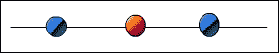

如前所述，一般的一维超平面将是一条垂直线，没有其他垂直线将数据集分开。如果我们看一下 2 维表示，如下所示，有一个超平面(2 维中的任意线)将红色和蓝色点分开，因此适合使用支持向量机进行分离。

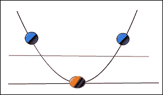

随着维度空间的增长，对能够分离数据的需求也在增加。这个映射， *x* - > ( *x* ， *x2* )，叫做内核函数。

在维空间增长的情况下，计算变得更加复杂，需要应用**内核技巧**来廉价地解决这些计算。

## 支持向量机(SVM)

支持向量机用于解决分类问题。总的来说，作为一种方法，目标是发现超平面有效地划分数据的类表示。超平面可以定义为二维直线和三维平面的推广。现在让我们举个例子来理解 SVM 是如何处理线性可分的二进制数据集的。我们将使用与最近邻算法相同的例子。下图显示了具有两个特征 *X* 和 *Y* 的数据，可用的类为三角形和星形。

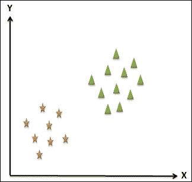

SVM 的目标是找到分隔这两类的超平面。下图描述了可以划分数据集的一些可能的超平面。最佳超平面的选择由为两类留下的最大余量的程度来定义。边缘是分类中超平面和最近点之间的距离。

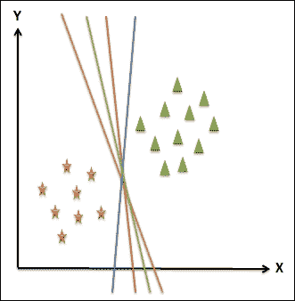

让我们从其中选取两个超平面，检查由 **M1** 和 **M2** 表示的边界。很明显，边距 **M1** > **M2** ，所以选择分离最好的超平面是绿色和蓝色平面之间的新平面。

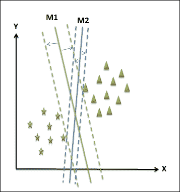

新的平面可由线性方程表示为:

f(x) = ax + b

让我们假设这个等式给出了三角形类中所有≥ 1 的值和星形类中所有≤ -1 的值。该平面与两类中最近点的距离至少为 1；模数是一。

三角形的 *f(x) ≥ 1* ，星形的 *f(x) ≤ 1* 或 *|f(x)| = 1*

超平面和该点之间的距离可以使用下面的等式来计算。

M1 = |f(x)| / ||a|| = 1 / ||a||

总余量为 *1 / ||a|| + 1 / ||a|| = 2 / ||a|* 。

为了最大化的可分性，这是 SVM 的目标，我们需要最大化 *||a||* 的值。这个值被称为权重向量。这个最小化 *a* 权重值的过程是一个非线性优化任务。一种方法是使用**卡鲁什-库恩-塔克** ( **KKT** ) 条件，使用拉格朗日乘数 *λ* [i] 。

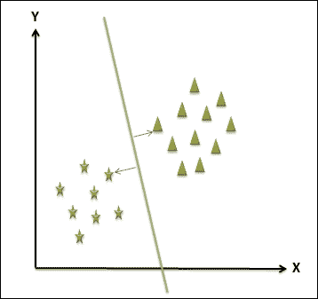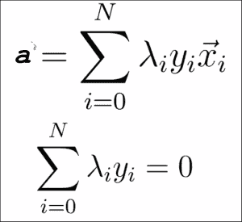

让我们以两个属性 *X* 和 *Y* 之间的两个点的为例。我们需要在这两点之间找到一个点，在这两点之间有一个最大的距离。这一要求如下图所示。最佳点用红色圆圈表示。

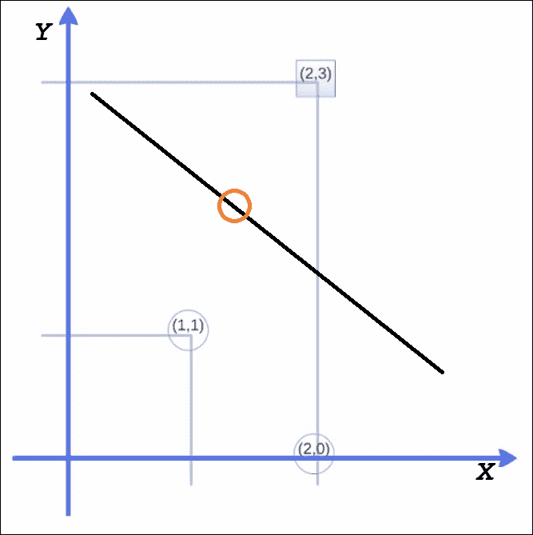

最大保证金权重向量平行于从 *(1，1)* 到 *(2，3)* 的直线。权重向量在 *(1，2)* 处，这成为穿过 *(1.5，2)* 的中间且垂直的判定边界。

因此，*y = x1+2 x2 5.5*，几何余量计算为 *√5* 。

以下是计算支持向量机的步骤:

利用 *w = (a，2a)* 对于 *a* ，点(1，1)和(2，3)的函数可以表示如下:

点(1，1)的 a + 2a + ω [0] = -1

点(2，3)的 2a + 6a + ω [0] = 1

权重可以计算如下:

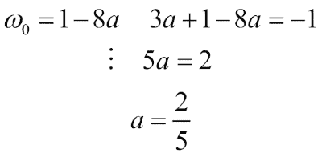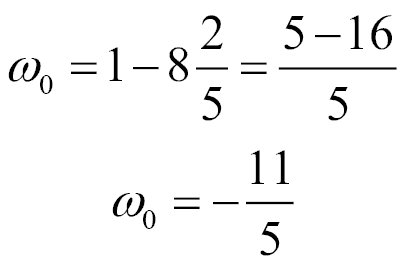

这些是支持向量:

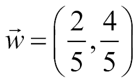

最后，最后的等式如下:

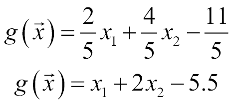

### 不可分割的数据

支持向量机可能帮助你找到一个分离超平面，如果它存在的话。可能存在无法定义超平面的情况，这可能是由于数据中的噪声造成的。事实上，另一个原因也可以是非线性边界。下面的第一张图描述了噪声，第二张图显示了非线性边界。

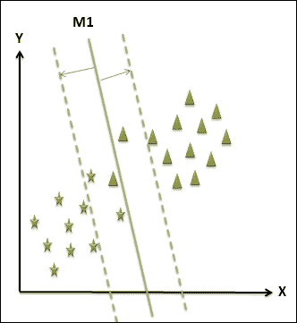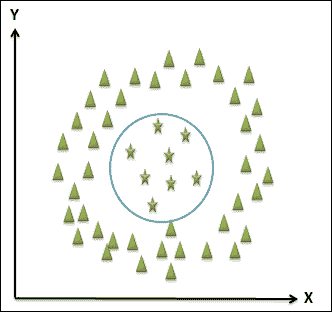

在由于数据中的噪声而产生的问题的情况下，看待它的最佳方式是减少余量本身并引入松弛。

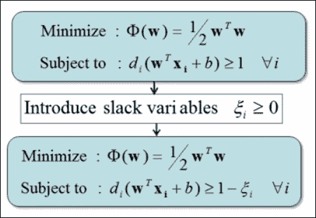

非线性边界问题可以通过引入核来解决。下图描述了一些可以引入的内核函数:

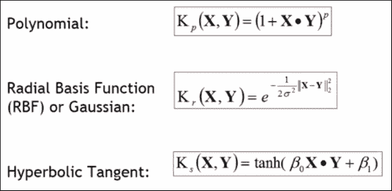

## 实施 SVM

参考本章提供的源代码实现 SVM 算法(源代码路径`.../chapter6/...`在技术的每个文件夹下)。

### 使用看象人

将参考到文件夹`.../mahout/chapter6/svmexample/`中。

### 使用 R

参见文件夹`.../r/chapter6/svmexample/`。

### 使用火花

参见文件夹`.../spark/chapter6/svmexample/`。

### 使用 Python (Scikit-learn)

将参考到文件夹`.../python-scikit-learn/chapter6/svmexample/`中。

### 利用朱莉娅

参见文件夹`.../julia/chapter6/svmexample/`。

# 总结

在这一章中，我们探讨了两种学习算法，基于实例的方法和核方法，我们已经看到了它们是如何解决分类和预测需求的。在基于实例的学习方法中，我们详细研究了最近邻算法，并了解了如何使用我们的技术堆栈 Mahout、Spark、R、Julia 和 Python 来实现它。同样，在基于内核的方法中，我们探索了 SVM。在下一章，我们将讨论基于关联规则的学习方法，重点是 Apriori 和 FP-growth 算法。