# 第七章。基于关联规则的学习

在前面的章节中，我们已经介绍了决策树、实例和基于核的监督和非监督学习方法。在前几章中，我们还探讨了这些学习算法中最常用的算法。在这一章中，我们将介绍基于关联规则的学习，尤其是 Apriori 和 FP-Growth 算法。我们将学习这种技术的基础，并获得使用 Apache Mahout、R、Julia、Apache Spark 和 Python 的实践指导。下图描述了本书涵盖的不同学习模型。橙色突出显示的技术将在本章中详细讨论。

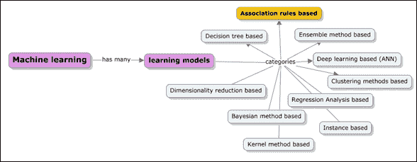

本章深入讨论了以下主题:

*   理解基于关联规则的学习模型的基础和核心原则
*   关联规则的核心用例，如购物篮问题
*   关键术语，如项目集、提升、支持度、置信度和频繁项目集，以及规则生成技术
*   深入研究基于关联规则的算法，如 Apriori 和 FP-Growth；在大数据集环境下比较 Apriori 和 FP-Growth
*   一些高级关联规则概念(如相关性和顺序规则)的概述和用途
*   Apache Mahout，R，Apache Spark，Julia 和 Python (scikit-learn)库和模块的示例实现。

# 基于关联规则学习

基于关联规则的机器学习处理寻找可用于分类和预测需求的频繁模式、关联和事务。基于关联规则的学习过程如下:给定一组交易，找出规则并使用这些规则根据交易中其他项目的出现来预测项目的出现，这就是基于关联规则的学习。下图代表了机器学习的范围:

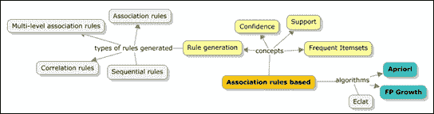

## 关联规则——一个定义

关联规则是一种模式的表示，它描述了在给定另一个事件发生的情况下，一个事件发生的概率。通常，关联规则的语法遵循 *if...然后是*将存储库中两组不相关的数据联系起来的语句。简而言之，它有助于找到经常一起使用的对象之间的关系。关联规则的目标是使用大型数据集来预测置信度大于最小置信度的规则，从而找到支持度大于最小支持度的所有项目集。使用关联规则的一个最常见的例子是市场购物篮。为了详细说明购物篮示例，如果客户购买了 iPad，他或她可能也会购买 iPad 保护套。

关联规则中使用了两个重要的标准，**支持度** 和 **置信度**。每个关联规则应该同时具有最小置信度和最小支持度。这通常是用户定义的。

现在，让我们看看什么是支持、信心和提升措施。让我们考虑前面解释的同一个例子， *If X then Y* 。其中 *X* 正在购买 iPad， *Y* 正在购买 iPad 保护套。

那么支持度被定义为 *X* 和 *Y* 在购买或交易总数中被一起购买的频率。

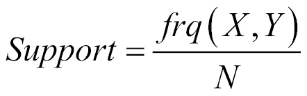

置信度可以定义为 *X* 和 *Y* 一起购买的频率超过 *X* 单独购买的频率。

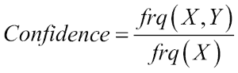

升力定义为 *X* 的支撑超过 *Y* 的支撑。

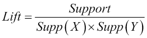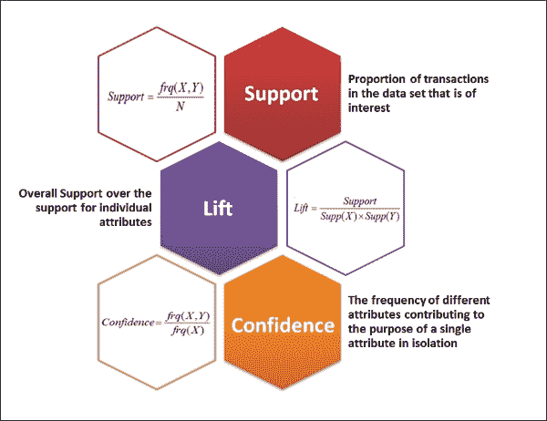

在理解这些措施的意义之前，让我们看一下在这种情况下使用的术语作为例子。称为 itemset 的仓库中的项目集合表示为 *I = { i [1] ，i [2] ，…。i [n] }* ，所有事务的集合，其中每个事务由项集的子集组成，表示为 *T = { t [1] ，t [2] ，…。t [n] }* ，其中 *t* [x] 是 *I* 的子集，具有 **唯一事务标识符** ( **UTI** )。

现在让我们用一个例子来表示项目、事务和度量。

考虑五个项目和五个交易，如下所示:

*I = {iPad(A)，iPad 保护套(B)，iPad 防刮保护套(C)，Apple care (D)，iPhone (E)}*


*T = {{ iPad，iPad case，iPad scratch guard }，{ iPad，iPad scratch guard，Apple care }，{ iPad case，iPad scratch guard，Apple care }，{ iPad，Apple care，iPhone }，{ iPad case，iPad scratch guard，iPhone }}*

下表显示了每个已识别规则的支持度、置信度和提升值。

| 

#

 | 

规则

 | 

支持

 | 

信心

 | 

电梯

 |
| --- | --- | --- | --- | --- |
| **1** | 如果购买了 iPad ( *A* )，也就购买了 iPhone ( *D* ) | 2/5 | 2/3 | 10/9 |
| **2** | 如果购买了 iPad scratch guard( *C* )，则还会购买 iPad ( *A* ) | 2/5 | 2/4 | 5/6 |
| **3** | 如果购买了 iPad ( *A* )，则还会购买 iPad 防刮擦装置( *C* ) | 2/5 | 2/3 | 5/6 |
| **4** | 如果购买了 iPad 保护套( *B* )和 iPad 防刮保护套( *C* )，那么也购买了 apple care ( *D* ) | 1/5 | 1/3 | 5/9 |

从这些项集中，基于支持度和置信度计算，可以确定频繁项集。关联规则挖掘的目标是找到满足以下标准的规则:

*   支持≥ minsup(最小支持)阈值
*   置信度≥ minconf(最小置信度)阈值

以下是频繁项集生成和挖掘关联规则所涉及的步骤:

1.  列出所有可能的关联规则。
2.  计算每个规则的支持度和置信度。
3.  删除不满足 minsup 和 minconf 阈值的规则。

这种方法被称为强力方法，并且通常被认为是计算上禁止的。

### 提示

源自同一项集的规则通常具有相同的支持度，但置信度不同。最小支持度(minsup)和最小置信度(minconf)是在问题定义陈述期间商定的值。例如，最小支持度和置信度可以分别取 75%和 85%这样的百分比值。

为了避免所有昂贵的计算，我们可以将这个过程简化为两步:

*   **频繁项集生成**:需要生成所有支持度≥ minsup 的项集
*   **规则生成**:从识别出的频繁项目集中，生成可信度最高的规则

当有五个项目时，有 32 个候选项目集。下图描述了五个项目的项目集组合: **A** 、 **B** 、 **C** 、 **D** 和 **E** :

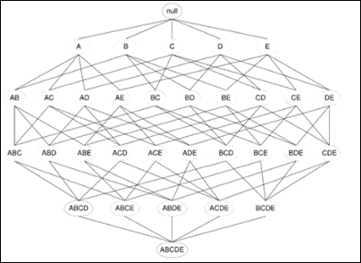

给定项目数，可能的项目集和规则数在此定义:

给定 *d* 唯一项:

*可能的项目集总数= 2*T21 d

计算全部可能关联规则的标准公式定义如下:

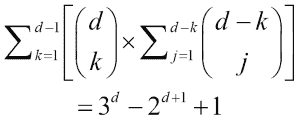

例如，如果 *d* 等于 6，那么*可能的项目集总数= 2* ^d *= 64*

因此，*可能的关联规则总数= 602 条规则*

下图展示了项目数量与可能关联规则之间的关系。

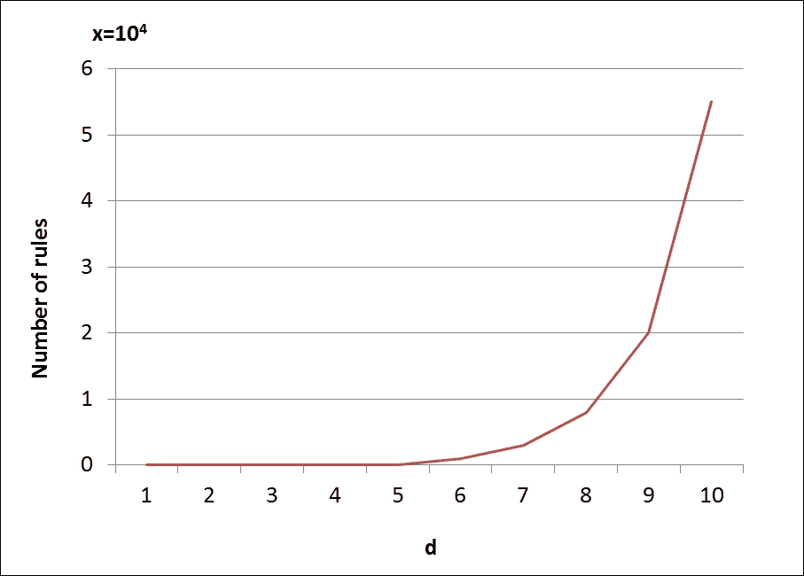

产生频繁项集和关联规则的有效方法决定了关联规则算法的效率。在下一节中，我们将详细介绍 Apriori 和 FP-Growth 算法。

## Apriori 算法

在本节中，我们将使用一个示例逐步介绍 Apriori 算法。Apriori 算法如下所示:

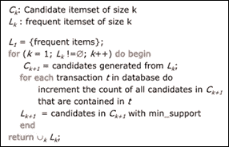

### 提示

Apriori 原则—对于所有频繁项目集，子集也必须是频繁的。

考虑这五个项目(来自上一节的示例)

*I = {iPad(A)，iPad 保护套(B)，iPad 防刮保护套(C)，Apple care (D)，iPhone (E)}* ，以及以下九个交易。让我们假设最小支持计数是 2:

| 

每日三次

 | 

机器学习环境中的目的或意义

 |
| --- | --- |
| **1** | iPad( *A* ，iPad 保护套( *B* ，iPhone( *E* ) |
| **2** | iPad 保护套( *B* )和 Apple care( *D* ) |
| **3** | iPad 保护套( *B* )和 iPad 防刮保护套( *C* ) |
| **4** | iPad( *A* ，iPad 保护套( *B* ，Apple care( *D* ) |
| **5** | iPad( *A* )和 Apple care( *D* ) |
| **6** | iPad 保护套( *B* )和 iPad 防刮保护套( *C* ) |
| **7** | iPad( *A* )和 Apple care( *D* ) |
| **8** | iPad( *A* )、iPad 保护套( *B* )、iPad 防刮保护套( *C* )和 iPhone ( *E* ) |
| **9** | iPad( *A* )、iPad 保护套( *B* )和 iPad 防刮保护套( *C* ) |

让我们使用之前的数据集调试之前的算法:

1.  Get the number of occurrences for each item from the previous transactions (*C*[1]):

    | 

    项目集

     | 

    支持计数

     |
    | --- | --- |
    | *{iPad(A)}* | 6 |
    | *{iPad 保护套(B)}* | 七 |
    | *{iPad 防刮擦板(C)}* | 6 |
    | *{苹果关怀(D)}* | 2 |
    | *{iPhone(E)}* | 2 |

    从*C*1 中确定频繁 1 项集(*L*1):

    | 

    项目集

     | 

    支持计数

     |
    | --- | --- |
    | *{iPad(A)}* | 6 |
    | *{iPad 保护套(B)}* | 七 |
    | *{iPad 防刮擦板(C)}* | 6 |
    | *{苹果关怀(D)}* | 2 |
    | *{iPhone(E)}* | 2 |

2.  生成 2—项集候选项(*C*2)并扫描数据集进行支持计数:Apple care(D)}

    | 

    项集

     | 

    支持计数

     |
    | --- | --- |
    | *{ iPad(A)}* | 1 |
    | **【iPad(A)、iPhone(E)}** | 2 |
    | *{ iPad 保护套(C) iPhone(E)}* | 2 |
    | *【iPad 防刮护板(C)，Apple care(D)}* | 0 |
    | *【iPad 防刮护板(C)，iPhone(E)}。* |

3.  从*C*[2]:

    | 

    项集

     | 

    支持计数

     |
    | --- | --- |
    | *{ iPad 案例(B) Apple care(D)}* | 2 |
    | *【iPad 保护套(B)，iPad 防刮保护套(C)}* | 4 |
    | *{ iPad 保护套(B)* |

4.  生成 3—候选项集(*C*3)。
5.  最后，扫描数据集的支持计数和频繁 3-项集标识。

这类似于前面的步骤，但是我们将演示如何基于先验原则有效地应用剪枝来识别频繁项集。首先，我们确定可能的子集项目集。然后，我们检查是否有任何子集项集不属于频繁项集列表。如果没有找到，我们排除 3-项集可能性。

| 

C3

 | 

项目集

 | 

可能的子集项目集

 |
| --- | --- | --- |
| **1** | *{A，B，C}* | *{A，B}* | *{A，C}* | *{B，C}* |
| **2** | *{A，B，D}* | *{A，B}* | *{A，D}* | *{B，D}* |
| **3** ✕ | *{A，C，D}* | *{A，C}* | *{A，D}* | {C，D} ✕ |
| **4** ✕ | *{B，C，D}* | *{B，C}* | *{B，D}* | {C，D} ✕ |
| **5** ✕ | *{B，C，E}* | *{B，C}* | {B，E} ✕ | {C，E} ✕ |
| **6** ✕ | *{B，D，E}* | *{B，D}* | ✕ | {D，E} ✕ |

在上表中，✕项集是使用 Apriori 技术修剪的，并且使用了步骤 4 中的数据(*l*2)。为了便于理解，使用项目代码 *A* 、 *B* 、 *C* 、 *D* 和 *E* 来表示项目集，而不是实际名称。3-候选项目集可以识别如下:

| 

C [3]

 | 

项目集

 | 

支持计数

 |
| --- | --- | --- |
| **1** | *{iPad(A)，iPad 保护套(B)，iPad 防刮保护套(C)}* | 2 |
| **2** | *{iPad(A)，iPad 保护套(B)，Apple care(C)}* | 2 |

因此，频繁的 3-项集是:

| 

L [3]

 | 

项目集

 | 

支持计数

 |
| --- | --- | --- |
| **1** | *{iPad(A)，iPad 保护套(B)，iPad 防刮保护套(C)}* | 2 |
| **2** | *{iPad(A)，iPad 保护套(B)，Apple care(C)}* | 2 |

1.  生成 4—候选项集(*C*4)。
2.  最后，扫描数据集的支持计数和频繁 3-项集标识( *L* [4] )。

正如我们所见，修剪到此为止，因为没有进一步的*C*C[3]选项可用。

Apriori 算法效率不高，因为它需要多次数据集扫描。但是，有一些技术可以提高效率。其中一些如下:

*   如果一个事务不包含任何频繁项集，它就没有用，也不需要参与后续的扫描
*   在数据集中频繁出现的任何项集应该至少在数据集的一个分区中频繁出现
*   采样的应用，包括具有较低支持阈值的整个数据集的子集，将产生更高的效率

### 规则生成策略

假设我们有一个频繁项集 *{A，B，C，D}* ，可能的候选规则有:

ABC→D

ABD→C

自动呼叫分配器→B

BCD→A

AB→CD

AC→BD

公元→公元前

公元前→公元

BD→AC

CD→AB

A→BCD

b→自动呼叫分配器

C→ABD

D→ABC

标准的公式是，对于频繁项集的每 k 个项，可以定义 *2k-2* 个可能的候选规则。只能保留可信度高的规则。下图描述了标记低置信度规则并删除它们:

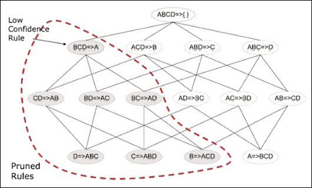

#### 定义适当最小化的规则

为基于关联规则的挖掘定义 minsup 阈值时要遵循的一些重要准则如下:

*   minsup 太高:这将导致缺少稀有项目的项目集
*   最小值太低:这将导致计算开销，因为需要更多的扫描

#### 先天的——不利的一面

现在很清楚，在 Apriori 算法中，对于每一个 *k* 项集，我们将需要使用 *(k-1)* 频繁项集，并且当数据库扫描完成时，使用模式匹配方法。主要的瓶颈是两个巨大的候选集和多次数据库扫描。让我们看一个例子——如果有 10 个 ⁴ 频繁 1-项集，那么这将导致 10 个 ⁷ 候选 2-项集。并且对于每 *n* 个项目集，需要最长的模式长度 *n + 1* 次扫描。

这个问题的解决方案是完全避免候选项集的生成，解决这个问题的一种方法是将大型数据集或数据库压缩到一个紧凑的**频繁模式树** ( **FP-tree** ) 中，这样将避免昂贵的扫描。

有几种优化先验实现的方法，下面是一些重要的方法:

*   **方法 1** — **基于 Has 的项集计数**:每 k 个项集桶都有一个阈值设置，如果该项集的项集计数低于该阈值，则不处理该桶。这反过来减少了处理时要考虑的项目集存储桶，从而提高了效率。
*   **方法 2** — **事务消除/计数**:如果一个事务不包含目标 k 项集，则该事务不具有附加值或被处理的意义。因此，这种方法是关于识别这些事务并从处理中消除它们。
*   **方法 3** — **分区**:任何在数据集中潜在频繁的项目集也需要在数据集的分区中频繁；如果没有，项目集可能会被排除在处理之外。
*   **方法 4** — **采样**:这是一种更简单的方法，可以考虑一个样本或更大的数据宇宙的一个子集，并运行挖掘过程。这将减少 k，从而减少频繁的 k 项集。
*   **方法 5** — **动态项目集计数**:这是最有效的方法之一，涉及仅当一个新项目集在其所有子集项目集中频繁出现时才包含该项目集。

虽然，有针对 Apriori 的优化技术；由于固有的昂贵扫描，它造成了低效率，这将需要解决。这就把我们带到了基于关联规则学习的下一个算法，即 **FP-growth** 算法。

## FP-growth 算法

FP-growth 算法是挖掘频繁模式以及关联规则挖掘的有效且可扩展的替代方法。它解决了 Apriori 算法会遇到的大多数性能瓶颈。它允许生成频繁项集，而不必实际生成候选项集。该算法主要有两步:

*   从称为 FP-tree 的数据库构建一个紧凑的数据结构
*   直接从 FP-树中提取频繁项集

让我们考虑我们在 Apriori 算法中使用的同一个例子。总共有五个项目(来自上一节中的示例):

*我是{iPad(A)，iPad 保护套(B)，iPad 防刮保护套(C)，Apple care (D)，iPhone (E)}* ，下面九笔交易。让我们假设最小支持计数是 2:

| 

每日三次

 | 

事务项目集

 |
| --- | --- |
| **1** | *iPad(A)、iPad 保护套(B)和 iPhone(E)* |
| **2** | *iPad 保护套(B)，Apple care(D)* |
| **3** | *iPad 保护套(B)，iPad 防刮保护套(C)* |
| **4** | *iPad(A)、iPad 保护套(B)和 Apple care(D)* |
| **5** | *iPad(A)，Apple care(D)* |
| **6** | *iPad 保护套(B)，iPad 防刮保护套(C)* |
| **7** | *iPad(A)，Apple care(D)* |
| **8** | *iPad(A)、iPad 保护套(B)、iPad 防刮保护套(C)和 iPhone (E)* |
| **9** | *iPad(A)、iPad 保护套(B)和 iPad 防刮保护套(C)* |

我们现在来看看如何为这个数据库构建一个 FP 树:

1.  Identify/calculate the minimum support count. Since it needs to be 30%, the minimum support count is calculated as follows:

    最小支持数= 30/100 * 9 = 2.7 ~ 3

2.  计算 1-项集的出现频率。此外，基于支持计数， 添加优先级:

    | 

    项集

     | 

    支持计数

     | 

    优先级

     |
    | --- | --- | --- |
    | *{ iPad(A)}* | 6 |  | 6 | 3 |
    | *{ Apple care(D)}* | 2 | 4 |
    |  |

3.  按优先级对每个事务项排序:

    | 

    TID

     | 

    事务项集

     | 

    根据优先级重新排序的项集

     |
    | --- | --- | --- |
    | **1** | iPad( *iPad( *A* )、iPhone(*E*)* |
    | **2** | iPad 保护套( *B* 、Apple care(*D*) | iPad 保护套( *B iPad 防刮保护套(*C*)* | iPad 保护套( *B* )，iPad 防刮保护套(*C*) |
    | **4** | iPad 保护套( *A* )，iPad 保护套( 还有 Apple care(*D*) |
    | **5** | iPad(*A*)*D*) | iPad(*A* iPad 防刮保护套(*C*) | iPad 保护套( *B* )，iPad 防刮保护套(*C*) |
    | **7** | iPad( *iPad 保护套( *B* )、iPad 防刮保护套( *C* )、iPhone(*E*)* | iPad 保护套( *B* )、iPad( *A* )、iPad 防刮保护套( *C* )和 iPhone(*E【T226) 以及 iPad 防刮保护套(*C*)* | iPad 保护套( *B* )、iPad( *A* )、iPad 防刮保护套(*C*) |

4.  为**=**1**的事务创建 FP-tree，有序项集为 iPad case( *B* )、iPad( *A* )、iPhone( *E* )。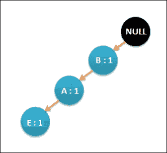**
5.  **现在，扫描数据库寻找 **TID** = **2** ，iPad 保护套( *B* )和 Apple care( *D* )。更新后的 FP-tree 将如下所示: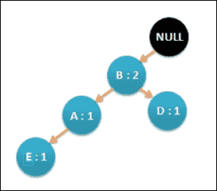**
6.  **按照 L 的顺序扫描所有的事务，并相应地更新 FP 树。最终的 FP 树如下所示。请注意，每次在事务中再次遇到一个项目时，节点上的计数值都会递增。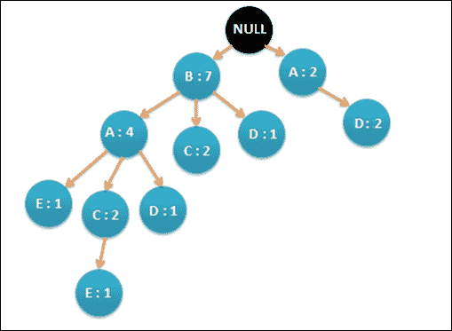**
7.  **为每个事务生成条件 FP 树，并定义条件模式库。**
8.  **最后，生成频繁模式。给定数据集的结果如下所示:

    ```
    E: {B, E: 2}, {A, E: 2}, {B, A, E: 2} D: {B, D: 2} C: {B, C: 4}, {A, C: 4}, {B, A, C: 2} A: {B, A: 4}
    ``` 

## **先验与 FP-生长**

**下图显示了不同 minsup 阈值的算法之间的关系:**

**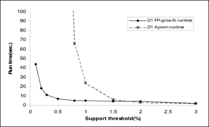

图片来源:皮尔·卢卡·子兰教授的一篇文章** 

**FP-growth 算法的优点详述如下:**

*   **频繁模式挖掘的完整信息被保留，而不会破坏长事务中的模式**
*   **通过消除不相关的信息来压缩数据，因为预先避免了不频繁的项目集**
*   **FP-growth 算法以分治模式工作，在这种模式下，数据集按照到目前为止发现的频繁项集模式进行分解。这减少了对数据集子集的搜索，而不是对整个数据库的搜索**
*   **在这种情况下，不会生成候选项目集，因此不需要对其进行测试**

**<title>Implementing Apriori and FP-growth</title>

# 实现先验和 FP-growth

参考本章提供的实现先验分类器的源代码(源代码路径`.../chapter7/...`在技术的每个文件夹下)。)

## 使用 Mahout

参考代码文件夹`.../mahout/chapter7/aprioriexample/`中的文件。

参考`.../mahout/chapter7/fpgrowthexample/`文件夹中的文件代码。

## 使用 R

参考代码文件夹`.../r/chapter7/aprioriexample/`中的文件。

参考`.../r/chapter7/fpgrowthexample/`文件夹中的文件代码。

## 使用火花

参考代码文件夹`.../spark/chapter7/aprioriexample/`中的文件。

参考代码文件文件夹`.../spark/chapter7/fpgrowthexample/`。

## 使用 Python (Scikit-learn)

参考代码文件文件夹`.../python-scikit-learn/ chapter7/aprioriexample/`。

参考代码文件文件夹`.../python-scikit-learn/chapter7/fpgrowthexample/`。

## 使用朱丽亚

参考代码文件夹`.../julia/chapter7/aprioriexample/`中的文件。

参考代码文件夹`.../julia/chapter7/fpgrowthexample/`中的文件。


# 总结

在这一章中，你已经学习了基于关联规则的学习方法以及 Apriori 和 FP-growth 算法。通过一个常见的例子，您了解了如何使用 Apriori 和 FP-growth 算法进行频繁模式挖掘，并对算法进行了逐步调试。我们还比较和对比了这些算法及其性能。我们有使用 Mahout、R、Python、Julia 和 Spark 实现 Apriori 的例子。在下一章，我们将讨论贝叶斯方法，特别是朴素贝叶斯算法。**