# 第八章。基于聚类的学习

在本章中，我们将介绍基于聚类的学习方法，尤其是 k-means 聚类算法。基于聚类的学习是一种无监督的学习技术，因此在没有目标属性的具体定义的情况下工作。您将学习这种技术的基础和高级概念，并获得使用 Apache Mahout、R、Julia、Apache Spark 和 Python 实现 k-means 聚类算法的实践指导。

下图描述了本书中涵盖的不同学习模型，橙色中突出显示的技术将在本章中详细讨论:

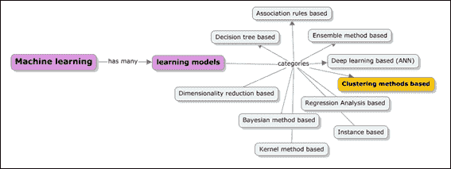

本章将深入介绍下面列出的主题:

*   基于聚类的学习方法的核心原则和目标
*   如何表示集群并理解所需的距离测量技术
*   深入学习 k-means 聚类，选择合适的聚类算法和聚类评价规则。更重要的是，选择正确的集群数量。
*   分层聚类、数据标准化、发现漏洞和数据区域概述。
*   使用 Apache Mahout、R、Apache Spark、Julia 和 Python (scikit-learn)库和模块的示例实现。

# 基于聚类的学习

基于聚类的学习方法被认为是一种无监督的学习任务，其中学习从头脑中没有特定的目标属性开始，并且以发现数据中的内在结构为目标来探索数据。

下图显示了本章将涉及的基于聚类的学习方法的范围:

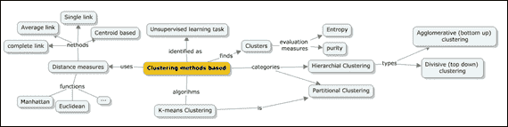

聚类技术的主要目标是在数据中找到相似或同质的组，这些组被称为 **簇**。其实现方式是，将相似的或彼此接近的数据实例分组到一个群集中，而将不同的实例分组到另一个群集中。下图显示了图表上数据点的描述，以及三个自然聚类如何标记聚类(在这里，这是纯粹的直觉):

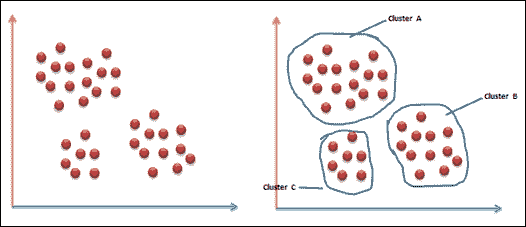

因此，聚类可以被定义为彼此相似但与另一个聚类的对象不相似的对象的集合。下图描述了群集过程:

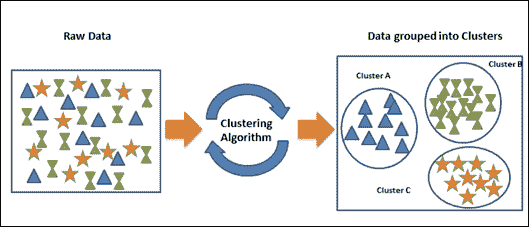

聚类的一些简单例子如下:

*   衬衫根据尺码分为小号(S)、中号(M)、大号(L)、特大号(XL)等
*   目标营销:根据相似性对客户进行分组
*   对文本文档进行分组:这里的要求是组织文档，并根据它们内容的相似性建立主题层次结构

事实上，聚类技术被广泛应用于许多领域，如考古学、生物学、市场营销、保险、图书馆、金融服务等。

# 聚类的类型

聚类分析是一种算法，可以用来在给定数据的情况下自动找到聚类。主要有两类聚类算法；它们如下:

*   层次聚类算法
*   划分聚类算法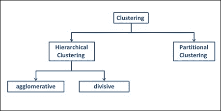

分层聚类分析算法定义具有层次结构的聚类，而分区聚类分析算法定义将数据集划分为互不相交的分区的聚类。

## 层次聚类

层次聚类是关于定义具有层次的聚类，而这是通过迭代地将较小的聚类合并成较大的聚类或将较大的聚类划分成较小的聚类来完成的。这种由聚类算法产生的聚类层次被称为 **树状图**。树形图是可以表示分层聚类的方式之一，并且用户可以基于树形图被定义的级别来实现不同的聚类。它使用相似性尺度来表示从较大的分类中分组的分类之间的距离。下图描述了分层聚类的树形图表示:

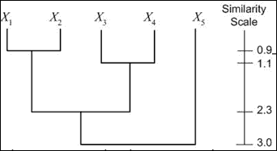

还有另一种简单的方法来表示层次聚类；也就是文氏图。在这个表示中，我们圈出了属于聚类的数据点。下图描述了五个数据点的文氏表示法:

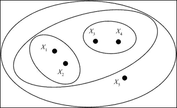

分层聚类中有两种聚类算法:凝聚聚类算法和分裂聚类算法。

凝聚聚类算法使用自底向上的方法，将一组聚类合并成一个更大的聚类。分裂聚类算法使用自顶向下的方法，将一个聚类分成子聚类。使用贪婪方法来确定哪个聚类将被考虑用于合并或分裂，并且距离测量在这里变得至关重要。让我们快速回顾一下[第六章](ch06.html "Chapter 6. Instance and Kernel Methods Based Learning")、*基于实例和内核方法的学习*中的基于实例的学习方法。我们已经介绍了欧几里德距离、曼哈顿距离和余弦相似性，作为数值数据最常用的相似性度量，以及非数值数据的汉明距离。对于层次聚类，不需要实际的数据点。只有距离度量矩阵是足够的，因为分组是基于距离完成的。

分层聚类算法的步骤可以定义如下:

1.  从集群开始，比如 *S1={X1}，S2={X2} … Sm= {Xm}* 。
2.  找到一组最近的聚类，并将它们合并成一个聚类。
3.  重复步骤 2，直到形成的簇的数量等于定义的数量。

## 分割聚类

分区聚类算法与分层聚类算法相比有所不同，因为聚类或分区是使用特定领域的特定预定义标准生成和评估的。因为形成的每个集群都是互斥的，所以集群之间不可能有层次关系。事实上，每个实例都可以放在并且只能放在一个 *k* 集群中。要形成的簇的数量( *k* )被输入到该算法，并且这一组 *k* 簇是划分簇算法的输出。我们将在本章中讨论的最常用的划分聚类算法之一是 k-means 聚类算法。

在我们深入研究 k-means 聚类算法之前，让我们先快速定义一下。利用表示预期聚类数量的输入 *k* ，将定义 *k* 个中心或质心，这将有助于定义 *k* 个分区。基于这些中心(质心)，该算法识别成员，从而建立分区，然后基于所识别的成员重新计算新的中心。重复这个过程，直到暴露出使分区真正惟一的清晰的、最优的相异之处。因此，质心的准确性是基于划分的聚类算法成功的关键。以下是基于质心的划分聚类算法中涉及的步骤:

输入: *k* (聚类数)和 *d* (带有 *n* 个对象的数据集)

输出:一组 *k* 聚类，这些聚类最小化所有对象相对于所识别的中间点(质心)的不相似性的总和

1.  将 *k* 个对象标识为第一组质心。
2.  指定最靠近质心的剩余对象。
3.  随机选择一个非质心对象，并重新计算将要交换的总点数，以形成一组新的质心，直到不再需要交换。

层次聚类和划分聚类技术在许多方面有本质的区别，其中一些包括一些基本假设；执行时间假设、输入参数和结果集群。通常，分区聚类比层次聚类更快。虽然层次聚类可以单独使用相似性度量，但是分区聚类需要多个聚类和初始中心周围的细节。分层聚类不需要任何输入参数，而分区聚类算法需要一个输入值来指示开始运行所需的聚类数。分级聚类技术的聚类定义更加主观，而分区聚类导致精确的“k”聚类。

### 提示

聚类的质量取决于所选择的算法、距离函数和应用。当组间距离*最大化、*并且组内距离*最小化*时，组质量被认为是最好的。

# k-means 聚类算法

在本节中，我们将深入讨论 k-means 聚类算法。k-means 是一种分区聚类算法。

假设数据点(或实例)集合如下:

*D = {x* [1] *，x* [2] *，…，x* [n] *}* ，其中

*xi = (xi* [1] *，* [2] *，…，xi* [r] *)* ，是实值空间中的一个向量 *X ⊆ R* [r，]和 *r* 是数据中属性的个数。

k-means 算法将给定的数据划分为 *k* 个聚类，每个聚类都有一个称为质心的中心。

*k* 由用户指定。

给定 *k* ，k 均值算法工作如下:

算法 k-means ( *k* ， *D* )

1.  将 *k 个*数据点标识为初始质心(聚类中心)。
2.  重复步骤 1。
3.  对于每个数据点 *x ϵ D* do。
4.  计算从 *x* 到质心的距离。
5.  将 *x* 分配给最近的质心(一个质心代表一个簇)。
6.  结束
7.  使用当前聚类成员重新计算质心，直到满足停止标准。

## k 均值聚类的收敛或停止准则

下表描述了 k-means 聚类算法的收敛标准:

*   数据点到不同聚类的重新分配次数为零或最小
*   质心的变化为零或最小
*   否则， **预测的误差平方和** ( **SSE** )的减少最小

如果*C[j]是第*j*第个聚类，那么*m*j 是聚类*C*j(C*j 中所有数据点的平均向量)的质心，如果 *dist(x，m*j

例如:

1.  随机 k 个中心的识别:
2.  迭代 1:计算质心并分配聚类: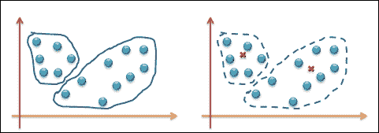
3.  迭代 2:重新计算质心并重新分配集群: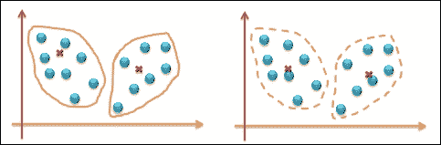
4.  迭代 3:重新计算质心并重新分配簇:
5.  由于质心或群集重新分配的最小变化，终止过程。

### 磁盘上的 K-均值聚类

k-means 聚类算法也可以用磁盘上的数据实现。这种方法用于内存无法容纳的大型数据集。这里使用的策略是通过每次迭代只扫描数据集一次来递增地计算质心。该算法的性能取决于迭代次数的控制程度。建议运行一组有限的迭代，少于 50 次。虽然这个版本有助于扩展，但它不是扩展的最佳算法；还有其他可扩展的聚类算法，例如 BIRCH 就是其中之一。以下算法描述了磁盘 k-means 算法中的步骤:

算法盘 k 均值( *k* ， *D* )

1.  选择 *k* 个数据点作为初始质心(聚类中心) *m* [j] ，其中 *j = 1，2，3…k* 。
2.  重复
3.  初始化*s*[j]*= 0*，其中 *j=1，2，3…k*；(全是零值的向量)。
4.  初始化*n*j= 0，其中 *j=1，2，3…k*；(n [j] 是集群中的编号点)，
5.  对于每个数据点 *x ϵ D* do。
6.  *j = arg min dist(x，m*j*)*。
7.  将 *x* 分配给组合 *j* 。
8.  *s*j= sj+x。
9.  *n*[j]*= n*j+1。
10.  结束了。
11.  *m*[I]*= s*[j]*/n*[j]，其中 *i=1，2，…k.*
12.  直到停止，满足标准。

## k 均值方法的优势

无监督学习的 k-means 方式好处多多；其中一些如下:

*   k-means 聚类因其简单和易于实现而流行并被广泛采用。

它是高效的，具有由 *O* ( *ikn* 定义的最优时间复杂度，其中 *n* 为数据点的个数， *k* 为聚类个数， *i* 为迭代次数。由于 *l* 和 *k* 值保持较小，k 均值聚类也可以表示线性表达式。

## k-means 算法的缺点

以下是 k-means 算法的缺点或劣势:

*   *k* 的值始终是用户输入，并且与识别的数字*k*一样好
*   该算法仅在均值可用时适用，并且在分类数据的情况下，质心正是频繁值。
*   星团永远不可能是椭圆形的，而总是超球形的。
*   所识别的聚类对最初识别的种子非常敏感，并且在涉及不同随机种子的情况下运行多次时会有所不同。下图描述了两个不同的质心如何改变簇。这可以通过迭代处理来实现: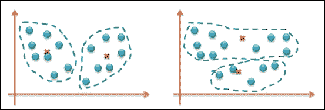
*   同样，k-means 对异常值非常敏感。异常值可能是数据记录中的错误或一些具有非常不同值的特殊数据点。下图描述了异常值可能给聚类形成带来的偏差。第一个表示显示理想的集群，第二个表示显示不理想的集群: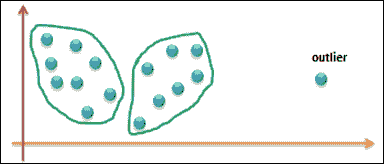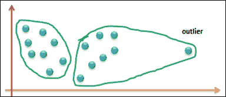

到目前为止，我们看到的许多算法和学习技术对异常值很敏感。可以采用一些标准技术。

一种方法是从评估中过滤出异常值，这需要我们应用一些技术来处理数据中的噪声。降噪技术将在接下来的章节中介绍。在 k-means 聚类的情况下，可以在几次迭代之后去除异常值，以确保识别的数据点确实是异常值。或者，另一种方法是坚持使用较小的数据样本来运行算法。这样，选择一个异常值的可能性将是最小的。

## 距离测量

距离度量在聚类算法中是非常重要的。通过重新定义质心来确定将数据点重新分配给聚类。以下是测量两个集群之间距离的一些方法:

*   **单链**:这种方法是指测量属于两个不同聚类的两个最近数据点之间的距离。数据中可能存在噪声，这也是需要认真考虑的。
*   **完全链接**:这种方法是指测量属于两个不同聚类的两个最远数据点之间的距离。这种方法可以使聚类对异常值更加敏感。
*   **平均链接**:这个方法使用两个聚类之间所有距离对的平均距离度量。
*   **质心**:这种方法是指通过测量两个簇的质心之间的距离来测量两个簇之间的距离。

## 复杂性度量

选择最佳的聚类算法一直是一个挑战。有许多可用的算法，准确性和复杂性度量对于选择正确的算法都很重要。单链方法可以帮助实现*O(N2)*；完整和一般的链接可以在 *O(n2logn)* 里做。每种算法都有优点和局限性，它们在特定的数据分布环境中工作得很好；数据分布中没有标准模式，这使它成为一个复杂的问题。因此，数据准备和标准化成为机器学习的一个重要方面。哪种距离度量是理想的选择只能通过迭代地实现不同的距离度量并比较迭代的结果来确定。总体而言，聚类方法高度依赖于初始选择，并且可能是主观的。

# 实现 k 均值聚类

参考本章提供的用于实现 k-means 聚类方法的源代码(仅监督学习技术-该技术的每个文件夹下的源代码路径`.../chapter08/...`)。

## 使用看象人

将参考到文件夹`.../mahout/chapter8/k-meansexample/`中。

## 使用 R

参见文件夹`.../r/chapter8/k-meansexample/`。

## 使用火花

参见文件夹`.../spark/chapter8/k-meansexample/`。

## 使用 Python (scikit-learn)

参见文件夹`.../python-scikit-learn/chapter8/k-meansexample/`。

## 利用朱丽亚

参见文件夹`.../julia/chapter8/k-meansexample/`。

# 总结

在这一章中，我们已经介绍了基于聚类的学习方法。我们通过一个例子深入研究了 k-means 聚类算法。您已经学会了使用 Mahout、R、Python、Julia 和 Spark 实现 k-means 聚类。在下一章，我们将讨论贝叶斯方法，特别是朴素贝叶斯算法。