# 九、贝叶斯学习

在本章中，我们将回头讨论一种重要的基于统计的学习方法，称为贝叶斯方法学习，尤其是朴素贝叶斯算法。统计模型通常具有显式概率模型，其揭示了在解决分类问题时实例属于特定类别而不仅仅是分类的概率。在深入学习贝叶斯学习之前，您将学习统计学中的一些重要概念，如概率分布和贝叶斯定理，这是贝叶斯学习的核心。

贝叶斯学习是一种受监督的学习技术，其目标是建立一个具有目标属性具体定义的类标签分布模型。朴素贝叶斯基于应用贝叶斯定理和每对特征之间独立的*朴素*假设。

您将学习这种技术的基础和高级概念，并获得使用 Apache Mahout、R、Julia、Apache Spark 和 Python 实现均值聚类算法的实践指导。

下图描述了本书中涵盖的不同学习模型，本章将详细讨论突出显示的技术:

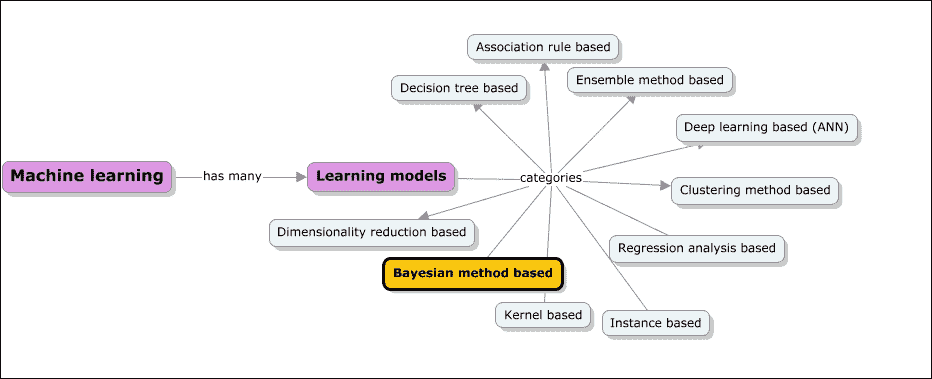

本章将深入介绍此处列出的主题:

*   贝叶斯统计的概述以及概率、分布和其他相关统计测量的核心原则或概念
*   贝叶斯定理及其机制
*   深入探讨朴素贝叶斯算法和朴素贝叶斯分类器的变体，如多项式和伯努利分类器
*   贝叶斯学习技术可以解决的一些现实问题或用例的详细解释
*   使用 Apache Mahout、R、Apache Spark、Julia 和 Python (scikit-learn)库和模块的示例实现

# 贝叶斯学习

在监督的学习技术下，在统计方法下分类的学习模型是基于实例的学习方法和贝叶斯学习方法。在我们理解贝叶斯学习方法之前，我们将首先概述与机器学习相关的概率建模和贝叶斯统计的概念。统计学的核心概念非常深刻，接下来几节将涵盖的内容主要集中在让您对概率机器学习的动态和多样化领域有一个基本的了解，这足以解释贝叶斯学习方法的功能。

## 统计学家的思维

统计学家的目标是使用数据回答来自不同领域的人提出的问题。典型的工程方法使用一些不需要数据来回答问题的主观/客观方法。但是，统计学家总是看数据来回答问题。他们还在所有模型中加入了可变性(在两个不同时间对准确数量进行的测量会略有不同的概率)。

我们举个例子:*m . f .侯赛因是个好画家吗？*回答这个问题的一种方法是根据一些公认的绘画质量标准(由个人或团体)来衡量绘画。在这种情况下，答案可能是基于创造性的表达，颜色的使用，形式和形状。我认为侯赛因先生是一位优秀的画家。在这种情况下，这种反应可能相当主观(这意味着你从一个人那里得到的反应可能与你从另一个人那里得到的反应非常不同)。统计学家对此的回答方法大相径庭。他们首先从被认为是评估绘画质量专家的人群样本中收集数据(大学艺术教授、其他艺术家、艺术收藏家等等)。然后，在分析数据后，他们会得出这样的结论:“在 3000 名调查参与者(每个类别的参与者人数相等)的数据中，75%的大学艺术教授、83%的专业艺术家和 96%的艺术收藏家认为 M.F .侯赛因先生是一位好画家”。因此，可以说他被大多数人认为是一个好画家。很明显，这是一个非常客观的衡量标准。

### 重要术语和定义

以下是用于评估和理解数据的基本参数和概念。在某些情况下，它们被解释为定义，而在另一些情况下，它们被解释为例子和公式。它们被归类为“词汇”和“统计量”。在本章的下一节中，您将会遇到其中的一些术语:

| 

学期

 | 

定义

 |
| --- | --- |
| **人口** | 这是数据的宇宙。通常，统计学家希望对一组对象(印第安人、星系、国家等)做出预测。群体的所有成员称为群体。 |
| **样品** | 大多数情况下，对整个群体进行工作是不可行的。因此，统计学家从人群中收集代表性样本，并对其进行所有计算。被选择用于分析的人群子集被称为样本**。与人口或普查相比，编制样本总是更便宜。有几种收集样本的技术:** ***   **分层抽样**:这是定义为在抽样前将人口成员分成同质子群的过程。每个亚组应该是互斥的，并且群体中的每个元素都应该被分配到一个亚组中。
*   **聚类抽样**:这种抽样方法确保 n 个唯一的聚类，其中每个聚类都有不重复的元素。**  |
| **样本量** | 这是每个统计学家都经历过的一个明显的困境。样本的大小应该有多大？样本越大，准确度越高。然而，收集和分析的成本也相应上升。因此，面临的挑战是找到一个结果准确且成本较低的最佳样本量。 |
| **采样偏差** | 偏差是一种以某种方式影响结果的系统误差。采样偏差是由于样本选择而产生的一致误差。 |
| **变量** | 它是对样本或总体的测量之一。如果我们取一个班级的所有成员，那么他们的年龄、学历、性别、身高等等，就成了变量。有些变量是独立的。这意味着它们不依赖于任何其他变量。有些是依赖性的。 |
| **随机性** | 如果一个事件在发生前其结果是不确定的，那么这个事件就叫做随机事件。随机事件的一个例子是明天下午 1 点的黄金价格 |
| **的意思是** | 它等于样本中所有值的总和除以样本中观察值的总数。 |
| **中位数** | 中位数是一个数据集的最低值和最高值之间的中点值。这也被称为第二个四分位数(指定为 Q2) =将数据集减半=第 50 个百分位数。如果没有精确的中点(即样本中的观测值是偶数)，那么中位数就是中间两个点的平均值。 |
| **模式** | 这是变量最常出现的值。数据可以是单峰的(单一模式)，也可以是多峰的(频繁的多值)。如果数据服从正态分布(您将在后面了解)，则使用经验公式获得模式:*均值-众数= 3 x(均值-中位数)* |
| **标准偏差** | 这是一个平均测量值，表示样本中每个测量值偏离平均值的程度。标准偏差也称为平均值的标准偏差。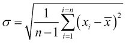 |

### 概率

在我们开始理解概率之前，我们先来看看为什么我们首先需要考虑不确定性。任何现实生活中的行动总是与结果或结局的不确定性联系在一起。让我们举一些例子；我今天能准时赶上火车吗？我们最畅销的产品这个季度的销售额会继续保持第一吗？如果我扔硬币，我会得到正面还是反面？我能在 *t* 分钟内赶到机场吗？

不确定性可能有许多来源:

*   由于缺乏知识、数据不足、分析不完整和测量不准确而导致的不确定性
*   否则，不确定性也可能是由于复杂性，由于不完整的处理条件

在现实世界中，我们需要使用概率和不确定性来总结我们预测结果的知识和能力的缺乏。

让我们详细说明上一个例子。

我能在 25 分钟内去机场吗？可能会有许多问题，例如对路况的不完整观察、有噪音的传感器(交通报告)或行动的不确定性，比如爆胎或交通建模的复杂性。预测结果，肯定要做一些假设，需要有原则地处理不确定性；这叫做 **概率**。简而言之，概率是一门研究随机性和不确定性的学问。

在概率上，一个实验是可以重复的，结果具有不确定性的东西。实验的单个结果被称为单个事件，事件是结果的集合。一个**样本空间**概率是一个实验所有可能结果的列表。

事件 *E* 的概率表示为 *P(E)* ，定义为该事件发生的可能性。

### 注意

一个事件发生的概率 P(E) =一个事件发生的方式的数量/可能的结果的数量

例如，对于一个被投掷的硬币，有两种可能:正面或反面。

人头的概率是 *P(H) = = 0.5*

掷出一个骰子，有六种可能，分别是 1、2、3、4、5、6。

1 的概率是 *P(1) = 1/6 = 0.16667*

滚动任何事件的概率， *E* ， *P(E)* ，必须在 *0* 和 *1* 之间(含)。

0 ≤ P(E) ≤ 1

概率的值 *0* 表示事件不可能发生， *1* 的值表示事件的确定性。如果有 *n* 个事件，那么每个事件的概率之和就是 *1* 。这可以表示为:

如果 *S = {e1，e2，…en}* 那么 *P(e1) +P(e2)+…P(en) = 1*

确定概率有很多种方法:

*   **Classical method**: This is the method that we used to define probability in the previous section. This method requires equally likely outcomes. So, if an experiment has equally likely *n* events and there are *m* possibilities, the event *E* can then occur.

    P(E) =事件 E 可能发生的方式数/可能的结果数= m/n。

    例如，一袋巧克力包含五块棕色巧克力、六块黄色巧克力、两块红色巧克力、八块橙色巧克力、两块蓝色巧克力和七块绿色巧克力。假设随机选择一颗糖果。一颗糖是棕色的概率有多大？

    *P (B) = 5/30*

*   **Empirical method**: The empirical method of probability computation is also called relative frequency, as this formula requires the number of times an experiment is repeated. This method defines the probability of the event *E*, which is the number of times an event is observed over the total number of times the experiment is repeated. The basis on which the probability is computed in this case is either observations or experiences.

    p(E)= E 的频率/实验的试验次数。

    例如，我们想计算一个研究生选择医学作为他们专业的概率。比方说，我们挑选了 200 名学生，其中 55 人选择医学作为专业，然后:

    *P(有人捡药)= 55/200 = 0.275*

*   **主观方法**:这种概率方法使用一些合理的、经过计算的或者有根据的假设。它通常描述个人对事件发生可能性的感知。这意味着个人对事件的信任程度被考虑在内，因此可能会有偏差。例如，有 40%的可能性物理教授不会来上课。

#### 事件类型

事件在本质上可以是互斥的、独立的或依赖的。

##### 互斥或不相交的事件

互斥事件是不能同时发生的事件。简而言之，两个事件同时发生的概率为 *0* 。 *P(1)* 和 *P(5)* 。当掷骰子时，有互斥的事件。互斥事件的文氏图表示如下:

对于互斥的事件 A 和 B，相加规则是:

P(A 或 B) = P(A) + P(B)

对于互斥事件 A 和 B，乘法规则是:

P(A 和 B) = P(A) x P(B)

##### 独立事件

如果一个事件的结果不影响另一个事件的结果，这两个事件称为独立事件。比如事件 A 是周日下雨，事件 B 是车爆胎。这两个事件不相关，一个事件发生的概率不会影响另一个事件。一个独立的事件可以是互斥的，但不是相反。

独立事件 A 和 B 情况下的乘法法则是:

P(A 和 B) = P(A) x P(B)

##### 依赖事件

相关事件是指事件，其中一个事件的发生会影响另一个事件的发生。比如一个以英语为第一专业的学生，可以把政治学作为第二专业。从属事件的文氏表示如下:

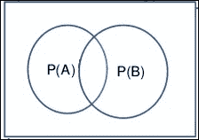

从属事件 A 和 B 的添加规则是:

P(A 或 B)= P(A)+P(B)-P(A 和 B)

依赖事件 A 和 B 的乘法规则为:

P(A 和 B) = P(A) x P(B)

### 概率的类型

在本节中，我们将看看不同类型的概率，如下所示:

*   **Prior and posterior probability**: Prior probability is the probability that an event E occurs without any prior information or knowledge of any assumptions in the problem context.

    我们举个例子。如果你的朋友乘飞机旅行，你被问到他们的邻座是男是女，根据概率的基本公式，有 0.5 (50%)的概率是男的，有 0.5 (50%)的概率是女的。当提供更多信息时，这些值可以改变，然后测量的概率被称为后验概率。

*   **Conditional probability**: Conditional probability is defined as the probability that an event occurs, given another event already occurred. *P(B|A)* is interpreted as the probability of event B, given event A.

    例如，让我们计算一个人在路上行走时被车撞的概率。设 *H* 为描述人被车撞的概率的离散随机变量，取撞数为 1 而不为 0。

    设 *L* 为描述给定时刻十字路口交通信号灯状态概率的离散随机变量，取*{红黄绿}* 中的一个:

    *P(L =红色)= 0.7，*

    *P(L =黄色)= 0.1，*

    *P(L =绿色)= 0.2。*

    *P(H=1|L=R) = 0.99，*

    *P(H|L=Y) = 0.9 和*

    *P(H|L=G) = 0.2。*

    使用条件概率公式，我们得到以下结果:

    *P(H=1 且 L = R)= P(L = R)* P(H | L = R)= 0.693；*

    *P(H=1，L=Y) = 0.1*0.9 = 0.09*

    同样，如果红色亮起时被击中的概率是 0.99，未被击中的概率是 0.01。所以， *P(H=0|L=R) = 0.01* 。由此我们可以计算出 *H=0* 和 *L=R* 的概率。

*   **Joint probability**: Joint probability is the probability of two or more things happening together. In a two variable case, *f(x,y|θ)* is the joint probability distribution, where *f* is the probability of *x* and *y* together as a pair, given the distribution parameters—*θ*. For discrete random variables, the joint probability mass function is:

    P(X 和 Y) = P(X)。P(Y|X) =P(Y)。P(X|Y)

    你们在学习条件概率的时候已经看到了。由于这些都是概率，我们有如下:

    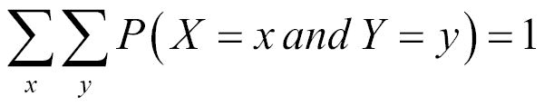
*   **Marginal probability**: Marginal probability is represented by *f(x|θ)* where *f* is the probability density of *x* for all the possible values of *y*, given the distribution parameters—*θ*. The marginal probability in a random distribution is determined from the joint distribution of *x* and *y* by summing over all the values of *y*. In a continuous distribution, it is determined by integrating over all the values of *y*. This is called **integrating out** the variable *y*. For discrete random variables, the marginal probability mass function can be written as *P(X = x)*. This is as follows: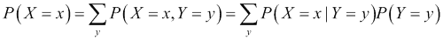

    从上面的等式可知， *P(X = x，Y = y)* 是 *X* 和 *Y* 的联合分布， *P(X = x|Y = y)* 是 *X* 的条件分布，给定 *Y* 。变量 *Y* 被边缘化。这些离散随机变量的二元边际和联合概率通常显示为双向表(如下图所示)。我们将在下一节展示一个已算出的问题中的计算。

    例如，假设掷出两个骰子，记录得分顺序 *(X1，X2)* 。让 *Y=X1+X2* 和*Z = X1 X2*分别表示分数的和与差。求 *(Y，Z)* 的概率密度函数。求 *Y* 的概率密度函数。求 *Z* 的概率密度函数。 *Y* 和 *Z* 是否独立？

    假设 *X1* 和 *X2* 是独立的，可以取 36 种可能性，如下表所示:

    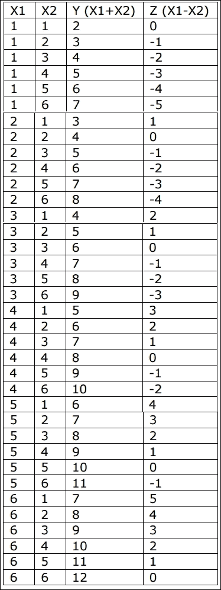

现在让我们构建联合、边缘和条件表。在这里，我们将把值 *Z* 作为行，把值 *Y* 作为列。 *Y* 从 2 到 12 变化， *Z* 从-5 到 5 变化。我们可以通过计数来填充所有的条件分布。比如取*Z =-1*；我们看到当 *Y=3，5，7，9，11* 时会发生这种情况。我们还注意到其中每一个的概率(比如说 *Z=-1* ，给定 *Y=3* 的条件概率)是 *1/36* 。我们可以像这样为所有值填充表格:

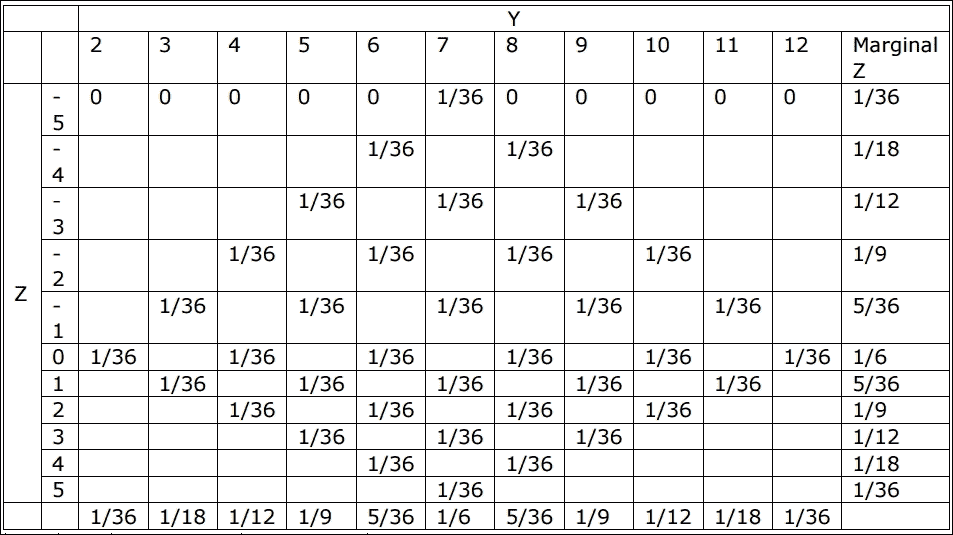

所以，最下面一行是 *Y* 的边际分布。最右边一列是 *Z* 的边际分布。总表是联合分布。显然，他们是依赖的。

### 配送

分布是离散或连续概率分布，取决于它们是否定义了与离散变量或连续变量相关的概率:

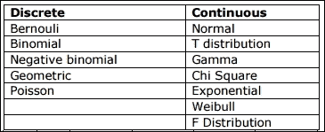

我们将在这里介绍前面提到的一些发行版。

在本节中，我们的主要强调建模和描述数据的给定属性。为了理解这项技能有多重要，我们来看几个例子:

*   一家银行希望查看一段时间内 ATM 机上每笔交易提取的现金量，以确定交易限额
*   一位零售商想了解他在每批货物中损坏的玩具数量
*   制造商想要了解探针的直径在不同的制造周期中是如何变化的
*   一家制药公司希望了解其新药如何影响数百万患者的血压

在所有这些情况下，我们需要想出一些精确的定量描述观察到的量是如何表现的。这部分就是关于这个的。无论如何，直觉上，你认为你想要衡量哪些品质来获得理解？

*   给定变量的所有值是什么？
*   取给定值的概率是多少，哪些值的概率最高？
*   什么是均值/中值，方差是多少？
*   给定一个值，我们能说出有多少观察值落入其中，有多少远离它吗？
*   我们能不能给出一个范围值，在这个范围内我们能分辨出 90%的数据在说谎？

实际上，如果我们能回答这些问题，更重要的是，如果我们能发展一种技术来描述这些量，就这个性质而言，我们或多或少是不可阻挡的！

这里有两个主要的观察。首先，当一个属性按现在的方式分布时，它就具备了成为随机变量的所有条件(知道这个量的一个值并不能帮助我们知道下一个值)。然后，如果我们知道这个随机变量的概率质量函数或者分布函数，我们就可以计算出前面所有的物质。这就是为什么理解数学如此重要。一般来说，我们遵循(就此而言，几乎所有对分析随后的数据感兴趣的人)描述一个量的系统过程:

1.  我们将首先理解随机变量。
2.  接下来，我们将计算概率质量(或分布)函数。
3.  然后，我们将预测所有重要的参数(均值和方差)。
4.  然后，我们将检查实验数据，看看我们的近似有多好。

例如，下表列出了在 50 天内汽车租赁机构申请租赁的辆货车。在表格的最后一栏中，观察到的频率已被转换成这 50 天期间的概率:

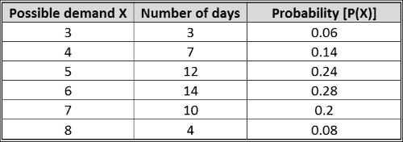

预期值为 5.66 vans，如下所示:

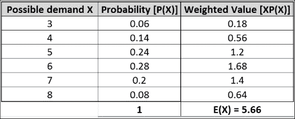

类似地，方差计算如下:

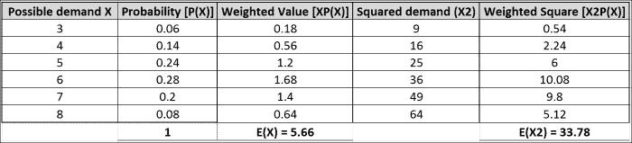

标准偏差是方差的平方根，等于 1.32 vans。我们来系统分析一下各种分布。

### 伯努利分布

这是一个能想到的最简单的分布。很多时候，一个属性只取离散值；比如抛硬币、掷骰子、人的性别等等。即使它们不是完全离散的，在某些情况下，我们可以通过宁滨变换它们。例如，当我们看个人的净资产时，我们可以根据他们拥有的确切财富(**连续量**)将他们重新划分为富人和穷人(**离散量**)。假设属性取给定值的概率是 *p* (当然不取的概率是 *(1-p)* )。如果我们收集了足够多的大样本，那么数据集看起来如何？嗯，会有一些正数(变量取值的地方)和负数(变量不取值的地方)。假设我们用 1 表示正，用 0 表示负。

然后，我们有以下内容:

平均值=概率的加权平均值= 1*p +0*(1-p) = p

### 二项式分布

这是伯努利想法的延伸。我们举一个具体的例子。你在人口局工作，拥有一个州所有家庭的数据。假设您想要确定在正好有两个孩子的家庭中有两个男孩的概率。如你所见，一个家庭只有四种方式可以生两个孩子:MM，MF，FM，FF。由于我们认为有一个男孩是感兴趣的事件，那么只有男孩的概率是 *0.25 (1/4)* 。有一个男孩的概率是 *0.5 (0.25+0.25) (1/4+1/4)，*没有男孩的概率是 *0.25 (1/4)* 。

那么，如果你看 100 个家庭， 20 个家庭正好有两个男孩的概率是多少？我们将在稍后讨论解决方案。让我们扩展论点，找出有三个孩子的家庭中所有男性的概率:总的可能性是 FFF、FFM、FMF、FMM、MFM、MMF、MFF 和 MMM(总共八种可能性)。三个都是男的概率是 *1/8* 。三人中有两人是男性的概率是 *3/8* 。三人中有一个是男性的概率是 *3/8* 。没有一个是男性的概率是 *1/8* 。注意，所有事件的总概率总是等于 1。

#### 泊松概率分布

现在，让我们尝试将二项式定理扩展到无限次试验，但是有一个条件。我们举的例子(扔硬币等等)有一个有趣的特性。即使我们增加试验次数，试验中事件发生的概率也不会改变。然而，有大量的例子，尽管试验(或其等价物)的数量增加，事件的相应概率降低。因此，我们需要将时间间隔减少到零，或者将观察次数减少到无穷大，以确保我们在任何试验中只看到一次成功或失败。在这种极限情况下，我们在 *n* 观测中看到 *r* 成功的概率可以计算如下:

泊松随机变量 *X* 的概率分布如下。这考虑表示在给定时间间隔内发生的成功次数:

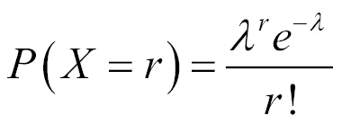

这里， *r* 是第 *r* ^次试验和 *λ* =在给定的时间间隔或空间区域内成功的平均数。

#### 指数分布

现在让我们看看泊松的例子，问我们自己一个不同的问题。检查员在 *t* 小时前没有看到第一辆车的概率是多少？在这种情况下，它可能是不相关的，但是当我们处理一个组件的故障时，理解什么时候看不到故障的概率高是有意义的。所以，让我们说看到汽车(或第一次故障)遵循泊松过程。然后，让我们定义 *L* ，一个随机变量，它是检查员直到第一次看到汽车之前的时间 *t* 才会看到第一辆汽车的概率。根据泊松分布，她在 1 小时内看不到第一辆车的概率如下:

她在第二个小时看不到车的概率也是一样的，她在 *t* 小时看不到车的概率是*e*T12——λt(eT16——λ**e*T20——λ**……次)*。那么她在第一个 *t* 小时内看到车的概率是 *1-e* ^(-λt) 。

指数分布的应用如下:

*   泊松过程中第一次失败的时间
*   种子离母体植物的距离
*   生物体的预期寿命，忽略老化过程(由于事故、感染等导致死亡)

#### 正态分布

正态分布分布是一类应用非常广泛的连续分布。它也经常被称为钟形曲线，因为它的概率密度图类似于一个钟。大多数现实生活中的数据，如体重、身高等(特别是当有大量数据收集时)，都可以用正态分布很好地近似。

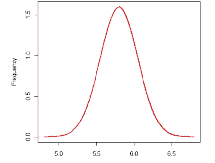

一旦我们知道了高度的值，具有该值的样本的数量可以用数学方法描述如下:

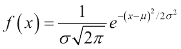

这里σ是标准差，是均值。要描述一个正态分布，我们只需要知道两个概念(平均值和标准差)。

每条法线曲线都遵循以下*规则*:

*   曲线下约 68%的面积落在平均值的一个标准偏差内
*   曲线下约 95%的面积落在平均值的两个标准偏差内
*   曲线下约 99.7%的面积落在平均值的三个标准偏差内

这些点统称为**经验法则**或T42 法则。

#### 分布之间的关系

虽然我们知道或多或少每样东西都收敛于正态分布，但最好了解每样东西适合哪里。下面的图表对此有所帮助:

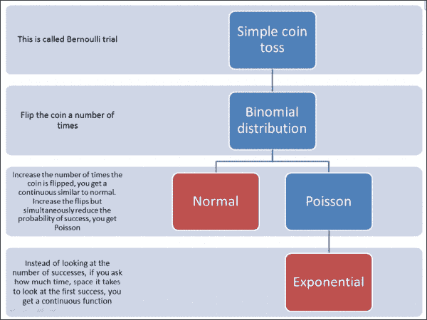

## 贝叶斯定理

在我们进入贝叶斯定理之前，我们在本章开始时提到了贝叶斯学习中的贝叶斯定理。

先说个例子。假设有两碗坚果；第一个碗里有 30 个腰果和 10 个开心果，第二个碗里各有 20 个。我们随机选一个碗，闭着眼睛挑一个坚果。坚果是腰果。现在，选择的碗是第一碗的概率是多少？这是一个条件概率。

所以，*p(Bowl 1 |腰果)*或者说它是 Bowl 1 的概率，假设坚果是腰果，并不是一个容易和明显的破解方法。

如果问题换个方式来说， *p(腰果|碗 1)* 或者坚果是腰果的概率，给定碗 1 很容易， *p(腰果|碗 1) =* 。

我们知道， *p(腰果|碗 1)* 和 *p(碗 1 |腰果)*不一样但是我们可以用一个值得到另一个值，这就是贝叶斯定理的意义所在。

定义贝叶斯定理合取的第一步是交换的；以下是步骤:

*p (A 和 B) =p (B 和 A)，*

此外，A 和 B 的概率是 A 的概率和 B 的概率，给定 A:

*p (A 和 B) = p (A) p (B|A)* 同理

*p (B 和 A) = p (B) p (A|B)*

所以，

*p (A) p (B|A) = p (B) p (A|B)* 和

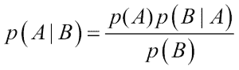

这就是贝叶斯定理！

这可能不是很明显，但这是一个非常有力的定义。

现在我们应用这个来解决前面的*螺母*问题求 *p(bowl1 腰果)*，如果能得到 *p(腰果|碗 1)* 就可以推导出来了:

*p (bowl1 腰果)= (p(bowl1) p(腰果|bowl1)) / p(腰果)*

*p (bowl1) =*

*p(腰果|保龄球 1) =*

*p(腰果)=腰果总数/坚果总数(在碗 1 和碗 2 之间)= 50/80 = 5/8*

综合起来，我们有以下内容:

*p (bowl1 腰果)=((1/2)(3/4))/(5/8)= 3/5 = 0.6*

现在需要考虑的另一个方面是，随着时间的推移，随着新数据的出现，如何体现这些变化。这样，可以在给定时间点的数据环境中测量假设的概率。这被称为贝叶斯定理的历时解释。

以下是针对给定数据( *D* )的假设( *H* )的重述贝叶斯定理:

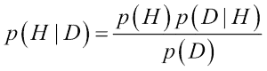

*p (H)* 是在看到数据 *D* 之前，假设 *H* 的概率。

*p (D)* 是任何假设下数据 *D* 的概率，通常为常数。

*p (H|D)* 是假设 *H* 看到数据 *D* 后的概率。

*p (D|H)* 是给定假设 *H* 的情况下，数据 *D* 的概率。

### 注意

*p (H)* 称为先验概率； *p (H|D)* 为后验概率； *p (D|H)* 是可能性；而 *p (D)* 就是证据:

## 朴素贝叶斯分类器

在本节中，我们将看看朴素贝叶斯分类器，以及如何使用它们来解决分类问题。朴素贝叶斯分类器技术基于贝叶斯定理，并假设预测值是独立的，这意味着知道一个属性的值会影响任何其他属性的值。独立性假设使得朴素贝叶斯*显得幼稚*。

朴素贝叶斯分类器易于构建，不涉及任何迭代过程，并且非常适合大型数据集。尽管简单，朴素贝叶斯通常比其他分类方法更好。

我们需要计算给定一个类的假设的概率。

即 *P(x* [1] *，x* [2] *，…。x*n | yT31)。很明显，有多份证据分别以 *x* [1] ， *x* [2] ， *…。x* [n] 。

因此，我们首先假设 *x* [1] ， *x* [2] ， *…。x* [n] 有条件独立，给定 *y* 。定义这一点的另一个简单方法是，我们需要在给定多个证据的情况下预测一个结果，而不是单一证据。为了简单起见，我们将这些证据分开:

P(结果|多重证据)= [P(证据 1 |结果)x P(证据 2 |结果)x...x P(证据|结果)] x P(结果)/ P(多重证据)

这也是这样写的:

*P(结果|证据)= P(证据的可能性)x 结果的先验概率/ P(证据)*

为了应用朴素贝叶斯来预测结果，需要对每个结果运行前面提到的公式。只要对每个可能的结果运行这个公式，在分类问题的情况下，结果将是一个类。我们将看看著名的水果问题，以帮助您轻松理解这一点。

给定水果的任何三个重要特征，我们将需要预测它是什么水果。为了简化案例，我们取三个属性—长、甜、黄；三种水果——香蕉、橘子和其他。假设训练集中有 1，000 个数据点，可用信息如下所示:

| 

类型

 | 

长的

 | 

不长

 | 

甜食

 | 

不甜

 | 

黄色

 | 

不是黄色

 | 

总数

 |
| --- | --- | --- | --- | --- | --- | --- | --- |
| **香蕉** | 400 | 100 | 350 | 150 | 450 | 50 | 500 |
| **橙色** | 0 | 300 | 150 | 150 | 300 | 0 | 300 |
| **其他** | 100 | 100 | 150 | 50 | 50 | 150 | 200 |
| **总计** | 500 | 500 | 650 | 350 | 800 | 200 | 1000 |

上表中的一些导出值/先验概率如下:

类别概率

*p(香蕉)= 0.5 (500/1000)*

*p(橙色)= 0.3*

*p(其他)= 0.2*

证据概率

*p(长)= 0.5*

*p(甜)= 0.65*

*p(黄色)= 0.8*

可能性的概率

*p(长|香蕉)= 0.8*

*p(长/橙)= 0 P(黄/其他水果)=50/200 = 0.25*

*p(非黄色|其他水果)= 0.75*

现在，给定一个水果，让我们根据属性对其进行分类。首先，我们对三种结果中的每一种进行概率分析，取最高的概率，然后对其进行分类:

*p(香蕉|/长、甜、黄)= p(长|香蕉)x p(甜|香蕉)x p(黄|香蕉)x p(香蕉)/p(长)xp(甜)x. p(黄)*

*p(香蕉| |长、甜、黄)= 0.8×0.7×0.9×0.5/p(证据)*

*p(香蕉| |长、甜、黄)=0.252/ p(证据)*

*p(橙| |长、甜、黄)= 0*

*p(其他果/长、甜、黄)= p(长/其他果)x p(甜/其他果)x p(黄/其他果)x p(其他果)*

*=(100/200×150/200×50/150×200/1000)/p(证据)*

*= 0.01875/ p(证据)*

以*0.252>0.01875*的最大幅度，我们现在可以把这个甜的/长的/黄色的水果归类为有可能是*香蕉*。

由于朴素贝叶斯假设每个特征都是高斯分布，因此也称为高斯朴素贝叶斯分类器。

当存在缺失数据时，朴素贝叶斯尤其适用。在接下来的部分中，让我们看看不同类型的朴素贝叶斯分类器。

### 多项式朴素贝叶斯分类器

正如我们在上一节中看到的，朴素贝叶斯假设模型相对于特征分布的独立性。在多项朴素贝叶斯的情况下，*p(x*[I]*| y)*是多项分布；简而言之，假设每个特征都是多项式分布。适合这种变体的情况是我们需要计算字数的文档。这里给出了多项式朴素贝叶斯的一个简单算法:

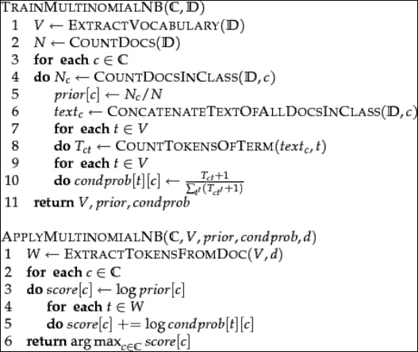

### 伯努利朴素贝叶斯分类器

伯努利朴素贝叶斯分类器将一个布尔指示符附加到一个单词上，如果它属于被检查的文档，则为 1，否则为 0。这种变化的焦点在于，它考虑了一个单词在所考虑的特定文档中出现或不出现的次数。单词的未出现是一个重要值，因为它用于计算单词出现的条件概率。伯努利朴素贝叶斯算法详述如下:

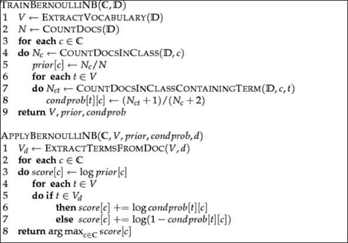

|   | 

多项式朴素贝叶斯

 | 

伯努利朴素贝叶斯

 |
| --- | --- | --- |
| **模型变量** | 这里，生成一个令牌，它检查是否出现在某个位置 | 这里，生成了一个文档并检查在文档中的出现 |
| **文档** | 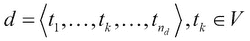 | 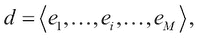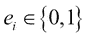 |
| **参数的估计** | 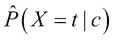 | 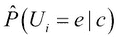 |
| **规则** | 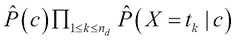 | 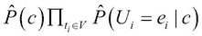 |
| **事件** | 这考虑了多次出现的情况 | 这考虑了单次事件 |
| **文件的尺寸** | 大型文件处理 | 适用于较小的文档 |
| **特色** | 这支持处理更多功能 | 这对于较少的特征是好的 |
| **一个期限的估计** | 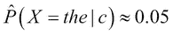 | 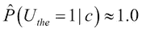 |

# 实现朴素贝叶斯算法

参考本章提供的实现朴素贝叶斯分类器的源代码(源代码路径`.../chapter9/...`在技术的每个文件夹下)。

## 使用 Mahout

参考至文件夹`.../mahout/chapter9/naivebayesexample/`。

## 使用 R

参考至文件夹`.../r/chapter9/naivebayesexample/`。

## 使用火花

将参考到文件夹`.../spark/chapter9/naivebayesexample/`中。

## 使用 scikit-learn

将参考到文件夹`.../python-scikit-learn/chapter9/naivebayesexample/`中。

## 利用朱丽亚

将参考到文件夹`.../julia/chapter9/naivebayesexample/`中。

# 总结

在本章中，您已经学习了贝叶斯机器学习，以及如何使用 Mahout、R、Python、Julia 和 Spark 实现朴素贝叶斯分类器基于关联规则的学习。此外，我们涵盖了统计学的所有核心概念，从基本术语到各种分布。我们已经通过例子深入介绍了贝叶斯定理，以理解如何将它应用到现实世界的问题中。

在下一章，我们将讨论基于回归的学习技术，特别是线性和逻辑回归的实现。