# 第十三章。集成学习

本章是我们从[第五章](ch05.html "Chapter 5. Decision Tree based learning")、*决策树学习*中学到的所有学习方法的总结章。将这一章作为学习方法的结束章是再合适不过了，因为这种学习方法解释了如何有效地结合使用这些方法来最大化学习者的成果。集成方法是一种有效、强大的技术，可以实现监督和非监督解决方案的高精度。在选定的业务案例中，不同的模型效率很高，表现也很好。重要的是要找到一种方法将竞争的模型组合成一个委员会，在这个领域已经有很多研究取得了相当程度的成功。此外，由于不同的视图会生成大量的数据，因此关键的方面是整合不同的概念以进行智能决策。推荐系统和基于流的文本挖掘应用广泛使用集成方法。

有很多独立的研究是在有监督和无监督的学习小组中完成的。观察到的共同主题是，许多混合模型组合在一起，加强了弱模型，带来了整体更好的性能。本章的重要目标之一是详细介绍不同集成技术的系统比较，这些技术结合了监督和非监督技术以及合并结果的机制。

本章涵盖以下主题:

*   基于学习的集成方法概述——*群体智慧*的概念和关键属性。
*   核心集成方法分类，真实世界的例子，和集成学习的应用
*   集成方法类别和各种代表性方法:

    *   **监督集成方法** 提供了概念的概述和详细覆盖，例如装袋、提升、梯度提升方法，以及随机决策树和随机森林
    *   **非监督集成方法** 提供了包括聚类集成的生成、直接和间接方法的概述

*   使用 Apache Mahout、R、Julia、Python (scikit-learn)和 Apache Spark 的实际操作练习

# 集成学习方法

总体而言，整体意味着通常被视为一个整体的一组事物，而不是相对于个体价值的价值。集成遵循分而治之的方法来提高性能。

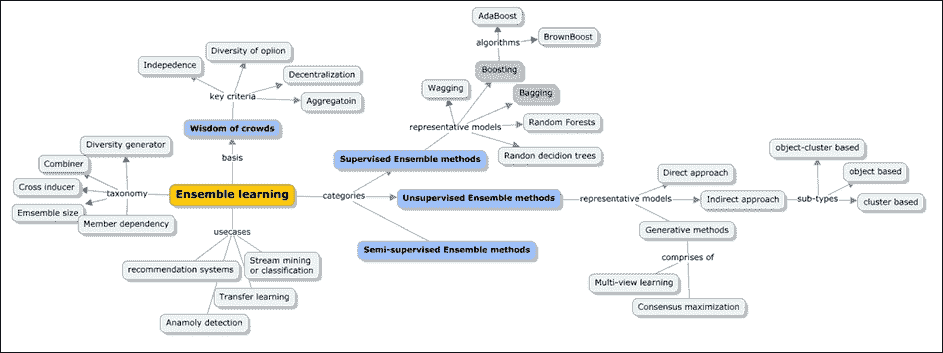

我们将从介绍著名的群体智慧概念开始理解具体的算法。

## 群众的智慧

当不完美的判断以正确的方式聚集时，会产生集体智慧，从而产生更好的结果。群众的智慧就是这种集体智慧。

一般来说，群体这个词通常与非理性和普遍认为存在某种影响联系在一起，这种影响在暴民和邪教的背景下左右着群体的行为。然而，事实是，这不一定总是负面的，并且在使用校对智力时工作得很好。群体智慧的关键概念是，由一群人做出的决定总是比个人做出的决定更稳健、更准确。机器学习的集成学习方法已经有效地利用了这一思想，以在其结果中产生效率和准确性。

群体的智慧这个术语是高尔顿在 1906 年创造的。有一次，他参加了一个农贸市场，那里有一个比赛，要猜一头被屠宰和屠宰的公牛的重量。最接近的猜测从总共 800 名参赛者中胜出。他选择收集所有的回复并进行分析。当他取这些猜测的平均值时，他震惊地发现它们与实际值非常接近。这个集体猜测不仅比获奖的选手更好，而且被证明是与牛专家的猜测相比最好的。思想的民主显然是赢家。对于这样一个有用的输出，重要的是每个参赛者都有他/她强有力的信息来源。参赛者提供的独立猜测不应受到他/她的邻居的猜测的影响，而且，有一个无错误的机制来整合整个组的猜测。所以简而言之，这不是一个容易的过程。另一个重要的方面是，这些猜测优于任何单个专家的猜测。

一些基本的日常例子包括:

*   谷歌搜索结果通常将最受欢迎的页面列在顶部
*   在“谁想成为亿万富翁”这样的游戏中，观众投票用于参赛者毫不知情的回答问题。通常情况下，被人群投票最多的答案就是正确答案。

不保证群体智慧方法的结果。以下是使用此方法获得最佳结果的基本标准:

*   **聚合**:这里需要一种万无一失的方式将个人反应整合成集体反应或判断。没有这一点，集体观点或全面回应的核心目的就没有意义。
*   **独立性**:在人群中，需要有一套纪律来控制一个实体对人群中其他实体的反应。任何影响都会扭曲响应，从而影响准确性。
*   **去中心化** : 个体的反应有其来源，并在有限的知识中茁壮成长。
*   **意见的多样性**:重要的是每个人都有一个独立的回应；这种反应的不寻常还是可以接受的。

系综这个词的意思是分组。为了构建集成分类器，我们首先需要从训练数据构建一组分类器，聚合这些分类器做出的预测，并使用该数据预测新记录的类别标签。

下图描述了这一过程:

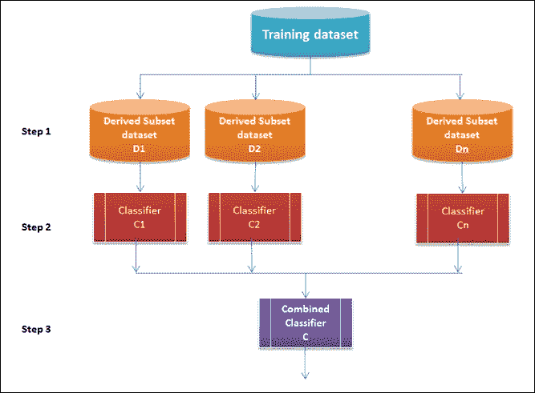

从技术上讲，核心构建模块包括一个训练集、一个诱导器和一个集合生成器。诱导体处理为每个样本训练数据集定义分类器。集成生成器创建分类器和合并器或聚合器，合并器合并组合器上的响应。有了这些构件和它们之间的关系，我们就有了下面的属性，我们将使用这些属性来对集成方法进行分类。下一节将介绍这些方法:

*   **组合器的使用**:该属性定义了集合生成器和组合器之间的关系
*   **分类器之间的依赖关系**:该属性定义了分类器之间相互依赖的程度
*   **产生分集**:这个属性定义了用于确保合并器分集的过程
*   **集成的大小**:这个属性表示集成中使用的分类器的数量
*   **交叉诱导符**:这个属性定义了分类器如何利用诱导符。有些情况下，分类器被构建为与某一组诱导物一起工作

总之，建筑模型集合首先包括建筑专家，并让他们提供答案/投票。预期的好处是提高预测性能，并生成一个单一的全局结构。尽管如此，任何产生的中间结果最终都可能难以分析。

让我们全面地看看聚合/组合分类器的性能如何更好地工作。

让我们考虑三个错误率为 0.35(ԑ或者准确度为 0.65 的分类器。对于每个分类器，分类器的预测出错的概率是 35%。

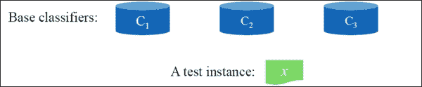

这里给出的是表示误差率为 0.35(35%)和准确率为 0.65(65%)的真值表:

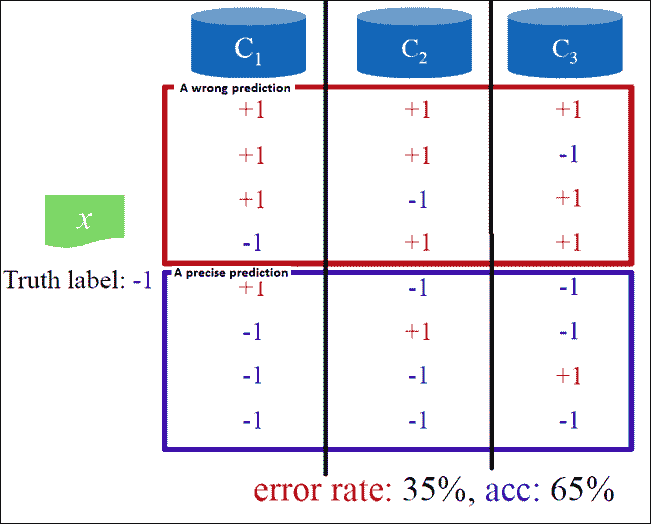

在三个分类器被组合之后，通过使用跨组合器的多数投票过程来计算集成分类器出错的概率，预测测试实例的类别标签。这在下面给出的公式中描述。

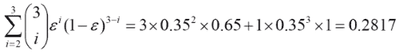

而且准确率为 71.83%。很明显，当在分类器之间聚集时，错误率降低了。现在，如果我们将其扩展到 25 个分类器，根据错误率(6%)的计算，准确率上升到 94%。

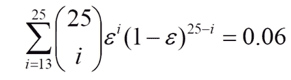

因此，当他们给出更大的图片时，全体工作。

在前一节中，我们已经讨论了群体智慧发挥作用的标准。现在让我们来看前面的情况，其中我们有 25 个基本分类器，并且看集成分类器的准确度对于基本分类器的不同错误率是如何变化的。

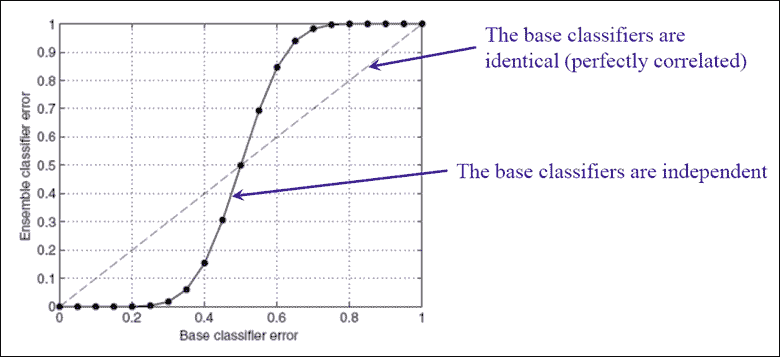

### 提示

在基本分类器错误率大于 0.5 的情况下，集成分类器的性能恶化，并且表现得比基本分类器差得多。

在下一节中，我们将介绍一些应用集成方法的真实用例。

## 关键使用案例

本节将详细讨论集成学习方法的一些关键现实应用。

### 推荐系统

推荐系统的目的是围绕用户可能感兴趣的产品向用户社区提供重要或有意义的推荐。一些例子包括与决策过程相关的建议，例如在亚马逊上读什么书，在网飞上看什么电影，或者在新闻网站上读什么新闻。业务领域，或者业务属性的上下文和特征是推荐系统设计的主要输入。用户为每部电影提供的评级(1-5 级)是一个重要的输入，因为它记录了用户与系统互动的程度。除此之外，推荐系统还使用用户的详细信息(例如人口统计和其他个人或简档属性)来识别项目和潜在用户之间的潜在匹配。

下面的截图是网飞推荐系统结果的示例:

### 异常检测

异常检测或异常检测是集成学习方法最流行的用例或应用之一。这一切都是为了在数据中找到看起来不正常或不寻常的模式。识别异常很重要，因为它可能导致采取任何果断的行动。一些著名的例子包括(除其他外):

*   信用卡欺诈检测
*   医疗保健中的异常疾病检测
*   飞机发动机中的异常检测

现在让我们扩展一下飞机发动机异常检测的例子。用于验证飞机发动机是否异常的特征如下:

*   产生的热量(*x*1
*   振动强度(*x*2
*   标有数据集=*x*(1)*，x*[(2)]*…x*[(m)]的异常和非异常情况如下: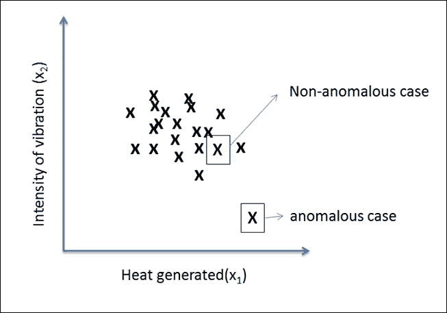

### 迁移学习

传统上，所有的机器学习算法都假设每一个新的学习问题都是从零开始学习。假设之前的学习不会被利用。在学习问题的领域相关的情况下，将会有一些可以从过去获得和使用的知识。一些常见的例子包括:

*   法语知识可以帮助学生学习西班牙语
*   数学知识可以帮助学生学习物理
*   驾驶汽车的知识可以帮助司机学习驾驶卡车

在机器学习上下文中，这指的是识别并将从先前任务中积累的知识应用于来自相关领域的新任务。这里的关键是识别领域间共性的能力。强化学习和分类回归问题应用迁移学习。迁移学习流程如下所示:

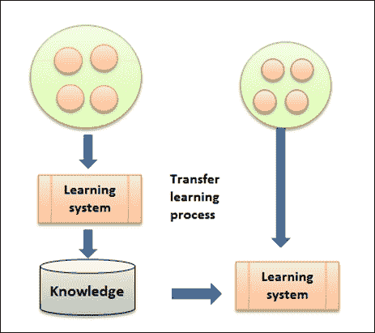

### 溪流挖掘或分类

随着技术进步和社交媒体的发展，挖掘以流的形式出现的数据已经成为许多应用的关键需求。

传统学习的主要区别在于，当训练和测试数据集以流的形式出现时，它们是以分布式方式发展的。预测的目标现在变得有点复杂，因为概率随着时间戳的变化而不断变化，从而使这成为应用集成学习方法的理想环境。下图显示了 *P(y)* 如何随时间戳以及对 *P(x)* 和 *P (y|x)* 的更改而变化:

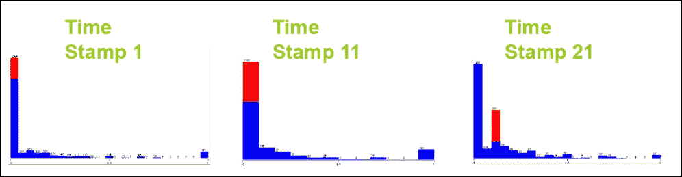

使用集成学习方法，由单个模型产生的方差减少，并且随着分布的发展，预测或结果更加准确或稳健。

## 集成方法

正如在前面章节中所讨论的，集成方法现在被证明是提高监督、半监督和非监督解决方案的准确性和鲁棒性的强大方法。此外，我们已经看到，随着不同来源开始不断产生大量数据，决策的动态性变得越来越复杂。现在，有效的整合对于成功和明智的决策至关重要。

监督和非监督集成方法共享相同的原理，包括组合增强弱模型的不同基础模型。在接下来的章节中，让我们独立而详细地看看监督、半监督和非监督技术。

以下模型描述了各种学习类别和涵盖两者的不同算法，将学习和共识方法结合到集成学习中:

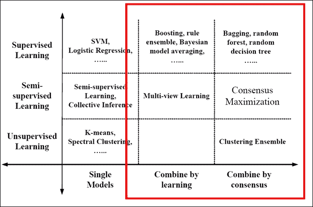

来源:论集合的力量:监督和非监督方法调和([http://it.engineering.illinois.edu/ews/](http://it.engineering.illinois.edu/ews/))

在我们深入研究每一种集成技术之前，让我们了解一下通过学习进行组合和通过共识进行组合之间的区别:

|   | 

利益

 | 

不利方面

 |
| --- | --- | --- |
| **学以致用** | 

*   使用带标签的数据作为反馈机制
*   有可能提高精确度

 | 

*   只对带标签的数据有效
*   有过拟合的可能

 |
| **协商一致合并** | 

*   不需要标注数据
*   有潜力提高性能

 | 

*   来自被标注数据的有价值的反馈缺失
*   基于共识是好事的假设

 |

### 监督集成方法

在监督学习方法的情况下，输入总是一个带标签的数据。*通过学习组合*方法包括提升栈泛化和规则集成技术。*共识组合*方法包括装袋、随机森林和随机决策树技术。下面显示了通过学习进行组合的流程，然后是通过共识进行组合的另一个模型:

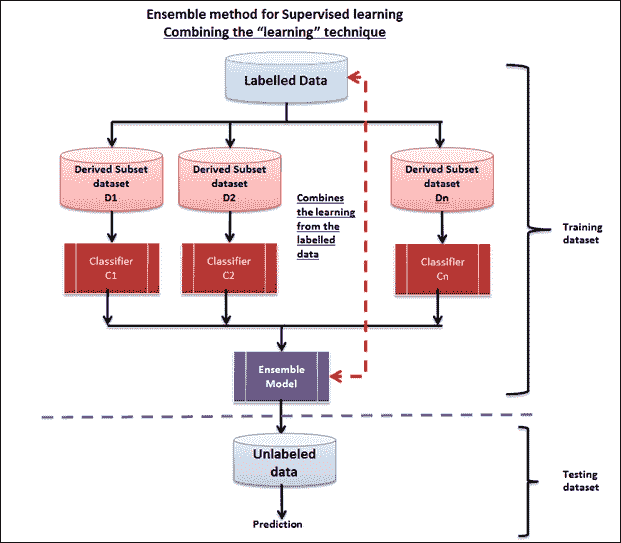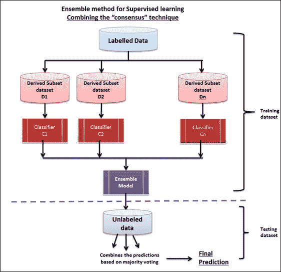

监督的集合方法问题陈述定义如下:

*   输入数据集是 *D={x* [1] *，x* [2] *，…，x* [n] *}* 各自的标签是 *L={l* [1] *，l* [2] *，…，L*[n]
*   集成方法现在生成了一组分类器 *C = {f* [1] *，f* [2] *，…，f* [k] *}*
*   最后，分类器组合 *f** 按照*f *(x)=ω*[1]*f*[1]*(x)+ω*[*f*[2]*(x)+…+ω*[k]*f*[k]*【x】*公式]

#### 提升

Boosting 是一种非常简单的方法，通过应用多个模型生成的所有输出的加权平均值来计算输出。这是一个针对弱学习者的框架。可以通过使用强大的加权公式来改变所应用的权重，以得出强大的预测模型，该模型可以解决这些方法的缺陷，并且还可以使用不同的窄调模型来处理更广泛的输入数据。

Boosting 已经成功地解决了二元分类问题。这项技术是由 Freund 和 Scaphire 在 20 世纪 90 年代通过著名的 AdaBoost 算法引入的。这里列出了该框架的一些关键特征:

*   它结合了几个基本分类器，与基本分类器相比，性能有所提高
*   弱学习者被顺序训练
*   用于训练每个基本分类器的数据基于前一个分类器的性能
*   每个分类器投票并对结果做出贡献
*   这个框架使用在线算法策略
*   对于每次迭代，权重被重新计算或重新分配，其中不正确的分类器将开始降低它们的权重
*   正确的分类器接收更多的权重，而不正确的分类器具有减少的权重
*   尽管 Boosting 方法最初是为解决分类问题而设计的，但它也被扩展到处理回归问题

升压算法如下所述:

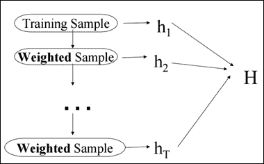

1.  训练一组弱假设: *h* [1] *，…，h* [T] *。*
2.  将假设 *H* 组合起来，作为对 *T* 较弱假设的加权和多数投票。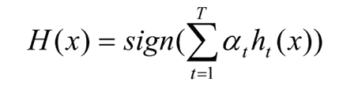
3.  每次迭代将集中在错误分类上，并重新计算权重*D*[t]*(I)*。

##### AdaBoost

AdaBoost 是一个线性分类器，它构造了一个更强的分类器 *H(x)* 作为较弱函数*H*[t]*(x)*的线性组合。

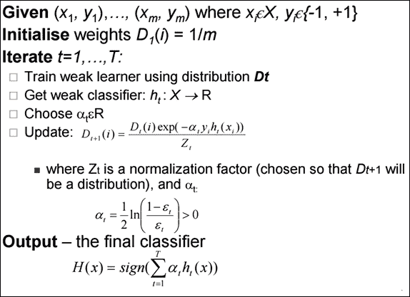

图形表示接下来演示增强框架如何工作:

1.  所有数据点被标记为两类 *+1* 和 *-1* ，权重相等——1。T31
2.  应用一个 *p(错误)*并将数据点分类如下: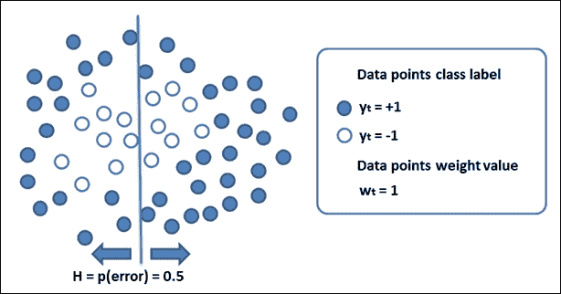
3.  重新计算权重。T39
4.  让弱分类器再次参与新的问题集。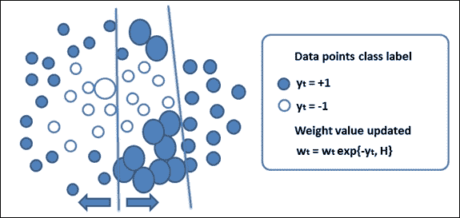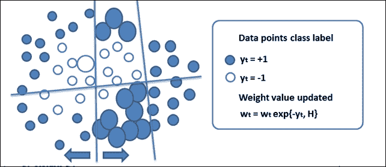
5.  使用弱分类器迭代地构建强非线性分类器。T50

#### 装袋

打包也叫叫 **自举聚合**。这种集成学习技术结合了*共识*方法。这项技术有三个重要步骤:

1.  构建包含大约 63.2%原始记录的引导示例。
2.  使用每个引导样本对训练进行分类。
3.  使用多数投票并识别集成分类器的类别标签。

此过程通过基于原始数据集重复组合相同大小的数据集来生成额外的数据生成，从而降低预测方差。模型的准确性随着方差的减少而增加，而不是随着数据集大小的增加而增加。以下是 bagging 算法:

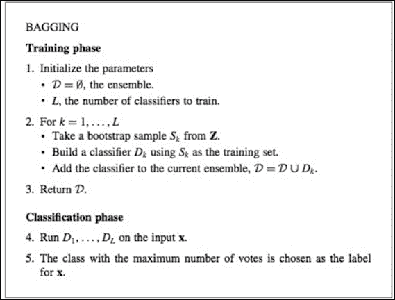

根据前面的算法步骤，此处描述了装袋算法和过程的示例流程:

1.  **训练步骤**:对于每次迭代 *t，t=1，…T* ，从训练集中创建 *N 个*样本(这个过程称为 bootstrapping)，选择一个基础模型(例如决策树、神经网络等)，使用构建的样本对其进行训练。
2.  **测试步骤**:对于每个测试周期，结合所有 *T* 训练模型的结果进行预测。在分类问题的情况下，大多数投票方法被应用，对于回归，它是平均方法。

一些误差计算如下进行:

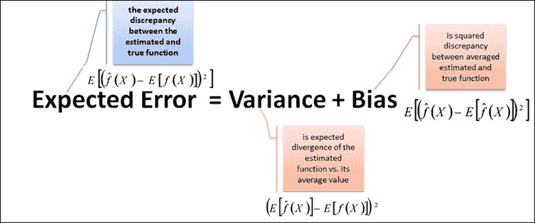

在以下条件下，过装和欠装情况下的装袋工作:

*   **对于欠拟合**:高偏差和低方差情况
*   **过拟合**:小偏差大方差情况

这里是一个装袋的例子:

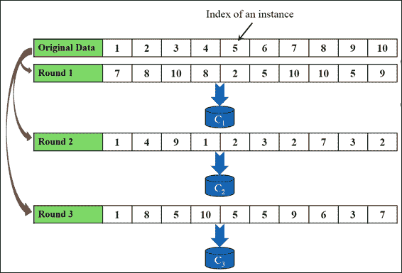

#### 议论纷纷

**摇摆** 是套袋的另一种变化。整个数据集用于训练每个模型。此外，权重是随机分配的。简而言之，摇摆是用额外的权重打包，这些权重是基于泊松或指数分布分配的。以下是摇摆算法:

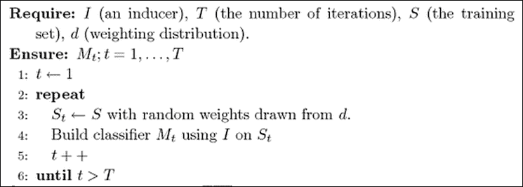

##### 随机森林

随机森林是另一种集成学习方法，它结合了多个决策树。下图表示随机森林集合:

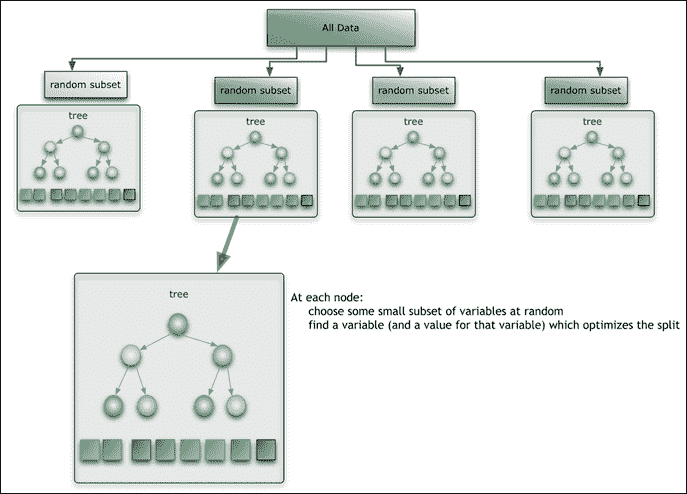

来源:[https://citizennet . com/blog/2012/11/10/random-forests-ensembles-and-performance-metrics/](https://citizennet.com/blog/2012/11/10/random-forests-ensembles-and-performance-metrics/)

对于具有 T 树的随机森林,决策树分类器的训练如下:

*   与标准装袋技术相似，定义了一个 *N* 案例的样本，随机替换以创建一个数据子集，约占综合数据集的 62-66%。
*   对于每个节点，执行如下操作:

    *   选择 *m* 预测变量，以使所识别的变量给出最佳分割(二进制分割)
    *   在下一个节点，选择做相同操作的其他 *m* 变量

*   *m* 的值可以变化

    *   用于随机拆分器选择— *m=1*
    *   用于 Breiman 的 bagger: *m=预测变量总数*
    *   对于随机森林， *m* 小于预测变量数，可以取三个值: *√m* ，*√m*

*现在，对于用于预测的随机森林的每个新输入，新值在所有树中向下运行，并使用平均值、加权平均值或投票多数来获得预测值。*

### *提示*

*在[第 5 章](ch05.html "Chapter 5. Decision Tree based learning")、*基于决策树的学习*中，我们已经详细介绍了随机森林。*

##### *梯度推进机(GBM)*

*GBM 是被广泛采用的机器学习算法之一。它们用于解决分类和回归问题。GBM 的基础是决策树，它们应用 boosting 技术，将多个弱算法在算法上结合起来，产生一个强学习器。它们是随机的和梯度增强的，这意味着它们迭代求解残差。*

*众所周知，它们是高度可定制的，因为它们可以使用各种损失函数。我们已经看到，随机森林集合技术针对 GBM 使用简单的平均，GBM 使用集合形成的实用策略。在这种策略中，新的模型被迭代地添加到集成中，其中每次迭代训练弱建模器来识别接下来的步骤。*

*GBM 是灵活的，并且比任何其他集成学习方法相对更有效。下表详细介绍了 GBM 算法:*

*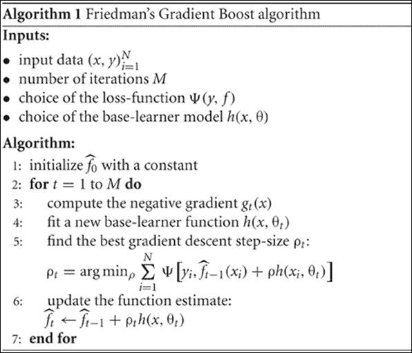*

***梯度增强回归树** ( **GBRT** ) 类似于遵循回归技术的 GBM。*

### *无监督集成方法*

*作为无监督集成学习方法的一部分，基于共识的集成之一是聚类集成。下图描述了基于聚类的集成的工作方式:*

*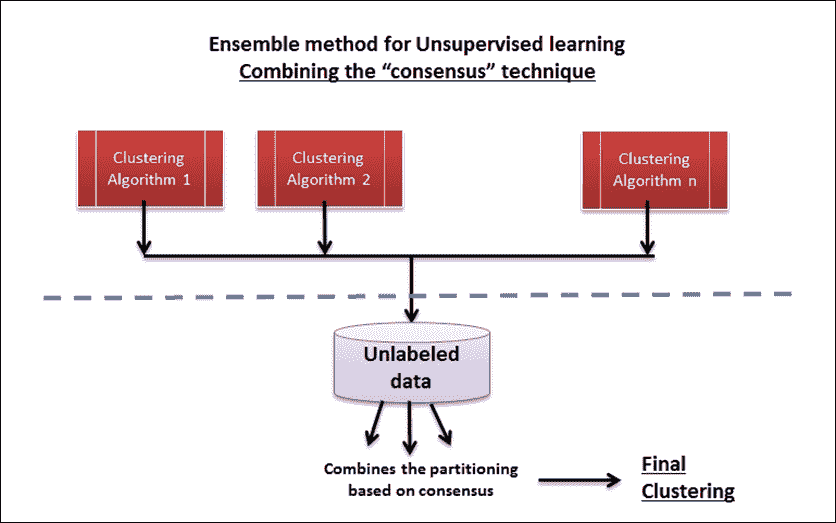*

*对于给定的未标记数据集 *D={x* [1] *，x* [2] *，…，x* [n] *}* ，聚类集成计算一组聚类*= { C*[1]*，C* [2] *，…。形成基于共识的统一集群。下图描述了这一流程:**

*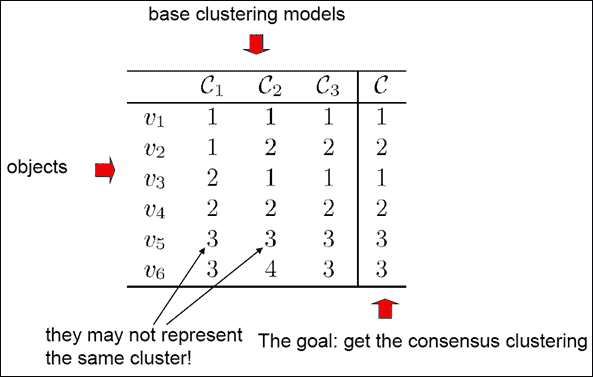**<title>Implementing ensemble methods</title>

# 实现集成方法

参考本章提供的源代码实现集成学习方法(仅限监督学习技术)。(技术的每个文件夹下的源代码路径`.../chapter13/...`)。

## 使用 Mahout

将参考到文件夹`.../mahout/chapter13/ensembleexample/`中。

## 使用 R

参考至文件夹`.../r/chapter13/ensembleexample/`。

## 使用火花

参考到文件夹`.../spark/chapter13/ensembleexample/`。

## 使用 Python (Scikit-learn)

参见文件夹`.../python (scikit-learn)/chapter13/ensembleexample/`。

## 利用朱丽亚

参考到文件夹`.../julia/chapter13/ensembleexample/`。

# 摘要

在这一章中，我们已经介绍了机器学习的集成学习方法。我们讨论了*群体智慧*的概念，如何以及何时将其应用于机器学习的环境中，以及如何提高学习者的准确性和表现。具体来说，我们看了一些有监督的集成学习技术和一些真实世界的例子。最后，本章提供了使用 R、Python (scikit-learn)、Julia 和 Spark 机器学习工具的梯度提升算法的源代码示例，以及使用 Mahout 库的推荐引擎。

本章涵盖了所有的机器学习方法，在接下来的最后一章，我们将涵盖一些先进的和即将推出的机器学习的架构和技术策略。*