# 第十四章。机器学习的新一代数据架构

这是我们的最后一章，我们将从我们通常的学习主题绕道而行，以涵盖机器学习的一些解决方案。这是试图完成一个关于机器学习解决方案的实现方面的从业者的观点，涵盖更多关于不同商业案例的平台选择。让我们看看 Hadoop、NoSQL 和其他相关的解决方案。新范式无疑是一个统一的平台架构，它照顾到机器学习的所有方面，从数据收集和准备开始，直到可视化，重点关注所有关键的架构驱动因素，如容量、源、吞吐量、延迟、可扩展性、数据质量、可靠性、安全性、自助服务和成本。

以下流程图描述了本章将涉及的不同数据架构范例:

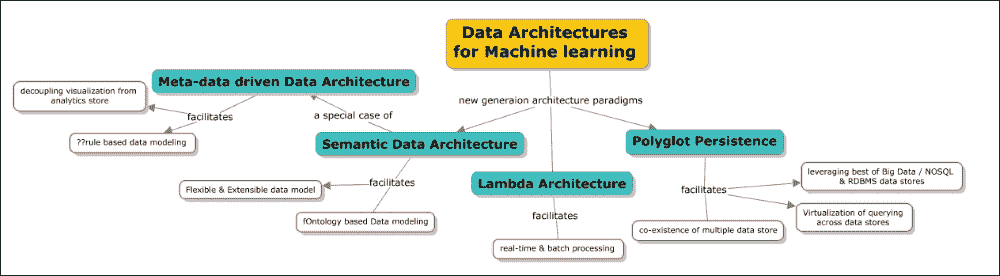

本章将深入介绍此处列出的主题:

*   简要介绍了传统数据架构的实现方式，以及在当前大数据和分析的背景下为什么需要传统数据架构。
*   概述机器学习环境下的新时代数据架构需求，包括 **提取、转换和加载** ( **ETL** )、存储、处理和报告、分发以及见解的呈现。
*   Lambda 架构介绍，结合一些示例介绍了批处理和实时处理的统一策略。
*   多语言持久性和多态数据库简介，统一了包括结构化、非结构化和半结构化数据存储在内的数据存储策略，并集中了跨数据存储的查询方法。Greenplum database 如何支持相同功能以及如何与 Hadoop 无缝集成的示例。
*   语义数据架构包括本体进化、目的、用例以及技术。

# 数据架构的发展

我们将从了解数据架构传统上是如何遵循的开始，然后详细说明大数据环境下现代机器学习或分析平台的需求。

观察 1—数据存储总是有目的的

传统上，数据架构有明确的目的划分， **OLTP** ( **在线事务处理**)，通常是已知用于事务需求的，以及 **OLAP** ( **在线分析处理**)数据存储，通常用于报告和分析需求。下表阐述了一般差异:

|   | 

OLTP 数据库

 | 

OLAP 数据库

 |
| --- | --- | --- |
| **定义** | 这个涉及许多小的在线事务(插入、更新和删除)。快速查询处理是核心要求；维护数据完整性、并发性和有效性是通过每秒的事务数量来衡量的。它通常以高度规范化为特征。 | 这个涉及的交易量相对较小。复杂的查询涉及数据的切片和切块。存储的数据通常是聚合的、历史的，并且大多存储在多维模式中(通常是星型模式)。 |
| **数据类型** | 操作数据 | 集成/合并/汇总数据 |
| **来源** | OLTP 数据库通常是数据的实际来源 | OLAP 数据库整合了来自各种 OLTP 数据库的数据 |
| **主要用途** | 这涉及日常业务流程/任务的执行 | 这有助于决策支持 |
| **反刍** | 这是由用户发起的简短、快速的插入和更新 | 周期性长时间运行的作业正在刷新数据 |
| **查询** | 这通常适用于较小的数据量，并执行较简单的查询 | 这通常包括复杂的查询，涉及多维结构中的聚合、切片和切块 |
| **吞吐量** | 由于相对较小的数据量和更快的运行查询，这通常非常快 | 此通常以批量和更大的容量运行，可能需要几个小时，具体取决于容量 |
| **存储容量** | 相对较小，因为历史数据已存档 | 由于所涉及的体积，这需要更大的存储空间 |
| **模式设计** | 高度规范化，有许多表格 | 这通常是用更少的表和使用星型和/或雪花型模式来反规范化的 |
| **备份和恢复** | 这需要适当的宗教备份；运营数据对业务运营至关重要。数据丢失可能会带来巨大的经济损失和法律责任 | 一些环境可能会考虑简单地重新加载 OLTP 数据作为恢复方法，而不是常规备份 |

观察 2—数据架构是共享磁盘

共享磁盘数据架构是指有一个数据磁盘保存所有数据，集群中的每个节点都可以访问这些数据进行处理的架构。在给定的时间点，任何节点都可以执行所有的数据操作，如果两个节点试图同时保存/写入一个元组，为了确保一致性，会传递基于磁盘的锁或预期的锁通信，从而影响性能。此外，随着节点数量的增加，数据库级别的争用也会增加。这些架构是受写限制的，因为需要跨集群中的节点处理锁。

即使在读取的情况下，也应该有效地实现分区，以避免完整的表扫描。所有传统的 RDBMS 数据库都是共享磁盘数据结构。

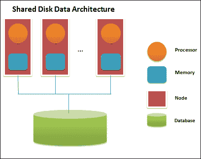

观察 3—传统的 ETL 架构有局限性。以下列表提供了这些限制的详细信息:

*   加入和集成数据既慢又贵。目前存在的大多数 ETL 逻辑都是定制编码的，并且与数据库紧密耦合。这种紧密耦合也导致了现有逻辑代码无法重用的问题。分析和报告需求需要应用一套不同的调优技术。分析优化既耗时又昂贵。
*   数据来源往往记录不良。数据含义是*在翻译中丢失*。上线后，上线数据的维护和分析成本通常非常高。重新创建数据沿袭是手动的、耗时的，并且容易出错。对数据转换没有强有力的审计或记录，通常在电子表格中跟踪。
*   目标数据很难使用。优化有利于已知的分析，但不太适合新的要求。使用了“一刀切”的规范视图，而不是“适合用途”的视图，或者缺少概念模型来轻松使用目标数据。很难确定哪些数据是可用的，如何获得访问权限，以及如何整合数据来回答问题。

观察结果 4—数据通常是结构化的

大多数时候，数据库被设计成适合 RDBMS 模型。如果传入的数据实际上不是结构化的，ETL 将构建一个存储在标准 OLTP 或 OLAP 存储中的结构。

观察 5—性能和可扩展性

给定基础设施，数据存储或查询的优化在一定程度上是可能的，超过某一点，就需要重新设计。

# 新兴观点&新时代数据架构的驱动因素

驱动 1— *大*数据介入。

我们在[第二章](ch02.html "Chapter 2. Machine learning and Large-scale datasets")、*机器学习和大规模数据集*中定义了大数据和大数据集概念。现在接收并需要处理的数据通常具有以下特征:

*   **来源**:根据信息的性质，来源可能是实时数据流(例如，贸易交易)，或者是包含自上次同步以来的更新的批量数据
*   **Content**: The data may represent different types of information. Often, this information is related to other pieces of data and is needed to be connected

    以下屏幕截图显示了需要支持的数据类型和不同来源:

    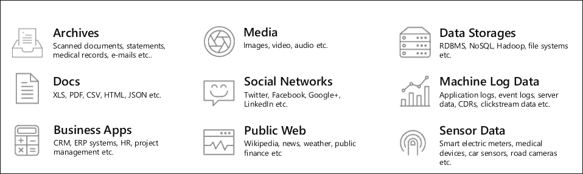
*   **数量**:根据数据的性质，正在处理的数量可能会有所不同。例如，主数据或证券定义数据是相对固定的，而交易数据与其他两者相比是巨大的。
*   **生命周期**:主数据有固定的生命周期，很少更新(比如，维度缓慢变化)。但是，事务性数据的寿命很短，但需要在更长的时间内可供分析、审计等使用。
*   **结构**:虽然大部分数据都是结构化的，但金融行业也出现了非结构化数据。对于金融系统来说，将非结构化数据作为其 It 架构的一部分变得越来越重要。

下一个图表描述了每个数据源的复杂性、速度量和各个方面:

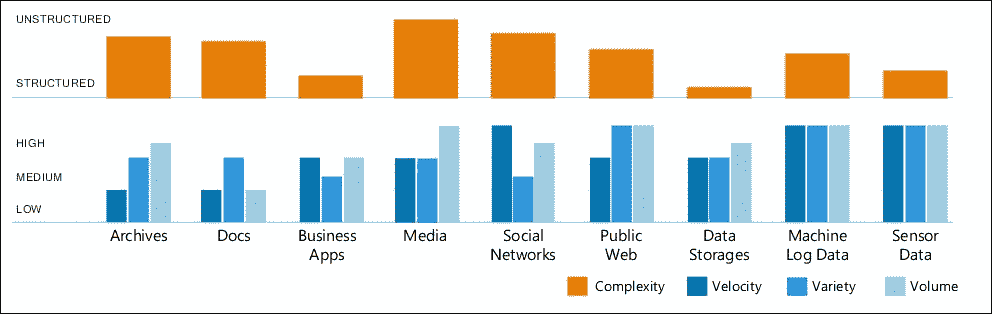

来源:软服务器

驱动因素 2—数据平台要求更高

新时代的前景——数据平台需求正在急剧扩大，而统一平台就是其中之一。接下来的概念图解释了这一切。数据架构的核心元素包括 ETL(提取、转换和加载)、存储、报告、分析、可视化和数据分发。

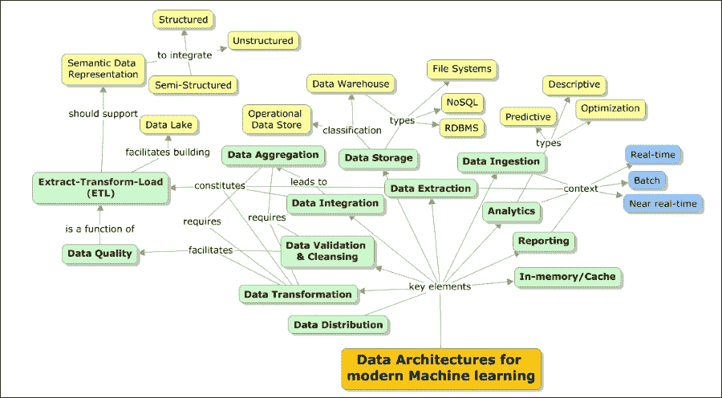

驱动因素 3—机器学习和分析平台现在有了新的用途和定义

下图描述了分析和 it 重新调整自身用途的演变:

*   从历史上看，重点仅仅是报告。聚集或预处理的数据被加载到仓库中，以了解发生了什么。这被称为**描述性分析** ，主要是一种倒退。
*   随着即席数据包含的出现，需要理解为什么会发生某些行为。这被称为**诊断分析** ，重点在于了解行为的根本原因，这也是基于历史数据。
*   现在，需求转移了，需要的是了解会发生什么。这称为 **预测分析，**重点是根据历史行为预测事件。
*   随着实时数据的出现，现在的焦点是我们能让它发生吗？这超出了预测性分析的范畴，在预测性分析中，补救是其中的一部分。最终的焦点是*让它发生！*随着实时事件访问的出现。下图描述了分析价值和相关复杂性的演变:

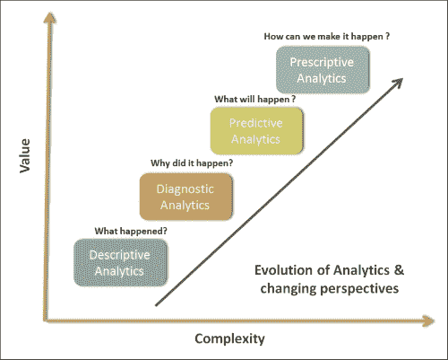

下表区分了传统分析(BI)和新时代分析:

| 

面积

 | 

传统分析(BI)

 | 

新时代分析

 |
| --- | --- | --- |
| **范围** | 描述性分析诊断分析 | 预测分析数据科学 |
| **数据** | 有限/受控体积预处理/验证基本型号 | 大容量多样的形式和丰富的多样性未经预处理的原始数据日益增长的模型复杂性 |
| **结果** | 这里，重点是回顾和根本原因分析 | 这里，重点是预测/洞察力和分析的准确性 |

驱动因素 4—它是不完全是关于历史和批次，它是实时和即时的洞察力

以较低的量和较高的速度到来的数据定义了*实时*。新的年龄分析系统有望处理实时、批处理和接近实时的处理请求(这些是预定的，称为微批处理)。下图描述了实时和批量数据特征的属性，包括恒定的体积、速度和变化。

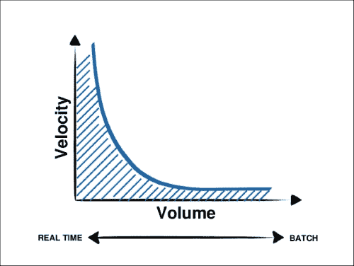

驱动因素 5—传统 ETL 无法处理*大*数据

目标是能够制定一个 ETL 架构策略，该策略可以解决以下问题领域:

*   促进标准化的实现——满足对一个标准的需求
*   支持构建可重用组件
*   构建不可知函数
*   使用并行处理技术提高性能和可伸缩性
*   降低总拥有成本**(**总拥有成本**)**
*   **建立专业技能库**

**下表提供了关键数据加载模式的对比分析:**

|   | 

抽取、转换、加载至目的端（extract-transform-load 的缩写）

提取、转换和加载

 | 

英语教学

提取、加载和转换

 | 

ETLT

提取、转换、加载和转换

 |
| --- | --- | --- | --- |
| **概述** | 这是一种用于移动和转换数据的传统技术，其中 ETL 引擎或者与源分离，或者由目标 DBMS 执行数据转换。 | 这是一种从一个位置移动和转换数据并将其格式化为另一个实例和格式的技术。在这种集成方式中，目标 DBMS 成为转换引擎。 | 在这种技术中，转换部分由 ETL 引擎完成，部分推送到目标 DBMS。 |
| **亮点** | 大量的转换工作在 ETL 引擎中完成。它使用集成的变换函数。转换逻辑可以通过 GUI 进行配置。这是由 Informatica 支持的。 | 转换的繁重工作就交给了 DBMS 层。转换逻辑更接近数据。它得到了 Informatica 的支持。 | 转换工作被分割在 ETL 引擎和 DBMS 之间。它得到了 Informatica 的支持。 |
| **好处** | 这是一个简单的基于 GUI 的配置。转换逻辑是独立的，在数据库之外，并且是可重用的这对于不需要任何数据库调用的细粒度、简单、面向函数的转换非常有效。可以在 SMP 或 MPP 硬件上运行。 | 这个利用 RDBMS 引擎硬件实现可伸缩性。它总是将所有数据保存在 RDBMS 中。它根据数据集进行并行化，并且磁盘 I/O 通常在引擎级别进行优化，以获得更快的吞吐量。只要硬件和 RDBMS 引擎能够继续扩展，它就可以扩展。在经过适当调整的 MPP RDBMS 平台上，可以实现 3 到 4 倍的吞吐率。 | 它可以平衡工作负载或与 RDBMS 共享工作负载。 |
| **风险** | 这个在 ETL 端需要更高的处理能力。成本更高。它由需要引用数据的复杂转换组成，这将会降低过程的速度。 | 转换逻辑与数据库相关联。涉及较小体积和简单性质的转换不会获得很多好处。 | 这个在数据库中仍然有一部分转换逻辑。 |

**事实 6—没有“一个”数据模型适合高级或复杂的数据处理要求；需要多数据模型平台**

**不同的数据库旨在解决不同的问题。使用单个数据库引擎来满足所有需求通常会导致非高性能的解决方案。众所周知，RDBMSs 工作得很好——事务操作，OLAP 数据库用于报告，NoSQL 用于大容量数据处理和存储。一些解决方案统一了这些存储，并提供了跨这些存储进行查询的抽象。**

**<title>Modern data architectures for Machine learning</title>

# 机器学习的现代数据架构

从这一部分开始，我们将详细介绍一些新兴的数据架构、导致该实现架构的架构出现的挑战、一些相关的技术栈以及这些架构适用的用例。

## 语义数据架构

上一节中的新兴观点中涉及的一些事实引发了以下核心架构驱动因素，以构建语义数据模型驱动的数据湖，无缝集成更大的数据范围，这为分析做好了准备。分析的未来是语义化的。这里的目标是创建一个大规模的、灵活的、标准驱动的 ETL 架构框架，该框架在工具和其他架构资产的帮助下建模，以实现以下功能:

*   支持可以是标准架构的通用数据架构。
*   与本体驱动的数据架构和未来的数据湖相吻合(将这种架构策略与数据聚合参考架构联系起来是很重要的)。这将确保有一个单一的数据策略来处理数据质量和数据集成。
*   使产品组能够快速集成到数据架构中，并交付到公共数据存储库中并从中提取数据。
*   按需启用即席分析。
*   减少实现新的数据聚合、接收和转换所需的时间。
*   支持将*任何格式转换为任何格式*模型(一种与格式无关的方法，有时涉及数据规范化)。
*   符合新兴的语义标准。这将带来灵活性。
*   实现通用 IT 管理并降低总拥有成本。
*   为 Broadridge 主业务数据存储库启用整合的云(可以是专有的)。
*   使所有的应用和产品能够“使用同一种语言”并构建 Broadridge 数据格式。
*   减少并在某些情况下消除过多许可证、数据库、实现、栈等的扩散。
*   数据语义化:分析底层模式以揭示其中的含义非常重要。语义化过程总是迭代的，并且随着时间的推移而演变。在这一过程中，将详细阐述或扩展这方面的元数据定义。【T2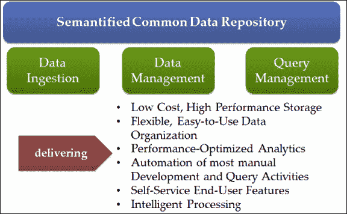

建立一个企业范围的聚合数据集市并不能解决前面提到的问题。即使建立了这样一个数据集市，保持它的更新并与其他项目保持一致也是一个大问题。如前所述，需要设计一个系统的通用参考体系结构，该体系结构可以从许多来源积累数据，而无需对如何、在哪里或何时使用这些数据做出任何假设。

该领域有两个不同的进展，我们可以利用它们来解决架构级别的问题。这些是作为架构模式的数据湖的演变，语义网的出现及其在电子商务中日益增长的相关性。

### 商业数据湖

企业数据湖给了企业数据仓库一个全新的概念。虽然数据仓库的方法一直是设计一个单一的模式，并聚合满足该模式所需的最少信息，但数据湖颠覆了传统数据仓库体系结构的这两个前提。传统的数据仓库是为特定目的而设计的(例如，分析、报告和运营洞察)。模式被相应地设计，并且为此目的所需的最少信息被聚集。这意味着将这个仓库用于任何其他目的只是偶然的，但它不是为这种用途而设计的。

业务数据湖促进了适当模式的概念——仓库不受固定的、预先确定的模式的约束。这使得数据湖能够吸收组织中可用的信息。重要的直接含义是，数据湖可以吸收组织中产生的所有信息，而不是吸收最少的信息。由于没有关于数据是什么的假设，因此可以选择在将来将该信息用于任何目的。这使得数据湖能够利用数据湖中已经可用的数据来提供更新的想法，从而增强业务敏捷性。

业务数据湖解决了以下问题:

*   如何处理非结构化数据？
*   如何链接内部和外部数据？
*   如何适应业务变化的速度？
*   如何去除重复的 ETL 循环？
*   如何基于不同的业务需求支持不同级别的数据质量和治理？
*   如何让地方事业单位主动出击？
*   如何确保平台的发布和被采用？

### 语义网技术

当使用 web 上最常见的外部数据时，最重要的需求是理解数据的精确语义。没有这一点，结果是不可信的。这里，语义网技术来拯救我们，因为它们允许为任何可用的资源指定从非常简单到非常复杂的语义。语义网技术不仅支持捕获被动语义，还支持对数据的主动推断和推理。

语义 Web 技术允许用额外的元数据(如 RDF)对数据进行注释。这增加的最基本的能力之一是语义计算的 **AAA 原则**是— *任何人可以在任何时间添加关于任何事情的任何事情*。由于信息是由元数据组成的，添加更多的元数据可以随时丰富信息。

查询 RDF 数据是使用 SPARQL 完成的，它允许导航复杂的关系图以从数据存储中提取有意义的信息。推理机(或推理引擎)使用 RDF 元数据在数据的顶部传递推理。这允许系统提取新的见解，这些见解最初在输入数据中是不可用的。

今天，大量的信息通过网络、公司和监管网络变得可用。然而，只要信息是单独存储的，没有简单的方法将不同来源的信息组合起来，对所有可用信息的访问就仍然是有限的。

这就更加需要合适的方法来组合来自不同来源的数据。这被称为信息系统的*合作。这被定义为以对最终用户透明的方式在异构源之间共享、组合和交换信息的能力。众所周知，这些异构数据源总是在孤岛中处理数据，因此它们是不可访问的。为了实现数据互操作性，需要消除数据异构性带来的问题。数据来源可以通过以下方式异构化:*

*   **句法**:句法异构是由不同模型或语言的使用引起的
*   **图式**:图式异质性源于结构差异
*   **语义**:语义异构是指数据在各种上下文中的不同含义或解释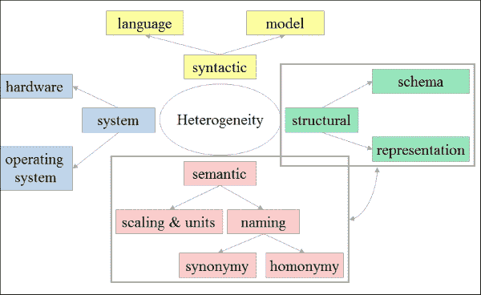

数据集成提供了跨多个数据源透明地操作数据的能力。基于该架构，有两个系统:

*   **中央数据集成**:一个中央数据集成系统通常有一个全局模式，为用户提供一个统一的接口来访问存储在数据源中的信息。
*   **对等**:相比之下在对等数据集成系统中，在数据源(或对等体)上没有一般的控制点。相反，任何对等点都可以接受用户对分布在整个系统中的信息的查询。

信息系统的协作是共享、组合和/或交换来自多个信息源的信息的能力，以及最终接收者透明地访问集成信息的能力。阻碍信息系统协作的主要问题是信息源的自治性、分布性、异构性和不稳定性。特别是，我们对可以在几个层次上识别的异质性问题感兴趣:系统、句法、结构和语义的异质性。人们对信息系统的协作进行了广泛的研究，并提出了几种方法来弥合异构信息系统之间的差距，例如:数据库翻译、标准化、联合、中介和 web 服务。这些方法在语法和基本层面上为异构性问题提供了适当的解决方案。

然而，为了实现异构信息系统之间的语义互操作性，必须在系统中理解被交换的信息的含义。每当两个上下文使用不同的信息解释时，就会发生语义冲突。

因此，为了处理语义异构性，需要更多的语义专门化方法，如本体论。在这一章中，我们的重点是展示信息系统如何使用语义进行协作。在下一节中，让我们看看语义数据架构的构成。

#### 本体和数据集成

这里的图表代表了基于语义数据架构的分析的参考架构:

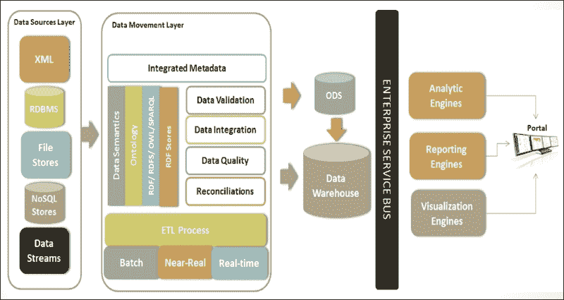

语义数据架构的主要特点如下:

*   **元数据表示**:每一个源都可以表示为由元数据字典支持的本地本体，以解释术语。
*   **全局概念化**:将会有一个全局本体定义来映射本地本体，并为一个公共视图提供一个单独的视图或术语。
*   **通用查询**:根据消费者/客户的需求和目的，将支持在全局本体级别的局部查询。
*   **物化视图**:一种高级查询策略，屏蔽了术语和对等源之间的查询。
*   **映射**:将支持定义基于同义词库的本体属性和值之间的映射。

### 供应商

| 

类型

 | 

产品/框架

 | 

小贩

 |
| --- | --- | --- |
| 开源和商业版本 | MarkLogic 8 是 NoSQL 图存储，支持存储和处理 RDF 数据格式，可以作为三重存储。 | MarkLogic |
| 开源和商业版本 | Stardog 是最简单和最强大的图形数据库:在一个轻量级的纯 Java 系统中进行搜索、查询、推理和约束。 | 明星日志 |
| 开放源码 | 4Store 是一个高效、可扩展且稳定的 RDF 数据库。 | 加里克有限公司 |
| 开放源码 | Jena 是一个免费的开源 Java 框架，用于构建语义网和链接数据应用。 | 街头流氓 |
| 开放源码 | Sesame 是一个强大的 Java 框架，用于处理 RDF 数据。这包括创建、解析、存储、推理和查询此类数据。它提供了一个易于使用的 API，可以连接到所有领先的 RDF 存储解决方案。 | GPL v2 |
| 开放源码 | Blazegraph 是 SYSTAP 的旗舰图形数据库。它是专门为支持大图而设计的，提供语义 Web (RDF/SPARQL)和图数据库(TinkerPop、blueprints 和以顶点为中心的 API)。 | GPL v2 |

## 多模型数据库架构/多语言持久性

即使在五年前，我们也无法想象关系数据库会成为一种数据库技术，而不是数据库技术。互联网规模的数据处理改变了我们处理数据的方式。

新一代架构，如脸书、维基百科、SalesForce 等，其原理和范例与当前数据管理技术发展的成熟理论基础完全不同。

这些架构的主要架构挑战可以概括如下:

*   Commoditizing information:

    苹果应用商店、SaaS、无处不在的计算、移动性和基于云的多租户架构，从商业角度来说，释放了信息交付商品化的能力。这种模式几乎改变了所有的体系结构决策，因为我们现在需要考虑可以作为服务提供和计费的“信息单元”是什么，而不是考虑解决方案的总体拥有成本。

*   Theoretical limitations of RDBMS:

    颇具影响力的数据库理论家迈克尔·斯通布雷克最近在互联网规模架构的核心部分写了一个新的数据处理和管理的理论模型。数据库管理的理论已经有三十多年的历史了，当它们被设计时，它们是为大型机类型的计算环境和非常不可靠的电子组件而设计的。系统和应用的性质和功能已经发生了巨大的变化。随着可靠性成为底层环境的质量属性，系统由并行处理核心组成，数据创建和使用的性质发生了巨大的变化。为了将这些新环境的解决方案概念化，我们需要从计算的角度来设计解决方案架构，而不仅仅是从工程的角度。

六大力量正在推动今天的数据革命。它们如下:

*   大规模并行处理
*   商品化的信息传递
*   无处不在的计算和移动设备
*   非 RDBMS 和语义数据库
*   社区计算
*   云计算

Hadoop 和 MapReduce 在一个实质性的基础上释放了大规模的数据并行处理，并在一个程序化的平台上制作了复杂的计算算法。这永远改变了分析和商业智能。类似地，web 服务和 API 驱动的架构已经使信息交付在很大程度上商品化了。今天，有可能以这样一种方式构建非常大的系统，即每个子系统或组件本身是一个完整的平台，由一个完全不同的实体托管和管理。

之前的创新彻底改变了传统的数据架构。特别是，语义计算和本体驱动的信息建模已经彻底改变了数据设计。

从哲学上讲，数据架构正在经历一个事实基础。在传统的数据模型中，我们首先设计*数据模型*——对世界及其未来的固定的、设计时的理解。数据模型将数据的含义永远固定在一个固定的结构中。

表只不过是一个类别，一组东西。因此，只有当我们理解数据所属的集合/类别时，数据才有意义。例如，如果我们将一个汽车加工系统分成几个类别，如四轮车、两轮车、商用车等等，这种划分本身就有一些重要的含义。存储在每个类别中的数据并不能揭示设计的*目的，而设计*的目的是嵌入在类别的设计方式中的。例如，另一个系统可能根据其传动系统来看待汽车世界——电力、石油动力、核能等等。这种分类本身以某种方式揭示了系统的目的，这是不可能从任何单个记录的属性中获得的。

术语*多语者* 通常用来定义一个会说多种语言的人。在大数据环境中，该术语指的是一组使用多种数据库技术的应用，其中每种数据库技术解决一个特定的问题。这种数据架构的基本前提是不同的数据库技术解决各种问题，由于复杂的应用有许多问题，选择一个选项来解决特定的问题比试图使用一个选项来解决所有问题要好。当我们谈论一个数据系统时，它被定义为一个负责数据存储和查询的系统，它有几年的运行时间，需要解决每一个可能的硬件和维护复杂性。

当有一个复杂的问题，被分解成更小的问题并通过应用不同的数据库模型来解决时，使用多语言持久性数据架构。随后，将结果汇总到混合数据存储平台，然后进行分析。影响数据库选择的一些因素如下:

因素 1—数据模型:

*   我们想要集成什么类型的数据源？
*   我们希望如何处理/分析数据？
*   数据的数量、种类和速度是多少？
*   示例—关系、键值、面向列、面向文档、图形等等。

因素 2—一致性、可用性和分区(CAP):

*   **一致性**:一个对象对每个客户端只有一个值(原子性)
*   **可用性**:所有对象始终可用(低延迟)
*   **分区容差**:数据被分割成多个网络分区(集群)

CAP 定理要求我们选择这里描述的两个特征中的任何一个:

下图是一个系统的例子，该系统有多个应用，并为其构建了一个数据模型:

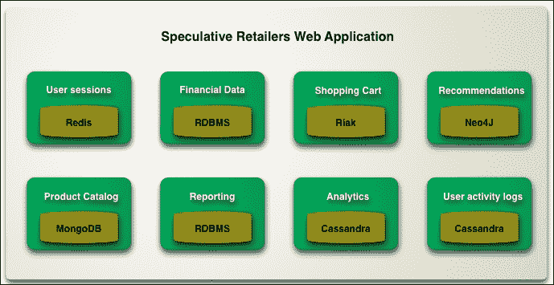

来源:ThoughtWorks

影响该解决方案的一些重要方面如下所列:

*   必须清楚地了解提议的混合环境，以确保它有助于做出关于数据集成、分析、数据可见性等方面的正确决策，以及解决方案如何融入整个大数据和分析实现体系，这一点非常重要。
*   由于存在不止一个数据模型，因此需要一个统一的平台，能够与所有确定用于解决方案和聚合的数据库进行接口。该平台应满足一些最起码的大数据平台期望，如:容错高可用性、事务完整性、数据敏捷性和可靠性、可伸缩性和性能。
*   根据特定的需求，知道/理解哪种数据模型既适用于特定的问题又适用于整体解决方案，这一点很重要。
*   数据摄取策略处理实时和批量数据更新，以及如何使它们在多模型数据库的环境中工作。既然会有各种各样的数据存储，那么记录 ( **SOR** )的**系统会是什么呢？我们如何确保所有数据源中的数据是同步的或最新的？**

因此，总体而言，这可能是一个最好的大数据挑战。需要收集、集成和分析结构非常不同的多个数据源，以解决特定的业务问题。然后，关键是确定数据是需要按需推送还是实时推送至客户端。显然，这种类型的问题无法用一种数据库技术轻松或经济地解决。在某些情况下，简单的 RDBMS 可以工作，但是在有非关系数据的情况下，就需要不同的持久化引擎，比如 NoSQL。类似地，对于电子商务业务问题，我们有一个高可用性和可伸缩的购物车功能数据存储是很重要的。然而，要找到特定群体购买的产品，同一家商店无法提供帮助。这里需要采用一种混合方法，将多个数据存储结合使用，这就是所谓的多语言持久性。

### 小贩

| 

类型

 | 

产品/框架

 | 

小贩

 |
| --- | --- | --- |
| 商业 | FoundationDB 是一个坚如磐石的数据库，提供 NoSQL(键值存储)和 SQL 访问。 | 基础数据库 |
| 开放源码 | ArangoDB 是一个开源的 NoSQL 解决方案，为文档、图形和键值提供了灵活的数据模型。 | GPL v2 |

## λ架构(LA)

Lambda 架构解决了机器学习的一个重要方面；也就是说，为实时和批量分析提供统一的平台。到目前为止我们看到的大部分框架都支持批处理架构(例如 Hadoop)，为了支持与特定框架的实时处理集成(例如 Storm)。

Nathan Marz 引入了 Lambda 架构的概念，这是一个通用的、可伸缩的、容错的数据处理架构，它将基于实时流的处理和批处理作为一个统一的产品来解决。

Lambda 架构促进了一种高度容错的数据架构，既针对硬件故障又针对人为错误。同时，它服务于广泛的用途和工作负载，这些用途和工作负载需要低延迟读取和更新。最终的系统应该是线性可扩展的，并且应该是向外扩展而不是向上扩展。

以下是从高层次的角度来看:

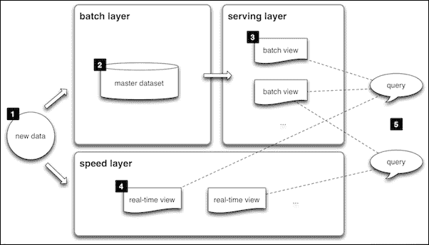

*   **数据层**:所有进入系统的数据都被调度到批处理层和速度层进行处理。
*   **批量层**:该管理主数据，负责批量预计算。它处理大量的数据。
*   **速度层**:速度层负责处理最近的数据，补偿服务层更新的高延迟。平均而言，这一层不处理大量数据。
*   **服务层**:服务层处理批处理视图的索引，并有助于证明低延迟的特别查询。
*   **查询功能**:结合批次视图和实时视图的结果。

### 供应商

| 

类型

 | 

产品/框架

 | 

小贩

 |
| --- | --- | --- |
| 开放源和商业 | Spring XD 是一个碎片化 Hadoop 生态系统的统一平台。它构建于久经考验的开源项目之上，显著简化了大数据工作负载和数据管道的编排。 | 枢轴(弹簧源) |
| 开放源码 | Apache Spark 是一个快速的传统大数据处理引擎，内置了流、SQL、机器学习和图形处理模块。 | 街头流氓 |
| 打开信号源 | Oryx 是一个简单、实时、大规模的机器学习基础设施。 | 阿帕奇(云时代) |
| 开放源码 | storm 是一个用于实时处理流数据的系统。 | 阿帕奇(Hortonworks) |

# 总结

在这最后一章，我们的重点是机器学习的实现方面。我们已经了解了传统的分析平台，以及它们如何无法满足现代数据需求。您还了解了推动新数据架构范例(如 Lamda 架构和 polyglot 持久性(多模型数据库架构))的架构驱动因素，以及语义架构如何帮助无缝数据集成。通过这一章，你可以假设你已经准备好为任何领域实现一个机器学习解决方案，不仅有能力识别什么算法或模型将被应用于解决一个学习问题，而且有能力识别什么平台解决方案将以最好的方式解决它。**